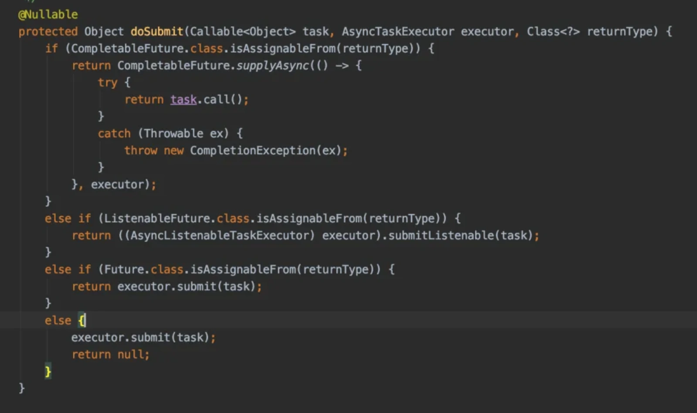

# @Async异步失效问题

## **<font style="color:rgb(34, 34, 34);background-color:rgb(248, 246, 244);">前言</font>**
<font style="color:rgb(51, 51, 51);background-color:rgb(248, 246, 244);">最近有粉丝问了我一个问题：他在项目某个方法使用@Async注解，但是该方法还是同步执行了，异步不起作用，到底是什么原因呢？</font>

<font style="color:rgb(51, 51, 51);background-color:rgb(248, 246, 244);">伪代码如下：</font>

```less
@Slf4j
@Service
public class UserService {

    @Async
    public void async(String value) {
        log.info("async:" + value);
    }
}
```

<font style="color:rgb(51, 51, 51);background-color:rgb(248, 246, 244);">这个问题还是比较有意思的，今天这篇文章总结了@Async注解失效的9种场景，希望对你会有所帮助。</font>

## **<font style="color:rgb(34, 34, 34);background-color:rgb(248, 246, 244);">1 未使用@EnableAsync注解</font>**
<font style="color:rgb(51, 51, 51);background-color:rgb(248, 246, 244);">在Spring中要开启@Async注解异步的功能，需要在项目的启动类，或者配置类上，使用@EnableAsync注解。</font>

<font style="color:rgb(51, 51, 51);background-color:rgb(248, 246, 244);">例如：</font>

```less
@EnableAsync
@SpringBootApplication(exclude = {DataSourceAutoConfiguration.class})
public class Application {

    public static void main(String[] args) {
        SpringApplication.run(Application.class, args);
    }
}
```

<font style="color:rgb(51, 51, 51);background-color:rgb(248, 246, 244);">@EnableAsync注解相当于一个开关，控制是否开启@Async注解异步的功能，默认是关闭的。</font>

<font style="color:rgb(51, 51, 51);background-color:rgb(248, 246, 244);">如果在项目的启动类上没使用@EnableAsync注解，则@Async注解异步的功能不生效。</font>

## **<font style="color:rgb(34, 34, 34);background-color:rgb(248, 246, 244);">2 内部方法调用</font>**
<font style="color:rgb(51, 51, 51);background-color:rgb(248, 246, 244);">我们在日常开发中，经常需要在一个方法中调用另外一个方法，例如：</font>

```typescript
@Slf4j
@Service
public class UserService {

    public void test() {
        async("test");
    }

    @Async
    public void async(String value) {
        log.info("async:{}", value);
    }
}
```

<font style="color:rgb(51, 51, 51);background-color:rgb(248, 246, 244);">这个示例中，在UserService类中的test()方法中调用了async()方法。</font>

<font style="color:rgb(51, 51, 51);background-color:rgb(248, 246, 244);">如果在controller中@Autowired了UserService类的对象，调用了它的test()方法，则async()异步的功能会失效。</font>

<font style="color:rgb(51, 51, 51);background-color:rgb(248, 246, 244);">我们知道Spring通过@Async注解实现异步的功能，底层其实是通过Spring的AOP实现的，也就是说它需要通过JDK动态代理或者cglib，生成代理对象。</font>

<font style="color:rgb(51, 51, 51);background-color:rgb(248, 246, 244);">异步的功能，是在代理对象中增加的，我们必须调用代理对象的test()方法才行。</font>

<font style="color:rgb(51, 51, 51);background-color:rgb(248, 246, 244);">而在类中直接进行方法的内部调用，在test()方法中调用async()方法，调用的是该类原对象的async方法，相当于调用了this.async()方法，而并非UserService代理类的async()方法。</font>

<font style="color:rgb(51, 51, 51);background-color:rgb(248, 246, 244);">因此，像这种内部方法调用，@Async注解的异步功能会失效。</font>

## **<font style="color:rgb(34, 34, 34);background-color:rgb(248, 246, 244);">3 方法非public</font>**
<font style="color:rgb(51, 51, 51);background-color:rgb(248, 246, 244);">在Java中有4种权限修饰符</font>

+ <font style="color:rgb(51, 51, 51);background-color:rgb(248, 246, 244);">public：所有类都可以访问。</font>
+ <font style="color:rgb(51, 51, 51);background-color:rgb(248, 246, 244);">private：只能同一个类访问。</font>
+ <font style="color:rgb(51, 51, 51);background-color:rgb(248, 246, 244);">protected：同一个类，同一个包下的其他类，不同包下的子类可以访问。</font>
+ <font style="color:rgb(51, 51, 51);background-color:rgb(248, 246, 244);">默认修饰符：同一个类，同一个包下的其他类可以访问。</font>

<font style="color:rgb(51, 51, 51);background-color:rgb(248, 246, 244);">在实际工作中，我们使用频率最高的可能是public和private了。</font>

<font style="color:rgb(51, 51, 51);background-color:rgb(248, 246, 244);">如果我在定义Service类中的某个方法时，有时把权限修饰符定义错了，例如：</font>

```less
@Slf4j
@Service
public class UserService {

    @Async
    private void async(String value) {
        log.info("async:{}", value);
    }
}
```

<font style="color:rgb(51, 51, 51);background-color:rgb(248, 246, 244);">这个例子中将UserService类的async()方法的权限修饰符定义成了private的，这样@Async注解也会失效。</font>

<font style="color:rgb(51, 51, 51);background-color:rgb(248, 246, 244);">因为private修饰的方法，只能在UserService类的对象中使用。</font>

<font style="color:rgb(51, 51, 51);background-color:rgb(248, 246, 244);">而@Async注解的异步功能，需要使用Spring的AOP生成UserService类的代理对象，该代理对象没法访问UserService类的private方法，因此会出现@Async注解失效的问题。</font>

## **<font style="color:rgb(34, 34, 34);background-color:rgb(248, 246, 244);">4 方法返回值错误</font>**
<font style="color:rgb(51, 51, 51);background-color:rgb(248, 246, 244);">我们在写一个新的方法时，经常需要定义方法的返回值。</font>

<font style="color:rgb(51, 51, 51);background-color:rgb(248, 246, 244);">返回值可以是void、int、String、User等等，但如果返回值定义错误，也可能会导致@Async注解的异步功能失效。</font>

<font style="color:rgb(51, 51, 51);background-color:rgb(248, 246, 244);">例如：</font>

```typescript
@Service
public class UserService {

    @Async
    public String async(String value) {
        log.info("async:{}", value);
        return value;
    }
}
```

<font style="color:rgb(51, 51, 51);background-color:rgb(248, 246, 244);">UserService类的async方法的返回值是String，这种情况竟然会导致@Async注解的异步功能失效。</font>

<font style="color:rgb(51, 51, 51);background-color:rgb(248, 246, 244);">在AsyncExecutionInterceptor类的invoke()方法，会调用它的父类AsyncExecutionAspectSupport中的doSubmit方法，该方法时异步功能的核心代码，如下：</font>



<font style="color:rgb(51, 51, 51);background-color:rgb(248, 246, 244);">从图中看出，@Async注解的异步方法的返回值，要么是Future，要么是null。</font>

<font style="color:rgb(51, 51, 51);background-color:rgb(248, 246, 244);">因此，在实际项目中，如果想要使用@Async注解的异步功能，相关方法的返回值必须是void或者Future。</font>

## **<font style="color:rgb(34, 34, 34);background-color:rgb(248, 246, 244);">5 方法用static修饰了</font>**
<font style="color:rgb(51, 51, 51);background-color:rgb(248, 246, 244);">有时候，我们的方法会使用static修饰，这样在调用的地方，可以直接使用类名.方法名，访问该方法了。</font>

<font style="color:rgb(51, 51, 51);background-color:rgb(248, 246, 244);">但如果在@Async方法上加了static修饰符，例如：</font>

```less
@Slf4j
@Service
public class UserService {

    @Async
    public static void async(String value) {
        log.info("async:{}", value);
    }
}
```

<font style="color:rgb(51, 51, 51);background-color:rgb(248, 246, 244);">这时@Async的异步功能会失效，因为这种情况idea会直接报错：Methods annotated with '@Async' must be overridable 。</font>

<font style="color:rgb(51, 51, 51);background-color:rgb(248, 246, 244);">使用@Async注解声明的方法，必须是能被重写的，很显然static修饰的方法，是类的静态方法，是不允许被重写的。</font>

<font style="color:rgb(51, 51, 51);background-color:rgb(248, 246, 244);">因此这种情况下，@Async注解的异步功能会失效。</font>

## **<font style="color:rgb(34, 34, 34);background-color:rgb(248, 246, 244);">6 方法用final修饰</font>**
<font style="color:rgb(51, 51, 51);background-color:rgb(248, 246, 244);">在Java种final关键字，是一个非常特别的存在。</font>

<font style="color:rgb(51, 51, 51);background-color:rgb(248, 246, 244);">用final修饰的类，没法被继承。</font>

<font style="color:rgb(51, 51, 51);background-color:rgb(248, 246, 244);">用final修饰的方法，没法被重写。</font>

<font style="color:rgb(51, 51, 51);background-color:rgb(248, 246, 244);">用final修饰的变量，没法被修改。</font>

<font style="color:rgb(51, 51, 51);background-color:rgb(248, 246, 244);">如果final使用不当，也会导致@Async注解的异步功能失效，例如：</font>

```typescript
@Slf4j
@Service
public class UserService {

    public void test() {
        async("test");
    }

    @Async
    public  final void async(String value) {
        log.info("async:{}", value);
    }
}
```

<font style="color:rgb(51, 51, 51);background-color:rgb(248, 246, 244);">这种情况下idea也会直接报错：Methods annotated with '@Async' must be overridable 。</font>

<font style="color:rgb(51, 51, 51);background-color:rgb(248, 246, 244);">因为使用final关键字修饰的方法，是没法被子类重写的。</font>

<font style="color:rgb(51, 51, 51);background-color:rgb(248, 246, 244);">因此这种情况下，@Async注解的异步功能会失效。</font>

## **<font style="color:rgb(34, 34, 34);background-color:rgb(248, 246, 244);">7 业务类没加@Service注解</font>**
<font style="color:rgb(51, 51, 51);background-color:rgb(248, 246, 244);">有时候，我们在新加Service类时，会忘了加@Service注解，例如：</font>

```typescript
@Slf4j
//@Service
public class UserService {

    @Async
    public void async(String value) {
        log.info("async:{}", value);
    }
}

@Service
public class TestService {

   @Autowired
   private UserService userService;

    public void test() {
        userService.async("test");
    }
}
```

<font style="color:rgb(51, 51, 51);background-color:rgb(248, 246, 244);">这种情况下，@Async注解异步的功能也不会生效。因为UserService类没有使用@Service、@Component或者@Controller等注解声明，该类不会被Spring管理，因此也就无法使用Spring的异步功能。</font>

## **<font style="color:rgb(34, 34, 34);background-color:rgb(248, 246, 244);">8 自己new的对象</font>**
<font style="color:rgb(51, 51, 51);background-color:rgb(248, 246, 244);">在项目中，我们经常需要new一个对象，然后对他赋值，或者调用它的方法。</font>

<font style="color:rgb(51, 51, 51);background-color:rgb(248, 246, 244);">但如果new了一个Service类的对象，可能会出现一些意想不到的问题，例如：</font>

```typescript
@Slf4j
@Service
public class UserService {

    @Async
    public void async(String value) {
        log.info("async:{}", value);
    }
}

@Service
public class TestService {

    public void test() {
        UserService userService = new UserService();
        userService.async("test");
    }
}
```

<font style="color:rgb(51, 51, 51);background-color:rgb(248, 246, 244);">在TestService类的test()方法中，new了一个UserService类的对象，然后调用该对象的async()方法。</font>

<font style="color:rgb(51, 51, 51);background-color:rgb(248, 246, 244);">很显然这种情况下，async()方法只能同步执行，没法异步执行。</font>

<font style="color:rgb(51, 51, 51);background-color:rgb(248, 246, 244);">因为在项目中，我们自己new的对象，不会被Spring管理，因此也就无法使用Spring的异步功能。</font>

<font style="color:rgb(51, 51, 51);background-color:rgb(248, 246, 244);">不过我们可以通过BeanPostProcessor类，将创建的对象手动注入到Spring容器中。</font>

## **<font style="color:rgb(34, 34, 34);background-color:rgb(248, 246, 244);">9 Spring无法扫描异步类</font>**
<font style="color:rgb(51, 51, 51);background-color:rgb(248, 246, 244);">我们在Spring项目中可以使用@ComponentScan注解指定项目中扫描的包路径，例如：</font>

```less
@ComponentScan({"com.susan.demo.service1"})
@SpringBootApplication(exclude = {DataSourceAutoConfiguration.class})
public class Application {

    public static void main(String[] args) {
        SpringApplication.run(Application.class, args);
    }
}
```

<font style="color:rgb(51, 51, 51);background-color:rgb(248, 246, 244);">项目中com.susan.demo.service1这个路径是不存在的，会导致@Async注解异步的功能失效。</font>

<font style="color:rgb(51, 51, 51);background-color:rgb(248, 246, 244);">同时如果@ComponentScan注解定义的路径，没有包含你新加的Servcie类的路径，@Async注解异步的功能也会失效。</font>


> 更新: 2024-05-20 17:07:53  
> 原文: <https://www.yuque.com/yuqueyonghue6cvnv/cxhfwd/gm58hfscvgcmnsd2>