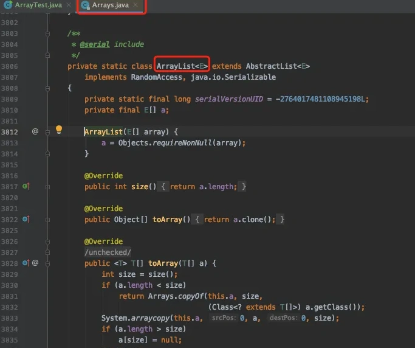
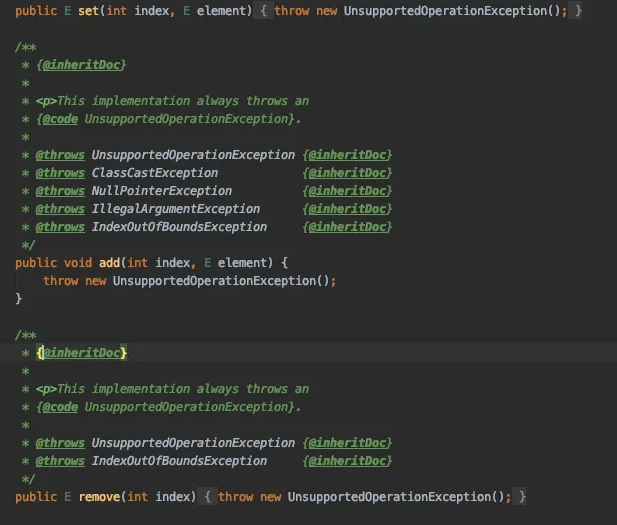
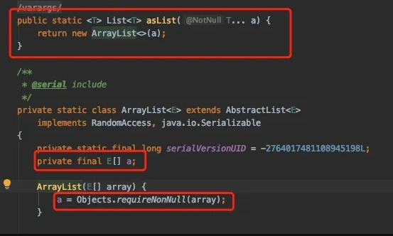
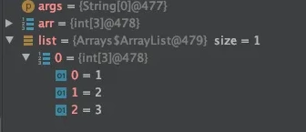

# Arrays.asList有坑

## **<font style="color:rgb(34, 34, 34);background-color:rgb(248, 246, 244);">前言</font>**
<font style="color:rgb(51, 51, 51);background-color:rgb(248, 246, 244);">在我们的日常开发中，经常会遇到把数组转成List的情况。</font>

<font style="color:rgb(51, 51, 51);background-color:rgb(248, 246, 244);">数组固定长度，一般是值的集合，需声明值类型。</font>

<font style="color:rgb(51, 51, 51);background-color:rgb(248, 246, 244);">List是泛型集合，长度不固定，减少了拆箱装箱操作。</font>

<font style="color:rgb(51, 51, 51);background-color:rgb(248, 246, 244);">我们通常会使用Arrays.asList方法做转换，例如下面这样的：</font>

```typescript
public class ArrayTest {
    public static void main(String[] args) {
        String[] arr = new String[]{"a", "b", "c"};
        List<String> list = Arrays.asList(arr);
        System.out.println(list);
    }
}
```

<font style="color:rgb(51, 51, 51);background-color:rgb(248, 246, 244);">打印结果：</font>

```plain
[a, b, c]
```

<font style="color:rgb(51, 51, 51);background-color:rgb(248, 246, 244);">确实是对的。</font>

<font style="color:rgb(51, 51, 51);background-color:rgb(248, 246, 244);">但使用Arrays.asList方法转换List之后，也会参数很多坑，我们在实际开发中一定要小心。</font>

## **<font style="color:rgb(34, 34, 34);background-color:rgb(248, 246, 244);">1 坑1</font>**
<font style="color:rgb(51, 51, 51);background-color:rgb(248, 246, 244);">我们将数组转换成List之后，在后面的业务代码中，需要往List中添加新的元素。</font>

<font style="color:rgb(51, 51, 51);background-color:rgb(248, 246, 244);">代码改成下面这样：</font>

```typescript
public class ArrayTest {
    public static void main(String[] args) {
        String[] arr = new String[]{"a", "b", "c"};
        List<String> list = Arrays.asList(arr);
        list.add("d");
        System.out.println(list);
    }
}
```

<font style="color:rgb(51, 51, 51);background-color:rgb(248, 246, 244);">执行结果：</font>

```plain
Exception in thread "main" java.lang.UnsupportedOperationException
 at java.util.AbstractList.add(AbstractList.java:148)
 at java.util.AbstractList.add(AbstractList.java:108)
 at cn.net.susan.ArrayTest.main(ArrayTest.java:15)
```

<font style="color:rgb(51, 51, 51);background-color:rgb(248, 246, 244);">报了一个UnsupportedOperationException异常，也就是说List的数据不允许修改。</font>

<font style="color:rgb(51, 51, 51);background-color:rgb(248, 246, 244);">其根本原因是调用Arrays.asList方法，转换的ArrayList对象是Arrays类的内部对象，并非java.util.ArrayList对象：</font>



<font style="color:rgb(51, 51, 51);background-color:rgb(248, 246, 244);">Arrays类的内部类ArrayList，它继承了抽象类AbstractList：</font>



<font style="color:rgb(51, 51, 51);background-color:rgb(248, 246, 244);">该类的底层不允许做增删改的操作，只能查询数据。</font>

<font style="color:rgb(51, 51, 51);background-color:rgb(248, 246, 244);">说实话JDK底层用了同名的对象，这一点挺坑的。</font>

## **<font style="color:rgb(34, 34, 34);background-color:rgb(248, 246, 244);">2 坑2</font>**
<font style="color:rgb(51, 51, 51);background-color:rgb(248, 246, 244);">我们将数组转换成List之后，后续的业务修改了原始数组，List中的相同位置的元素，也一同修改了。</font>

<font style="color:rgb(51, 51, 51);background-color:rgb(248, 246, 244);">代码改成下面这样的：</font>

```typescript
public class ArrayTest {
    public static void main(String[] args) {
        String[] arr = new String[]{"a", "b", "c"};
        List<String> list = Arrays.asList(arr);
        arr[0] = "f";
        System.out.println(list);
    }
}
```

<font style="color:rgb(51, 51, 51);background-color:rgb(248, 246, 244);">打印结果：</font>

```plain
[f, b, c]
```

<font style="color:rgb(51, 51, 51);background-color:rgb(248, 246, 244);">我只改了arr中的第一个位置上的元素，并没有修改list中的元素。</font>

<font style="color:rgb(51, 51, 51);background-color:rgb(248, 246, 244);">但在修改arr的元素的时候，list中相同位置上的元素一起被修改了。</font>



<font style="color:rgb(51, 51, 51);background-color:rgb(248, 246, 244);">因为在Arrays类的底层，将数组的引用直接赋值该了a，没有复制数据。</font>

## **<font style="color:rgb(34, 34, 34);background-color:rgb(248, 246, 244);">3 坑3</font>**
<font style="color:rgb(51, 51, 51);background-color:rgb(248, 246, 244);">原始数据类型数组，转换成List之后，会发现转换的数据不对。</font>

<font style="color:rgb(51, 51, 51);background-color:rgb(248, 246, 244);">例如下面这样的：</font>

```plain
public class ArrayTest {
    public static void main(String[] args) {
        int[] arr = new int[]{1, 2, 3};
        List list = Arrays.asList(arr);
        System.out.println(list);
    }
}
```

<font style="color:rgb(51, 51, 51);background-color:rgb(248, 246, 244);">执行结果：</font>



<font style="color:rgb(51, 51, 51);background-color:rgb(248, 246, 244);">list的size竟然是1，不是3。</font>

<font style="color:rgb(51, 51, 51);background-color:rgb(248, 246, 244);">值是一个int数组。</font>

<font style="color:rgb(51, 51, 51);background-color:rgb(248, 246, 244);">Arrays.asList方法的坑太多了，我们在实际开发中，要慎用。</font>

## **<font style="color:rgb(34, 34, 34);background-color:rgb(248, 246, 244);">4 建议</font>**
<font style="color:rgb(51, 51, 51);background-color:rgb(248, 246, 244);">如果我们在日常工作中，确实有需要将数组转换成List的业务场景。</font>

<font style="color:rgb(51, 51, 51);background-color:rgb(248, 246, 244);">我们可以使用java8的stream的语法。</font>

<font style="color:rgb(51, 51, 51);background-color:rgb(248, 246, 244);">例如：</font>

```plain
public class ArrayTest {
    public static void main(String[] args) {
        int[] arr = new int[]{1, 2, 3};
        List list = Arrays.stream(arr).boxed方法，将int类型转换成Integer类型。
        
        ().collect(Collectors.toList());
        System.out.println(list);
    }
}
```

<font style="color:rgb(51, 51, 51);background-color:rgb(248, 246, 244);">使用Arrays.stream将数组转换stream流。</font>

<font style="color:rgb(51, 51, 51);background-color:rgb(248, 246, 244);">然后使用boxed方法，将int类型转换成Integer类型。</font>


> 更新: 2024-09-05 11:01:28  
> 原文: <https://www.yuque.com/yuqueyonghue6cvnv/cxhfwd/uxwxr9ce3919vic2>