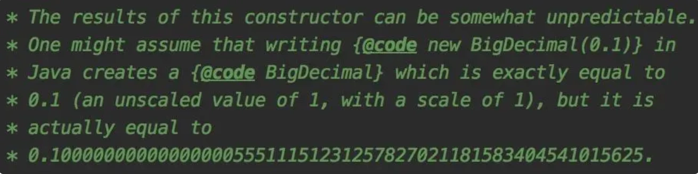

# BigDecimal精度丢失问题

<font style="color:rgb(51, 51, 51);background-color:rgb(248, 246, 244);">通常我们会把一些小数类型的字段（比如：金额），定义成BigDecimal，而不是Double，避免丢失精度问题。</font>

<font style="color:rgb(51, 51, 51);background-color:rgb(248, 246, 244);">使用Double时可能会有这种场景：</font>

```plain
double amount1 = 0.02;
double amount2 = 0.03;
System.out.println(amount2 - amount1);
```

<font style="color:rgb(51, 51, 51);background-color:rgb(248, 246, 244);">正常情况下预计amount2 - amount1应该等于0.01</font>

<font style="color:rgb(51, 51, 51);background-color:rgb(248, 246, 244);">但是执行结果，却为：</font>

```plain
0.009999999999999998
```

<font style="color:rgb(51, 51, 51);background-color:rgb(248, 246, 244);">实际结果小于预计结果。</font>

<font style="color:rgb(51, 51, 51);background-color:rgb(248, 246, 244);">Double类型的两个参数相减会转换成二进制，因为Double有效位数为16位这就会出现存储小数位数不够的情况，这种情况下就会出现误差。</font>

<font style="color:rgb(51, 51, 51);background-color:rgb(248, 246, 244);">常识告诉我们使用BigDecimal能避免丢失精度。</font>

<font style="color:rgb(51, 51, 51);background-color:rgb(248, 246, 244);">但是使用BigDecimal能避免丢失精度吗？</font>

<font style="color:rgb(51, 51, 51);background-color:rgb(248, 246, 244);">答案是否定的。</font>

<font style="color:rgb(51, 51, 51);background-color:rgb(248, 246, 244);">为什么？</font>

```plain
BigDecimal amount1 = new BigDecimal(0.02);
BigDecimal amount2 = new BigDecimal(0.03);
System.out.println(amount2.subtract(amount1));
```

<font style="color:rgb(51, 51, 51);background-color:rgb(248, 246, 244);">这个例子中定义了两个BigDecimal类型参数，使用构造函数初始化数据，然后打印两个参数相减后的值。</font>

<font style="color:rgb(51, 51, 51);background-color:rgb(248, 246, 244);">结果：</font>

```plain
0.0099999999999999984734433411404097569175064563751220703125
```

<font style="color:rgb(51, 51, 51);background-color:rgb(248, 246, 244);">不科学呀，为啥还是丢失精度了？</font>

<font style="color:rgb(51, 51, 51);background-color:rgb(248, 246, 244);">Jdk中BigDecimal的构造方法上有这样一段描述：</font>



<font style="color:rgb(51, 51, 51);background-color:rgb(248, 246, 244);">大致的意思是此构造函数的结果可能不可预测，可能会出现创建时为0.1，但实际是0.1000000000000000055511151231257827021181583404541015625的情况。</font>

<font style="color:rgb(51, 51, 51);background-color:rgb(248, 246, 244);">由此可见，使用BigDecimal构造函数初始化对象，也会丢失精度。</font>

<font style="color:rgb(51, 51, 51);background-color:rgb(248, 246, 244);">那么，如何才能不丢失精度呢？</font>

```plain
BigDecimal amount1 = new BigDecimal(Double.toString(0.02));
BigDecimal amount2 = new BigDecimal(Double.toString(0.03));
System.out.println(amount2.subtract(amount1));
```

<font style="color:rgb(51, 51, 51);background-color:rgb(248, 246, 244);">我们可以使用Double.toString方法，对double类型的小数进行转换，这样能保证精度不丢失。</font>

<font style="color:rgb(51, 51, 51);background-color:rgb(248, 246, 244);">其实，还有更好的办法：</font>

```plain
BigDecimal amount1 = BigDecimal.valueOf(0.02);
BigDecimal amount2 = BigDecimal.valueOf(0.03);
System.out.println(amount2.subtract(amount1));
```

<font style="color:rgb(51, 51, 51);background-color:rgb(248, 246, 244);">使用BigDecimal.valueOf方法初始化BigDecimal类型参数，也能保证精度不丢失。在新版的阿里巴巴开发手册中，也推荐使用这种方式创建BigDecimal参数。</font>


> 更新: 2024-05-20 17:02:54  
> 原文: <https://www.yuque.com/yuqueyonghue6cvnv/cxhfwd/eisgplfzlmv9maxu>