# Spring循环依赖问题

## **<font style="color:rgb(34, 34, 34);background-color:rgb(248, 246, 244);">1.由同事抛的一个问题开始</font>**
<font style="color:rgb(51, 51, 51);background-color:rgb(248, 246, 244);">最近项目组的一个同事遇到了一个问题，问我的意见，一下子引起的我的兴趣，因为这个问题我也是第一次遇到。平时自认为对spring循环依赖问题还是比较了解的，直到遇到这个和后面的几个问题后，重新刷新了我的认识。</font>

<font style="color:rgb(51, 51, 51);background-color:rgb(248, 246, 244);">我们先看看当时出问题的代码片段：</font>

```typescript
@Service
public class TestService1 {

    @Autowired
    private TestService2 testService2;

    @Async
    public void test1() {
    }
}
```

```typescript
@Service
public class TestService2 {

    @Autowired
    private TestService1 testService1;

    public void test2() {
    }
}
```

<font style="color:rgb(51, 51, 51);background-color:rgb(248, 246, 244);">这两段代码中定义了两个Service类：TestService1和TestService2，在TestService1中注入了TestService2的实例，同时在TestService2中注入了TestService1的实例，这里构成了循环依赖。</font>

<font style="color:rgb(51, 51, 51);background-color:rgb(248, 246, 244);">只不过，这不是普通的循环依赖，因为TestService1的test1方法上加了一个@Async注解。</font>

<font style="color:rgb(51, 51, 51);background-color:rgb(248, 246, 244);">大家猜猜程序启动后运行结果会怎样？</font>

```plain
org.springframework.beans.factory.BeanCurrentlyInCreationException: Error creating bean with name 'testService1': Bean with name 'testService1' has been injected into other beans [testService2] in its raw version as part of a circular reference, but has eventually been wrapped. This means that said other beans do not use the final version of the bean. This is often the result of over-eager type matching - consider using 'getBeanNamesOfType' with the 'allowEagerInit' flag turned off, for example.
```

<font style="color:rgb(51, 51, 51);background-color:rgb(248, 246, 244);">报错了。。。原因是出现了循环依赖。</font>

**<font style="color:rgb(34, 34, 34);background-color:rgb(248, 246, 244);">「不科学呀，spring不是号称能解决循环依赖问题吗，怎么还会出现？」</font>**

<font style="color:rgb(51, 51, 51);background-color:rgb(248, 246, 244);">如果把上面的代码稍微调整一下：</font>

```typescript
@Service
public class TestService1 {

    @Autowired
    private TestService2 testService2;

    public void test1() {
    }
}
```

<font style="color:rgb(51, 51, 51);background-color:rgb(248, 246, 244);">把TestService1的test1方法上的@Async注解去掉，TestService1和TestService2都需要注入对方的实例，同样构成了循环依赖。</font>

<font style="color:rgb(51, 51, 51);background-color:rgb(248, 246, 244);">但是重新启动项目，发现它能够正常运行。这又是为什么？</font>

<font style="color:rgb(51, 51, 51);background-color:rgb(248, 246, 244);">带着这两个问题，让我们一起开始spring循环依赖的探秘之旅。</font>

## **<font style="color:rgb(34, 34, 34);background-color:rgb(248, 246, 244);">2.什么是循环依赖？</font>**
<font style="color:rgb(51, 51, 51);background-color:rgb(248, 246, 244);">循环依赖：说白是一个或多个对象实例之间存在直接或间接的依赖关系，这种依赖关系构成了构成一个环形调用。</font>

<font style="color:rgb(51, 51, 51);background-color:rgb(248, 246, 244);">第一种情况：自己依赖自己的直接依赖</font>

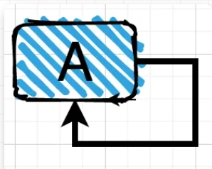

<font style="color:rgb(51, 51, 51);background-color:rgb(248, 246, 244);">第二种情况：两个对象之间的直接依赖</font>

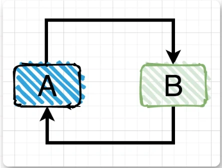

<font style="color:rgb(51, 51, 51);background-color:rgb(248, 246, 244);">第三种情况：多个对象之间的间接依赖</font>

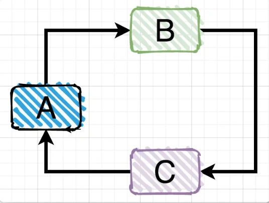

<font style="color:rgb(51, 51, 51);background-color:rgb(248, 246, 244);">前面两种情况的直接循环依赖比较直观，非常好识别，但是第三种间接循环依赖的情况有时候因为业务代码调用层级很深，不容易识别出来。</font>

## **<font style="color:rgb(34, 34, 34);background-color:rgb(248, 246, 244);">3.循环依赖的N种场景</font>**
<font style="color:rgb(51, 51, 51);background-color:rgb(248, 246, 244);">Spring中出现循环依赖主要有以下场景：</font>


### **<font style="color:rgb(34, 34, 34);background-color:rgb(248, 246, 244);">单例的setter注入</font>**
<font style="color:rgb(51, 51, 51);background-color:rgb(248, 246, 244);">这种注入方式应该是spring用的最多的，代码如下：</font>

```typescript
@Service
public class TestService1 {

    @Autowired
    private TestService2 testService2;

    public void test1() {
    }
}
```

```typescript
@Service
public class TestService2 {

    @Autowired
    private TestService1 testService1;

    public void test2() {
    }
}
```

<font style="color:rgb(51, 51, 51);background-color:rgb(248, 246, 244);">这是一个经典的循环依赖，但是它能正常运行，得益于spring的内部机制，让我们根本无法感知它有问题，因为spring默默帮我们解决了。</font>

<font style="color:rgb(51, 51, 51);background-color:rgb(248, 246, 244);">spring内部有三级缓存：</font>

+ <font style="color:rgb(51, 51, 51);background-color:rgb(248, 246, 244);">singletonObjects 一级缓存，用于保存实例化、注入、初始化完成的bean实例</font>
+ <font style="color:rgb(51, 51, 51);background-color:rgb(248, 246, 244);">earlySingletonObjects 二级缓存，用于保存实例化完成的bean实例</font>
+ <font style="color:rgb(51, 51, 51);background-color:rgb(248, 246, 244);">singletonFactories 三级缓存，用于保存bean创建工厂，以便于后面扩展有机会创建代理对象。</font>

<font style="color:rgb(51, 51, 51);background-color:rgb(248, 246, 244);">下面用一张图告诉你，spring是如何解决循环依赖的：</font>

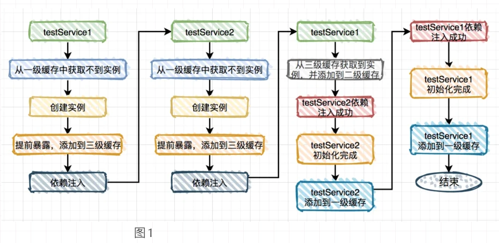

<font style="color:rgb(51, 51, 51);background-color:rgb(248, 246, 244);">细心的朋友可能会发现在这种场景中第二级缓存作用不大。</font>

<font style="color:rgb(51, 51, 51);background-color:rgb(248, 246, 244);">那么问题来了，为什么要用第二级缓存呢？</font>

<font style="color:rgb(51, 51, 51);background-color:rgb(248, 246, 244);">试想一下，如果出现以下这种情况，我们要如何处理？</font>

```typescript
@Service
public class TestService1 {

    @Autowired
    private TestService2 testService2;
    @Autowired
    private TestService3 testService3;

    public void test1() {
    }
}
```

```typescript
@Service
public class TestService2 {

    @Autowired
    private TestService1 testService1;

    public void test2() {
    }
}
```

```typescript
@Service
public class TestService3 {

    @Autowired
    private TestService1 testService1;

    public void test3() {
    }
}
```

<font style="color:rgb(51, 51, 51);background-color:rgb(248, 246, 244);">TestService1依赖于TestService2和TestService3，而TestService2依赖于TestService1，同时TestService3也依赖于TestService1。</font>

<font style="color:rgb(51, 51, 51);background-color:rgb(248, 246, 244);">按照上图的流程可以把TestService1注入到TestService2，并且TestService1的实例是从第三级缓存中获取的。</font>

<font style="color:rgb(51, 51, 51);background-color:rgb(248, 246, 244);">假设不用第二级缓存，TestService1注入到TestService3的流程如图：</font>

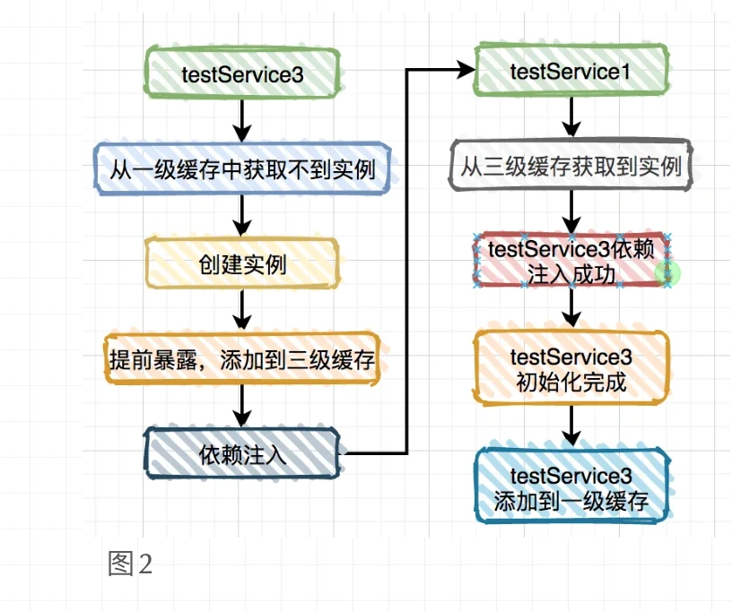

<font style="color:rgb(51, 51, 51);background-color:rgb(248, 246, 244);">TestService1注入到TestService3又需要从第三级缓存中获取实例，而第三级缓存里保存的并非真正的实例对象，而是ObjectFactory对象。说白了，两次从三级缓存中获取都是ObjectFactory对象，而通过它创建的实例对象每次可能都不一样的。</font>

<font style="color:rgb(51, 51, 51);background-color:rgb(248, 246, 244);">这样不是有问题？</font>

<font style="color:rgb(51, 51, 51);background-color:rgb(248, 246, 244);">为了解决这个问题，spring引入的第二级缓存。上面图1其实TestService1对象的实例已经被添加到第二级缓存中了，而在TestService1注入到TestService3时，只用从第二级缓存中获取该对象即可。</font>

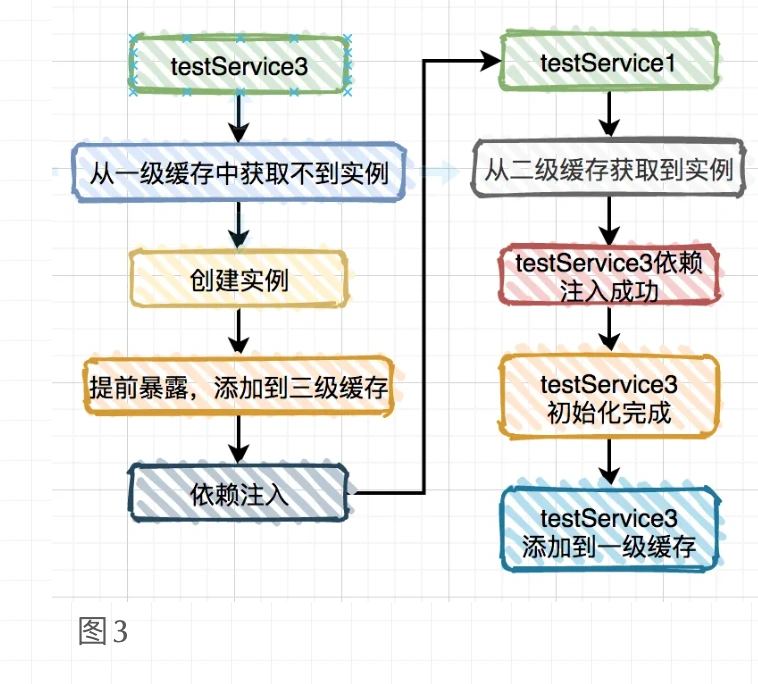

<font style="color:rgb(51, 51, 51);background-color:rgb(248, 246, 244);">还有个问题，第三级缓存中为什么要添加ObjectFactory对象，直接保存实例对象不行吗？</font>

<font style="color:rgb(51, 51, 51);background-color:rgb(248, 246, 244);">答：不行，因为假如你想对添加到三级缓存中的实例对象进行增强，直接用实例对象是行不通的。</font>

<font style="color:rgb(51, 51, 51);background-color:rgb(248, 246, 244);">针对这种场景spring是怎么做的呢？</font>

<font style="color:rgb(51, 51, 51);background-color:rgb(248, 246, 244);">答案就在AbstractAutowireCapableBeanFactory类doCreateBean方法的这段代码中：</font>

<font style="color:rgb(51, 51, 51);background-color:rgb(248, 246, 244);">它定义了一个匿名内部类，通过getEarlyBeanReference方法获取代理对象，其实底层是通过AbstractAutoProxyCreator类的getEarlyBeanReference生成代理对象。</font>

### **<font style="color:rgb(34, 34, 34);background-color:rgb(248, 246, 244);">多例的setter注入</font>**
<font style="color:rgb(51, 51, 51);background-color:rgb(248, 246, 244);">这种注入方法偶然会有，特别是在多线程的场景下，具体代码如下：</font>

```less
@Scope(ConfigurableBeanFactory.SCOPE_PROTOTYPE)
@Service
public class TestService1 {

    @Autowired
    private TestService2 testService2;

    public void test1() {
    }
}
```

```less
@Scope(ConfigurableBeanFactory.SCOPE_PROTOTYPE)
@Service
public class TestService2 {

    @Autowired
    private TestService1 testService1;

    public void test2() {
    }
}
```

<font style="color:rgb(51, 51, 51);background-color:rgb(248, 246, 244);">很多人说这种情况spring容器启动会报错，其实是不对的，我非常负责任的告诉你程序能够正常启动。</font>

<font style="color:rgb(51, 51, 51);background-color:rgb(248, 246, 244);">为什么呢？</font>

<font style="color:rgb(51, 51, 51);background-color:rgb(248, 246, 244);">其实在AbstractApplicationContext类的refresh方法中告诉了我们答案，它会调用finishBeanFactoryInitialization方法，该方法的作用是为了spring容器启动的时候提前初始化一些bean。该方法的内部又调用了preInstantiateSingletons方法</font>

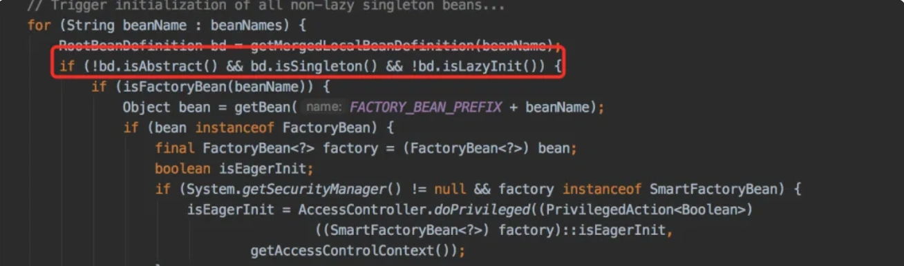

<font style="color:rgb(51, 51, 51);background-color:rgb(248, 246, 244);">标红的地方明显能够看出：非抽象、单例 并且非懒加载的类才能被提前初始bean。</font>

<font style="color:rgb(51, 51, 51);background-color:rgb(248, 246, 244);">而多例即SCOPE_PROTOTYPE类型的类，非单例，不会被提前初始化bean，所以程序能够正常启动。</font>

<font style="color:rgb(51, 51, 51);background-color:rgb(248, 246, 244);">如何让他提前初始化bean呢？</font>

<font style="color:rgb(51, 51, 51);background-color:rgb(248, 246, 244);">只需要再定义一个单例的类，在它里面注入TestService1</font>

```ruby
@Service
public class TestService3 {

    @Autowired
    private TestService1 testService1;
}
```

<font style="color:rgb(51, 51, 51);background-color:rgb(248, 246, 244);">重新启动程序，执行结果：</font>

```plain
Requested bean is currently in creation: Is there an unresolvable circular reference?
```

<font style="color:rgb(51, 51, 51);background-color:rgb(248, 246, 244);">果然出现了循环依赖。</font>

<font style="color:rgb(51, 51, 51);background-color:rgb(248, 246, 244);">注意：这种循环依赖问题是无法解决的，因为它没有用缓存，每次都会生成一个新对象。</font>

### **<font style="color:rgb(34, 34, 34);background-color:rgb(248, 246, 244);">构造器注入</font>**
<font style="color:rgb(51, 51, 51);background-color:rgb(248, 246, 244);">这种注入方式现在其实用的已经非常少了，但是我们还是有必要了解一下，看看如下代码：</font>

```plain
@Service
public class TestService1 {

    public TestService1(TestService2 testService2) {
    }
}
```

```plain
@Service
public class TestService2 {

    public TestService2(TestService1 testService1) {
    }
}
```

<font style="color:rgb(51, 51, 51);background-color:rgb(248, 246, 244);">运行结果：</font>

```plain
Requested bean is currently in creation: Is there an unresolvable circular reference?
```

<font style="color:rgb(51, 51, 51);background-color:rgb(248, 246, 244);">出现了循环依赖，为什么呢？</font>

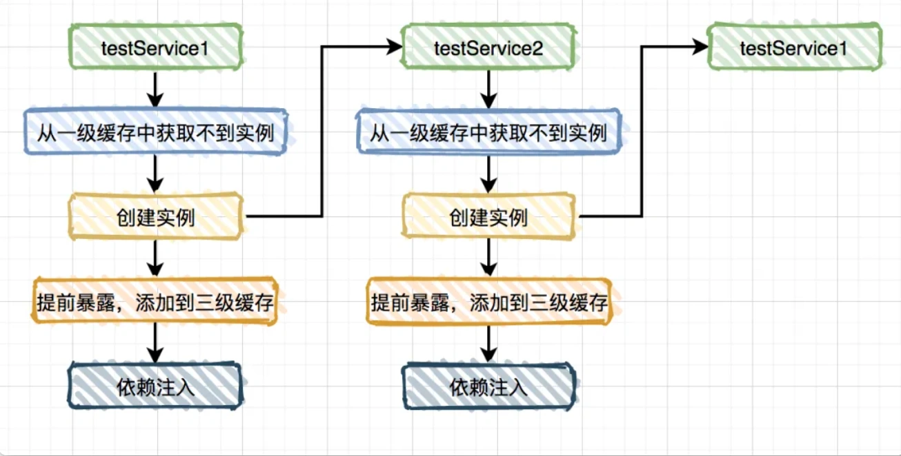

<font style="color:rgb(51, 51, 51);background-color:rgb(248, 246, 244);">从图中的流程看出构造器注入没能添加到三级缓存，也没有使用缓存，所以也无法解决循环依赖问题。</font>

### **<font style="color:rgb(34, 34, 34);background-color:rgb(248, 246, 244);">单例的代理对象setter注入</font>**
<font style="color:rgb(51, 51, 51);background-color:rgb(248, 246, 244);">这种注入方式其实也比较常用，比如平时使用：@Async注解的场景，会通过AOP自动生成代理对象。</font>

<font style="color:rgb(51, 51, 51);background-color:rgb(248, 246, 244);">我那位同事的问题也是这种情况。</font>

```typescript
@Service
public class TestService1 {

    @Autowired
    private TestService2 testService2;

    @Async
    public void test1() {
    }
}
```

```typescript
@Service
public class TestService2 {

    @Autowired
    private TestService1 testService1;

    public void test2() {
    }
}
```

<font style="color:rgb(51, 51, 51);background-color:rgb(248, 246, 244);">从前面得知程序启动会报错，出现了循环依赖：</font>

```plain
org.springframework.beans.factory.BeanCurrentlyInCreationException: Error creating bean with name 'testService1': Bean with name 'testService1' has been injected into other beans [testService2] in its raw version as part of a circular reference, but has eventually been wrapped. This means that said other beans do not use the final version of the bean. This is often the result of over-eager type matching - consider using 'getBeanNamesOfType' with the 'allowEagerInit' flag turned off, for example.
```

<font style="color:rgb(51, 51, 51);background-color:rgb(248, 246, 244);">为什么会循环依赖呢？</font>

<font style="color:rgb(51, 51, 51);background-color:rgb(248, 246, 244);">答案就在下面这张图中：</font>

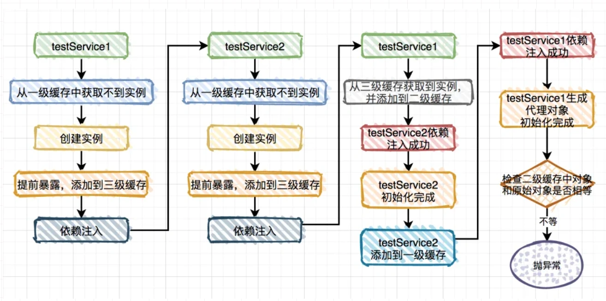

<font style="color:rgb(51, 51, 51);background-color:rgb(248, 246, 244);">说白了，bean初始化完成之后，后面还有一步去检查：第二级缓存 和 原始对象 是否相等。由于它对前面流程来说无关紧要，所以前面的流程图中省略了，但是在这里是关键点，我们重点说说：</font>

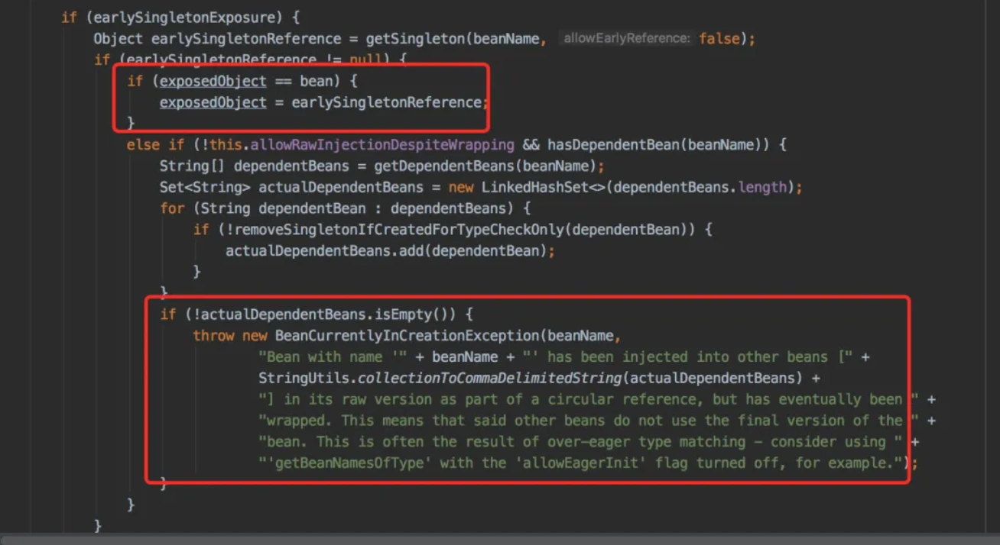

<font style="color:rgb(51, 51, 51);background-color:rgb(248, 246, 244);">那位同事的问题正好是走到这段代码，发现第二级缓存 和 原始对象不相等，所以抛出了循环依赖的异常。</font>

<font style="color:rgb(51, 51, 51);background-color:rgb(248, 246, 244);">如果这时候把TestService1改个名字，改成：TestService6，其他的都不变。</font>

```typescript
@Service
public class TestService6 {

    @Autowired
    private TestService2 testService2;

    @Async
    public void test1() {
    }
}
```

<font style="color:rgb(51, 51, 51);background-color:rgb(248, 246, 244);">再重新启动一下程序，神奇般的好了。</font>

<font style="color:rgb(51, 51, 51);background-color:rgb(248, 246, 244);">what？ 这又是为什么？</font>

<font style="color:rgb(51, 51, 51);background-color:rgb(248, 246, 244);">这就要从spring的bean加载顺序说起了，默认情况下，spring是按照文件完整路径递归查找的，按路径+文件名排序，排在前面的先加载。所以TestService1比TestService2先加载，而改了文件名称之后，TestService2比TestService6先加载。</font>

<font style="color:rgb(51, 51, 51);background-color:rgb(248, 246, 244);">为什么TestService2比TestService6先加载就没问题呢？</font>

<font style="color:rgb(51, 51, 51);background-color:rgb(248, 246, 244);">答案在下面这张图中：</font>

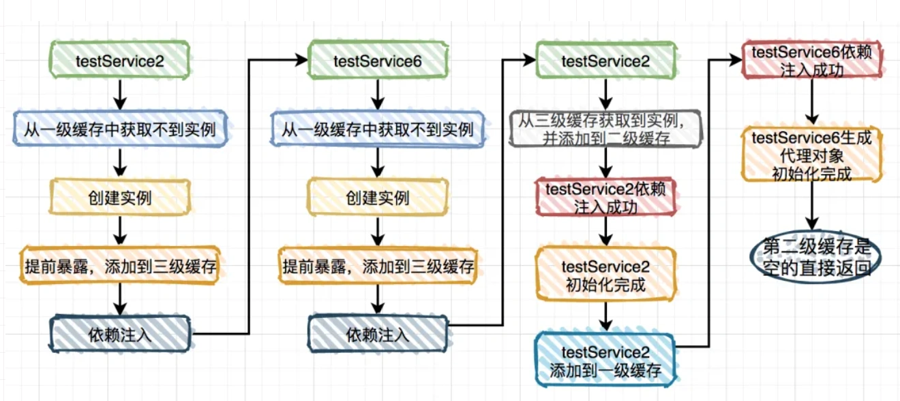

<font style="color:rgb(51, 51, 51);background-color:rgb(248, 246, 244);">这种情况testService6中其实第二级缓存是空的，不需要跟原始对象判断，所以不会抛出循环依赖。</font>

### **<font style="color:rgb(34, 34, 34);background-color:rgb(248, 246, 244);">DependsOn循环依赖</font>**
<font style="color:rgb(51, 51, 51);background-color:rgb(248, 246, 244);">还有一种有些特殊的场景，比如我们需要在实例化Bean A之前，先实例化Bean B，这个时候就可以使用@DependsOn注解。</font>

```less
@DependsOn(value = "testService2")
@Service
public class TestService1 {

    @Autowired
    private TestService2 testService2;

    public void test1() {
    }
}
```

```less
@DependsOn(value = "testService1")
@Service
public class TestService2 {

    @Autowired
    private TestService1 testService1;

    public void test2() {
    }
}
```

<font style="color:rgb(51, 51, 51);background-color:rgb(248, 246, 244);">程序启动之后，执行结果：</font>

```plain
Circular depends-on relationship between 'testService2' and 'testService1'
```

<font style="color:rgb(51, 51, 51);background-color:rgb(248, 246, 244);">这个例子中本来如果TestService1和TestService2都没有加@DependsOn注解是没问题的，反而加了这个注解会出现循环依赖问题。</font>

<font style="color:rgb(51, 51, 51);background-color:rgb(248, 246, 244);">这又是为什么？</font>

<font style="color:rgb(51, 51, 51);background-color:rgb(248, 246, 244);">答案在AbstractBeanFactory类的doGetBean方法的这段代码中：</font>

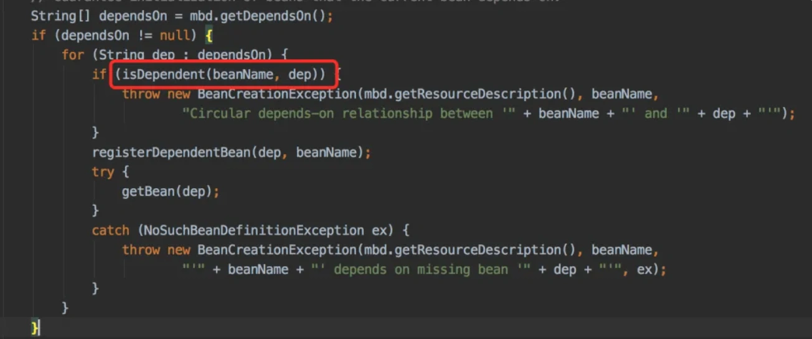

<font style="color:rgb(51, 51, 51);background-color:rgb(248, 246, 244);">它会检查dependsOn的实例有没有循环依赖，如果有循环依赖则抛异常。</font>

## **<font style="color:rgb(34, 34, 34);background-color:rgb(248, 246, 244);">4.出现循环依赖如何解决？</font>**
<font style="color:rgb(51, 51, 51);background-color:rgb(248, 246, 244);">项目中如果出现循环依赖问题，说明是spring默认无法解决的循环依赖，要看项目的打印日志，属于哪种循环依赖。目前包含下面几种情况：</font>

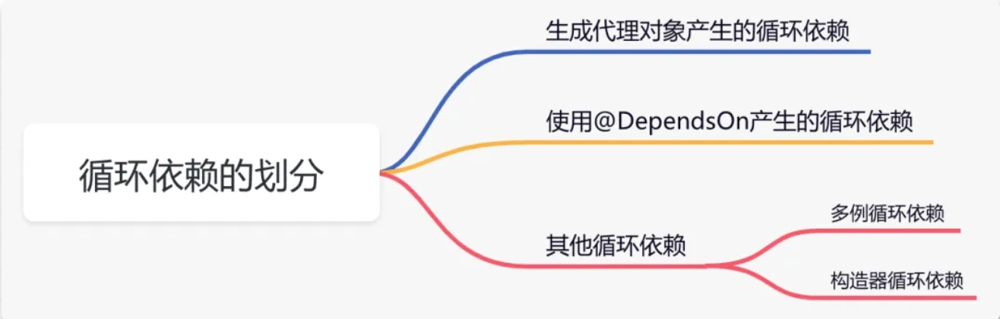

### **<font style="color:rgb(34, 34, 34);background-color:rgb(248, 246, 244);">生成代理对象产生的循环依赖</font>**
<font style="color:rgb(51, 51, 51);background-color:rgb(248, 246, 244);">这类循环依赖问题解决方法很多，主要有：</font>

1. <font style="color:rgb(51, 51, 51);background-color:rgb(248, 246, 244);">使用@Lazy注解，延迟加载</font>
2. <font style="color:rgb(51, 51, 51);background-color:rgb(248, 246, 244);">使用@DependsOn注解，指定加载先后关系</font>
3. <font style="color:rgb(51, 51, 51);background-color:rgb(248, 246, 244);">修改文件名称，改变循环依赖类的加载顺序</font>

### **<font style="color:rgb(34, 34, 34);background-color:rgb(248, 246, 244);">使用@DependsOn产生的循环依赖</font>**
<font style="color:rgb(51, 51, 51);background-color:rgb(248, 246, 244);">这类循环依赖问题要找到@DependsOn注解循环依赖的地方，迫使它不循环依赖就可以解决问题。</font>

### **<font style="color:rgb(34, 34, 34);background-color:rgb(248, 246, 244);">多例循环依赖</font>**
<font style="color:rgb(51, 51, 51);background-color:rgb(248, 246, 244);">这类循环依赖问题可以通过把bean改成单例的解决。</font>

### **<font style="color:rgb(34, 34, 34);background-color:rgb(248, 246, 244);">构造器循环依赖</font>**
<font style="color:rgb(51, 51, 51);background-color:rgb(248, 246, 244);">这类循环依赖问题可以通过使用@Lazy注解解决。</font>


> 更新: 2024-05-20 17:06:16  
> 原文: <https://www.yuque.com/yuqueyonghue6cvnv/cxhfwd/ce9ecw3oomvf636d>