# Spring集成Mybatis有坑

## **<font style="color:rgb(34, 34, 34);background-color:rgb(248, 246, 244);">前言</font>**
<font style="color:rgb(51, 51, 51);background-color:rgb(248, 246, 244);">最新做知识星球中商城项目时，踩了一个Spring集成Mybatis的大坑。</font>

<font style="color:rgb(51, 51, 51);background-color:rgb(248, 246, 244);">这两个框架，如果单独使用，是没有问题的，但如果通过mybatis-spring这个jar包集成使用，就会出现一个很严重的问题。</font>

<font style="color:rgb(51, 51, 51);background-color:rgb(248, 246, 244);">这个问题我在网上搜了一圈，没有查到解决方案，最后我通过查看源码解决了。</font>

<font style="color:rgb(51, 51, 51);background-color:rgb(248, 246, 244);">具体是什么问题呢？</font>

<font style="color:rgb(51, 51, 51);background-color:rgb(248, 246, 244);">各位小伙伴请耐心往下看。</font>

## **<font style="color:rgb(34, 34, 34);background-color:rgb(248, 246, 244);">1 案发现场</font>**
<font style="color:rgb(51, 51, 51);background-color:rgb(248, 246, 244);">前几天，我在做知识星球中的商城项目，打算做一个公共的分页功能。</font>

<font style="color:rgb(51, 51, 51);background-color:rgb(248, 246, 244);">将分页和排序的sql片段，抽取到一个共用的mapper。</font>

<font style="color:rgb(51, 51, 51);background-color:rgb(248, 246, 244);">于是，创建了一个BaseMapper.xml文件，具体代码如下：</font>

```plain
<?xml version="1.0" encoding="UTF-8" ?>
<!DOCTYPE mapper
        PUBLIC "-//mybatis.org//DTD Mapper 3.0//EN"
        "http://mybatis.org/dtd/mybatis-3-mapper.dtd">

<mapper namespace="cn.net.susan.mapper.BaseMapper">
    <sql id="paginationSql">
        <choose>
            <when test="sortField != null and sortField.size()>0">
                ORDER BY ${sortString}
            </when>
            <otherwise>
                ORDER BY create_time DESC
            </otherwise>
        </choose>

        <if test="pageSize > 0">
            LIMIT #{pageBegin} , #{pageSize}
        </if>
    </sql>
</mapper>
```

<font style="color:rgb(51, 51, 51);background-color:rgb(248, 246, 244);">这个文件是一个公共的文件，只包含了一个mapper，它的namespace是cn.net.susan.mapper.BaseMapper，sql的id是paginationSql。</font>

<font style="color:rgb(51, 51, 51);background-color:rgb(248, 246, 244);">然后创建了一个公共的BaseMapper接口：</font>

```java
public interface BaseMapper<K, V> {

    /**
     * 根据条件查询数据的数量
     *
     * @param v 实体类
     * @return 数量
     */
    int searchCount(V v);

    /**
     * 根据条件查询数据
     *
     * @param v 实体类
     * @return List<K> 实体类的集合
     * @throws DataAccessException 数据访问异常
     */
    List<K> searchByCondition(V v) throws DataAccessException;
}
```

<font style="color:rgb(51, 51, 51);background-color:rgb(248, 246, 244);">然后在具体业务mapper，比如AttributeMapper接口，需要继承BaseMapper接口：</font>

```plain
public interface AttributeMapper extends BaseMapper<AttributeEntity, AttributeConditionEntity> {
 /**
     * 查询属性信息
     *
     * @param id 属性ID
     * @return 属性信息
     */
 AttributeEntity findById(Long id);
}
```

<font style="color:rgb(51, 51, 51);background-color:rgb(248, 246, 244);">然后在对应的AttributerMapper.xml：</font>

```plain
<select id="searchByCondition"
        parameterType="cn.net.susan.entity.mall.AttributeConditionEntity"
        resultMap="AttributeResult">
    SELECT
    <include refid="selectAttributeColumn"/>
    FROM mall_attribute
    <include refid="queryWhere"/>
    <include refid="cn.net.susan.mapper.BaseMapper.paginationSql"/>
</select>

<select id="searchCount"
        parameterType="cn.net.susan.entity.mall.AttributeConditionEntity"
        resultType="int">
    SELECT
    COUNT(*)
    FROM mall_attribute
    <include refid="queryWhere"/>
</select>
```

<font style="color:rgb(51, 51, 51);background-color:rgb(248, 246, 244);">在searchByCondition方法中，要想使用分页和排序的功能，只需要通过include标签引入cn.net.susan.mapper.BaseMapper.paginationSql 即可。</font>

<font style="color:rgb(51, 51, 51);background-color:rgb(248, 246, 244);">最后定义一个共用的BaseService抽象类，在该类基于BaseMapper实现分页功能。</font>

<font style="color:rgb(51, 51, 51);background-color:rgb(248, 246, 244);">然后AttributeService类继承BaseService类，直接调用它的分页方法。</font>

<font style="color:rgb(51, 51, 51);background-color:rgb(248, 246, 244);">就能实现一套共用的分页功能。</font>

<font style="color:rgb(51, 51, 51);background-color:rgb(248, 246, 244);">具体代码可以参考我知识星球中的代码。</font>

<font style="color:rgb(51, 51, 51);background-color:rgb(248, 246, 244);">按照上面的设计。</font>

<font style="color:rgb(51, 51, 51);background-color:rgb(248, 246, 244);">大部分单表分页查询，都修改成功了。</font>

<font style="color:rgb(51, 51, 51);background-color:rgb(248, 246, 244);">但修改一个敏感词表的时候，重新启动项目，却出现项目启动不了。</font>

<font style="color:rgb(51, 51, 51);background-color:rgb(248, 246, 244);">出现了下面的异常：</font>

```plain
Caused by: org.springframework.beans.factory.BeanCreationException: Error creating bean with name 'commonSensitiveWordService': Invocation of init method failed; nested exception is java.lang.IllegalArgumentException: XML fragments parsed from previous mappers does not contain value for cn.net.susan.mapper.BaseMapper.paginationSql
 at org.springframework.beans.factory.annotation.InitDestroyAnnotationBeanPostProcessor.postProcessBeforeInitialization(InitDestroyAnnotationBeanPostProcessor.java:160) ~[spring-beans-5.3.31.jar:5.3.31]
 at org.springframework.beans.factory.support.AbstractAutowireCapableBeanFactory.applyBeanPostProcessorsBeforeInitialization(AbstractAutowireCapableBeanFactory.java:440) ~[spring-beans-5.3.31.jar:5.3.31]
 at org.springframework.beans.factory.support.AbstractAutowireCapableBeanFactory.initializeBean(AbstractAutowireCapableBeanFactory.java:1796) ~[spring-beans-5.3.31.jar:5.3.31]
 at org.springframework.beans.factory.support.AbstractAutowireCapableBeanFactory.doCreateBean(AbstractAutowireCapableBeanFactory.java:620) ~[spring-beans-5.3.31.jar:5.3.31]
 at org.springframework.beans.factory.support.AbstractAutowireCapableBeanFactory.createBean(AbstractAutowireCapableBeanFactory.java:542) ~[spring-beans-5.3.31.jar:5.3.31]
 at org.springframework.beans.factory.support.AbstractBeanFactory.lambda$doGetBean$0(AbstractBeanFactory.java:335) ~[spring-beans-5.3.31.jar:5.3.31]
 at org.springframework.beans.factory.support.DefaultSingletonBeanRegistry.getSingleton(DefaultSingletonBeanRegistry.java:234) ~[spring-beans-5.3.31.jar:5.3.31]
 at org.springframework.beans.factory.support.AbstractBeanFactory.doGetBean(AbstractBeanFactory.java:333) ~[spring-beans-5.3.31.jar:5.3.31]
 at org.springframework.beans.factory.support.AbstractBeanFactory.getBean(AbstractBeanFactory.java:208) ~[spring-beans-5.3.31.jar:5.3.31]
 at org.springframework.beans.factory.config.DependencyDescriptor.resolveCandidate(DependencyDescriptor.java:276) ~[spring-beans-5.3.31.jar:5.3.31]
 at org.springframework.beans.factory.support.DefaultListableBeanFactory.doResolveDependency(DefaultListableBeanFactory.java:1391) ~[spring-beans-5.3.31.jar:5.3.31]
 at org.springframework.beans.factory.support.DefaultListableBeanFactory.resolveDependency(DefaultListableBeanFactory.java:1311) ~[spring-beans-5.3.31.jar:5.3.31]
 at org.springframework.beans.factory.annotation.AutowiredAnnotationBeanPostProcessor$AutowiredFieldElement.resolveFieldValue(AutowiredAnnotationBeanPostProcessor.java:710) ~[spring-beans-5.3.31.jar:5.3.31]
 ... 20 common frames omitted
Caused by: java.lang.IllegalArgumentException: XML fragments parsed from previous mappers does not contain value for cn.net.susan.mapper.BaseMapper.paginationSql
```

<font style="color:rgb(51, 51, 51);background-color:rgb(248, 246, 244);">Mybatis在解析xml文件时，提示到不到cn.net.susan.mapper.BaseMapper.paginationSql。</font>

<font style="color:rgb(51, 51, 51);background-color:rgb(248, 246, 244);">这就整得我有点懵逼了。</font>

## **<font style="color:rgb(34, 34, 34);background-color:rgb(248, 246, 244);">2 分析问题</font>**
<font style="color:rgb(51, 51, 51);background-color:rgb(248, 246, 244);">其他的Service类都没问题，只有CommonSensitiveWordService这一个类有这个问题。</font>

<font style="color:rgb(51, 51, 51);background-color:rgb(248, 246, 244);">这就很奇怪了。</font>

<font style="color:rgb(51, 51, 51);background-color:rgb(248, 246, 244);">从错误日志中看到了InitDestroyAnnotationBeanPostProcessor类的调用。</font>

<font style="color:rgb(51, 51, 51);background-color:rgb(248, 246, 244);">这个类是Spring中的，专门用来处理@PostConstruct、@PreDestroy和@Resource注解的，它是一种BeanPostProcessor。</font>

<font style="color:rgb(51, 51, 51);background-color:rgb(248, 246, 244);">于是，我查看了CommonSensitiveWordService类的代码：</font>

```java
@PostConstruct
public void init() {
    CommonSensitiveWordConditionEntity commonSensitiveWordConditionEntity = new CommonSensitiveWordConditionEntity();
    commonSensitiveWordConditionEntity.setPageSize(0);
    List<CommonSensitiveWordEntity> commonSensitiveWordEntities = commonSensitiveWordMapper.searchByCondition(commonSensitiveWordConditionEntity);
    if (CollectionUtils.isEmpty(commonSensitiveWordEntities)) {
        return;
    }

    for (CommonSensitiveWordEntity commonSensitiveWordEntity : commonSensitiveWordEntities) {
        sensitiveWordMap.put(commonSensitiveWordEntity.getWord().trim(), commonSensitiveWordEntity.getType());
    }
}
```

<font style="color:rgb(51, 51, 51);background-color:rgb(248, 246, 244);">该类中果然使用了@PostConstruct注解。</font>

<font style="color:rgb(51, 51, 51);background-color:rgb(248, 246, 244);">在项目启动的时候，通过init方法，会将数据库中的敏感词初始化到服务器的内存中，提示访问的速度。</font>

<font style="color:rgb(51, 51, 51);background-color:rgb(248, 246, 244);">敏感词校验，是一个非常频繁的功能。</font>

<font style="color:rgb(51, 51, 51);background-color:rgb(248, 246, 244);">但Spring的@PostConstruct注解，遇到Mybatis的xml文件中的include标签，为什么会出问题呢？</font>

<font style="color:rgb(51, 51, 51);background-color:rgb(248, 246, 244);">我这时候想到Spring中有3种初始化方式，@PostConstruct注解只是其中的一种方式，要不换成其他的试试。</font>

<font style="color:rgb(51, 51, 51);background-color:rgb(248, 246, 244);">于是，我将CommonSensitiveWordService类实现了InitializingBean接口：</font>

```plain
@Service
public class CommonSensitiveWordService implements InitializingBean {
   @Override
   public void afterPropertiesSet() throws Exception {
     this.init();
   }
}
```

<font style="color:rgb(51, 51, 51);background-color:rgb(248, 246, 244);">重写了afterPropertiesSet方法，在该方法中调用了初始化init方法。</font>

<font style="color:rgb(51, 51, 51);background-color:rgb(248, 246, 244);">这样改造之后，发现启动项目还是报那个异常。</font>

<font style="color:rgb(51, 51, 51);background-color:rgb(248, 246, 244);">于是，我又改成了通过init-method方式初始化。</font>

<font style="color:rgb(51, 51, 51);background-color:rgb(248, 246, 244);">将CommonSensitiveWordService类上的@Service注解去掉，然后增加了一个TestConfig类：</font>

```kotlin
@Configuration
public class TestConfig {
   @Bean(initMethod = "init")
   public CommonSensitiveWordService commonSensitiveWordService() {
     return new CommonSensitiveWordService();
   }
}
```

<font style="color:rgb(51, 51, 51);background-color:rgb(248, 246, 244);">在这个类中通过@Bean注解创建CommonSensitiveWordService对象的bean实例，并且指定了initMethod为init方法。</font>

<font style="color:rgb(51, 51, 51);background-color:rgb(248, 246, 244);">这样改造之后，重新启动项目，竟然还是报那个错。。。</font>

<font style="color:rgb(51, 51, 51);background-color:rgb(248, 246, 244);">接下来，上网查了一下资料。</font>

<font style="color:rgb(51, 51, 51);background-color:rgb(248, 246, 244);">发现有些网友也遇到类似的问题，但没有看到非常好的解决方案。</font>

<font style="color:rgb(51, 51, 51);background-color:rgb(248, 246, 244);">没办法，我只能硬着头皮阅读源代码了。</font>

## **<font style="color:rgb(34, 34, 34);background-color:rgb(248, 246, 244);">3 阅读源码</font>**
<font style="color:rgb(51, 51, 51);background-color:rgb(248, 246, 244);">其实Mybatis和Spring的源码，我之前已经看过。</font>

<font style="color:rgb(51, 51, 51);background-color:rgb(248, 246, 244);">这次，再重温一下问题不大。</font>

<font style="color:rgb(51, 51, 51);background-color:rgb(248, 246, 244);">先看看Mybatis的源码，从根上找到include标签是在哪里解析使用的。</font>

<font style="color:rgb(51, 51, 51);background-color:rgb(248, 246, 244);">先从SqlSessionFactoryBuilder类开始。</font>

<font style="color:rgb(51, 51, 51);background-color:rgb(248, 246, 244);">Mybatis中的SqlSessionFactory，是由SqlSessionFactoryBuilder类创建的：</font>

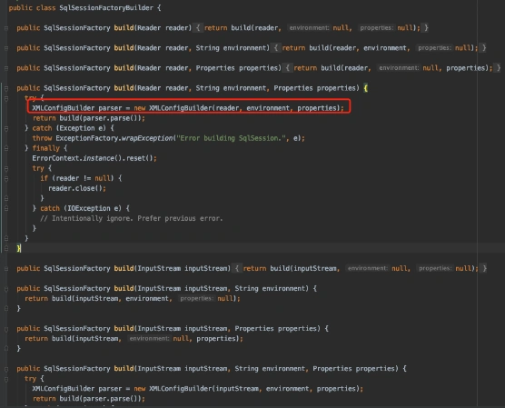

<font style="color:rgb(51, 51, 51);background-color:rgb(248, 246, 244);">它里面会创建XMLConfigBuilder类，这个类的parse方法，会解析XML文件的配置。</font>

<font style="color:rgb(51, 51, 51);background-color:rgb(248, 246, 244);">但如果接下来，直接去看parse方法的代码，非常容易迷路：</font>

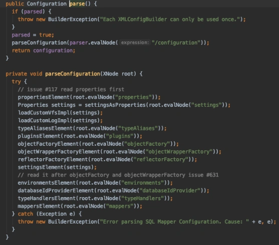

<font style="color:rgb(51, 51, 51);background-color:rgb(248, 246, 244);">它里面包含了很多解析标签的方法。</font>

<font style="color:rgb(51, 51, 51);background-color:rgb(248, 246, 244);">我此时跳到跟XMLConfigBuilder类的同一级目录下，在里面发现了一个XMLIncludeTransformer类，这个名字很像是处理include标签的地方：</font>


<font style="color:rgb(51, 51, 51);background-color:rgb(248, 246, 244);">查看了它的源码：</font>

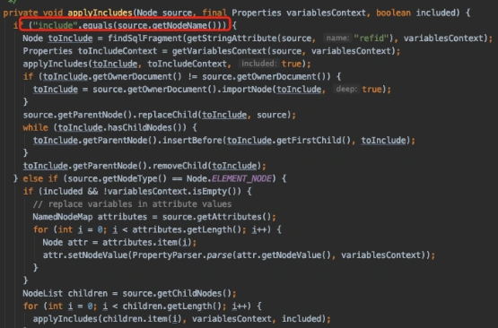

<font style="color:rgb(51, 51, 51);background-color:rgb(248, 246, 244);">发现它的applyIncludes方法，就是解析出来include标签的地方。</font>

<font style="color:rgb(51, 51, 51);background-color:rgb(248, 246, 244);">然后通过调用applyIncludes方法的地方，一步步往上追溯，发现了SqlSessionFactoryBean类的afterPropertiesSet方法：</font>

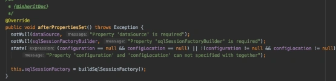

<font style="color:rgb(51, 51, 51);background-color:rgb(248, 246, 244);">而SqlSessionFactoryBean类实现了InitializingBean接口：</font>

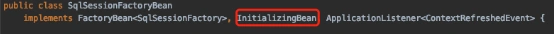

<font style="color:rgb(51, 51, 51);background-color:rgb(248, 246, 244);">原来，在mybatis-spring包中，SqlSessionFactory的创建，也是通过Spring的三种初始化方式之一的实现InitializingBean接口来做的。</font>

<font style="color:rgb(51, 51, 51);background-color:rgb(248, 246, 244);">这样就有一个先后顺序问题了。</font>

<font style="color:rgb(51, 51, 51);background-color:rgb(248, 246, 244);">即：哪个bean的初始化方法先调用？</font>

<font style="color:rgb(51, 51, 51);background-color:rgb(248, 246, 244);">带着这个疑问，我查了一下Spring的源码。</font>

<font style="color:rgb(51, 51, 51);background-color:rgb(248, 246, 244);">看一下AbstractBeanFactory类的doGetBean方法：</font>

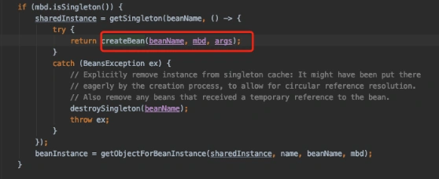

<font style="color:rgb(51, 51, 51);background-color:rgb(248, 246, 244);">它里面会调用AbstractAutowireCapableBeanFactory类的createBean方法，而这个方法会调用doCreateBean方法，该方法中有下面这段代码：</font>

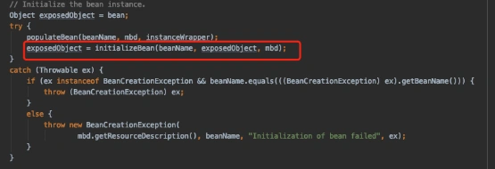

<font style="color:rgb(51, 51, 51);background-color:rgb(248, 246, 244);">这个方法中有这样一行代码，就是Spring创建了bean实例，依赖注入之后，通过initializeBeanf方法，帮我们自动完成初始化工作的。</font>

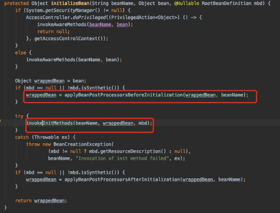

<font style="color:rgb(51, 51, 51);background-color:rgb(248, 246, 244);">这个applyBeanPostProcessorsBeforeInitialization方法内部就会调用到文章开头发现的InitDestroyAnnotationBeanPostProcessor类，完成@PostContruct注解定义的方法的初始化工作：</font>


<font style="color:rgb(51, 51, 51);background-color:rgb(248, 246, 244);">而invokeInitMethods方法中，会先调用实现了InitializingBean接口，重写了的afterPropertiesSet方法做初始化。然后还会调用定义了initMethod的初始化方法。</font>

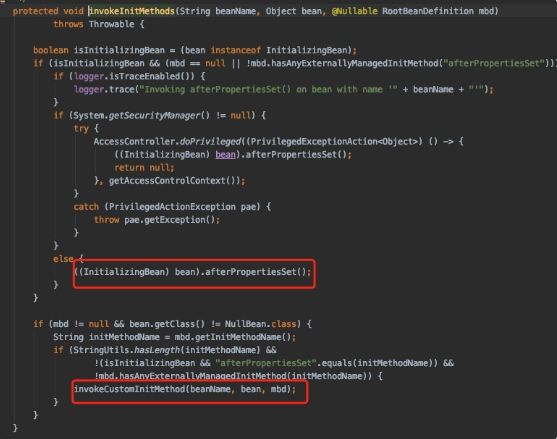

<font style="color:rgb(51, 51, 51);background-color:rgb(248, 246, 244);">Spring的三种初始化方式的调用顺序是：</font>

1. <font style="color:rgb(51, 51, 51);background-color:rgb(248, 246, 244);">@PostContruct</font>
2. <font style="color:rgb(51, 51, 51);background-color:rgb(248, 246, 244);">InitializingBean接口</font>
3. <font style="color:rgb(51, 51, 51);background-color:rgb(248, 246, 244);">initMethod</font>

<font style="color:rgb(51, 51, 51);background-color:rgb(248, 246, 244);">但这三种方式，都有一个共同的问题：即在Spring的bean在实例化过程中，不是在bean实例化之后。</font>

<font style="color:rgb(51, 51, 51);background-color:rgb(248, 246, 244);">这样就会有顺序问题了。</font>

<font style="color:rgb(51, 51, 51);background-color:rgb(248, 246, 244);">假如SqlSessionFactoryBean类是在CommonSensitiveWordService类之后初始化，不就会出现上面的问题吗？</font>

<font style="color:rgb(51, 51, 51);background-color:rgb(248, 246, 244);">我们指定一下bean实例化的顺序？</font>

<font style="color:rgb(51, 51, 51);background-color:rgb(248, 246, 244);">这要表面上可以解决问题，但可能会带来其他的未知的问题。</font>

<font style="color:rgb(51, 51, 51);background-color:rgb(248, 246, 244);">而且，如果后面有其他Service类，也使用了Spring的这三种初始化方式，每次，都要指定bean的初始化顺序？</font>

<font style="color:rgb(51, 51, 51);background-color:rgb(248, 246, 244);">显然不太合理。</font>

<font style="color:rgb(51, 51, 51);background-color:rgb(248, 246, 244);">那么，如何解决这个问题呢？</font>

<font style="color:rgb(51, 51, 51);background-color:rgb(248, 246, 244);">我记得SpringBoot也提供过初始化方法。</font>

<font style="color:rgb(51, 51, 51);background-color:rgb(248, 246, 244);">于是，我翻开了SpringBoot的源码。</font>

<font style="color:rgb(51, 51, 51);background-color:rgb(248, 246, 244);">从SpringApplication类的run方法开始。</font>

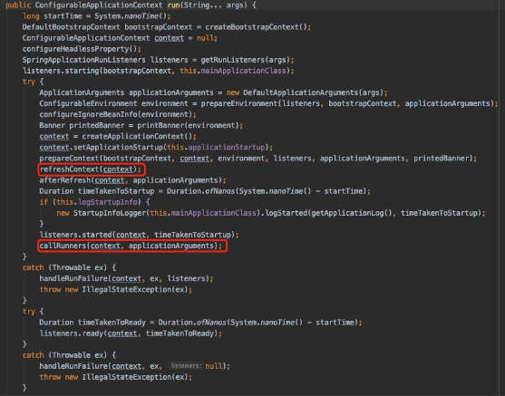

<font style="color:rgb(51, 51, 51);background-color:rgb(248, 246, 244);">它里面会先调用refreshContext方法，它会调用AbstractApplicationContext类的refresh方法，该方法完成Spring容器的创建，以及相关bean实例化，并且完成初始化。</font>

<font style="color:rgb(51, 51, 51);background-color:rgb(248, 246, 244);">接下来，会调用callRunners方法：</font>

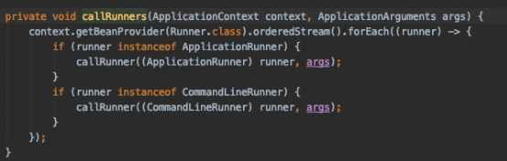

<font style="color:rgb(51, 51, 51);background-color:rgb(248, 246, 244);">这个方法会调用实现了ApplicationRunner或者CommandLineRunner接口的类的callRunner方法，底层调用的run方法。</font>

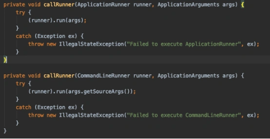

<font style="color:rgb(51, 51, 51);background-color:rgb(248, 246, 244);">我们不就可以使用这个run方法做初始化吗？</font>

## **<font style="color:rgb(34, 34, 34);background-color:rgb(248, 246, 244);">4 解决问题</font>**
<font style="color:rgb(51, 51, 51);background-color:rgb(248, 246, 244);">将CommonSensitiveWordService类实现ApplicationRunner接口，重写了run方法：</font>

```plain
@Service
public class CommonSensitiveWordService implements ApplicationRunner {
   @Override
   public void run(ApplicationArguments args) throws Exception {
     this.init();
   }
}
```

<font style="color:rgb(51, 51, 51);background-color:rgb(248, 246, 244);">在run方法中调用了我们之前写的init方法。</font>

<font style="color:rgb(51, 51, 51);background-color:rgb(248, 246, 244);">这样改造之后，重新启动项目，发现已经能够正常启动了。</font>

<font style="color:rgb(51, 51, 51);background-color:rgb(248, 246, 244);">说明Mybatis的xml文件中include标签引入外部sql的问题，被解决了。</font>

## **<font style="color:rgb(34, 34, 34);background-color:rgb(248, 246, 244);">5 总结</font>**
<font style="color:rgb(51, 51, 51);background-color:rgb(248, 246, 244);">Mybatis和Spring本身都是非常优秀的开发框架，如果单独使用，都不会出现今天的这个问题。</font>

<font style="color:rgb(51, 51, 51);background-color:rgb(248, 246, 244);">但如果二者集成使用。</font>

<font style="color:rgb(51, 51, 51);background-color:rgb(248, 246, 244);">使用了Spring的三种初始化方式之一，同时也使用了Mybatis中xml文件的include标签引入外部sql，就会出现找不到namespace的问题。</font>

<font style="color:rgb(51, 51, 51);background-color:rgb(248, 246, 244);">其实Mybatis中xml文件include本文件中的sql代码，也是没有问题的，只有include外部文件的sql代码才会有问题。</font>

<font style="color:rgb(51, 51, 51);background-color:rgb(248, 246, 244);">比如：你在生活中找某个人，自己家了有叫张三的，你肯定找得到。</font>

<font style="color:rgb(51, 51, 51);background-color:rgb(248, 246, 244);">但如果想别人家叫张三的，先要找到是哪一家的。这一步，如果没有先确定好，肯定会找不到。</font>

<font style="color:rgb(51, 51, 51);background-color:rgb(248, 246, 244);">最后总结一下文章中介绍的4种初始化方法的调用顺序如下：</font>

1. <font style="color:rgb(51, 51, 51);background-color:rgb(248, 246, 244);">@PostContruct</font>
2. <font style="color:rgb(51, 51, 51);background-color:rgb(248, 246, 244);">InitializingBean接口</font>
3. <font style="color:rgb(51, 51, 51);background-color:rgb(248, 246, 244);">initMethod</font>
4. <font style="color:rgb(51, 51, 51);background-color:rgb(248, 246, 244);">ApplicationRunner或者CommandLineRunner接口</font>


> 更新: 2024-09-05 11:00:06  
> 原文: <https://www.yuque.com/yuqueyonghue6cvnv/cxhfwd/agb4t57k9brzhdz4>