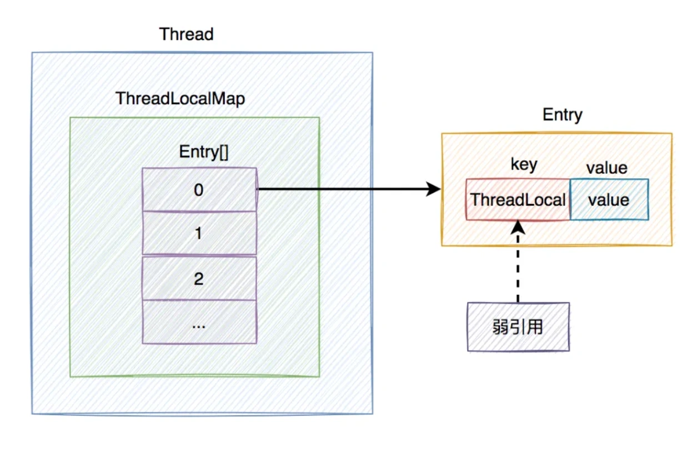
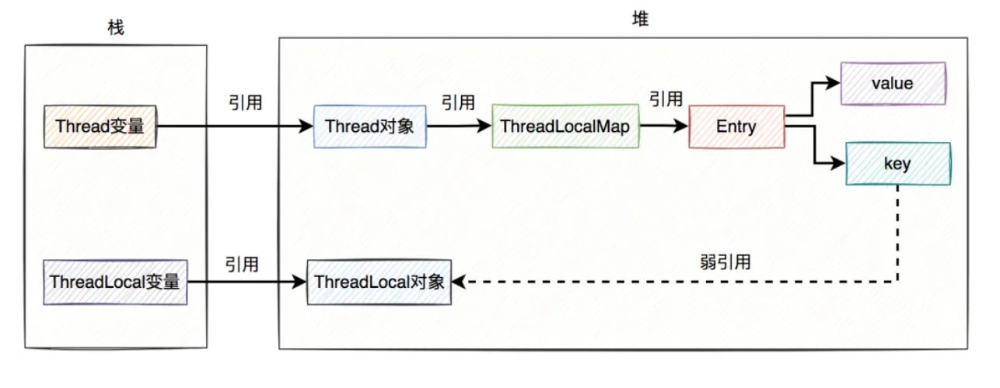
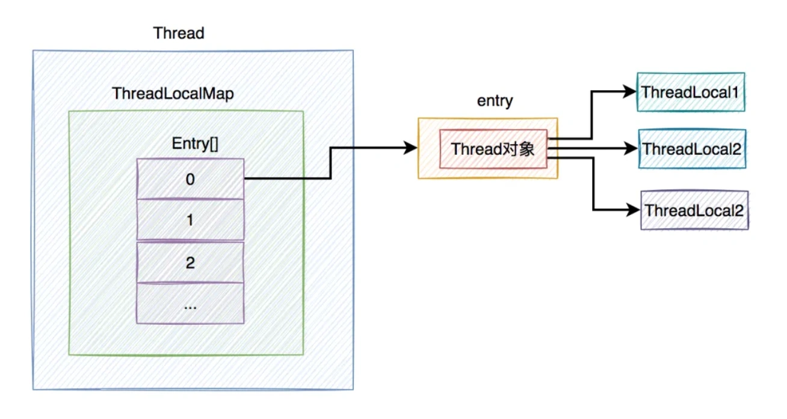
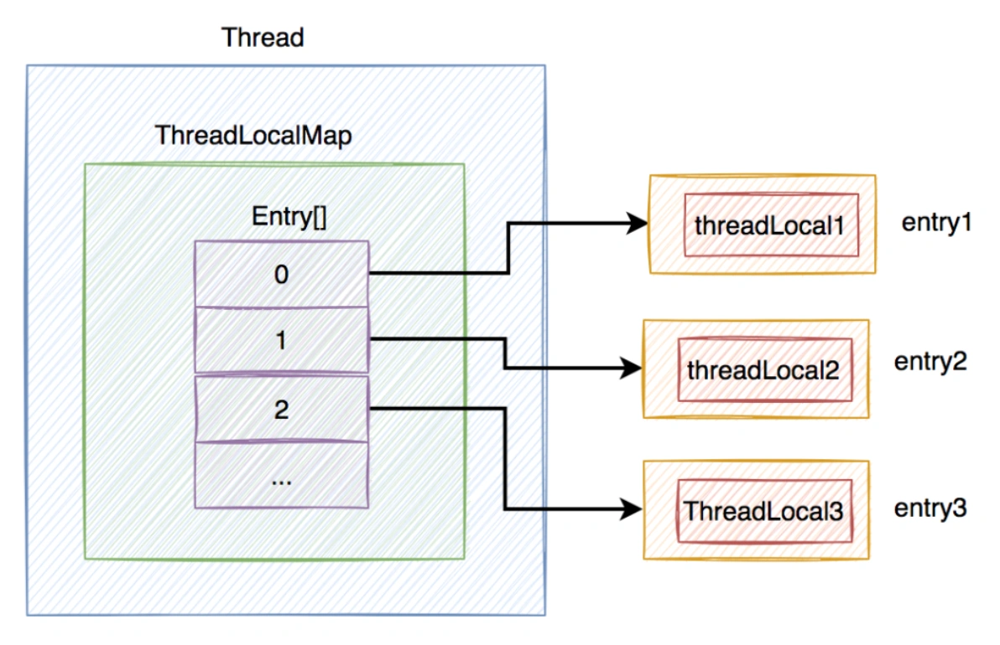
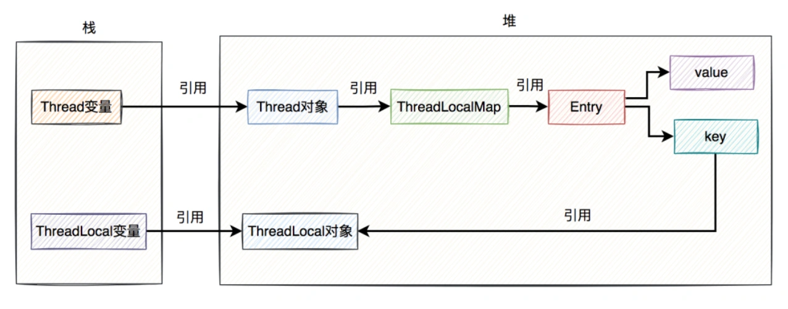
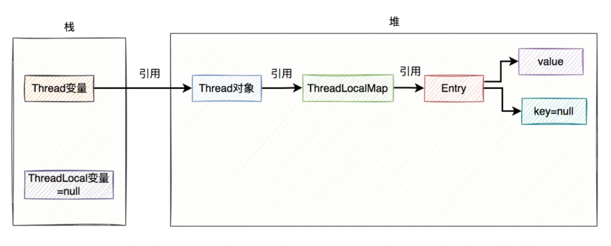
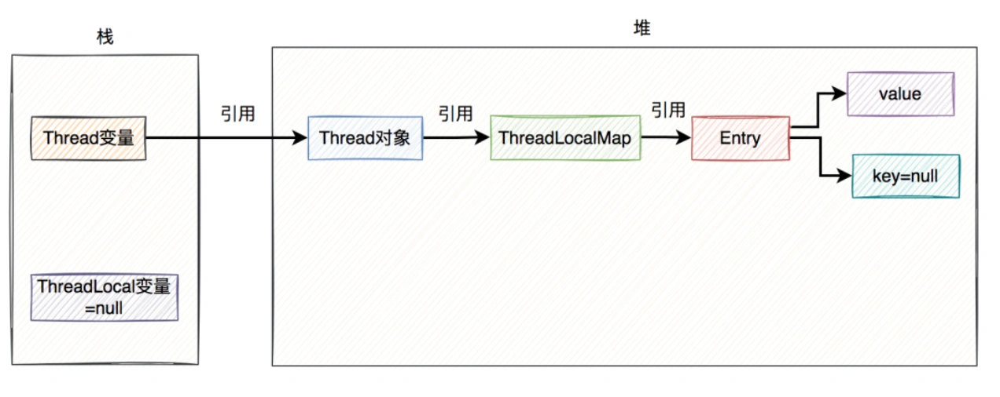
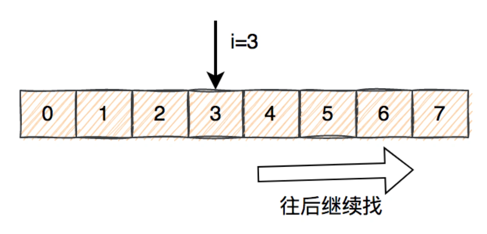
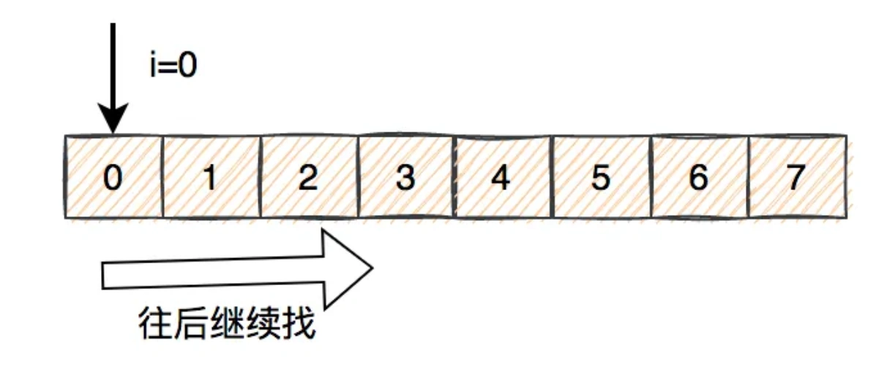
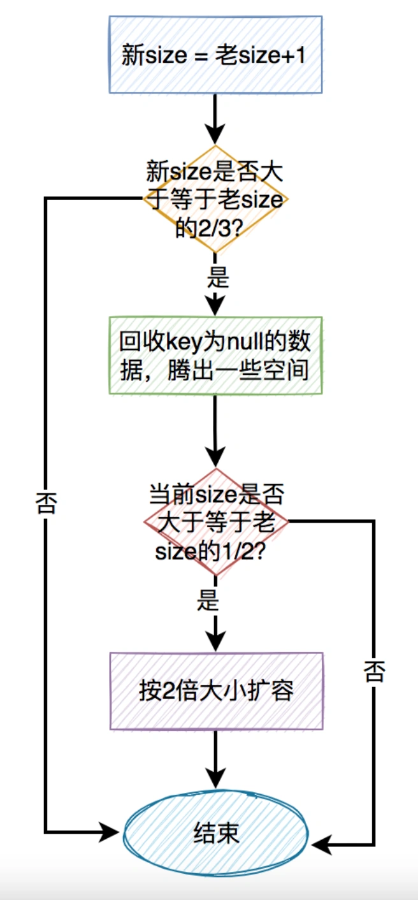

# ThreadLocal内存泄露问题

## **<font style="color:rgb(34, 34, 34);background-color:rgb(248, 246, 244);">前言</font>**
<font style="color:rgb(51, 51, 51);background-color:rgb(248, 246, 244);">前一段时间，有同事使用ThreadLocal踩坑了，正好引起了我的兴趣。</font>

<font style="color:rgb(51, 51, 51);background-color:rgb(248, 246, 244);">所以近期，我抽空把ThreadLocal的源码再研究了一下，越看越有意思，发现里面的东西还真不少。</font>

## **<font style="color:rgb(34, 34, 34);background-color:rgb(248, 246, 244);">1. 为什么要用ThreadLocal?</font>**
<font style="color:rgb(51, 51, 51);background-color:rgb(248, 246, 244);">并发编程是一项非常重要的技术，它让我们的程序变得更加高效。</font>

<font style="color:rgb(51, 51, 51);background-color:rgb(248, 246, 244);">但在并发的场景中，如果有多个线程同时修改公共变量，可能会出现线程安全问题，即该变量最终结果可能出现异常。</font>

<font style="color:rgb(51, 51, 51);background-color:rgb(248, 246, 244);">为了解决线程安全问题，JDK出现了很多技术手段，比如：使用synchronized或Lock，给访问公共资源的代码上锁，保证了代码的原子性。</font>

<font style="color:rgb(51, 51, 51);background-color:rgb(248, 246, 244);">但在高并发的场景中，如果多个线程同时竞争一把锁，这时会存在大量的锁等待，可能会浪费很多时间，让系统的响应时间一下子变慢。</font>

<font style="color:rgb(51, 51, 51);background-color:rgb(248, 246, 244);">因此，JDK还提供了另外一种用空间换时间的新思路：ThreadLocal。</font>

<font style="color:rgb(51, 51, 51);background-color:rgb(248, 246, 244);">它的核心思想是：共享变量在每个线程都有一个副本，每个线程操作的都是自己的副本，对另外的线程没有影响。</font>

<font style="color:rgb(51, 51, 51);background-color:rgb(248, 246, 244);">例如：</font>

```csharp
@Service
public class ThreadLocalService {
    private static final ThreadLocal<Integer> threadLocal = new ThreadLocal<>();

    public void add() {
        threadLocal.set(1);
        doSamething();
        Integer integer = threadLocal.get();
    }
}
```

## **<font style="color:rgb(34, 34, 34);background-color:rgb(248, 246, 244);">2. ThreadLocal的原理是什么？</font>**
<font style="color:rgb(51, 51, 51);background-color:rgb(248, 246, 244);">为了搞清楚ThreadLocal的底层实现原理，我们不得不扒一下源码。</font>

<font style="color:rgb(51, 51, 51);background-color:rgb(248, 246, 244);">ThreadLocal的内部有一个静态的内部类叫：ThreadLocalMap。</font>

```java
public class ThreadLocal<T> {
     ...
     public T get() {
        //获取当前线程
        Thread t = Thread.currentThread();
        //获取当前线程的成员变量ThreadLocalMap对象
        ThreadLocalMap map = getMap(t);
        if (map != null) {
            //根据threadLocal对象从map中获取Entry对象
            ThreadLocalMap.Entry e = map.getEntry(this);
            if (e != null) {
                @SuppressWarnings("unchecked")
                //获取保存的数据
                T result = (T)e.value;
                return result;
            }
        }
        //初始化数据
        return setInitialValue();
    }
    
    private T setInitialValue() {
        //获取要初始化的数据
        T value = initialValue();
        //获取当前线程
        Thread t = Thread.currentThread();
        //获取当前线程的成员变量ThreadLocalMap对象
        ThreadLocalMap map = getMap(t);
        //如果map不为空
        if (map != null)
            //将初始值设置到map中，key是this，即threadLocal对象，value是初始值
            map.set(this, value);
        else
           //如果map为空，则需要创建新的map对象
            createMap(t, value);
        return value;
    }
    
    public void set(T value) {
        //获取当前线程
        Thread t = Thread.currentThread();
        //获取当前线程的成员变量ThreadLocalMap对象
        ThreadLocalMap map = getMap(t);
        //如果map不为空
        if (map != null)
            //将值设置到map中，key是this，即threadLocal对象，value是传入的value值
            map.set(this, value);
        else
           //如果map为空，则需要创建新的map对象
            createMap(t, value);
    }
    
     static class ThreadLocalMap {
        ...
     }
     ...
}
```

<font style="color:rgb(51, 51, 51);background-color:rgb(248, 246, 244);">ThreadLocal的get方法、set方法和setInitialValue方法，其实最终操作的都是ThreadLocalMap类中的数据。</font>

<font style="color:rgb(51, 51, 51);background-color:rgb(248, 246, 244);">其中ThreadLocalMap类的内部如下：</font>

```plain
static class ThreadLocalMap {
    static class Entry extends WeakReference<ThreadLocal<?>> {
        Object value;

        Entry(ThreadLocal<?> k, Object v) {
            super(k);
            value = v;
        }
   }
   ...
   private Entry[] table;
   ...
}
```

<font style="color:rgb(51, 51, 51);background-color:rgb(248, 246, 244);">ThreadLocalMap里面包含一个静态的内部类Entry，该类继承于WeakReference类，说明Entry是一个弱引用。</font>

<font style="color:rgb(51, 51, 51);background-color:rgb(248, 246, 244);">ThreadLocalMap内部还包含了一个Entry数组，其中：Entry = ThreadLocal + value。</font>

<font style="color:rgb(51, 51, 51);background-color:rgb(248, 246, 244);">而ThreadLocalMap被定义成了Thread类的成员变量。</font>

```plain
public class Thread implements Runnable {
    ...
    ThreadLocal.ThreadLocalMap threadLocals = null;
}
```

<font style="color:rgb(51, 51, 51);background-color:rgb(248, 246, 244);">下面用一张图从宏观上，认识一下ThreadLocal的整体结构：</font>



<font style="color:rgb(51, 51, 51);background-color:rgb(248, 246, 244);">从上图中看出，在每个Thread类中，都有一个ThreadLocalMap的成员变量，该变量包含了一个Entry数组，该数组真正保存了ThreadLocal类set的数据。</font>

<font style="color:rgb(51, 51, 51);background-color:rgb(248, 246, 244);">Entry是由threadLocal和value组成，其中threadLocal对象是弱引用，在GC的时候，会被自动回收。而value就是ThreadLocal类set的数据。</font>

<font style="color:rgb(51, 51, 51);background-color:rgb(248, 246, 244);">下面用一张图总结一下引用关系：</font>



<font style="color:rgb(51, 51, 51);background-color:rgb(248, 246, 244);">上图中除了Entry的key对ThreadLocal对象是弱引用，其他的引用都是强引用。</font>

<font style="color:rgb(51, 51, 51);background-color:rgb(248, 246, 244);">需要特别说明的是，上图中ThreadLocal对象我画到了堆上，其实在实际的业务场景中不一定在堆上。因为如果ThreadLocal被定义成了static的，ThreadLocal的对象是类共用的，可能出现在方法区。</font>

## **<font style="color:rgb(34, 34, 34);background-color:rgb(248, 246, 244);">3. 为什么用ThreadLocal做key？</font>**
<font style="color:rgb(51, 51, 51);background-color:rgb(248, 246, 244);">不知道你有没有思考过这样一个问题：ThreadLocalMap为什么要用ThreadLocal做key，而不是用Thread做key？</font>

<font style="color:rgb(51, 51, 51);background-color:rgb(248, 246, 244);">如果在你的应用中，一个线程中只使用了一个ThreadLocal对象，那么使用Thread做key也未尝不可。</font>

```swift
@Service
public class ThreadLocalService {
    private static final ThreadLocal<Integer> threadLocal = new ThreadLocal<>();
}
```

<font style="color:rgb(51, 51, 51);background-color:rgb(248, 246, 244);">但实际情况中，你的应用，一个线程中很有可能不只使用了一个ThreadLocal对象。这时使用Thread做key不就出有问题？</font>

```swift
@Service
public class ThreadLocalService {
    private static final ThreadLocal<Integer> threadLocal1 = new ThreadLocal<>();
    private static final ThreadLocal<Integer> threadLocal2 = new ThreadLocal<>();
    private static final ThreadLocal<Integer> threadLocal3 = new ThreadLocal<>();
}
```

<font style="color:rgb(51, 51, 51);background-color:rgb(248, 246, 244);">假如使用Thread做key时，你的代码中定义了3个ThreadLocal对象，那么，通过Thread对象，它怎么知道要获取哪个ThreadLocal对象呢？</font>

<font style="color:rgb(51, 51, 51);background-color:rgb(248, 246, 244);">如下图所示：</font>



<font style="color:rgb(51, 51, 51);background-color:rgb(248, 246, 244);">因此，不能使用Thread做key，而应该改成用ThreadLocal对象做key，这样才能通过具体ThreadLocal对象的get方法，轻松获取到你想要的ThreadLocal对象。</font>

<font style="color:rgb(51, 51, 51);background-color:rgb(248, 246, 244);">如下图所示：</font>



## **<font style="color:rgb(34, 34, 34);background-color:rgb(248, 246, 244);">4. Entry的key为什么设计成弱引用？</font>**
<font style="color:rgb(51, 51, 51);background-color:rgb(248, 246, 244);">前面说过，Entry的key，传入的是ThreadLocal对象，使用了WeakReference对象，即被设计成了弱引用。</font>

<font style="color:rgb(51, 51, 51);background-color:rgb(248, 246, 244);">那么，为什么要这样设计呢？</font>

<font style="color:rgb(51, 51, 51);background-color:rgb(248, 246, 244);">假如key对ThreadLocal对象的弱引用，改为强引用。</font>



<font style="color:rgb(51, 51, 51);background-color:rgb(248, 246, 244);">我们都知道ThreadLocal变量对ThreadLocal对象是有强引用存在的。</font>

<font style="color:rgb(51, 51, 51);background-color:rgb(248, 246, 244);">即使ThreadLocal变量生命周期完了，设置成null了，但由于key对ThreadLocal还是强引用。</font>

<font style="color:rgb(51, 51, 51);background-color:rgb(248, 246, 244);">此时，如果执行该代码的线程使用了线程池，一直长期存在，不会被销毁。</font>

<font style="color:rgb(51, 51, 51);background-color:rgb(248, 246, 244);">就会存在这样的强引用链：Thread变量 -> Thread对象 -> ThreadLocalMap -> Entry -> key -> ThreadLocal对象。</font>

<font style="color:rgb(51, 51, 51);background-color:rgb(248, 246, 244);">那么，ThreadLocal对象和ThreadLocalMap都将不会被GC回收，于是产生了内存泄露问题。</font>

<font style="color:rgb(51, 51, 51);background-color:rgb(248, 246, 244);">为了解决这个问题，JDK的开发者们把Entry的key设计成了弱引用。</font>

<font style="color:rgb(100, 100, 100);background-color:rgb(248, 246, 244);">弱引用的对象，在GC做垃圾清理的时候，就会被自动回收了。</font>

<font style="color:rgb(51, 51, 51);background-color:rgb(248, 246, 244);">如果key是弱引用，当ThreadLocal变量指向null之后，在GC做垃圾清理的时候，key会被自动回收，其值也被设置成null。</font>

<font style="color:rgb(51, 51, 51);background-color:rgb(248, 246, 244);">如下图所示：</font>



**<font style="color:rgb(34, 34, 34);background-color:rgb(248, 246, 244);">接下来，最关键的地方来了。</font>**

<font style="color:rgb(51, 51, 51);background-color:rgb(248, 246, 244);">由于当前的ThreadLocal变量已经被指向null了，但如果直接调用它的get、set或remove方法，很显然会出现空指针异常。因为它的生命已经结束了，再调用它的方法也没啥意义。</font>

<font style="color:rgb(51, 51, 51);background-color:rgb(248, 246, 244);">此时，如果系统中还定义了另外一个ThreadLocal变量b，调用了它的get、set或remove，三个方法中的任何一个方法，都会自动触发清理机制，将key为null的value值清空。</font>

<font style="color:rgb(51, 51, 51);background-color:rgb(248, 246, 244);">如果key和value都是null，那么Entry对象会被GC回收。如果所有的Entry对象都被回收了，ThreadLocalMap也会被回收了。</font>

<font style="color:rgb(51, 51, 51);background-color:rgb(248, 246, 244);">这样就能最大程度的解决内存泄露问题。</font>

<font style="color:rgb(51, 51, 51);background-color:rgb(248, 246, 244);">需要特别注意的地方是：</font>

1. <font style="color:rgb(51, 51, 51);background-color:rgb(248, 246, 244);">key为null的条件是，ThreadLocal变量指向null，并且key是弱引用。如果ThreadLocal变量没有断开对ThreadLocal的强引用，即ThreadLocal变量没有指向null，GC就贸然的把弱引用的key回收了，不就会影响正常用户的使用？</font>
2. <font style="color:rgb(51, 51, 51);background-color:rgb(248, 246, 244);">如果当前ThreadLocal变量指向null了，并且key也为null了，但如果没有其他ThreadLocal变量触发get、set或remove方法，也会造成内存泄露。</font>

<font style="color:rgb(51, 51, 51);background-color:rgb(248, 246, 244);">下面看看弱引用的例子：</font>

```plain
public static void main(String[] args) {
    WeakReference<Object> weakReference0 = new WeakReference<>(new Object());
    System.out.println(weakReference0.get());
    System.gc();
    System.out.println(weakReference0.get());
}
```

<font style="color:rgb(51, 51, 51);background-color:rgb(248, 246, 244);">打印结果：</font>

```plain
java.lang.Object@1ef7fe8e
null
```

<font style="color:rgb(51, 51, 51);background-color:rgb(248, 246, 244);">传入WeakReference构造方法的是直接new处理的对象，没有其他引用，在调用gc方法后，弱引用对象会被自动回收。</font>

<font style="color:rgb(51, 51, 51);background-color:rgb(248, 246, 244);">但如果出现下面这种情况：</font>

```plain
public static void main(String[] args) {
    Object object = new Object();
    WeakReference<Object> weakReference1 = new WeakReference<>(object);
    System.out.println(weakReference1.get());
    System.gc();
    System.out.println(weakReference1.get());
}
```

<font style="color:rgb(51, 51, 51);background-color:rgb(248, 246, 244);">执行结果：</font>

```plain
java.lang.Object@1ef7fe8e
java.lang.Object@1ef7fe8e
```

<font style="color:rgb(51, 51, 51);background-color:rgb(248, 246, 244);">先定义了一个强引用object对象，在WeakReference构造方法中将object对象的引用作为参数传入。这时，调用gc后，弱引用对象不会被自动回收。</font>

<font style="color:rgb(51, 51, 51);background-color:rgb(248, 246, 244);">我们的Entry对象中的key不就是第二种情况吗？在Entry构造方法中传入的是ThreadLocal对象的引用。</font>

<font style="color:rgb(51, 51, 51);background-color:rgb(248, 246, 244);">如果将object强引用设置为null：</font>

```plain
public static void main(String[] args) {
    Object object = new Object();
    WeakReference<Object> weakReference1 = new WeakReference<>(object);
    System.out.println(weakReference1.get());
    System.gc();
    System.out.println(weakReference1.get());

    object=null;
    System.gc();
    System.out.println(weakReference1.get());
}
```

<font style="color:rgb(51, 51, 51);background-color:rgb(248, 246, 244);">执行结果：</font>

```plain
java.lang.Object@6f496d9f
java.lang.Object@6f496d9f
null
```

<font style="color:rgb(51, 51, 51);background-color:rgb(248, 246, 244);">第二次gc之后，弱引用能够被正常回收。</font>

<font style="color:rgb(100, 100, 100);background-color:rgb(248, 246, 244);">由此可见，如果强引用和弱引用同时关联一个对象，那么这个对象是不会被GC回收。也就是说这种情况下Entry的key，一直都不会为null，除非强引用主动断开关联。</font>

<font style="color:rgb(51, 51, 51);background-color:rgb(248, 246, 244);">此外，你可能还会问这样一个问题：</font>**<font style="color:rgb(34, 34, 34);background-color:rgb(248, 246, 244);">Entry的value为什么不设计成弱引用？</font>**

<font style="color:rgb(51, 51, 51);background-color:rgb(248, 246, 244);">答：Entry的value假如只是被Entry引用，有可能没被业务系统中的其他地方引用。如果将value改成了弱引用，被GC贸然回收了（数据突然没了），可能会导致业务系统出现异常。</font>

<font style="color:rgb(51, 51, 51);background-color:rgb(248, 246, 244);">而相比之下，Entry的key，管理的地方就非常明确了。</font>

<font style="color:rgb(51, 51, 51);background-color:rgb(248, 246, 244);">这就是Entry的key被设计成弱引用，而value没被设计成弱引用的原因。</font>

## **<font style="color:rgb(34, 34, 34);background-color:rgb(248, 246, 244);">5. ThreadLocal真的会导致内存泄露？</font>**
<font style="color:rgb(51, 51, 51);background-color:rgb(248, 246, 244);">通过上面的Entry对象中的key设置成弱引用，并且使用get、set或remove方法清理key为null的value值，就能彻底解决内存泄露问题？</font>

<font style="color:rgb(51, 51, 51);background-color:rgb(248, 246, 244);">答案是否定的。</font>

<font style="color:rgb(51, 51, 51);background-color:rgb(248, 246, 244);">如下图所示：</font>



<font style="color:rgb(51, 51, 51);background-color:rgb(248, 246, 244);">假如ThreadLocalMap中存在很多key为null的Entry，但后面的程序，一直都没有调用过有效的ThreadLocal的get、set或remove方法。</font>

<font style="color:rgb(51, 51, 51);background-color:rgb(248, 246, 244);">那么，Entry的value值一直都没被清空。</font>

<font style="color:rgb(51, 51, 51);background-color:rgb(248, 246, 244);">所以会存在这样一条强引用链：Thread变量 -> Thread对象 -> ThreadLocalMap -> Entry -> value -> Object。</font>

<font style="color:rgb(51, 51, 51);background-color:rgb(248, 246, 244);">其结果就是：Entry和ThreadLocalMap将会长期存在下去，会导致内存泄露。</font>

## **<font style="color:rgb(34, 34, 34);background-color:rgb(248, 246, 244);">6. 如何解决内存泄露问题？</font>**
<font style="color:rgb(51, 51, 51);background-color:rgb(248, 246, 244);">前面说过的ThreadLocal还是会导致内存泄露的问题，我们有没有解决办法呢？</font>

<font style="color:rgb(51, 51, 51);background-color:rgb(248, 246, 244);">答：有办法，调用ThreadLocal对象的remove方法。</font>

<font style="color:rgb(51, 51, 51);background-color:rgb(248, 246, 244);">不是在一开始就调用remove方法，而是在使用完ThreadLocal对象之后。列如：</font>

<font style="color:rgb(51, 51, 51);background-color:rgb(248, 246, 244);">先创建一个CurrentUser类，其中包含了ThreadLocal的逻辑。</font>

```csharp
public class CurrentUser {
    private static final ThreadLocal<UserInfo> THREA_LOCAL = new ThreadLocal();
    
    public static void set(UserInfo userInfo) {
        THREA_LOCAL.set(userInfo);
    }
    
    public static UserInfo get() {
       THREA_LOCAL.get();
    }
    
    public static void remove() {
       THREA_LOCAL.remove();
    }
}
```

<font style="color:rgb(51, 51, 51);background-color:rgb(248, 246, 244);">然后在业务代码中调用相关方法：</font>

```csharp
public void doSamething(UserDto userDto) {
   UserInfo userInfo = convert(userDto);
   
   try{
     CurrentUser.set(userInfo);
     ...
     
     //业务代码
     UserInfo userInfo = CurrentUser.get();
     ...
   } finally {
      CurrentUser.remove();
   }
}
```

<font style="color:rgb(51, 51, 51);background-color:rgb(248, 246, 244);">需要我们特别注意的地方是：一定要在finally代码块中，调用remove方法清理没用的数据。如果业务代码出现异常，也能及时清理没用的数据。</font>

<font style="color:rgb(51, 51, 51);background-color:rgb(248, 246, 244);">remove方法中会把Entry中的key和value都设置成null，这样就能被GC及时回收，无需触发额外的清理机制，所以它能解决内存泄露问题。</font>

## **<font style="color:rgb(34, 34, 34);background-color:rgb(248, 246, 244);">7. ThreadLocal是如何定位数据的？</font>**
<font style="color:rgb(51, 51, 51);background-color:rgb(248, 246, 244);">前面说过ThreadLocalMap对象底层是用Entry数组保存数据的。</font>

<font style="color:rgb(51, 51, 51);background-color:rgb(248, 246, 244);">那么问题来了，ThreadLocal是如何定位Entry数组数据的？</font>

<font style="color:rgb(51, 51, 51);background-color:rgb(248, 246, 244);">在ThreadLocal的get、set、remove方法中都有这样一行代码：</font>

```plain
int i = key.threadLocalHashCode & (len-1);
```

<font style="color:rgb(51, 51, 51);background-color:rgb(248, 246, 244);">通过key的hashCode值，与数组的长度减1。其中key就是ThreadLocal对象，与数组的长度减1，相当于除以数组的长度减1，然后取模。</font>

<font style="color:rgb(51, 51, 51);background-color:rgb(248, 246, 244);">这是一种hash算法。</font>

<font style="color:rgb(51, 51, 51);background-color:rgb(248, 246, 244);">接下来给大家举个例子：假设len=16，key.threadLocalHashCode=31，</font>

<font style="color:rgb(51, 51, 51);background-color:rgb(248, 246, 244);">于是： int i = 31 & 15 = 15</font>

<font style="color:rgb(51, 51, 51);background-color:rgb(248, 246, 244);">相当于：int i = 31 % 16 = 15</font>

<font style="color:rgb(51, 51, 51);background-color:rgb(248, 246, 244);">计算的结果是一样的，但是使用与运算效率跟高一些。</font>

<font style="color:rgb(51, 51, 51);background-color:rgb(248, 246, 244);">为什么与运算效率更高？</font>

<font style="color:rgb(51, 51, 51);background-color:rgb(248, 246, 244);">答：因为ThreadLocal的初始大小是16，每次都是按2倍扩容，数组的大小其实一直都是2的n次方。这种数据有个规律就是高位是0，低位都是1。在做与运算时，可以不用考虑高位，因为与运算的结果必定是0。只需考虑低位的与运算，所以效率更高。</font>

<font style="color:rgb(51, 51, 51);background-color:rgb(248, 246, 244);">如果使用hash算法定位具体位置的话，就可能会出现hash冲突的情况，即两个不同的hashCode取模后的值相同。</font>

<font style="color:rgb(51, 51, 51);background-color:rgb(248, 246, 244);">ThreadLocal是如何解决hash冲突的呢？</font>

<font style="color:rgb(51, 51, 51);background-color:rgb(248, 246, 244);">我们看看getEntry是怎么做的：</font>

```plain
private Entry getEntry(ThreadLocal<?> key) {
    //通过hash算法获取下标值
    int i = key.threadLocalHashCode & (table.length - 1);
    Entry e = table[i];
    //如果下标位置上的key正好是我们所需要寻找的key
    if (e != null && e.get() == key)
        //说明找到数据了，直接返回
        return e;
    else
        //说明出现hash冲突了，继续往后找
        return getEntryAfterMiss(key, i, e);
}
```

<font style="color:rgb(51, 51, 51);background-color:rgb(248, 246, 244);">再看看getEntryAfterMiss方法：</font>

```csharp
private Entry getEntryAfterMiss(ThreadLocal<?> key, int i, Entry e) {
    Entry[] tab = table;
    int len = tab.length;

    //判断Entry对象如果不为空，则一直循环
    while (e != null) {
        ThreadLocal<?> k = e.get();
        //如果当前Entry的key正好是我们所需要寻找的key
        if (k == key)
            //说明这次真的找到数据了
            return e;
        if (k == null)
            //如果key为空，则清理脏数据
            expungeStaleEntry(i);
        else
            //如果还是没找到数据，则继续往后找
            i = nextIndex(i, len);
        e = tab[i];
    }
    return null;
}
```

<font style="color:rgb(51, 51, 51);background-color:rgb(248, 246, 244);">关键看看nextIndex方法：</font>

```cpp
private static int nextIndex(int i, int len) {
    return ((i + 1 < len) ? i + 1 : 0);
}
```

<font style="color:rgb(51, 51, 51);background-color:rgb(248, 246, 244);">当通过hash算法计算出的下标小于数组大小，则将下标值加1。否则，即下标大于等于数组大小，下标变成0了。下标变成0之后，则循环一次，下标又变成1。。。</font>

<font style="color:rgb(51, 51, 51);background-color:rgb(248, 246, 244);">寻找的大致过程如下图所示：</font>



<font style="color:rgb(51, 51, 51);background-color:rgb(248, 246, 244);">如果找到最后一个，还是没有找到，则再从头开始找。</font>



<font style="color:rgb(51, 51, 51);background-color:rgb(248, 246, 244);">不知道你有没有发现，它构成了一个：环形。</font>

<font style="color:rgb(51, 51, 51);background-color:rgb(248, 246, 244);">ThreadLocal从数组中找数据的过程大致是这样的：</font>

1. <font style="color:rgb(51, 51, 51);background-color:rgb(248, 246, 244);">通过key的hashCode取余计算出一个下标。</font>
2. <font style="color:rgb(51, 51, 51);background-color:rgb(248, 246, 244);">通过下标，在数组中定位具体Entry，如果key正好是我们所需要的key，说明找到了，则直接返回数据。</font>
3. <font style="color:rgb(51, 51, 51);background-color:rgb(248, 246, 244);">如果第2步没有找到我们想要的数据，则从数组的下标位置，继续往后面找。</font>
4. <font style="color:rgb(51, 51, 51);background-color:rgb(248, 246, 244);">如果第3步中找key的正好是我们所需要的key，说明找到了，则直接返回数据。</font>
5. <font style="color:rgb(51, 51, 51);background-color:rgb(248, 246, 244);">如果还是没有找到数据，再继续往后面找。如果找到最后一个位置，还是没有找到数据，则再从头，即下标为0的位置，继续从前往后找数据。</font>
6. <font style="color:rgb(51, 51, 51);background-color:rgb(248, 246, 244);">直到找到第一个Entry为空为止。</font>

## **<font style="color:rgb(34, 34, 34);background-color:rgb(248, 246, 244);">8. ThreadLocal是如何扩容的？</font>**
<font style="color:rgb(51, 51, 51);background-color:rgb(248, 246, 244);">从上面得知，ThreadLocal的初始大小是16。那么问题来了，ThreadLocal是如何扩容的？</font>

<font style="color:rgb(51, 51, 51);background-color:rgb(248, 246, 244);">在set方法中会调用rehash方法：</font>

```plain
private void set(ThreadLocal<?> key, Object value) {
    Entry[] tab = table;
    int len = tab.length;
    int i = key.threadLocalHashCode & (len-1);

    for (Entry e = tab[i];
         e != null;
         e = tab[i = nextIndex(i, len)]) {
        ThreadLocal<?> k = e.get();

        if (k == key) {
            e.value = value;
            return;
        }

        if (k == null) {
            replaceStaleEntry(key, value, i);
            return;
        }
    }

    tab[i] = new Entry(key, value);
    int sz = ++size;
    if (!cleanSomeSlots(i, sz) && sz >= threshold)
        rehash();
}
```

<font style="color:rgb(51, 51, 51);background-color:rgb(248, 246, 244);">注意一下，其中有个判断条件是：sz(之前的size+1)如果大于或等于threshold的话，则调用rehash方法。</font>

<font style="color:rgb(51, 51, 51);background-color:rgb(248, 246, 244);">threshold默认是0，在创建ThreadLocalMap时，调用它的构造方法：</font>

```plain
ThreadLocalMap(ThreadLocal<?> firstKey, Object firstValue) {
    table = new Entry[INITIAL_CAPACITY];
    int i = firstKey.threadLocalHashCode & (INITIAL_CAPACITY - 1);
    table[i] = new Entry(firstKey, firstValue);
    size = 1;
    setThreshold(INITIAL_CAPACITY);
}
```

<font style="color:rgb(51, 51, 51);background-color:rgb(248, 246, 244);">调用setThreshold方法给threshold设置一个值，而这个值INITIAL_CAPACITY是默认的大小16。</font>

```cpp
private void setThreshold(int len) {
    threshold = len * 2 / 3;
}
```

<font style="color:rgb(51, 51, 51);background-color:rgb(248, 246, 244);">也就是第一次设置的threshold = 16 * 2 / 3， 取整后的值是：10。</font>

<font style="color:rgb(51, 51, 51);background-color:rgb(248, 246, 244);">换句话说当sz大于等于10时，就可以考虑扩容了。</font>

<font style="color:rgb(51, 51, 51);background-color:rgb(248, 246, 244);">rehash代码如下：</font>

```plain
private void rehash() {
    //先尝试回收一次key为null的值，腾出一些空间
    expungeStaleEntries();

    if (size >= threshold - threshold / 4)
        resize();
}
```

<font style="color:rgb(51, 51, 51);background-color:rgb(248, 246, 244);">在真正扩容之前，先尝试回收一次key为null的值，腾出一些空间。</font>

<font style="color:rgb(51, 51, 51);background-color:rgb(248, 246, 244);">如果回收之后的size大于等于threshold的3/4时，才需要真正的扩容。</font>

<font style="color:rgb(51, 51, 51);background-color:rgb(248, 246, 244);">计算公式如下：</font>

```plain
16 * 2 * 4 / 3 * 4 - 16 * 2 / 3 * 4 = 8
```

<font style="color:rgb(51, 51, 51);background-color:rgb(248, 246, 244);">也就是说添加数据后，新的size大于等于老size的1/2时，才需要扩容。</font>

```plain
private void resize() {
    Entry[] oldTab = table;
    int oldLen = oldTab.length;
    //按2倍的大小扩容
    int newLen = oldLen * 2;
    Entry[] newTab = new Entry[newLen];
    int count = 0;

    for (int j = 0; j < oldLen; ++j) {
        Entry e = oldTab[j];
        if (e != null) {
            ThreadLocal<?> k = e.get();
            if (k == null) {
                e.value = null; // Help the GC
            } else {
                int h = k.threadLocalHashCode & (newLen - 1);
                while (newTab[h] != null)
                    h = nextIndex(h, newLen);
                newTab[h] = e;
                count++;
            }
        }
    }

    setThreshold(newLen);
    size = count;
    table = newTab;
}
```

<font style="color:rgb(51, 51, 51);background-color:rgb(248, 246, 244);">resize中每次都是按2倍的大小扩容。</font>

<font style="color:rgb(51, 51, 51);background-color:rgb(248, 246, 244);">扩容的过程如下图所示：</font>



<font style="color:rgb(51, 51, 51);background-color:rgb(248, 246, 244);">扩容的关键步骤如下：</font>

1. <font style="color:rgb(51, 51, 51);background-color:rgb(248, 246, 244);">老size + 1 = 新size</font>
2. <font style="color:rgb(51, 51, 51);background-color:rgb(248, 246, 244);">如果新size大于等于老size的2/3时，需要考虑扩容。</font>
3. <font style="color:rgb(51, 51, 51);background-color:rgb(248, 246, 244);">扩容前先尝试回收一次key为null的值，腾出一些空间。</font>
4. <font style="color:rgb(51, 51, 51);background-color:rgb(248, 246, 244);">如果回收之后发现size还是大于等于老size的1/2时，才需要真正的扩容。</font>
5. <font style="color:rgb(51, 51, 51);background-color:rgb(248, 246, 244);">每次都是按2倍的大小扩容。</font>

## **<font style="color:rgb(34, 34, 34);background-color:rgb(248, 246, 244);">9. 父子线程如何共享数据？</font>**
<font style="color:rgb(51, 51, 51);background-color:rgb(248, 246, 244);">前面介绍的ThreadLocal都是在一个线程中保存和获取数据的。</font>

<font style="color:rgb(51, 51, 51);background-color:rgb(248, 246, 244);">但在实际工作中，有可能是在父子线程中共享数据的。即在父线程中往ThreadLocal设置了值，在子线程中能够获取到。</font>

<font style="color:rgb(51, 51, 51);background-color:rgb(248, 246, 244);">例如：</font>

```plain
public class ThreadLocalTest {

    public static void main(String[] args) {
        ThreadLocal<Integer> threadLocal = new ThreadLocal<>();
        threadLocal.set(6);
        System.out.println("父线程获取数据：" + threadLocal.get());

        new Thread(() -> {
            System.out.println("子线程获取数据：" + threadLocal.get());
        }).start();
    }
}
```

<font style="color:rgb(51, 51, 51);background-color:rgb(248, 246, 244);">执行结果：</font>

```plain
父线程获取数据：6
子线程获取数据：null
```

<font style="color:rgb(51, 51, 51);background-color:rgb(248, 246, 244);">你会发现，在这种情况下使用ThreadLocal是行不通的。main方法是在主线程中执行的，相当于父线程。在main方法中开启了另外一个线程，相当于子线程。</font>

<font style="color:rgb(51, 51, 51);background-color:rgb(248, 246, 244);">显然通过ThreadLocal，无法在父子线程中共享数据。</font>

<font style="color:rgb(51, 51, 51);background-color:rgb(248, 246, 244);">那么，该怎么办呢？</font>

<font style="color:rgb(51, 51, 51);background-color:rgb(248, 246, 244);">答：使用InheritableThreadLocal，它是JDK自带的类，继承了ThreadLocal类。</font>

<font style="color:rgb(51, 51, 51);background-color:rgb(248, 246, 244);">修改代码之后：</font>

```plain
public class ThreadLocalTest {

    public static void main(String[] args) {
        InheritableThreadLocal<Integer> threadLocal = new InheritableThreadLocal<>();
        threadLocal.set(6);
        System.out.println("父线程获取数据：" + threadLocal.get());

        new Thread(() -> {
            System.out.println("子线程获取数据：" + threadLocal.get());
        }).start();
    }
}
```

<font style="color:rgb(51, 51, 51);background-color:rgb(248, 246, 244);">执行结果：</font>

```plain
父线程获取数据：6
子线程获取数据：6
```

<font style="color:rgb(51, 51, 51);background-color:rgb(248, 246, 244);">果然，在换成InheritableThreadLocal之后，在子线程中能够正常获取父线程中设置的值。</font>

<font style="color:rgb(51, 51, 51);background-color:rgb(248, 246, 244);">其实，在Thread类中除了成员变量threadLocals之外，还有另一个成员变量：inheritableThreadLocals。</font>

<font style="color:rgb(51, 51, 51);background-color:rgb(248, 246, 244);">Thread类的部分代码如下：</font>

```plain
ThreadLocal.ThreadLocalMap threadLocals = null;
ThreadLocal.ThreadLocalMap inheritableThreadLocals = null;
```

<font style="color:rgb(51, 51, 51);background-color:rgb(248, 246, 244);">最关键的一点是，在它的init方法中会将父线程中往ThreadLocal设置的值，拷贝一份到子线程中。</font>

<font style="color:rgb(51, 51, 51);background-color:rgb(248, 246, 244);">感兴趣的小伙伴，可以找我私聊。或者看看我后面的文章，后面还会有专栏。</font>

## **<font style="color:rgb(34, 34, 34);background-color:rgb(248, 246, 244);">10. 线程池中如何共享数据？</font>**
<font style="color:rgb(51, 51, 51);background-color:rgb(248, 246, 244);">在真实的业务场景中，一般很少用单独的线程，绝大多数，都是用的线程池。</font>

<font style="color:rgb(51, 51, 51);background-color:rgb(248, 246, 244);">那么，在线程池中如何共享ThreadLocal对象生成的数据呢？</font>

<font style="color:rgb(51, 51, 51);background-color:rgb(248, 246, 244);">因为涉及到不同的线程，如果直接使用ThreadLocal，显然是不合适的。</font>

<font style="color:rgb(51, 51, 51);background-color:rgb(248, 246, 244);">我们应该使用InheritableThreadLocal，具体代码如下：</font>

```csharp
private static void fun1() {
    InheritableThreadLocal<Integer> threadLocal = new InheritableThreadLocal<>();
    threadLocal.set(6);
    System.out.println("父线程获取数据：" + threadLocal.get());

    ExecutorService executorService = Executors.newSingleThreadExecutor();

    threadLocal.set(6);
    executorService.submit(() -> {
        System.out.println("第一次从线程池中获取数据：" + threadLocal.get());
    });

    threadLocal.set(7);
    executorService.submit(() -> {
        System.out.println("第二次从线程池中获取数据：" + threadLocal.get());
    });
}
```

<font style="color:rgb(51, 51, 51);background-color:rgb(248, 246, 244);">执行结果：</font>

```plain
父线程获取数据：6
第一次从线程池中获取数据：6
第二次从线程池中获取数据：6
```

<font style="color:rgb(51, 51, 51);background-color:rgb(248, 246, 244);">由于这个例子中使用了单例线程池，固定线程数是1。</font>

<font style="color:rgb(51, 51, 51);background-color:rgb(248, 246, 244);">第一次submit任务的时候，该线程池会自动创建一个线程。因为使用了InheritableThreadLocal，所以创建线程时，会调用它的init方法，将父线程中的inheritableThreadLocals数据复制到子线程中。所以我们看到，在主线程中将数据设置成6，第一次从线程池中获取了正确的数据6。</font>

<font style="color:rgb(51, 51, 51);background-color:rgb(248, 246, 244);">之后，在主线程中又将数据改成7，但在第二次从线程池中获取数据却依然是6。</font>

<font style="color:rgb(51, 51, 51);background-color:rgb(248, 246, 244);">因为第二次submit任务的时候，线程池中已经有一个线程了，就直接拿过来复用，不会再重新创建线程了。所以不会再调用线程的init方法，所以第二次其实没有获取到最新的数据7，还是获取的老数据6。</font>

<font style="color:rgb(51, 51, 51);background-color:rgb(248, 246, 244);">那么，这该怎么办呢？</font>

<font style="color:rgb(51, 51, 51);background-color:rgb(248, 246, 244);">答：使用TransmittableThreadLocal，它并非JDK自带的类，而是阿里巴巴开源jar包中的类。</font>

<font style="color:rgb(51, 51, 51);background-color:rgb(248, 246, 244);">可以通过如下pom文件引入该jar包：</font>

```xml
<dependency>
   <groupId>com.alibaba</groupId>
   <artifactId>transmittable-thread-local</artifactId>
   <version>2.11.0</version>
   <scope>compile</scope>
</dependency>
```

<font style="color:rgb(51, 51, 51);background-color:rgb(248, 246, 244);">代码调整如下：</font>

```plain
private static void fun2() throws Exception {
    TransmittableThreadLocal<Integer> threadLocal = new TransmittableThreadLocal<>();
    threadLocal.set(6);
    System.out.println("父线程获取数据：" + threadLocal.get());

    ExecutorService ttlExecutorService = TtlExecutors.getTtlExecutorService(Executors.newFixedThreadPool(1));

    threadLocal.set(6);
    ttlExecutorService.submit(() -> {
        System.out.println("第一次从线程池中获取数据：" + threadLocal.get());
    });

    threadLocal.set(7);
    ttlExecutorService.submit(() -> {
        System.out.println("第二次从线程池中获取数据：" + threadLocal.get());
    });

}
```

<font style="color:rgb(51, 51, 51);background-color:rgb(248, 246, 244);">执行结果：</font>

```plain
父线程获取数据：6
第一次从线程池中获取数据：6
第二次从线程池中获取数据：7
```

<font style="color:rgb(51, 51, 51);background-color:rgb(248, 246, 244);">我们看到，使用了TransmittableThreadLocal之后，第二次从线程中也能正确获取最新的数据7了。</font>

<font style="color:rgb(51, 51, 51);background-color:rgb(248, 246, 244);">nice。</font>

<font style="color:rgb(51, 51, 51);background-color:rgb(248, 246, 244);">如果你仔细观察这个例子，你可能会发现，代码中除了使用TransmittableThreadLocal类之外，还使用了TtlExecutors.getTtlExecutorService方法，去创建ExecutorService对象。</font>

<font style="color:rgb(51, 51, 51);background-color:rgb(248, 246, 244);">这是非常重要的地方，如果没有这一步，TransmittableThreadLocal在线程池中共享数据将不会起作用。</font>

<font style="color:rgb(51, 51, 51);background-color:rgb(248, 246, 244);">创建ExecutorService对象，底层的submit方法会TtlRunnable或TtlCallable对象。</font>

<font style="color:rgb(51, 51, 51);background-color:rgb(248, 246, 244);">以TtlRunnable类为例，它实现了Runnable接口，同时还实现了它的run方法：</font>

```typescript
public void run() {
    Map<TransmittableThreadLocal<?>, Object> copied = (Map)this.copiedRef.get();
    if (copied != null && (!this.releaseTtlValueReferenceAfterRun || this.copiedRef.compareAndSet(copied, (Object)null))) {
        Map backup = TransmittableThreadLocal.backupAndSetToCopied(copied);

        try {
            this.runnable.run();
        } finally {
            TransmittableThreadLocal.restoreBackup(backup);
        }
    } else {
        throw new IllegalStateException("TTL value reference is released after run!");
    }
}
```

<font style="color:rgb(51, 51, 51);background-color:rgb(248, 246, 244);">这段代码的主要逻辑如下：</font>

1. <font style="color:rgb(51, 51, 51);background-color:rgb(248, 246, 244);">把当时的ThreadLocal做个备份，然后将父类的ThreadLocal拷贝过来。</font>
2. <font style="color:rgb(51, 51, 51);background-color:rgb(248, 246, 244);">执行真正的run方法，可以获取到父类最新的ThreadLocal数据。</font>
3. <font style="color:rgb(51, 51, 51);background-color:rgb(248, 246, 244);">从备份的数据中，恢复当时的ThreadLocal数据。</font>

## **<font style="color:rgb(34, 34, 34);background-color:rgb(248, 246, 244);">11. ThreadLocal有哪些用途？</font>**
<font style="color:rgb(51, 51, 51);background-color:rgb(248, 246, 244);">最后，一起聊聊ThreadLocal有哪些用途？</font>

<font style="color:rgb(51, 51, 51);background-color:rgb(248, 246, 244);">老实说，使用ThreadLocal的场景挺多的。</font>

<font style="color:rgb(51, 51, 51);background-color:rgb(248, 246, 244);">下面列举几个常见的场景：</font>

1. <font style="color:rgb(51, 51, 51);background-color:rgb(248, 246, 244);">在spring事务中，保证一个线程下，一个事务的多个操作拿到的是一个Connection。</font>
2. <font style="color:rgb(51, 51, 51);background-color:rgb(248, 246, 244);">在hiberate中管理session。</font>
3. <font style="color:rgb(51, 51, 51);background-color:rgb(248, 246, 244);">在JDK8之前，为了解决SimpleDateFormat的线程安全问题。</font>
4. <font style="color:rgb(51, 51, 51);background-color:rgb(248, 246, 244);">获取当前登录用户上下文。</font>
5. <font style="color:rgb(51, 51, 51);background-color:rgb(248, 246, 244);">临时保存权限数据。</font>
6. <font style="color:rgb(51, 51, 51);background-color:rgb(248, 246, 244);">使用MDC保存日志信息。</font>

<font style="color:rgb(51, 51, 51);background-color:rgb(248, 246, 244);">等等，还有很多业务场景，这里就不一一列举了。</font>

<font style="color:rgb(51, 51, 51);background-color:rgb(248, 246, 244);">由于篇幅有限，今天的内容先分享到这里。希望你看了这篇文章，会有所收获。</font>

  
 


> 更新: 2024-05-20 17:04:46  
> 原文: <https://www.yuque.com/yuqueyonghue6cvnv/cxhfwd/kdyqokwbkglkqsfr>