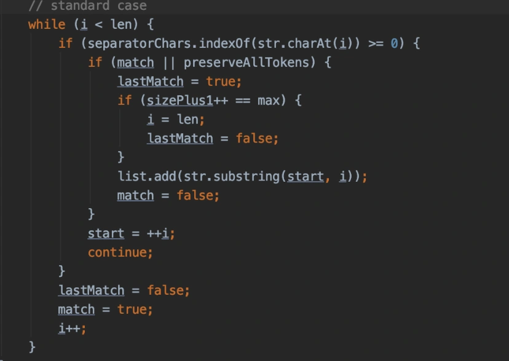

# apache的StringUtils类有坑

## **前言**
我之前经常在文章中推荐大家使用apache的common包，下面有很多非常好用的工具类，比如：StringUtils、CollectionUtils等，对于字符串和集合的处理非常方便。

但我这两天却踩了StringUtils工具类的一个坑，今天拿出来跟大家分享一下，希望对你会有所帮助。

## **案发现场**
这几天有个新需求，需要解析属性范围，比如：200mm

这个需求有多条业务线参与，为了统一大家的解析逻辑，我直接在公司的SDK功能jar包中，提供了一个util类，其他业务系统，因为引入了公共的SDK，他们在代码中可以直接使用这个util类中的方法。

我在代码中使用apache的common包下的StringUtils方法时出现了bug返回的结果跟我想象的不一样，当时是这样写的：

String[] values = StringUtils.split("200mm

使用<=截取字符串200mm

但实际情况返回了：200mm、L、300mm，三个子字符串。

这就把我整的有点懵了。

莫非静态这个方法有bug？

## **分析问题**
出现这个问题，我当时第一个想到的时，莫非=号在正则匹配的时候被转义了？

于是使用：

String[] values = StringUtils.split("200mm

String[] values = StringUtils.split("200mm

这两种方式都试了一下，解析的结果还是有问题。

接下来换成JDK自带的String类的split方法，代码改成这样：

String[] values = "200mm

代码运行之后，返回结果正常，返回了200mm

然后改成Spring的StringUtils类的split方法：

String[] values = StringUtils.split("200mm

代码运行之后，返回结果也正常。

只有apache的common包下的StringUtils类的split方法返回结果不对。

莫非这个方法真的有bug？

于是，我查看了该split方法源码。

关键的代码在这里：

原来它的底层是使用<=跟字符串200mm

我去，原来是这样的。

## **正确用法**
于是，我继续查了apache的common包下的StringUtils类，看看有没有split开头的其他方法能够实现我们想要功能的。

另外意外的是，没有找到。。。

之后，我改成了String类的split方法解决了这个问题。

那么，apache的common包下的StringUtils类的这个静态的split方法，到底是干嘛的？

这个方法其实是这样用的：

String[] values = StringUtils.split("200mm,300;mm",",;");

可以将该字符串拆分成：200mm、300和mm三个值。

这个方法可以按我们指定的每个分隔符，比如：,或;，去截取字符串，不能把,;作为整体作为一个分隔符去截取字符串。

因此，StringUtils类不能完全替代String类的功能，这一点是需要大家注意的地方。

此外，最最最关键的地方是，使用第三方工具类的方法时，一定要了解清楚，避免想当然的以为某个功能是这样的，但实际的结果却是那样的。

当然String类的方法也有一些坑，后面有机会给大家分享一下。

  
 

> 更新: 2024-07-19 23:49:09  
> 原文: <https://www.yuque.com/yuqueyonghue6cvnv/cxhfwd/mdq11l21f0zf7urc>