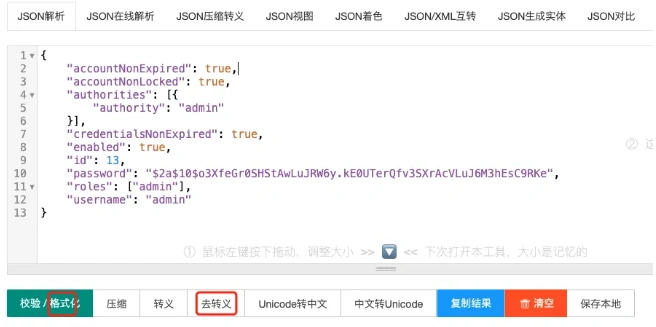
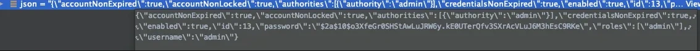

# json反序列化问题

## **<font style="color:rgb(34, 34, 34);background-color:rgb(248, 246, 244);">前言</font>**
<font style="color:rgb(51, 51, 51);background-color:rgb(248, 246, 244);">最近我在做知识星球中的商品秒杀系统，昨天遇到了一个诡异的json反序列化问题，感觉挺有意思的，现在拿出来跟大家一起分享一下，希望对你会有所帮助。</font>

## **<font style="color:rgb(34, 34, 34);background-color:rgb(248, 246, 244);">案发现场</font>**
<font style="color:rgb(51, 51, 51);background-color:rgb(248, 246, 244);">我最近在做知识星球中的商品秒杀系统，写了一个filter，获取用户请求的header中获取JWT的token信息。</font>

<font style="color:rgb(51, 51, 51);background-color:rgb(248, 246, 244);">然后根据token信息，获取到用户信息。</font>

<font style="color:rgb(51, 51, 51);background-color:rgb(248, 246, 244);">在转发到业务接口之前，将用户信息设置到用户上下文当中。</font>

<font style="color:rgb(51, 51, 51);background-color:rgb(248, 246, 244);">这样接口中的业务代码，就能通过用户上下文，获取到当前登录的用户信息了。</font>

<font style="color:rgb(51, 51, 51);background-color:rgb(248, 246, 244);">我们的token和用户信息，为了性能考虑都保存到了Redis当中。</font>

<font style="color:rgb(51, 51, 51);background-color:rgb(248, 246, 244);">用户信息是一个json字符串。</font>

<font style="color:rgb(51, 51, 51);background-color:rgb(248, 246, 244);">当时在用户登录接口中，将用户实体，使用fastjson工具，转换成了字符串：</font>

```plain
JSON.toJSONString(userDetails);
```

<font style="color:rgb(51, 51, 51);background-color:rgb(248, 246, 244);">保存到了Redis当中。</font>

<font style="color:rgb(51, 51, 51);background-color:rgb(248, 246, 244);">然后在filter中，通过一定的key，获取Redis中的字符串，反序列化成用户实体。</font>

<font style="color:rgb(51, 51, 51);background-color:rgb(248, 246, 244);">使用的同样是fastjson工具：</font>

```plain
JSON.parseObject(json, UserEntity.class);
```

<font style="color:rgb(51, 51, 51);background-color:rgb(248, 246, 244);">但在反序列化的过程中，filter抛异常了：</font>[<font style="color:rgb(51, 51, 51);background-color:rgb(248, 246, 244);">com.alibaba</font>](http://com.alibaba/)<font style="color:rgb(51, 51, 51);background-color:rgb(248, 246, 244);">.fastjson.JSONException: illegal identifier : \pos 1, line 1, column 2{\"accountNonExpired\":true,\"accountNonLocked\":true,\"authorities\":[{\"authority\":\"admin\"}],\"credentialsNonExpired\":true,\"enabled\":true,\"id\":13,\"password\":\"$2a$10$</font>[<font style="color:rgb(51, 51, 51);background-color:rgb(248, 246, 244);">o3XfeGr0SHStAwLuJRW6y.kE</font>](http://o3xfegr0shstawlujrw6y.ke/)<font style="color:rgb(51, 51, 51);background-color:rgb(248, 246, 244);">0UTerQfv3SXrAcVLuJ6M3hEsC9RKe\",\"roles\":[\"admin\"],\"username\":\"admin\"}</font>

## **<font style="color:rgb(34, 34, 34);background-color:rgb(248, 246, 244);">2 分析问题</font>**
<font style="color:rgb(51, 51, 51);background-color:rgb(248, 246, 244);">我刚开始以为是json数据格式有问题。</font>

<font style="color:rgb(51, 51, 51);background-color:rgb(248, 246, 244);">将json字符串复制到在线json工具：</font><font style="color:rgb(177, 75, 67);background-color:rgb(248, 246, 244);">https://www.sojson.com</font>

<font style="color:rgb(51, 51, 51);background-color:rgb(248, 246, 244);">先去掉化之后，再格式数据，发现json格式没有问题：</font>



<font style="color:rgb(51, 51, 51);background-color:rgb(248, 246, 244);">然后写了一个专门的测试类，将日志中打印的json字符串复制到json变量那里，使用JSON.parseObject方法，将json字符串转换成Map对象：</font>

```plain
public class Test {

    public static void main(String[] args) {
        String json = "{\"accountNonExpired\":true,\"accountNonLocked\":true,\"authorities\":[{\"authority\":\"admin\"}],\"credentialsNonExpired\":true,\"enabled\":true,\"id\":13,\"password\":\"$2a$10$o3XfeGr0SHStAwLuJRW6y.kE0UTerQfv3SXrAcVLuJ6M3hEsC9RKe\",\"roles\":[\"admin\"],\"username\":\"admin\"}";
        Map map = JSON.parseObject(json, Map.class);
        // 输出解析后的 JSON 对象
        System.out.println(map);
    }
}
```

<font style="color:rgb(51, 51, 51);background-color:rgb(248, 246, 244);">执行结果：</font>

```plain
{password=$2a$10$o3XfeGr0SHStAwLuJRW6y.kE0UTerQfv3SXrAcVLuJ6M3hEsC9RKe, credentialsNonExpired=true, roles=["admin"], accountNonExpired=true, id=13, authorities=[{"authority":"admin"}], enabled=true, accountNonLocked=true, username=admin}
```

<font style="color:rgb(51, 51, 51);background-color:rgb(248, 246, 244);">竟然转换成功了。</font>

<font style="color:rgb(51, 51, 51);background-color:rgb(248, 246, 244);">这就让我有点懵逼了。。。</font>

<font style="color:rgb(51, 51, 51);background-color:rgb(248, 246, 244);">为什么相同的json字符串，在Test类中能够正常解析，而在filter当中却不行？</font>

<font style="color:rgb(51, 51, 51);background-color:rgb(248, 246, 244);">当时怕搞错了，debug了一下filter，发现获取到的json数据，跟Test类中的一模一样：</font>



<font style="color:rgb(51, 51, 51);background-color:rgb(248, 246, 244);">带着一脸的疑惑，我做了下面的测试。</font>

<font style="color:rgb(51, 51, 51);background-color:rgb(248, 246, 244);">莫非是反序列化工具有bug？</font>

## **<font style="color:rgb(34, 34, 34);background-color:rgb(248, 246, 244);">3 改成gson工具</font>**
<font style="color:rgb(51, 51, 51);background-color:rgb(248, 246, 244);">我尝试了一下将json的反序列化工具改成google的gson，代码如下：</font>

```plain
Map map = new Gson().fromJson(userJson, Map.class);
```

<font style="color:rgb(51, 51, 51);background-color:rgb(248, 246, 244);">运行之后，报了一个新的异常：</font>[<font style="color:rgb(51, 51, 51);background-color:rgb(248, 246, 244);">com.google</font>](http://com.google/)<font style="color:rgb(51, 51, 51);background-color:rgb(248, 246, 244);">.gson.JsonSyntaxException: java.lang.IllegalStateException: Expected BEGIN_OBJECT but was STRING at line 1 column 2 path $</font>

<font style="color:rgb(51, 51, 51);background-color:rgb(248, 246, 244);">这里提示json字符串中包含了：$。</font>

<font style="color:rgb(51, 51, 51);background-color:rgb(248, 246, 244);">而$是特殊字符，password是做了加密处理的，里面包含$和.，这两种特殊字符。</font>

<font style="color:rgb(51, 51, 51);background-color:rgb(248, 246, 244);">为了快速解决问题，我先将这两个特字符替换成空字符串：</font>

```plain
json = json.replace("$","").replace(".","");
```

<font style="color:rgb(51, 51, 51);background-color:rgb(248, 246, 244);">日志中打印出的json中的password，已经不包含这两个特殊字符了：</font>

```plain
2a10o3XfeGr0SHStAwLuJRW6ykE0UTerQfv3SXrAcVLuJ6M3hEsC9RKe
```

<font style="color:rgb(51, 51, 51);background-color:rgb(248, 246, 244);">但调整之后代码报了下面的异常：</font>[<font style="color:rgb(51, 51, 51);background-color:rgb(248, 246, 244);">com.google</font>](http://com.google/)<font style="color:rgb(51, 51, 51);background-color:rgb(248, 246, 244);">.gson.JsonSyntaxException:</font><font style="color:rgb(51, 51, 51);background-color:rgb(248, 246, 244);"> </font>[<font style="color:rgb(51, 51, 51);background-color:rgb(248, 246, 244);">com.google.gson.stream</font>](http://com.google.gson.stream/)<font style="color:rgb(51, 51, 51);background-color:rgb(248, 246, 244);">.MalformedJsonException: Expected name at line 1 column 2 path $.</font>

<font style="color:rgb(51, 51, 51);background-color:rgb(248, 246, 244);">跟刚刚有点区别，但还是有问题。</font>

## **<font style="color:rgb(34, 34, 34);background-color:rgb(248, 246, 244);">4 改成jackson工具</font>**
<font style="color:rgb(51, 51, 51);background-color:rgb(248, 246, 244);">我又尝试了一下json的反序列化工具，改成Spring自带的的jackson工具，代码如下：</font>

```plain
ObjectMapper objectMapper = new ObjectMapper();
try {
    Map map = objectMapper.readValue(json, Map.class);
} catch (JsonProcessingException e) {
    e.printStackTrace();
}
```

<font style="color:rgb(51, 51, 51);background-color:rgb(248, 246, 244);">调整之后，反序列化还是报错：com.fasterxml.jackson.core.JsonParseException: Unexpected character ('\' (code 92)): was expecting double-quote to start field name</font>

<font style="color:rgb(51, 51, 51);background-color:rgb(248, 246, 244);">3种反序列化工具都不行，说明应该不是fastjson的bug导致的当前json字符串，反序列化失败。</font>

<font style="color:rgb(51, 51, 51);background-color:rgb(248, 246, 244);">到底是什么问题呢？</font>

## **<font style="color:rgb(34, 34, 34);background-color:rgb(248, 246, 244);">5 转义</font>**
<font style="color:rgb(51, 51, 51);background-color:rgb(248, 246, 244);">之前的数据，我在仔细看了看。</font>

<font style="color:rgb(51, 51, 51);background-color:rgb(248, 246, 244);">里面是对双引号，是使用了转义的，具体是这样做的：\"。</font>

<font style="color:rgb(51, 51, 51);background-color:rgb(248, 246, 244);">莫非还是这个转义的问题？</font>

<font style="color:rgb(51, 51, 51);background-color:rgb(248, 246, 244);">其实我之前已经注意到了转义的问题，但使用Test类测试过，没有问题。</font>

<font style="color:rgb(51, 51, 51);background-color:rgb(248, 246, 244);">当时的代码是这样的：</font>

```plain
public class Test {

    public static void main(String[] args) {
        String json = "{\"accountNonExpired\":true,\"accountNonLocked\":true,\"authorities\":[{\"authority\":\"admin\"}],\"credentialsNonExpired\":true,\"enabled\":true,\"id\":13,\"password\":\"$2a$10$o3XfeGr0SHStAwLuJRW6y.kE0UTerQfv3SXrAcVLuJ6M3hEsC9RKe\",\"roles\":[\"admin\"],\"username\":\"admin\"}";
        Map map = JSON.parseObject(json, Map.class);
        // 输出解析后的 JSON 对象
        System.out.println(map);
    }
}
```

<font style="color:rgb(51, 51, 51);background-color:rgb(248, 246, 244);">里面也包含了一些转义字符。</font>

<font style="color:rgb(51, 51, 51);background-color:rgb(248, 246, 244);">我带着试一试的心态，接下来，打算将转义字符去掉。</font>

<font style="color:rgb(51, 51, 51);background-color:rgb(248, 246, 244);">看看原始的json字符串，解析有没有问题。</font>

<font style="color:rgb(51, 51, 51);background-color:rgb(248, 246, 244);">怎么去掉转义字符呢？</font>

<font style="color:rgb(51, 51, 51);background-color:rgb(248, 246, 244);">手写工具类，感觉不太好，可能会写漏一些特殊字符的场景。</font>

<font style="color:rgb(51, 51, 51);background-color:rgb(248, 246, 244);">我想到了org.apache.commons包下的StringEscapeUtils类，它里面的unescapeJava方法，可以轻松去掉Java代码中的转义字符。</font>

<font style="color:rgb(51, 51, 51);background-color:rgb(248, 246, 244);">于是，我调整了一下代码：</font>

```plain
json = StringEscapeUtils.unescapeJava(json);
JSON.parseObject(json, UserEntity.class);
```

<font style="color:rgb(51, 51, 51);background-color:rgb(248, 246, 244);">这样处理之后，发现反序列化成功了。</font>

## **<font style="color:rgb(34, 34, 34);background-color:rgb(248, 246, 244);">总结</font>**
<font style="color:rgb(51, 51, 51);background-color:rgb(248, 246, 244);">这个问题最终发现还是转义的问题。</font>

<font style="color:rgb(51, 51, 51);background-color:rgb(248, 246, 244);">那么，之前Test类中json字符串，也使用了转义，为什么没有问题？</font>

<font style="color:rgb(51, 51, 51);background-color:rgb(248, 246, 244);">当时的代码是这样的：</font>

```plain
public class Test {

    public static void main(String[] args) {
        String json = "{\"accountNonExpired\":true,\"accountNonLocked\":true,\"authorities\":[{\"authority\":\"admin\"}],\"credentialsNonExpired\":true,\"enabled\":true,\"id\":13,\"password\":\"$2a$10$o3XfeGr0SHStAwLuJRW6y.kE0UTerQfv3SXrAcVLuJ6M3hEsC9RKe\",\"roles\":[\"admin\"],\"username\":\"admin\"}";
        Map map = JSON.parseObject(json, Map.class);
        System.out.println(map);
    }
}
```

<font style="color:rgb(51, 51, 51);background-color:rgb(248, 246, 244);">但在filter中的程序，在读取到这个json字符串之后，发现该字符串中包含了\转义符号，程序自动把它变成了\\\。</font>

<font style="color:rgb(51, 51, 51);background-color:rgb(248, 246, 244);">调整一下Test类的main方法，改成三个斜杠的json字符串：</font>

```plain
public static void main(String[] args) {
    String json = "{\\\"accountNonExpired\\\":true,\\\"accountNonLocked\\\":true,\\\"authorities\\\":[{\\\"authority\\\":\\\"admin\\\"}],\\\"credentialsNonExpired\\\":true,\\\"enabled\\\":true,\\\"id\\\":13,\\\"password\\\":\\\"$2a$10$o3XfeGr0SHStAwLuJRW6y.kE0UTerQfv3SXrAcVLuJ6M3hEsC9RKe\\\",\\\"roles\\\":[\\\"admin\\\"],\\\"username\\\":\\\"admin\\\"}";
    Map map = JSON.parseObject(json, Map.class);
    System.out.println(map);
}
```

<font style="color:rgb(51, 51, 51);background-color:rgb(248, 246, 244);">执行结果：Exception in thread "main"</font><font style="color:rgb(51, 51, 51);background-color:rgb(248, 246, 244);"> </font>[<font style="color:rgb(51, 51, 51);background-color:rgb(248, 246, 244);">com.alibaba</font>](http://com.alibaba/)<font style="color:rgb(51, 51, 51);background-color:rgb(248, 246, 244);">.fastjson.JSONException: illegal identifier : \pos 1, line 1, column 2{\"accountNonExpired\":true,\"accountNonLocked\":true,\"authorities\":[{\"authority\":\"admin\"}],\"credentialsNonExpired\":true,\"enabled\":true,\"id\":13,\"password\":\"$2a$10$</font>[<font style="color:rgb(51, 51, 51);background-color:rgb(248, 246, 244);">o3XfeGr0SHStAwLuJRW6y.kE</font>](http://o3xfegr0shstawlujrw6y.ke/)<font style="color:rgb(51, 51, 51);background-color:rgb(248, 246, 244);">0UTerQfv3SXrAcVLuJ6M3hEsC9RKe\",\"roles\":[\"admin\"],\"username\":\"admin\"}抛出了跟文章最开始一样的异常。</font>

<font style="color:rgb(51, 51, 51);background-color:rgb(248, 246, 244);">说明其实就是转义的问题。</font>

<font style="color:rgb(51, 51, 51);background-color:rgb(248, 246, 244);">之前，我将项目的日志中的json字符串，复制到idea的Test的json变量中，当时将最外层的双引号一起复制过来了，保存的是1个斜杠的数据。</font>

<font style="color:rgb(51, 51, 51);background-color:rgb(248, 246, 244);">这个操作把我误导了。</font>

<font style="color:rgb(51, 51, 51);background-color:rgb(248, 246, 244);">而后面从在线的json工具中，把相同的json字符串，复制到idea的Test的json变量中，在双引号当中粘贴数据，保存的却是3个斜杠的数据，它会自动转义。</font>

<font style="color:rgb(51, 51, 51);background-color:rgb(248, 246, 244);">让我意识到了问题。</font>

<font style="color:rgb(51, 51, 51);background-color:rgb(248, 246, 244);">好了，下次如果遇到类似的问题，可以直接使用org.apache.commons包下的StringEscapeUtils类，先去掉转义，再反序列化，这样可以快速解决问题。</font>

<font style="color:rgb(51, 51, 51);background-color:rgb(248, 246, 244);">此外，这次使用了3种不同的反序列化工具，也看到了其中的一些差异。</font>


> 更新: 2024-07-19 23:48:39  
> 原文: <https://www.yuque.com/yuqueyonghue6cvnv/cxhfwd/mywn9e4gp2k3fy74>