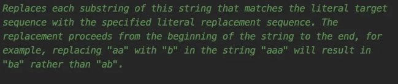

# replace方法的坑

<font style="color:rgb(51, 51, 51);background-color:rgb(248, 246, 244);">很多时候我们在使用字符串时，想把字符串比如：ATYSDFA*Y中的字符A替换成字符B，第一个想到的可能是使用replace方法。</font>

<font style="color:rgb(51, 51, 51);background-color:rgb(248, 246, 244);">如果想把所有的A都替换成B，很显然可以用replaceAll方法，因为非常直观，光从方法名就能猜出它的用途。</font>

<font style="color:rgb(51, 51, 51);background-color:rgb(248, 246, 244);">那么问题来了：replace方法会替换所有匹配字符吗？</font>

<font style="color:rgb(51, 51, 51);background-color:rgb(248, 246, 244);">jdk的官方给出了答案。</font>



<font style="color:rgb(51, 51, 51);background-color:rgb(248, 246, 244);">该方法会替换每一个匹配的字符串。</font>

<font style="color:rgb(51, 51, 51);background-color:rgb(248, 246, 244);">意不意外？惊不惊喜？</font>

<font style="color:rgb(51, 51, 51);background-color:rgb(248, 246, 244);">既然replace和replaceAll都能替换所有匹配字符，那么他们有啥区别呢？</font>

<font style="color:rgb(51, 51, 51);background-color:rgb(248, 246, 244);">replace有两个重载的方法。</font>

+ **<font style="color:rgb(34, 34, 34);background-color:rgb(248, 246, 244);">其中一个方法的参数：char oldChar 和 char newChar，支持字符的替换。</font>**

```plain
source.replace('A',&nbsp;'B')
```

+ **<font style="color:rgb(34, 34, 34);background-color:rgb(248, 246, 244);">另一个方法的参数是：CharSequence target 和 CharSequence replacement，支持字符串的替换。</font>**

```plain
source.replace("A",&nbsp;"B")
```

<font style="color:rgb(51, 51, 51);background-color:rgb(248, 246, 244);">而replaceAll方法的参数是：String regex 和 String replacement，即基于正则表达式的替换。</font>

<font style="color:rgb(51, 51, 51);background-color:rgb(248, 246, 244);">例如对普通字符串进行替换：</font>

```css
source.replaceAll("A",&nbsp;"B")
```

<font style="color:rgb(51, 51, 51);background-color:rgb(248, 246, 244);">使用正则表达替换（将*替换成C）：</font>

```plain
source.replaceAll("\\*",&nbsp;"C")
```

<font style="color:rgb(51, 51, 51);background-color:rgb(248, 246, 244);">顺便说一下，将*替换成C使用replace方法也可以实现：</font>

```plain
source.replace("*",&nbsp;"C")
```

<font style="color:rgb(51, 51, 51);background-color:rgb(248, 246, 244);">小伙们看到看到二者的区别了没？使用replace方法无需对特殊字符进行转义。</font>

<font style="color:rgb(51, 51, 51);background-color:rgb(248, 246, 244);">不过，千万注意，切勿使用如下写法：</font>

```plain
source.replace("\\*",&nbsp;"C")
```

<font style="color:rgb(51, 51, 51);background-color:rgb(248, 246, 244);">这种写法会导致字符串无法替换。</font>

<font style="color:rgb(51, 51, 51);background-color:rgb(248, 246, 244);">还有个小问题，如果我只想替换第一个匹配的字符串该怎么办?</font>

<font style="color:rgb(51, 51, 51);background-color:rgb(248, 246, 244);">这时可以使用replaceFirst方法：</font>

```css
source.replaceFirst("A",&nbsp;"B")
```

<font style="color:rgb(51, 51, 51);background-color:rgb(248, 246, 244);">说实话，这里内容都很基础，但越基础的东西，越容易大意失荆州，更容易踩坑。</font>

<font style="color:rgb(51, 51, 51);background-color:rgb(248, 246, 244);">最后，统计一下，这些坑一个都没踩过的同学，麻烦举个手。</font>


> 更新: 2024-09-05 11:04:04  
> 原文: <https://www.yuque.com/yuqueyonghue6cvnv/cxhfwd/iw76tfh61ege9u4l>