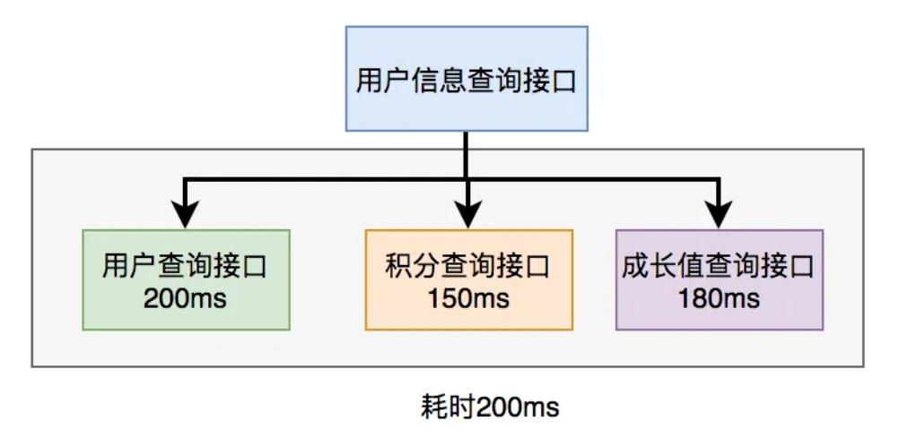
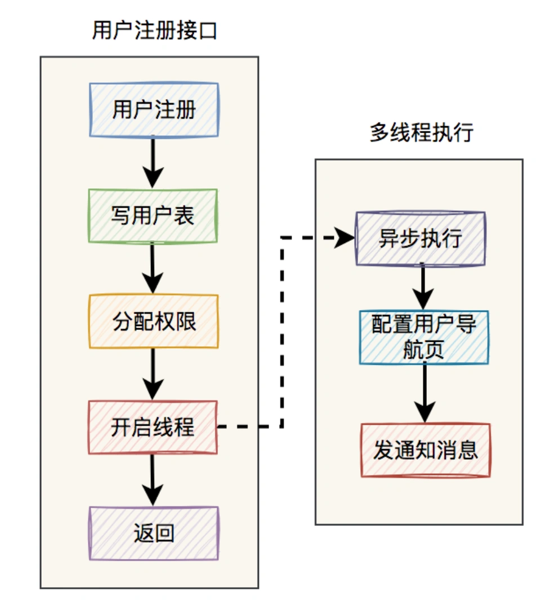
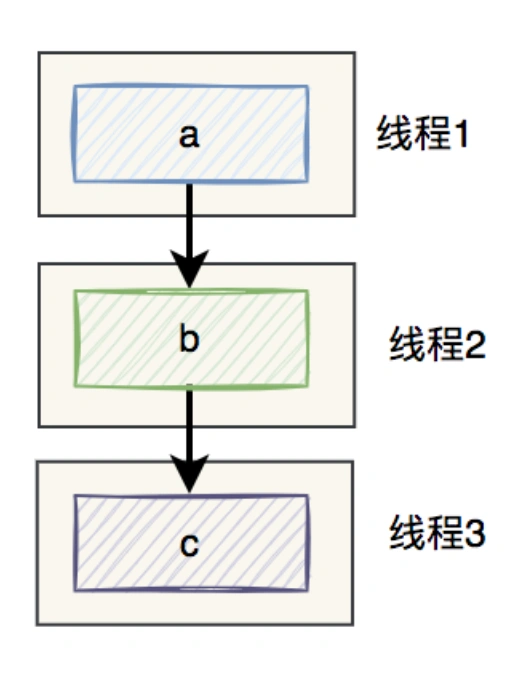
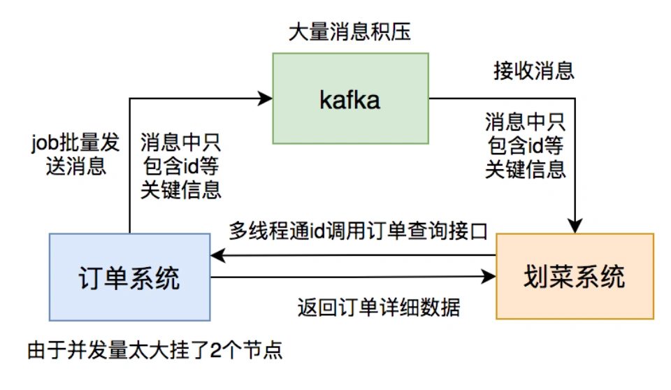

# 代码改成多线程容易出现的问题

## **<font style="color:rgb(34, 34, 34);background-color:rgb(248, 246, 244);">前言</font>**
<font style="color:rgb(51, 51, 51);background-color:rgb(248, 246, 244);">很多时候，我们为了提升接口的性能，会把之前单线程同步执行的代码，改成多线程异步执行。</font>

<font style="color:rgb(51, 51, 51);background-color:rgb(248, 246, 244);">比如：查询用户信息接口，需要返回用户基本信息、积分信息、成长值信息，而用户、积分和成长值，需要调用不同的接口获取数据。</font>

<font style="color:rgb(51, 51, 51);background-color:rgb(248, 246, 244);">如果查询用户信息接口，同步调用三个接口获取数据，会非常耗时。</font>

<font style="color:rgb(51, 51, 51);background-color:rgb(248, 246, 244);">这就非常有必要把三个接口调用，改成异步调用，最后汇总结果。</font>

<font style="color:rgb(51, 51, 51);background-color:rgb(248, 246, 244);">再比如：注册用户接口，该接口主要包含：写用户表，分配权限，配置用户导航页，发通知消息等功能。</font>

<font style="color:rgb(51, 51, 51);background-color:rgb(248, 246, 244);">该用户注册接口包含的业务逻辑比较多，如果在接口中同步执行这些代码，该接口响应时间会非常慢。</font>

<font style="color:rgb(51, 51, 51);background-color:rgb(248, 246, 244);">这时就需要把业务逻辑梳理一下，划分：核心逻辑和非核心逻辑。这个例子中的核心逻辑是：写用户表和分配权限，非核心逻辑是：配置用户导航页和发通知消息。</font>

<font style="color:rgb(51, 51, 51);background-color:rgb(248, 246, 244);">显然核心逻辑必须在接口中同步执行，而非核心逻辑可以多线程异步执行。</font>

<font style="color:rgb(51, 51, 51);background-color:rgb(248, 246, 244);">等等。</font>

<font style="color:rgb(51, 51, 51);background-color:rgb(248, 246, 244);">需要使用多线程的业务场景太多了，使用多线程异步执行的好处不言而喻。</font>

<font style="color:rgb(51, 51, 51);background-color:rgb(248, 246, 244);">但我要说的是，如果多线程没有使用好，它也会给我们带来很多意想不到的问题，不信往后继续看。</font>

<font style="color:rgb(51, 51, 51);background-color:rgb(248, 246, 244);">今天跟大家一起聊聊，代码改成多线程调用之后，带来的9大问题。</font>

## **<font style="color:rgb(34, 34, 34);background-color:rgb(248, 246, 244);">1.获取不到返回值</font>**
<font style="color:rgb(51, 51, 51);background-color:rgb(248, 246, 244);">如果你通过直接继承Thread类，或者实现Runnable接口的方式去创建线程。</font>

<font style="color:rgb(51, 51, 51);background-color:rgb(248, 246, 244);">那么，恭喜你，你将没法获取该线程方法的返回值。</font>

<font style="color:rgb(51, 51, 51);background-color:rgb(248, 246, 244);">使用线程的场景有两种：</font>

1. **<font style="color:rgb(34, 34, 34);background-color:rgb(248, 246, 244);">不需要关注线程方法的返回值。</font>**
2. **<font style="color:rgb(34, 34, 34);background-color:rgb(248, 246, 244);">需要关注线程方法的返回值。</font>**

<font style="color:rgb(51, 51, 51);background-color:rgb(248, 246, 244);">大部分业务场景是不需要关注线程方法返回值的，但如果我们有些业务需要关注线程方法的返回值该怎么处理呢？</font>

<font style="color:rgb(51, 51, 51);background-color:rgb(248, 246, 244);">查询用户信息接口，需要返回用户基本信息、积分信息、成长值信息，而用户、积分和成长值，需要调用不同的接口获取数据。</font>

<font style="color:rgb(51, 51, 51);background-color:rgb(248, 246, 244);">如下图所示：</font>



<font style="color:rgb(51, 51, 51);background-color:rgb(248, 246, 244);">在Java8之前可以通过实现Callable接口，获取线程返回结果。</font>

<font style="color:rgb(51, 51, 51);background-color:rgb(248, 246, 244);">Java8以后通过CompleteFuture类实现该功能。我们这里以CompleteFuture为例：</font>

```plain
public UserInfo getUserInfo(Long id) throws InterruptedException, ExecutionException {
    final UserInfo userInfo = new UserInfo();
    CompletableFuture userFuture = CompletableFuture.supplyAsync(() -> {
        getRemoteUserAndFill(id, userInfo);
        return Boolean.TRUE;
    }, executor);

    CompletableFuture bonusFuture = CompletableFuture.supplyAsync(() -> {
        getRemoteBonusAndFill(id, userInfo);
        return Boolean.TRUE;
    }, executor);

    CompletableFuture growthFuture = CompletableFuture.supplyAsync(() -> {
        getRemoteGrowthAndFill(id, userInfo);
        return Boolean.TRUE;
    }, executor);
    CompletableFuture.allOf(userFuture, bonusFuture, growthFuture).join();

    userFuture.get();
    bonusFuture.get();
    growthFuture.get();

    return userInfo;
}
```

<font style="color:rgb(100, 100, 100);background-color:rgb(248, 246, 244);">温馨提醒一下，这两种方式别忘了使用线程池。示例中我用到了executor，表示自定义的线程池，为了防止高并发场景下，出现线程过多的问题。</font>

<font style="color:rgb(51, 51, 51);background-color:rgb(248, 246, 244);">此外，Fork/join框架也提供了执行任务并返回结果的能力。</font>

## **<font style="color:rgb(34, 34, 34);background-color:rgb(248, 246, 244);">2.数据丢失</font>**
<font style="color:rgb(51, 51, 51);background-color:rgb(248, 246, 244);">我们还是以注册用户接口为例，该接口主要包含：写用户表，分配权限，配置用户导航页，发通知消息等功能。</font>

<font style="color:rgb(51, 51, 51);background-color:rgb(248, 246, 244);">其中：写用户表和分配权限功能，需要在一个事务中同步执行。而剩余的配置用户导航页和发通知消息功能，使用多线程异步执行。</font>

<font style="color:rgb(51, 51, 51);background-color:rgb(248, 246, 244);">表面上看起来没问题。</font>

<font style="color:rgb(51, 51, 51);background-color:rgb(248, 246, 244);">但如果前面的写用户表和分配权限功能成功了，用户注册接口就直接返回成功了。</font>

<font style="color:rgb(51, 51, 51);background-color:rgb(248, 246, 244);">但如果后面异步执行的配置用户导航页，或发通知消息功能失败了，怎么办？</font>

<font style="color:rgb(51, 51, 51);background-color:rgb(248, 246, 244);">如下图所示：</font>



<font style="color:rgb(51, 51, 51);background-color:rgb(248, 246, 244);">该接口前面明明已经提示用户成功了，但结果后面又有一部分功能在多线程异步执行中失败了。</font>

<font style="color:rgb(51, 51, 51);background-color:rgb(248, 246, 244);">这时该如何处理呢？</font>

<font style="color:rgb(51, 51, 51);background-color:rgb(248, 246, 244);">没错，你可以做失败重试。</font>

<font style="color:rgb(51, 51, 51);background-color:rgb(248, 246, 244);">但如果重试了一定的次数，还是没有成功，这条请求数据该如何处理呢？如果不做任何处理，该数据是不是就丢掉了？</font>

<font style="color:rgb(51, 51, 51);background-color:rgb(248, 246, 244);">为了防止数据丢失，可以用如下方案：</font>

1. **<font style="color:rgb(34, 34, 34);background-color:rgb(248, 246, 244);">使用mq异步处理。在分配权限之后，发送一条mq消息，到mq服务器，然后在mq的消费者中使用多线程，去配置用户导航页和发通知消息。如果mq消费者中处理失败了，可以自己重试。</font>**
2. **<font style="color:rgb(34, 34, 34);background-color:rgb(248, 246, 244);">使用job异步处理。在分配权限之后，往任务表中写一条数据。然后有个job定时扫描该表，然后配置用户导航页和发通知消息。如果job处理某条数据失败了，可以在表中记录一个重试次数，然后不断重试。但该方案有个缺点，就是实时性可能不太高。</font>**

## **<font style="color:rgb(34, 34, 34);background-color:rgb(248, 246, 244);">3.顺序问题</font>**
<font style="color:rgb(51, 51, 51);background-color:rgb(248, 246, 244);">如果你使用了多线程，就必须接受一个非常现实的问题，即顺序问题。</font>

<font style="color:rgb(51, 51, 51);background-color:rgb(248, 246, 244);">假如之前代码的执行顺序是：a,b,c，改成多线程执行之后，代码的执行顺序可能变成了：a,c,b。（这个跟cpu调度算法有关）</font>

<font style="color:rgb(51, 51, 51);background-color:rgb(248, 246, 244);">例如：</font>

```plain
public static void main(String[] args) {
    Thread thread1 = new Thread(() -> System.out.println("a"));
    Thread thread2 = new Thread(() -> System.out.println("b"));
    Thread thread3 = new Thread(() -> System.out.println("c"));

    thread1.start();
    thread2.start();
    thread3.start();
}
```

<font style="color:rgb(51, 51, 51);background-color:rgb(248, 246, 244);">执行结果：</font>

```css
a
c
b
```

<font style="color:rgb(51, 51, 51);background-color:rgb(248, 246, 244);">那么，来自灵魂的一问：如何保证线程的顺序呢？</font>

<font style="color:rgb(51, 51, 51);background-color:rgb(248, 246, 244);">即线程启动的顺序是：a,b,c，执行的顺序也是：a,b,c。</font>

<font style="color:rgb(51, 51, 51);background-color:rgb(248, 246, 244);">如下图所示：</font>



### **<font style="color:rgb(34, 34, 34);background-color:rgb(248, 246, 244);">3.1 join</font>**
<font style="color:rgb(51, 51, 51);background-color:rgb(248, 246, 244);">Thread类的join方法它会让主线程等待子线程运行结束后，才能继续运行。</font>

<font style="color:rgb(51, 51, 51);background-color:rgb(248, 246, 244);">列如：</font>

```plain
public static void main(String[] args) throws InterruptedException {
    Thread thread1 = new Thread(() -> System.out.println("a"));
    Thread thread2 = new Thread(() -> System.out.println("b"));
    Thread thread3 = new Thread(() -> System.out.println("c"));

    thread1.start();
    thread1.join();
    thread2.start();
    thread2.join();
    thread3.start();
}
```

<font style="color:rgb(51, 51, 51);background-color:rgb(248, 246, 244);">执行结果永远都是：</font>

```css
a
b
c
```

### **<font style="color:rgb(34, 34, 34);background-color:rgb(248, 246, 244);">3.2 newSingleThreadExecutor</font>**
<font style="color:rgb(51, 51, 51);background-color:rgb(248, 246, 244);">我们可以使用JDK自带的Excutors类的newSingleThreadExecutor方法，创建一个单线程的线程池。</font>

<font style="color:rgb(51, 51, 51);background-color:rgb(248, 246, 244);">例如：</font>

```plain
public static void main(String[] args)  {
    ExecutorService executorService = Executors.newSingleThreadExecutor();

    Thread thread1 = new Thread(() -> System.out.println("a"));
    Thread thread2 = new Thread(() -> System.out.println("b"));
    Thread thread3 = new Thread(() -> System.out.println("c"));

    executorService.submit(thread1);
    executorService.submit(thread2);
    executorService.submit(thread3);

    executorService.shutdown();
}
```

<font style="color:rgb(51, 51, 51);background-color:rgb(248, 246, 244);">执行结果永远都是：</font>

```css
a
b
c
```

<font style="color:rgb(51, 51, 51);background-color:rgb(248, 246, 244);">使用Excutors类的newSingleThreadExecutor方法创建的单线程的线程池，使用了LinkedBlockingQueue作为队列，而此队列按 FIFO（先进先出）排序元素。</font>

<font style="color:rgb(51, 51, 51);background-color:rgb(248, 246, 244);">添加到队列的顺序是a,b,c，则执行的顺序也是a,b,c。</font>

### **<font style="color:rgb(34, 34, 34);background-color:rgb(248, 246, 244);">3.3 CountDownLatch</font>**
<font style="color:rgb(51, 51, 51);background-color:rgb(248, 246, 244);">CountDownLatch是一个同步工具类，它允许一个或多个线程一直等待，直到其他线程执行完后再执行。</font>

<font style="color:rgb(51, 51, 51);background-color:rgb(248, 246, 244);">例如：</font>

```java
public class ThreadTest {

    public static void main(String[] args) throws InterruptedException {
        CountDownLatch latch1 = new CountDownLatch(0);
        CountDownLatch latch2 = new CountDownLatch(1);
        CountDownLatch latch3 = new CountDownLatch(1);

        Thread thread1 = new Thread(new TestRunnable(latch1, latch2, "a"));
        Thread thread2 = new Thread(new TestRunnable(latch2, latch3, "b"));
        Thread thread3 = new Thread(new TestRunnable(latch3, latch3, "c"));

        thread1.start();
        thread2.start();
        thread3.start();
    }
}

class TestRunnable implements Runnable {

    private CountDownLatch latch1;
    private CountDownLatch latch2;
    private String message;

    TestRunnable(CountDownLatch latch1, CountDownLatch latch2, String message) {
        this.latch1 = latch1;
        this.latch2 = latch2;
        this.message = message;
    }

    @Override
    public void run() {
        try {
            latch1.await();
            System.out.println(message);
        } catch (InterruptedException e) {
            e.printStackTrace();
        }
        latch2.countDown();
    }
}
```

<font style="color:rgb(51, 51, 51);background-color:rgb(248, 246, 244);">执行结果永远都是：</font>

```css
a
b
c
```

<font style="color:rgb(51, 51, 51);background-color:rgb(248, 246, 244);">此外，使用CompletableFuture的thenRun方法，也能多线程的执行顺序，在这里就不一一介绍了。</font>

## **<font style="color:rgb(34, 34, 34);background-color:rgb(248, 246, 244);">4.线程安全问题</font>**
<font style="color:rgb(51, 51, 51);background-color:rgb(248, 246, 244);">既然使用了线程，伴随而来的还会有线程安全问题。</font>

<font style="color:rgb(51, 51, 51);background-color:rgb(248, 246, 244);">假如现在有这样一个需求：用多线程执行查询方法，然后把执行结果添加到一个list集合中。</font>

<font style="color:rgb(51, 51, 51);background-color:rgb(248, 246, 244);">代码如下：</font>

```plain
List<User> list = Lists.newArrayList();
 dataList.stream()
     .map(data -> CompletableFuture
          .supplyAsync(() -> query(list, data), asyncExecutor)
         ));
CompletableFuture.allOf(futureArray).join();
```

<font style="color:rgb(51, 51, 51);background-color:rgb(248, 246, 244);">使用CompletableFuture异步多线程执行query方法：</font>

```plain
public void query(List<User> list, UserEntity condition) {
   User user = queryByCondition(condition);
   if(Objects.isNull(user)) {
      return;
   }
   list.add(user);
   UserExtend userExtend = queryByOther(condition);
   if(Objects.nonNull(userExtend)) {
      user.setExtend(userExtend.getInfo());
   }
}
```

<font style="color:rgb(51, 51, 51);background-color:rgb(248, 246, 244);">在query方法中，将获取的查询结果添加到list集合中。</font>

<font style="color:rgb(51, 51, 51);background-color:rgb(248, 246, 244);">结果list会出现线程安全问题，有时候会少数据，当然也不一定是必现的。</font>

<font style="color:rgb(51, 51, 51);background-color:rgb(248, 246, 244);">这是因为ArrayList是非线程安全的，没有使用synchronized等关键字修饰。</font>

<font style="color:rgb(51, 51, 51);background-color:rgb(248, 246, 244);">如何解决这个问题呢？</font>

<font style="color:rgb(51, 51, 51);background-color:rgb(248, 246, 244);">答：使用CopyOnWriteArrayList集合，代替普通的ArrayList集合，CopyOnWriteArrayList是一个线程安全的机会。</font>

<font style="color:rgb(51, 51, 51);background-color:rgb(248, 246, 244);">只需一行小小的改动即可：</font>

```plain
List<User> list Lists.newCopyOnWriteArrayList();
```

<font style="color:rgb(100, 100, 100);background-color:rgb(248, 246, 244);">温馨的提醒一下，这里创建集合的方式，用了google的collect包。</font>

## **<font style="color:rgb(34, 34, 34);background-color:rgb(248, 246, 244);">5.ThreadLocal获取数据异常</font>**
<font style="color:rgb(51, 51, 51);background-color:rgb(248, 246, 244);">我们都知道JDK为了解决线程安全问题，提供了一种用空间换时间的新思路：ThreadLocal。</font>

<font style="color:rgb(51, 51, 51);background-color:rgb(248, 246, 244);">它的核心思想是：共享变量在每个线程都有一个副本，每个线程操作的都是自己的副本，对另外的线程没有影响。</font>

<font style="color:rgb(51, 51, 51);background-color:rgb(248, 246, 244);">例如：</font>

```csharp
@Service
public class ThreadLocalService {
    private static final ThreadLocal<Integer> threadLocal = new ThreadLocal<>();

    public void add() {
        threadLocal.set(1);
        doSamething();
        Integer integer = threadLocal.get();
    }
}
```

<font style="color:rgb(51, 51, 51);background-color:rgb(248, 246, 244);">ThreadLocal在普通中线程中，的确能够获取正确的数据。</font>

<font style="color:rgb(51, 51, 51);background-color:rgb(248, 246, 244);">但在真实的业务场景中，一般很少用单独的线程，绝大多数，都是用的线程池。</font>

<font style="color:rgb(51, 51, 51);background-color:rgb(248, 246, 244);">那么，在线程池中如何获取ThreadLocal对象生成的数据呢？</font>

<font style="color:rgb(51, 51, 51);background-color:rgb(248, 246, 244);">如果直接使用普通ThreadLocal，显然是获取不到正确数据的。</font>

<font style="color:rgb(51, 51, 51);background-color:rgb(248, 246, 244);">我们先试试InheritableThreadLocal，具体代码如下：</font>

```csharp
private static void fun1() {
    InheritableThreadLocal<Integer> threadLocal = new InheritableThreadLocal<>();
    threadLocal.set(6);
    System.out.println("父线程获取数据：" + threadLocal.get());

    ExecutorService executorService = Executors.newSingleThreadExecutor();

    threadLocal.set(6);
    executorService.submit(() -> {
        System.out.println("第一次从线程池中获取数据：" + threadLocal.get());
    });

    threadLocal.set(7);
    executorService.submit(() -> {
        System.out.println("第二次从线程池中获取数据：" + threadLocal.get());
    });
}
```

<font style="color:rgb(51, 51, 51);background-color:rgb(248, 246, 244);">执行结果：</font>

```plain
父线程获取数据：6
第一次从线程池中获取数据：6
第二次从线程池中获取数据：6
```

<font style="color:rgb(51, 51, 51);background-color:rgb(248, 246, 244);">由于这个例子中使用了单例线程池，固定线程数是1。</font>

<font style="color:rgb(51, 51, 51);background-color:rgb(248, 246, 244);">第一次submit任务的时候，该线程池会自动创建一个线程。因为使用了InheritableThreadLocal，所以创建线程时，会调用它的init方法，将父线程中的inheritableThreadLocals数据复制到子线程中。所以我们看到，在主线程中将数据设置成6，第一次从线程池中获取了正确的数据6。</font>

<font style="color:rgb(51, 51, 51);background-color:rgb(248, 246, 244);">之后，在主线程中又将数据改成7，但在第二次从线程池中获取数据却依然是6。</font>

<font style="color:rgb(51, 51, 51);background-color:rgb(248, 246, 244);">因为第二次submit任务的时候，线程池中已经有一个线程了，就直接拿过来复用，不会再重新创建线程了。所以不会再调用线程的init方法，所以第二次其实没有获取到最新的数据7，还是获取的老数据6。</font>

<font style="color:rgb(51, 51, 51);background-color:rgb(248, 246, 244);">那么，这该怎么办呢？</font>

<font style="color:rgb(51, 51, 51);background-color:rgb(248, 246, 244);">答：使用TransmittableThreadLocal，它并非JDK自带的类，而是阿里巴巴开源jar包中的类。</font>

<font style="color:rgb(51, 51, 51);background-color:rgb(248, 246, 244);">可以通过如下pom文件引入该jar包：</font>

```xml
<dependency>
   <groupId>com.alibaba</groupId>
   <artifactId>transmittable-thread-local</artifactId>
   <version>2.11.0</version>
   <scope>compile</scope>
</dependency>
```

<font style="color:rgb(51, 51, 51);background-color:rgb(248, 246, 244);">代码调整如下：</font>

```plain
private static void fun2() throws Exception {
    TransmittableThreadLocal<Integer> threadLocal = new TransmittableThreadLocal<>();
    threadLocal.set(6);
    System.out.println("父线程获取数据：" + threadLocal.get());

    ExecutorService ttlExecutorService = TtlExecutors.getTtlExecutorService(Executors.newFixedThreadPool(1));

    threadLocal.set(6);
    ttlExecutorService.submit(() -> {
        System.out.println("第一次从线程池中获取数据：" + threadLocal.get());
    });

    threadLocal.set(7);
    ttlExecutorService.submit(() -> {
        System.out.println("第二次从线程池中获取数据：" + threadLocal.get());
    });

}
```

<font style="color:rgb(51, 51, 51);background-color:rgb(248, 246, 244);">执行结果：</font>

```plain
父线程获取数据：6
第一次从线程池中获取数据：6
第二次从线程池中获取数据：7
```

<font style="color:rgb(51, 51, 51);background-color:rgb(248, 246, 244);">我们看到，使用了TransmittableThreadLocal之后，第二次从线程中也能正确获取最新的数据7了。</font>

<font style="color:rgb(51, 51, 51);background-color:rgb(248, 246, 244);">nice。</font>

<font style="color:rgb(51, 51, 51);background-color:rgb(248, 246, 244);">如果你仔细观察这个例子，你可能会发现，代码中除了使用TransmittableThreadLocal类之外，还使用了TtlExecutors.getTtlExecutorService方法，去创建ExecutorService对象。</font>

<font style="color:rgb(51, 51, 51);background-color:rgb(248, 246, 244);">这是非常重要的地方，如果没有这一步，TransmittableThreadLocal在线程池中共享数据将不会起作用。</font>

<font style="color:rgb(51, 51, 51);background-color:rgb(248, 246, 244);">创建ExecutorService对象，底层的submit方法会TtlRunnable或TtlCallable对象。</font>

<font style="color:rgb(51, 51, 51);background-color:rgb(248, 246, 244);">以TtlRunnable类为例，它实现了Runnable接口，同时还实现了它的run方法：</font>

```typescript
public void run() {
    Map<TransmittableThreadLocal<?>, Object> copied = (Map)this.copiedRef.get();
    if (copied != null && (!this.releaseTtlValueReferenceAfterRun || this.copiedRef.compareAndSet(copied, (Object)null))) {
        Map backup = TransmittableThreadLocal.backupAndSetToCopied(copied);

        try {
            this.runnable.run();
        } finally {
            TransmittableThreadLocal.restoreBackup(backup);
        }
    } else {
        throw new IllegalStateException("TTL value reference is released after run!");
    }
}
```

<font style="color:rgb(51, 51, 51);background-color:rgb(248, 246, 244);">这段代码的主要逻辑如下：</font>

1. **<font style="color:rgb(34, 34, 34);background-color:rgb(248, 246, 244);">把当时的ThreadLocal做个备份，然后将父类的ThreadLocal拷贝过来。</font>**
2. **<font style="color:rgb(34, 34, 34);background-color:rgb(248, 246, 244);">执行真正的run方法，可以获取到父类最新的ThreadLocal数据。</font>**
3. **<font style="color:rgb(34, 34, 34);background-color:rgb(248, 246, 244);">从备份的数据中，恢复当时的ThreadLocal数据。</font>**

<font style="color:rgb(51, 51, 51);background-color:rgb(248, 246, 244);">如果你想进一步了解ThreadLocal的工作原理，可以看看我的另一篇文章《</font>[ThreadLocal夺命11连问](https://mp.weixin.qq.com/s?__biz=MzkwNjMwMTgzMQ==&mid=2247494889&idx=1&sn=db15e438326c8e297eef739ec190971b&chksm=c0e83401f79fbd17143734d5dbb509f020553772e162d5895de8c8039d79a3cff8633bcf4bb8&token=1106409335&lang=zh_CN&scene=21#wechat_redirect)<font style="color:rgb(51, 51, 51);background-color:rgb(248, 246, 244);">》</font>

## **<font style="color:rgb(34, 34, 34);background-color:rgb(248, 246, 244);">6.OOM问题</font>**
<font style="color:rgb(51, 51, 51);background-color:rgb(248, 246, 244);">众所周知，使用多线程可以提升代码执行效率，但也不是绝对的。</font>

<font style="color:rgb(51, 51, 51);background-color:rgb(248, 246, 244);">对于一些耗时的操作，使用多线程，确实可以提升代码执行效率。</font>

<font style="color:rgb(51, 51, 51);background-color:rgb(248, 246, 244);">但线程不是创建越多越好，如果线程创建多了，也可能会导致OOM异常。</font>

<font style="color:rgb(51, 51, 51);background-color:rgb(248, 246, 244);">例如：</font>

```plain
Caused by: 
java.lang.OutOfMemoryError: unable to create new native thread
```

<font style="color:rgb(51, 51, 51);background-color:rgb(248, 246, 244);">在JVM中创建一个线程，默认需要占用1M的内存空间。</font>

<font style="color:rgb(51, 51, 51);background-color:rgb(248, 246, 244);">如果创建了过多的线程，必然会导致内存空间不足，从而出现OOM异常。</font>

<font style="color:rgb(51, 51, 51);background-color:rgb(248, 246, 244);">除此之外，如果使用线程池的话，特别是使用固定大小线程池，即使用Executors.newFixedThreadPool方法创建的线程池。</font>

<font style="color:rgb(51, 51, 51);background-color:rgb(248, 246, 244);">该线程池的核心线程数和最大线程数是一样的，是一个固定值，而存放消息的队列是LinkedBlockingQueue。</font>

<font style="color:rgb(51, 51, 51);background-color:rgb(248, 246, 244);">该队列的最大容量是Integer.MAX_VALUE，也就是说如果使用固定大小线程池，存放了太多的任务，有可能也会导致OOM异常。</font>

```plain
java.lang.OutOfMemeryError:Java heap space
```

## **<font style="color:rgb(34, 34, 34);background-color:rgb(248, 246, 244);">7.CPU使用率飙高</font>**
<font style="color:rgb(51, 51, 51);background-color:rgb(248, 246, 244);">不知道你有没有做过excel数据导入功能，需要将一批excel的数据导入到系统中。</font>

<font style="color:rgb(51, 51, 51);background-color:rgb(248, 246, 244);">每条数据都有些业务逻辑，如果单线程导入所有的数据，导入效率会非常低。</font>

<font style="color:rgb(51, 51, 51);background-color:rgb(248, 246, 244);">于是改成了多线程导入。</font>

<font style="color:rgb(51, 51, 51);background-color:rgb(248, 246, 244);">如果excel中有大量的数据，很可能会出现CPU使用率飙高的问题。</font>

<font style="color:rgb(51, 51, 51);background-color:rgb(248, 246, 244);">我们都知道，如果代码出现死循环，cpu使用率会飚的很多高。因为代码一直在某个线程中循环，没法切换到其他线程，cpu一直被占用着，所以会导致cpu使用率一直高居不下。</font>

<font style="color:rgb(51, 51, 51);background-color:rgb(248, 246, 244);">而多线程导入大量的数据，虽说没有死循环代码，但由于多个线程一直在不停的处理数据，导致占用了cpu很长的时间。</font>

<font style="color:rgb(51, 51, 51);background-color:rgb(248, 246, 244);">也会出现cpu使用率很高的问题。</font>

<font style="color:rgb(51, 51, 51);background-color:rgb(248, 246, 244);">那么，如何解决这个问题呢？</font>

<font style="color:rgb(51, 51, 51);background-color:rgb(248, 246, 244);">答：使用Thread.sleep休眠一下。</font>

<font style="color:rgb(51, 51, 51);background-color:rgb(248, 246, 244);">在线程中处理完一条数据，休眠10毫秒。</font>

<font style="color:rgb(51, 51, 51);background-color:rgb(248, 246, 244);">当然CPU使用率飙高的原因很多，多线程处理数据和死循环只是其中两种，还有比如：频繁GC、正则匹配、频繁序列化和反序列化等。</font>

<font style="color:rgb(51, 51, 51);background-color:rgb(248, 246, 244);">后面我会写一篇介绍CPU使用率飙高的原因的专题文章，感兴趣的小伙伴，可以关注一下我后续的文章。</font>

## **<font style="color:rgb(34, 34, 34);background-color:rgb(248, 246, 244);">8.事务问题</font>**
<font style="color:rgb(51, 51, 51);background-color:rgb(248, 246, 244);">在实际项目开发中，多线程的使用场景还是挺多的。如果spring事务用在多线程场景中，会有问题吗？</font>

<font style="color:rgb(51, 51, 51);background-color:rgb(248, 246, 244);">例如：</font>

```java
@Slf4j
@Service
public class UserService {

    @Autowired
    private UserMapper userMapper;
    @Autowired
    private RoleService roleService;

    @Transactional
    public void add(UserModel userModel) throws Exception {
        userMapper.insertUser(userModel);
        new Thread(() -> {
            roleService.doOtherThing();
        }).start();
    }
}

@Service
public class RoleService {

    @Transactional
    public void doOtherThing() {
        System.out.println("保存role表数据");
    }
}
```

<font style="color:rgb(51, 51, 51);background-color:rgb(248, 246, 244);">从上面的例子中，我们可以看到事务方法add中，调用了事务方法doOtherThing，但是事务方法doOtherThing是在另外一个线程中调用的。</font>

<font style="color:rgb(51, 51, 51);background-color:rgb(248, 246, 244);">这样会导致两个方法不在同一个线程中，获取到的数据库连接不一样，从而是两个不同的事务。如果想doOtherThing方法中抛了异常，add方法也回滚是不可能的。</font>

<font style="color:rgb(51, 51, 51);background-color:rgb(248, 246, 244);">如果看过spring事务源码的朋友，可能会知道spring的事务是通过数据库连接来实现的。当前线程中保存了一个map，key是数据源，value是数据库连接。</font>

```dart
private static final ThreadLocal<Map<Object, Object>> resources =

  new NamedThreadLocal<>("Transactional resources");
```

<font style="color:rgb(51, 51, 51);background-color:rgb(248, 246, 244);">我们说的同一个事务，其实是指同一个数据库连接，只有拥有同一个数据库连接才能同时提交和回滚。如果在不同的线程，拿到的数据库连接肯定是不一样的，所以是不同的事务。</font>

<font style="color:rgb(100, 100, 100);background-color:rgb(248, 246, 244);">所以不要在事务中开启另外的线程，去处理业务逻辑，这样会导致事务失效。</font>

## **<font style="color:rgb(34, 34, 34);background-color:rgb(248, 246, 244);">9.导致服务挂掉</font>**
<font style="color:rgb(51, 51, 51);background-color:rgb(248, 246, 244);">使用多线程会导致服务挂掉，这不是危言耸听，而是确有其事。</font>

<font style="color:rgb(51, 51, 51);background-color:rgb(248, 246, 244);">假设现在有这样一种业务场景：在mq的消费者中需要调用订单查询接口，查到数据之后，写入业务表中。</font>

<font style="color:rgb(51, 51, 51);background-color:rgb(248, 246, 244);">本来是没啥问题的。</font>

<font style="color:rgb(51, 51, 51);background-color:rgb(248, 246, 244);">突然有一天，mq生产者跑了一个批量数据处理的job，导致mq服务器上堆积了大量的消息。</font>

<font style="color:rgb(51, 51, 51);background-color:rgb(248, 246, 244);">此时，mq消费者的处理速度，远远跟不上mq消息的生产速度，导致的结果是出现了大量的消息堆积，对用户有很大的影响。</font>

<font style="color:rgb(51, 51, 51);background-color:rgb(248, 246, 244);">为了解决这个问题，mq消费者改成多线程处理，直接使用了线程池，并且最大线程数配置成了20。</font>

<font style="color:rgb(51, 51, 51);background-color:rgb(248, 246, 244);">这样调整之后，消息堆积问题确实得到了解决。</font>

<font style="color:rgb(51, 51, 51);background-color:rgb(248, 246, 244);">但带来了另外一个更严重的问题：订单查询接口并发量太大了，有点扛不住压力，导致部分节点的服务直接挂掉。</font>



<font style="color:rgb(51, 51, 51);background-color:rgb(248, 246, 244);">为了解决问题，不得不临时加服务节点。</font>

<font style="color:rgb(100, 100, 100);background-color:rgb(248, 246, 244);">在mq的消费者中使用多线程，调用接口时，一定要评估好接口能够承受的最大访问量，防止因为压力过大，而导致服务挂掉的问题。</font>


> 更新: 2024-05-20 17:05:15  
> 原文: <https://www.yuque.com/yuqueyonghue6cvnv/cxhfwd/ddcxq18c0dz4wm1g>