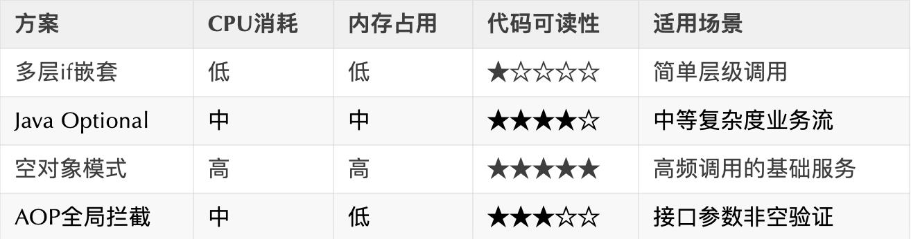

# 判空问题

## **<font style="color:rgb(34, 34, 34);background-color:rgb(248, 246, 244);">一、传统判空的血泪史</font>**
<font style="color:rgb(51, 51, 51);background-color:rgb(248, 246, 244);">某互联网金融平台因费用计算层级的空指针异常，导致凌晨产生9800笔错误交易。</font>

<font style="color:rgb(51, 51, 51);background-color:rgb(248, 246, 244);">DEBUG日志显示问题出现在如下代码段：</font>

```csharp
// 错误示例
BigDecimal amount = user.getWallet().getBalance().add(new BigDecimal("100"));
```

<font style="color:rgb(51, 51, 51);background-color:rgb(248, 246, 244);">此类链式调用若中间环节出现null值，必定导致NPE。</font>

<font style="color:rgb(51, 51, 51);background-color:rgb(248, 246, 244);">初级阶段开发者通常写出多层嵌套式判断：</font>

```plain
if(user != null){
    Wallet wallet = user.getWallet();
    if(wallet != null){
        BigDecimal balance = wallet.getBalance();
        if(balance != null){
            // 实际业务逻辑
        }
    }
}
```

<font style="color:rgb(51, 51, 51);background-color:rgb(248, 246, 244);">这种写法既不优雅又影响代码可读性。</font>

<font style="color:rgb(51, 51, 51);background-color:rgb(248, 246, 244);">那么，我们该如何优化呢？</font>

## **<font style="color:rgb(34, 34, 34);background-color:rgb(248, 246, 244);">二、Java 8+时代的判空革命</font>**
<font style="color:rgb(51, 51, 51);background-color:rgb(248, 246, 244);">Java8之后，新增了Optional类，它是用来专门判空的。</font>

<font style="color:rgb(51, 51, 51);background-color:rgb(248, 246, 244);">能够帮你写出更加优雅的代码。</font>

### **<font style="color:rgb(34, 34, 34);background-color:rgb(248, 246, 244);">1. Optional黄金三板斧</font>**
```plain
// 重构后的链式调用
BigDecimal result = Optional.ofNullable(user)
    .map(User::getWallet)
    .map(Wallet::getBalance)
    .map(balance -> balance.add(new BigDecimal("100")))
    .orElse(BigDecimal.ZERO);
```

**<font style="color:rgb(34, 34, 34);background-color:rgb(248, 246, 244);">高级用法：条件过滤</font>**

```plain
Optional.ofNullable(user)
    .filter(u -> u.getVipLevel() > 3)
    .ifPresent(u -> sendCoupon(u)); // VIP用户发券
```

### **<font style="color:rgb(34, 34, 34);background-color:rgb(248, 246, 244);">2. Optional抛出业务异常</font>**
```plain
BigDecimal balance = Optional.ofNullable(user)
    .map(User::getWallet)
    .map(Wallet::getBalance)
    .orElseThrow(() -> new BusinessException("用户钱包数据异常"));
```

### **<font style="color:rgb(34, 34, 34);background-color:rgb(248, 246, 244);">3. 封装通用工具类</font>**
```typescript
public class NullSafe {
    
    // 安全获取对象属性
    public static <T, R> R get(T target, Function<T, R> mapper, R defaultValue) {
        return target != null ? mapper.apply(target) : defaultValue;
    }
    
    // 链式安全操作
    public static <T> T execute(T root, Consumer<T> consumer) {
        if (root != null) {
            consumer.accept(root);
        }
        return root;
    }
}
// 使用示例
NullSafe.execute(user, u -> {
    u.getWallet().charge(new BigDecimal("50"));
    logger.info("用户{}已充值", u.getId());
});
```

## **<font style="color:rgb(34, 34, 34);background-color:rgb(248, 246, 244);">三、现代化框架的判空银弹</font>**
### **<font style="color:rgb(34, 34, 34);background-color:rgb(248, 246, 244);">4. Spring实战技巧</font>**
<font style="color:rgb(51, 51, 51);background-color:rgb(248, 246, 244);">Spring中自带了一些好用的工具类，比如：CollectionUtils、StringUtils等，可以非常有效的进行判空。</font>

<font style="color:rgb(51, 51, 51);background-color:rgb(248, 246, 244);">具体代码如下：</font>

```plain
// 集合判空工具
List<Order> orders = getPendingOrders();
if (CollectionUtils.isEmpty(orders)) {
    return Result.error("无待处理订单");
}
// 字符串检查
String input = request.getParam("token");
if (StringUtils.hasText(input)) {
    validateToken(input); 
}
```

### **<font style="color:rgb(34, 34, 34);background-color:rgb(248, 246, 244);">5. Lombok保驾护航</font>**
<font style="color:rgb(51, 51, 51);background-color:rgb(248, 246, 244);">我们在日常开发中的entity对象，一般会使用Lombok框架中的注解，来实现getter/setter方法。</font>

<font style="color:rgb(51, 51, 51);background-color:rgb(248, 246, 244);">其实，这个框架中也提供了@NonNull等判空的注解。</font>

<font style="color:rgb(51, 51, 51);background-color:rgb(248, 246, 244);">比如：</font>

```java
@Getter
@Setter
public class User {
    @NonNull // 编译时生成null检查代码
    private String name;
    
    private Wallet wallet;
}
// 使用构造时自动判空
User user = new User(@NonNull "张三", wallet);
```

## **<font style="color:rgb(34, 34, 34);background-color:rgb(248, 246, 244);">四、工程级解决方案</font>**
### **<font style="color:rgb(34, 34, 34);background-color:rgb(248, 246, 244);">6. 空对象模式</font>**
```typescript
public interface Notification {
    void send(String message);
}
// 真实实现
public class EmailNotification implements Notification {
    @Override
    public void send(String message) {
        // 发送邮件逻辑
    }
}
// 空对象实现
public class NullNotification implements Notification {
    @Override
    public void send(String message) {
        // 默认处理
    }
}
// 使用示例
Notification notifier = getNotifier();
notifier.send("系统提醒"); // 无需判空
```

### **<font style="color:rgb(34, 34, 34);background-color:rgb(248, 246, 244);">7. Guava的Optional增强</font>**
<font style="color:rgb(51, 51, 51);background-color:rgb(248, 246, 244);">其实Guava工具包中，给我们提供了Optional增强的功能。</font>

<font style="color:rgb(51, 51, 51);background-color:rgb(248, 246, 244);">比如：</font>

```fortran
import com.google.common.base.Optional;
// 创建携带缺省值的Optional
Optional<User> userOpt = Optional.fromNullable(user).or(defaultUser);
// 链式操作配合Function
Optional<BigDecimal> amount = userOpt.transform(u -> u.getWallet())
                                    .transform(w -> w.getBalance());
```

<font style="color:rgb(51, 51, 51);background-color:rgb(248, 246, 244);">Guava工具包中的Optional类已经封装好了，我们可以直接使用。</font>

## **<font style="color:rgb(34, 34, 34);background-color:rgb(248, 246, 244);">五、防御式编程进阶</font>**
### **<font style="color:rgb(34, 34, 34);background-color:rgb(248, 246, 244);">8. Assert断言式拦截</font>**
<font style="color:rgb(51, 51, 51);background-color:rgb(248, 246, 244);">其实有些Assert断言类中，已经做好了判空的工作，参数为空则会抛出异常。</font>

<font style="color:rgb(51, 51, 51);background-color:rgb(248, 246, 244);">这样我们就可以直接调用这个断言类。</font>

<font style="color:rgb(51, 51, 51);background-color:rgb(248, 246, 244);">例如下面的ValidateUtils类中的requireNonNull方法，由于它内容已经判空了，因此，在其他地方调用requireNonNull方法时，如果为空，则会直接抛异常。</font>

<font style="color:rgb(51, 51, 51);background-color:rgb(248, 246, 244);">我们在业务代码中，直接调用requireNonNull即可，不用写额外的判空逻辑。</font>

<font style="color:rgb(51, 51, 51);background-color:rgb(248, 246, 244);">例如：</font>

```typescript
public class ValidateUtils {
    public static <T> T requireNonNull(T obj, String message) {
        if (obj == null) {
            throw new ServiceException(message);
        }
        return obj;
    }
}
// 使用姿势
User currentUser = ValidateUtils.requireNonNull(
    userDao.findById(userId), 
    "用户不存在-ID:" + userId
);
```

### **<font style="color:rgb(34, 34, 34);background-color:rgb(248, 246, 244);">9. 全局AOP拦截</font>**
<font style="color:rgb(51, 51, 51);background-color:rgb(248, 246, 244);">我们在一些特殊的业务场景种，可以通过自定义注解 + 全局AOP拦截器的方式，来实现实体或者字段的判空。</font>

<font style="color:rgb(51, 51, 51);background-color:rgb(248, 246, 244);">例如：</font>

```typescript
@Aspect
@Component
public class NullCheckAspect {
    
    @Around("@annotation(com.xxx.NullCheck)")
    public Object checkNull(ProceedingJoinPoint joinPoint) throws Throwable {
        Object[] args = joinPoint.getArgs();
        for (Object arg : args) {
            if (arg == null) {
                throw new IllegalArgumentException("参数不可为空");
            }
        }
        return joinPoint.proceed();
    }
}
// 注解使用
public void updateUser(@NullCheck User user) {
    // 方法实现
}
```

## **<font style="color:rgb(34, 34, 34);background-color:rgb(248, 246, 244);">六、实战场景对比分析</font>**
### **<font style="color:rgb(34, 34, 34);background-color:rgb(248, 246, 244);">场景1：深层次对象取值</font>**
```plain
// 旧代码（4层嵌套判断）
if (order != null) {
    User user = order.getUser();
    if (user != null) {
        Address address = user.getAddress();
        if (address != null) {
            String city = address.getCity();
            // 使用city
        }
    }
}
// 重构后（流畅链式）
String city = Optional.ofNullable(order)
    .map(Order::getUser)
    .map(User::getAddress)
    .map(Address::getCity)
    .orElse("未知城市");
```

### **<font style="color:rgb(34, 34, 34);background-color:rgb(248, 246, 244);">场景2：批量数据处理</font>**
```plain
List<User> users = userService.listUsers();
// 传统写法（显式迭代判断）
List<String> names = new ArrayList<>();
for (User user : users) {
    if (user != null && user.getName() != null) {
        names.add(user.getName());
    }
}
// Stream优化版
List<String> nameList = users.stream()
    .filter(Objects::nonNull)
    .map(User::getName)
    .filter(Objects::nonNull)
    .collect(Collectors.toList());
```

## **<font style="color:rgb(34, 34, 34);background-color:rgb(248, 246, 244);">七、性能与安全的平衡艺术</font>**
<font style="color:rgb(51, 51, 51);background-color:rgb(248, 246, 244);">上面介绍的这些方案都可以使用，但除了代码的可读性之外，我们还需要考虑一下性能因素。</font>

<font style="color:rgb(51, 51, 51);background-color:rgb(248, 246, 244);">下面列出了上面的几种在CPU消耗、内存只用和代码可读性的对比：</font>



**<font style="color:rgb(34, 34, 34);background-color:rgb(248, 246, 244);">黄金法则</font>**

+ <font style="color:rgb(51, 51, 51);background-color:rgb(248, 246, 244);">Web层入口强制参数校验</font>
+ <font style="color:rgb(51, 51, 51);background-color:rgb(248, 246, 244);">Service层使用Optional链式处理</font>
+ <font style="color:rgb(51, 51, 51);background-color:rgb(248, 246, 244);">核心领域模型采用空对象模式</font>

## **<font style="color:rgb(34, 34, 34);background-color:rgb(248, 246, 244);">八、扩展技术</font>**
<font style="color:rgb(51, 51, 51);background-color:rgb(248, 246, 244);">除了，上面介绍的常规判空之外，下面再给大家介绍两种扩展的技术。</font>

### **<font style="color:rgb(34, 34, 34);background-color:rgb(248, 246, 244);">Kotlin的空安全设计</font>**
<font style="color:rgb(51, 51, 51);background-color:rgb(248, 246, 244);">虽然Java开发者无法直接使用，但可借鉴其设计哲学：</font>

```plain
val city = order?.user?.address?.city ?: "default"
```

### **<font style="color:rgb(34, 34, 34);background-color:rgb(248, 246, 244);">JDK 14新特性预览</font>**
```plain
// 模式匹配语法尝鲜
if (user instanceof User u && u.getName() != null) {
    System.out.println(u.getName().toUpperCase());
}
```

<font style="color:rgb(51, 51, 51);background-color:rgb(248, 246, 244);">总之，优雅判空不仅是代码之美，更是生产安全底线。</font>


> 更新: 2025-05-15 19:54:40  
> 原文: <https://www.yuque.com/yuqueyonghue6cvnv/cxhfwd/iyciu9fpbb1zhcdc>