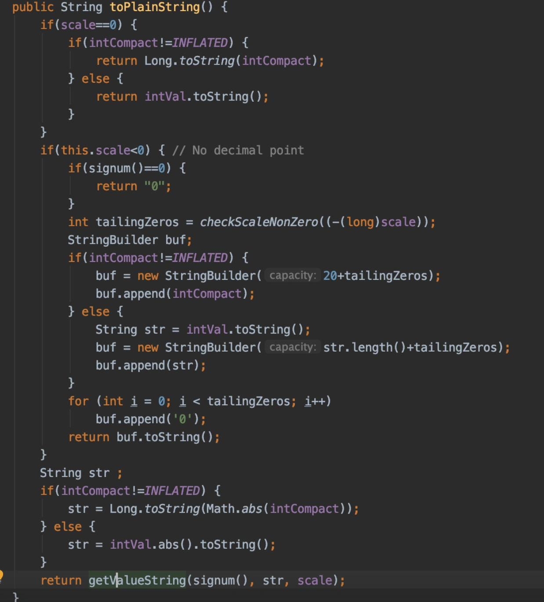
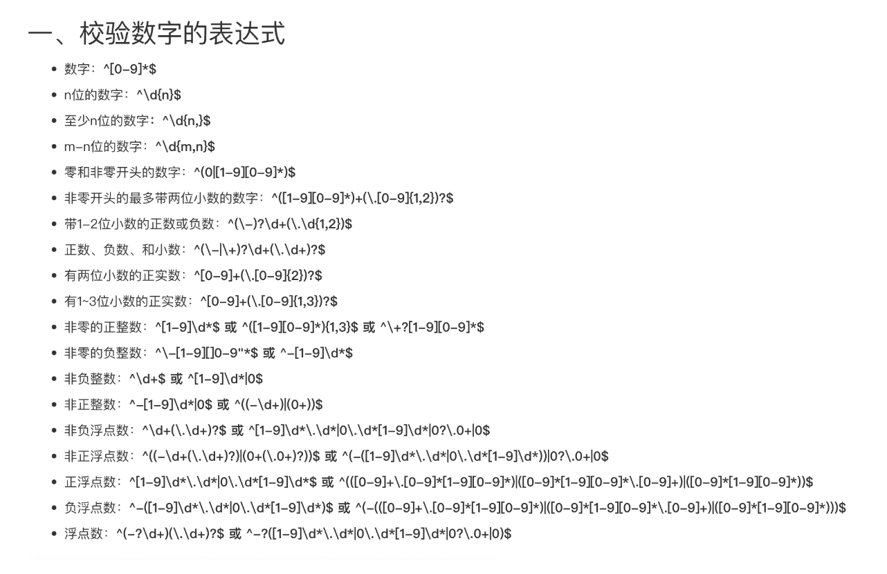

# 正则表达式回溯问题

## <font style="color:rgb(0, 0, 0);background-color:rgb(248, 246, 244);">前言</font>
<font style="color:rgb(51, 51, 51);background-color:rgb(248, 246, 244);">有时候我们在日常工作中，喜欢用正在表达式查找指定字符串，或者替换指定字符串，比写一堆Java代码，更方便和快捷。</font>

<font style="color:rgb(51, 51, 51);background-color:rgb(248, 246, 244);">但我想说的是，如果正则表达式，写的不好，程序在匹配指定字符串时，如果产生了大量的回溯，导致程序性能会非常差。</font>

## <font style="color:rgb(0, 0, 0);background-color:rgb(248, 246, 244);">1 案发现场</font>
<font style="color:rgb(51, 51, 51);background-color:rgb(248, 246, 244);">最近我用sonar扫描代码仓库中的代码问题时，发现了一个非常有意思的问题。</font>

<font style="color:rgb(51, 51, 51);background-color:rgb(248, 246, 244);">当时sonar指出这两个正则表达式有问题：</font>

```plain
\\d+\\.+\\d+
```

```typescript
public String getValue(String value) {
   if(value.contains(".")) {
     return value.replaceAll("0+?$","").replaceAll("[.]$","");
   }
}
```

<font style="color:rgb(51, 51, 51);background-color:rgb(248, 246, 244);">第一个正则表达式是为了从字符串中获取数字，比如：123.5m，获取后的值为123.5。</font>

<font style="color:rgb(51, 51, 51);background-color:rgb(248, 246, 244);">第二个和第三个正则表达式，是为了将字符串中.0去掉，比如：1*2.00*1.0，变成1*2*1。</font>

<font style="color:rgb(51, 51, 51);background-color:rgb(248, 246, 244);">这三个正在表达式，从功能的角度来说是没有问题的，能够正常匹配字符串。</font>

<font style="color:rgb(51, 51, 51);background-color:rgb(248, 246, 244);">但sonar在扫描这几个正则表达式之后，却出现了正则表达式回溯问题的提示，这种正则表达式写的不好，非常影响性能。</font>

<font style="color:rgb(51, 51, 51);background-color:rgb(248, 246, 244);">那么，什么是正则表达式回溯问题呢？</font>

## <font style="color:rgb(0, 0, 0);background-color:rgb(248, 246, 244);">2 什么是回溯问题？</font>
### **<font style="color:rgb(34, 34, 34);background-color:rgb(248, 246, 244);">2.1 什么是回溯问题？</font>**
<font style="color:rgb(51, 51, 51);background-color:rgb(248, 246, 244);">比如有字符串“abbc”，正则表达式为/ab{1,3}c/，因为默认是贪婪模式。</font>

<font style="color:rgb(51, 51, 51);background-color:rgb(248, 246, 244);">所以会尽量匹配多一点内容，也就是想尽量匹配多个b，于是步骤就是如下：</font>

1. **<font style="color:rgb(34, 34, 34);background-color:rgb(248, 246, 244);">a -> a</font>**
2. **<font style="color:rgb(34, 34, 34);background-color:rgb(248, 246, 244);">ab -> ab</font>**
3. **<font style="color:rgb(34, 34, 34);background-color:rgb(248, 246, 244);">abb -> abb</font>**
4. **<font style="color:rgb(34, 34, 34);background-color:rgb(248, 246, 244);">abbb -> abbc</font>**
5. **<font style="color:rgb(34, 34, 34);background-color:rgb(248, 246, 244);">abb -> abb</font>**
6. **<font style="color:rgb(34, 34, 34);background-color:rgb(248, 246, 244);">abbc -> abbc</font>**

<font style="color:rgb(51, 51, 51);background-color:rgb(248, 246, 244);">如上，第4步因为想要尽可能的匹配多一点内容，所以想要匹配3个b，但是没匹配上，匹配到了c，于是就回溯。</font>

<font style="color:rgb(51, 51, 51);background-color:rgb(248, 246, 244);">然后匹配下一个正则表达式，也就是c，然后c与c匹配，成功返回。</font>

<font style="color:rgb(51, 51, 51);background-color:rgb(248, 246, 244);">这就是正则表达式的回溯问题，当需要匹配的是一个超长字符串，并且发生了回溯问题，那其计算量能够想象有多大了吧。</font>

### **<font style="color:rgb(34, 34, 34);background-color:rgb(248, 246, 244);">2.2 如何解决回溯问题呢？</font>**
<font style="color:rgb(51, 51, 51);background-color:rgb(248, 246, 244);">2.2.1 使用懒惰模式</font>

<font style="color:rgb(51, 51, 51);background-color:rgb(248, 246, 244);">由于是因为贪婪模式导致的，那只要把贪婪模式改为懒惰模式即可，只要后面加个?就行，改为/ab{1,3}?c/。</font>

<font style="color:rgb(51, 51, 51);background-color:rgb(248, 246, 244);">但是懒惰模式也无法完全回溯问题，比如：字符串“abbc”，正则表达式/ab{1,3}?c/，则步骤如下：</font>

1. **<font style="color:rgb(34, 34, 34);background-color:rgb(248, 246, 244);">a -> a</font>**
2. **<font style="color:rgb(34, 34, 34);background-color:rgb(248, 246, 244);">ab -> ab</font>**
3. **<font style="color:rgb(34, 34, 34);background-color:rgb(248, 246, 244);">abc -> abb</font>**
4. **<font style="color:rgb(34, 34, 34);background-color:rgb(248, 246, 244);">ab -> ab</font>**
5. **<font style="color:rgb(34, 34, 34);background-color:rgb(248, 246, 244);">abb -> abb</font>**
6. **<font style="color:rgb(34, 34, 34);background-color:rgb(248, 246, 244);">abbc -> abbc 如上，第3步因为想要尽可能少匹配一点内容，于是就只匹配一个b，但没匹配上，于是就回溯，</font>**

<font style="color:rgb(51, 51, 51);background-color:rgb(248, 246, 244);">与贪婪模式相反，贪婪模式是字符串回溯，而懒惰模式是正则表达式回溯。</font>

### **<font style="color:rgb(34, 34, 34);background-color:rgb(248, 246, 244);">2.2.2 使用独占模式</font>**
<font style="color:rgb(51, 51, 51);background-color:rgb(248, 246, 244);">使用独占模式，只要后面加个+就行，改为/ab{1,3}+c/。</font>

<font style="color:rgb(51, 51, 51);background-color:rgb(248, 246, 244);">因为独占模式是只要不匹配就结束，不会进行回溯，但是也不能完全解决回溯问题，因为其也是会尽可能的匹配多一点内容，所以也会导致回溯问题。</font>

<font style="color:rgb(51, 51, 51);background-color:rgb(248, 246, 244);">总的来说，懒惰模式和独占模式都是只能减少回溯问题，但是不能完全避免回溯问题。</font>

<font style="color:rgb(51, 51, 51);background-color:rgb(248, 246, 244);">可优化方案：</font>

1. **<font style="color:rgb(34, 34, 34);background-color:rgb(248, 246, 244);">少用贪婪模式，多用独占模式。</font>**
2. **<font style="color:rgb(34, 34, 34);background-color:rgb(248, 246, 244);">减少分支选择，比如(X|Y|Z)这种分支选择，如要只用分支，可以将常用的选项放在前面，可以提取公共因子，比如(aabb|aacc|aadd)可以换成aa(bb|cc|dd)，可以用三次匹配来代替(X|Y|Z)。</font>**
3. **<font style="color:rgb(34, 34, 34);background-color:rgb(248, 246, 244);">减少捕获嵌套，就是一个()代表一个捕获组，比如/a(bc)de(fgh)ijk(lmn)/，然后\1代表(bc)，\2代表(fgh)，\3代表(lmn)， 非捕获组就是(?:X)，比如/a(?:bc)de(fgh)ijk(?:lmn)/，则\1代表(fgh)，或者直接不用括号/abcde(fgh)ijklmn/；</font>**
4. **<font style="color:rgb(34, 34, 34);background-color:rgb(248, 246, 244);">能不用正则表达式就不用正则表达式。</font>**

## <font style="color:rgb(0, 0, 0);background-color:rgb(248, 246, 244);">3 如何优化代码？</font>
<font style="color:rgb(51, 51, 51);background-color:rgb(248, 246, 244);">知道正则表达式回溯问题，会非常影响正则表达式匹配字符串的性能。</font>

<font style="color:rgb(51, 51, 51);background-color:rgb(248, 246, 244);">那么，如何优化上面的代码呢？</font>

<font style="color:rgb(51, 51, 51);background-color:rgb(248, 246, 244);">将正则表达式：\\d+\\.+\\d+，改成\\d+\\.?\\d*+。</font>

<font style="color:rgb(51, 51, 51);background-color:rgb(248, 246, 244);">然后将将字符串中.0的逻辑，改成不用正则表达式匹配。</font>

<font style="color:rgb(51, 51, 51);background-color:rgb(248, 246, 244);">其实在Java中已经提供了实现这类功能的方法，我们可以使用BigDeciaml类。</font>

<font style="color:rgb(51, 51, 51);background-color:rgb(248, 246, 244);">代码优化如下：</font>

```plain
public String getValue(String value) {
   if(value.contains(".")) {
     return new BigDeciaml(value).strpTrailingZeros().toPlainString();
   }
}
```

<font style="color:rgb(51, 51, 51);background-color:rgb(248, 246, 244);">使用了BigDeciaml类的strpTrailingZeros和toPlainString方法。</font>

<font style="color:rgb(51, 51, 51);background-color:rgb(248, 246, 244);">这两个方法的底层不是用正则表达处理的。</font>



<font style="color:rgb(51, 51, 51);background-color:rgb(248, 246, 244);">最后给大家推荐一个非常有用的网站，上面列举了我们日常工作中经常会用到正则表达式，可以直接测试和使用：</font><font style="color:rgb(51, 51, 51);background-color:rgb(248, 246, 244);"> </font>[https://c.runoob.com/front-end/854/](https://c.runoob.com/front-end/854/)

<font style="color:rgb(51, 51, 51);background-color:rgb(248, 246, 244);">下面给大家列举一些工作中经常需要用到的正则表达式：</font>

  
 


> 更新: 2024-05-20 17:07:25  
> 原文: <https://www.yuque.com/yuqueyonghue6cvnv/cxhfwd/dnve6bld5prda98q>