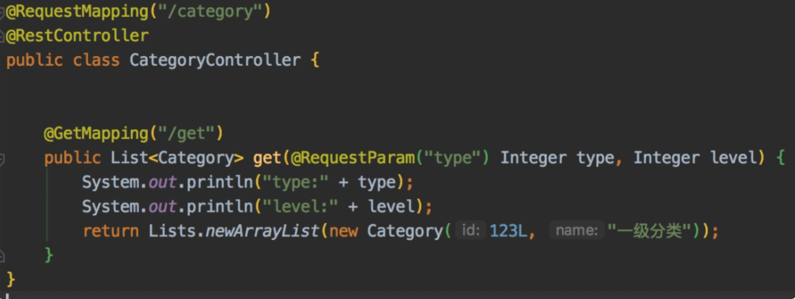
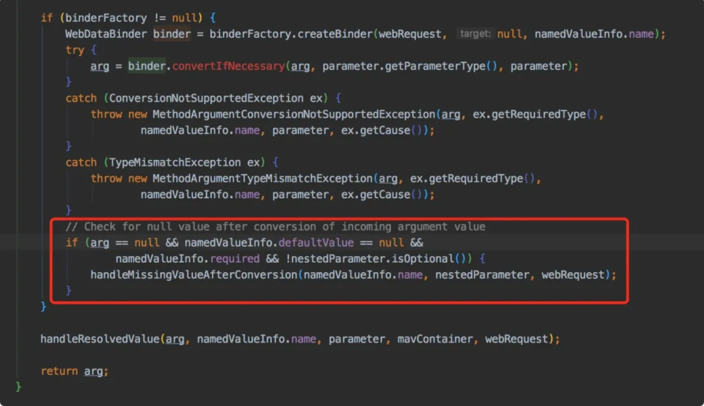
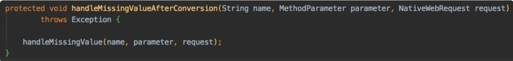
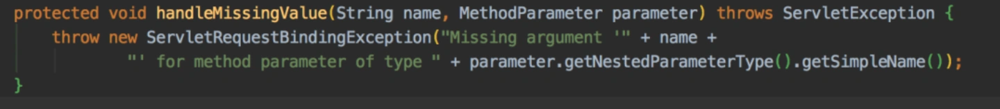
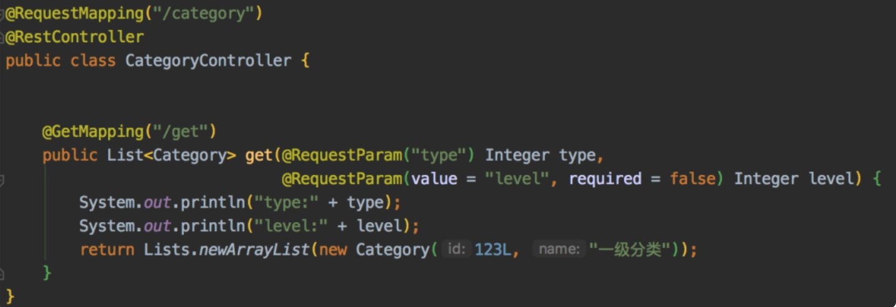

# 项目中SpringBoot版本升级问题

## **前言**
最近项目组升级了SpringBoot版本，由之前的2.0.4升级到最新版本2.7.5，却引出了一个大Bug。

到底是怎么回事呢？

## **1.案发现场**
有一天，项目组的同事反馈给我说，我之前有个接口在新的测试环境报错了，具体异常是：Missing argment level for method parameter of type Integer。

我当时的第一反应有点懵，心想这个接口是一个老接口，有一年多的时间都没改过了，怎么会出问题呢？

他说近期另外一个同事为了部署阿里云服务器，把新测试环境SpringBoot的版本升级到了最新版。

之后，在测试的过程中，发现我有个Get请求接口报异常了。

该接口代码类似于这样：

在getCategory接口中，有两个参数：

1. type表示大类，是必传的。
2. level表示要返回几级分类，比如：4级分类，就传4，是非必传的，默认就是查4级分类。

就是这样一个接口的level参数，前端没有传参，例如：

结果被Spring MVC拦截直接报错了。

## **2 报错的原因**
从打印的异常信息看，现在level参数必须要传值了，之前是可传，可不传的。

我后来本打算自定义Spring的转换器，修改一下校验规则，跟老版本保持一致。

这样那些基本接口就不用改了。

但后来发现，被spring-web-5.3.23的源码无情的打脸了。

在org.springframework.web.method.annotation包下的AbstractNamedValueMethodArgumentResolver类的resolveArgument方法中：

多了这样的校验。如果该参数为空，没有设置默认值，required属性为true，并且不是Optional类型，则执行handleMissingValueAfterConversion方法。

该方法会调用handleMissingValue方法，具体代码如图中所示：

最后会抛出之前我看到的那个异常。

原因最新版本的Spring中不允许Get接口的请求参数，在不使用@RequestParam注解时，值为空的情况出现了。

## **3 如何解决问题？**
想要解决上面的报错问题，其实很简单，只需在level参数前加@RequestParam注解，并且设置required属性为false。

例如：

但是后面发现，项目中不只我这一个接口要调整，其他好多同事的接口，也有类似的问题，需要修改的接口很多。

这个改动的工作量不小。

哭晕在测试。。。

## **后话**
这个问题有很多人中招，所以非常有必要把这个问题分享给大家，防微杜渐。

我之前level参数不加@RequestParam注解，也没设置required属性，当时持有的心态是Spring有默认值，有些注解不加，程序也能正常运行，既然这样就可以少写点代码，并且在当时的版本测试过，没有出现过什么问题。

这种情况其实是Spring框架的一个bug，已经在最新版本中被修复了。。。

赶紧review一下你们的代码，看看有没有类似的用法，不然迟早有一天也会中招。

**💡**** 有启发**

  
 

> 更新: 2024-05-20 17:07:39  
> 原文: <https://www.yuque.com/yuqueyonghue6cvnv/cxhfwd/qq2wp2yra6b4bwy2>