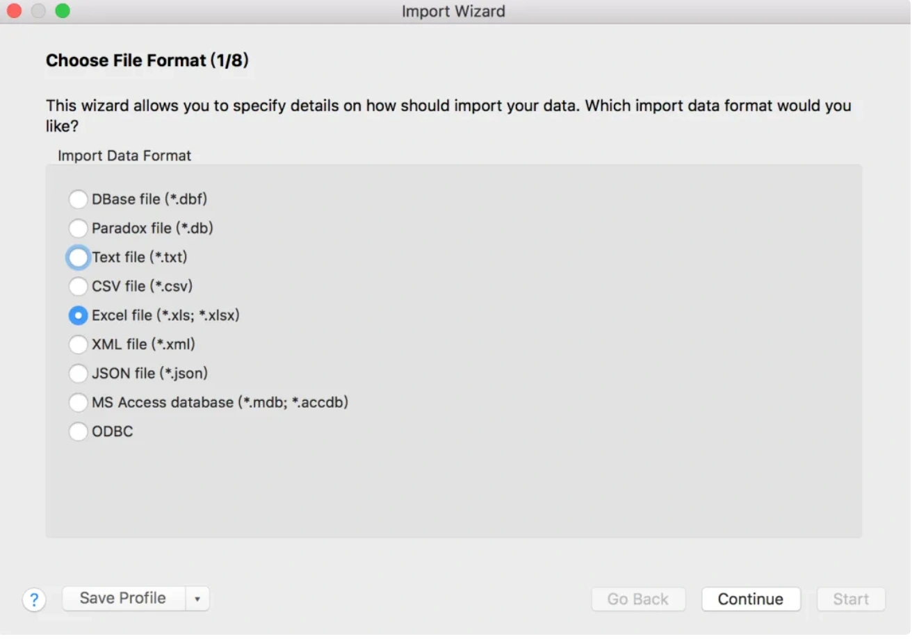
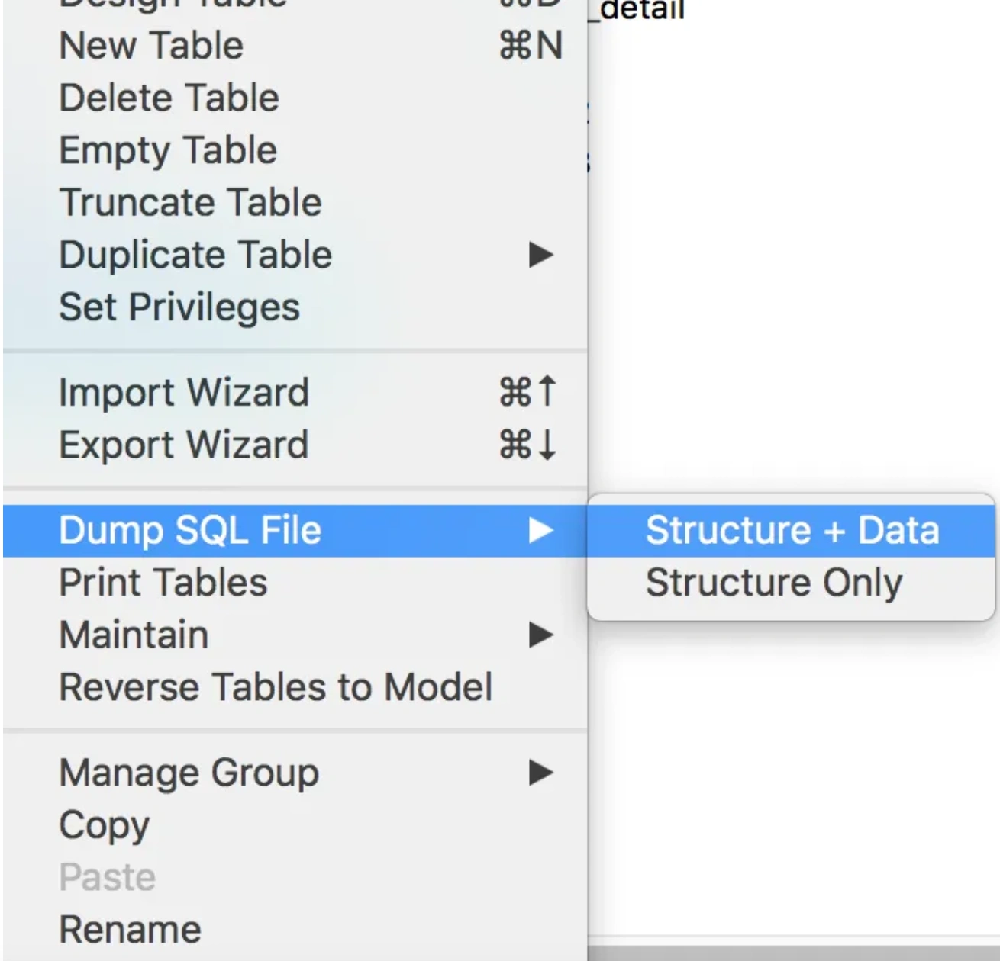
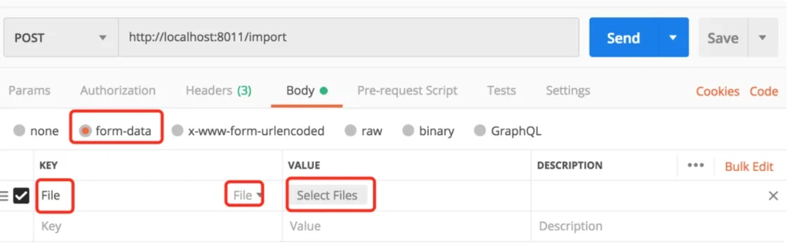
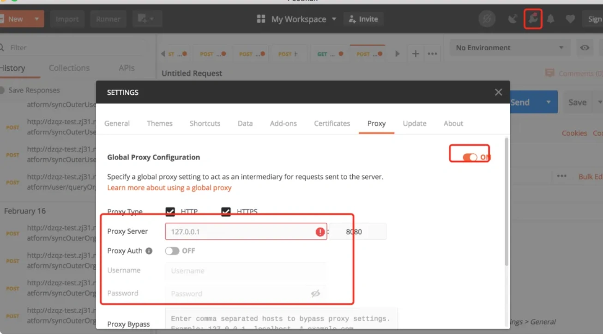

# Canal问题

## **前言**
前段时间，我们线上系统出现了一个事故：用户创建了商品，在商城的商品列表页看不到，也搜索不到。

## **1. 从需求说起**
### **1.1 背景**
由于我们这个迭代是个大版本，上线的日子要临近了。这次上线需要运营配合提供很多商品属性的数据，他们需要把第三方的属性和我方系统的属性，在excel表格中匹配起来。

原本是这样规划的：由运营同学在excel表格中手动对应双方属性的映射关系。

但后来，他们觉得属性太多了，如果他们人工在excel表格中对应属性映射关系，可能时间上有点来不及。

于是，他们在某次会议上，特意给我提了需求，希望我可以通过程序帮他们在excel中，把双方的属性值映射上。

有一个要求就是要：快。

因为其他同事，还要基于这份excel数据，做一些后续处理。

### **1.2 原始需求**
刚开始开会时，运营说的需求是：他们提供一个excel表格，里面有分类和属性字段，然后让我在程序中全匹配，把能够匹配上的属性编号和属性，在excel的另外两列中返回给他们。

然后，他们根据这份excel数据，把匹配不上的（即另外两列为空）数据，在我们系统中手动录入，这样最终都能匹配上。

### **1.3 加戏了**
本来我觉得这个需求挺简单的。

但后来，运营加戏了（加新需求）。

其实，刚开始运营没说完。

后来发现，他们要接入两个厂商。

而且运营提供的两个厂商的excel表格中字段的格式不一样，没法用一套程序搞定。

而且，我们发现有部分属性中包含了一个区间范围，跟我们系统的数据肯定是对应不上的，必须要拆分属性后再匹配。

很显然，运营是不愿意做这种手动拆分的工作的，这事他们想我帮他们用程序处理，这就给我增加了不少工作量。

此外，厂商1还有一个特殊需求：运营手动把excel中的部分数据剔除掉，然后基于这份新数据重新匹配一份新excel数据。

## **2. 最快的方案**
了解运营的需求之后，我简单的分析了一下。按需求的优先级，排了一个顺序：

1. 导出厂商1的属性数据。
2. 导出厂商2的属性数据。
3. 给厂商1导一份特殊的属性数据。
4. 导出区间范围能匹配上的数据。

如果这些需求都写程序处理，可能要写4个程序，而且还需要花时间部署代码，我怕时间上来不及。

于是我想了一个快速处理需求1、2、3的办法即：直接通过sql语句查询出所需数据。

不过这套方案的前提是：需要把excel中的数据导入到生产环境中。

为了保险起见，我先把excel中的数据导入dev环境中。等我写好sql，测试好数据之后，再导入生产环境。

使用数据库管理工具：Navicat Premium的Import Wizard功能，可以轻松将excel表格中的数据直接导入一张新表中。

它里面可以指定excel的sheet对于哪张表，指定excel中的列对应表中哪些列。

由于这些需求都是新表，无需特别指定，我就按默认的表名和字段名导入数据了。

但有个问题就是：表名和字段名都是中文的，因为excel中的sheet名和sheet中的字段名都是中文的。

其实，我当时已经发现了这个问题。

但当时又想了想，表中字段比较多，要一一改成英文的，光起名字要花些时间。这些字段最终还是要转换成运营可以看得懂的中文的字段名，这样转来转去有点画蛇添足，浪费时间。

而且这张表导入生产环境之后，是一张临时表，用完了就会被删除的，影响不大。

此外，这张表是新加的，如果没有程序使用的话，应该是不会有问题的。

所以，当时没多想，就找人把数据导入生产环境了。

导出数据的方法很简单：

使用Navicat Premium的Dump SQL File中的Structure + Data即可。

这样该数据库工具，就会把相关表的建表的create语句，和插入数据的insert语句，导出到一个.sql后缀的文件中。

有个小问题就是：每条数据会生成一个insert语句，如果太多了放到生成环境执行，执行效率会比较低。

这时可以将insert脚本复制到idea或者其他的工具中打开，然后全文替换一下，去掉多余的insert，拼接成一个insert语句。

然后再用在线的sql压缩工具，比如：[https://tool.lu/sql，压缩一下去掉多余的空格。](https://tool.lu/sql%EF%BC%8C%E5%8E%8B%E7%BC%A9%E4%B8%80%E4%B8%8B%E5%8E%BB%E6%8E%89%E5%A4%9A%E4%BD%99%E7%9A%84%E7%A9%BA%E6%A0%BC%E3%80%82)

这样插入数据的sql放到生产环境执行，效率要快很多。

运营提供的excel表格中的数据，被导入生产环境之后。按计划，通过一条sql语句，把运营所需要的结果直接查询出来，然后把结果复制到excel表格中。（注意：如果查询结果的数据太多，不建议这么玩）。

按上面的做法，我很快完成了需求：1、2、3，并且把运营所需要的数据及时给他们了。

## **3. 一个插曲**
原本按计划，导完数据之后，生产环境中临时表是要删除的。

但出现了一个小插曲，运营给我提了一个临时需求：需要重新导一份厂商2的数据给他们。

他们已经按照表格中的内容，把需要添加的属性已经添加到系统中了。需要我们重新导一份数据，确认一下，现在是否所有数据都能匹配上。

此时，我当时在庆幸幸好数据没删。

运营的这个临时需求，在线上执行相同的sql很快就把数据导出来了。

1分钟实现需求，当时那叫一个：爽。

而且我观察了一下，系统没有出现异样。

给运营把数据导完之后，我就忙其他事情去了，把删除数据这个事情给忘了。

## **4. 线上出现问题**
第二天上午，领导把我叫过去说：canal服务挂了。

我们分析canal了异常日志后发现，这个问题是由于canal订阅者，读取中文的表名时，出现了乱码，没有成功读取到。该程序直接抛了异常，导致canal订阅者不能正常工作了。

这个问题对用户的影响是：用户创建了商品，在商城的商品列表页看不到，也搜索不到，有用户投诉到运营那边了。

我当时的第一反应是：这也能挂？

我当时不知道下游的业务系统，通过canal监听了我这边的整个数据库。

话不多说，先把问题解决了吧。

我们当时为了快速解决问题，先把中文的临时表都删了，然后把canal重启一下。

果然，这个办法是有效的。

canal监听者立马恢复正常了。

当天，没有再出现过问题。

第二天，领导把我叫过去说：canal服务又挂了。

我当时一脸懵逼。我什么都没干呀。

Canal解析数据报错：column size is not match for table xxxx 8 vs 9。

后来，我们经过分析之后发现，canal有一份缓存，如果canal出现异常，可能跟数据库真实的情况不一致。

然后，我们把canal的meta.dat删除了，然后重启服务，果然恢复正常了。

后面也一直没出现过问题。

## **6. 确定需求4的方案**
前面说过运营总共提了4个需求，我通过前面的骚操作，完成了3个需求。

但第4个需求，里面还有点特殊要求，通过sql脚本不容易搞定，只能硬着头皮写java程序了。

运营的需求是把他们提供的excel表格中的数据导入系统，然后由系统匹配某个区间范围内的数据，把结果写入excel的另外两列中，最后返回该excel文件。

拿到这个需求我脑子里想了三个方案：

1. 写一个可执行的springboot工具项目，直接放到线上环境中执行jar包。
2. 使用一个job处理，本身已经有xxl-job了，接入非常方便。
3. 写一个api接口。

最终我选择了第3个方案。

为什么？

其实这3个方案代码的工作量差不多，但前面两个方案需要先上传excel到应用服务器，或者到OSS等文件服务器。

而如果运营需要导多次数据，每次都需要上传一次excel，不仅浪费服务器资源，而且比较费时，还麻烦。

如果用api接口的话，可以直接使用postman远程调用，直接上传文件，通过输入流的形式读取数据，不保存到服务器。然后处理完数据，在将excel内容以输出流的形式返回给我们下载即可。

使用postman调用远程接口时，入参选择form-data格式，key那里输入File，然后在右侧下拉列表中选择File，就会出现Select Files按钮。

通过该按钮，就能选择我们需要上传的excel文件。

如果想调用接口后直接下载excel文件：

在postman中可以选择Send and Download按钮，即可下载文件。

注意，在图片中的请求api接口地址是[localhost](http://localhost/)，我只是举了个例子，实际情况中是接口的域名。

此时，有些小伙伴可能会问题：这个接口不需要登录就能访问？

答：确实不需要登录，我在网关层放开了该接口的访问权限。

那不是有安全问题？

答：为了解决接口安全问题，也避免发版影响正常用户的使用。我的想法是基于master分支新拉一个分支：hotfix，而pre环境（预生产环境，能访问生产环境的数据库）部署hotfix分支的代码。

还有一个非常关键，而且我们一直在用的策略是：访问pre的所有接口都必须使用指定的代理。

公司外面的人肯定是不知道这个代理的存在的，换句话说，只有我们公司内部的人才能访问pre环境的接口。

因此，新加的excel处理接口是非常安全的，而且该接口只部署pre环境，对正常用户不会造成影响

这个方案看似挺完美的。

然后三下五除二，我把代码写完，本地测试通过了，准备发到pre环境导数据。

## **7. jar包冲突**
该功能部署pre环境其实非常简单，只需要部署hotfix分支的代码即可。

代码部署好之后，我准备开始访问接口。

先在postman的这个地方配置pre的代理。

代码部署好之后，就能通过上一节中介绍的内容上传excel文件，然后下载结果excel文件了。

但我第一次调用接口时，没有返回想要的数据。从应用服务器的日志中看到，该接口报错了。

报的竟然是某个类找不到。。。。

我这次为了快速导入和导出excel文件，选择了阿里的easyexcel工具类。

本地开发环境，我确认过，那个类是有的。而且我这个功能是可以正常运行的，我都导出数据了。

但pre环境却报了类找不到。

我猜可能是有jar包版本不兼容。

于是，调整了一下pom文件中引入的jar包的版本，之后，重新部署pre环境。

还真是这个原因，这一次接口能正常访问，能够返回数据了。

我心里暗自窃喜。

后来，把运营所需要的excel文件及时发给他们了。

## **8. pre环境网络异常**
又过了两天，需求4有点调整。我把代码改了，还是那个hotfix分支，找人重新部署了pre环境。

打算用之前相同的方法导数据的。

但马上被啪啪打脸。

用postman请求该接口很久都不返回，我知道肯定是出了什么幺蛾子。

查了一下pre环境应用服务器的日志，竟然没有查到请求该数据处理接口的记录。

接着，我查了一下pre环境应用网关层的日志，竟然也没有记录。

不对呀。

然后又查了一下生产环境应用网关层的日志，原来是请求到生产环境了。

不是配置了代理吗？

为什么会访问到生产环境？

我带着这两个问题咨询了一下公司的IT部门同事。他们追查了一下原因，发现原来网络带宽被打满，导致pre环境的代理出问题了。

经过一段时间之后，pre环境的代理恢复正常了。

其实，pre环境代理出问题后，我们也尝试了一下登录到远程服务器上，执行相关curl命令，直接调用服务器的本地接口。最后，发现用这种方式不太好下载文件。

## **9. 部署错分支了**
pre环境代理恢复之后，我满怀希望去用postman请求数据处理接口导数据。

但我发现导出的数据不对。

导出的excel文件根本打不开。

我打开excel文件看数据内容时，提示excel文件格式不对，或者已经被损坏了。

然后，我赶紧看应用服务器的日志，有请求记录，但是没有返回记录，从这个日志中看不出问题。

当时我灵机一动：既然保存成.xlsx后缀的excel文件打不开，如果把文件后缀改成.csv格式呢？

于是，我把导出的excel文件后缀改成了.csv格式，果然可以打开文件。

文件内容中提示404。

这时我就明白了，可能是pre环境的接口没发成功，被其他分支的代码冲掉了。

然后，跟部署代码的同学沟通之后，他当时操作失误，部署的master分支的代码，果然把hotfix的代码冲掉了。

后来，他重新部署了hotfix的代码，我顺利的把数据导给运营了。

至此，这4个需求顺利完成了。

## **总结**
这次给运营导数据，是一次比较难得的经历，遇到了很多问题，值得总结一下。

当然这其中有一部分是自己给自己挖的坑，也有一部分是被其他人坑了。

1. 生产环境的表名或字段名，一定不能用中文的。不要抱侥幸心里，说不定哪天就出问题了。
2. 生产环境创建的临时表，用完之后，一定要记得及时清理。
3. 使用canal时，最好别全库监听。用到什么表，就监听什么表，避免出现一些意外事故。
4. 版本不兼容，会导致类找不到问题。
5. 如果使用了代理，要考虑代理出现问题的情况。
6. 代码发版之后，一定要再三确认分支是否正确。
7. 删除meta.dat文件，重新canal服务，可以解决canal的很多问题。
8. postman真的非常强大，建议大家都好好用一下。
9. 把多条insert语句合成一条执行，效率更高。可以使用[https://tool.lu/sql](https://tool.lu/sql%EF%BC%8C%E8%BF%99%E9%87%8C%E5%9C%A8%E7%BA%BF%E5%B7%A5%E5%85%B7%EF%BC%8C%E5%8E%8B%E7%BC%A9%E4%B8%80%E4%B8%8Bsql%E5%8E%BB%E6%8E%89%E5%A4%9A%E4%BD%99%E7%9A%84%E7%A9%BA%E6%A0%BC%E3%80%82)这里在线工具，压缩一下sql去掉多余的空格。
10. excel导入和导出用阿里的easyexcel工具，真的非常方便。

  
 

> 更新: 2024-05-20 17:22:38  
> 原文: <https://www.yuque.com/yuqueyonghue6cvnv/cxhfwd/op9d2io9y3nanzc5>