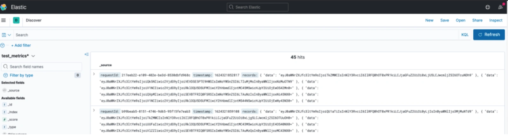

# ES的Date类型有坑!

## **<font style="color:rgb(34, 34, 34);background-color:rgb(248, 246, 244);">前言</font>**
<font style="color:rgb(51, 51, 51);background-color:rgb(248, 246, 244);">我前一段时间，升级了公司的ES的版本，目前kibana使用的版本是8.5.0。</font>

<font style="color:rgb(51, 51, 51);background-color:rgb(248, 246, 244);">这两天遇到一个Date类型字段作为查询条件无法选择时间的问题，分享给大家，希望对你会有所帮助。</font>

## **<font style="color:rgb(34, 34, 34);background-color:rgb(248, 246, 244);">案发现场</font>**
<font style="color:rgb(51, 51, 51);background-color:rgb(248, 246, 244);">有一天，某位同事通过xxx-log的index索引，在kibana后台通过搜索日志。</font>

<font style="color:rgb(51, 51, 51);background-color:rgb(248, 246, 244);">他搜索了某个关键字：Action，但是查出的日志太多了。</font>

<font style="color:rgb(51, 51, 51);background-color:rgb(248, 246, 244);">于是，他想通过时间范围查询。</font>

<font style="color:rgb(51, 51, 51);background-color:rgb(248, 246, 244);">在日志实体中，有个startTime字段，表示开始时间，正常情况下，在kibana后台是可以通过时间范围搜索日志的。</font>

<font style="color:rgb(51, 51, 51);background-color:rgb(248, 246, 244);">但现在却没法按时间过滤日志：</font>



<font style="color:rgb(51, 51, 51);background-color:rgb(248, 246, 244);">这到底是怎么回事呢？</font>

## **<font style="color:rgb(34, 34, 34);background-color:rgb(248, 246, 244);">分析原因</font>**
<font style="color:rgb(51, 51, 51);background-color:rgb(248, 246, 244);">我查看了一下该index在ES中的字段类型，发现了一个很奇怪的问题：startTime的类型竟然是Long，而不是Date。</font>

<font style="color:rgb(51, 51, 51);background-color:rgb(248, 246, 244);">因为当时在java代码中定义的实体ThirdLogModel中的startTime类型是这样定义的：</font>

```plain
private Date startTime;
```

<font style="color:rgb(51, 51, 51);background-color:rgb(248, 246, 244);">明明定义的是Date类型，在ES中自动创建了索引之后，怎么会变成Long类型呢？</font>

<font style="color:rgb(51, 51, 51);background-color:rgb(248, 246, 244);">当时代码大概是这样的：</font>

```plain
try {
   BulkRequest bulkRequest = new BulkRequest();
   IndexRequest indexRequest = new IndexRequest(index);
   indexRequest.source(JSON.toJSONString(logModel),XContentType.JSON);
   bulkRequest.add(indexRequest);
   BulkResponse response = esClient.bulk(bulkRequest, RequestOptions.DEFAULT);
   if(response.hasFailures()) {
     log.error("日志写入失败",e); 
   } else {
      log.info("日志写入成功");
   }
} catch(Throwable e) {
  log.error("日志写入失败",e); 
}
```

<font style="color:rgb(51, 51, 51);background-color:rgb(248, 246, 244);">一眼看不出问题。</font>

<font style="color:rgb(51, 51, 51);background-color:rgb(248, 246, 244);">我上网搜索了一下。</font>

<font style="color:rgb(51, 51, 51);background-color:rgb(248, 246, 244);">网上说要在时间类型的字段上，用@JsonFormat注解转换一下格式，否则保存到ES中的时间格式是Long。</font>

## **<font style="color:rgb(34, 34, 34);background-color:rgb(248, 246, 244);">解决问题</font>**
<font style="color:rgb(51, 51, 51);background-color:rgb(248, 246, 244);">我按照网上的说法在实际格式上加了@JsonFormat注解，代码改成这样的：</font>

```kotlin
@JsonFormat(shape=JsonFormat.Shape.STRING,pattern="yyyy-MM-dd'T'HH:mm:ss.SSSZ", timezone="GMT+8")
private Date startTime;
```

<font style="color:rgb(51, 51, 51);background-color:rgb(248, 246, 244);">本以为可以一次性成功。</font>

<font style="color:rgb(51, 51, 51);background-color:rgb(248, 246, 244);">但是这样调整之后，发现还是没有生效，查看index中的startTime字段的数据类型，任然是Long类型。</font>

<font style="color:rgb(51, 51, 51);background-color:rgb(248, 246, 244);">我刚开始是以为是有缓存，于是在kibana后台手动删除了xxx-log这个index。</font>

<font style="color:rgb(51, 51, 51);background-color:rgb(248, 246, 244);">然后触发了自动生成index的业务逻辑，在ES中重新生成了xxx-log这个index。</font>

<font style="color:rgb(51, 51, 51);background-color:rgb(248, 246, 244);">于是，再次查看了一些index中的startTime字段的数据类型，任然是Long类型。</font>

<font style="color:rgb(51, 51, 51);background-color:rgb(248, 246, 244);">我去。。。这是什么情况？</font>

<font style="color:rgb(51, 51, 51);background-color:rgb(248, 246, 244);">我再回去查看了一下之前创建index的代码，发现了一个疑点：</font>

```plain
indexRequest.source(JSON.toJSONString(logModel),XContentType.JSON);
```

<font style="color:rgb(51, 51, 51);background-color:rgb(248, 246, 244);">这个方法的作用是将logModel实体，转换成json对象，然后赋值给source字段。</font>

<font style="color:rgb(51, 51, 51);background-color:rgb(248, 246, 244);">这个JSON.toJSONString方法用的是fastjson包下的方法。</font>

<font style="color:rgb(51, 51, 51);background-color:rgb(248, 246, 244);">而我们使用的@JsonFormat注解是jackson包下的注解。</font>

<font style="color:rgb(51, 51, 51);background-color:rgb(248, 246, 244);">原来如此，找到原因了，这不是牛头不对马嘴？</font>

<font style="color:rgb(51, 51, 51);background-color:rgb(248, 246, 244);">于是，我将之前其他同事写的JSON.toJSONString方法，改成使用jackson包下的ObjectMapper类去将实体转换成json字符串。</font>

```plain
private static ObjectMapper objectMapper = new ObjectMapper();
indexRequest.source(objectMapper.writeValueAsString(logModel),XContentType.JSON);
```

<font style="color:rgb(51, 51, 51);background-color:rgb(248, 246, 244);">这样调整之后，为了确保万无一失，再将之前的index删除了。</font>

<font style="color:rgb(51, 51, 51);background-color:rgb(248, 246, 244);">再次触发了业务功能，写入了新的日志到xxx-log这个index当中，它自动创建了这个index。</font>

<font style="color:rgb(51, 51, 51);background-color:rgb(248, 246, 244);">查看了一下startTime字段，类型已经变成了Date类型了。</font>

<font style="color:rgb(51, 51, 51);background-color:rgb(248, 246, 244);">已经解决问题了。</font>

## **<font style="color:rgb(34, 34, 34);background-color:rgb(248, 246, 244);">后续</font>**
<font style="color:rgb(51, 51, 51);background-color:rgb(248, 246, 244);">通过前面的调整，已经将ES中startTime字段的数据类型改成了Date类型了。</font>

<font style="color:rgb(51, 51, 51);background-color:rgb(248, 246, 244);">但在kibana的discover页面，还是没办法根据startTime选择时间范围查询日志。</font>

<font style="color:rgb(51, 51, 51);background-color:rgb(248, 246, 244);">我查看了一下data view窗口，里面列出了我们所需要的一些index。</font>

<font style="color:rgb(51, 51, 51);background-color:rgb(248, 246, 244);">找出了我们用的那个index，删除掉了，重新创建了一个一样的。</font>

<font style="color:rgb(51, 51, 51);background-color:rgb(248, 246, 244);">果然，这样调整之后，在kibana的discover页面出现了时间搜索条件了。</font>

<font style="color:rgb(51, 51, 51);background-color:rgb(248, 246, 244);">成功解决问题了。</font>

## **<font style="color:rgb(34, 34, 34);background-color:rgb(248, 246, 244);">总结</font>**
<font style="color:rgb(51, 51, 51);background-color:rgb(248, 246, 244);">通过这次解决ES时间问题的过程，我踩过了下面三个坑：</font>

1. <font style="color:rgb(51, 51, 51);background-color:rgb(248, 246, 244);">在创建ES的index时，对于Date类型字段，需要在代码中特殊处理一下，否则会自动变成Long类型。</font>
2. <font style="color:rgb(51, 51, 51);background-color:rgb(248, 246, 244);">使用@JsonFormat注解时，务必要使用jackson包下的json转换工具，否则该注解会失效。</font>
3. <font style="color:rgb(51, 51, 51);background-color:rgb(248, 246, 244);">kibana页面的data view窗口，有缓存，有些功能调整了，没法实时生效。</font>


> 更新: 2024-05-20 17:24:04  
> 原文: <https://www.yuque.com/yuqueyonghue6cvnv/cxhfwd/kwzq73k82es1kyn3>