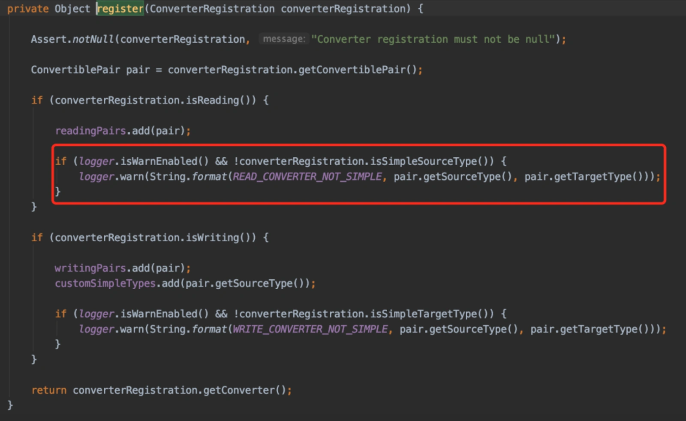
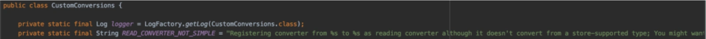
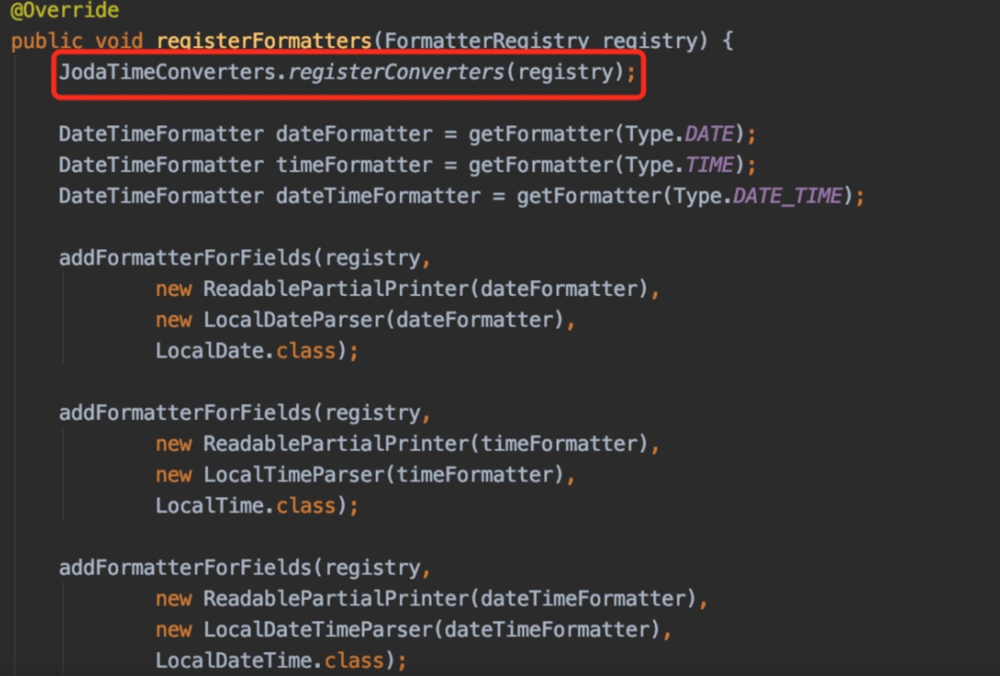
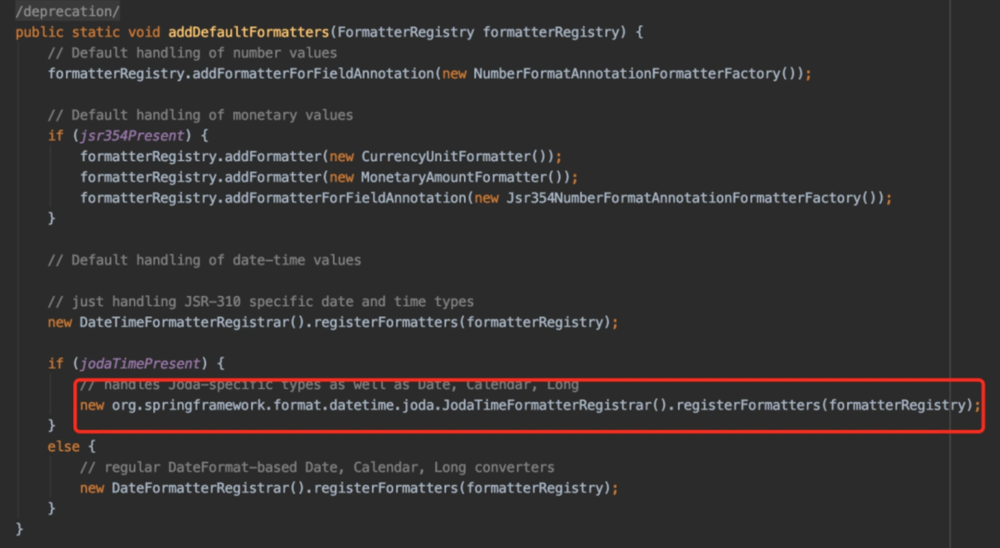
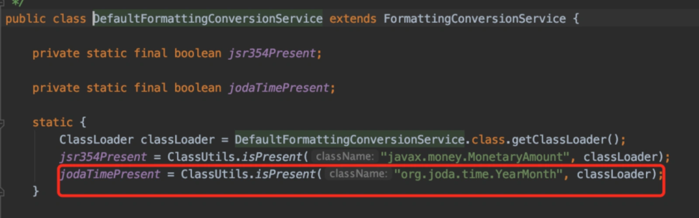
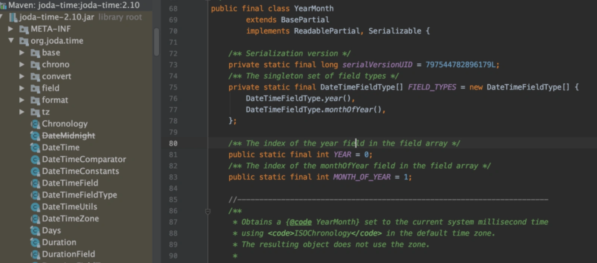
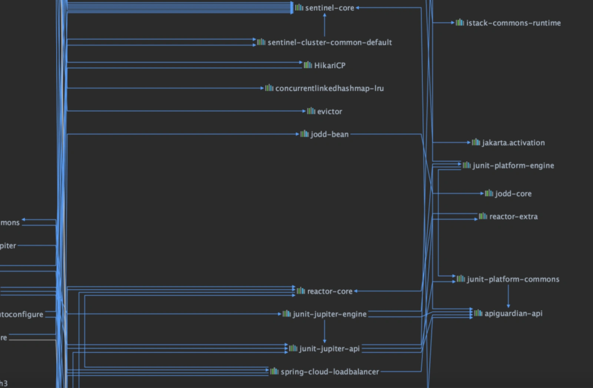
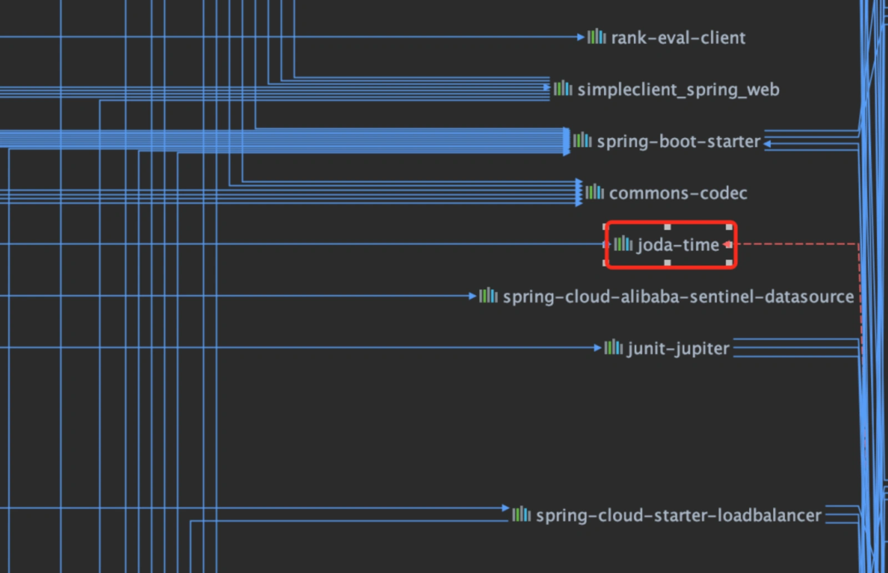

# 一个诡异的LocalDateTime的警告

## **前言**
最近在项目中使用了mongodb缓存商品数据，以便于业务系统在调用商品创建接口时，如果创建了相同的商品，能够快速返回他们所需要的数据，起一个加速的作用。

刚开始打算使用redis做缓存的，但考虑到返回的数据量比较大，如果将这些数据保存到redis中，可能会存在大key的问题，最后随着数据越来越多，性能会不断下降。

因此，最后选择使用mongodb。

但引入mongodb之后，在SpringBoot项目启动的时候，却出现了一个LocalDateTime的警告，找遍全网都没有答案。

怎么回事呢？

## **1 还原事故现场**
在SpringBoot项目中使用mongodb非常简单，只需要在[pom.xml](http://pom.xml/)文件中引入了spring-boot-starter-data-mongodb相关的依赖包即可。

然后在Configuration的配置类上，增加@EnableMongoRepositories注解指定basePackages路径即可。

很快将mongodb数据读写的功能实现了，但在启动SpringBoot项目时，在日志中出现了这样一个警告：

Registering converter from class [java.time.LocalDateTime](http://java.time.localdatetime/) to class [org.joda.time.LocalDateTime](http://org.joda.time.localdatetime/) as reading converter although it doesn't convert from a store-supported type; You might want to check your annotation setup at the converter implementation

我们平常使用的时间类是：[java.time.LocalDateTime](http://java.time.localdatetime/)，而 [org.joda.time.LocalDateTime](http://org.joda.time.localdatetime/)类是什么鬼？

为什么会出现这个警告呢？

## **2 分析问题**
为了解决这个问题，我全局搜索了一下[org.joda.time.LocalDateTime](http://org.joda.time.localdatetime/)类，但发现项目中并没有使用。

这就更奇怪了，为什么项目中没有使用这个类，还出现了这个类的警告呢？

于是，我根据Registering converter from class [java.time.LocalDateTime](http://java.time.localdatetime/) 关键字，全网搜索了一下。

发现，有些人遇到过类似的问题，但是没有解决方案，等待其他人回复答案。

问了一下同事，他说这个问题一直都存在，一直没有解决。

没办法，只能硬着头皮查看源码了。

首先要确定是哪个类爆出的那个警告。

很快在日志中查到了：|C02YK13MJG5J||WARN ||[org.springframework.data](http://org.springframework.data/)[.convert.CustomConversions](http://org.springframework.data.convert.customconversions/)，

其实是这个类打印的警告。

很快定位到register方法，里面有这样一行代码。

而静态常量READ_CONVERTER_NOT_SIMPLE就是定义的那个异常：

原来是这里报出的警告。

那么，是什么原因会导致这个警告呢？

我在打印警告的那一行代码，加了一个断点。

使用debug模式，重新启动SpringBoot项目之后，在断点的地方出现了这样一个类：JodaTimeConverters，引起了我的注意。顺着这个类，查到调用的地方，很快找到了JodaTimeFormatterRegistrar类。

在它的registerFormatters方法中，有一个注册JodaTimeConverters类的方法。

顺藤摸瓜，很快找到了DefaultFormattingConversionService类，在它的addDefaultFormatters方法中调用的JodaTimeFormatterRegistrar类的registerFormatters方法。

addDefaultFormatters方法代码如下：

而这里有个开关：jodaTimePresent，如果它为true，则走了JodaTimeFormatterRegistrar类的逻辑。如果为false，则会走默认的DateFormatterRegistrar的逻辑。

接下来，重点看看jodaTimePresent。

它是一个静态常量，在类初始化的时候赋值的，就是判断了[org.joda.time.YearMonth](http://org.joda.time.yearmonth/)这个类是否存在。

全局很快搜索到了这个类的存在，它在[joda-time-2.3.jar](http://joda-time-2.3.jar/)这个包下面：

那么，如何解决问题呢？

## **3 解决问题**
通过上面已经定位到[org.joda.time.YearMonth](http://org.joda.time.yearmonth/)是一个开关，它在[joda-time-2.3.jar](http://joda-time-2.3.jar/)包下。

如果我们把这个jar包排除掉不就OK了？

于是，我在idea中找到[pom.xml](http://pom.xml/)文件，使用Diagrams下的Show Dependencies功能。

在结果中搜索关键字：joda-time，很快定位到了那个jar包。

发现joda-time这个包，是从netflix-infix包引入的。而netflix-infix包，最终发现是从spring-cloud-starter-netflix-eureka-client包引入的。

这就好办了，解决上面的问题，只需要将多余的jar包去掉就行了。

我在这个包下，使用exclusions将joda-time排除了。

然后刷新了一下maven，重新启动了SpringBoot项目。

最后发现，日志中那个警告消失了。

也就是说文章中的问题已经解决了。

  
 

> 更新: 2024-05-20 17:23:37  
> 原文: <https://www.yuque.com/yuqueyonghue6cvnv/cxhfwd/vuzqbsecoww8m9ss>