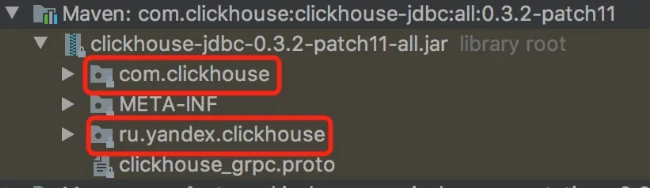
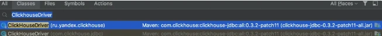
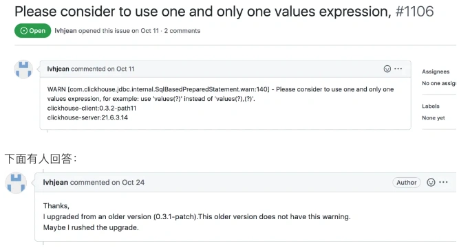

# 使用ClickHouse JDBC官方驱动，踩过的一些坑

## **<font style="color:rgb(34, 34, 34);background-color:rgb(248, 246, 244);">前言</font>**
<font style="color:rgb(51, 51, 51);background-color:rgb(248, 246, 244);">最近遇到一个ClickHouse的线上问题：Code: 242, e.displayText() = DB::Exception: Table is in readonly mode(zookeeper path:/clickhouse/tables/02/xxx) (version 21.12.4.1) (official build)</font>

<font style="color:rgb(51, 51, 51);background-color:rgb(248, 246, 244);">这个问题我在网上查原因说是由于Zookeeper压力过大，表变成只读状态，导致ClickHouse插入数据失败。</font>

<font style="color:rgb(51, 51, 51);background-color:rgb(248, 246, 244);">具体原因有两个：</font>

1. <font style="color:rgb(51, 51, 51);background-color:rgb(248, 246, 244);">写入数据频率过高。</font>
2. <font style="color:rgb(51, 51, 51);background-color:rgb(248, 246, 244);">Zookeeper中的集群节点挂掉。</font>

<font style="color:rgb(51, 51, 51);background-color:rgb(248, 246, 244);">而我们项目出现这个问题的原因是第一个：写入数据频率过高。</font>

<font style="color:rgb(51, 51, 51);background-color:rgb(248, 246, 244);">但是在网上搜资料的过程中，我又发现了另外一个问题：我们项目用了JDBC驱动Maven groupId ru.yandex.clickhouse，但ClickHouse官方并不推荐。</font>

<font style="color:rgb(51, 51, 51);background-color:rgb(248, 246, 244);">于是我果断的访问了ClickHouse的官网，通过它访问了ClickHouse的GitHub地址：</font>[<font style="color:rgb(51, 51, 51);background-color:rgb(248, 246, 244);">https://github.com/ClickHouse/clickhouse-jdbc。</font>](https://github.com/ClickHouse/clickhouse-jdbc%E3%80%82)

<font style="color:rgb(51, 51, 51);background-color:rgb(248, 246, 244);">证实了官网确实不建议使用ru.yandex.clickhouse驱动：而应该改成com.clickhouse驱动，并且推荐使用0.3.2以上的版本：于是，后面几天开始了ClickHouse的JDBC驱动升级之旅。踩了不少坑，拿出来跟大家一起分享一下，希望对你会有所帮助。</font>

## **<font style="color:rgb(34, 34, 34);background-color:rgb(248, 246, 244);">1. 第一次升级</font>**
<font style="color:rgb(51, 51, 51);background-color:rgb(248, 246, 244);">ClickHouse官方GitHub上面推荐使用的JDBC驱动是0.3.2以上的版本：于是，我果断把项目中的pom.xml文件中的groupId换成了com.clickhouse，版本换成了0.3.2。</font>

<font style="color:rgb(51, 51, 51);background-color:rgb(248, 246, 244);">刷新了一下maven，本地启动项目，能够正常运行。</font>

<font style="color:rgb(51, 51, 51);background-color:rgb(248, 246, 244);">然后在本地测试了一下业务功能，能够正常从ClickHouse中读取和写入数据。</font>

<font style="color:rgb(51, 51, 51);background-color:rgb(248, 246, 244);">心里不禁在想：这次升级实在太容易了。</font>

## **<font style="color:rgb(34, 34, 34);background-color:rgb(248, 246, 244);">2. 第二次升级</font>**
<font style="color:rgb(51, 51, 51);background-color:rgb(248, 246, 244);">后来，项目组的同事建议换成最新版本，说有更多新功能，并且性能有很大提升。</font>

<font style="color:rgb(51, 51, 51);background-color:rgb(248, 246, 244);">我听到性能有很大提升这几个字，就决定再升级试试。</font>

<font style="color:rgb(51, 51, 51);background-color:rgb(248, 246, 244);">于是，把版本升级成了0.3.2-patch11。</font>

<font style="color:rgb(51, 51, 51);background-color:rgb(248, 246, 244);">在本地再次测试，业务功能一切正常。</font>

<font style="color:rgb(51, 51, 51);background-color:rgb(248, 246, 244);">然后把项目部署到测试环境了。</font>

## **<font style="color:rgb(34, 34, 34);background-color:rgb(248, 246, 244);">3. 发现问题了</font>**
<font style="color:rgb(51, 51, 51);background-color:rgb(248, 246, 244);">第二天收到了两封sentry的报警邮件，报警级别都是warn。</font>

<font style="color:rgb(51, 51, 51);background-color:rgb(248, 246, 244);">第一封邮件中提示异常：This driver is DEPRECATED. Please use [com.clickhouse.jdbc.ClickHouseDriver] instead。</font>

<font style="color:rgb(51, 51, 51);background-color:rgb(248, 246, 244);">意思是说ru.yandex.clickhouse的驱动已经被废弃了，请使用com.clickhouse.jdbc.ClickHouseDriver驱动。</font>

<font style="color:rgb(51, 51, 51);background-color:rgb(248, 246, 244);">第二封邮件中提示异常：Also everything in package [ru.yandex.clickhouse] will be removed starting from 0.4.0。</font>

<font style="color:rgb(51, 51, 51);background-color:rgb(248, 246, 244);">意思是说ru.yandex.clickhouse将被移除。</font>

<font style="color:rgb(51, 51, 51);background-color:rgb(248, 246, 244);">看到这两封邮件，我当时有点懵，不就是用的com.clickhouse驱动包吗，ru.yandex.clickhouse是从哪里来的？</font>

<font style="color:rgb(51, 51, 51);background-color:rgb(248, 246, 244);">于是全局搜索了一下ru.yandex.clickhouse关键字，并没有搜到任何记录。</font>

<font style="color:rgb(51, 51, 51);background-color:rgb(248, 246, 244);">这让我更懵了。</font>

<font style="color:rgb(51, 51, 51);background-color:rgb(248, 246, 244);">接下来，我打开了clickhouse-jdbc-0.3.2-patch11-all.jar文件，</font>



<font style="color:rgb(51, 51, 51);background-color:rgb(248, 246, 244);">看到了让人意想不到的结果：这个jar包下面竟然有两个目录：com.clickhouse和ru.yandex.clickhouse，也就是说jar包中新驱动和老驱动两种都支持。</font>

<font style="color:rgb(51, 51, 51);background-color:rgb(248, 246, 244);">而且ClickhouseDriver类有两个：</font>



<font style="color:rgb(51, 51, 51);background-color:rgb(248, 246, 244);">我此时心里有十万个为什么：为什么不直接把ru.yandex.clickhouse包的代码删除了，却在日志文件中打印一些警告呢？</font>

<font style="color:rgb(51, 51, 51);background-color:rgb(248, 246, 244);">这实在太坑了吧。</font>

<font style="color:rgb(51, 51, 51);background-color:rgb(248, 246, 244);">也就是说升级驱动之后，项目依然用的老驱动的代码，我测试了个寂寞。。。</font>

## **<font style="color:rgb(34, 34, 34);background-color:rgb(248, 246, 244);">4. 如何使用新驱动？</font>**
<font style="color:rgb(51, 51, 51);background-color:rgb(248, 246, 244);">接下来我内心的OS是：既然ClickHouse官方驱动包，新老驱动都支持，必然有个开关控制是使用新的JDBC驱动，还是使用老的JDBC驱动。</font>

<font style="color:rgb(51, 51, 51);background-color:rgb(248, 246, 244);">从目前来看，如果没有调整开关，ClickHouse官方驱动包默认使用的是老的JDBC驱动。</font>

<font style="color:rgb(51, 51, 51);background-color:rgb(248, 246, 244);">接下来，最重要的问题是要搞清楚：如何使用新驱动？</font>

<font style="color:rgb(51, 51, 51);background-color:rgb(248, 246, 244);">很快，我查到通过配置下面的参数：</font>

```plain
spring.datasource.clickhouse.drive-class-name=com.clickhouse.jdbc.ClickHouseDriver
```

<font style="color:rgb(51, 51, 51);background-color:rgb(248, 246, 244);">就能指定Spring使用的JDBC驱动。</font>

<font style="color:rgb(51, 51, 51);background-color:rgb(248, 246, 244);">果然在application.properties文件中，配置数据源的地方，增加了这样一个配置，重启项目，Spring就是使用了新的ClickHouse JDBC驱动。</font>

<font style="color:rgb(51, 51, 51);background-color:rgb(248, 246, 244);">日志中没有打印邮件中那两个warn了。</font>

<font style="color:rgb(51, 51, 51);background-color:rgb(248, 246, 244);">此时，心里暗自窃喜，终于使用了ClickHouse官方推荐的JDBC驱动。</font>

<font style="color:rgb(51, 51, 51);background-color:rgb(248, 246, 244);">项目已经正常运行起来了，赶紧测试一下业务功能是否正常。</font>

## **<font style="color:rgb(34, 34, 34);background-color:rgb(248, 246, 244);">5. 出现了两个新问题</font>**
<font style="color:rgb(51, 51, 51);background-color:rgb(248, 246, 244);">结果马上被啪啪打脸了。</font>

<font style="color:rgb(51, 51, 51);background-color:rgb(248, 246, 244);">在测试批量insert数据的业务场景时，系统运行日志中出现了两个异常：</font>

<font style="color:rgb(51, 51, 51);background-color:rgb(248, 246, 244);">异常1：Code: 6. DB:Exception: Cannot prse string '2022-11-22 14:42:37.025' as DateTime:syntax error at position 19...从提示的信息看，它表示时间2022-11-22 14:42:37.025不能转换成DateTime类型。</font>

<font style="color:rgb(51, 51, 51);background-color:rgb(248, 246, 244);">异常2：Please consider to use one and only one values expression, for example: use 'values(?)' instead of 'values(?),(?).'从提示的信息看，它表示不支持批量insert数据。</font>

<font style="color:rgb(51, 51, 51);background-color:rgb(248, 246, 244);">我去。。。</font>

<font style="color:rgb(51, 51, 51);background-color:rgb(248, 246, 244);">升级ClickHouse JDBC驱动出问题了。</font>

<font style="color:rgb(51, 51, 51);background-color:rgb(248, 246, 244);">ClickHouse 官方最新的JDBC驱动竟然不支持批量insert数据，这个问题更严重。</font>

<font style="color:rgb(51, 51, 51);background-color:rgb(248, 246, 244);">赶紧搜索一下解决办法。</font>

## **<font style="color:rgb(34, 34, 34);background-color:rgb(248, 246, 244);">6. 回退版本</font>**
<font style="color:rgb(51, 51, 51);background-color:rgb(248, 246, 244);">很快，在clickhouse-jdbc的issues中查到了类似的问题，地址：</font>[<font style="color:rgb(51, 51, 51);background-color:rgb(248, 246, 244);">https://github.com/ClickHouse/clickhouse-jdbc/issues/1106。</font>](https://github.com/ClickHouse/clickhouse-jdbc/issues/1106%E3%80%82%E9%97%AE%E9%A2%98%E5%A6%82%E4%B8%8B%EF%BC%9A%E4%B8%8B%E9%9D%A2%E6%9C%89%E4%BA%BA%E5%9B%9E%E7%AD%94%EF%BC%9A%E4%BD%BF%E7%94%A8%E8%80%81%E7%89%88%E6%9C%AC%E5%B0%B1%E6%B2%A1%E6%9C%89%E8%BF%99%E4%B8%AA%E8%AD%A6%E5%91%8A%E3%80%82)

[<font style="color:rgb(51, 51, 51);background-color:rgb(248, 246, 244);">问题如下：下面有人回答：使用老版本就没有这个警告。</font>](https://github.com/ClickHouse/clickhouse-jdbc/issues/1106%E3%80%82%E9%97%AE%E9%A2%98%E5%A6%82%E4%B8%8B%EF%BC%9A%E4%B8%8B%E9%9D%A2%E6%9C%89%E4%BA%BA%E5%9B%9E%E7%AD%94%EF%BC%9A%E4%BD%BF%E7%94%A8%E8%80%81%E7%89%88%E6%9C%AC%E5%B0%B1%E6%B2%A1%E6%9C%89%E8%BF%99%E4%B8%AA%E8%AD%A6%E5%91%8A%E3%80%82)



<font style="color:rgb(51, 51, 51);background-color:rgb(248, 246, 244);">我一下子如梦初醒。</font>

<font style="color:rgb(51, 51, 51);background-color:rgb(248, 246, 244);">不要迷恋最新的版本，clickhouse-jdbc一定要找最合适的版本。</font>

<font style="color:rgb(51, 51, 51);background-color:rgb(248, 246, 244);">于是，我查了dev、st和ga环境的ClickHouse服务器版本，发现dev用的是20.12.8.5，而st和ga用的21.12.4.1。</font>

<font style="color:rgb(51, 51, 51);background-color:rgb(248, 246, 244);">为了兼容dev环境，ClickHouse服务器版本以20+为准，再看看clickhouse-jdbc能用什么版本。</font>

<font style="color:rgb(51, 51, 51);background-color:rgb(248, 246, 244);">很快在releases中查到，clickhouse-jdbc能用0.3.2，最高只能0.3.2-patch1。因为0.3.2-patch2以上，要求ClickHouse服务器是21+的版本。</font>

<font style="color:rgb(51, 51, 51);background-color:rgb(248, 246, 244);">因此，我只能将clickhouse-jdbc的版本回退到：0.3.2-patch1。</font>

<font style="color:rgb(51, 51, 51);background-color:rgb(248, 246, 244);">果然，回退版本之后，不能批量insert的问题解决了。</font>

<font style="color:rgb(51, 51, 51);background-color:rgb(248, 246, 244);">接下来，就是一个问题。</font>

## **<font style="color:rgb(34, 34, 34);background-color:rgb(248, 246, 244);">7. DateTime</font>**
<font style="color:rgb(51, 51, 51);background-color:rgb(248, 246, 244);">让我们一起回顾一下那个问题：Code: 6. DB:Exception: Cannot prse string '2022-11-22 14:42:37.025' as DateTime:syntax error at position 19...从提示的信息看，它表示时间2022-11-22 14:42:37.025不能转换成DateTime类型。</font>

<font style="color:rgb(51, 51, 51);background-color:rgb(248, 246, 244);">而DateTime的时间格式是：yyyy-MM-dd HH:mm:ss，这个问题是由于2022-11-22 14:42:37.025包含了毫秒，不能直接转换成2022-11-22 14:42:37导致的。</font>

<font style="color:rgb(51, 51, 51);background-color:rgb(248, 246, 244);">我查了一下代码和表结构，代码中Entity中time字段定义成的Date类型。</font>

<font style="color:rgb(51, 51, 51);background-color:rgb(248, 246, 244);">而表中定义的time字段是DateTime类型。</font>

<font style="color:rgb(51, 51, 51);background-color:rgb(248, 246, 244);">ClickHouse官方驱动无法将Date类型的时间直接转换成DateTime类型。</font>

<font style="color:rgb(51, 51, 51);background-color:rgb(248, 246, 244);">怎么解决这个问题呢？</font>

<font style="color:rgb(51, 51, 51);background-color:rgb(248, 246, 244);">答：修改表中的字段类型不就行了，将DateTime转换成DateTime64，DateTime64是支持毫秒的。</font>

<font style="color:rgb(51, 51, 51);background-color:rgb(248, 246, 244);">我亲测过，使用DateTime64类型接收Java中Date类型的时间，能够正常解析。</font>

<font style="color:rgb(51, 51, 51);background-color:rgb(248, 246, 244);">那张表有三个DateTime类型的字段：create_time、edit_time和time。</font>

<font style="color:rgb(51, 51, 51);background-color:rgb(248, 246, 244);">前面两个字段的字段类型，很容易就修改成功了。</font>

<font style="color:rgb(51, 51, 51);background-color:rgb(248, 246, 244);">但修改time字段时，却报了一个异常：Code: 524,e.displayText() = DB::Exception: Alter of key column time from type DateTime to type DateTime64(3) must be metadata-only (20.12.8.5)</font>

<font style="color:rgb(51, 51, 51);background-color:rgb(248, 246, 244);">提示作为key的字段不能被修改。</font>

<font style="color:rgb(51, 51, 51);background-color:rgb(248, 246, 244);">这又是为什么？</font>

## **<font style="color:rgb(34, 34, 34);background-color:rgb(248, 246, 244);">8. order by</font>**
<font style="color:rgb(51, 51, 51);background-color:rgb(248, 246, 244);">我这一次直接查看了那张表的建表语句：</font>

```sql
show create table test;
```

<font style="color:rgb(51, 51, 51);background-color:rgb(248, 246, 244);">发现该表处理主键和普通索引之外，还特别加了order by的索引。</font>

<font style="color:rgb(51, 51, 51);background-color:rgb(248, 246, 244);">例如：order by (code, time)。</font>

<font style="color:rgb(51, 51, 51);background-color:rgb(248, 246, 244);">看到这里我迅速明白了，原来time字段是order by的索引字段，难怪不允许随便修改的。</font>

<font style="color:rgb(51, 51, 51);background-color:rgb(248, 246, 244);">于是，找DBA商讨对策。</font>

<font style="color:rgb(51, 51, 51);background-color:rgb(248, 246, 244);">DBA说要修改ClickHouse中表的索引字段的类型，只能重新建表，然后把数据同步过去。</font>

<font style="color:rgb(51, 51, 51);background-color:rgb(248, 246, 244);">很显然这个方案太麻烦了。</font>

<font style="color:rgb(51, 51, 51);background-color:rgb(248, 246, 244);">我在想有没有其他更简单的方案呢？</font>

## **<font style="color:rgb(34, 34, 34);background-color:rgb(248, 246, 244);">9. date_time_input_format参数</font>**
<font style="color:rgb(51, 51, 51);background-color:rgb(248, 246, 244);">我此时在思考，不就是时间转换出的问题吗？</font>

<font style="color:rgb(51, 51, 51);background-color:rgb(248, 246, 244);">让ClickHouse在保存数据时，自动转换一个时间格式不就解决问题了吗？</font>

<font style="color:rgb(51, 51, 51);background-color:rgb(248, 246, 244);">我在官网上查到一个叫：date_time_input_format的参数。</font>

<font style="color:rgb(51, 51, 51);background-color:rgb(248, 246, 244);">该参数允许选择日期和时间的文本表示的解析器。</font>

<font style="color:rgb(51, 51, 51);background-color:rgb(248, 246, 244);">它可能的值:</font>

+ <font style="color:rgb(51, 51, 51);background-color:rgb(248, 246, 244);">'best_effort' — Enables extended parsing.</font>

<font style="color:rgb(51, 51, 51);background-color:rgb(248, 246, 244);">ClickHouse可以解析基本 YYYY-MM-DD HH:MM:SS 格式和所有 ISO 8601 日期和时间格式。例如, '2018-06-08T01:02:03.000Z'.</font>

+ <font style="color:rgb(51, 51, 51);background-color:rgb(248, 246, 244);">'basic' — Use basic parser.</font>

<font style="color:rgb(51, 51, 51);background-color:rgb(248, 246, 244);">ClickHouse只能解析基本的 YYYY-MM-DD HH:MM:SS 格式。例如, '2019-08-20 10:18:56'.</font>

<font style="color:rgb(51, 51, 51);background-color:rgb(248, 246, 244);">默认值: 'basic'.</font>

<font style="color:rgb(51, 51, 51);background-color:rgb(248, 246, 244);">原来这个是时间转换失败的根源，如果我们把date_time_input_format的值设置成best_effort，不就解决问题了。</font>

<font style="color:rgb(51, 51, 51);background-color:rgb(248, 246, 244);">为了不影响全局，我想只给那三张表调整date_time_input_format的值。</font>

<font style="color:rgb(51, 51, 51);background-color:rgb(248, 246, 244);">但是在保存设置时，报错了。</font>

<font style="color:rgb(51, 51, 51);background-color:rgb(248, 246, 244);">原来date_time_input_format参数只允许在MergeTree存储引擎上使用，而我们表的存储引擎用的ReplacingMergeTree。</font>

<font style="color:rgb(51, 51, 51);background-color:rgb(248, 246, 244);">晕死了。。。</font>

<font style="color:rgb(51, 51, 51);background-color:rgb(248, 246, 244);">只能想想其他办法了。</font>

## **<font style="color:rgb(34, 34, 34);background-color:rgb(248, 246, 244);">10. parseDateTimeBestEffortOrNull</font>**
<font style="color:rgb(51, 51, 51);background-color:rgb(248, 246, 244);">在insert数据的地方，用函数手动转换一下不就OK了吗？</font>

<font style="color:rgb(51, 51, 51);background-color:rgb(248, 246, 244);">当然修改Java的Entity中的Date类型，改成String也是可以的，不过review了一下代码，这种改动有点大，涉及的地方很多。</font>

<font style="color:rgb(51, 51, 51);background-color:rgb(248, 246, 244);">最小的改动是在mapper层处理，因为一个mapper中最多只有一个insert存在。</font>

<font style="color:rgb(51, 51, 51);background-color:rgb(248, 246, 244);">而我review了所有的ClickHouse表，只有3张表用了DateTime类型，其他的表都是DateTime64类型。</font>

<font style="color:rgb(51, 51, 51);background-color:rgb(248, 246, 244);">刚开始，我在ClickHouse的官方文档中查到了formatDateTime函数，测试之后发现该函数不太合适。</font>

<font style="color:rgb(51, 51, 51);background-color:rgb(248, 246, 244);">后来找到了parseDateTimeBestEffort系列函数，决定使用parseDateTimeBestEffortOrNull函数。</font>

<font style="color:rgb(51, 51, 51);background-color:rgb(248, 246, 244);">只需在mapper.xml的insert语句中，使用parseDateTimeBestEffortOrNull(#{item.time})改造一下即可。</font>

<font style="color:rgb(51, 51, 51);background-color:rgb(248, 246, 244);">测试后发现，时间转换问题被解决了。</font>

<font style="color:rgb(51, 51, 51);background-color:rgb(248, 246, 244);">后来，有条select语句中又出现了这个异常。</font>

<font style="color:rgb(51, 51, 51);background-color:rgb(248, 246, 244);">我刚开始以为是toDate(time)函数导致的，但后面发现该select的where条件中使用了time字段作为查询条件，才导致了该问题的发生。</font>

<font style="color:rgb(51, 51, 51);background-color:rgb(248, 246, 244);">这时同样使用parseDateTimeBestEffortOrNull函数，解决了问题。</font>

<font style="color:rgb(51, 51, 51);background-color:rgb(248, 246, 244);">至此，ClickHouse的JDBC驱动包升级完成，没有再出现其他的问题。</font>

<font style="color:rgb(100, 100, 100);background-color:rgb(248, 246, 244);">需要特别注意的是：以后新创建的表或新加的字段，如果有时间类型的字段，务必要定义成DateTime64类型的。</font>

<font style="color:rgb(51, 51, 51);background-color:rgb(248, 246, 244);">其实，我们在使用ClickHouse的过程中，同样也遇到过很多坑，文章开头的那个问题只是其中一个，后面会有一篇专题文章分享给大家，敬请期待。</font>


> 更新: 2024-09-05 11:03:48  
> 原文: <https://www.yuque.com/yuqueyonghue6cvnv/cxhfwd/bzkfpwxdiopg6u5t>