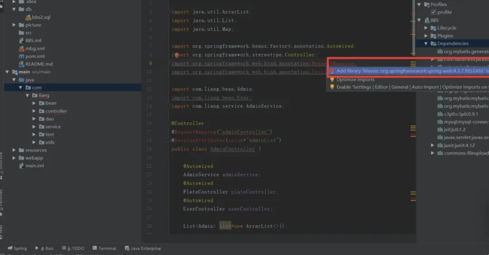
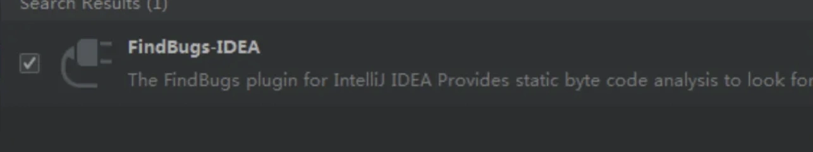
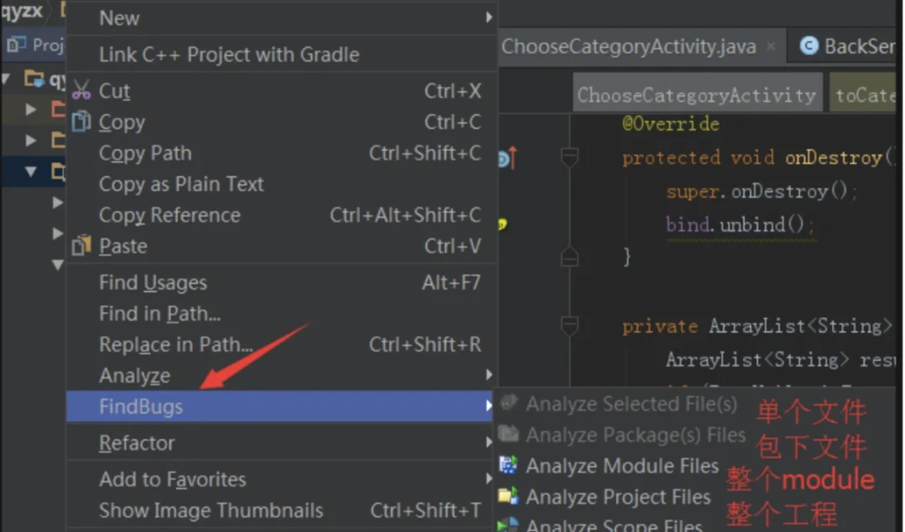
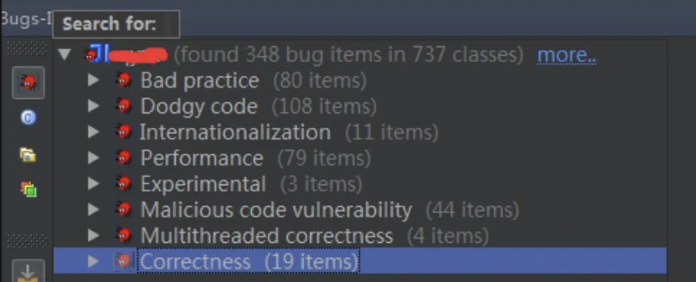
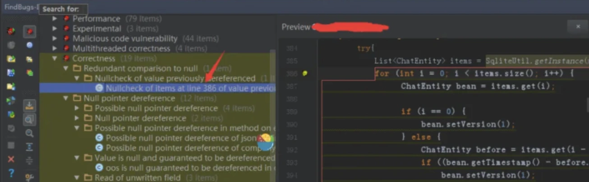
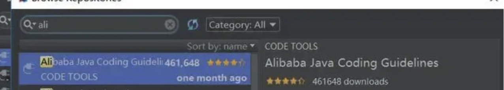
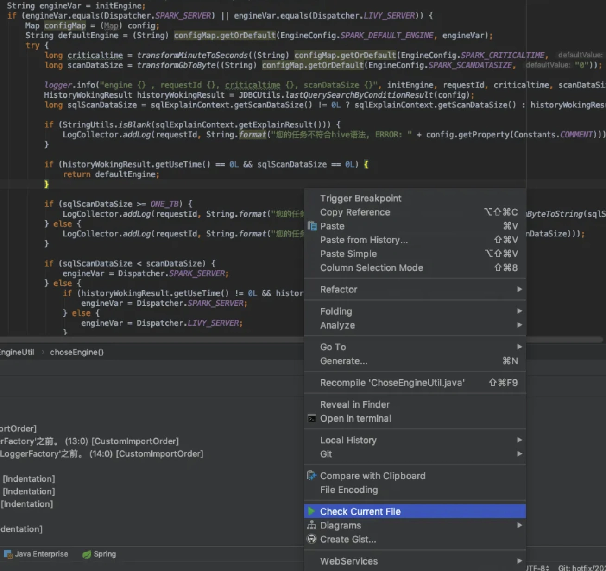
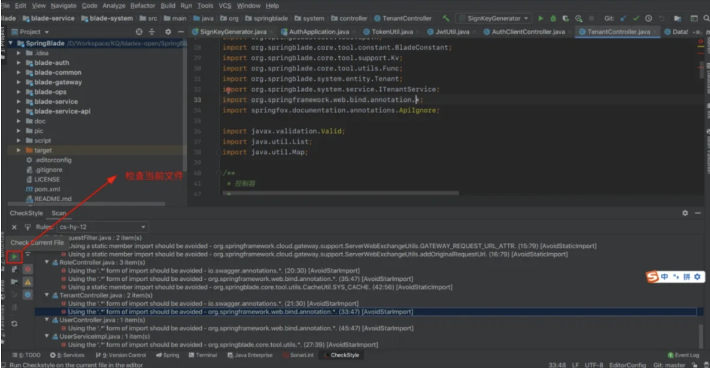
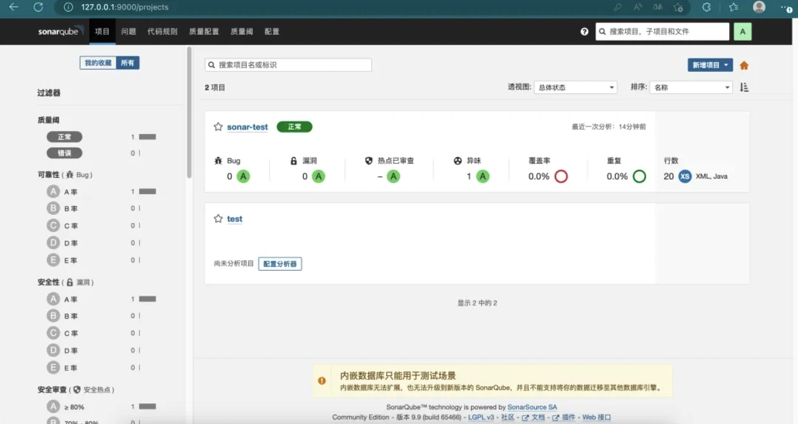
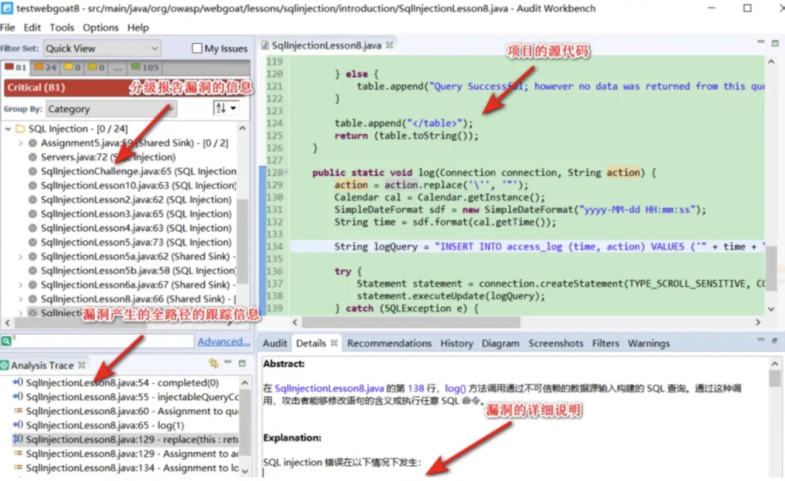

# 日常开发中BUG太多问题

对于大部分程序员来说，主要的工作时间是在开发和修复BUG。

有可能修改了一个BUG，会导致几个新BUG的产生，不断循环。

那么，有没有办法能够减少BUG，保证代码质量，提升工作效率？

答案是肯定的。

如果能做到，我们多出来的时间，多摸点鱼，做点自己喜欢的事情，不香吗？

这篇文章跟大家一起聊聊减少代码BUG的10个小技巧，希望对你会有所帮助。

## **1 找个好用的开发工具**
在日常工作中，找一款好用的开发工具，对于开发人员来说非常重要。

不光可以提升开发效率，更重要的是它可以帮助我们减少BUG。

有些好的开发工具，比如：idea中，对于包没有引入，会在相关的类上面标红。

并且idea还有自动补全的功能，可以有效减少我们在日常开发的过程中，有些单词手动输入的时候敲错的情况发生。

## **2 引入Findbugs插件**
Findbugs是一款Java静态代码分析工具，它专注于寻找真正的缺陷或者潜在的性能问题，它可以帮助java工程师提高代码质量以及排除隐含的缺陷。

Findbugs运用Apache BCEL 库分析类文件，而不是源代码，将字节码与一组缺陷模式进行对比以发现可能的问题。

可以直接在idea中安装FindBugs插件：

之后可以选择分析哪些代码：

分析结果：

点击对应的问题项，可以找到具体的代码行，进行修复。

Findbugs的检测器已增至300多条，被分为不同的类型，常见的类型如下：

+ Correctness：这种归类下的问题在某种情况下会导致bug，比如错误的强制类型转换等。
+ Bad practice：这种类别下的代码违反了公认的最佳实践标准，比如某个类实现了equals方法但未实现hashCode方法等。
+ Multithreaded correctness：关注于同步和多线程问题。
+ Performance：潜在的性能问题。
+ Security：安全相关。
+ Dodgy：Findbugs团队认为该类型下的问题代码导致bug的可能性很高。

## **3 引入CheckStyle插件**
CheckStyle作为检验代码规范的插件，除了可以使用配置默认给定的开发规范，如Sun、Google的开发规范之外，还可以使用像阿里的开发规范的插件。

目前国内用的比较多的是阿里的代码开发规范，我们可以直接通过idea下载插件：

如果想检测某个文件：

可以看到结果：

阿里巴巴规约扫描包括：

1. OOP规约
2. 并发处理
3. 控制语句
4. 命名规约
5. 常量定义
6. 注释规范

Alibaba Java Coding Guidelines 专注于Java代码规范，目的是让开发者更加方便、快速规范代码格式。

该插件在扫描代码后，将不符合规约的代码按 Blocker、Critical、Major 三个等级显示出来，并且大部分可以自动修复。

它还基于Inspection机制提供了实时检测功能，编写代码的同时也能快速发现问题。

## **4 用SonarQube扫描代码**
SonarQube是一种自动代码审查工具，用于检测代码中的错误，漏洞和代码格式上的问题。

它可以与用户现有的工作流程集成，以实现跨项目分支和提取请求的连续代码检查，同时也提供了可视化的管理页面，用于查看检测出的结果。

SonarQube通过配置的代码分析规则，从可靠性、安全性、可维护性、覆盖率、重复率等方面分析项目，风险等级从A~E划分为5个等级；

同时，SonarQube可以集成pmd、findbugs、checkstyle等插件来扩展使用其他规则来检验代码质量。

一般推荐它跟Jenkins集成，做成每天定时扫描项目中test分支中的代码问题。

## **5 用Fortify扫描代码**
Fortify 是一款广泛使用的静态应用程序安全测试（SAST）工具。

它具有代码扫描、漏斗扫描和渗透测试等功能。它的设计目的是有效地检测和定位源代码中的漏洞。

它能帮助开发人员识别和修复代码中的安全漏洞。

Fortify的主要功能：

+ 静态代码分析：它会对源代码进行静态分析，找出可能导致安全漏洞的代码片段。它能识别多种类型的安全漏洞，如 SQL 注入、跨站脚本（XSS）、缓冲区溢出等。
+ 数据流分析：它不仅分析单个代码文件，还跟踪应用程序的数据流。这有助于找到更复杂的漏洞，如未经验证的用户输入在应用程序中的传播路径。
+ 漏洞修复建议：发现潜在的安全漏洞时，它会为开发人员提供修复建议。
+ 集成支持：它可以与多种持续集成（CI）工具（如 Jenkins）和应用生命周期管理（ALM）工具（如 Jira）集成，实现自动化的代码扫描和漏洞跟踪。
+ 报告和度量：它提供了丰富的报告功能，帮助团队了解项目的安全状况和漏洞趋势。

使用Fortify扫描代码的结果：

一般推荐它跟Jenkins集成，定期扫描项目中test分支中的代码安全问题。

## **6 写单元测试**
有些小伙伴可能会问：写单元测试可以减少代码的BUG？

答案是肯定的。

我之前有同事，使用的测试驱动开发模式，开发一个功能模块之前，先把单元测试写好，然后再真正的开发业务代码。

后面发现他写的代码速度很快，而且代码质量很高，是一个开发牛人。

如果你后期要做系统的代码重构，你只是重写了相关的业务代码，但业务逻辑并没有修改。

这时，因为有了之前写好的单位测试，你会发现测试起来非常方便。

可以帮你减少很多BUG。

## **7 功能自测**
功能自测，是程序员的基本要求。

但有些程序员自测之后，BUG还是比较多，而有些程序员自测之后，BUG非常少，这是什么原因呢？

可能有些人比较粗心，有些人比较细心。

其实更重要的是测试的策略。

有些人喜欢把所有相关的功能都开发完，然后一起测试。

这种情况下，相当于一个黑盒测试，需要花费大量的时间，梳理业务逻辑才能测试完整，大部分情况下，开发人员是没法测试完整的，可能会有很多bug测试不出来。

这种做法是没有经过单元测试，直接进行了集成测试。

看似节省了很多单元测试的时间，但其实后面修复BUG的时间可能会花费更多。

比较推荐的自测方式是：一步一个脚印。

比如：你写了一个工具类的一个方法，就测试一下。如果这个方法中，调用了另外一个关键方法，我们可以先测试一下这个关键方法。

这样可以写出BUG更少的代码。

## **8 自动化测试**
有些公司引入了自动化测试的功能。

有专门的程序，每天都会自动测试，保证系统的核心流程没有问题。

因为我们的日常开发中，经常需要调整核心流程的代码。

不可能每调整一次，都需要把所有的核心流程都测试一遍吧，这样会浪费大量的时间，而且也容易遗漏一些细节。

如果引入了自动化测试的功能，可以帮助我们把核心流程都测试一下。

避免代码重构，或者修改核心流程，测试时间不够，或者测试不完全的尴尬。

自动化测试，可以有效的减少核心流程调整，或者代码重构中的BUG。

## **9 代码review**
很多公司都有代码review机制。

我之前也参与多次代码review的会议，发现代码review确实可以找出很多BUG。

比如：一些代码的逻辑错误，语法的问题，不规范的命名等。

这样问题通过组内的代码review一般可以检查出来。

有些国外的大厂，采用结对编程的模式。

同一个组的两个人A和B一起开发，开发完之后，A reivew B的代码，同时B review A的代码。

因为同组的A和B对项目比较熟，对对方开发的功能更有了解，可以快速找出对外代码中的一些问题。

能够有效减少一些BUG。

## **10 多看别人的踩坑分享**
如果你想减少日常工作中的代码BUG，或者线上事故，少犯错，少踩坑。

经常看别人真实的踩坑分享，是一个非常不错的选择，可以学到一些别人的工作经验，帮助你少走很多弯路。

网上有许多博主写过自己的踩坑记录，大家可以上网搜一下。

也可以看看我自己总结的《[程序员最常见的100个问题](https://mp.weixin.qq.com/s?__biz=MzkwNjMwMTgzMQ==&mid=2247516100&idx=1&sn=d458cae6bded3d7c449246a7f5f0b3e3&chksm=c0e8672cf79fee3a6cfb02837172f9ed921cf0e426878b42cc669fa4cd396c644ba4dc4d44be&scene=21#wechat_redirect)》，里面有非常详细的记录，干货很多，还是非常值得一看的。

最后说一句，本文总结了10种减少代码BUG的小技巧，但我们要根据实际情况选择使用，并非所有的场景都适合。

> 更新: 2024-10-08 10:57:51  
> 原文: <https://www.yuque.com/yuqueyonghue6cvnv/cxhfwd/giil8g9r24gezngh>