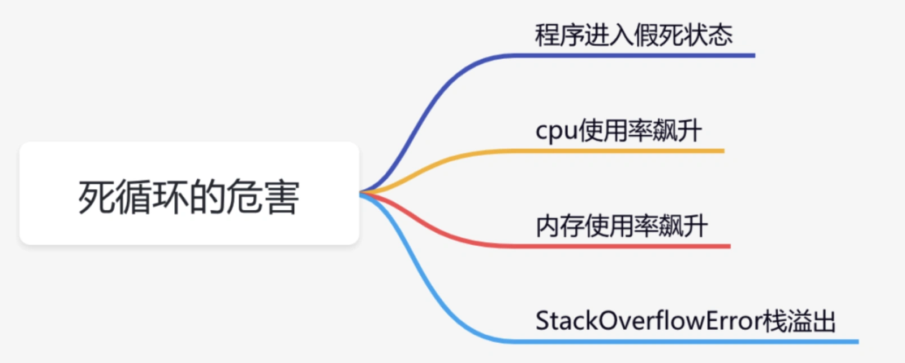
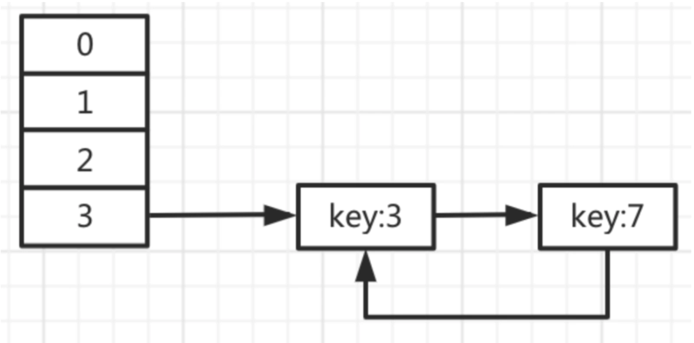
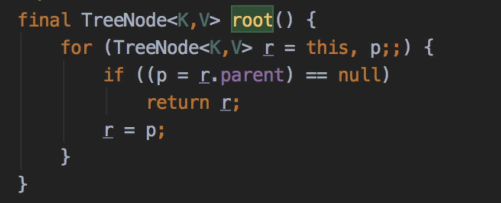
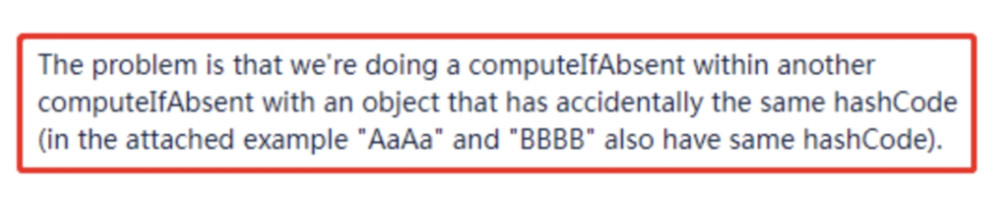

# 死循环问题

# **<font style="color:rgb(34, 34, 34);background-color:rgb(248, 246, 244);">前言</font>**
<font style="color:rgb(51, 51, 51);background-color:rgb(248, 246, 244);">代码死循环这个话题，个人觉得还是挺有趣的。因为只要是开发人员，必定会踩过这个坑。如果真的没踩过，只能说明你代码写少了，或者是真正的大神。</font>

<font style="color:rgb(51, 51, 51);background-color:rgb(248, 246, 244);">尽管很多时候，我们在极力避免这类问题的发生，但有时候，死循环却悄咪咪的就来了，坑你于无形之中。如果你读完这篇文章，也许会对代码死循环问题有一些新的认识，学到一些非常实用的经验，少走一些弯路。</font>

# **<font style="color:rgb(34, 34, 34);background-color:rgb(248, 246, 244);">死循环的危害</font>**
<font style="color:rgb(51, 51, 51);background-color:rgb(248, 246, 244);">让我们一起先来了解一下，代码死循环到底有哪些危害？</font>



+ <font style="color:rgb(51, 51, 51);background-color:rgb(248, 246, 244);">程序进入假死状态： 当某个请求导致的死循环，该请求将会在很大的一段时间内，都无法获取接口的返回，程序好像进入假死状态一样。</font>
+ <font style="color:rgb(51, 51, 51);background-color:rgb(248, 246, 244);">cpu使用率飙升：代码出现死循环后，由于没有休眠，一直不断抢占cpu资源，导致cpu长时间处于繁忙状态，必定会使cpu使用率飙升。</font>
+ <font style="color:rgb(51, 51, 51);background-color:rgb(248, 246, 244);">内存使用率飙升：如果代码出现死循环时，循环体内有大量创建对象的逻辑，垃圾回收器无法及时回收，会导致内存使用率飙升。同时，如果垃圾回收器频繁回收对象，也会造成cpu使用率飙升问题。</font>
+ <font style="color:rgb(51, 51, 51);background-color:rgb(248, 246, 244);">StackOverflowError：在一些递归调用的场景，如果出现无限递归，最终会报StackOverflowError栈溢出，导致程序直接挂掉。</font>

# **<font style="color:rgb(34, 34, 34);background-color:rgb(248, 246, 244);">哪些场景会产生死循环？</font>**
## **<font style="color:rgb(34, 34, 34);background-color:rgb(248, 246, 244);">1.一般循环遍历</font>**
<font style="color:rgb(51, 51, 51);background-color:rgb(248, 246, 244);">这里说的一般循环遍历主要是指：</font>

+ <font style="color:rgb(51, 51, 51);background-color:rgb(248, 246, 244);">for语句</font>
+ <font style="color:rgb(51, 51, 51);background-color:rgb(248, 246, 244);">foreach语句</font>
+ <font style="color:rgb(51, 51, 51);background-color:rgb(248, 246, 244);">while语句</font>

<font style="color:rgb(51, 51, 51);background-color:rgb(248, 246, 244);">这三种循环语句可能是我们平常使用最多的循环语句了，但是如果没有用好，也是最容易出现死循环的问题的地方。让我们一起看看，哪些情况会出现死循环。</font>

### **<font style="color:rgb(34, 34, 34);background-color:rgb(248, 246, 244);">1.1 条件恒等</font>**
<font style="color:rgb(51, 51, 51);background-color:rgb(248, 246, 244);">很多时候我们使用for语句循环遍历，不满足指定条件，程序会自动退出循环，比如：</font>

```plain
for(int i=0; i<10; i++) {
   System.out.println(i);
}
```

<font style="color:rgb(51, 51, 51);background-color:rgb(248, 246, 244);">但是，如果不小心把条件写错了，变成这样的：</font>

```plain
for(int i=0; i>=0; i++) {
   System.out.println(i);
}
```

<font style="color:rgb(51, 51, 51);background-color:rgb(248, 246, 244);">结果就悲剧了，必定会出现死循环，因为循环中的条件变成恒等的了。</font>

<font style="color:rgb(51, 51, 51);background-color:rgb(248, 246, 244);">很多朋友看到这里，心想这种错误我肯定不会犯的。不过我需要特别说明的是，这里举的例子相对来说比较简单，如果i>10这里是个非常复杂的计算，还真说不准一定不会出现死循环。</font>

### **<font style="color:rgb(34, 34, 34);background-color:rgb(248, 246, 244);">1.2 不正确的continue</font>**
<font style="color:rgb(51, 51, 51);background-color:rgb(248, 246, 244);">for语句在循环遍历数组和list时更方便，而while语句的使用场景却更多。</font>

<font style="color:rgb(51, 51, 51);background-color:rgb(248, 246, 244);">有时候，在使用while语句遍历数据时，如果遇到特别的条件，需要用continue关键字跳过本次循环，直接执行下次循环。</font>

<font style="color:rgb(51, 51, 51);background-color:rgb(248, 246, 244);">例如：</font>

```plain
int count = 0;
while(count < 10) {
   count++;
   if(count == 4) {
      continue;
   }
   System.out.println(count);
}
```

<font style="color:rgb(51, 51, 51);background-color:rgb(248, 246, 244);">当count等于4时，不打印count。</font>

<font style="color:rgb(51, 51, 51);background-color:rgb(248, 246, 244);">但如果continue没有被正确使用，可能会出现莫名奇怪的问题：</font>

```plain
int count = 0;
while(count < 10) {
   if(count == 4) {
      continue;
   }
   System.out.println(count);
   count++;
}
```

<font style="color:rgb(51, 51, 51);background-color:rgb(248, 246, 244);">当count等于4时直接推出本次循环，count没有加1，而直接进入下次循环，下次循环时count依然等4，最后无限循环了。</font>

<font style="color:rgb(51, 51, 51);background-color:rgb(248, 246, 244);">这种是我们要千万小心的场景，说不定，已经进入了死循环你还不知道呢。</font>

### **<font style="color:rgb(34, 34, 34);background-color:rgb(248, 246, 244);">1.3 flag线程间不可见</font>**
<font style="color:rgb(51, 51, 51);background-color:rgb(248, 246, 244);">有时候我们的代码需要一直做某件事情，直到某个条件达到时，有个状态告诉它，要终止任务了，它就会自动退出。</font>

<font style="color:rgb(51, 51, 51);background-color:rgb(248, 246, 244);">这时候，很多人都会想到用while(flag)实现这个功能：</font>

```java
public class FlagTest {
    private boolean flag = true;

    public void setFlag(boolean flag) {
        this.flag = flag;
    }

    public void fun() {
        while (flag) {
        }
        System.out.println("done");
    }

    public static void main(String[] args) throws InterruptedException {
        final FlagTest flagTest = new FlagTest();
        new Thread(() -> flagTest.fun()).start();
        Thread.sleep(200);
        flagTest.setFlag(false);
    }
}
```

<font style="color:rgb(51, 51, 51);background-color:rgb(248, 246, 244);">这段代码在子线程中执行无限循环，当主线程休眠200毫秒后，将flag变成false，这时子线程就会自动退出了。想法是好的，但是实际上这段代码会进入死循环，不会因为flag变成false而自动退出。</font>

<font style="color:rgb(51, 51, 51);background-color:rgb(248, 246, 244);">为什么会这样？</font>

<font style="color:rgb(51, 51, 51);background-color:rgb(248, 246, 244);">线程间flag是不可见的。</font>

<font style="color:rgb(51, 51, 51);background-color:rgb(248, 246, 244);">这时如果flag加上了volatile关键字：</font>

```java
private volatile boolean flag = true;
```

<font style="color:rgb(51, 51, 51);background-color:rgb(248, 246, 244);">会强制把共享内存中的值刷新到主内存中，让多个线程间可见，程序可以正常退出。</font>

## **<font style="color:rgb(34, 34, 34);background-color:rgb(248, 246, 244);">2.Iterator遍历</font>**
<font style="color:rgb(51, 51, 51);background-color:rgb(248, 246, 244);">除了前面介绍过的一般循环遍历之外，遍历集合的元素，还可以使用Iterator遍历。当然并非所有集合都能使用Iterator遍历，只有实现了Iterator接口的集合，或者该集合的内部类实现了Iterator接口才可以。</font>

<font style="color:rgb(51, 51, 51);background-color:rgb(248, 246, 244);">例如：</font>

```csharp
public class IteratorTest {
    public static void main(String[] args) {
        List<String> list = new ArrayList<>();
        list.add("123");
        list.add("456");
        list.add("789");

        Iterator<String> iterator = list.iterator();
        while(iterator.hasNext()) {
            System.out.println(iterator.next());
        }
    }
}
```

<font style="color:rgb(51, 51, 51);background-color:rgb(248, 246, 244);">但如果程序改成这样：</font>

```csharp
public class IteratorTest {
    public static void main(String[] args) {
        List<String> list = new ArrayList<>();
        list.add("123");
        list.add("456");
        list.add("789");

        while(list.iterator().hasNext()) {
            System.out.println(list.iterator().next());
        }
    }
}
```

<font style="color:rgb(51, 51, 51);background-color:rgb(248, 246, 244);">就会出现死循环。</font>

<font style="color:rgb(51, 51, 51);background-color:rgb(248, 246, 244);">这又是为什么呢？</font>

<font style="color:rgb(51, 51, 51);background-color:rgb(248, 246, 244);">如果看过ArrayList源码的朋友，会发现它的底层iterator方法是这样的实现的：</font>

```csharp
public Iterator<E> iterator() {
    return new Itr();
}
```

<font style="color:rgb(51, 51, 51);background-color:rgb(248, 246, 244);">每次都new了一个新的Itr对象。而hasNext方法的底层是通过判断游标和元素个数是否相等实现的：</font>

```typescript
public boolean hasNext() {
    return cursor != size;
}
```

<font style="color:rgb(51, 51, 51);background-color:rgb(248, 246, 244);">每次new了一个新的Itr对象的时候cursor值是默认值0，肯定和元素个数不相等。所以导致while语句中的条件一直都成立，所以才会出现死循环。</font>

<font style="color:rgb(100, 100, 100);background-color:rgb(248, 246, 244);">❝</font>

<font style="color:rgb(100, 100, 100);background-color:rgb(248, 246, 244);">我们都需要注意：在while循环中使用list.iterator().hasNext()，是个非常大的坑，千万小心。</font>

## **<font style="color:rgb(34, 34, 34);background-color:rgb(248, 246, 244);">3.类中使用自己的对象</font>**
<font style="color:rgb(51, 51, 51);background-color:rgb(248, 246, 244);">有时候，在某个类中把自己的对象定义成成员变量，不知道你有没有这样做过。</font>

<font style="color:rgb(51, 51, 51);background-color:rgb(248, 246, 244);">有些可能会很诧异，为什么要这么做。</font>

<font style="color:rgb(51, 51, 51);background-color:rgb(248, 246, 244);">假如，你需要在一个方法中调用另一个打了@Transactional注解的方法，这时如果直接方法调用，另外一个方法由于无法走代理事务会失效。比如：</font>

```typescript
@Service
public class ServiceA {

   public void save(User user) {
         System.out.println("业务处理");
         doSave(user);
   }

   @Transactional(rollbackFor=Exception.class)
   public void doSave(User user) {
       System.out.println("保存数据");
    }
 }
```

<font style="color:rgb(51, 51, 51);background-color:rgb(248, 246, 244);">这种场景事务会失效。</font>

<font style="color:rgb(51, 51, 51);background-color:rgb(248, 246, 244);">这时可以通过把该类自己定义成一个成员变量，通过该变量调用doSave方法就能有效的避免该问题。</font>

```typescript
@Service
public class ServiceA {
   @Autowired
   private ServiceA serviceA;
   
   public void save(User user) {
         System.out.println("业务处理");
         serviceA.doSave(user);
   }

   @Transactional(rollbackFor=Exception.class)
   public void doSave(User user) {
       System.out.println("保存数据");
    }
 }
```

<font style="color:rgb(51, 51, 51);background-color:rgb(248, 246, 244);">当然还有其他办法解决这个问题，不过这种方法是最简单的。</font>

<font style="color:rgb(51, 51, 51);background-color:rgb(248, 246, 244);">那么问题来了，如果成员变量不是通过@Autowired注入，而是直接new出来的，可以吗？</font>

<font style="color:rgb(51, 51, 51);background-color:rgb(248, 246, 244);">成员变量改成这样之后：</font>

```java
private ServiceA serviceA = new ServiceA();
```

<font style="color:rgb(51, 51, 51);background-color:rgb(248, 246, 244);">项目重新启动，程序进入无限循环。不断创建ServiceA对象，但一直都无法成功，最后会报java.lang.StackOverflowError栈溢出。当栈深度超过虚拟机分配给线程的栈大小时就会出现此错误。</font>

<font style="color:rgb(51, 51, 51);background-color:rgb(248, 246, 244);">为什么会出现这个问题？</font>

<font style="color:rgb(51, 51, 51);background-color:rgb(248, 246, 244);">因为程序在实例化ServiceA对象时，要先实例化它的成员变量serviceA，但是它的成员变量serviceA，又需要实例化它自己的成员变量serviceA，如此一层层实例化下去，最终也没能实例化。</font>

<font style="color:rgb(51, 51, 51);background-color:rgb(248, 246, 244);">而@Autowired注入为什么没有问题？</font>

<font style="color:rgb(51, 51, 51);background-color:rgb(248, 246, 244);">因为@Autowired是在ServiceA对象实例化成功之后，在依赖注入阶段，把实例注入到成员变量serviceA的。在spring中使用了三级缓存，通过提前暴露ObjectFactory对象来解决这个自己依赖自己的循环依赖问题。</font>

## **<font style="color:rgb(34, 34, 34);background-color:rgb(248, 246, 244);">4.无限递归</font>**
<font style="color:rgb(51, 51, 51);background-color:rgb(248, 246, 244);">在日常工作中，我们需要经常使用树形结构展示数据，比如：分类、地区、组织、菜单等功能。</font>

<font style="color:rgb(51, 51, 51);background-color:rgb(248, 246, 244);">很多时候需要从根节点遍历找到所有叶子节点，也需要从叶子节点，往上一直追溯到根节点。</font>

<font style="color:rgb(51, 51, 51);background-color:rgb(248, 246, 244);">我们以通过根节点遍历找到所有叶子节点为例。由于每次需要一层层遍历查找，而且调用的方法基本相同。为了简化代码，我们一般都会选择使用递归来实现这个功能。</font>

<font style="color:rgb(51, 51, 51);background-color:rgb(248, 246, 244);">这里我们以根据叶子节点找到根节点为例，大致代码如下：</font>

```java
public Category findRoot(Long categoryId) {
    Category category = categoryMapper.findCategoryById(categoryId);
    if(null == category) {
       throw new BusinessException("分类不存在");
    }
    Long parentId = category.getParentId();
    if(null == categoryId || 0 == categoryId) {
       return category;
    }
    return findRoot(parentId);
}
```

<font style="color:rgb(51, 51, 51);background-color:rgb(248, 246, 244);">根据categoryId往上递归查找，如果发现parentId为null或者0的时候，就是根节点了，这时直接返回。</font>

<font style="color:rgb(51, 51, 51);background-color:rgb(248, 246, 244);">这可能是最普通不过的递归调用了，但是如果有人使坏，或者由于数据库误操作，把根节点的parentId改成了二级分类的categoryId一样，比如都改成：1222。这样递归调用会进入无限循环，最终会报java.lang.StackOverflowError异常。</font>

<font style="color:rgb(51, 51, 51);background-color:rgb(248, 246, 244);">为了避免这种惨案的发生，推荐使用如下方法。</font>

<font style="color:rgb(51, 51, 51);background-color:rgb(248, 246, 244);">可以定义一个运行递归的最大层级MAX_LEVEL，达到了最大层级则直接退出。以上代码可以做如下调整：</font>

```java
private static final int MAX_LEVEL = 6;

public Category findRoot(Long categoryId, int level) {
    if(level >= MAX_LEVEL) {
       return null;
    }
    Category category = categoryMapper.findCategoryById(categoryId);
    if(null == category) {
       throw new BusinessException("分类不存在");
    }
    Long parentId = category.getParentId();
    if(null == categoryId || 0 == categoryId) {
       return category;
    }
    return findRoot(parentId, ++level);
}
```

<font style="color:rgb(51, 51, 51);background-color:rgb(248, 246, 244);">先定义MAX_LEVEL的值，然后第一次调用递归方法的时候level字段的值传1，每递归一次level的值加1，当发现level的值大于等于MAX_LEVEL时，说明出现了异常情况，则直接返回null。</font>

<font style="color:rgb(100, 100, 100);background-color:rgb(248, 246, 244);">❝</font>

<font style="color:rgb(100, 100, 100);background-color:rgb(248, 246, 244);">我们在写递归方法的时候，要养成好习惯，最好定义一个最大递归层级MAX_LEVEL，防止由于代码bug，或者数据异常，导致出现无限递归的情况。</font>

## **<font style="color:rgb(34, 34, 34);background-color:rgb(248, 246, 244);">5.hashmap</font>**
<font style="color:rgb(51, 51, 51);background-color:rgb(248, 246, 244);">我们在写代码时，为了提高效率，使用集合的概率非常大。通常情况下，我们喜欢先把数据收集到集合当中，然后对数据进行批处理，比如批量insert或update，提升数据库操作的性能。</font>

<font style="color:rgb(51, 51, 51);background-color:rgb(248, 246, 244);">我们使用比较多的集合有：ArrayList、HashSet、HashMap等。我个人非常喜欢使用HashMap，特别是在java8中需要嵌套循环的地方，将其中一层循环的数据（list或者set）转换成HashMap，可以减少一层遍历，提升代码的执行效率。</font>

<font style="color:rgb(51, 51, 51);background-color:rgb(248, 246, 244);">但是如果HashMap使用不当，可能会出现死循环，怎么回事呢？</font>

### **<font style="color:rgb(34, 34, 34);background-color:rgb(248, 246, 244);">5.1 jdk1.7的HashMap</font>**
<font style="color:rgb(51, 51, 51);background-color:rgb(248, 246, 244);">jdk1.7的HashMap中采用 数组 + 链表 的结构存储数据。在多线程环境下，同时往HaspMap中put数据时，会触发resize方法中的transfer方法，进行数据重新分配的过程，需要重新组织链表的数据。</font>



<font style="color:rgb(51, 51, 51);background-color:rgb(248, 246, 244);">由于采用了头插法，最终会形成key3的next等于key7，而key7的next又等于key3的情况，从而构成了死循环。</font>

### **<font style="color:rgb(34, 34, 34);background-color:rgb(248, 246, 244);">5.2 jdk1.8的HashMap</font>**
<font style="color:rgb(51, 51, 51);background-color:rgb(248, 246, 244);">有了解决jdk1.7扩容时出现死循环的问题，在jdk1.8中对HashMap进行了优化，将jdk1.7中的头插法改成了尾插法，另外采用 数组 + 链表 + 红黑树 的结构存储数据。如果链表中元素超过8个时，就将链表转化为红黑树，以减少查询的复杂度，将时间复杂度降低为O(logN)。</font>

<font style="color:rgb(51, 51, 51);background-color:rgb(248, 246, 244);">在多线程环境下，同时往HaspMap中put数据时，会触发root方法重新组织树形结构的数据。</font>



<font style="color:rgb(51, 51, 51);background-color:rgb(248, 246, 244);">在for循环中会出现两个TreeNode节点的Parent引用都是对方，从而构成死循环的情况。</font>

### **<font style="color:rgb(34, 34, 34);background-color:rgb(248, 246, 244);">5.3 ConcurrentHashMap</font>**
<font style="color:rgb(51, 51, 51);background-color:rgb(248, 246, 244);">由于在多线程环境下，使用无论是jdk1.7，还是jdk1.8的HashMap会有死循环的问题。所以很多人建议，不用在多线程环境下，使用HashMap，而应该改用ConcurrentHashMap。</font>

<font style="color:rgb(51, 51, 51);background-color:rgb(248, 246, 244);">ConcurrentHashMap是线程安全的，同样采用了 数组 + 链表 + 红黑树 的结构存储数据，此外还是使用了 cas + 分段锁，默认是16段锁，保证并发写入时，数据不会产生错误。</font>

<font style="color:rgb(51, 51, 51);background-color:rgb(248, 246, 244);">在多线程环境下，同时往ConcurrentHashMap中computeIfAbsent数据时，如果里面还有一个computeIfAbsent，它们的key对应的hashCode是一样的，这时就会产生死循环。</font>



<font style="color:rgb(51, 51, 51);background-color:rgb(248, 246, 244);"></font>

<font style="color:rgb(51, 51, 51);background-color:rgb(248, 246, 244);">意不意外，惊不惊喜？</font>

<font style="color:rgb(51, 51, 51);background-color:rgb(248, 246, 244);">幸好这个bug在jdk1.9中已经被Doug Lea修复了。</font>

## **<font style="color:rgb(34, 34, 34);background-color:rgb(248, 246, 244);">6.动态代理</font>**
<font style="color:rgb(51, 51, 51);background-color:rgb(248, 246, 244);">我们在实际工作中，即使没有自己动手写过动态代理程序，但也听过或者接触过，因为很多优秀的开发框架，它们的底层必定都会使用动态代理，实现一些附加的功能。通常情况下，我们使用最多的动态代理是：JDK动态代理 和 Cglib，spring的AOP就是通过这两种动态代理技术实现的。</font>

<font style="color:rgb(51, 51, 51);background-color:rgb(248, 246, 244);">我们在这里以JDK动态代理为例：</font>

```csharp
public interface IUser {
    String add();
}
```

```typescript
public class User implements IUser {
    @Override
    public String add() {
        System.out.println("===add===");
        return "success";
    }
}
```

```typescript
public class JdkProxy implements InvocationHandler {

    private Object target;

    public Object getProxy(Object target) {
        this.target = target;
        return Proxy.newProxyInstance(this.getClass().getClassLoader(),target.getClass().getInterfaces(),this);
    }

    @Override
    public Object invoke(Object proxy, Method method, Object[] args) throws Throwable {
        before();
        Object result = method.invoke(target,args);
        after();
        return result;
    }

    private void before() {
        System.out.println("===before===");
    }

    private void after() {
        System.out.println("===after===");
    }
}
```

```java
public class Test {
    public static void main(String[] args) {
        User user = new User();
        JdkProxy jdkProxy = new JdkProxy();
        IUser proxy = (IUser)jdkProxy.getProxy(user);
        proxy.add();
    }
}
```

<font style="color:rgb(51, 51, 51);background-color:rgb(248, 246, 244);">实现起来主要有三步：</font>

1. <font style="color:rgb(51, 51, 51);background-color:rgb(248, 246, 244);">实现某个具体业务接口</font>
2. <font style="color:rgb(51, 51, 51);background-color:rgb(248, 246, 244);">实现InvocationHandler接口，创建调用关系</font>
3. <font style="color:rgb(51, 51, 51);background-color:rgb(248, 246, 244);">使用Proxy创建代理类，指定被代理类的相关信息</font>

<font style="color:rgb(51, 51, 51);background-color:rgb(248, 246, 244);">这样在调用proxy的add方式时，会自动调用before和after方法，实现了动态代理的效果，是不是很酷？</font>

<font style="color:rgb(51, 51, 51);background-color:rgb(248, 246, 244);">通常情况下，这种写法是没有问题的，但是如果在invoke方法中调用了proxy对象的toString方法，加了这段代码：</font>

```plain
proxy.toString();
```

<font style="color:rgb(51, 51, 51);background-color:rgb(248, 246, 244);">程序再次运行，循环很多次之后，就会报java.lang.StackOverflowError异常。</font>

<font style="color:rgb(51, 51, 51);background-color:rgb(248, 246, 244);">很多人看到这里可能一脸懵逼，到底发生了什么？</font>

<font style="color:rgb(51, 51, 51);background-color:rgb(248, 246, 244);">代理对象本身并没有自己的方法，它的所有方法都是基于被代理对象的。通常情况下，如果访问代理对象的方法，会经过拦截器的invoke方法。但是如果在invoke方法调了代理对象的方法，比如：toString方法，会经过另外一个拦截器的invoke方法，如此一直反复调用，最终形成死循环。</font>

<font style="color:rgb(100, 100, 100);background-color:rgb(248, 246, 244);">❝</font>

<font style="color:rgb(100, 100, 100);background-color:rgb(248, 246, 244);">切记不要在invoke方法中调用代理对象的方法，不然会产生死循环，坑你于无形之中。</font>

## **<font style="color:rgb(34, 34, 34);background-color:rgb(248, 246, 244);">7.我们自己写的死循环</font>**
<font style="color:rgb(51, 51, 51);background-color:rgb(248, 246, 244);">很多朋友看到这个标题，可能会质疑，我们自己会写死循环？</font>

<font style="color:rgb(51, 51, 51);background-color:rgb(248, 246, 244);">没错，有些场景我们还真的会写。</font>

### **<font style="color:rgb(34, 34, 34);background-color:rgb(248, 246, 244);">7.1 定时任务</font>**
<font style="color:rgb(51, 51, 51);background-color:rgb(248, 246, 244);">不知道你有没有手写过定时任务，反正我写过，是非常简单的那种（当然复杂的也写过，在这里就不讨论了）。如果有个需求要求每隔5分钟，从远程下载某个文件最新的版本，覆盖当前文件。</font>

<font style="color:rgb(51, 51, 51);background-color:rgb(248, 246, 244);">这时候，如果你不想用其他的定时任务框架，可以实现一个简单的定时任务，具体代码如下：</font>

```csharp
public static void downLoad() {
    new Thread(() -> {
        while (true) {
            try {
                System.out.println("download file");
                Thread.sleep(1000 * 60 * 5);
            } catch (Exception e) {
                log.error(e);
            }
        }
    }).start();
}
```

<font style="color:rgb(51, 51, 51);background-color:rgb(248, 246, 244);">其实很多JDK中的定时任务，比如：Timer类的底层，也是用了while(true)的无限循环（也就是死循环）来实现的。</font>

### **<font style="color:rgb(34, 34, 34);background-color:rgb(248, 246, 244);">7.2 生产者消费者</font>**
<font style="color:rgb(51, 51, 51);background-color:rgb(248, 246, 244);">不知道你有没有手写过生产者和消费者。假设有个需求需要把用户操作日志写入表中，但此时消费中还没有引入消息中间件，比如：kafka等。</font>

<font style="color:rgb(51, 51, 51);background-color:rgb(248, 246, 244);">最常规的做法是在接口中同步把日志写入表中，保存逻辑跟业务逻辑可能在同一个事务中，但为了性能考虑，避免大事务的产生，一般建议不放在同一个事务。</font>

<font style="color:rgb(51, 51, 51);background-color:rgb(248, 246, 244);">原本挺好的，但是如果接口并发量上来了，为了优化接口性能，可能会把同步写日志到表中的逻辑，拆分出来，做成异步处理的。</font>

<font style="color:rgb(51, 51, 51);background-color:rgb(248, 246, 244);">这时候，就可以手动撸一个生产者消费者解决这个问题了。</font>

```typescript
@Data
public class Car {
    private Integer id;
    private String name;
}
```

```cpp
@Slf4j
public class Producer implements Runnable {

    private final ArrayBlockingQueue<Car> queue;

    public Producer(ArrayBlockingQueue<Car> queue) {
        this.queue = queue;
    }

    @Override
    public void run() {
        int i = 1;
        while (true) {
            try {
                Car car = new Car();
                car.setId(i);
                car.setName("汽车" + i);
                queue.put(car);
                System.out.println("Producer:" + car + ", queueSize:" + queue.size());
            } catch (InterruptedException e) {
                log.error(e.getMessage(),e);
            }
            i++;
        }
    }
}
```

```cpp
@Slf4j
public class Consumer implements Runnable {

    private final ArrayBlockingQueue<Car> queue;

    public Consumer(ArrayBlockingQueue<Car> queue) {
        this.queue = queue;
    }

    @Override
    public void run() {
        while (true) {
            try {
                Car car = queue.take();
                System.out.println("Consumer:" + car + ",queueSize:" + queue.size());
            } catch (InterruptedException e) {
                log.error(e.getMessage(), e);
            }
        }
    }
}
```

```cpp
public class ClientTest {

    public static void main(String[] args) {
        ArrayBlockingQueue<Car> queue = new ArrayBlockingQueue<Car>(20);
        new Thread(new Producer(queue)).start();
        new Thread(new Producer(queue)).start();
        new Thread(new Consumer(queue)).start();
    }
}
```

<font style="color:rgb(51, 51, 51);background-color:rgb(248, 246, 244);">由于ArrayBlockingQueue阻塞队列内部通过notEmpty 和 notFull 这两个Condition实现了阻塞和唤醒机制，所以我们无需再做额外控制，用它实现生产者消费者相对来说要容易多了。</font>

### **<font style="color:rgb(34, 34, 34);background-color:rgb(248, 246, 244);">1.3 自己写的死循环要注意什么？</font>**
<font style="color:rgb(51, 51, 51);background-color:rgb(248, 246, 244);">不知道聪明的小伙伴们有没有发现，我们自定义的定时任务和生产者消费者例子中，也写了死循环，但跟上面其他的例子都不一样，我们写的死循环没有出现问题，这是为什么？</font>

<font style="color:rgb(51, 51, 51);background-color:rgb(248, 246, 244);">定时任务中我们用了sleep方法做休眠：Thread.sleep(300000);。</font>

<font style="color:rgb(51, 51, 51);background-color:rgb(248, 246, 244);">生产者消费者用了Condition类的await和signal方法实现了阻塞和唤醒机制。</font>

<font style="color:rgb(51, 51, 51);background-color:rgb(248, 246, 244);">这两种机制说白了，都会主动让出cpu一段时间，让其他的线程有机会使用cpu资源。这样cpu有上下文切换的过程，有一段时间是处于空闲状态的，不会像其他的列子中一直处于繁忙状态。其他的问题，比如内存使用率飙升问题，也会得到相应的缓解。</font>

<font style="color:rgb(100, 100, 100);background-color:rgb(248, 246, 244);">❝</font>

<font style="color:rgb(100, 100, 100);background-color:rgb(248, 246, 244);">一直处于繁忙状态才是cpu使用率飙高的真正原因，我们要避免这种情况的产生。</font>

<font style="color:rgb(51, 51, 51);background-color:rgb(248, 246, 244);">就像我们平时骑共享单车（cpu资源）一样，我们一般骑1-2小时就会归还了，这样其他人就有机会使用这辆共享单车。但如果有个人，骑了一个天还没归还，那么这一天当中自行车一直处于繁忙之中，其他人就没有机会骑这辆自行车了。</font>


> 更新: 2024-10-08 10:57:08  
> 原文: <https://www.yuque.com/yuqueyonghue6cvnv/cxhfwd/vrib8dq9wt31qkln>