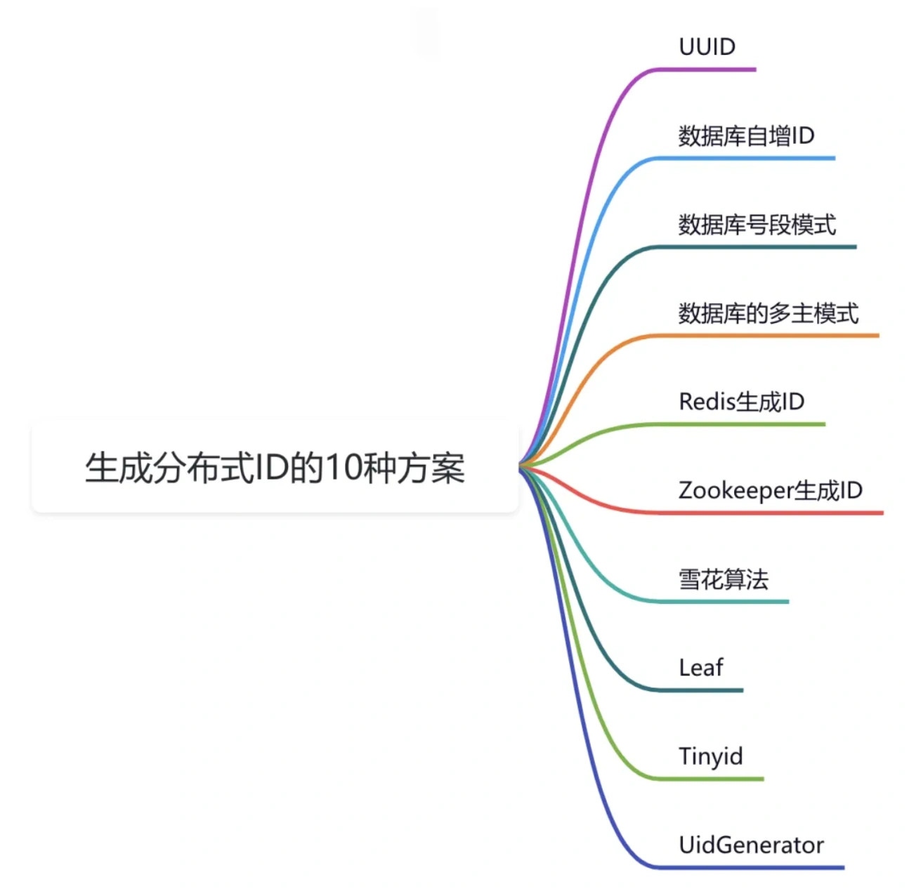
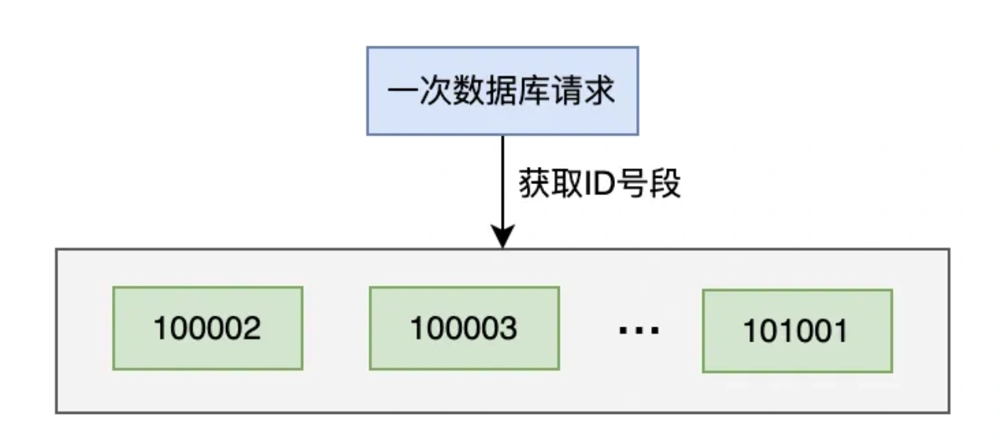
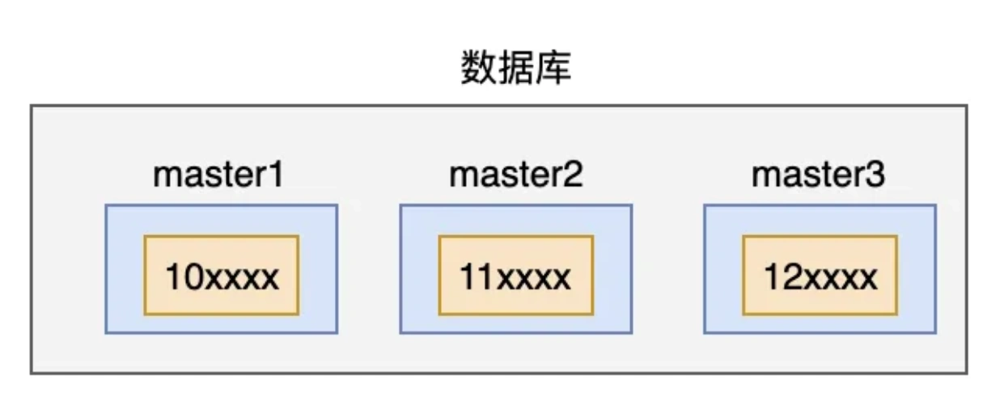
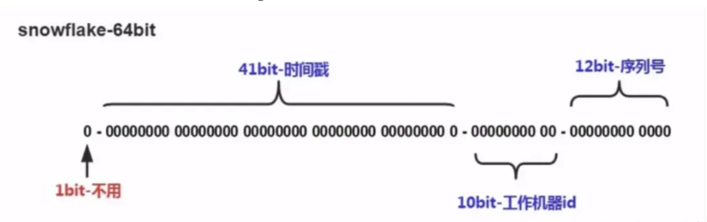
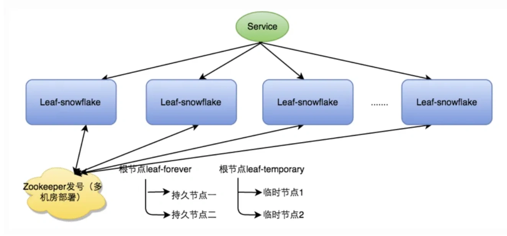
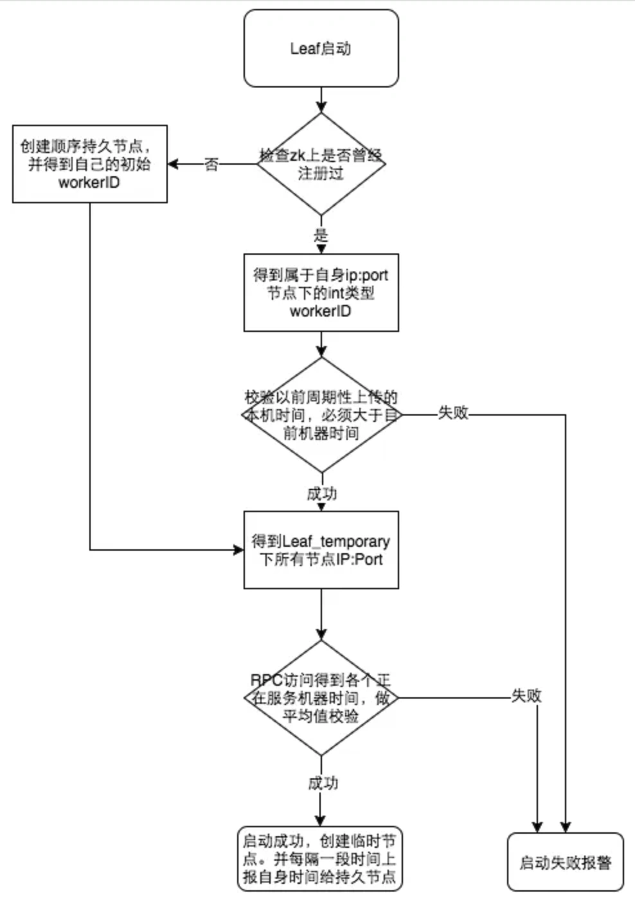
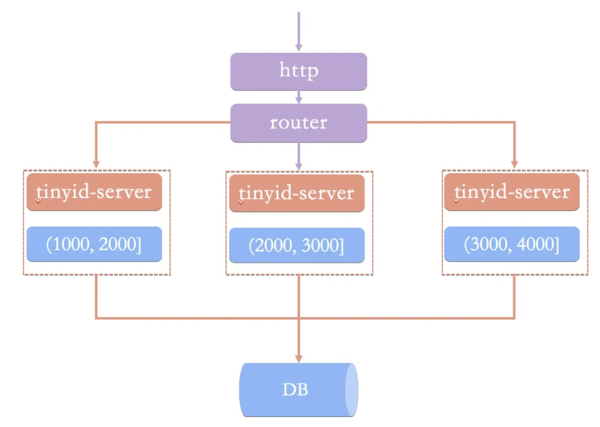
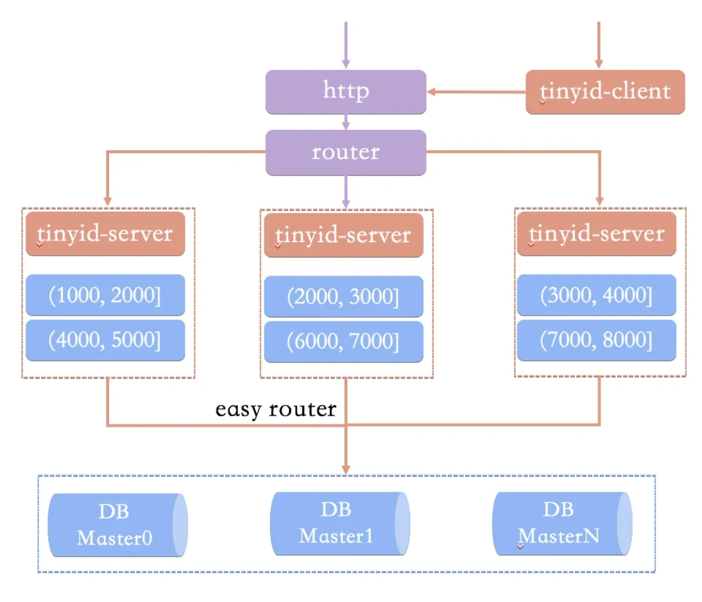
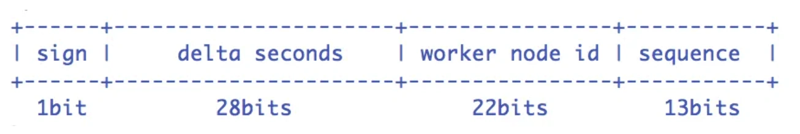
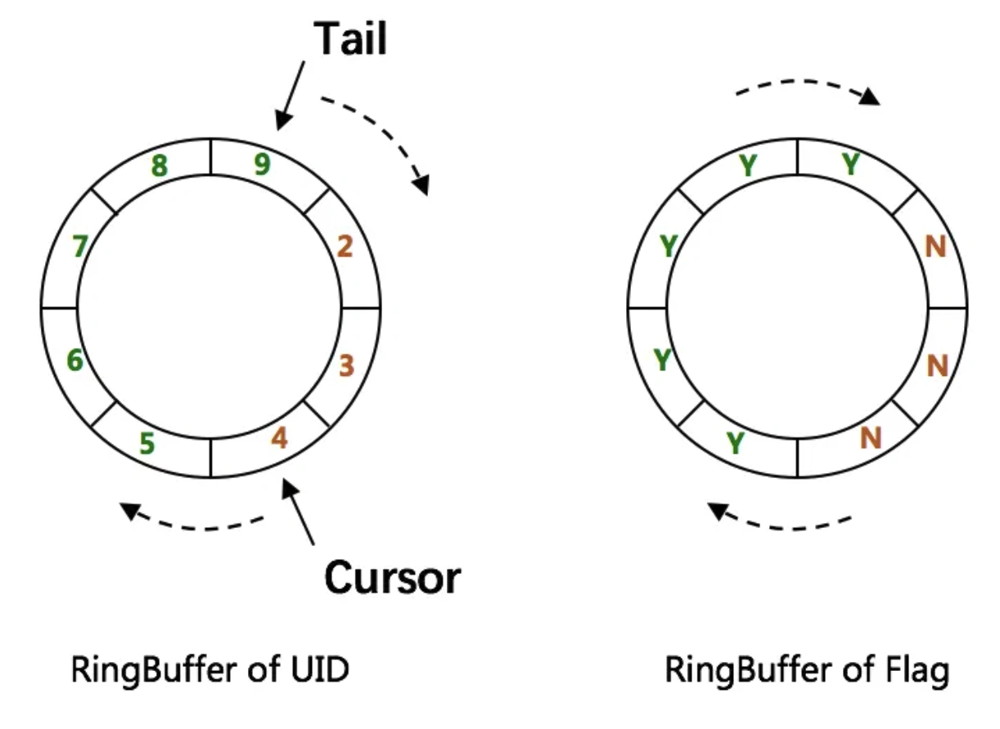

# 分布式ID问题

## **<font style="color:rgb(34, 34, 34);background-color:rgb(248, 246, 244);">前言</font>**
<font style="color:rgb(51, 51, 51);background-color:rgb(248, 246, 244);">分布式ID，在我们日常的开发中，其实使用的挺多的。</font>

<font style="color:rgb(51, 51, 51);background-color:rgb(248, 246, 244);">有很多业务场景在用，比如：</font>

1. <font style="color:rgb(51, 51, 51);background-color:rgb(248, 246, 244);">分布式链路系统的trace_id</font>
2. <font style="color:rgb(51, 51, 51);background-color:rgb(248, 246, 244);">单表中的主键</font>
3. <font style="color:rgb(51, 51, 51);background-color:rgb(248, 246, 244);">Redis中分布式锁的key</font>
4. <font style="color:rgb(51, 51, 51);background-color:rgb(248, 246, 244);">分库分表后表的id</font>

<font style="color:rgb(51, 51, 51);background-color:rgb(248, 246, 244);">今天跟大家一起聊聊分布式ID的一些常见方案，希望对你会有所帮助。</font>



## **<font style="color:rgb(34, 34, 34);background-color:rgb(248, 246, 244);">1 UUID</font>**
<font style="color:rgb(51, 51, 51);background-color:rgb(248, 246, 244);">UUID (Universally Unique IDentifier) 通用唯一识别码 ，也称为 GUID (Globally Unique IDentifier) 全球唯一标识符。</font>

<font style="color:rgb(51, 51, 51);background-color:rgb(248, 246, 244);">UUID是一个长度为128位的标志符，能够在时间和空间上确保其唯一性。</font>

<font style="color:rgb(51, 51, 51);background-color:rgb(248, 246, 244);">UUID最初应用于Apollo网络计算系统，随后在Open Software Foundation（OSF）的分布式计算环境（DCE）中得到应用。</font>

<font style="color:rgb(51, 51, 51);background-color:rgb(248, 246, 244);">可让分布式系统可以不借助中心节点，就可以生成唯一标识， 比如唯一的ID进行日志记录。</font>

<font style="color:rgb(51, 51, 51);background-color:rgb(248, 246, 244);">UUID是基于时间戳、MAC地址、随机数等多种因素生成，理论上全球范围内几乎不可能重复。</font>

<font style="color:rgb(51, 51, 51);background-color:rgb(248, 246, 244);">在Java中可以通过UUID的randomUUID方法获取唯一字符串：</font>

```java
import java.util.UUID;

/**
 * @author 苏三
 * @date 2024/9/13 上午10:38
 */
public class UuidTest {
    public static void main(String[] args) {
        String uuid = UUID.randomUUID().toString();
        System.out.println(uuid);
    }
}
```

<font style="color:rgb(51, 51, 51);background-color:rgb(248, 246, 244);">运行结果：</font>

```plain
22527933-d0a7-4c2b-a377-aeb438a31b02
```

<font style="color:rgb(51, 51, 51);background-color:rgb(248, 246, 244);">优点：UUID不借助中心节点，可以保持程序的独立性，可以保证程序在不同的数据库之间，做数据迁移，都不受影响。</font>

<font style="color:rgb(51, 51, 51);background-color:rgb(248, 246, 244);">缺点：UUID生成的字符串太长，通过索引查询数据的效率比较低。此外，UUID生成的字符串，顺序没有保证，不是递增的，不满足工作中的有些业务场景。</font>

<font style="color:rgb(100, 100, 100);background-color:rgb(248, 246, 244);">在分布式日志系统或者分布式链路跟踪系统中，可以使用UUID生成唯一标识，用于串联请求的日志。</font>

## **<font style="color:rgb(34, 34, 34);background-color:rgb(248, 246, 244);">2 数据库自增ID</font>**
<font style="color:rgb(51, 51, 51);background-color:rgb(248, 246, 244);">在很多数据库中自增的主键ID，数据库本身是能够保证唯一的。</font>

<font style="color:rgb(51, 51, 51);background-color:rgb(248, 246, 244);">MySQL中的auto_increment。</font>

<font style="color:rgb(51, 51, 51);background-color:rgb(248, 246, 244);">Oracle中sequence。</font>

<font style="color:rgb(51, 51, 51);background-color:rgb(248, 246, 244);">我们在业务代码中，不需要做任何处理，这个ID的值，是由数据库自动生成的，并且它会保证数据的唯一性。</font>

<font style="color:rgb(51, 51, 51);background-color:rgb(248, 246, 244);">优点：非常简单，数据查询效率非常高。</font>

<font style="color:rgb(51, 51, 51);background-color:rgb(248, 246, 244);">缺点：只能保证单表的数据唯一性，如果跨表或者跨数据库，ID可能会重复。ID是自增的，生成规则很容易被猜透，有安全风险。ID是基于数据库生成的，在高并发下，可能会有性能问题。</font>

<font style="color:rgb(100, 100, 100);background-color:rgb(248, 246, 244);">在一些老系统或者公司的内部管理系统中，可能会用数据库递增ID作为分布式ID的方案，这些系统的用户并发量一般比较小，数据量也不多。</font>

## **<font style="color:rgb(34, 34, 34);background-color:rgb(248, 246, 244);">3 数据库号段模式</font>**
<font style="color:rgb(51, 51, 51);background-color:rgb(248, 246, 244);">在高并发的系统中，频繁访问数据库，会影响系统的性能。</font>

<font style="color:rgb(51, 51, 51);background-color:rgb(248, 246, 244);">可以对数据库自增ID方案做一个优化。</font>

<font style="color:rgb(51, 51, 51);background-color:rgb(248, 246, 244);">一次生成一定步长的ID，比如：步长是1000，每次数据库自增1000，ID值从100001变成了101001。</font>



<font style="color:rgb(51, 51, 51);background-color:rgb(248, 246, 244);">将100002~101001这个号段的1000个ID，缓存到服务器的内存从。</font>

<font style="color:rgb(51, 51, 51);background-color:rgb(248, 246, 244);">当有获取分布式ID的请求过来时，先从服务器的内存中获取数据，如果能够获取到，则直接返回。</font>

<font style="color:rgb(51, 51, 51);background-color:rgb(248, 246, 244);">如果没有获取到，则说明缓存的号段的数据已经被获取完了。</font>

<font style="color:rgb(51, 51, 51);background-color:rgb(248, 246, 244);">这时需要重新从数据库中获取一次新号段的ID，缓存到服务器的内存中，这样下次又能直接从内存中获取ID了。</font>

<font style="color:rgb(51, 51, 51);background-color:rgb(248, 246, 244);">优点：实现简单，对数据库的依赖减弱了，可以提升系统的性能。</font>

<font style="color:rgb(51, 51, 51);background-color:rgb(248, 246, 244);">缺点：ID是自增的，生成规则很容易被猜透，有安全风险。如果数据库是单节点的，有岩机的风险。</font>

## **<font style="color:rgb(34, 34, 34);background-color:rgb(248, 246, 244);">4 数据库的多主模式</font>**
<font style="color:rgb(51, 51, 51);background-color:rgb(248, 246, 244);">为了解决上面单节点岩机问题，我们可以使用数据库的多主模式。</font>

<font style="color:rgb(51, 51, 51);background-color:rgb(248, 246, 244);">即有多个master数据库实例。</font>



<font style="color:rgb(51, 51, 51);background-color:rgb(248, 246, 244);">在生成ID的时候，一个请求只能写入一个master实例。</font>

<font style="color:rgb(51, 51, 51);background-color:rgb(248, 246, 244);">为了保证在不同的master实例下ID的唯一性，我们需要事先规定好每个master下的大的区间，比如：master1的数据是10开头的，master2的数据是11开头的，master3的数据是12开头的。</font>

<font style="color:rgb(51, 51, 51);background-color:rgb(248, 246, 244);">然后每个master，还是按照数据库号段模式来处理。</font>

<font style="color:rgb(51, 51, 51);background-color:rgb(248, 246, 244);">优点：避免了数据库号段模式的单节点岩机风险，提升了系统的稳定性，由于结合使用了号段模式，系统性能也是OK的。</font>

<font style="color:rgb(51, 51, 51);background-color:rgb(248, 246, 244);">缺点：跨多个master实例下生成的ID，可能不是递增的。</font>

## **<font style="color:rgb(34, 34, 34);background-color:rgb(248, 246, 244);">5 Redis生成ID</font>**
<font style="color:rgb(51, 51, 51);background-color:rgb(248, 246, 244);">除了使用数据库之外，Redis其实也能产生自增ID。</font>

<font style="color:rgb(51, 51, 51);background-color:rgb(248, 246, 244);">我们可以使用Redis中的incr命令：</font>

```plain
redis> SET ID_VALUE 1000
OK

redis> INCR ID_VALUE
(integer) 1001

redis> GET ID_VALUE 
"1001"
```

<font style="color:rgb(51, 51, 51);background-color:rgb(248, 246, 244);">给ID_VALUE设置了值是1000，然后使用INCR命令，可以每次都加1。</font>

<font style="color:rgb(51, 51, 51);background-color:rgb(248, 246, 244);">这个方案跟我们之前讨论过的方案1（数据库自增ID）的方案类似。</font>

<font style="color:rgb(51, 51, 51);background-color:rgb(248, 246, 244);">优点：方案简单，性能比方案1更好，避免了跨表或者跨数据库，ID重复的问题。</font>

<font style="color:rgb(51, 51, 51);background-color:rgb(248, 246, 244);">缺点：ID是自增的，生成规则很容易被猜透，有安全风险。并且Redis可能也存在单节点，岩机的风险。</font>

## **<font style="color:rgb(34, 34, 34);background-color:rgb(248, 246, 244);">6 Zookeeper生成ID</font>**
<font style="color:rgb(51, 51, 51);background-color:rgb(248, 246, 244);">Zookeeper主要通过其znode数据版本来生成序列号，可以生成32位和64位的数据版本号，客户端可以使用这个版本号来作为唯一的序列号。</font>

<font style="color:rgb(51, 51, 51);background-color:rgb(248, 246, 244);">由于需要高度依赖Zookeeper，并且是同步调用API，如果在竞争较大的情况下，需要考虑使用分布式锁。</font>

<font style="color:rgb(51, 51, 51);background-color:rgb(248, 246, 244);">因此，性能在高并发的分布式环境下，也不太理想。</font>

<font style="color:rgb(51, 51, 51);background-color:rgb(248, 246, 244);">很少人会使用Zookeeper来生成唯一ID。</font>

## **<font style="color:rgb(34, 34, 34);background-color:rgb(248, 246, 244);">7 雪花算法</font>**
<font style="color:rgb(51, 51, 51);background-color:rgb(248, 246, 244);">Snowflake(雪花算法)是Twitter开源的分布式ID算法。</font>

<font style="color:rgb(51, 51, 51);background-color:rgb(248, 246, 244);">核心思想：使用一个 64 bit 的 long 型的数字作为全局唯一 id。</font>



<font style="color:rgb(51, 51, 51);background-color:rgb(248, 246, 244);">最高位是符号位，始终为0，不可用。</font>

<font style="color:rgb(51, 51, 51);background-color:rgb(248, 246, 244);">41位的时间序列，精确到毫秒级，41位的长度可以使用69年。时间位还有一个很重要的作用是可以根据时间进行排序。</font>

<font style="color:rgb(51, 51, 51);background-color:rgb(248, 246, 244);">10位的机器标识，10位的长度最多支持部署1024个节点</font>

<font style="color:rgb(51, 51, 51);background-color:rgb(248, 246, 244);">12位的计数序列号，序列号即一系列的自增id，可以支持同一节点同一毫秒生成多个ID序号，12位的计数序列号支持每个节点每毫秒产生4096个ID序号。</font>

<font style="color:rgb(51, 51, 51);background-color:rgb(248, 246, 244);">优点：算法简单，在内存中进行，效率高。高并发分布式环境下生成不重复ID，每秒可生成百万个不重复ID。基于时间戳，以及同一时间戳下序列号自增，基本保证ID有序递增。并且不依赖第三方库或者中间件，稳定性更好。</font>

<font style="color:rgb(51, 51, 51);background-color:rgb(248, 246, 244);">缺点：依赖服务器时间，服务器时钟回拨时可能会生成重复ID。</font>

**<font style="color:rgb(34, 34, 34);background-color:rgb(248, 246, 244);">最近整理了一份10万字的面试宝典，可以免费送给大家，获取方式加我微信：su_san_java，备注：面试。</font>**

## **<font style="color:rgb(34, 34, 34);background-color:rgb(248, 246, 244);">8 Leaf</font>**
<font style="color:rgb(51, 51, 51);background-color:rgb(248, 246, 244);">Leaf是美团开源的分布式ID生成系统，它提供了两种生成ID的方式：</font>

+ <font style="color:rgb(51, 51, 51);background-color:rgb(248, 246, 244);">Leaf-segment号段模式</font>
+ <font style="color:rgb(51, 51, 51);background-color:rgb(248, 246, 244);">Leaf-snowflake雪花算法</font>

<font style="color:rgb(51, 51, 51);background-color:rgb(248, 246, 244);">Leaf-segment号段模式，需要创建一张表：</font>


<font style="color:rgb(51, 51, 51);background-color:rgb(248, 246, 244);">这个模式就是我们在第3节讲过的数据库号段模式。</font>

<font style="color:rgb(51, 51, 51);background-color:rgb(248, 246, 244);">biz_tag用来区分业务，max_id表示该biz_tag目前所被分配的ID号段的最大值，step表示每次分配的号段长度。</font>

<font style="color:rgb(51, 51, 51);background-color:rgb(248, 246, 244);">原来获取ID每次都需要写数据库，现在只需要把step设置得足够大，比如1000。那么只有当1000个号被消耗完了之后才会去重新读写一次数据库。</font>

<font style="color:rgb(51, 51, 51);background-color:rgb(248, 246, 244);">Leaf-snowflake雪花算法，是在传统雪花算法之上，加上Zookeeper，做了一点改造：</font>



<font style="color:rgb(51, 51, 51);background-color:rgb(248, 246, 244);">Leaf-snowflake服务需要从Zookeeper按顺序的获取workId，会缓存到本地。</font>

<font style="color:rgb(51, 51, 51);background-color:rgb(248, 246, 244);">如果Zookeeper出现异常，Leaf-snowflake服务会直接获取本地的workId，它相当于对Zookeeper是弱依赖的。</font>

<font style="color:rgb(51, 51, 51);background-color:rgb(248, 246, 244);">因为这种方案依赖时间，如果机器的时钟发生了回拨，那么就会有可能生成重复的ID号，它内部有一套机制解决机器时钟回拨的问题：</font>



<font style="color:rgb(51, 51, 51);background-color:rgb(248, 246, 244);">如果你想知道美团Leaf的更多细节，可以看看Github地址：</font>[<font style="color:rgb(51, 51, 51);background-color:rgb(248, 246, 244);">https://github.com/Meituan-Dianping/Leaf</font>](https://github.com/Meituan-Dianping/Leaf)

## **<font style="color:rgb(34, 34, 34);background-color:rgb(248, 246, 244);">9 Tinyid</font>**
<font style="color:rgb(51, 51, 51);background-color:rgb(248, 246, 244);">Tinyid是滴滴用Java开发的一款分布式id生成系统，基于数据库号段算法实现。</font>

<font style="color:rgb(51, 51, 51);background-color:rgb(248, 246, 244);">Tinyid是在美团的ID生成算法Leaf的基础上扩展而来，支持数据库多主节点模式，它提供了REST API和JavaClient两种获取方式，相对来说使用更方便。</font>

<font style="color:rgb(51, 51, 51);background-color:rgb(248, 246, 244);">但跟美团Leaf不同的是，Tinyid只支持号段一种模式，并不支持Snowflake模式。</font>

<font style="color:rgb(51, 51, 51);background-color:rgb(248, 246, 244);">基于数据库号段模式的简单架构方案：</font>



<font style="color:rgb(51, 51, 51);background-color:rgb(248, 246, 244);">ID生成系统向外提供http服务，请求经过负载均衡router，能够路由到其中一台tinyid-server，这样就能从事先加载好的号段中获取一个ID了。</font>

<font style="color:rgb(51, 51, 51);background-color:rgb(248, 246, 244);">如果号段还没有加载，或者已经用完了，则需要向db再申请一个新的可用号段，多台server之间因为号段生成算法的原子性，而保证每台server上的可用号段不重，从而使id生成不重。</font>

<font style="color:rgb(51, 51, 51);background-color:rgb(248, 246, 244);">但也带来了这些问题：</font>

+ <font style="color:rgb(51, 51, 51);background-color:rgb(248, 246, 244);">当id用完时需要访问db加载新的号段，db更新也可能存在version冲突，此时id生成耗时明显增加。</font>
+ <font style="color:rgb(51, 51, 51);background-color:rgb(248, 246, 244);">db是一个单点，虽然db可以建设主从等高可用架构，但始终是一个单点。</font>
+ <font style="color:rgb(51, 51, 51);background-color:rgb(248, 246, 244);">使用http方式获取一个id，存在网络开销，性能和可用性都不太好。</font>

<font style="color:rgb(51, 51, 51);background-color:rgb(248, 246, 244);">为了解决这些这些问题：增加了tinyid-client本地生成ID、使用双号段缓存、增加多 db 支持提高服务的稳定性。</font>

<font style="color:rgb(51, 51, 51);background-color:rgb(248, 246, 244);">最终的架构方案如下：</font>



<font style="color:rgb(51, 51, 51);background-color:rgb(248, 246, 244);">Tinyid方案主要做了下面这些优化：</font>

+ <font style="color:rgb(51, 51, 51);background-color:rgb(248, 246, 244);">增加tinyid-client：tinyid-client向tinyid-server发送请求来获取可用号段，之后在本地构建双号段、id生成，如此id生成则变成纯本地操作，性能大大提升。</font>
+ <font style="color:rgb(51, 51, 51);background-color:rgb(248, 246, 244);">使用双号段缓存：为了避免在获取新号段的情况下，程序获取唯一ID的速度比较慢。Tinyid中的号段在用到一定程度的时候，就会去异步加载下一个号段，保证内存中始终有可用号段。</font>
+ <font style="color:rgb(51, 51, 51);background-color:rgb(248, 246, 244);">增加多db支持：每个DB都能生成唯一ID，提高了可用性。</font>

<font style="color:rgb(51, 51, 51);background-color:rgb(248, 246, 244);">如果你想知道滴滴Tinyid的更多细节，可以看看Github地址：</font>[<font style="color:rgb(51, 51, 51);background-color:rgb(248, 246, 244);">https://github.com/didi/tinyid</font>](https://github.com/didi/tinyid)

## **<font style="color:rgb(34, 34, 34);background-color:rgb(248, 246, 244);">10 UidGenerator</font>**
<font style="color:rgb(51, 51, 51);background-color:rgb(248, 246, 244);">百度 UID-Generator 使用 Java 语言，基于雪花算法实现。</font>

<font style="color:rgb(51, 51, 51);background-color:rgb(248, 246, 244);">UidGenerator以组件形式工作在应用项目中, 支持自定义workerId位数和初始化策略, 从而适用于docker等虚拟化环境下实例自动重启、漂移等场景。</font>

<font style="color:rgb(51, 51, 51);background-color:rgb(248, 246, 244);">在实现上, UidGenerator通过借用未来时间来解决sequence天然存在的并发限制。</font>

<font style="color:rgb(51, 51, 51);background-color:rgb(248, 246, 244);">采用RingBuffer来缓存已生成的UID, 并行化UID的生产和消费, 同时对CacheLine补齐，避免了由RingBuffer带来的硬件级「伪共享」问题. 最终单机QPS可达600万。</font>



<font style="color:rgb(51, 51, 51);background-color:rgb(248, 246, 244);">Snowflake算法描述：指定机器 & 同一时刻 & 某一并发序列，是唯一的。据此可生成一个64 bits的唯一ID（long）。默认采用上图字节分配方式：</font>

+ <font style="color:rgb(51, 51, 51);background-color:rgb(248, 246, 244);">sign(1bit)：固定1bit符号标识，即生成的UID为正数。</font>
+ <font style="color:rgb(51, 51, 51);background-color:rgb(248, 246, 244);">delta seconds (28 bits) ：当前时间，相对于时间基点"2016-05-20"的增量值，单位：秒，最多可支持约8.7年</font>
+ <font style="color:rgb(51, 51, 51);background-color:rgb(248, 246, 244);">worker id (22 bits)：机器id，最多可支持约420w次机器启动。内置实现为在启动时由数据库分配，默认分配策略为用后即弃，后续可提供复用策略。</font>
+ <font style="color:rgb(51, 51, 51);background-color:rgb(248, 246, 244);">sequence (13 bits)：每秒下的并发序列，13 bits可支持每秒8192个并发。</font>

<font style="color:rgb(51, 51, 51);background-color:rgb(248, 246, 244);">sequence决定了UidGenerator的并发能力，13 bits的 sequence 可支持 8192/s 的并发，但现实中很有可能不够用，从而诞生了 CachedUidGenerator。</font>

<font style="color:rgb(51, 51, 51);background-color:rgb(248, 246, 244);">CachedUidGenerator 使用 RingBuffer 缓存生成的id。RingBuffer是个环形数组，默认大小为 8192 个（可以通过boostPower参数设置大小）。</font>

<font style="color:rgb(51, 51, 51);background-color:rgb(248, 246, 244);">RingBuffer环形数组，数组每个元素成为一个 slot。</font>

<font style="color:rgb(51, 51, 51);background-color:rgb(248, 246, 244);">Tail 指针、Cursor 指针用于环形数组上读写 slot：</font>

+ <font style="color:rgb(51, 51, 51);background-color:rgb(248, 246, 244);">Tail指针：表示 Producer 生产的最大序号(此序号从 0 开始，持续递增)。Tail 不能超过 Cursor，即生产者不能覆盖未消费的 slot。当 Tail 已赶上 curosr，此时可通过 rejectedPutBufferHandler 指定 PutRejectPolicy。</font>
+ <font style="color:rgb(51, 51, 51);background-color:rgb(248, 246, 244);">Cursor指针：表示 Consumer 消费到的最小序号(序号序列与 Producer 序列相同)。Cursor 不能超过 Tail，即不能消费未生产的 slot。当 Cursor 已赶上 tail，此时可通过 rejectedTakeBufferHandler 指定 TakeRejectPolicy。</font>

<font style="color:rgb(51, 51, 51);background-color:rgb(248, 246, 244);">RingBuffer填充触发机制:</font>



+ <font style="color:rgb(51, 51, 51);background-color:rgb(248, 246, 244);">程序启动时，将RingBuffer填充满。</font>
+ <font style="color:rgb(51, 51, 51);background-color:rgb(248, 246, 244);">在调用getUID()方法获取id时，如果检测到RingBuffer中的剩余id个数小于总个数的50%，将RingBuffer填充满。</font>
+ <font style="color:rgb(51, 51, 51);background-color:rgb(248, 246, 244);">定时填充（可配置是否使用以及定时任务的周期）。</font>

<font style="color:rgb(51, 51, 51);background-color:rgb(248, 246, 244);">如果你想知道百度uid-generator的更多细节，可以看看Github地址：</font>[<font style="color:rgb(51, 51, 51);background-color:rgb(248, 246, 244);">https://github.com/baidu/uid-generator</font>](https://github.com/baidu/uid-generator)


> 更新: 2024-10-08 10:59:53  
> 原文: <https://www.yuque.com/yuqueyonghue6cvnv/cxhfwd/gvg7u4c088azr8lm>