# 负载均衡问题-

## **<font style="color:rgb(34, 34, 34);background-color:rgb(248, 246, 244);">前言</font>**
<font style="color:rgb(51, 51, 51);background-color:rgb(248, 246, 244);">我之前在一家游戏公司，经历过单节点过载引发的全站崩溃，也处理过跨机房流量不均导致的区域性故障。</font>

<font style="color:rgb(51, 51, 51);background-color:rgb(248, 246, 244);">真正的负载均衡不是简单配置Nginx，而是构建全局流量调度中枢。</font>

<font style="color:rgb(51, 51, 51);background-color:rgb(248, 246, 244);">这篇文章跟大家一起聊聊负载均衡底层原理和常见问题，希望对你会有所帮助。</font>

## **<font style="color:rgb(34, 34, 34);background-color:rgb(248, 246, 244);">一、负载均衡四大层级架构</font>**
### **<font style="color:rgb(34, 34, 34);background-color:rgb(248, 246, 244);">现代应用流量调度全景图：</font>**
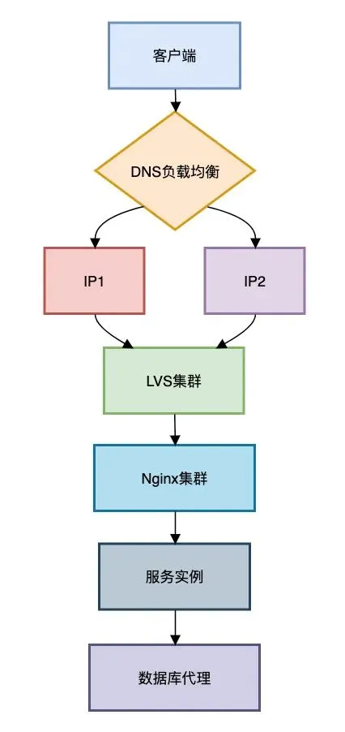

**<font style="color:rgb(34, 34, 34);background-color:rgb(248, 246, 244);">各层核心作用</font>**<font style="color:rgb(51, 51, 51);background-color:rgb(248, 246, 244);">：</font>

1. **<font style="color:rgb(34, 34, 34);background-color:rgb(248, 246, 244);">DNS层</font>**<font style="color:rgb(51, 51, 51);background-color:rgb(248, 246, 244);">：实现地域级流量调度（如智能解析）</font>
2. **<font style="color:rgb(34, 34, 34);background-color:rgb(248, 246, 244);">LVS层</font>**<font style="color:rgb(51, 51, 51);background-color:rgb(248, 246, 244);">：基于IP的4层负载，千万级并发支撑</font>
3. **<font style="color:rgb(34, 34, 34);background-color:rgb(248, 246, 244);">Nginx层</font>**<font style="color:rgb(51, 51, 51);background-color:rgb(248, 246, 244);">：7层应用路由，支持HTTPS卸载</font>
4. **<font style="color:rgb(34, 34, 34);background-color:rgb(248, 246, 244);">服务层</font>**<font style="color:rgb(51, 51, 51);background-color:rgb(248, 246, 244);">：客户端负载均衡（如Ribbon）</font>
5. **<font style="color:rgb(34, 34, 34);background-color:rgb(248, 246, 244);">数据层</font>**<font style="color:rgb(51, 51, 51);background-color:rgb(248, 246, 244);">：数据库读写分离（如MyCAT）</font>

## **<font style="color:rgb(34, 34, 34);background-color:rgb(248, 246, 244);">二、五大负载算法</font>**
### **<font style="color:rgb(34, 34, 34);background-color:rgb(248, 246, 244);">轮询算法（Round Robin）</font>**
**<font style="color:rgb(34, 34, 34);background-color:rgb(248, 246, 244);">实现原理</font>**<font style="color:rgb(51, 51, 51);background-color:rgb(248, 246, 244);">：</font>

```plain
public class RoundRobinLoadBalancer {  
    private final List<String> endpoints;  
    private final AtomicInteger counter = new AtomicInteger(0);  

    public String next() {  
        int index = counter.getAndIncrement() % endpoints.size();  
        if (index < 0) {  
            counter.set(0);  
            index = 0;  
        }  
        return endpoints.get(index);  
    }  
}
```

**<font style="color:rgb(34, 34, 34);background-color:rgb(248, 246, 244);">致命缺陷</font>**<font style="color:rgb(51, 51, 51);background-color:rgb(248, 246, 244);">：未考虑服务器性能差异 → 低配服务器先过载</font>

### **<font style="color:rgb(34, 34, 34);background-color:rgb(248, 246, 244);">加权轮询（Weighted Round Robin）</font>**
**<font style="color:rgb(34, 34, 34);background-color:rgb(248, 246, 244);">动态权重配置</font>**<font style="color:rgb(51, 51, 51);background-color:rgb(248, 246, 244);">：</font>

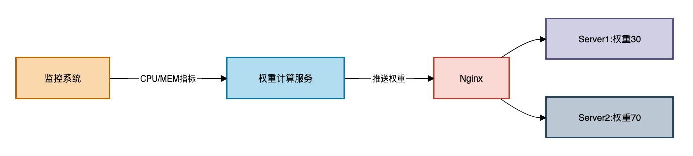

**<font style="color:rgb(34, 34, 34);background-color:rgb(248, 246, 244);">Nginx配置示例</font>**<font style="color:rgb(51, 51, 51);background-color:rgb(248, 246, 244);">：</font>

```nginx
upstream backend {  
    server 192.168.1.10 weight=3; # 30%流量  
    server 192.168.1.11 weight=7; # 70%流量  
    server 192.168.1.12 backup;   # 备用节点  
}
```

### **<font style="color:rgb(34, 34, 34);background-color:rgb(248, 246, 244);">最少连接算法（Least Connections）</font>**
**<font style="color:rgb(34, 34, 34);background-color:rgb(248, 246, 244);">核心思想</font>**<font style="color:rgb(51, 51, 51);background-color:rgb(248, 246, 244);">：将新请求分配给当前连接数最少的服务器</font>

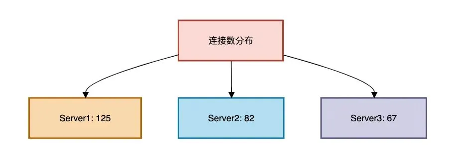

**<font style="color:rgb(34, 34, 34);background-color:rgb(248, 246, 244);">Java实现</font>**<font style="color:rgb(51, 51, 51);background-color:rgb(248, 246, 244);">：</font>

```plain
public String leastConnections() {  
    return endpoints.stream()  
        .min(Comparator.comparingInt(this::getActiveConnections))  
        .orElseThrow();  
}  

// 模拟获取连接数（真实场景从监控获取）  
private int getActiveConnections(String endpoint) {  
    return connectionStats.getOrDefault(endpoint, 0);  
}
```

### **<font style="color:rgb(34, 34, 34);background-color:rgb(248, 246, 244);">一致性哈希（Consistent Hashing）</font>**
**<font style="color:rgb(34, 34, 34);background-color:rgb(248, 246, 244);">解决痛点</font>**<font style="color:rgb(51, 51, 51);background-color:rgb(248, 246, 244);">：分布式缓存扩容时大量缓存失效</font>

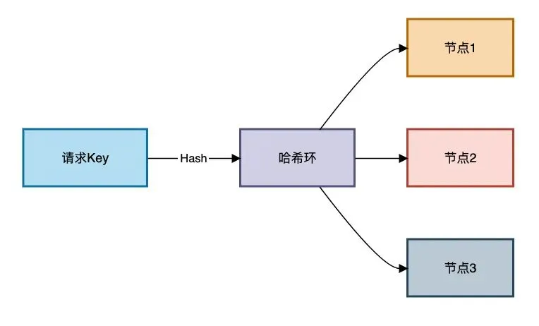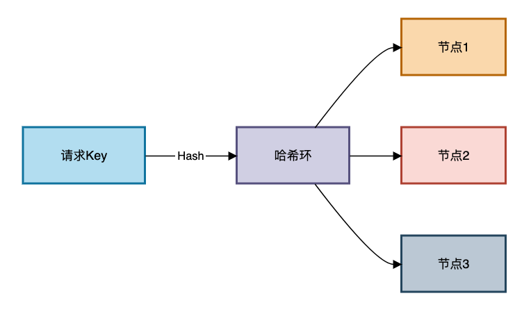

**<font style="color:rgb(34, 34, 34);background-color:rgb(248, 246, 244);">虚拟节点实现</font>**<font style="color:rgb(51, 51, 51);background-color:rgb(248, 246, 244);">：</font>

```plain
public class ConsistentHash {  
    private final SortedMap<Integer, String> circle = new TreeMap<>();  
    private final int virtualNodes;  

    public void addNode(String node) {  
        for (int i = 0; i < virtualNodes; i++) {  
            String vNode = node + "#" + i;  
            int hash = hash(vNode);  
            circle.put(hash, node);  
        }  
    }  

    public String getNode(String key) {  
        if (circle.isEmpty()) return null;  
        int hash = hash(key);  
        SortedMap<Integer, String> tailMap = circle.tailMap(hash);  
        int nodeHash = tailMap.isEmpty() ? circle.firstKey() : tailMap.firstKey();  
        return circle.get(nodeHash);  
    }  
}
```

### **<font style="color:rgb(34, 34, 34);background-color:rgb(248, 246, 244);">自适应负载算法（AI预测）</font>**
**<font style="color:rgb(34, 34, 34);background-color:rgb(248, 246, 244);">动态预测模型</font>**<font style="color:rgb(51, 51, 51);background-color:rgb(248, 246, 244);">：</font>

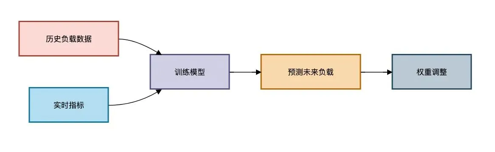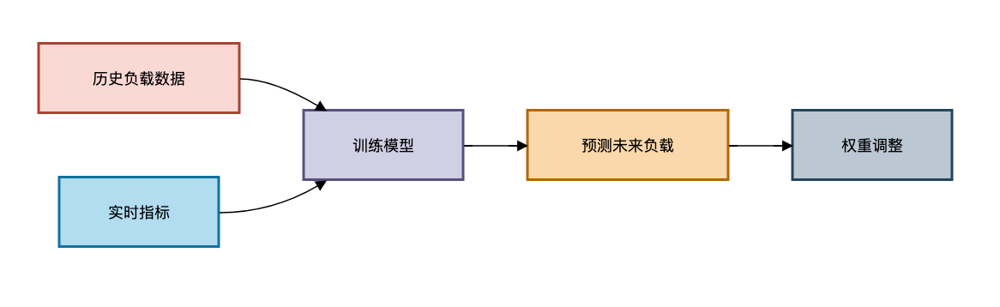

**<font style="color:rgb(34, 34, 34);background-color:rgb(248, 246, 244);">关键指标</font>**<font style="color:rgb(51, 51, 51);background-color:rgb(248, 246, 244);">：</font>

```plain
# 使用简单线性回归预测  
def predict_load(historical):  
    # 输入: [(time, cpu, mem, conns)]  
    X = [t[0] for t in historical]  
    y = [t[1] * 0.6 + t[2] * 0.3 + t[3] * 0.1 for t in historical]  
    model = LinearRegression().fit(X, y)  
    return model.predict([[next_time]])
```

## **<font style="color:rgb(34, 34, 34);background-color:rgb(248, 246, 244);">三、高可用负载架构设计</font>**
### **<font style="color:rgb(34, 34, 34);background-color:rgb(248, 246, 244);">双活数据中心流量调度</font>**
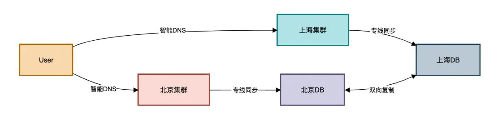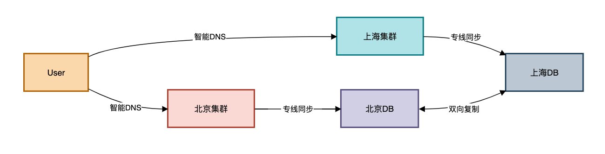

**<font style="color:rgb(34, 34, 34);background-color:rgb(248, 246, 244);">故障切换策略</font>**<font style="color:rgb(51, 51, 51);background-color:rgb(248, 246, 244);">：</font>

1. **<font style="color:rgb(34, 34, 34);background-color:rgb(248, 246, 244);">网络层</font>**<font style="color:rgb(51, 51, 51);background-color:rgb(248, 246, 244);">：BGP Anycast实现IP级切换</font>
2. **<font style="color:rgb(34, 34, 34);background-color:rgb(248, 246, 244);">应用层</font>**<font style="color:rgb(51, 51, 51);background-color:rgb(248, 246, 244);">：Nginx主动健康检查</font>

```plain
server 192.168.1.10 max_fails=3 fail_timeout=30s;
```

1. **<font style="color:rgb(34, 34, 34);background-color:rgb(248, 246, 244);">服务层</font>**<font style="color:rgb(51, 51, 51);background-color:rgb(248, 246, 244);">：Spring Cloud熔断降级</font>

```typescript
@HystrixCommand(fallbackMethod = "defaultResult")  
public String service() { /* ... */ }
```

## **<font style="color:rgb(34, 34, 34);background-color:rgb(248, 246, 244);">四、深度避坑指南</font>**
### **<font style="color:rgb(34, 34, 34);background-color:rgb(248, 246, 244);">陷阱1：缓存穿透引发雪崩</font>**
**<font style="color:rgb(34, 34, 34);background-color:rgb(248, 246, 244);">场景</font>**<font style="color:rgb(51, 51, 51);background-color:rgb(248, 246, 244);">：某热点Key失效导致流量直击数据库</font>

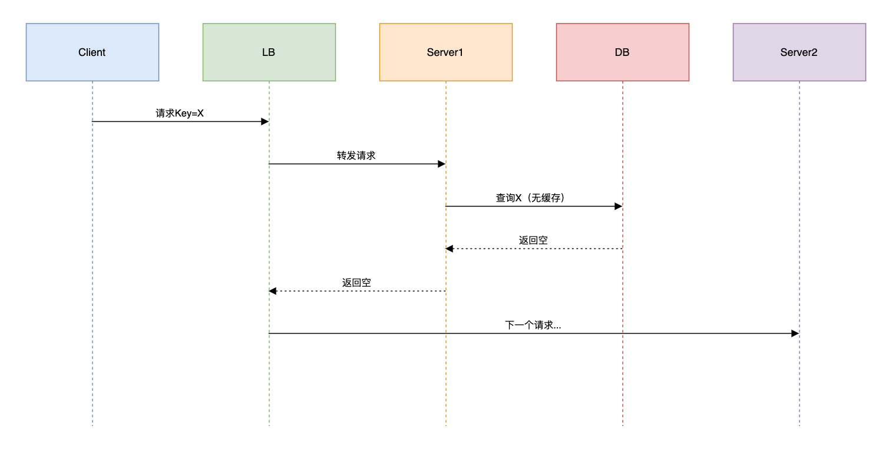

**<font style="color:rgb(34, 34, 34);background-color:rgb(248, 246, 244);">解决方案</font>**<font style="color:rgb(51, 51, 51);background-color:rgb(248, 246, 244);">：</font>

```plain
// 使用Google Guava缓存空值  
LoadingCache<String, Object> cache = CacheBuilder.newBuilder()  
    .maximumSize(1000)  
    .expireAfterWrite(30, TimeUnit.SECONDS)  
    .build(new CacheLoader<>() {  
        public Object load(String key) {  
            Object value = db.query(key);  
            return value != null ? value : NULL_OBJ; // 空对象占位  
        }  
    });
```

### **<font style="color:rgb(34, 34, 34);background-color:rgb(248, 246, 244);">陷阱2：TCP连接复用失衡</font>**
**<font style="color:rgb(34, 34, 34);background-color:rgb(248, 246, 244);">现象</font>**<font style="color:rgb(51, 51, 51);background-color:rgb(248, 246, 244);">：长连接导致流量倾斜</font>

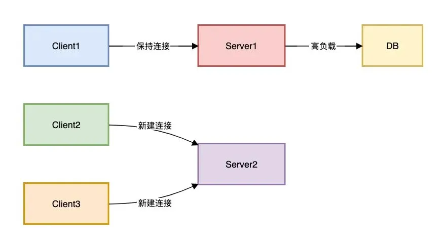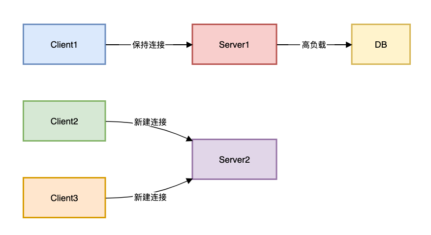

**<font style="color:rgb(34, 34, 34);background-color:rgb(248, 246, 244);">解决方案</font>**<font style="color:rgb(51, 51, 51);background-color:rgb(248, 246, 244);">：</font>

```nginx
# Nginx配置短连接  
upstream backend {  
    server 192.168.1.10;  
    keepalive 50; # 每worker最大连接数  
    keepalive_timeout 60s;  
}
```

### **<font style="color:rgb(34, 34, 34);background-color:rgb(248, 246, 244);">陷阱3：跨机房延迟导致超时</font>**
**<font style="color:rgb(34, 34, 34);background-color:rgb(248, 246, 244);">案例</font>**<font style="color:rgb(51, 51, 51);background-color:rgb(248, 246, 244);">：北京调用上海服务频繁超时</font>


**<font style="color:rgb(34, 34, 34);background-color:rgb(248, 246, 244);">优化方案</font>**<font style="color:rgb(51, 51, 51);background-color:rgb(248, 246, 244);">：</font>

1. **<font style="color:rgb(34, 34, 34);background-color:rgb(248, 246, 244);">路由策略</font>**<font style="color:rgb(51, 51, 51);background-color:rgb(248, 246, 244);">：优先同机房调用</font>
2. **<font style="color:rgb(34, 34, 34);background-color:rgb(248, 246, 244);">超时配置</font>**<font style="color:rgb(51, 51, 51);background-color:rgb(248, 246, 244);">：</font>

```plain
feign:  
  client:  
    config:  
      default:  
        connectTimeout: 500  
        readTimeout: 1000
```

1. **<font style="color:rgb(34, 34, 34);background-color:rgb(248, 246, 244);">降级策略</font>**<font style="color:rgb(51, 51, 51);background-color:rgb(248, 246, 244);">：</font>

```kotlin
// 上海服务不可用时使用本地缓存  
@Fallback(fallbackClass = LocalCacheService.class)  
public interface RemoteService {}
```

## **<font style="color:rgb(34, 34, 34);background-color:rgb(248, 246, 244);">五、自研负载均衡器核心设计</font>**
### **<font style="color:rgb(34, 34, 34);background-color:rgb(248, 246, 244);">架构设计</font>**
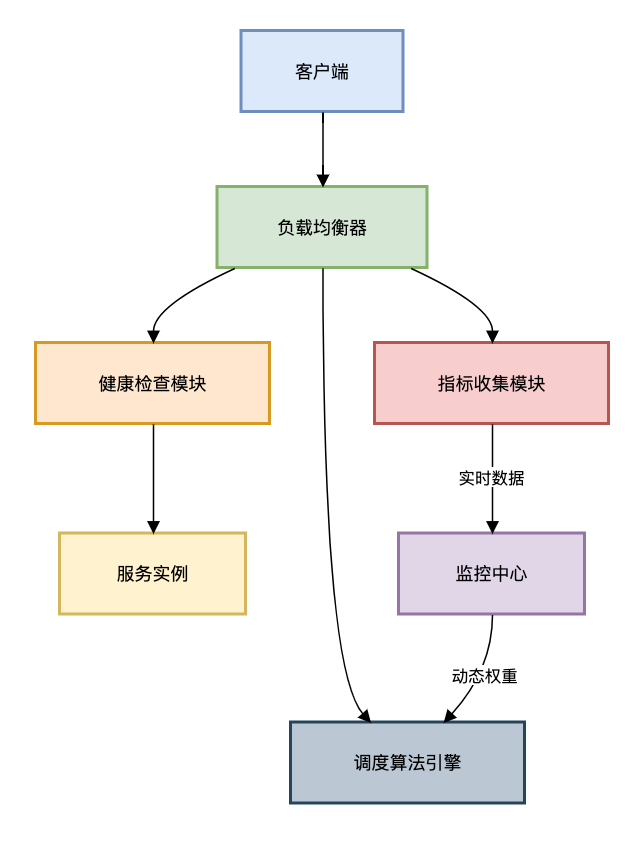

### **<font style="color:rgb(34, 34, 34);background-color:rgb(248, 246, 244);">健康检查实现</font>**
```java
public class HealthChecker implements Runnable {  
    private final List<ServerNode> nodes;  

    public void run() {  
        for (ServerNode node : nodes) {  
            boolean alive = checkNode(node);  
            node.setAlive(alive);  
        }  
    }  

    private boolean checkNode(ServerNode node) {  
        try (Socket socket = new Socket()) {  
            socket.connect(new InetSocketAddress(node.getIp(), node.getPort()), 500);  
            return true;  
        } catch (IOException e) {  
            return false;  
        }  
    }  
}
```

## **<font style="color:rgb(34, 34, 34);background-color:rgb(248, 246, 244);">总结</font>**
**<font style="color:rgb(34, 34, 34);background-color:rgb(248, 246, 244);">三层设计原则</font>**<font style="color:rgb(51, 51, 51);background-color:rgb(248, 246, 244);">：</font>

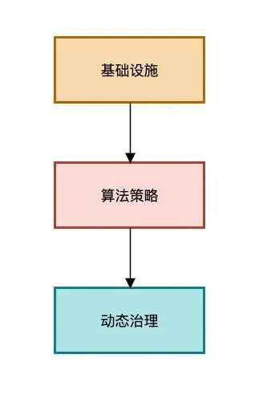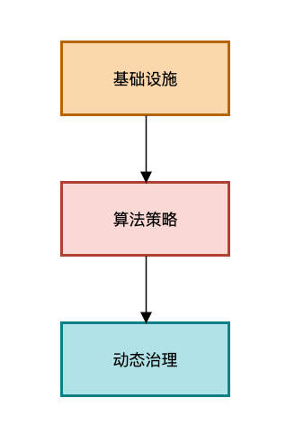

**<font style="color:rgb(34, 34, 34);background-color:rgb(248, 246, 244);">五大核心原则</font>**<font style="color:rgb(51, 51, 51);background-color:rgb(248, 246, 244);">：</font>

1. **<font style="color:rgb(34, 34, 34);background-color:rgb(248, 246, 244);">冗余设计</font>**<font style="color:rgb(51, 51, 51);background-color:rgb(248, 246, 244);">：至少2个负载均衡节点形成集群</font>
2. **<font style="color:rgb(34, 34, 34);background-color:rgb(248, 246, 244);">多级分流</font>**<font style="color:rgb(51, 51, 51);background-color:rgb(248, 246, 244);">：DNS+LVS+Nginx+服务层分级调度</font>
3. **<font style="color:rgb(34, 34, 34);background-color:rgb(248, 246, 244);">动态调整</font>**<font style="color:rgb(51, 51, 51);background-color:rgb(248, 246, 244);">：基于实时指标自动更新权重</font>
4. **<font style="color:rgb(34, 34, 34);background-color:rgb(248, 246, 244);">故障隔离</font>**<font style="color:rgb(51, 51, 51);background-color:rgb(248, 246, 244);">：快速剔除异常节点</font>
5. **<font style="color:rgb(34, 34, 34);background-color:rgb(248, 246, 244);">灰度发布</font>**<font style="color:rgb(51, 51, 51);background-color:rgb(248, 246, 244);">：权重式流量切换</font>

<font style="color:rgb(100, 100, 100);background-color:rgb(248, 246, 244);">负载均衡的本质不是平均分配流量，而是让合适的请求到达合适的节点。</font>

<font style="color:rgb(51, 51, 51);background-color:rgb(248, 246, 244);">当你能从流量调度中看到业务特征，从算法选择中预见系统瓶颈，才算真正掌握了高并发架构的精髓。</font>


> 更新: 2025-09-01 11:52:28  
> 原文: <https://www.yuque.com/yuqueyonghue6cvnv/cxhfwd/vhmm4xb4mm59r7gy>