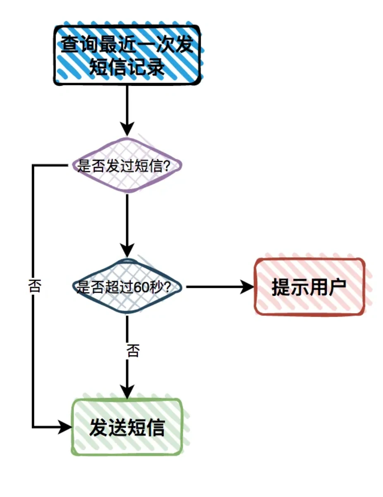
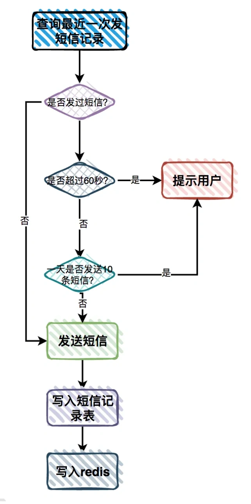

# 接口安全问题

## **<font style="color:rgb(34, 34, 34);background-color:rgb(248, 246, 244);">前言</font>**
<font style="color:rgb(51, 51, 51);background-color:rgb(248, 246, 244);">最近知识星球中有位小伙伴问了我一个问题：如何保证接口的安全性？</font>

<font style="color:rgb(51, 51, 51);background-color:rgb(248, 246, 244);">根据我多年的工作经验，这篇文章从11个方面给大家介绍一下保证接口安全的一些小技巧，希望对你会有所帮助。</font>

## **<font style="color:rgb(34, 34, 34);background-color:rgb(248, 246, 244);">1 参数校验</font>**
<font style="color:rgb(51, 51, 51);background-color:rgb(248, 246, 244);">保证接口安全的第一步，也是最重要的一步，需要对接口的请求参数做校验。</font>

<font style="color:rgb(51, 51, 51);background-color:rgb(248, 246, 244);">如果我们把接口请求参数的校验做好了，真的可以拦截大部分的无效请求。</font>

<font style="color:rgb(51, 51, 51);background-color:rgb(248, 246, 244);">我们可以按如下步骤做校验：</font>

1. <font style="color:rgb(51, 51, 51);background-color:rgb(248, 246, 244);">校验参数是否为空，有些接口中可能会包含多个参数，有些参数允许为空，有些参数不允许为空，我们需要对这些参数做校验，防止接口底层出现异常。</font>
2. <font style="color:rgb(51, 51, 51);background-color:rgb(248, 246, 244);">校验参数类型，比如：age是int类型的，用户传入了一个字符串："123abc"，这种情况参数不合法，需要被拦截。</font>
3. <font style="color:rgb(51, 51, 51);background-color:rgb(248, 246, 244);">校验参数的长度，特别是对于新增或者修改数据接口，必须要做参数长度的校验，否则超长了数据库会报异常。比如：数据库username字段长度是30，新用户注册时，输入了超过30个字符的名称，需要提示用户名称超长了。虽说前端会校验字段长度，但接口对参数长度的校验也必不可少。</font>
4. <font style="color:rgb(51, 51, 51);background-color:rgb(248, 246, 244);">校验枚举值，有些接口参数是枚举，比如：status，数据库中设计的该字段只有1、2、3三个值。如果用户传入了4，则需要提示用户参数错误。</font>
5. <font style="color:rgb(51, 51, 51);background-color:rgb(248, 246, 244);">校验数据范围，对于有些金额参数，需要校验数据范围，比如：单笔交易的money必须大于0，小于10000。</font>

<font style="color:rgb(51, 51, 51);background-color:rgb(248, 246, 244);">我们可以自己写代码，对每个接口的请求参数一一做校验。</font>

<font style="color:rgb(51, 51, 51);background-color:rgb(248, 246, 244);">也可以使用一些第三方的校验框架。</font>

<font style="color:rgb(51, 51, 51);background-color:rgb(248, 246, 244);">比如：hiberate的Validator框架，它里面包含了@Null、@NotEmpty、@Size、@Max、@Min等注解。</font>

<font style="color:rgb(51, 51, 51);background-color:rgb(248, 246, 244);">用它们校验数据非常方便。</font>

<font style="color:rgb(51, 51, 51);background-color:rgb(248, 246, 244);">当然有些日期字段和枚举字段，可能需要通过自定义注解的方式实现参数校验。</font>

## **<font style="color:rgb(34, 34, 34);background-color:rgb(248, 246, 244);">2 统一封装返回值</font>**
<font style="color:rgb(51, 51, 51);background-color:rgb(248, 246, 244);">可能有些小伙伴认为，对接口返回值统一封装是为了让代码更规范。</font>

<font style="color:rgb(51, 51, 51);background-color:rgb(248, 246, 244);">其实也是处于安全方面的考虑。</font>

<font style="color:rgb(51, 51, 51);background-color:rgb(248, 246, 244);">假如有这样一种场景：你写的某个接口底层的sql，在某种条件下有语法问题。某个用户请求接口之后，在访问数据库时，直接报了sql语法错误，将数据库名、表名、字段名、相关sql语句都打印出来了。</font>

<font style="color:rgb(51, 51, 51);background-color:rgb(248, 246, 244);">此时，如果你的接口将这些异常信息直接返回给外网的用户，有些黑客拿着这些信息，将参数做一些调整，拼接一些注入sql，可以对你的数据库发起攻击。</font>

<font style="color:rgb(51, 51, 51);background-color:rgb(248, 246, 244);">因此，非常有必要对接口的返回值做统一的封装。</font>

<font style="color:rgb(51, 51, 51);background-color:rgb(248, 246, 244);">例如下面这样：</font>

```json
{
    "code":0,
    "message":null,
    "data":[{"id":123,"name":"abc"}]
}
```

<font style="color:rgb(51, 51, 51);background-color:rgb(248, 246, 244);">该json返回值中定义了三个字段：</font>

+ <font style="color:rgb(51, 51, 51);background-color:rgb(248, 246, 244);">code：表示响应码，0-成功，1-参数为空，2-参数错误，3-签名错误 4-请求超时 5-服务器内部错误等。</font>
+ <font style="color:rgb(51, 51, 51);background-color:rgb(248, 246, 244);">message：表示提示信息，如果请求成功，则返回空。如果请求失败，则返回我们专门在代码中处理过，让用户能看懂的错误信息。</font>
+ <font style="color:rgb(51, 51, 51);background-color:rgb(248, 246, 244);">data：表示具体的数据，返回的是一个json字段。</font>

<font style="color:rgb(51, 51, 51);background-color:rgb(248, 246, 244);">对返回值这样封装之后，即使在接口的底层出现了数据库的异常，也不会直接提示用户，给用户提示的是服务器内部错误。</font>

<font style="color:rgb(51, 51, 51);background-color:rgb(248, 246, 244);">对返回值统一封装的工作，没有必要在业务代码中做，完全可以在放到API网关。</font>

<font style="color:rgb(51, 51, 51);background-color:rgb(248, 246, 244);">业务系统在出现异常时，抛出业务异常的RuntimeException，其中有个message字段定义异常信息。</font>

<font style="color:rgb(51, 51, 51);background-color:rgb(248, 246, 244);">所有的API接口都必须经过API网关，API网关捕获该业务异常，然后转换成统一的异常结构返回，这样能统一返回值结构。</font>

## **<font style="color:rgb(34, 34, 34);background-color:rgb(248, 246, 244);">3 做转义</font>**
<font style="color:rgb(51, 51, 51);background-color:rgb(248, 246, 244);">在用户自定义输入框，用户可以输入任意内容。</font>

<font style="color:rgb(51, 51, 51);background-color:rgb(248, 246, 244);">有些地方需要用html的格式显示用户输入的内容，比如文章详情页或者合同详情页，用户可以自定义文案和样式。</font>

<font style="color:rgb(51, 51, 51);background-color:rgb(248, 246, 244);">这些地方如果我们不做处理，可能会遭受XSS（Cross Site Scripting）攻击，也就是跨站脚本攻击。</font>

<font style="color:rgb(51, 51, 51);background-color:rgb(248, 246, 244);">攻击者可以在输入的内容中，增加脚本，比如：<script>alert("反射型 XSS 攻击")</script>，这样在访问合同详情页时，会弹出一个不需要的窗口，攻击者甚至可以引导用户访问一些恶意的链接。</font>

<font style="color:rgb(51, 51, 51);background-color:rgb(248, 246, 244);">由此，我们需要对用户输入内容中的一些特殊标签做转义。</font>

<font style="color:rgb(51, 51, 51);background-color:rgb(248, 246, 244);">下面这张图中列出了需要转义的常见字符和转义后的字符：</font>


<font style="color:rgb(51, 51, 51);background-color:rgb(248, 246, 244);">我们可以自定义一个转义注解，打上该注解的字段，表示需要转义。</font>

<font style="color:rgb(51, 51, 51);background-color:rgb(248, 246, 244);">有个专门的AOP拦截器，将用户的原始内容，转换成转义后的内容。</font>

<font style="color:rgb(51, 51, 51);background-color:rgb(248, 246, 244);">保存到数据库中是转义之后的内容。</font>

<font style="color:rgb(51, 51, 51);background-color:rgb(248, 246, 244);">除此之外，为了防止SQL注入的情况，也需要将用户输入的参数做SQL语句方面的转义。</font>

## **<font style="color:rgb(34, 34, 34);background-color:rgb(248, 246, 244);">4 做权限控制</font>**
<font style="color:rgb(51, 51, 51);background-color:rgb(248, 246, 244);">我们需要对接口做权限控制。</font>

<font style="color:rgb(51, 51, 51);background-color:rgb(248, 246, 244);">主要包含了下面3种情况。</font>

### **<font style="color:rgb(34, 34, 34);background-color:rgb(248, 246, 244);">4.1 校验是否登录</font>**
<font style="color:rgb(51, 51, 51);background-color:rgb(248, 246, 244);">对于用些公共数据，比如：外部分类，所有人都能够看到，不用登录也能看到。</font>

<font style="color:rgb(51, 51, 51);background-color:rgb(248, 246, 244);">对于这种接口，则不用校验登录。</font>

<font style="color:rgb(51, 51, 51);background-color:rgb(248, 246, 244);">而对于有些查看内部分类的接口，需要用户登录之后，才能访问。</font>

<font style="color:rgb(51, 51, 51);background-color:rgb(248, 246, 244);">这种情况就需要校验登录了。</font>

<font style="color:rgb(51, 51, 51);background-color:rgb(248, 246, 244);">可以从当前用户上下文中获取用户信息，校验用户是否登录。</font>

<font style="color:rgb(51, 51, 51);background-color:rgb(248, 246, 244);">如果用户登录了，当前用户上下文中该用户的信息不为空。</font>

<font style="color:rgb(51, 51, 51);background-color:rgb(248, 246, 244);">否则，如果用户没登录，则当前用户上下文中该用户的信息为空。</font>

### **<font style="color:rgb(34, 34, 34);background-color:rgb(248, 246, 244);">4.2 接口功能权限控制</font>**
<font style="color:rgb(51, 51, 51);background-color:rgb(248, 246, 244);">对于有些重要的接口，比如订单审核接口，只有拥有订单审核权限的运营账号，才有权限访问该接口。</font>

<font style="color:rgb(51, 51, 51);background-color:rgb(248, 246, 244);">我们需要对该接口做功能权限控制。</font>

<font style="color:rgb(51, 51, 51);background-color:rgb(248, 246, 244);">可以自定义一个权限注解，在注解上可以添加权限点。</font>

<font style="color:rgb(51, 51, 51);background-color:rgb(248, 246, 244);">在网关层有个拦截器，会根据当前请求的用户的权限，去跟请求的接口的权限做匹配，只有匹配上次允许访问该接口。</font>

### **<font style="color:rgb(34, 34, 34);background-color:rgb(248, 246, 244);">4.3 接口数据权限控制</font>**
<font style="color:rgb(51, 51, 51);background-color:rgb(248, 246, 244);">对于有些订单查询接口，普通运营只能查看普通用户的数据。</font>

<font style="color:rgb(51, 51, 51);background-color:rgb(248, 246, 244);">而运营经理可以查看普通用户和vip用户的数据。</font>

<font style="color:rgb(51, 51, 51);background-color:rgb(248, 246, 244);">这种情况我们需要对该订单查询接口做数据权限控制。</font>

<font style="color:rgb(51, 51, 51);background-color:rgb(248, 246, 244);">不同的角色，能够查看的数据范围不同。</font>

<font style="color:rgb(51, 51, 51);background-color:rgb(248, 246, 244);">可以在查询数据时，在sql语句中动态拼接过滤数据权限的sql。</font>

## **<font style="color:rgb(34, 34, 34);background-color:rgb(248, 246, 244);">5 加验证码</font>**
<font style="color:rgb(51, 51, 51);background-color:rgb(248, 246, 244);">对于一些非常重要的接口，在做接口设计的时候，要考虑恶意用户刷接口的情况。</font>

<font style="color:rgb(51, 51, 51);background-color:rgb(248, 246, 244);">最早的用户注册接口，是需要用图形验证码校验的，比如下面这样的：</font>


<font style="color:rgb(51, 51, 51);background-color:rgb(248, 246, 244);">用户只需要输入：账号名称、密码和验证码即可，完成注册。</font>

<font style="color:rgb(51, 51, 51);background-color:rgb(248, 246, 244);">其中账号名称作为用户的唯一标识。</font>

<font style="color:rgb(51, 51, 51);background-color:rgb(248, 246, 244);">但有些图形验证码比较简单，很容易被一些暴力破解工具破解。</font>

<font style="color:rgb(51, 51, 51);background-color:rgb(248, 246, 244);">由此，要给图形验证码增加难道，增加一些干扰项，增加暴力破解工具的难道。</font>

<font style="color:rgb(51, 51, 51);background-color:rgb(248, 246, 244);">但有个问题是：如果图形验证码太复杂了，会对正常用户使用造成一点的困扰，增加了用户注册的成本，让用户注册功能的效果会大打折扣。</font>

<font style="color:rgb(51, 51, 51);background-color:rgb(248, 246, 244);">因此，仅靠图形验证码，防止用户注册接口被刷，难道太大了。</font>

<font style="color:rgb(51, 51, 51);background-color:rgb(248, 246, 244);">后来，又出现了一种移动滑块形式的图形验证方式，安全性更高。</font>


<font style="color:rgb(51, 51, 51);background-color:rgb(248, 246, 244);">此外，使用验证码比较多的地方是发手机短信的功能。</font>

<font style="color:rgb(51, 51, 51);background-color:rgb(248, 246, 244);">发手机短信的功能，一般是购买的云服务厂商的短信服务，按次收费，比如：发一条短信0.1元。</font>

<font style="color:rgb(51, 51, 51);background-color:rgb(248, 246, 244);">如果发送短信的接口，不做限制，被用户恶意调用，可能会产生非常昂贵的费用。</font>

## **<font style="color:rgb(34, 34, 34);background-color:rgb(248, 246, 244);">6 限流</font>**
<font style="color:rgb(51, 51, 51);background-color:rgb(248, 246, 244);">上一节中提到的发送短信接口，只校验验证码还不够，还需要对用户请求做限流。</font>

<font style="color:rgb(51, 51, 51);background-color:rgb(248, 246, 244);">从页面上的验证码，只能限制当前页面的不能重复发短信，但如果用户刷新了页面，也可以重新发短信。</font>

<font style="color:rgb(51, 51, 51);background-color:rgb(248, 246, 244);">因此非常有必要在服务端，即：发送短信接口做限制。</font>

<font style="color:rgb(51, 51, 51);background-color:rgb(248, 246, 244);">我们可以增加一张短信发送表。</font>

<font style="color:rgb(51, 51, 51);background-color:rgb(248, 246, 244);">该表包含：id、短信类型、短信内容、手机号、发送时间等字段。</font>



<font style="color:rgb(51, 51, 51);background-color:rgb(248, 246, 244);">有用户发送短信请求过来时：</font>

1. <font style="color:rgb(51, 51, 51);background-color:rgb(248, 246, 244);">先查询该手机号最近一次发送短信的记录</font>
2. <font style="color:rgb(51, 51, 51);background-color:rgb(248, 246, 244);">如果没有发送过，则发送短信。</font>
3. <font style="color:rgb(51, 51, 51);background-color:rgb(248, 246, 244);">如果该手机号已经发送过短信，但发送时间跟当前时间比超过了60秒，则重新发送一条新的短信。</font>
4. <font style="color:rgb(51, 51, 51);background-color:rgb(248, 246, 244);">如果发送时间跟当前时间比没超过60秒，则直接提示用户操作太频繁，请稍后重试。</font>

<font style="color:rgb(51, 51, 51);background-color:rgb(248, 246, 244);">这样就能非常有效的防止恶意用户刷短信的行为。</font>

<font style="color:rgb(51, 51, 51);background-color:rgb(248, 246, 244);">但还是有漏洞。</font>

<font style="color:rgb(51, 51, 51);background-color:rgb(248, 246, 244);">比如：用户知道在60秒以内，是没法重复发短信的。他有个程序，刚好每隔60秒发一条短信。</font>

<font style="color:rgb(51, 51, 51);background-color:rgb(248, 246, 244);">这样1个手机号在一天内可以发：60*24 = 1440 条短信。</font>

<font style="color:rgb(51, 51, 51);background-color:rgb(248, 246, 244);">如果他有100个手机号，那么一天也可以刷你很多条短信。</font>

<font style="color:rgb(51, 51, 51);background-color:rgb(248, 246, 244);">由此，还需要限制每天同一个手机号可以发的短信次数。</font>

<font style="color:rgb(51, 51, 51);background-color:rgb(248, 246, 244);">其实可以用redis来做。</font>

<font style="color:rgb(51, 51, 51);background-color:rgb(248, 246, 244);">用户发短信之后，在redis中保存一条记录，key是手机号，value是发短信的次数，过期时间是24小时。</font>

<font style="color:rgb(51, 51, 51);background-color:rgb(248, 246, 244);">这样在发送短信之前，要先查询一下，当天发送短信的次数是否超过10次（假设同一个手机号一天最多允许发10条短信）。</font>

<font style="color:rgb(51, 51, 51);background-color:rgb(248, 246, 244);">如果超过10次，则直接提示用户操作太频繁，请稍后重试。</font>

<font style="color:rgb(51, 51, 51);background-color:rgb(248, 246, 244);">如果没超过10次，则发送短信，并且把redis中该手机号对应的value值加1。</font>

<font style="color:rgb(51, 51, 51);background-color:rgb(248, 246, 244);">短信发送接口完整的校验流程如下：</font>



## **<font style="color:rgb(34, 34, 34);background-color:rgb(248, 246, 244);">7 加ip白名单</font>**
<font style="color:rgb(51, 51, 51);background-color:rgb(248, 246, 244);">对于有些非常重要的基础性的接口，比如：会员系统的开通会员接口，业务系统可能会调用该接口开通会员。</font>

<font style="color:rgb(51, 51, 51);background-color:rgb(248, 246, 244);">会员系统为了安全性考虑，在设计开通会员接口的时候，可能会加一个ip白名单，对非法的服务器请求进行拦截。</font>

<font style="color:rgb(51, 51, 51);background-color:rgb(248, 246, 244);">这个ip白名单前期可以做成一个Apollo配置，可以动态生效。</font>

<font style="color:rgb(51, 51, 51);background-color:rgb(248, 246, 244);">如果后期ip数量多了的话，可以直接保存到数据库。</font>

<font style="color:rgb(51, 51, 51);background-color:rgb(248, 246, 244);">只有ip在白名单中的那些服务器，才允许调用开通会员接口。</font>

<font style="color:rgb(51, 51, 51);background-color:rgb(248, 246, 244);">这样即使开通会员接口地址和请求参数被泄露了，调用者的ip不在白名单上，请求开通会员接口会直接失败。</font>

<font style="color:rgb(51, 51, 51);background-color:rgb(248, 246, 244);">除非调用者登录到了某一个白名单ip的对应的服务器，这种情况极少，因为一般运维会设置对访问器访问的防火墙。</font>

<font style="color:rgb(51, 51, 51);background-color:rgb(248, 246, 244);">当然如果用了Fegin这种走内部域名的方式访问接口，可以不用设置ip白名单，内部域名只有在公司的内部服务器之间访问，外面的用户根本访问不了。</font>

<font style="color:rgb(51, 51, 51);background-color:rgb(248, 246, 244);">但对于一些第三方平台的接口，他们更多的是通过设置ip白名单的方式保证接口的安全性。</font>

## **<font style="color:rgb(34, 34, 34);background-color:rgb(248, 246, 244);">8 校验敏感词</font>**
<font style="color:rgb(51, 51, 51);background-color:rgb(248, 246, 244);">对于某些用户可以自定义内容的接口，还需要对用户输入的内容做敏感词校验。</font>

<font style="color:rgb(51, 51, 51);background-color:rgb(248, 246, 244);">比如：在创建商品页面，用户输入了：傻逼商品，结果直接显示到了商城的商品列表页面，这种情况肯定是不被允许的。</font>

<font style="color:rgb(51, 51, 51);background-color:rgb(248, 246, 244);">当然你也可以做一个审核功能，对用户创建的商品信息做人工审核，如果商品数量太多，这样会浪费很多人力。</font>

<font style="color:rgb(51, 51, 51);background-color:rgb(248, 246, 244);">有个比较好的做法是：对用户自定义的内容，做敏感词校验。</font>

<font style="color:rgb(51, 51, 51);background-color:rgb(248, 246, 244);">可以调用第三方平台的接口，也可以自己实现一个敏感词校验接口。</font>

<font style="color:rgb(51, 51, 51);background-color:rgb(248, 246, 244);">可以在GitHub上下载一个开源的敏感词库，将那些敏感词导入到数据库中。</font>

<font style="color:rgb(51, 51, 51);background-color:rgb(248, 246, 244);">然后使用hanlp对用户输入的内容，进行分词。对分好的词，去匹配敏感词库中的那些敏感词。</font>

<font style="color:rgb(51, 51, 51);background-color:rgb(248, 246, 244);">如果匹配上了，则说明是敏感词，则验证不通过。</font>

<font style="color:rgb(51, 51, 51);background-color:rgb(248, 246, 244);">如果没有匹配上，则说明非敏感词，则验证通过。</font>

<font style="color:rgb(51, 51, 51);background-color:rgb(248, 246, 244);">不可能在每个业务接口中都调用敏感词校验接口，我们可以自定义注解，在AOP拦截器中调用敏感词校验接口。</font>

<font style="color:rgb(51, 51, 51);background-color:rgb(248, 246, 244);">在调用业务接口之前，先触发拦截器，校验打了敏感词校验注解的那些字段，将他们里面包含的内容，作为入参传入敏感词校验接口做校验。</font>

<font style="color:rgb(51, 51, 51);background-color:rgb(248, 246, 244);">当然有时候hanlp分词器会把句子分错词，还需要添加一个敏感词的白名单，白名单中的词不是敏感词。</font>

## **<font style="color:rgb(34, 34, 34);background-color:rgb(248, 246, 244);">9 使用https协议</font>**
<font style="color:rgb(51, 51, 51);background-color:rgb(248, 246, 244);">以前很多接口使用的是HTTP（HyperText Transport Protocol，即超文本传输协议）协议，它用于传输客户端和服务器端的数据。</font>

<font style="color:rgb(51, 51, 51);background-color:rgb(248, 246, 244);">虽说HTTP使用很简单也很方便，但却存在以下3个致命问题：</font>

1. <font style="color:rgb(51, 51, 51);background-color:rgb(248, 246, 244);">使用明文通讯，内容容易被窃听。</font>
2. <font style="color:rgb(51, 51, 51);background-color:rgb(248, 246, 244);">不验证通讯方的真实身份，容易遭到伪装。</font>
3. <font style="color:rgb(51, 51, 51);background-color:rgb(248, 246, 244);">无法证明报文的完整性，报文很容易被篡改。</font>

<font style="color:rgb(51, 51, 51);background-color:rgb(248, 246, 244);">为了解决HTTP协议的这些问题，出现了HTTPS协议。</font>

<font style="color:rgb(51, 51, 51);background-color:rgb(248, 246, 244);">HTTPS协议是在HTTP协议的基础上，添加了加密机制：</font>

+ <font style="color:rgb(51, 51, 51);background-color:rgb(248, 246, 244);">SSL：它是Secure Socket Layer的缩写， 表示安全套接层。</font>
+ <font style="color:rgb(51, 51, 51);background-color:rgb(248, 246, 244);">TLS：它是Transport Layer Security的缩写，表示传输层安全。</font>

<font style="color:rgb(51, 51, 51);background-color:rgb(248, 246, 244);">HTTPS = HTTP + 加密 + 认证 + 完整性保护。</font>

<font style="color:rgb(51, 51, 51);background-color:rgb(248, 246, 244);">为了安全性考虑，我们的接口如果能使用HTTPS协议，尽量少使用HTTP协议。</font>

<font style="color:rgb(51, 51, 51);background-color:rgb(248, 246, 244);">如果你访问过一些大厂的网站，会发现他们提供的接口，都是使用的HTTPS协议。</font>

<font style="color:rgb(51, 51, 51);background-color:rgb(248, 246, 244);">不过需要注意的地方是：HTTPS协议需要申请证书，有些额外的费用。</font>

## **<font style="color:rgb(34, 34, 34);background-color:rgb(248, 246, 244);">10 数据加密</font>**
<font style="color:rgb(51, 51, 51);background-color:rgb(248, 246, 244);">有些信息是用户的核心信息，比如：手机号、邮箱、密码、身份证、银行卡号等，不能别泄露出去。</font>

<font style="color:rgb(51, 51, 51);background-color:rgb(248, 246, 244);">在保存到数据库时，我们要将这些字段，做加密处理。</font>

<font style="color:rgb(51, 51, 51);background-color:rgb(248, 246, 244);">后面即使这些数据被泄露了，获得数据的人，由于没有密钥，没办法解密。</font>

<font style="color:rgb(51, 51, 51);background-color:rgb(248, 246, 244);">这种情况可以使用AES对称加密的方式，因为后面系统的有些业务场景，需要把加密的数据解密出来。</font>

<font style="color:rgb(51, 51, 51);background-color:rgb(248, 246, 244);">为了安全性考虑，我们需要设置一个用于加密的密钥，这个密钥可以稍微复杂一点，包含一些数字、字母和特殊字符。</font>

<font style="color:rgb(51, 51, 51);background-color:rgb(248, 246, 244);">我们同样可以通过自定义注解的方式，给需要加密的字段添加该注解，在Mybatis拦截器中实现加解密的功能。</font>

<font style="color:rgb(51, 51, 51);background-color:rgb(248, 246, 244);">对于查询操作，需要将加了该注解的字段的数据做解密处理。</font>

<font style="color:rgb(51, 51, 51);background-color:rgb(248, 246, 244);">对于写入操作，要将加了该注解的字段的数据做加密处理。</font>

<font style="color:rgb(51, 51, 51);background-color:rgb(248, 246, 244);">有些页面显示的地方，手机号一般不会显示完整的手机号，中间有一部分用*代替，比如：182***3457。</font>

<font style="color:rgb(51, 51, 51);background-color:rgb(248, 246, 244);">这种情况需要做特殊处理。</font>

## **<font style="color:rgb(34, 34, 34);background-color:rgb(248, 246, 244);">11 做风险控制</font>**
<font style="color:rgb(51, 51, 51);background-color:rgb(248, 246, 244);">有些特殊的接口，比如用户登录接口，我们需要对该接口做风险控制，尽可能减小被盗号的风险。</font>

<font style="color:rgb(51, 51, 51);background-color:rgb(248, 246, 244);">用户登录失败之后，需要有地方，比如：Redis，记录用户登录失败的次数。</font>

<font style="color:rgb(51, 51, 51);background-color:rgb(248, 246, 244);">如果用户第一次输入账号密码登录时，出现的是一个稍微简单的验证码。</font>

<font style="color:rgb(51, 51, 51);background-color:rgb(248, 246, 244);">如果用户把账号或密码连续输错3次之后，出现了更复杂的验证码。</font>

<font style="color:rgb(51, 51, 51);background-color:rgb(248, 246, 244);">或者改成使用手机短信验证。</font>

<font style="color:rgb(51, 51, 51);background-color:rgb(248, 246, 244);">如果用户在一天之内，把账号或密码连续输错10次，则直接锁定该账号。</font>

<font style="color:rgb(51, 51, 51);background-color:rgb(248, 246, 244);">这样处理是为了防止有人用一些软件，暴力破解账号和密码。</font>

<font style="color:rgb(51, 51, 51);background-color:rgb(248, 246, 244);">在用户登录成功之后，需要有一张表记录用户的ip、所在城市和登录的设备id。</font>

<font style="color:rgb(51, 51, 51);background-color:rgb(248, 246, 244);">如果你的账号被盗了。</font>

<font style="color:rgb(51, 51, 51);background-color:rgb(248, 246, 244);">在盗号者在页面输入账号密码登录，会调用登录接口，此时登录接口中可以根据用户的ip和设备id，做一些风险控制。</font>

<font style="color:rgb(51, 51, 51);background-color:rgb(248, 246, 244);">接口判断如果用户当前登录的ip、所在城市和设备ip，跟上一次登录成功时记录的相差非常大。</font>

<font style="color:rgb(51, 51, 51);background-color:rgb(248, 246, 244);">比如：1小时之前，用的ip是100.101.101.101，城市是北京，设备id是1001，而1小时之后，用的ip是200.202.202.101，城市是广州，设备id是2002。</font>

<font style="color:rgb(51, 51, 51);background-color:rgb(248, 246, 244);">这种情况用户的账号极有可能被盗了。</font>

<font style="color:rgb(51, 51, 51);background-color:rgb(248, 246, 244);">登录接口做安全性升级，需要校验用户手机验证码才能登录成功。</font>

<font style="color:rgb(51, 51, 51);background-color:rgb(248, 246, 244);">由于盗号者只有你的账号和密码，没有手机验证码，所以即使被盗号了，也没办法登录成功。</font>

<font style="color:rgb(0, 0, 0);background-color:rgb(248, 246, 244);">  
</font>


> 更新: 2024-05-20 17:18:44  
> 原文: <https://www.yuque.com/yuqueyonghue6cvnv/cxhfwd/sr91vugpeh67xlm5>