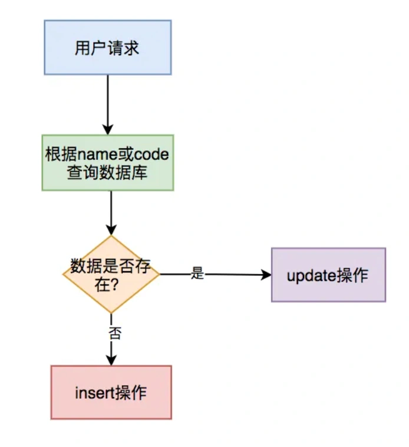
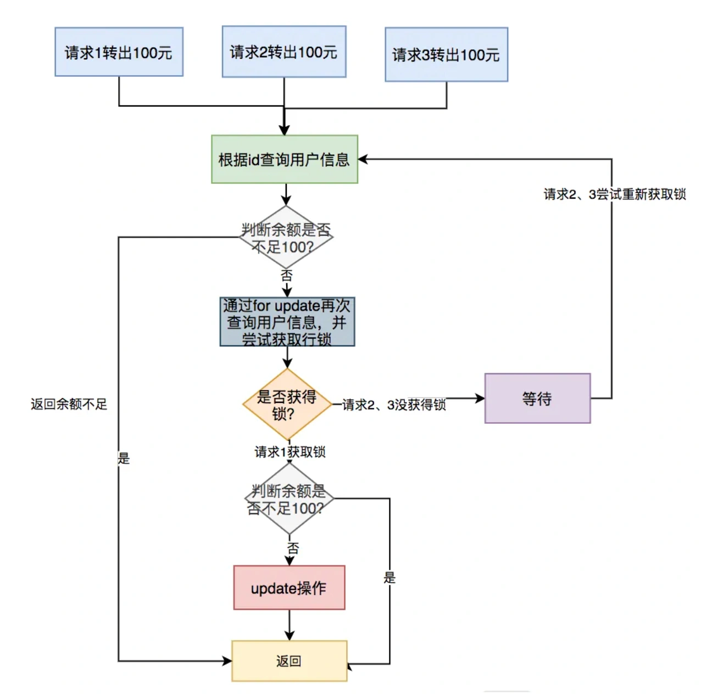
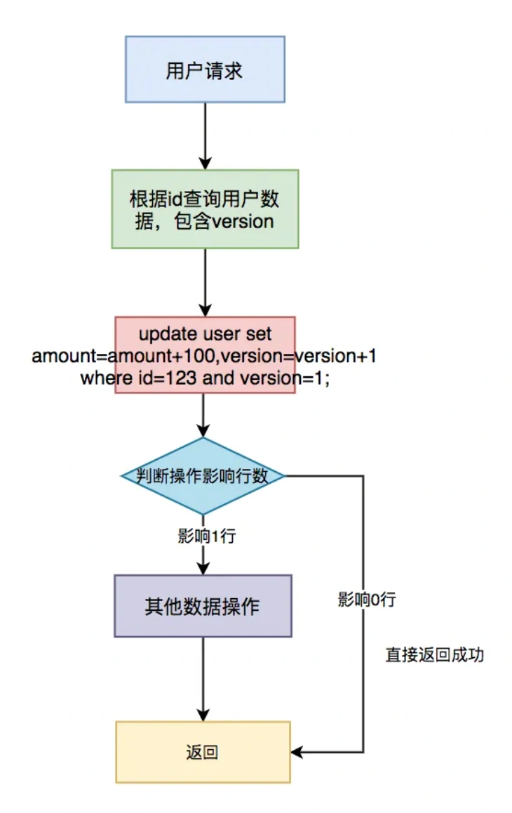
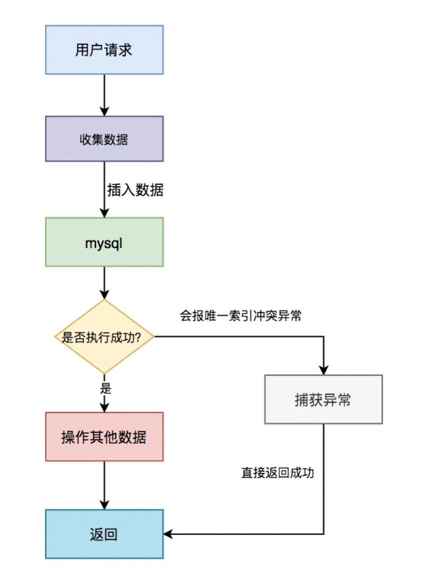
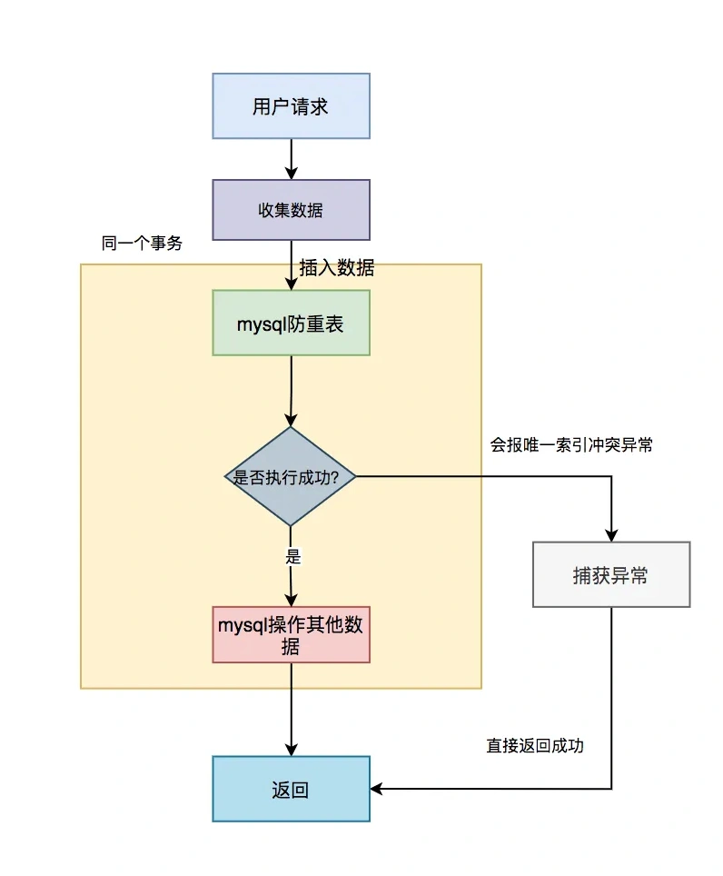
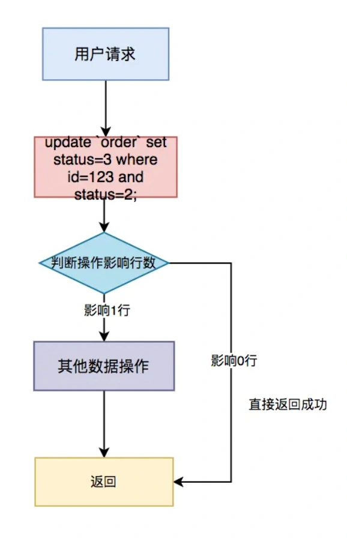
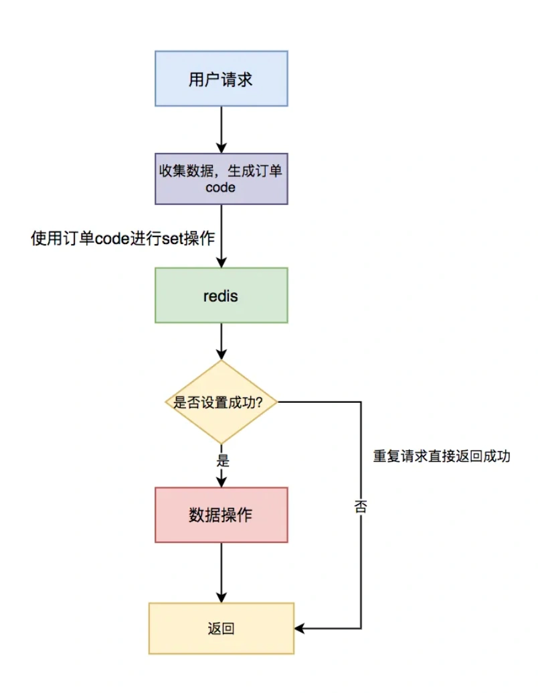
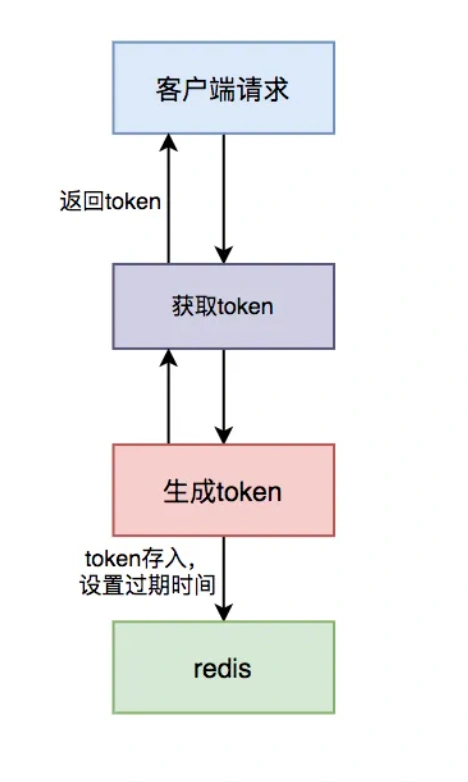
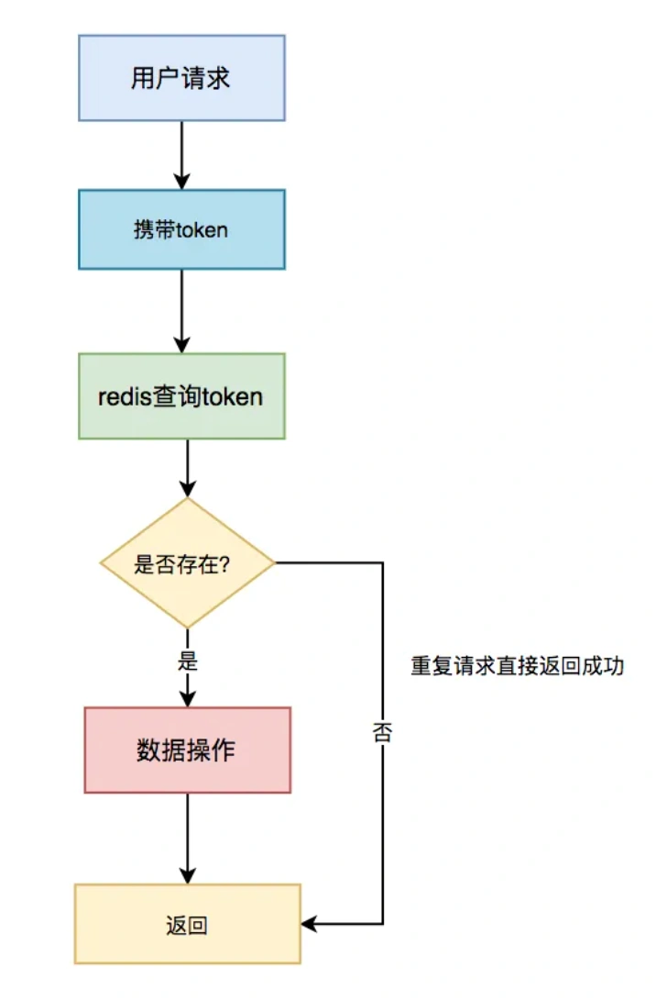
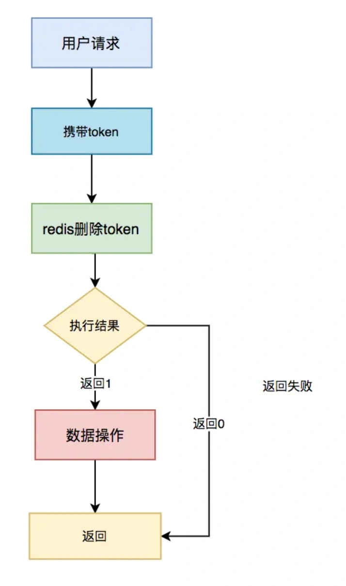

# 接口幂等性问题

<font style="color:rgb(51, 51, 51);background-color:rgb(248, 246, 244);">接口幂等性问题，对于开发人员来说，是一个跟语言无关的公共问题。本文分享了一些解决这类问题非常实用的办法，绝大部分内容我在项目中实践过的，给有需要的小伙伴一个参考。</font>

<font style="color:rgb(51, 51, 51);background-color:rgb(248, 246, 244);">不知道你有没有遇到过这些场景：</font>

1. <font style="color:rgb(51, 51, 51);background-color:rgb(248, 246, 244);">有时我们在填写某些form表单时，保存按钮不小心快速点了两次，表中竟然产生了两条重复的数据，只是id不一样。</font>
2. <font style="color:rgb(51, 51, 51);background-color:rgb(248, 246, 244);">我们在项目中为了解决接口超时问题，通常会引入了重试机制。第一次请求接口超时了，请求方没能及时获取返回结果（此时有可能已经成功了），为了避免返回错误的结果（这种情况不可能直接返回失败吧？），于是会对该请求重试几次，这样也会产生重复的数据。</font>
3. <font style="color:rgb(51, 51, 51);background-color:rgb(248, 246, 244);">mq消费者在读取消息时，有时候会读取到重复消息（至于什么原因这里先不说，有兴趣的小伙伴，可以找我私聊），如果处理不好，也会产生重复的数据。</font>

<font style="color:rgb(51, 51, 51);background-color:rgb(248, 246, 244);">没错，这些都是幂等性问题。</font>

<font style="color:rgb(51, 51, 51);background-color:rgb(248, 246, 244);">接口幂等性是指用户对于同一操作发起的一次请求或者多次请求的结果是一致的，不会因为多次点击而产生了副作用。</font>

<font style="color:rgb(51, 51, 51);background-color:rgb(248, 246, 244);">这类问题多发于接口的：</font>

+ <font style="color:rgb(51, 51, 51);background-color:rgb(248, 246, 244);">insert操作，这种情况下多次请求，可能会产生重复数据。</font>
+ <font style="color:rgb(51, 51, 51);background-color:rgb(248, 246, 244);">update操作，如果只是单纯的更新数据，比如：update user set status=1 where id=1，是没有问题的。如果还有计算，比如：update user set status=status+1 where id=1，这种情况下多次请求，可能会导致数据错误。</font>

<font style="color:rgb(51, 51, 51);background-color:rgb(248, 246, 244);">那么我们要如何保证接口幂等性？本文将会告诉你答案。</font>

## **<font style="color:rgb(34, 34, 34);background-color:rgb(248, 246, 244);">1. insert前先select</font>**
<font style="color:rgb(51, 51, 51);background-color:rgb(248, 246, 244);">通常情况下，在保存数据的接口中，我们为了防止产生重复数据，一般会在insert前，先根据name或code字段select一下数据。如果该数据已存在，则执行update操作，如果不存在，才执行  insert操作。</font>



<font style="color:rgb(51, 51, 51);background-color:rgb(248, 246, 244);">该方案可能是我们平时在防止产生重复数据时，使用最多的方案。但是该方案不适用于并发场景，在并发场景中，要配合其他方案一起使用，否则同样会产生重复数据。我在这里提一下，是为了避免大家踩坑。</font>

## **<font style="color:rgb(34, 34, 34);background-color:rgb(248, 246, 244);">2. 加悲观锁</font>**
<font style="color:rgb(51, 51, 51);background-color:rgb(248, 246, 244);">在支付场景中，用户A的账号余额有150元，想转出100元，正常情况下用户A的余额只剩50元。一般情况下，sql是这样的：</font>

```plain
update user amount = amount-100 where id=123;
```

<font style="color:rgb(51, 51, 51);background-color:rgb(248, 246, 244);">如果出现多次相同的请求，可能会导致用户A的余额变成负数。这种情况，用户A来可能要哭了。于此同时，系统开发人员可能也要哭了，因为这是很严重的系统bug。</font>

<font style="color:rgb(51, 51, 51);background-color:rgb(248, 246, 244);">为了解决这个问题，可以加悲观锁，将用户A的那行数据锁住，在同一时刻只允许一个请求获得锁，更新数据，其他的请求则等待。</font>

<font style="color:rgb(51, 51, 51);background-color:rgb(248, 246, 244);">通常情况下通过如下sql锁住单行数据：</font>

```plain
select * from user id=123 for update;
```

<font style="color:rgb(51, 51, 51);background-color:rgb(248, 246, 244);">具体流程如下：</font>



<font style="color:rgb(51, 51, 51);background-color:rgb(248, 246, 244);">具体步骤：</font>

1. <font style="color:rgb(51, 51, 51);background-color:rgb(248, 246, 244);">多个请求同时根据id查询用户信息。</font>
2. <font style="color:rgb(51, 51, 51);background-color:rgb(248, 246, 244);">判断余额是否不足100，如果余额不足，则直接返回余额不足。</font>
3. <font style="color:rgb(51, 51, 51);background-color:rgb(248, 246, 244);">如果余额充足，则通过for update再次查询用户信息，并且尝试获取锁。</font>
4. <font style="color:rgb(51, 51, 51);background-color:rgb(248, 246, 244);">只有第一个请求能获取到行锁，其余没有获取锁的请求，则等待下一次获取锁的机会。</font>
5. <font style="color:rgb(51, 51, 51);background-color:rgb(248, 246, 244);">第一个请求获取到锁之后，判断余额是否不足100，如果余额足够，则进行update操作。</font>
6. <font style="color:rgb(51, 51, 51);background-color:rgb(248, 246, 244);">如果余额不足，说明是重复请求，则直接返回成功。</font>

<font style="color:rgb(100, 100, 100);background-color:rgb(248, 246, 244);">需要特别注意的是：如果使用的是mysql数据库，存储引擎必须用innodb，因为它才支持事务。此外，这里id字段一定要是主键或者唯一索引，不然会锁住整张表。</font>

<font style="color:rgb(51, 51, 51);background-color:rgb(248, 246, 244);">悲观锁需要在同一个事务操作过程中锁住一行数据，如果事务耗时比较长，会造成大量的请求等待，影响接口性能。</font>

<font style="color:rgb(51, 51, 51);background-color:rgb(248, 246, 244);">此外，每次请求接口很难保证都有相同的返回值，所以不适合幂等性设计场景，但是在防重场景中是可以的使用的。</font>

<font style="color:rgb(51, 51, 51);background-color:rgb(248, 246, 244);">在这里顺便说一下，防重设计 和 幂等设计，其实是有区别的。防重设计主要为了避免产生重复数据，对接口返回没有太多要求。而幂等设计除了避免产生重复数据之外，还要求每次请求都返回一样的结果。</font>

## **<font style="color:rgb(34, 34, 34);background-color:rgb(248, 246, 244);">3. 加乐观锁</font>**
<font style="color:rgb(51, 51, 51);background-color:rgb(248, 246, 244);">既然悲观锁有性能问题，为了提升接口性能，我们可以使用乐观锁。需要在表中增加一个timestamp或者version字段，这里以version字段为例。</font>

<font style="color:rgb(51, 51, 51);background-color:rgb(248, 246, 244);">在更新数据之前先查询一下数据：</font>

```plain
select id,amount,version from user id=123;
```

<font style="color:rgb(51, 51, 51);background-color:rgb(248, 246, 244);">如果数据存在，假设查到的version等于1，再使用id和version字段作为查询条件更新数据：</font>

```plain
update user set amount=amount+100,version=version+1where id=123 and version=1;
```

<font style="color:rgb(51, 51, 51);background-color:rgb(248, 246, 244);">更新数据的同时version+1，然后判断本次update操作的影响行数，如果大于0，则说明本次更新成功，如果等于0，则说明本次更新没有让数据变更。</font>

<font style="color:rgb(51, 51, 51);background-color:rgb(248, 246, 244);">由于第一次请求version等于1是可以成功的，操作成功后version变成2了。这时如果并发的请求过来，再执行相同的sql：</font>

```plain
update user set amount=amount+100,version=version+1where id=123 and version=1;
```

<font style="color:rgb(51, 51, 51);background-color:rgb(248, 246, 244);">该update操作不会真正更新数据，最终sql的执行结果影响行数是0，因为version已经变成2了，where中的version=1肯定无法满足条件。但为了保证接口幂等性，接口可以直接返回成功，因为version值已经修改了，那么前面必定已经成功过一次，后面都是重复的请求。</font>

<font style="color:rgb(51, 51, 51);background-color:rgb(248, 246, 244);">具体流程如下：</font>



<font style="color:rgb(51, 51, 51);background-color:rgb(248, 246, 244);">具体步骤：</font>

1. <font style="color:rgb(51, 51, 51);background-color:rgb(248, 246, 244);">先根据id查询用户信息，包含version字段</font>
2. <font style="color:rgb(51, 51, 51);background-color:rgb(248, 246, 244);">根据id和version字段值作为where条件的参数，更新用户信息，同时version+1</font>
3. <font style="color:rgb(51, 51, 51);background-color:rgb(248, 246, 244);">判断操作影响行数，如果影响1行，则说明是一次请求，可以做其他数据操作。</font>
4. <font style="color:rgb(51, 51, 51);background-color:rgb(248, 246, 244);">如果影响0行，说明是重复请求，则直接返回成功。</font>

## **<font style="color:rgb(34, 34, 34);background-color:rgb(248, 246, 244);">4. 加唯一索引</font>**
<font style="color:rgb(51, 51, 51);background-color:rgb(248, 246, 244);">绝大数情况下，为了防止重复数据的产生，我们都会在表中加唯一索引，这是一个非常简单，并且有效的方案。</font>

```plain
alter table `order` add UNIQUE KEY `un_code` (`code`);
```

<font style="color:rgb(51, 51, 51);background-color:rgb(248, 246, 244);">加了唯一索引之后，第一次请求数据可以插入成功。但后面的相同请求，插入数据时会报Duplicate entry '002' for key 'order.un_code异常，表示唯一索引有冲突。</font>

<font style="color:rgb(51, 51, 51);background-color:rgb(248, 246, 244);">虽说抛异常对数据来说没有影响，不会造成错误数据。但是为了保证接口幂等性，我们需要对该异常进行捕获，然后返回成功。</font>

<font style="color:rgb(51, 51, 51);background-color:rgb(248, 246, 244);">如果是java程序需要捕获：DuplicateKeyException异常，如果使用了spring框架还需要捕获：MySQLIntegrityConstraintViolationException异常。</font>

<font style="color:rgb(51, 51, 51);background-color:rgb(248, 246, 244);">具体流程图如下：</font>



<font style="color:rgb(51, 51, 51);background-color:rgb(248, 246, 244);">具体步骤：</font>

1. <font style="color:rgb(51, 51, 51);background-color:rgb(248, 246, 244);">用户通过浏览器发起请求，服务端收集数据。</font>
2. <font style="color:rgb(51, 51, 51);background-color:rgb(248, 246, 244);">将该数据插入mysql</font>
3. <font style="color:rgb(51, 51, 51);background-color:rgb(248, 246, 244);">判断是否执行成功，如果成功，则操作其他数据（可能还有其他的业务逻辑）。</font>
4. <font style="color:rgb(51, 51, 51);background-color:rgb(248, 246, 244);">如果执行失败，捕获唯一索引冲突异常，直接返回成功。</font>

## **<font style="color:rgb(34, 34, 34);background-color:rgb(248, 246, 244);">5. 建防重表</font>**
<font style="color:rgb(51, 51, 51);background-color:rgb(248, 246, 244);">有时候表中并非所有的场景都不允许产生重复的数据，只有某些特定场景才不允许。这时候，直接在表中加唯一索引，显然是不太合适的。</font>

<font style="color:rgb(51, 51, 51);background-color:rgb(248, 246, 244);">针对这种情况，我们可以通过建防重表来解决问题。</font>

<font style="color:rgb(51, 51, 51);background-color:rgb(248, 246, 244);">该表可以只包含两个字段：id 和 唯一索引，唯一索引可以是多个字段比如：name、code等组合起来的唯一标识，例如：susan_0001。</font>

<font style="color:rgb(51, 51, 51);background-color:rgb(248, 246, 244);">具体流程图如下：</font>



<font style="color:rgb(51, 51, 51);background-color:rgb(248, 246, 244);">具体步骤：</font>

1. <font style="color:rgb(51, 51, 51);background-color:rgb(248, 246, 244);">用户通过浏览器发起请求，服务端收集数据。</font>
2. <font style="color:rgb(51, 51, 51);background-color:rgb(248, 246, 244);">将该数据插入mysql防重表</font>
3. <font style="color:rgb(51, 51, 51);background-color:rgb(248, 246, 244);">判断是否执行成功，如果成功，则做mysql其他的数据操作（可能还有其他的业务逻辑）。</font>
4. <font style="color:rgb(51, 51, 51);background-color:rgb(248, 246, 244);">如果执行失败，捕获唯一索引冲突异常，直接返回成功。</font>

<font style="color:rgb(100, 100, 100);background-color:rgb(248, 246, 244);">需要特别注意的是：防重表和业务表必须在同一个数据库中，并且操作要在同一个事务中。</font>

## **<font style="color:rgb(34, 34, 34);background-color:rgb(248, 246, 244);">6. 根据状态机</font>**
<font style="color:rgb(51, 51, 51);background-color:rgb(248, 246, 244);">很多时候业务表是有状态的，比如订单表中有：1-下单、2-已支付、3-完成、4-撤销等状态。如果这些状态的值是有规律的，按照业务节点正好是从小到大，我们就能通过它来保证接口的幂等性。</font>

<font style="color:rgb(51, 51, 51);background-color:rgb(248, 246, 244);">假如id=123的订单状态是已支付，现在要变成完成状态。</font>

```plain
update `order` set status=3 where id=123 and status=2;
```

<font style="color:rgb(51, 51, 51);background-color:rgb(248, 246, 244);">第一次请求时，该订单的状态是已支付，值是2，所以该update语句可以正常更新数据，sql执行结果的影响行数是1，订单状态变成了3。</font>

<font style="color:rgb(51, 51, 51);background-color:rgb(248, 246, 244);">后面有相同的请求过来，再执行相同的sql时，由于订单状态变成了3，再用status=2作为条件，无法查询出需要更新的数据，所以最终sql执行结果的影响行数是0，即不会真正的更新数据。但为了保证接口幂等性，影响行数是0时，接口也可以直接返回成功。</font>

<font style="color:rgb(51, 51, 51);background-color:rgb(248, 246, 244);">具体流程图如下：</font>



<font style="color:rgb(51, 51, 51);background-color:rgb(248, 246, 244);">具体步骤：</font>

1. <font style="color:rgb(51, 51, 51);background-color:rgb(248, 246, 244);">用户通过浏览器发起请求，服务端收集数据。</font>
2. <font style="color:rgb(51, 51, 51);background-color:rgb(248, 246, 244);">根据id和当前状态作为条件，更新成下一个状态</font>
3. <font style="color:rgb(51, 51, 51);background-color:rgb(248, 246, 244);">判断操作影响行数，如果影响了1行，说明当前操作成功，可以进行其他数据操作。</font>
4. <font style="color:rgb(51, 51, 51);background-color:rgb(248, 246, 244);">如果影响了0行，说明是重复请求，直接返回成功。</font>

<font style="color:rgb(100, 100, 100);background-color:rgb(248, 246, 244);">主要特别注意的是，该方案仅限于要更新的表有状态字段，并且刚好要更新状态字段的这种特殊情况，并非所有场景都适用。</font>

## **<font style="color:rgb(34, 34, 34);background-color:rgb(248, 246, 244);">7. 加分布式锁</font>**
<font style="color:rgb(51, 51, 51);background-color:rgb(248, 246, 244);">其实前面介绍过的加唯一索引或者加防重表，本质是使用了数据库的分布式锁，也属于分布式锁的一种。但由于数据库分布式锁的性能不太好，我们可以改用：redis或zookeeper。</font>

<font style="color:rgb(51, 51, 51);background-color:rgb(248, 246, 244);">鉴于现在很多公司分布式配置中心改用apollo或nacos，已经很少用zookeeper了，我们以redis为例介绍分布式锁。</font>

<font style="color:rgb(51, 51, 51);background-color:rgb(248, 246, 244);">目前主要有三种方式实现redis的分布式锁：</font>

1. **<font style="color:rgb(34, 34, 34);background-color:rgb(248, 246, 244);">setNx命令</font>**
2. **<font style="color:rgb(34, 34, 34);background-color:rgb(248, 246, 244);">set命令</font>**
3. **<font style="color:rgb(34, 34, 34);background-color:rgb(248, 246, 244);">Redission框架</font>**

<font style="color:rgb(51, 51, 51);background-color:rgb(248, 246, 244);">每种方案各有利弊，具体实现细节我就不说了，有兴趣的朋友可以加我微信找我私聊。</font>

<font style="color:rgb(51, 51, 51);background-color:rgb(248, 246, 244);">具体流程图如下：</font>



<font style="color:rgb(51, 51, 51);background-color:rgb(248, 246, 244);">具体步骤：</font>

1. <font style="color:rgb(51, 51, 51);background-color:rgb(248, 246, 244);">用户通过浏览器发起请求，服务端会收集数据，并且生成订单号code作为唯一业务字段。</font>
2. <font style="color:rgb(51, 51, 51);background-color:rgb(248, 246, 244);">使用redis的set命令，将该订单code设置到redis中，同时设置超时时间。</font>
3. <font style="color:rgb(51, 51, 51);background-color:rgb(248, 246, 244);">判断是否设置成功，如果设置成功，说明是第一次请求，则进行数据操作。</font>
4. <font style="color:rgb(51, 51, 51);background-color:rgb(248, 246, 244);">如果设置失败，说明是重复请求，则直接返回成功。</font>

<font style="color:rgb(100, 100, 100);background-color:rgb(248, 246, 244);">需要特别注意的是：分布式锁一定要设置一个合理的过期时间，如果设置过短，无法有效的防止重复请求。如果设置过长，可能会浪费redis的存储空间，需要根据实际业务情况而定。</font>

## **<font style="color:rgb(34, 34, 34);background-color:rgb(248, 246, 244);">8. 获取token</font>**
<font style="color:rgb(51, 51, 51);background-color:rgb(248, 246, 244);">除了上述方案之外，还有最后一种使用token的方案。该方案跟之前的所有方案都有点不一样，需要两次请求才能完成一次业务操作。</font>

1. **<font style="color:rgb(34, 34, 34);background-color:rgb(248, 246, 244);">第一次请求获取token</font>**
2. **<font style="color:rgb(34, 34, 34);background-color:rgb(248, 246, 244);">第二次请求带着这个token，完成业务操作。</font>**

<font style="color:rgb(51, 51, 51);background-color:rgb(248, 246, 244);">具体流程图如下：</font>

<font style="color:rgb(51, 51, 51);background-color:rgb(248, 246, 244);">第一步，先获取token。</font>



<font style="color:rgb(51, 51, 51);background-color:rgb(248, 246, 244);">第二步，做具体业务操作。</font>



<font style="color:rgb(51, 51, 51);background-color:rgb(248, 246, 244);">具体步骤：</font>

1. <font style="color:rgb(51, 51, 51);background-color:rgb(248, 246, 244);">用户访问页面时，浏览器自动发起获取token请求。</font>
2. <font style="color:rgb(51, 51, 51);background-color:rgb(248, 246, 244);">服务端生成token，保存到redis中，然后返回给浏览器。</font>
3. <font style="color:rgb(51, 51, 51);background-color:rgb(248, 246, 244);">用户通过浏览器发起请求时，携带该token。</font>
4. <font style="color:rgb(51, 51, 51);background-color:rgb(248, 246, 244);">在redis中查询该token是否存在，如果不存在，说明是第一次请求，做则后续的数据操作。</font>
5. <font style="color:rgb(51, 51, 51);background-color:rgb(248, 246, 244);">如果存在，说明是重复请求，则直接返回成功。</font>
6. <font style="color:rgb(51, 51, 51);background-color:rgb(248, 246, 244);">在redis中token会在过期时间之后，被自动删除。</font>

<font style="color:rgb(51, 51, 51);background-color:rgb(248, 246, 244);">以上方案是针对幂等设计的。</font>

<font style="color:rgb(51, 51, 51);background-color:rgb(248, 246, 244);">如果是防重设计，流程图要改改：</font>



<font style="color:rgb(51, 51, 51);background-color:rgb(248, 246, 244);">需要特别注意的是：token必须是全局唯一的。</font>


> 更新: 2024-05-20 17:19:52  
> 原文: <https://www.yuque.com/yuqueyonghue6cvnv/cxhfwd/gk2c0gl9ggsxkwby>