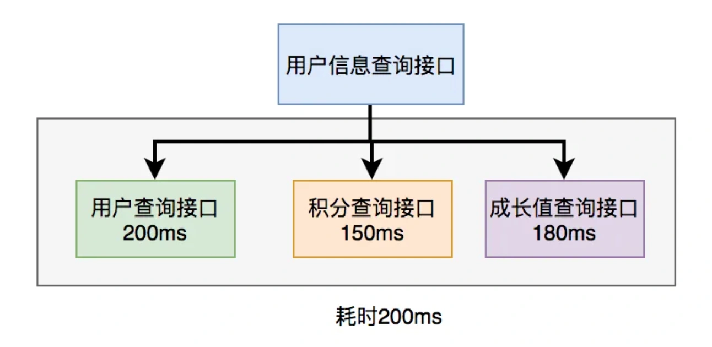

# 接口突然超时问题

## **<font style="color:rgb(34, 34, 34);background-color:rgb(248, 246, 244);">前言</font>**
<font style="color:rgb(51, 51, 51);background-color:rgb(248, 246, 244);">不知道你有没有遇到过这样的场景：我们提供的某个API接口，响应时间原本一直都很快，但在某个不经意的时间点，突然出现了接口超时。</font>

<font style="color:rgb(51, 51, 51);background-color:rgb(248, 246, 244);">也许你会有点懵，到底是为什么呢？</font>

<font style="color:rgb(51, 51, 51);background-color:rgb(248, 246, 244);">今天跟大家一起聊聊接口突然超时的10个原因，希望对你会有所帮助。</font>

## **<font style="color:rgb(34, 34, 34);background-color:rgb(248, 246, 244);">1.网络异常</font>**
<font style="color:rgb(51, 51, 51);background-color:rgb(248, 246, 244);">接口原本好好的，突然出现超时，最常见的原因，可能是网络出现异常了。比如：偶然的网络抖动，或者是带宽被占满了。</font>

### **<font style="color:rgb(34, 34, 34);background-color:rgb(248, 246, 244);">1.1 网络抖动</font>**
<font style="color:rgb(51, 51, 51);background-color:rgb(248, 246, 244);">经常上网的我们，肯定遇到过这样的场景：大多数情况下我们访问某个网站很快，但偶尔会出现网页一直转圈，加载不出来的情况。</font>

<font style="color:rgb(51, 51, 51);background-color:rgb(248, 246, 244);">有可能是你的网络出现了抖动，丢包了。</font>

<font style="color:rgb(51, 51, 51);background-color:rgb(248, 246, 244);">网页请求API接口，或者接口返回数据给网页，都有可能会出现网络丢包的情况。</font>

```kotlin
while(true) {
    if(condition) {
        break;
    }
    System.out.println("do samething");
}
```

<font style="color:rgb(51, 51, 51);background-color:rgb(248, 246, 244);">这里使用了while(true)的循环调用，这种写法在CAS自旋锁中使用比较多。</font>

<font style="color:rgb(51, 51, 51);background-color:rgb(248, 246, 244);">当满足condition等于true的时候，则自动退出该循环。</font>

<font style="color:rgb(51, 51, 51);background-color:rgb(248, 246, 244);">如果condition条件非常复杂，一旦出现判断不正确，或者少写了一些逻辑判断，就可能在某些场景下出现死循环的问题。</font>

<font style="color:rgb(51, 51, 51);background-color:rgb(248, 246, 244);">出现死循环，大概率是开发人员人为的bug导致的，不过这种情况很容易被测出来。</font>

<font style="color:rgb(51, 51, 51);background-color:rgb(248, 246, 244);">还有一种隐藏的比较深的死循环，是由于代码写的不太严谨导致的。如果用正常数据，可能测不出问题，但一旦出现异常数据，就会立即出现死循环。</font>

### **<font style="color:rgb(34, 34, 34);background-color:rgb(248, 246, 244);">2.1 带宽被占满</font>**
<font style="color:rgb(51, 51, 51);background-color:rgb(248, 246, 244);">有时候，由于页面或者接口设计不合理，用户请求量突增的时候，可能会导致服务器的网络带宽被占满的情况。</font>

<font style="color:rgb(51, 51, 51);background-color:rgb(248, 246, 244);">服务器带宽指的是在一定时间内传输数据的大小，比如：1秒传输了10M的数据。</font>

<font style="color:rgb(51, 51, 51);background-color:rgb(248, 246, 244);">如果用户请求量突然增多，超出了1秒10M的上限，比如：1秒100M，而服务器带宽本身1秒就只能传输10M，这样会导致在这1秒内，90M数据就会延迟传输的情况，从而导致接口超时的发生。</font>

<font style="color:rgb(100, 100, 100);background-color:rgb(248, 246, 244);">所以对于有些高并发请求场景，需要评估一下是否需要增加服务器带宽。</font>

## **<font style="color:rgb(34, 34, 34);background-color:rgb(248, 246, 244);">2.线程池满了</font>**
<font style="color:rgb(51, 51, 51);background-color:rgb(248, 246, 244);">我们调用的API接口，有时候为了性能考虑，可能会使用线程池异步查询数据，最后把查询结果进行汇总，然后返回。</font>

<font style="color:rgb(51, 51, 51);background-color:rgb(248, 246, 244);">如下图所示：</font>



<font style="color:rgb(51, 51, 51);background-color:rgb(248, 246, 244);">调用远程接口总耗时 200ms = 200ms（即耗时最长的那次远程接口调用）</font>

<font style="color:rgb(51, 51, 51);background-color:rgb(248, 246, 244);">在java8之前可以通过实现Callable接口，获取线程返回结果。</font>

<font style="color:rgb(51, 51, 51);background-color:rgb(248, 246, 244);">java8以后通过CompleteFuture类实现该功能。我们这里以CompleteFuture为例：</font>

```plain
public UserInfo getUserInfo(Long id) throws InterruptedException, ExecutionException {
    final UserInfo userInfo = new UserInfo();
    CompletableFuture userFuture = CompletableFuture.supplyAsync(() -> {
        getRemoteUserAndFill(id, userInfo);
        return Boolean.TRUE;
    }, executor);

    CompletableFuture bonusFuture = CompletableFuture.supplyAsync(() -> {
        getRemoteBonusAndFill(id, userInfo);
        return Boolean.TRUE;
    }, executor);

    CompletableFuture growthFuture = CompletableFuture.supplyAsync(() -> {
        getRemoteGrowthAndFill(id, userInfo);
        return Boolean.TRUE;
    }, executor);
    CompletableFuture.allOf(userFuture, bonusFuture, growthFuture).join();

    userFuture.get();
    bonusFuture.get();
    growthFuture.get();

    return userInfo;
}
```

<font style="color:rgb(51, 51, 51);background-color:rgb(248, 246, 244);">这里我用到了executor，表示自定义的线程池，为了防止高并发场景下，出现线程过多的问题。</font>

<font style="color:rgb(51, 51, 51);background-color:rgb(248, 246, 244);">但如果用户请求太多，线程池中已有的线程处理不过来，线程池会把多余的请求，放到队列中排队，等待空闲线程的去处理。</font>

<font style="color:rgb(51, 51, 51);background-color:rgb(248, 246, 244);">如果队列中排队的任务非常多，某次API请求一直在等待，没办法得到及时处理，就会出现接口超时问题。</font>

<font style="color:rgb(51, 51, 51);background-color:rgb(248, 246, 244);">这时候，我们可以考虑是否核心线程数设置太小了，或者有多种业务场景共用了同一个线程池。</font>

<font style="color:rgb(51, 51, 51);background-color:rgb(248, 246, 244);">如果是因为核心线程池设置太小，可以将其调大一些。</font>

<font style="color:rgb(51, 51, 51);background-color:rgb(248, 246, 244);">如果是因为多种业务场景共用了同一个线程池，可以拆分成多个线程池。</font>

## **<font style="color:rgb(34, 34, 34);background-color:rgb(248, 246, 244);">3.数据库死锁</font>**
<font style="color:rgb(51, 51, 51);background-color:rgb(248, 246, 244);">有时候接口超时得有点莫名其妙，特别是遇到数据库出现死锁的时候。</font>

<font style="color:rgb(51, 51, 51);background-color:rgb(248, 246, 244);">你提供的API接口中通过某个id更新某条数据，此时，正好线上在手动执行一个批量更新数据的sql语句。</font>

<font style="color:rgb(51, 51, 51);background-color:rgb(248, 246, 244);">该sql语句在一个事务当中，并且刚好也在更新那条数据，可能会出现死锁的情况。</font>

<font style="color:rgb(51, 51, 51);background-color:rgb(248, 246, 244);">由于该sql语句执行时间很长，会导致API接口的那次更新数据操作，长时间被数据库锁住，没法即使返回数据，而出现接口超时问题。</font>

<font style="color:rgb(51, 51, 51);background-color:rgb(248, 246, 244);">你说坑不坑？</font>

<font style="color:rgb(51, 51, 51);background-color:rgb(248, 246, 244);">所以建议在执行数据库批量操作前，一定要评估数据的影响范围，不要一次性更新太多的数据，不然可能会导致很多意想不到的问题。</font>

<font style="color:rgb(51, 51, 51);background-color:rgb(248, 246, 244);">此外，批量更新操作建议在用户访问少的时段执行，比如：凌晨。</font>

## **<font style="color:rgb(34, 34, 34);background-color:rgb(248, 246, 244);">4.传入参数太多</font>**
<font style="color:rgb(51, 51, 51);background-color:rgb(248, 246, 244);">有时候，偶尔的一次接口超时，是由于参数传入太多导致的。</font>

<font style="color:rgb(51, 51, 51);background-color:rgb(248, 246, 244);">例如：根据id集合批量查询分类接口，如果传入的id集合数据量不多，传入几十个或上百个id，不会出现性能问题。毕竟id是分类表的主键，可以走主键索引，数据库的查找速度是非常快的。</font>

<font style="color:rgb(51, 51, 51);background-color:rgb(248, 246, 244);">但如果接口调用方，一次性传入几千个，甚至几万个id，批量查询分类，也可能会出现接口超时问题。</font>

<font style="color:rgb(51, 51, 51);background-color:rgb(248, 246, 244);">因为数据库在执行sql语句之前，会评估一下耗时情况，查询条件太多，有可能走全表扫描更快。</font>

<font style="color:rgb(51, 51, 51);background-color:rgb(248, 246, 244);">所以这种情况下sql语句可能会丢失索引，让执行时间变慢，出现接口超时问题。</font>

<font style="color:rgb(51, 51, 51);background-color:rgb(248, 246, 244);">因此我们在设计批量接口的时候，建议要限制传入的集合的大小，比如：500。</font>

<font style="color:rgb(51, 51, 51);background-color:rgb(248, 246, 244);">如果超过我们设置最大的集合大小，则接口直接返回失败，并提示给用户：一次性传入参数过多。</font>

<font style="color:rgb(100, 100, 100);background-color:rgb(248, 246, 244);">该限制一定要写到接口文档中，避免接口调用方，在生产环境调用接口失败而踩坑。要在接口开发阶段通知到位。</font>

<font style="color:rgb(51, 51, 51);background-color:rgb(248, 246, 244);">此外，如果接口调用方要传入的参数就是很多怎么办？</font>

<font style="color:rgb(51, 51, 51);background-color:rgb(248, 246, 244);">答：可能是需求不合理，或者系统设计有问题，我们要尽量在系统设计阶段就规避这个问题。</font>

<font style="color:rgb(51, 51, 51);background-color:rgb(248, 246, 244);">如果我们重新进行系统设计改动比较大的话，有个临时的解决方案：在接口调用方中多线程分批调用该接口，最后将结果进行汇总。</font>

## **<font style="color:rgb(34, 34, 34);background-color:rgb(248, 246, 244);">5.超时时间设置过短</font>**
<font style="color:rgb(51, 51, 51);background-color:rgb(248, 246, 244);">通常情况下，建议我们在调用远程API接口时，要设置连接超时时间和读超时时间这两个参数，并且可以动态配置。</font>

<font style="color:rgb(51, 51, 51);background-color:rgb(248, 246, 244);">这样做的好处是，可以防止调用远程API接口万一出现了性能问题，响应时间很长，把我们自己的服务拖挂的情况发生。</font>

<font style="color:rgb(51, 51, 51);background-color:rgb(248, 246, 244);">比如：你调用的远程API接口，要100秒才返回数据，而你设置的超时时间是100秒。这时1000个请求过来，去请求该API接口，这样会导致tomcat线程池很快被占满，导致整个服务暂时不可用，至少新的请求过来，是没法即使响应的。</font>

<font style="color:rgb(51, 51, 51);background-color:rgb(248, 246, 244);">所以我们需要设置超时时间，并且超时时间还不能设置太长。</font>

<font style="color:rgb(51, 51, 51);background-color:rgb(248, 246, 244);">并发量不大的业务场景，可以将这两个超时时间设置稍微长一点，比如：连接超时时间为10秒，读超时时间为20秒。</font>

<font style="color:rgb(51, 51, 51);background-color:rgb(248, 246, 244);">并发量大的业务场景，可以设置成秒级或者毫秒级。</font>

<font style="color:rgb(51, 51, 51);background-color:rgb(248, 246, 244);">有些小伙伴为了开发方便，在多种业务场景共用这两个超时时间。</font>

<font style="color:rgb(51, 51, 51);background-color:rgb(248, 246, 244);">某一天，在并发量大的业务场景中，你将该超时时间改短了。</font>

<font style="color:rgb(51, 51, 51);background-color:rgb(248, 246, 244);">但直接导致并发量不大的业务场景中，出现调用API接口超时的问题。</font>

<font style="color:rgb(100, 100, 100);background-color:rgb(248, 246, 244);">因此，不建议多种业务场景共用同一个超时时间，最好根据并发量的不同，单独设置不同的超时时间。</font>

## **<font style="color:rgb(34, 34, 34);background-color:rgb(248, 246, 244);">6.一次性返回数据太多</font>**
<font style="color:rgb(51, 51, 51);background-color:rgb(248, 246, 244);">不知道你有没有遇到过这样的需求：我们有个job，每天定时调用第三方API查询接口，获取昨天更新的数据，然后更新到我们自己的数据库表中。</font>

<font style="color:rgb(51, 51, 51);background-color:rgb(248, 246, 244);">由于第三方每天更新的数据不多，所以该API接口响应时间还是比较快的。</font>

<font style="color:rgb(51, 51, 51);background-color:rgb(248, 246, 244);">但突然有一天，该API接口却出现了接口超时问题。</font>

<font style="color:rgb(51, 51, 51);background-color:rgb(248, 246, 244);">查看日志发现，该API接口一次性返回的数据太多，而且该数据的更新时间相同。</font>

<font style="color:rgb(51, 51, 51);background-color:rgb(248, 246, 244);">这就可以断定，该API接口提供方进行了批量更新操作，修改了大量的数据，导致该问题的发生。</font>

<font style="color:rgb(51, 51, 51);background-color:rgb(248, 246, 244);">即使我们在job中加了失败重试机制，但由于该API一次性返回数据实在太多太多，重试也很有可能会接口超时，这样会导致一直获取不到第三方前一天最新的数据。</font>

<font style="color:rgb(100, 100, 100);background-color:rgb(248, 246, 244);">所以第三方这种根据日期查询增量数据的接口，建议做成分页查询的，不然后面没准哪一天，遇到批量更新的操作，就可能出现接口超时的问题。</font>

## **<font style="color:rgb(34, 34, 34);background-color:rgb(248, 246, 244);">7. 死循环</font>**
<font style="color:rgb(51, 51, 51);background-color:rgb(248, 246, 244);">死循环也会导致接口超时？</font>

<font style="color:rgb(51, 51, 51);background-color:rgb(248, 246, 244);">死循环不应该在接口测试阶段就发现了，为什么要到生产环境才发现？</font>

<font style="color:rgb(51, 51, 51);background-color:rgb(248, 246, 244);">确实，绝大部分死循环问题，在测试阶段可以发现。</font>

<font style="color:rgb(51, 51, 51);background-color:rgb(248, 246, 244);">但有些无限递归隐藏的比较深，比如下面的情况。</font>

<font style="color:rgb(51, 51, 51);background-color:rgb(248, 246, 244);">死循环其实有两种：</font>

1. <font style="color:rgb(51, 51, 51);background-color:rgb(248, 246, 244);">普通死循环</font>
2. <font style="color:rgb(51, 51, 51);background-color:rgb(248, 246, 244);">无限递归</font>

### **<font style="color:rgb(34, 34, 34);background-color:rgb(248, 246, 244);">7.1 普通死循环</font>**
<font style="color:rgb(51, 51, 51);background-color:rgb(248, 246, 244);">有时候死循环是我们自己写的，例如下面这段代码：</font>

```kotlin
while(true) {
    if(condition) {
        break;
    }
    System.out.println("do samething");
}
```

<font style="color:rgb(51, 51, 51);background-color:rgb(248, 246, 244);">这里使用了while(true)的循环调用，这种写法在CAS自旋锁中使用比较多。</font>

<font style="color:rgb(51, 51, 51);background-color:rgb(248, 246, 244);">当满足condition等于true的时候，则自动退出该循环。</font>

<font style="color:rgb(51, 51, 51);background-color:rgb(248, 246, 244);">如果condition条件非常复杂，一旦出现判断不正确，或者少写了一些逻辑判断，就可能在某些场景下出现死循环的问题。</font>

<font style="color:rgb(51, 51, 51);background-color:rgb(248, 246, 244);">出现死循环，大概率是开发人员人为的bug导致的，不过这种情况很容易被测出来。</font>

<font style="color:rgb(51, 51, 51);background-color:rgb(248, 246, 244);">还有一种隐藏的比较深的死循环，是由于代码写的不太严谨导致的。如果用正常数据，可能测不出问题，但一旦出现异常数据，就会立即出现死循环。</font>

### **<font style="color:rgb(34, 34, 34);background-color:rgb(248, 246, 244);">7.2 无限递归</font>**
<font style="color:rgb(51, 51, 51);background-color:rgb(248, 246, 244);">如果想要打印某个分类的所有父分类，可以用类似这样的递归方法实现：</font>

```csharp
public void printCategory(Category category) {
  if(category == null 
      || category.getParentId() == null) {
     return;
  } 
  System.out.println("父分类名称："+ category.getName());
  Category parent = categoryMapper.getCategoryById(category.getParentId());
  printCategory(parent);
}
```

<font style="color:rgb(51, 51, 51);background-color:rgb(248, 246, 244);">正常情况下，这段代码是没有问题的。</font>

<font style="color:rgb(51, 51, 51);background-color:rgb(248, 246, 244);">但如果某次有人误操作，把某个分类的parentId指向了它自己，这样就会出现无限递归的情况。导致接口一直不能返回数据，最终会发生堆栈溢出。</font>

<font style="color:rgb(100, 100, 100);background-color:rgb(248, 246, 244);">建议写递归方法时，设定一个递归的深度，比如：分类最大等级有4级，则深度可以设置为4。然后在递归方法中做判断，如果深度大于4时，则自动返回，这样就能避免无限递归的情况。</font>

## **<font style="color:rgb(34, 34, 34);background-color:rgb(248, 246, 244);">8.sql语句没走索引</font>**
<font style="color:rgb(51, 51, 51);background-color:rgb(248, 246, 244);">你有没有遇到过这样一种情况：明明是同一条sql，只有入参不同而已。有的时候走的索引a，有的时候却走的索引b？</font>

<font style="color:rgb(51, 51, 51);background-color:rgb(248, 246, 244);">没错，有时候mysql会选错索引，甚至有时会不走索引。</font>

<font style="color:rgb(51, 51, 51);background-color:rgb(248, 246, 244);">mysql在执行某条sql语句之前，会通过抽样统计来估算扫描行数，根据影响行数、区分度、基数、数据页等信息，最后综合评估走哪个索引。</font>

<font style="color:rgb(51, 51, 51);background-color:rgb(248, 246, 244);">有时候传入参数1，sql语句走了索引a，执行时间很快。但有时候传入参数2，sql语句走了索引b，执行时间明显慢了很多。</font>

<font style="color:rgb(51, 51, 51);background-color:rgb(248, 246, 244);">这样有可能会导致API接口出现超时问题。</font>

<font style="color:rgb(100, 100, 100);background-color:rgb(248, 246, 244);">必要时可以使用force index来强制查询sql走某个索引。</font>

## **<font style="color:rgb(34, 34, 34);background-color:rgb(248, 246, 244);">9.服务OOM</font>**
<font style="color:rgb(51, 51, 51);background-color:rgb(248, 246, 244);">我之前遇到过这样一种场景：一个根据id查询分类的接口，该id是主键，sql语句可以走主键索引，竟然也出现了接口超时问题。</font>

<font style="color:rgb(51, 51, 51);background-color:rgb(248, 246, 244);">我当时觉得有点不可思议，因为这个接口平均耗时只有十几毫秒，怎么可能会出现超时呢？</font>

<font style="color:rgb(51, 51, 51);background-color:rgb(248, 246, 244);">但从当时的日志看，接口响应时间有5秒，的确出现了接口超时问题。</font>

<font style="color:rgb(51, 51, 51);background-color:rgb(248, 246, 244);">最后从Prometheus的服务内存监控中，查到了OOM问题。</font>

<font style="color:rgb(51, 51, 51);background-color:rgb(248, 246, 244);">其实该API接口部署的服务当时由于OOM内存溢出，其实挂了一段时间。</font>

<font style="color:rgb(51, 51, 51);background-color:rgb(248, 246, 244);">当时所有的接口都出现了请求超时问题。</font>

<font style="color:rgb(51, 51, 51);background-color:rgb(248, 246, 244);">但由于K8S集群有监控，它自动会将挂掉的服务节点kill掉，并且在容器中重新部署了一个新的服务节点，幸好对用户没造成太大的影响。</font>

<font style="color:rgb(51, 51, 51);background-color:rgb(248, 246, 244);">如果你对OOM问题比较感兴趣，可以看看我的另一篇文章《</font>[糟了，线上服务出现OOM了](https://mp.weixin.qq.com/s?__biz=MzkwNjMwMTgzMQ==&mid=2247498590&idx=1&sn=214cab0f95ad3df24055d5d18a110a2a&chksm=c0e823b6f79faaa0fa0c310715c7e94a205add4b1557cdc5f13bda85ce7862232c6955e261b6&token=748942416&lang=zh_CN&scene=21#wechat_redirect)<font style="color:rgb(51, 51, 51);background-color:rgb(248, 246, 244);">》。</font>

## **<font style="color:rgb(34, 34, 34);background-color:rgb(248, 246, 244);">10.在debug</font>**
<font style="color:rgb(51, 51, 51);background-color:rgb(248, 246, 244);">我们有时候需要在本地开发工具，比如：idea中，直接连接测试环境的数据库，调试某个API接口的业务逻辑。</font>

<font style="color:rgb(51, 51, 51);background-color:rgb(248, 246, 244);">因为在开发环境，某些问题不太好复现。</font>

<font style="color:rgb(51, 51, 51);background-color:rgb(248, 246, 244);">为了排查某个bug，你在请求某个本地接口时，开启了debug模式，一行行的跟踪代码，排查问题。</font>

<font style="color:rgb(51, 51, 51);background-color:rgb(248, 246, 244);">走到某一行代码的时候，停留了很长一段时间，该行代码主要是更新某条数据。</font>

<font style="color:rgb(51, 51, 51);background-color:rgb(248, 246, 244);">此时，测试同学在相关的业务页面中，操作更新了相同的数据。</font>

<font style="color:rgb(51, 51, 51);background-color:rgb(248, 246, 244);">这种也可能会出现数据库死锁的问题。</font>

<font style="color:rgb(51, 51, 51);background-color:rgb(248, 246, 244);">由于你在idea的debug模式中，一直都没有提交事务，会导致死锁的时间变得很长，从而导致业务页面请求的API接口出现超时问题。</font>

<font style="color:rgb(51, 51, 51);background-color:rgb(248, 246, 244);">当然如果你对常规的接口超时问题比较感兴趣，可以看看我的另一篇文章，里面有非常详细的介绍。</font>

<font style="color:rgb(51, 51, 51);background-color:rgb(248, 246, 244);">当然如果你对常规的接口超时问题比较感兴趣，可以看看我的另一篇文章《</font>[聊聊接口性能优化的11个小技巧](https://mp.weixin.qq.com/s?__biz=MzkwNjMwMTgzMQ==&mid=2247490731&idx=1&sn=29ed0295c7990157a3a56ba33cf7f8be&chksm=c0ebc443f79c4d55a2bac81744992c96f97737e5d0717ec99231f4d08f57a7f0220eafdac9c9&token=660773166&lang=zh_CN&scene=21#wechat_redirect)<font style="color:rgb(51, 51, 51);background-color:rgb(248, 246, 244);">》，里面有非常详细的介绍。</font>

  
 


> 更新: 2024-05-20 17:19:26  
> 原文: <https://www.yuque.com/yuqueyonghue6cvnv/cxhfwd/siwyz23to0hvkvnb>