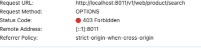
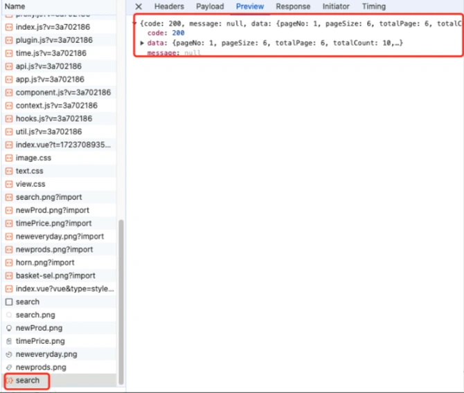

# 跨域问题

## **<font style="color:rgb(34, 34, 34);background-color:rgb(248, 246, 244);">前言</font>**
<font style="color:rgb(51, 51, 51);background-color:rgb(248, 246, 244);">在开发商城小程序的时候，我其实在浏览器上直接访问了小程序的首页，它会调用商城的商品查询接口查询商品数据，报了下面这个问题：</font>



<font style="color:rgb(51, 51, 51);background-color:rgb(248, 246, 244);">接口的返回码是403，报了一个strict-origin-when-cross-origin的跨域问题。</font>

<font style="color:rgb(51, 51, 51);background-color:rgb(248, 246, 244);">这个问题挺有代表性的，因此专门写了这篇文章，给大家一起分享一下。</font>

## **<font style="color:rgb(34, 34, 34);background-color:rgb(248, 246, 244);">1 什么是跨域问题？</font>**
<font style="color:rgb(51, 51, 51);background-color:rgb(248, 246, 244);">跨域问题是指在Web开发中，当一个域（domain）的JavaScript代码去请求另一个域的资源时，浏览器会出于安全考虑阻止这种跨域的行为。</font>

<font style="color:rgb(51, 51, 51);background-color:rgb(248, 246, 244);">在开发过程中，经常会遇到前端与后端不在同一个域的情况，因此跨域问题就显得尤为重要。</font>

<font style="color:rgb(51, 51, 51);background-color:rgb(248, 246, 244);">跨域是指在浏览器中，一个域下的JavaScript代码试图访问另一个域下的资源时所遇到的限制。</font>

<font style="color:rgb(51, 51, 51);background-color:rgb(248, 246, 244);">这种限制是由同源策略（Same-Origin Policy）所引起的。</font>

<font style="color:rgb(51, 51, 51);background-color:rgb(248, 246, 244);">同源策略要求浏览器只能在同一个域中加载页面和执行脚本，而不能跨域进行操作。</font>

<font style="color:rgb(51, 51, 51);background-color:rgb(248, 246, 244);">那么，如何解决跨域问题呢？</font>

## **<font style="color:rgb(34, 34, 34);background-color:rgb(248, 246, 244);">2 如何解决跨域问题？</font>**
### **<font style="color:rgb(34, 34, 34);background-color:rgb(248, 246, 244);">2.1 使用@CrossOrigin注解。</font>**
<font style="color:rgb(51, 51, 51);background-color:rgb(248, 246, 244);">在SpringBoot项目的Controller上使用@CrossOrigin注解。</font>

<font style="color:rgb(51, 51, 51);background-color:rgb(248, 246, 244);">这个注解可以指定允许跨域访问的域名、方法、头部信息等。</font>

<font style="color:rgb(51, 51, 51);background-color:rgb(248, 246, 244);">例如下面这样的：</font>

```kotlin
@CrossOrigin(origins = "*")
@RestController
public class TestController {
   
   @GetMapping("/test")
   public String test() {
     return "test";
   }
}
```

<font style="color:rgb(51, 51, 51);background-color:rgb(248, 246, 244);">这样这个注解，可以控制指定的Controller允许跨域访问。</font>

### **<font style="color:rgb(34, 34, 34);background-color:rgb(248, 246, 244);">2.2 自定义WebMvcConfigurer</font>**
<font style="color:rgb(51, 51, 51);background-color:rgb(248, 246, 244);">解决跨域问题的方式是通过自定义WebMvcConfigurer来配置跨域策略。</font>

<font style="color:rgb(51, 51, 51);background-color:rgb(248, 246, 244);">这种方式更加灵活，可以针对不同的路径进行不同的跨域配置。</font>

```typescript
@Configuration
public class WebConfig implements WebMvcConfigurer {
   @Override
   public void addCorsMappings(CorsRegistry registry) {
      registry.addMapping("/**")
      .allowedOrigins("*")
      .allowedMethods("GET","POST")
      .allowedHeaders("*");
   }
}
```

<font style="color:rgb(51, 51, 51);background-color:rgb(248, 246, 244);">可以全局控制跨域的配置。</font>

### **<font style="color:rgb(34, 34, 34);background-color:rgb(248, 246, 244);">2.3 自定义CorsFilter</font>**
<font style="color:rgb(51, 51, 51);background-color:rgb(248, 246, 244);">还可以通过自定义CorsFilter来处理跨域请求。</font>

<font style="color:rgb(51, 51, 51);background-color:rgb(248, 246, 244);">这种方式可以更加灵活地控制跨域策略，适用于更复杂的跨域场景。</font>

```java
@Configuration
public class CorsConfig {
    @Bean
    public CorsFilter corsFilter() {
        UrlBasedCorsConfigurationSource urlBasedCorsConfigurationSource = new UrlBasedCorsConfigurationSource();
        CorsConfiguration corsConfiguration = new CorsConfiguration();
        corsConfiguration.addAllowedOrigin("*");
        corsConfiguration.addAllowedHeader("*");
        corsConfiguration.addAllowedMethod("*");
        urlBasedCorsConfigurationSource.registerCorsConfiguration("/**", corsConfiguration);
        return new CorsFilter(urlBasedCorsConfigurationSource);
    }
}
```

## **<font style="color:rgb(34, 34, 34);background-color:rgb(248, 246, 244);">3 商城如何解决跨域问题？</font>**
<font style="color:rgb(51, 51, 51);background-color:rgb(248, 246, 244);">咱们商城是通过方案3解决跨域问题的。</font>

<font style="color:rgb(51, 51, 51);background-color:rgb(248, 246, 244);">在mall-mgt模块的config包下创建CorsConfig类，代码如下：</font>

```java
@Configuration
public class CorsConfig {
    @Bean
    public CorsFilter corsFilter() {
        UrlBasedCorsConfigurationSource urlBasedCorsConfigurationSource = new UrlBasedCorsConfigurationSource();
        CorsConfiguration corsConfiguration = new CorsConfiguration();
        corsConfiguration.addAllowedOrigin("*");
        corsConfiguration.addAllowedHeader("*");
        corsConfiguration.addAllowedMethod("*");
        urlBasedCorsConfigurationSource.registerCorsConfiguration("/**", corsConfiguration);
        return new CorsFilter(urlBasedCorsConfigurationSource);
    }
}
```

<font style="color:rgb(51, 51, 51);background-color:rgb(248, 246, 244);">创建了CorsFilter的实例对象，并且设置了允许跨域访问的域名、方法、头部信息，都允许所有的请求访问。</font>

<font style="color:rgb(51, 51, 51);background-color:rgb(248, 246, 244);">后面如果配置需要修改，只需要修改application.yml文件的如下配置即可：</font>

```plain
spring
  cors:
    allowed-origins: "*"
    allowed-headers: "*"
    allowed-methods: "*"
```

## **<font style="color:rgb(34, 34, 34);background-color:rgb(248, 246, 244);">4 测试</font>**
<font style="color:rgb(51, 51, 51);background-color:rgb(248, 246, 244);">这样调整之后，重新启动mall-mgt项目，发现在浏览器中访问小程序的首页，已经可以正常访问商品查询接口了。</font>

  
 


> 更新: 2024-11-07 09:51:58  
> 原文: <https://www.yuque.com/yuqueyonghue6cvnv/cxhfwd/kfehrz9vze0pi52b>