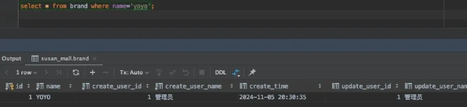
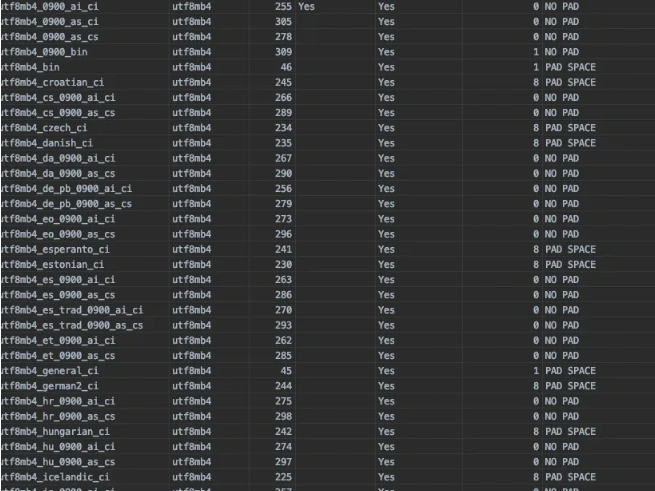

# COLLATE区分大小写问题

<font style="color:rgb(51, 51, 51);background-color:rgb(248, 246, 244);">：没搞错，各位看官，听我慢慢道来。</font>

<font style="color:rgb(51, 51, 51);background-color:rgb(248, 246, 244);">我之前写过一篇文章《</font>[<font style="color:rgb(51, 51, 51);background-color:rgb(248, 246, 244);">明明加了唯一索引，为什么还是产生重复数据？</font>](https://mp.weixin.qq.com/s?__biz=MzkwNjMwMTgzMQ==&mid=2247497090&idx=1&sn=53b81535a9815853382c3a4bff8c844b&chksm=c0e82d6af79fa47ccfece23a8b0ad46ef6c647f1d2f961823eed181732c47e250ed0cbcfe6fd&token=1613293111&lang=zh_CN&scene=21#wechat_redirect)<font style="color:rgb(51, 51, 51);background-color:rgb(248, 246, 244);">》，发表之后，被很多博主转载过，引起了全网很多读者的共鸣。</font>

<font style="color:rgb(51, 51, 51);background-color:rgb(248, 246, 244);">我最近发现，这类出人意料的线上问题，加上知识点总结，加上干货分享，更容易吸引读者。</font>

<font style="color:rgb(51, 51, 51);background-color:rgb(248, 246, 244);">所以，这篇文章将会延续上篇文章的风格，从一个线上问题开始。</font>

## **<font style="color:rgb(34, 34, 34);background-color:rgb(248, 246, 244);">1.还原问题现场</font>**
<font style="color:rgb(51, 51, 51);background-color:rgb(248, 246, 244);">有一天下午，有用户反馈说，它自定义的品牌：yoyo，一直都添加不成功。</font>

<font style="color:rgb(51, 51, 51);background-color:rgb(248, 246, 244);">我查了一下服务器的日志，并没有异常。</font>

<font style="color:rgb(51, 51, 51);background-color:rgb(248, 246, 244);">在我们的创建商品页面，用户可以选择已有品牌，也可以自己自定义新的品牌。</font>

<font style="color:rgb(51, 51, 51);background-color:rgb(248, 246, 244);">前端做了一个品牌的下来列表，为了方便用户查找，支持搜索。</font>

<font style="color:rgb(51, 51, 51);background-color:rgb(248, 246, 244);">用户可以输入关键字搜索品牌。</font>

<font style="color:rgb(51, 51, 51);background-color:rgb(248, 246, 244);">如果下拉框中出现了，则可以选择使用。</font>

<font style="color:rgb(51, 51, 51);background-color:rgb(248, 246, 244);">如果下拉框中没有数据，则在输入框中标识这个品牌是用户自定义的品牌。</font>

<font style="color:rgb(51, 51, 51);background-color:rgb(248, 246, 244);">然后通过创建商品接口，将该品牌添加到数据库当中。</font>

<font style="color:rgb(51, 51, 51);background-color:rgb(248, 246, 244);">现在的问题是yoyo这个品牌，用户自定义了，但不能保存到数据库当中。</font>

<font style="color:rgb(51, 51, 51);background-color:rgb(248, 246, 244);">这就非常奇怪了。</font>

## **<font style="color:rgb(34, 34, 34);background-color:rgb(248, 246, 244);">2 分析问题</font>**
<font style="color:rgb(51, 51, 51);background-color:rgb(248, 246, 244);">为了查明这个问题，我先查询了数据库中的品牌表：</font>

```plain
select * from brand where `name`='yoyo';
```

<font style="color:rgb(51, 51, 51);background-color:rgb(248, 246, 244);">确实没有查出yoyo这个品牌。</font>

<font style="color:rgb(51, 51, 51);background-color:rgb(248, 246, 244);">但意外查出YOYO这个品牌。</font>



<font style="color:rgb(51, 51, 51);background-color:rgb(248, 246, 244);">它是yoyo英文字母的大写。</font>

<font style="color:rgb(51, 51, 51);background-color:rgb(248, 246, 244);">奇怪，我们查小写的yoyo字符串，为什么会把大写的YOYO查出来了？</font>

<font style="color:rgb(51, 51, 51);background-color:rgb(248, 246, 244);">于是，我查了brand表的表结构。</font>

```plain
CREATE TABLE `brand` (
  `id` bigint NOT NULL AUTO_INCREMENT COMMENT 'ID',
  `name` varchar(30) NOT NULL COMMENT '品牌名称',
  `create_user_id` bigint NOT NULL COMMENT '创建人ID',
  `create_user_name` varchar(30) NOT NULL COMMENT '创建人名称',
  `create_time` datetime(3) DEFAULT NULL COMMENT '创建日期',
  `update_user_id` bigint DEFAULT NULL COMMENT '修改人ID',
  `update_user_name` varchar(30)  DEFAULT NULL COMMENT '修改人名称',
  `update_time` datetime(3) DEFAULT NULL COMMENT '修改时间',
  `is_del` tinyint(1) DEFAULT '0' COMMENT '是否删除 1：已删除 0：未删除',
  PRIMARY KEY (`id`) USING BTREE
) ENGINE=InnoDB DEFAULT CHARSET=utf8mb4 COLLATE=utf8mb4_unicode_ci  COMMENT='品牌表';
```

<font style="color:rgb(51, 51, 51);background-color:rgb(248, 246, 244);">品牌表使用的存储引擎ENGINE是InnoDB，为了保证表的事务性。</font>

<font style="color:rgb(51, 51, 51);background-color:rgb(248, 246, 244);">字符集CHARSET用的utf8mb4，可以保存一些表情符号等特殊字符。</font>

<font style="color:rgb(51, 51, 51);background-color:rgb(248, 246, 244);">校对规则COLLATE用的utf8_unicode_ci。</font>

<font style="color:rgb(51, 51, 51);background-color:rgb(248, 246, 244);">字符集是一组符号和编码的集合，而校对规则是用于比较字符集中字符的规则。</font>

<font style="color:rgb(51, 51, 51);background-color:rgb(248, 246, 244);">例如，utf8mb4字符集支持存储Unicode字符，而utf8mb4_0900_ai_ci校对规则定义了如何比较这些字符。</font>

<font style="color:rgb(51, 51, 51);background-color:rgb(248, 246, 244);">在MySQL中使用show collation指令，可以查看到所有COLLATE。</font>

<font style="color:rgb(51, 51, 51);background-color:rgb(248, 246, 244);">以utf8mb4为例，该编码所支持的所有COLLATE如下图所示。</font>



<font style="color:rgb(51, 51, 51);background-color:rgb(248, 246, 244);">主要包含了三种：</font>

1. <font style="color:rgb(51, 51, 51);background-color:rgb(248, 246, 244);">以_ci结尾的。</font>
2. <font style="color:rgb(51, 51, 51);background-color:rgb(248, 246, 244);">以_bin结尾的。</font>
3. <font style="color:rgb(51, 51, 51);background-color:rgb(248, 246, 244);">以_cs结尾的。</font>

<font style="color:rgb(51, 51, 51);background-color:rgb(248, 246, 244);">ci是case insensitive的缩写，意思是大小写不敏感，即忽略大小写。</font>

<font style="color:rgb(51, 51, 51);background-color:rgb(248, 246, 244);">cs是case sensitive的缩写，意思是大小写敏感，即区分大小写。</font>

<font style="color:rgb(51, 51, 51);background-color:rgb(248, 246, 244);">还有一种是bin，它是将字符串中的每一个字符用二进制数据存储，区分大小写。</font>

<font style="color:rgb(51, 51, 51);background-color:rgb(248, 246, 244);">使用最多的是 utf8mb4_general_ci（默认的）和 utf8mb4_bin。</font>

<font style="color:rgb(51, 51, 51);background-color:rgb(248, 246, 244);">我们的brand表，使用的COLLATE是utf8mb4_general_ci，它不区分大小写。</font>

<font style="color:rgb(51, 51, 51);background-color:rgb(248, 246, 244);">难怪下面的这条sql：</font>

```plain
select * from brand where `name`='yoyo';
```

<font style="color:rgb(51, 51, 51);background-color:rgb(248, 246, 244);">数据库中明明没有小写的yoyo这条数据，但却能把大写的YOYO数据查出来。</font>

## **<font style="color:rgb(34, 34, 34);background-color:rgb(248, 246, 244);">3.如何解决问题？</font>**
<font style="color:rgb(51, 51, 51);background-color:rgb(248, 246, 244);">知道原因了，就好办了。</font>

<font style="color:rgb(51, 51, 51);background-color:rgb(248, 246, 244);">第一个想到的是把brand表的COLLATE改成utf8mb4_bin不就搞定了？</font>

<font style="color:rgb(51, 51, 51);background-color:rgb(248, 246, 244);">这样确实可以非常快速解决问题。</font>

<font style="color:rgb(51, 51, 51);background-color:rgb(248, 246, 244);">但我仔细想了一下。</font>

<font style="color:rgb(51, 51, 51);background-color:rgb(248, 246, 244);">品牌这种基础数据，yoyo和YOYO正常情况下应该是同一个品牌，应该只有一个id，不区分大小写才是正确的做法。</font>

<font style="color:rgb(51, 51, 51);background-color:rgb(248, 246, 244);">如果brand表的COLLATE改成了utf8mb4_bin，区分大小写，不就会出现两个不同的id，这样品牌表不就会产生重复的数据，后面会导致商品也可能会重复。</font>

<font style="color:rgb(51, 51, 51);background-color:rgb(248, 246, 244);">如果后面商品也重复了，就会带来非常多的问题。</font>

<font style="color:rgb(51, 51, 51);background-color:rgb(248, 246, 244);">因此，我们要在brand表做好控制，不应该区分大小写，保证品牌不会重复。</font>

<font style="color:rgb(51, 51, 51);background-color:rgb(248, 246, 244);">既然修改brand表的COLLATE这个方案不行，那么，只能修改业务逻辑了。</font>

<font style="color:rgb(51, 51, 51);background-color:rgb(248, 246, 244);">目前有两种解决方案：</font>

1. <font style="color:rgb(51, 51, 51);background-color:rgb(248, 246, 244);">前端搜索品牌时，不区分大小写。</font>
2. <font style="color:rgb(51, 51, 51);background-color:rgb(248, 246, 244);">前端品牌下拉控件，改成分页的，搜索品牌的功能，改成调用后端接口实现。</font>

<font style="color:rgb(51, 51, 51);background-color:rgb(248, 246, 244);">方案1适合品牌数据量少的情况。</font>

<font style="color:rgb(51, 51, 51);background-color:rgb(248, 246, 244);">方案2适合品牌数据量多的情况。</font>

<font style="color:rgb(51, 51, 51);background-color:rgb(248, 246, 244);">我们的品牌数据，其实在不断增加，因此，决定使用方案2。</font>

<font style="color:rgb(51, 51, 51);background-color:rgb(248, 246, 244);">后端提供一个分页查询品牌的接口，并且支持不区分大小写的模糊搜索功能。</font>

<font style="color:rgb(51, 51, 51);background-color:rgb(248, 246, 244);">但这样还不能100%保证，品牌数据在brand表中不会重复。</font>

<font style="color:rgb(51, 51, 51);background-color:rgb(248, 246, 244);">还需要给name字段增加唯一索引。</font>

<font style="color:rgb(51, 51, 51);background-color:rgb(248, 246, 244);">这样改造之后，后面用户输入yoyo，但数据库中有YOYO，在品牌下拉列表中会显示YOYO，用户可以直接选择使用。</font>

<font style="color:rgb(51, 51, 51);background-color:rgb(248, 246, 244);">这样对用户的交互更友好一些。</font>

<font style="color:rgb(51, 51, 51);background-color:rgb(248, 246, 244);">这是一类问题，可以衍生一下。</font>

<font style="color:rgb(51, 51, 51);background-color:rgb(248, 246, 244);">有些属性值表也有类似的问题。</font>

<font style="color:rgb(51, 51, 51);background-color:rgb(248, 246, 244);">比如用户自定义属性值之后，如果业务逻辑中有通过属性id查询属性值集合，再拿这个属性值集合跟自定义属性值做判断的时候，就需要忽略大小写做判断了。</font>

<font style="color:rgb(51, 51, 51);background-color:rgb(248, 246, 244);">其实，在我们的实际工作中，这样的场景很多，赶紧排查一下代码，看看你有没有这个问题？</font>


> 更新: 2024-11-07 09:50:39  
> 原文: <https://www.yuque.com/yuqueyonghue6cvnv/cxhfwd/ksa39vbqv410vs43>