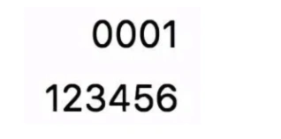
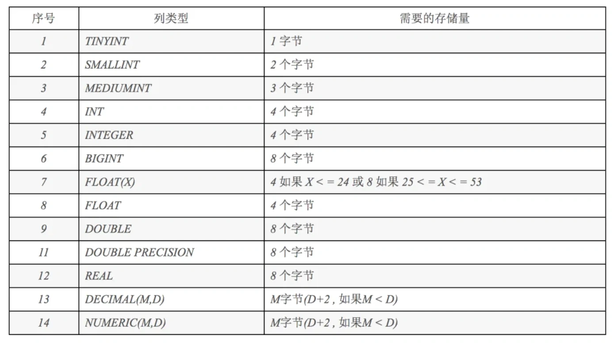
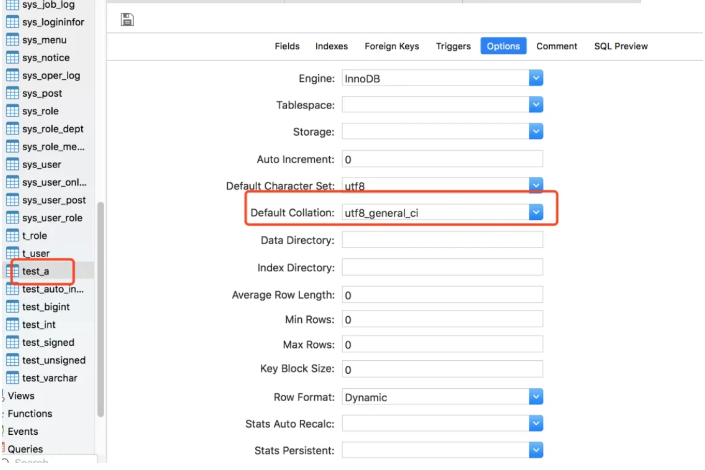
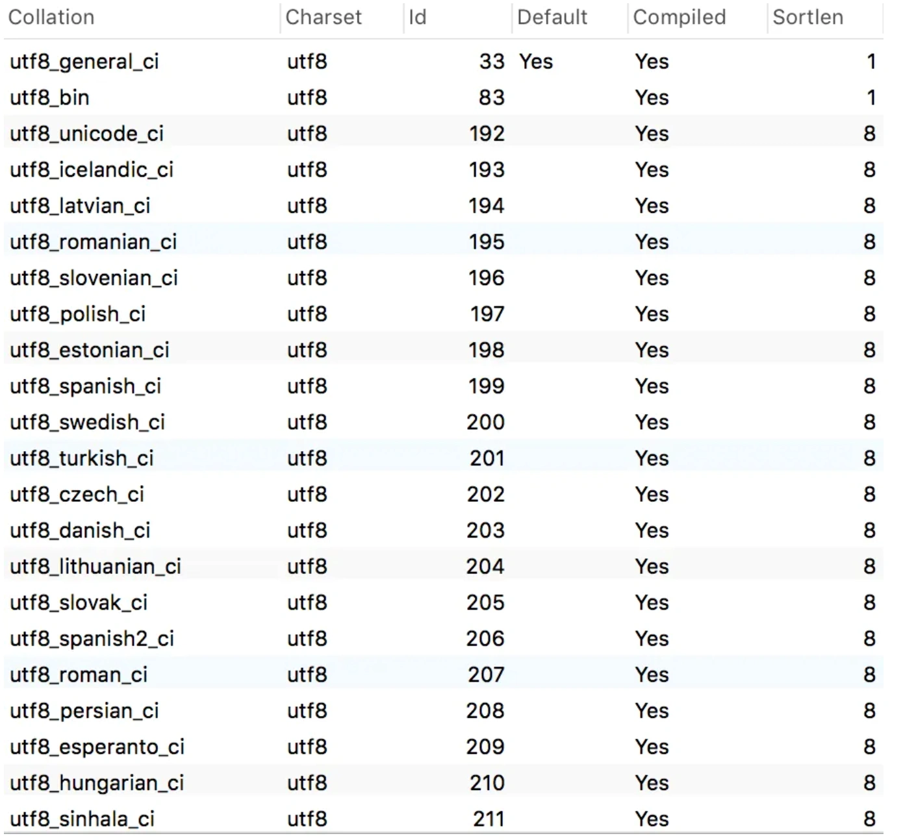
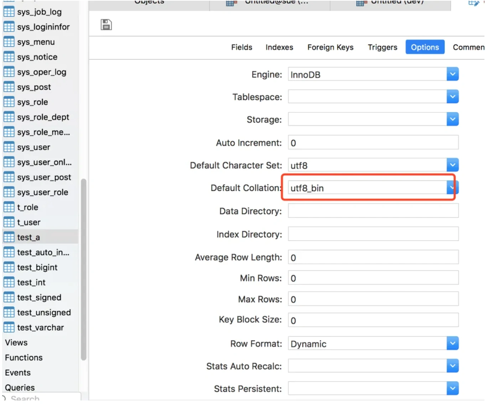
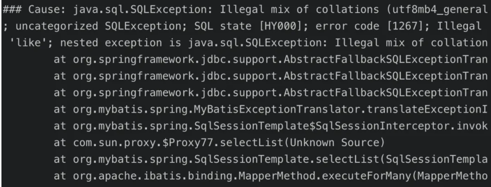
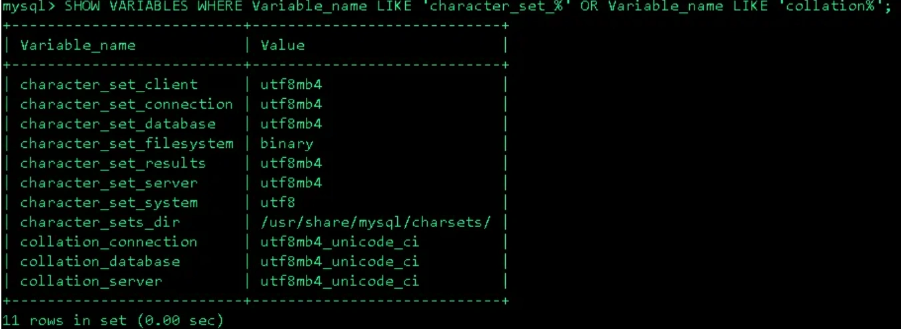

# mysql的几个坑

## **<font style="color:rgb(34, 34, 34);background-color:rgb(248, 246, 244);">一、前言</font>**
<font style="color:rgb(51, 51, 51);background-color:rgb(248, 246, 244);">对于从事互联网开发的同学来说，mysql可谓是再熟悉不过的了。无论是DBA、开发或测试，基本上天天要跟它打交道，很多同学可能已经身经百战了。但是，笔者遇到过的这些坑不知道你们都经历过没？</font>

## **<font style="color:rgb(34, 34, 34);background-color:rgb(248, 246, 244);">二、有符号和无符号</font>**
<font style="color:rgb(51, 51, 51);background-color:rgb(248, 246, 244);">以前我们公司在项目开发之初制定开发规范时，对mysql的int类型字段定义成有符号，还是无符号问题专门讨论过。</font>

**<font style="color:rgb(34, 34, 34);background-color:rgb(248, 246, 244);">观点一：</font>**

<font style="color:rgb(51, 51, 51);background-color:rgb(248, 246, 244);">对于能够确定里面存的值一定是正数的字段，定义成UNSIGNED无符号的，可以节省一半的存储空间。创建无符号字段的语句如下：</font>

```sql
create table test_unsigned(a int UNSIGNED, b int UNSIGNED);
```

**<font style="color:rgb(34, 34, 34);background-color:rgb(248, 246, 244);">观点二：</font>**

<font style="color:rgb(51, 51, 51);background-color:rgb(248, 246, 244);">建议都定义成有符号的，使用起来比较简单，mysql默认int类型就是有符号的，创建有符号字段的语句如下：</font>

```sql
create table test_signed(a int);insert into test_signed values(-1);
```

<font style="color:rgb(51, 51, 51);background-color:rgb(248, 246, 244);">执行结果：</font>

<font style="color:rgb(51, 51, 51);background-color:rgb(248, 246, 244);">在字段a中插入-1，我们看到是可以操作成功的。</font>

**<font style="color:rgb(34, 34, 34);background-color:rgb(248, 246, 244);">这两个方案，经过我们激烈讨论之后，选择了使用有符号定义int类型字段。为什么呢？</font>**

```sql
create table test_unsigned(a int UNSIGNED, b int UNSIGNED);
insert into test_unsigned values(1,2);
```

<font style="color:rgb(51, 51, 51);background-color:rgb(248, 246, 244);">先创建test_unsigned表，里面包含两个无符号字段a和b，再插入一条数据a=1，b=2</font>

```css
select b - a from test_unsigned;
```

<font style="color:rgb(51, 51, 51);background-color:rgb(248, 246, 244);">没有问题，返回1</font>

<font style="color:rgb(51, 51, 51);background-color:rgb(248, 246, 244);">但是如果sql改成这样：</font>

```css
select a - b from test_unsigned;
```

<font style="color:rgb(51, 51, 51);background-color:rgb(248, 246, 244);">执行结果：</font>

<font style="color:rgb(51, 51, 51);background-color:rgb(248, 246, 244);">报错了。。。</font>

<font style="color:rgb(51, 51, 51);background-color:rgb(248, 246, 244);">所以，在使用无符号字段时，千万要注意字段相减出现负数的坑，建议还是使用有符号字段，避免不必要的问题。</font>

## **<font style="color:rgb(34, 34, 34);background-color:rgb(248, 246, 244);">三、自动增长</font>**
<font style="color:rgb(51, 51, 51);background-color:rgb(248, 246, 244);">建过表的同学都知道，对于表的主键可以定义成自动增长的，这样一来，就可以交给数据库自己生成主键值，而无需在代码中指定，而且生成的值是递增的。一般情况下，创建表的语句如下：</font>

```plain
create table test_auto_increment (a int auto_increment primary key);
```

<font style="color:rgb(51, 51, 51);background-color:rgb(248, 246, 244);">但如果改成这样的会怎样？</font>

```sql
create table test_auto_increment (a int auto_increment);
```

<font style="color:rgb(51, 51, 51);background-color:rgb(248, 246, 244);">执行结果：</font>

<font style="color:rgb(51, 51, 51);background-color:rgb(248, 246, 244);">报错了。。。</font>

<font style="color:rgb(51, 51, 51);background-color:rgb(248, 246, 244);">截图中没有全部显示出来，完整的提示语是这样的：</font>

```basic
1075 - Incorrect table definition; there can be only one auto column and it must be defined as a key, Time: 0.006000
```

<font style="color:rgb(51, 51, 51);background-color:rgb(248, 246, 244);">意思是自动增长字段，必须被定义成key，所以我们需要加上primary key。</font>

<font style="color:rgb(51, 51, 51);background-color:rgb(248, 246, 244);">此外，还有一个有趣的实验：</font>

```plain
insert into test_auto_increment(a) values (null),(50),(null),(8),(null);
```

<font style="color:rgb(51, 51, 51);background-color:rgb(248, 246, 244);">大家猜猜执行结果会是什么样的？</font>


<font style="color:rgb(51, 51, 51);background-color:rgb(248, 246, 244);">第一个null插入1，然后按真实的数字大小排序后插入，后面两个null，是在最大的数字上面加1。</font>

<font style="color:rgb(51, 51, 51);background-color:rgb(248, 246, 244);">再看看这条sql主键中插入负数，能执行成功吗？</font>

```plain
insert into test_auto_increment values(-3);
```

<font style="color:rgb(51, 51, 51);background-color:rgb(248, 246, 244);">答案是可以，主键可以插入负数。</font>

<font style="color:rgb(51, 51, 51);background-color:rgb(248, 246, 244);">还有这条sql呢，主键中插入0？</font>

```plain
insert into test_auto_increment values(0);
```

<font style="color:rgb(51, 51, 51);background-color:rgb(248, 246, 244);">执行结果：</font>


<font style="color:rgb(51, 51, 51);background-color:rgb(248, 246, 244);">也可以执行成功，但是没有插入数据</font>

## **<font style="color:rgb(34, 34, 34);background-color:rgb(248, 246, 244);">四、字段长度</font>**
<font style="color:rgb(51, 51, 51);background-color:rgb(248, 246, 244);">我们在创建表的时候，给字段定义完类型之后，紧接着需要指定字段的长度，比如：varchar(20)，biginit(20)等。那么问题来了，varchar代表的是字节长度，还是字符长度呢？</font>

```plain
create table test_varchar(a varchar(20));

insert into test_varchar values('苏三说技术');

select length(a),CHARACTER_LENGTH(a) from test_varchar;
```

<font style="color:rgb(51, 51, 51);background-color:rgb(248, 246, 244);">执行后的结果：</font>


<font style="color:rgb(51, 51, 51);background-color:rgb(248, 246, 244);">我们看到中文的5个字length函数统计后长度为15，代表占用了15个字节，而使用charcter_length函数统计长度是5，代表有5个字符。所以varchar代表的是字符长度，因为有些复杂的字符或者中文，一个字节表示不了，utf8编码格式的一个中文汉字占用3个字节。不同的数据库编码格式，占用不同的字节数对照表如下：</font>


<font style="color:rgb(51, 51, 51);background-color:rgb(248, 246, 244);">mysql除了varchar和char是代表字符长度之外，其余的类型都是代表字节长度。</font>

<font style="color:rgb(51, 51, 51);background-color:rgb(248, 246, 244);">int(n) 这个n表示什么意思呢？从一个列子出发：</font>

```sql
create table test_bigint (a bigint(4) ZEROFILL);
insert into test_bigint values(1);
insert into test_bigint values(123456);
select * from test_bigint;
```

<font style="color:rgb(51, 51, 51);background-color:rgb(248, 246, 244);">ZEROFILL表示长度不够填充0</font>

<font style="color:rgb(51, 51, 51);background-color:rgb(248, 246, 244);">执行结果：</font>



<font style="color:rgb(51, 51, 51);background-color:rgb(248, 246, 244);">mysql常用数字类型字段占用字节数对照表：</font>



<font style="color:rgb(51, 51, 51);background-color:rgb(248, 246, 244);">从表中可以看出bigint实际长度是8个字节，但是我们定义的a显示4个字节，所以在不满4个字节时前面填充0。满了4个字节时，按照实际的长度显示，比如：123456。但是，需要注意的是，有些mysql客户端即使满了4个字节，也可能只显示4个字节的内容，比如显示：1234。</font>

<font style="color:rgb(51, 51, 51);background-color:rgb(248, 246, 244);">所以bigint(4)，这里的4表示显示的长度为4个字节，实际长度还是8个字节。</font>

## **<font style="color:rgb(34, 34, 34);background-color:rgb(248, 246, 244);">五、忽略大小写</font>**
<font style="color:rgb(51, 51, 51);background-color:rgb(248, 246, 244);">我们知道在英文字母中有大小写问题，比如：a 和 A 是一样的吗？我们认为肯定是不一样的，但是数据库是如何处理的呢？</font>

```sql
create table test_a(a varchar(20));
insert into test_a values('a');
insert into test_a values('A');
select * from test_a where a = 'a';
```

<font style="color:rgb(51, 51, 51);background-color:rgb(248, 246, 244);">执行结果是什么呢？</font>


<font style="color:rgb(51, 51, 51);background-color:rgb(248, 246, 244);">本以为只会返回a，但是实际上把A也返回了，这是为什么呢？</font>



<font style="color:rgb(51, 51, 51);background-color:rgb(248, 246, 244);">该表默认的Collation是utf8_general_ci，这种Collation会忽略大小写，所以才会出现查询小写字母a的值，意外把大写字母A的值也查询出来了。</font>

<font style="color:rgb(51, 51, 51);background-color:rgb(248, 246, 244);">那么如果我们只想查询出小写a的值该怎么办？先看看mysql支持哪些Collation？</font>

```sql
show collation;
```



<font style="color:rgb(51, 51, 51);background-color:rgb(248, 246, 244);">从上图中我们可以找到utf8_bin，这个表示二进制格式的数据，我们设置成种类型的试试。</font>



<font style="color:rgb(51, 51, 51);background-color:rgb(248, 246, 244);">修改一下字段类型</font>

```sql
ALTER TABLE test_a MODIFY COLUMN a VARCHAR(20) BINARY CHARACTER SET utf8 COLLATE utf8_bin DEFAULT NULL;
```

<font style="color:rgb(51, 51, 51);background-color:rgb(248, 246, 244);">再查看一下数据</font>

```plain
select * from test_a where a = 'a';
```

<font style="color:rgb(51, 51, 51);background-color:rgb(248, 246, 244);">执行结果：</font>


# <font style="color:rgb(0, 0, 0);background-color:rgb(248, 246, 244);">果然，结果对了。</font>
## **<font style="color:rgb(34, 34, 34);background-color:rgb(248, 246, 244);">六、特殊字符</font>**
<font style="color:rgb(51, 51, 51);background-color:rgb(248, 246, 244);">笔者之前做项目的时候，提供过一个留言的功能，结果客户端用户输入了一个</font>**<font style="color:rgb(34, 34, 34);background-color:rgb(248, 246, 244);">emoji表情</font>**<font style="color:rgb(51, 51, 51);background-color:rgb(248, 246, 244);">，直接导致接口报错了。</font>



<font style="color:rgb(51, 51, 51);background-color:rgb(248, 246, 244);">最后定位原因是由于当时数据库和表的字符编码都是用的utf8，mysql的utf8编码的一个字符最多3个字节，但是一个emoji表情为4个字节，所以utf8不支持存储emoji表情。</font>

<font style="color:rgb(51, 51, 51);background-color:rgb(248, 246, 244);">该如何解决这个问题呢？</font>

<font style="color:rgb(51, 51, 51);background-color:rgb(248, 246, 244);">将字符编码改成utf8mb4，utf8mb4最多能有4字节，不过，在mysql5.5.3或更高的版本才支持。</font>

<font style="color:rgb(51, 51, 51);background-color:rgb(248, 246, 244);">在mysql 的配置文件 my.cnf 或 my.ini 配置文件中修改如下：</font>

```plain
[client]default-character-set = utf8mb4
[mysqld]character-set-server = utf8mb4collation-server= utf8mb4_general_ci
```

<font style="color:rgb(51, 51, 51);background-color:rgb(248, 246, 244);">重启MySQL，然后使用以下命令查看编码，应该全部为utf8mb4，这是修改整个数据库的编码方式。</font>

```sql
SHOW VARIABLES WHERE Variable_name LIKE 'character_set_%' OR Variable_name LIKE 'collation%';ji
```

<font style="color:rgb(51, 51, 51);background-color:rgb(248, 246, 244);">结果为：</font>



<font style="color:rgb(51, 51, 51);background-color:rgb(248, 246, 244);">也可以单独修改某张表的编码方式：</font>

```sql
alter table test_a convert to character set utf8mb4 collate utf8mb4_bin;
```

<font style="color:rgb(51, 51, 51);background-color:rgb(248, 246, 244);">以及修改某个字段的编码方式：</font>

```sql
ALTER TABLE test_a CHANGE a a VARCHAR(20) CHARACTER SET utf8mb4 COLLATE utf8mb4_bin;
```

<font style="color:rgb(51, 51, 51);background-color:rgb(248, 246, 244);">此外，建议同学们在创建数据库和表的时候字符编码都定义成utf8mb4，避免一些不必要的问题。</font>


> 更新: 2024-05-20 17:13:11  
> 原文: <https://www.yuque.com/yuqueyonghue6cvnv/cxhfwd/vkamt9l4d1uhnfru>