# select...for update加锁问题

## **<font style="color:rgb(34, 34, 34);background-color:rgb(248, 246, 244);">前言</font>**
<font style="color:rgb(51, 51, 51);background-color:rgb(248, 246, 244);">前几天，知识星球中的一个小伙伴，问了我一个问题：在MySQL中，事务A中使用select...for update where id=1锁住了，某一条数据，事务还没提交，</font>

<font style="color:rgb(51, 51, 51);background-color:rgb(248, 246, 244);">此时，事务B中去用select ... where id=1查询那条数据，会阻塞等待吗？</font>

<font style="color:rgb(51, 51, 51);background-color:rgb(248, 246, 244);">其实select...for update在MySQL中，是一种悲观锁的用法，一般情况下，会锁住一行数据，但如果没有使用正确的话，也会把整张表锁住，导致SQL性能急剧下降。</font>

<font style="color:rgb(51, 51, 51);background-color:rgb(248, 246, 244);">其实，我之前也在实际项目中试过用for update关键字加行锁，比如：积分兑换礼品的功能。</font>

<font style="color:rgb(51, 51, 51);background-color:rgb(248, 246, 244);">今天就跟大家一起聊聊select...for update这个话题，希望对你会有所帮助。</font>

## **<font style="color:rgb(34, 34, 34);background-color:rgb(248, 246, 244);">1. 要什么要用行锁？</font>**
<font style="color:rgb(51, 51, 51);background-color:rgb(248, 246, 244);">假如现在有这样一种业务场景：用户A给你转账了2000元，此时刚好，用户B也给你转账了3000元，而你的账户初始化金额是1000元。</font>

<font style="color:rgb(51, 51, 51);background-color:rgb(248, 246, 244);">用户A的请求，先查询出money，然后给money加上2000，在事务1中会执行下面这条sql：</font>

```plain
update account set money=#{money}
where id=123;
```

<font style="color:rgb(51, 51, 51);background-color:rgb(248, 246, 244);">同事，用户B的请求，也是先查询出money，然后给money加上3000，在事务2中执行下面这条sql：</font>

```plain
update account set money=#{money}
where id=123;
```

<font style="color:rgb(51, 51, 51);background-color:rgb(248, 246, 244);">这两条sql执行成功之后，你的money可能是：3000、4000、6000，这三种情况中的一种。</font>

<font style="color:rgb(51, 51, 51);background-color:rgb(248, 246, 244);">你之前的想法是，用户A和用户B总共给你转账5000，最终你账户的钱应该是6000才对，3000和4000是怎么来的？</font>

<font style="color:rgb(51, 51, 51);background-color:rgb(248, 246, 244);">假如事务1在执行update语句的过程中，事务2同时也在执行update语句。</font>

<font style="color:rgb(51, 51, 51);background-color:rgb(248, 246, 244);">事务1中查询到money是1000，此外事务2也查询到money是1000。</font>

<font style="color:rgb(51, 51, 51);background-color:rgb(248, 246, 244);">如果事务1先执行update语句，事务2后执行update语句，第一次update的3000，会被后面的4000覆盖掉，最终结果为4000。</font>

<font style="color:rgb(51, 51, 51);background-color:rgb(248, 246, 244);">如果事务2先执行update语句，事务1后执行update语句，第一次update的4000，会被后面的3000覆盖掉，最终结果为3000。</font>

<font style="color:rgb(51, 51, 51);background-color:rgb(248, 246, 244);">这两种情况都产生了严重的数据问题。</font>

<font style="color:rgb(51, 51, 51);background-color:rgb(248, 246, 244);">我们需要有某种机制，保证计算金额后事务1和事务2要顺序执行，不要一起执行。</font>

<font style="color:rgb(51, 51, 51);background-color:rgb(248, 246, 244);">这就需要加锁了。</font>

<font style="color:rgb(51, 51, 51);background-color:rgb(248, 246, 244);">目前MySQL中使用比较多的有：表锁、行锁和间隙锁。</font>

<font style="color:rgb(51, 51, 51);background-color:rgb(248, 246, 244);">我们这个业务场景，非常时候使用行锁。</font>

<font style="color:rgb(51, 51, 51);background-color:rgb(248, 246, 244);">在事务1执行update语句的过程中，先要把某一行数据锁住，此时，其他的事务必须等待事务1执行完，提交了事务，才能获取那一行的数据。</font>

<font style="color:rgb(51, 51, 51);background-color:rgb(248, 246, 244);">在MySQL中是通过select...for update语句来实现的行锁的功能。</font>

<font style="color:rgb(51, 51, 51);background-color:rgb(248, 246, 244);">但如果你在实际工作中使用不正确，也容易把整张表锁住，严重影响性能。</font>

<font style="color:rgb(51, 51, 51);background-color:rgb(248, 246, 244);">select...where...for update语句的用法是否正确，跟where条件中的参数有很大的关系。</font>

<font style="color:rgb(51, 51, 51);background-color:rgb(248, 246, 244);">不信我们一起看看下面这几种情况。</font>

<font style="color:rgb(51, 51, 51);background-color:rgb(248, 246, 244);">假如user表现在有这样的数据库，数据库的版本是：8.0.21。</font>

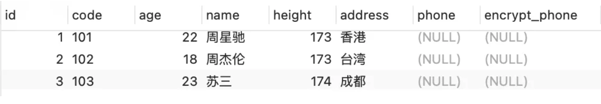

<font style="color:rgb(51, 51, 51);background-color:rgb(248, 246, 244);">创建的索引如下：</font>

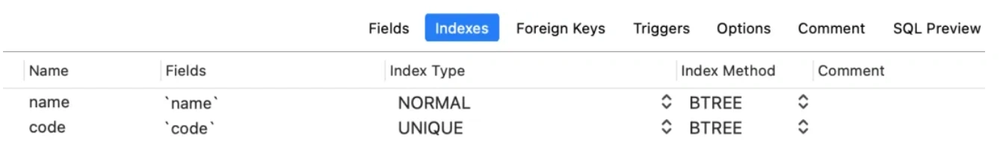

<font style="color:rgb(51, 51, 51);background-color:rgb(248, 246, 244);">其中id是主键字段，code是唯一索引字段，name是普通索引字段，其他的都是普通字段。</font>

## **<font style="color:rgb(34, 34, 34);background-color:rgb(248, 246, 244);">2. 主键</font>**
<font style="color:rgb(51, 51, 51);background-color:rgb(248, 246, 244);">当where条件中用的是数据库主键时。</font>

<font style="color:rgb(51, 51, 51);background-color:rgb(248, 246, 244);">例如开启一个事务1，在事务中更新id=1的用户的年龄：</font>

```plain
begin;
select * from user where id=1 for update;
update user set age=22 where id=1;
```

<font style="color:rgb(51, 51, 51);background-color:rgb(248, 246, 244);">where条件中的id是数据库的主键，并且使用for update关键字，加了一个行锁，这个事务没有commit。</font>

<font style="color:rgb(51, 51, 51);background-color:rgb(248, 246, 244);">此时，开启了另外一个事务2，也更新id=1的用户的年龄：</font>

```plain
begin;
update user set age=23 where id=1;
commit;
```

<font style="color:rgb(51, 51, 51);background-color:rgb(248, 246, 244);">在执行事务2的sql语句的过程中，会一直等待事务1释放锁。</font>

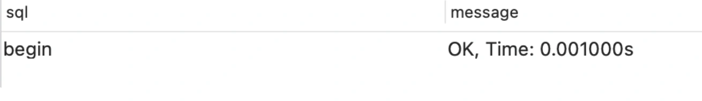

<font style="color:rgb(51, 51, 51);background-color:rgb(248, 246, 244);">如果事务1一直都不释放行锁，事务2最后会报下面这个异常：</font>

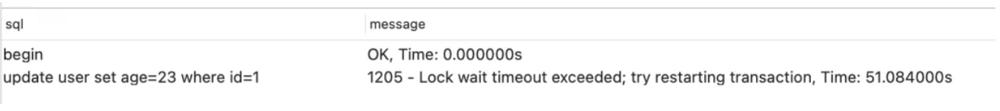

<font style="color:rgb(51, 51, 51);background-color:rgb(248, 246, 244);">如果此时开始一个事务3，更新id=2的用户的年龄：</font>

```plain
begin;
update user set age=23 where id=2;
commit;
```

<font style="color:rgb(51, 51, 51);background-color:rgb(248, 246, 244);">执行结果如下：</font>

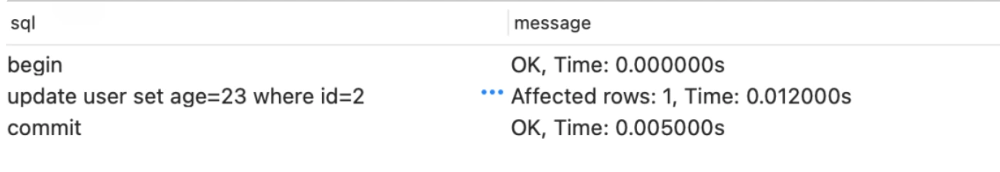

<font style="color:rgb(51, 51, 51);background-color:rgb(248, 246, 244);">由于事务3中更新的另外一行数据，因此可以执行成功。</font>

<font style="color:rgb(51, 51, 51);background-color:rgb(248, 246, 244);">说明使用for update关键字，锁住了主键id=1的那一行数据，对其他行的数据并没有影响。</font>

## **<font style="color:rgb(34, 34, 34);background-color:rgb(248, 246, 244);">3. 唯一索引</font>**
<font style="color:rgb(51, 51, 51);background-color:rgb(248, 246, 244);">当where条件用的数据库唯一索引时。</font>

<font style="color:rgb(51, 51, 51);background-color:rgb(248, 246, 244);">开启一个事务1，在事务中更新code=101的用户的年龄：</font>

```plain
begin;
select * from user where code='101' for update;
update user set age=22 where code='101';
```

<font style="color:rgb(51, 51, 51);background-color:rgb(248, 246, 244);">where条件中的code是数据库的唯一索引，并且使用for update关键字，加了一个行锁，这个事务没有commit。</font>

<font style="color:rgb(51, 51, 51);background-color:rgb(248, 246, 244);">此时，开启了另外一个事务2，也更新code=101的用户的年龄：</font>

```plain
begin;
update user set age=23 where code='101';
commit;
```

<font style="color:rgb(51, 51, 51);background-color:rgb(248, 246, 244);">执行结果跟主键的情况是一样的。</font>


## **<font style="color:rgb(34, 34, 34);background-color:rgb(248, 246, 244);">4. 普通索引</font>**
<font style="color:rgb(51, 51, 51);background-color:rgb(248, 246, 244);">当where条件用的数据库普通索引时。</font>

<font style="color:rgb(51, 51, 51);background-color:rgb(248, 246, 244);">开启一个事务1，在事务中更新name=周星驰的用户的年龄：</font>

```plain
begin;
select * from user where name='周星驰' for update;
update user set age=22 where name='周星驰';
```

<font style="color:rgb(51, 51, 51);background-color:rgb(248, 246, 244);">where条件中的name是数据库的普通索引，并且使用for update关键字，加了一个行锁，这个事务没有commit。</font>

<font style="color:rgb(51, 51, 51);background-color:rgb(248, 246, 244);">此时，开启了另外一个事务2，也更新name=周星驰的用户的年龄：</font>

```plain
begin;
update user set age=23 where name='周星驰';
commit;
```

<font style="color:rgb(51, 51, 51);background-color:rgb(248, 246, 244);">执行结果跟主键的情况也是一样的，但其实加的是间隙锁。</font>

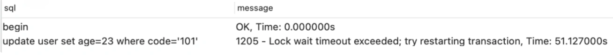

## **<font style="color:rgb(34, 34, 34);background-color:rgb(248, 246, 244);">5. 主键范围</font>**
<font style="color:rgb(51, 51, 51);background-color:rgb(248, 246, 244);">当where条件用的数据库主键范围时。</font>

<font style="color:rgb(51, 51, 51);background-color:rgb(248, 246, 244);">开启一个事务1，在事务中更新id in (1,2)的用户的年龄：</font>

```sql
begin;
select * from user where id in (1,2) for update;
update user set age=22 where id in (1,2);
```

<font style="color:rgb(51, 51, 51);background-color:rgb(248, 246, 244);">where条件中的id是数据库的主键范围，并且使用for update关键字，加了多个行锁，这个事务没有commit。</font>

<font style="color:rgb(51, 51, 51);background-color:rgb(248, 246, 244);">此时，开启了另外一个事务2，也更新id=1的用户的年龄：</font>

```plain
begin;
update user set age=23 where id=1;
commit;
```

<font style="color:rgb(51, 51, 51);background-color:rgb(248, 246, 244);">执行结果跟主键的情况也是一样的。</font>

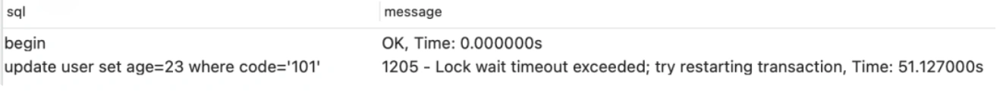

<font style="color:rgb(51, 51, 51);background-color:rgb(248, 246, 244);">此时，开启了另外一个事务2，也更新id=2的用户的年龄：</font>

```plain
begin;
update user set age=23 where id=2;
commit;
```

<font style="color:rgb(51, 51, 51);background-color:rgb(248, 246, 244);">执行结果跟主键的情况也是一样的。</font>

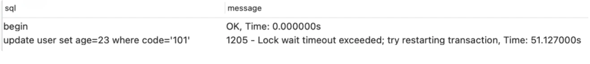

## **<font style="color:rgb(34, 34, 34);background-color:rgb(248, 246, 244);">6. 普通字段</font>**
<font style="color:rgb(51, 51, 51);background-color:rgb(248, 246, 244);">当where条件用的数据库普通字段时。</font>

<font style="color:rgb(51, 51, 51);background-color:rgb(248, 246, 244);">该字段既不是主键，也不是索引。</font>

<font style="color:rgb(51, 51, 51);background-color:rgb(248, 246, 244);">开启一个事务1，在事务中更新age=22的用户的年龄：</font>

```plain
begin;
select * from user where age=22 for update;
update user set age=22 where age=22 ;
```

<font style="color:rgb(51, 51, 51);background-color:rgb(248, 246, 244);">where条件中的age是数据库的普通字段，并且使用for update关键字，加的是表锁，这个事务没有commit。</font>

<font style="color:rgb(51, 51, 51);background-color:rgb(248, 246, 244);">此时，开启了另外一个事务2，也更新age=22的用户的年龄：</font>

```plain
begin;
update user set age=23 where age=22 ;
commit;
```

<font style="color:rgb(51, 51, 51);background-color:rgb(248, 246, 244);">此时，执行事务2时，会一直阻塞等待事务1释放锁。</font>

<font style="color:rgb(51, 51, 51);background-color:rgb(248, 246, 244);">调整一下sql条件，查询条件改成age=23：</font>

```plain
begin;
update user set age=23 where age=23 ;
commit;
```

<font style="color:rgb(51, 51, 51);background-color:rgb(248, 246, 244);">此时，行事务3时，也会一直阻塞等待事务1释放锁。</font>

<font style="color:rgb(51, 51, 51);background-color:rgb(248, 246, 244);">也就是说，在for update语句中，使用普通字段作为查询条件时，加的不是行锁。</font>

<font style="color:rgb(51, 51, 51);background-color:rgb(248, 246, 244);">那么，到底是什么锁呢？</font>

<font style="color:rgb(51, 51, 51);background-color:rgb(248, 246, 244);">开启一个事务4，在事务中更新age=22的用户的年龄：</font>

```plain
begin;
select * from user where age=23 for update;
update user set age=22 where age=23 ;
```

<font style="color:rgb(51, 51, 51);background-color:rgb(248, 246, 244);">尝试insert一条age=22的新数据：</font>

```plain
INSERT INTO `sue`.`user`(`id`, `code`, `age`, `name`, `height`, `address`, `phone`, `encrypt_phone`) VALUES (6, '105', 22, '苏三说技术', 173, '武汉', NULL, NULL);
```

<font style="color:rgb(51, 51, 51);background-color:rgb(248, 246, 244);">最后发现insert失败了。</font>

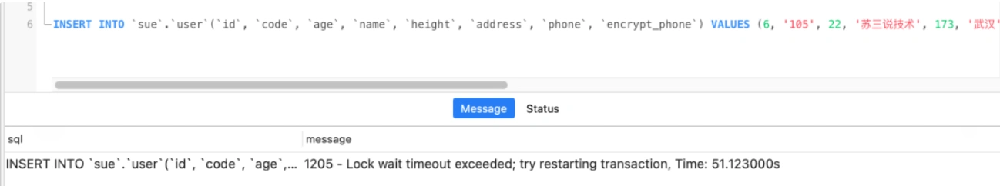

<font style="color:rgb(51, 51, 51);background-color:rgb(248, 246, 244);">尝试insert一条age=23的新数据：</font>

```plain
INSERT INTO `sue`.`user`(`id`, `code`, `age`, `name`, `height`, `address`, `phone`, `encrypt_phone`) VALUES (6, '105', 23, '苏三说技术', 173, '武汉', NULL, NULL);
```

<font style="color:rgb(51, 51, 51);background-color:rgb(248, 246, 244);">最后发现insert也失败了。</font>

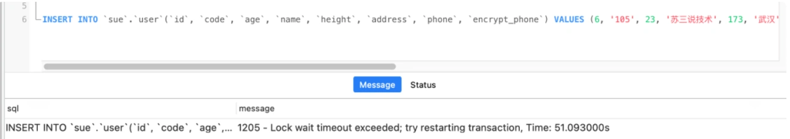

<font style="color:rgb(51, 51, 51);background-color:rgb(248, 246, 244);">而把age改成21重新insert：</font>

```plain
INSERT INTO `sue`.`user`(`id`, `code`, `age`, `name`, `height`, `address`, `phone`, `encrypt_phone`) VALUES (6, '105', 21, '苏三说技术', 173, '武汉', NULL, NULL);
```

<font style="color:rgb(51, 51, 51);background-color:rgb(248, 246, 244);">却insert成功了：</font>

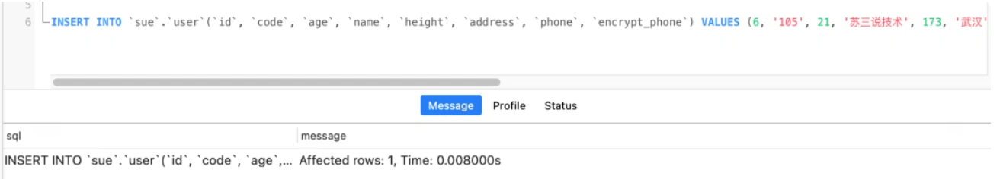

<font style="color:rgb(51, 51, 51);background-color:rgb(248, 246, 244);">意不意外？惊不惊喜？</font>

<font style="color:rgb(51, 51, 51);background-color:rgb(248, 246, 244);">说明这种情况下，加的不是行锁，也不是表锁，而是间隙锁，锁定的范围是age从【22~∞】。</font>

## **<font style="color:rgb(34, 34, 34);background-color:rgb(248, 246, 244);">7. 空数据</font>**
<font style="color:rgb(51, 51, 51);background-color:rgb(248, 246, 244);">当where条件查询的数据不存在时，会发生什么呢？</font>

<font style="color:rgb(51, 51, 51);background-color:rgb(248, 246, 244);">开启一个事务1，在事务中更新id=66的用户的年龄：</font>

```sql
begin;
select * from user where id=66 for update;
```

<font style="color:rgb(51, 51, 51);background-color:rgb(248, 246, 244);">这条数据是不存在的。</font>

<font style="color:rgb(51, 51, 51);background-color:rgb(248, 246, 244);">此时，开启了另外一个事务2，也更新id=66的用户的年龄：</font>

```plain
begin;
update user set age=23 where id=66 ;
commit;
```

<font style="color:rgb(51, 51, 51);background-color:rgb(248, 246, 244);">执行结果：</font>

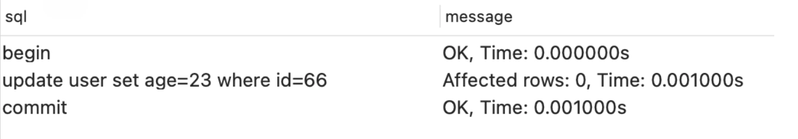

<font style="color:rgb(51, 51, 51);background-color:rgb(248, 246, 244);">执行成功了，说明这种情况没有加锁？</font>

<font style="color:rgb(51, 51, 51);background-color:rgb(248, 246, 244);">不继续往下看。</font>

<font style="color:rgb(51, 51, 51);background-color:rgb(248, 246, 244);">开启事务3，insert一条age=21的数据：</font>

```plain
INSERT INTO `sue`.`user`(`id`, `code`, `age`, `name`, `height`, `address`, `phone`, `encrypt_phone`) VALUES (5, '104', 21, '苏三说技术', 173, '武汉', NULL, NULL);
```

<font style="color:rgb(51, 51, 51);background-color:rgb(248, 246, 244);">结果insert也失败了：</font>

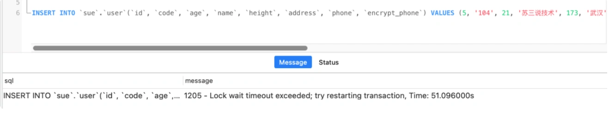

<font style="color:rgb(51, 51, 51);background-color:rgb(248, 246, 244);">说明用for update关键字，通过主键查询空数据时，是加了锁的，目前得知不是行锁。</font>

<font style="color:rgb(51, 51, 51);background-color:rgb(248, 246, 244);">是表锁？</font>

<font style="color:rgb(51, 51, 51);background-color:rgb(248, 246, 244);">假如insert一条age=65的数据：</font>

```plain
INSERT INTO `sue`.`user`(`id`, `code`, `age`, `name`, `height`, `address`, `phone`, `encrypt_phone`) VALUES (6, '106', 65, '苏三说技术', 173, '武汉', NULL, NULL);
```

<font style="color:rgb(51, 51, 51);background-color:rgb(248, 246, 244);">发现insert失败了：</font>

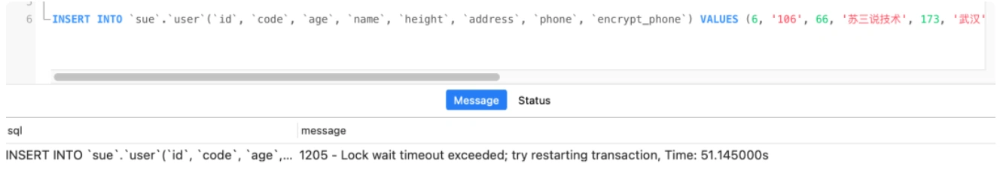

<font style="color:rgb(51, 51, 51);background-color:rgb(248, 246, 244);">改成insert一条age=21的数据呢？</font>

```plain
INSERT INTO `sue`.`user`(`id`, `code`, `age`, `name`, `height`, `address`, `phone`, `encrypt_phone`) VALUES (8, '108', 21, '苏三说技术', 173, '武汉', NULL, NULL);
```

<font style="color:rgb(51, 51, 51);background-color:rgb(248, 246, 244);">结果insert成功了：</font>

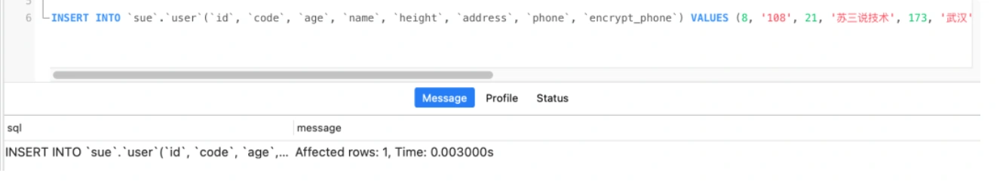

<font style="color:rgb(51, 51, 51);background-color:rgb(248, 246, 244);">说明用for update关键字，通过主键查询空数据时，加的不是表锁，而是间隙锁。</font>

## **<font style="color:rgb(34, 34, 34);background-color:rgb(248, 246, 244);">总结</font>**
<font style="color:rgb(51, 51, 51);background-color:rgb(248, 246, 244);">最后给大家总结一下select...for update加锁的情况：</font>

1. <font style="color:rgb(51, 51, 51);background-color:rgb(248, 246, 244);">主键字段：加行锁。</font>
2. <font style="color:rgb(51, 51, 51);background-color:rgb(248, 246, 244);">唯一索引字段：加行锁。</font>
3. <font style="color:rgb(51, 51, 51);background-color:rgb(248, 246, 244);">普通索引字段：加间隙锁。</font>
4. <font style="color:rgb(51, 51, 51);background-color:rgb(248, 246, 244);">主键范围：加多个行锁。</font>
5. <font style="color:rgb(51, 51, 51);background-color:rgb(248, 246, 244);">唯一索引范围，加多个行锁。</font>
6. <font style="color:rgb(51, 51, 51);background-color:rgb(248, 246, 244);">普通字段：加间隙锁，看着像表锁。。</font>
7. <font style="color:rgb(51, 51, 51);background-color:rgb(248, 246, 244);">查询空数据：加间隙锁。</font>

<font style="color:rgb(51, 51, 51);background-color:rgb(248, 246, 244);">如果事务1加了行锁，一直没有释放锁，事务2操作相同行的数据时，会一直等待直到超时。</font>

<font style="color:rgb(51, 51, 51);background-color:rgb(248, 246, 244);">如果事务1加了表锁，一直没有释放锁，事务2不管操作的是哪一行数据，都会一直等待直到超时。</font>

<font style="color:rgb(51, 51, 51);background-color:rgb(248, 246, 244);">此外，有些小伙伴，可能会好奇，直接执行update语句，也会加行锁，为什么还需要使用for update关键字加行锁呢？</font>

<font style="color:rgb(51, 51, 51);background-color:rgb(248, 246, 244);">答：for update关键字是加在select语句中的，它从查到那行数据开始，直到事务提交，整个过程中都会加锁。</font>

<font style="color:rgb(51, 51, 51);background-color:rgb(248, 246, 244);">而直接执行update语句，是在更新数据的时候加锁，二者有本质的区别。</font>

  
 


> 更新: 2024-05-20 17:16:46  
> 原文: <https://www.yuque.com/yuqueyonghue6cvnv/cxhfwd/pxet9ebthyz9klu4>