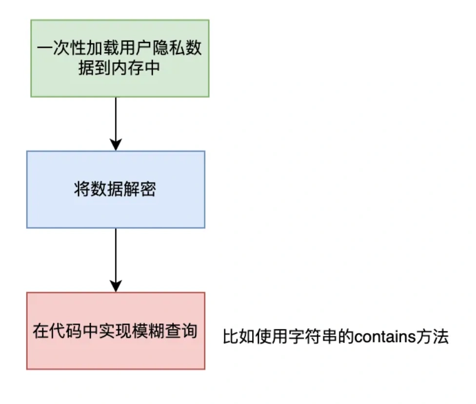

# 加密的手机号模糊查询问题

## **<font style="color:rgb(34, 34, 34);background-color:rgb(248, 246, 244);">前言</font>**
<font style="color:rgb(51, 51, 51);background-color:rgb(248, 246, 244);">前几天，知识星球中有位小伙伴，问了我一个问题：加密的手机号如何模糊查询？</font>

<font style="color:rgb(51, 51, 51);background-color:rgb(248, 246, 244);">我们都知道，在做系统设计时，考虑到系统的安全性，需要对用户的一些个人隐私信息，比如：登录密码、身份证号、银行卡号、手机号等，做加密处理，防止用户的个人信息被泄露。</font>

<font style="color:rgb(51, 51, 51);background-color:rgb(248, 246, 244);">很早之前，CSDN遭遇了SQL注入，导致了600多万条明文保存的用户信息被泄。</font>

<font style="color:rgb(51, 51, 51);background-color:rgb(248, 246, 244);">因此，我们在做系统设计的时候，要考虑要把用户的隐私信息加密保存。</font>

<font style="color:rgb(51, 51, 51);background-color:rgb(248, 246, 244);">常见的对称加密算法有 AES、SM4、ChaCha20、3DES、DES、Blowfish、IDEA、RC5、RC6、Camellia等。</font>

<font style="color:rgb(51, 51, 51);background-color:rgb(248, 246, 244);">目前国际主流的对称加密算法是AES，国内主推的则是SM4。</font>

<font style="color:rgb(51, 51, 51);background-color:rgb(248, 246, 244);">无论是用哪种算法，加密前的字符串，和加密后的字符串，差别还是比较大的。</font>

<font style="color:rgb(51, 51, 51);background-color:rgb(248, 246, 244);">比如加密前的字符串：苏三说技术，使用密钥：123，生成加密后的字符串为：U2FsdGVkX1+q7g9npbydGL1HXzaZZ6uYYtXyug83jHA=。</font>

<font style="color:rgb(51, 51, 51);background-color:rgb(248, 246, 244);">如何对加密后的字符串做模糊查询呢？</font>

<font style="color:rgb(51, 51, 51);background-color:rgb(248, 246, 244);">比如：假设查询苏三关键字，加密后的字符串是：U2FsdGVkX19eCv+xt2WkQb5auYo0ckyw。</font>

<font style="color:rgb(51, 51, 51);background-color:rgb(248, 246, 244);">上面生成的两个加密字符串差异看起来比较大，根本没办法直接通过SQL语句中的like关键字模糊查询。</font>

<font style="color:rgb(51, 51, 51);background-color:rgb(248, 246, 244);">那我们该怎么实现加密的手机号的模糊查询功能呢？</font>

## **<font style="color:rgb(34, 34, 34);background-color:rgb(248, 246, 244);">1 一次加载到内存</font>**
<font style="color:rgb(51, 51, 51);background-color:rgb(248, 246, 244);">实现这个功能，我们第一个想到的办法可能是：把个人隐私数据一次性加载到内存中缓存起来，然后在内存中先解密，然后在代码中实现模糊搜索的功能。</font>



<font style="color:rgb(51, 51, 51);background-color:rgb(248, 246, 244);">这样做的好处是：实现起来比较简单，成本非常低。</font>

<font style="color:rgb(51, 51, 51);background-color:rgb(248, 246, 244);">但带来的问题是：如果个人隐私数据非常多的话，应用服务器的内存不一定够用，可能会出现OOM问题。</font>

<font style="color:rgb(51, 51, 51);background-color:rgb(248, 246, 244);">还有另外一个问题是：数据一致性问题。</font>

<font style="color:rgb(51, 51, 51);background-color:rgb(248, 246, 244);">如果用户修改了手机号，数据库更新成功了，需要同步更新内存中的缓存，否则用户查询的结果可能会跟实际情况不一致。</font>

<font style="color:rgb(51, 51, 51);background-color:rgb(248, 246, 244);">比如：数据库更新成功了，内存中的缓存更新失败了。</font>

<font style="color:rgb(51, 51, 51);background-color:rgb(248, 246, 244);">或者你的应用，部署了多个服务器节点，有一部分内存缓存更新成功了，另外一部分刚好在重启，导致更新失败了。</font>

<font style="color:rgb(51, 51, 51);background-color:rgb(248, 246, 244);">该方案不仅可能会导致应用服务器出现OOM问题，也可能会导致系统的复杂度提升许多，总体来说，有点得不偿失。</font>

## **<font style="color:rgb(34, 34, 34);background-color:rgb(248, 246, 244);">2 使用数据库函数</font>**
<font style="color:rgb(51, 51, 51);background-color:rgb(248, 246, 244);">既然数据库中保存的是加密后的字符串，还有一种方案是使用数据库的函数解密。</font>

<font style="color:rgb(51, 51, 51);background-color:rgb(248, 246, 244);">我们可以使用MySQL的DES_ENCRYPT函数加密，使用DES_DECRYPT函数解密：</font>

```plain
SELECT 
DES_DECRYPT('U2FsdGVkX1+q7g9npbydGL1HXzaZZ6uYYtXyug83jHA=', '123');
```

<font style="color:rgb(51, 51, 51);background-color:rgb(248, 246, 244);">应用系统重所有的用户隐私信息的加解密都在MySQL层实现，不存在加解密不一致的情况。</font>

<font style="color:rgb(51, 51, 51);background-color:rgb(248, 246, 244);">该方案中保存数据时，只对单个用户的数据进行操作，数据量比较小，性能还好。</font>

<font style="color:rgb(51, 51, 51);background-color:rgb(248, 246, 244);">但模糊查询数据时，每一次都需要通过DES_DECRYPT函数，把数据库中用户某个隐私信息字段的所有数据都解密了，然后再通过解密后的数据，做模糊查询。</font>

<font style="color:rgb(51, 51, 51);background-color:rgb(248, 246, 244);">如果该字段的数据量非常大，这样每次查询的性能会非常差。</font>

## **<font style="color:rgb(34, 34, 34);background-color:rgb(248, 246, 244);">3 分段保存</font>**
<font style="color:rgb(51, 51, 51);background-color:rgb(248, 246, 244);">我们可以将一个完整的字符串，拆分成多个小的字符串。</font>

<font style="color:rgb(51, 51, 51);background-color:rgb(248, 246, 244);">以手机号为例：18200256007，按每3位为一组，进行拆分，拆分后的字符串为：182,820,200,002,025,256,560,600,007，这9组数据。</font>

<font style="color:rgb(51, 51, 51);background-color:rgb(248, 246, 244);">然后建一张表：</font>

```plain
CREATE TABLE `encrypt_value_mapping` (
  `id` bigint NOT NULL COMMENT '系统编号',
  `ref_id` bigint NOT NULL COMMENT '关联系统编号',
  `encrypt_value` varchar(255) NOT NULL COMMENT '加密后的字符串'
) ENGINE=InnoDB  CHARSET=utf8mb4 COLLATE=utf8mb4_bin COMMENT='分段加密映射表'
```

<font style="color:rgb(51, 51, 51);background-color:rgb(248, 246, 244);">这张表有三个字段：</font>

+ <font style="color:rgb(51, 51, 51);background-color:rgb(248, 246, 244);">id：系统编号。</font>
+ <font style="color:rgb(51, 51, 51);background-color:rgb(248, 246, 244);">ref_id：主业务表的系统编号，比如用户表的系统编号。</font>
+ <font style="color:rgb(51, 51, 51);background-color:rgb(248, 246, 244);">encrypt_value：拆分后的加密字符串。</font>

<font style="color:rgb(51, 51, 51);background-color:rgb(248, 246, 244);">用户在写入手机号的时候，同步把拆分之后的手机号分组数据，也一起写入，可以保证在同一个事务当中，保证数据的一致性。</font>

<font style="color:rgb(51, 51, 51);background-color:rgb(248, 246, 244);">如果要模糊查询手机号，可以直接通过encrypt_value_mapping的encrypt_value模糊查询出用户表的ref_id，再通过ref_id查询用户信息。</font>

<font style="color:rgb(51, 51, 51);background-color:rgb(248, 246, 244);">具体sql如下：</font>

```plain
select s2.id,s2.name,s2.phone 
from encrypt_value_mapping s1
inner join `user` s2 on s1.ref_id=s2.id
where s1.encrypt_value = 'U2FsdGVkX19Se8cEpSLVGTkLw/yiNhcB'
limit 0,20;
```

<font style="color:rgb(51, 51, 51);background-color:rgb(248, 246, 244);">这样就能轻松的通过模糊查询，搜索出我们想要的手机号了。</font>

<font style="color:rgb(51, 51, 51);background-color:rgb(248, 246, 244);">注意这里的encrypt_value用的等于号，由于是等值查询，效率比较高。</font>

<font style="color:rgb(51, 51, 51);background-color:rgb(248, 246, 244);">注意：这里通过sql语句查询出来的手机号是加密的，在接口返回给前端之前，需要在代码中统一做解密处理。</font>

<font style="color:rgb(51, 51, 51);background-color:rgb(248, 246, 244);">为了安全性，还可以将加密后的明文密码，用*号增加一些干扰项，防止手机号被泄露，最后展示给用户的内容，可以显示成这样的：182***07。</font>

## **<font style="color:rgb(34, 34, 34);background-color:rgb(248, 246, 244);">4 其他的模糊查询</font>**
<font style="color:rgb(51, 51, 51);background-color:rgb(248, 246, 244);">如果除了用户手机号，还有其他的用户隐私字段需要模糊查询的场景，该怎么办？</font>

<font style="color:rgb(51, 51, 51);background-color:rgb(248, 246, 244);">我们可以将encrypt_value_mapping表扩展一下，增加一个type字段。</font>

<font style="color:rgb(51, 51, 51);background-color:rgb(248, 246, 244);">该字段表示数据的类型，比如：1.手机号 2.身份证 3.银行卡号等。</font>

<font style="color:rgb(51, 51, 51);background-color:rgb(248, 246, 244);">这样如果有身份证和银行卡号模块查询的业务场景，我们可以通过type字段做区分，也可以使用这套方案，将数据写入到encrypt_value_mapping表，最后根据不同的type查询出不同的分组数据。</font>

<font style="color:rgb(51, 51, 51);background-color:rgb(248, 246, 244);">如果业务表中的数据量少，这套方案是可以满足需求的。</font>

<font style="color:rgb(51, 51, 51);background-color:rgb(248, 246, 244);">但如果业务表中的数据量很大，一个手机号就需要保存9条数据，一个身份证或者银行卡号也需要保存很多条数据，这样会导致encrypt_value_mapping表的数据急剧增加，可能会导致这张表非常大。</font>

<font style="color:rgb(51, 51, 51);background-color:rgb(248, 246, 244);">最后的后果是非常影响查询性能。</font>

<font style="color:rgb(51, 51, 51);background-color:rgb(248, 246, 244);">那么，这种情况该怎么办呢？</font>

## **<font style="color:rgb(34, 34, 34);background-color:rgb(248, 246, 244);">5 增加模糊查询字段</font>**
<font style="color:rgb(51, 51, 51);background-color:rgb(248, 246, 244);">如果数据量多的情况下，将所有用户隐私信息字段，分组之后，都集中到一张表中，确实非常影响查询的性能。</font>

<font style="color:rgb(51, 51, 51);background-color:rgb(248, 246, 244);">那么，该如何优化呢？</font>

<font style="color:rgb(51, 51, 51);background-color:rgb(248, 246, 244);">答：我们可以增加模糊查询字段。</font>

<font style="color:rgb(51, 51, 51);background-color:rgb(248, 246, 244);">还是以手机模糊查询为例。</font>

<font style="color:rgb(51, 51, 51);background-color:rgb(248, 246, 244);">我们可以在用户表中，在手机号旁边，增加一个encrypt_phone字段。</font>

```plain
CREATE TABLE `user` (
  `id` int NOT NULL,
  `code` varchar(20)  NOT NULL,
  `age` int NOT NULL DEFAULT '0',
  `name` varchar(30) NOT NULL,
  `height` int NOT NULL DEFAULT '0',
  `address` varchar(30)  DEFAULT NULL,
  `phone` varchar(11) DEFAULT NULL,
  `encrypt_phone` varchar(255)  DEFAULT NULL,
  PRIMARY KEY (`id`)
) ENGINE=InnoDB CHARSET=utf8mb4 COLLATE=utf8mb4_bin COMMENT='用户表'
```

<font style="color:rgb(51, 51, 51);background-color:rgb(248, 246, 244);">然后我们在保存数据的时候，将分组之后的数据拼接起来。</font>

<font style="color:rgb(51, 51, 51);background-color:rgb(248, 246, 244);">还是以手机号为例：</font>

<font style="color:rgb(51, 51, 51);background-color:rgb(248, 246, 244);">18200256007，按每3位为一组，进行拆分，拆分后的字符串为：182,820,200,002,025,256,560,600,007，这9组数据。</font>

<font style="color:rgb(51, 51, 51);background-color:rgb(248, 246, 244);">分组之后，加密之后，用逗号分割之后拼接成这样的数据：,U2FsdGVkX19Se8cEpSLVGTkLw/yiNhcB,U2FsdGVkX1+qysCDyVMm/aYXMRpCEmBD,U2FsdGVkX19oXuv8m4ZAjz+AGhfXlsQk,U2FsdGVkX19VFs60R26BLFzv5nDZX40U,U2FsdGVkX19XPO0by9pVw4GKnGI3Z5Zs,U2FsdGVkX1/FIIaYpHlIlrngIYEnuwlM,U2FsdGVkX19s6WTtqngdAM9sgo5xKvld,U2FsdGVkX19PmLyjtuOpsMYKe2pmf+XW,U2FsdGVkX1+cJ/qussMgdPQq3WGdp16Q。</font>

<font style="color:rgb(51, 51, 51);background-color:rgb(248, 246, 244);">以后可以直接通过sql模糊查询字段encrypt_phone了：</font>

```plain
select id,name,phone
from user where encrypt_phone like '%U2FsdGVkX19Se8cEpSLVGTkLw/yiNhcB%'
limit 0,20;
```

<font style="color:rgb(51, 51, 51);background-color:rgb(248, 246, 244);">注意这里的encrypt_value用的like。</font>

<font style="color:rgb(51, 51, 51);background-color:rgb(248, 246, 244);">这里为什么要用逗号分割呢？</font>

<font style="color:rgb(51, 51, 51);background-color:rgb(248, 246, 244);">答：是为了防止直接字符串拼接，在极端情况下，两个分组的数据，原本都不满足模糊搜索条件，但拼接在一起，却有一部分满足条件的情况发生。</font>

<font style="color:rgb(51, 51, 51);background-color:rgb(248, 246, 244);">当然你也可以根据实际情况，将逗号改成其他的特殊字符。</font>

<font style="color:rgb(51, 51, 51);background-color:rgb(248, 246, 244);">此外，其他的用户隐私字段，如果要实现模糊查询功能，也可以使用类似的方案。</font>

<font style="color:rgb(51, 51, 51);background-color:rgb(248, 246, 244);">最后说一句，虽说本文介绍了多种加密手机号实现模糊查询功能的方案，但我们要根据实际业务场景来选择，没有最好的方案，只有最合适的。</font>


> 更新: 2024-05-20 17:15:10  
> 原文: <https://www.yuque.com/yuqueyonghue6cvnv/cxhfwd/fz94itxqdb4kigrq>