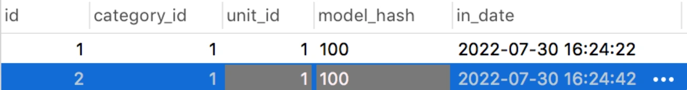
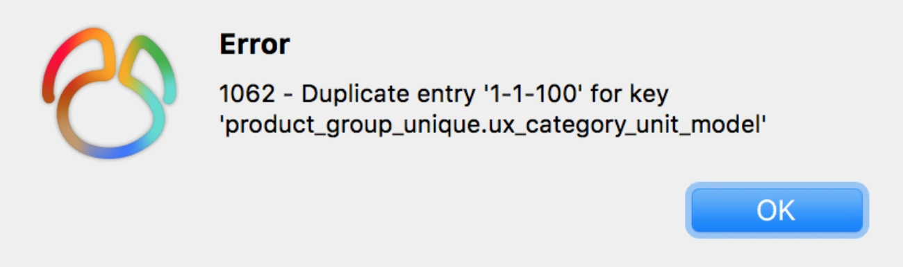
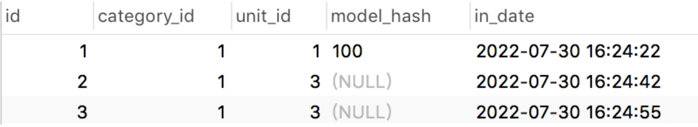
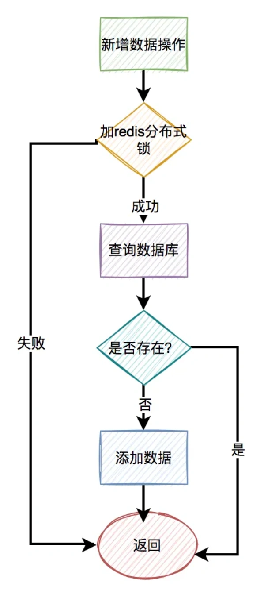

# 唯一索引失效问题

## **<font style="color:rgb(34, 34, 34);background-color:rgb(248, 246, 244);">前言</font>**
<font style="color:rgb(51, 51, 51);background-color:rgb(248, 246, 244);">前段时间我踩过一个坑：在mysql8的一张innodb引擎的表中，加了唯一索引，但最后发现数据竟然还是重复了。</font>

<font style="color:rgb(51, 51, 51);background-color:rgb(248, 246, 244);">到底怎么回事呢？</font>

<font style="color:rgb(51, 51, 51);background-color:rgb(248, 246, 244);">本文通过一次踩坑经历，聊聊唯一索引，一些有意思的知识点。</font>

## **<font style="color:rgb(34, 34, 34);background-color:rgb(248, 246, 244);">1.还原问题现场</font>**
<font style="color:rgb(51, 51, 51);background-color:rgb(248, 246, 244);">前段时间，为了防止商品组产生重复的数据，我专门加了一张防重表。</font>

<font style="color:rgb(51, 51, 51);background-color:rgb(248, 246, 244);">如果大家对防重表，比较感兴趣，可以看看我的另一篇文章 《</font>[高并发下如何防重？](https://mp.weixin.qq.com/s?__biz=MzkwNjMwMTgzMQ==&mid=2247495570&idx=1&sn=eed3102c7dffc4ddbc59844dd9b865a5&chksm=c0e8377af79fbe6c29aefa3ae3aab48c6459b673005e2f97ae402172f6e5cdf8573aea5e7663&token=758132007&lang=zh_CN&scene=21#wechat_redirect)<font style="color:rgb(51, 51, 51);background-color:rgb(248, 246, 244);">》，里面有详细的介绍。</font>

<font style="color:rgb(51, 51, 51);background-color:rgb(248, 246, 244);">问题就出在商品组的防重表上。</font>

<font style="color:rgb(51, 51, 51);background-color:rgb(248, 246, 244);">具体表结构如下：</font>

```plain
CREATE&nbsp;TABLE&nbsp;`product_group_unique`&nbsp;(
&nbsp;&nbsp;`id`&nbsp;bigint&nbsp;NOT&nbsp;NULL,
&nbsp;&nbsp;`category_id`&nbsp;bigint&nbsp;NOT&nbsp;NULL,
&nbsp;&nbsp;`unit_id`&nbsp;bigint&nbsp;NOT&nbsp;NULL,
&nbsp;&nbsp;`model_hash`&nbsp;varchar(255)&nbsp;COLLATE&nbsp;utf8mb4_bin&nbsp;DEFAULT&nbsp;NULL,
&nbsp;&nbsp;`in_date`&nbsp;datetime&nbsp;NOT&nbsp;NULL,
&nbsp;&nbsp;PRIMARY&nbsp;KEY&nbsp;(`id`)
)&nbsp;ENGINE=InnoDB&nbsp;DEFAULT&nbsp;CHARSET=utf8mb4&nbsp;COLLATE=utf8mb4_bin;
```

<font style="color:rgb(51, 51, 51);background-color:rgb(248, 246, 244);">为了保证数据的唯一性，我给那种商品组防重表，建了唯一索引：</font>

```plain
alter&nbsp;table&nbsp;product_group_unique&nbsp;add&nbsp;unique&nbsp;index&nbsp;
ux_category_unit_model(category_id,unit_id,model_hash);
```

<font style="color:rgb(51, 51, 51);background-color:rgb(248, 246, 244);">根据分类编号、单位编号和商品组属性的hash值，可以唯一确定一个商品组。</font>

<font style="color:rgb(51, 51, 51);background-color:rgb(248, 246, 244);">给商品组防重表创建了唯一索引之后，第二天查看数据，发现该表中竟然产生了重复的数据：</font>


<font style="color:rgb(51, 51, 51);background-color:rgb(248, 246, 244);">表中第二条数据和第三条数据重复了。</font>

<font style="color:rgb(51, 51, 51);background-color:rgb(248, 246, 244);">这是为什么呢？</font>

## **<font style="color:rgb(34, 34, 34);background-color:rgb(248, 246, 244);">2.唯一索引字段包含null</font>**
<font style="color:rgb(51, 51, 51);background-color:rgb(248, 246, 244);">如果你仔细查看表中的数据，会发现其中一个比较特殊地方：商品组属性的hash值（model_hash字段）可能为null，即商品组允许不配置任何属性。</font>

<font style="color:rgb(51, 51, 51);background-color:rgb(248, 246, 244);">在product_group_unique表中插入了一条model_hash字段等于100的重复数据：</font>



<font style="color:rgb(51, 51, 51);background-color:rgb(248, 246, 244);">执行结果：</font>



<font style="color:rgb(51, 51, 51);background-color:rgb(248, 246, 244);">从上图中看出，mysql的唯一性约束生效了，重复数据被拦截了。</font>

<font style="color:rgb(51, 51, 51);background-color:rgb(248, 246, 244);">接下来，我们再插入两条model_hash为null的数据，其中第三条数据跟第二条数据中category_id、unit_id和model_hash字段值都一样。</font>



<font style="color:rgb(51, 51, 51);background-color:rgb(248, 246, 244);">从图中看出，竟然执行成功了。</font>

<font style="color:rgb(51, 51, 51);background-color:rgb(248, 246, 244);">换句话说，如果唯一索引的字段中，出现了null值，则唯一性约束不会生效。</font>

<font style="color:rgb(51, 51, 51);background-color:rgb(248, 246, 244);">最终插入的数据情况是这样的：</font>

1. **<font style="color:rgb(34, 34, 34);background-color:rgb(248, 246, 244);">当model_hash字段不为空时，不会产生重复的数据。</font>**
2. **<font style="color:rgb(34, 34, 34);background-color:rgb(248, 246, 244);">当model_hash字段为空时，会生成重复的数据。</font>**

<font style="color:rgb(100, 100, 100);background-color:rgb(248, 246, 244);">我们需要特别注意：创建唯一索引的字段，都不能允许为null，否则mysql的唯一性约束可能会失效。</font>

## **<font style="color:rgb(34, 34, 34);background-color:rgb(248, 246, 244);">3.逻辑删除表加唯一索引</font>**
<font style="color:rgb(51, 51, 51);background-color:rgb(248, 246, 244);">我们都知道唯一索引非常简单好用，但有时候，在表中它并不好加。</font>

<font style="color:rgb(51, 51, 51);background-color:rgb(248, 246, 244);">不信，我们一起往下看。</font>

<font style="color:rgb(51, 51, 51);background-color:rgb(248, 246, 244);">通常情况下，要删除表的某条记录的话，如果用delete语句操作的话。</font>

<font style="color:rgb(51, 51, 51);background-color:rgb(248, 246, 244);">例如：</font>

```plain
delete&nbsp;from&nbsp;product&nbsp;where&nbsp;id=123;
```

<font style="color:rgb(51, 51, 51);background-color:rgb(248, 246, 244);">这种delete操作是物理删除，即该记录被删除之后，后续通过sql语句基本查不出来。（不过通过其他技术手段可以找回，那是后话了）</font>

<font style="color:rgb(51, 51, 51);background-color:rgb(248, 246, 244);">还有另外一种是逻辑删除，主要是通过update语句操作的。</font>

<font style="color:rgb(51, 51, 51);background-color:rgb(248, 246, 244);">例如：</font>

```plain
update&nbsp;product&nbsp;set&nbsp;delete_status=1,edit_time=now(3)&nbsp;
where&nbsp;id=123;
```

<font style="color:rgb(51, 51, 51);background-color:rgb(248, 246, 244);">逻辑删除需要在表中额外增加一个删除状态字段，用于记录数据是否被删除。在所有的业务查询的地方，都需要过滤掉已经删除的数据。</font>

<font style="color:rgb(51, 51, 51);background-color:rgb(248, 246, 244);">通过这种方式删除数据之后，数据任然还在表中，只是从逻辑上过滤了删除状态的数据而已。</font>

<font style="color:rgb(51, 51, 51);background-color:rgb(248, 246, 244);">其实对于这种逻辑删除的表，是没法加唯一索引的。</font>

<font style="color:rgb(51, 51, 51);background-color:rgb(248, 246, 244);">为什么呢？</font>

<font style="color:rgb(51, 51, 51);background-color:rgb(248, 246, 244);">假设之前给商品表中的name和model加了唯一索引，如果用户把某条记录删除了，delete_status设置成1了。后来，该用户发现不对，又重新添加了一模一样的商品。</font>

<font style="color:rgb(51, 51, 51);background-color:rgb(248, 246, 244);">由于唯一索引的存在，该用户第二次添加商品会失败，即使该商品已经被删除了，也没法再添加了。</font>

<font style="color:rgb(51, 51, 51);background-color:rgb(248, 246, 244);">这个问题显然有点严重。</font>

<font style="color:rgb(51, 51, 51);background-color:rgb(248, 246, 244);">有人可能会说：把name、model和delete_status三个字段同时做成唯一索引不就行了？</font>

<font style="color:rgb(51, 51, 51);background-color:rgb(248, 246, 244);">答：这样做确实可以解决用户逻辑删除了某个商品，后来又重新添加相同的商品时，添加不了的问题。但如果第二次添加的商品，又被删除了。该用户第三次添加相同的商品，不也出现问题了？</font>

<font style="color:rgb(51, 51, 51);background-color:rgb(248, 246, 244);">由此可见，如果表中有逻辑删除功能，是不方便创建唯一索引的。</font>

<font style="color:rgb(51, 51, 51);background-color:rgb(248, 246, 244);">但如果真的想给包含逻辑删除的表，增加唯一索引，该怎么办呢？</font>

### **<font style="color:rgb(34, 34, 34);background-color:rgb(248, 246, 244);">3.1 删除状态+1</font>**
<font style="color:rgb(51, 51, 51);background-color:rgb(248, 246, 244);">通过前面知道，如果表中有逻辑删除功能，是不方便创建唯一索引的。</font>

<font style="color:rgb(51, 51, 51);background-color:rgb(248, 246, 244);">其根本原因是，记录被删除之后，delete_status会被设置成1，默认是0。相同的记录第二次删除的时候，delete_status被设置成1，但由于创建了唯一索引（把name、model和delete_status三个字段同时做成唯一索引），数据库中已存在delete_status为1的记录，所以这次会操作失败。</font>

<font style="color:rgb(51, 51, 51);background-color:rgb(248, 246, 244);">我们为啥不换一种思考：不要纠结于delete_status为1，表示删除，当delete_status为1、2、3等等，只要大于1都表示删除。</font>

<font style="color:rgb(51, 51, 51);background-color:rgb(248, 246, 244);">这样的话，每次删除都获取那条相同记录的最大删除状态，然后加1。</font>

<font style="color:rgb(51, 51, 51);background-color:rgb(248, 246, 244);">这样数据操作过程变成：</font>

1. **<font style="color:rgb(34, 34, 34);background-color:rgb(248, 246, 244);">添加记录a，delete_status=0。</font>**
2. **<font style="color:rgb(34, 34, 34);background-color:rgb(248, 246, 244);">删除记录a，delete_status=1。</font>**
3. **<font style="color:rgb(34, 34, 34);background-color:rgb(248, 246, 244);">添加记录a，delete_status=0。</font>**
4. **<font style="color:rgb(34, 34, 34);background-color:rgb(248, 246, 244);">删除记录a，delete_status=2。</font>**
5. **<font style="color:rgb(34, 34, 34);background-color:rgb(248, 246, 244);">添加记录a，delete_status=0。</font>**
6. **<font style="color:rgb(34, 34, 34);background-color:rgb(248, 246, 244);">删除记录a，delete_status=3。</font>**

<font style="color:rgb(51, 51, 51);background-color:rgb(248, 246, 244);">由于记录a，每次删除时，delete_status都不一样，所以可以保证唯一性。</font>

<font style="color:rgb(51, 51, 51);background-color:rgb(248, 246, 244);">该方案的优点是：不用调整字段，非常简单和直接。</font>

<font style="color:rgb(51, 51, 51);background-color:rgb(248, 246, 244);">缺点是：可能需要修改sql逻辑，特别是有些查询sql语句，有些使用delete_status=1判断删除状态的，需要改成delete_status>=1。</font>

### **<font style="color:rgb(34, 34, 34);background-color:rgb(248, 246, 244);">3.2 增加时间戳字段</font>**
<font style="color:rgb(51, 51, 51);background-color:rgb(248, 246, 244);">导致逻辑删除表，不好加唯一索引最根本的地方在逻辑删除那里。</font>

<font style="color:rgb(51, 51, 51);background-color:rgb(248, 246, 244);">我们为什么不加个字段，专门处理逻辑删除的功能呢？</font>

<font style="color:rgb(51, 51, 51);background-color:rgb(248, 246, 244);">答：可以增加时间戳字段。</font>

<font style="color:rgb(51, 51, 51);background-color:rgb(248, 246, 244);">把name、model、delete_status和timeStamp，四个字段同时做成唯一索引</font>

<font style="color:rgb(51, 51, 51);background-color:rgb(248, 246, 244);">在添加数据时，timeStamp字段写入默认值1。</font>

<font style="color:rgb(51, 51, 51);background-color:rgb(248, 246, 244);">然后一旦有逻辑删除操作，则自动往该字段写入时间戳。</font>

<font style="color:rgb(51, 51, 51);background-color:rgb(248, 246, 244);">这样即使是同一条记录，逻辑删除多次，每次生成的时间戳也不一样，也能保证数据的唯一性。</font>

<font style="color:rgb(51, 51, 51);background-color:rgb(248, 246, 244);">时间戳一般精确到秒。</font>

<font style="color:rgb(51, 51, 51);background-color:rgb(248, 246, 244);">除非在那种极限并发的场景下，对同一条记录，两次不同的逻辑删除操作，产生了相同的时间戳。</font>

<font style="color:rgb(51, 51, 51);background-color:rgb(248, 246, 244);">这时可以将时间戳精确到毫秒。</font>

<font style="color:rgb(51, 51, 51);background-color:rgb(248, 246, 244);">该方案的优点是：可以在不改变已有代码逻辑的基础上，通过增加新字段实现了数据的唯一性。</font>

<font style="color:rgb(51, 51, 51);background-color:rgb(248, 246, 244);">缺点是：在极限的情况下，可能还是会产生重复数据。</font>

### **<font style="color:rgb(34, 34, 34);background-color:rgb(248, 246, 244);">3.3 增加id字段</font>**
<font style="color:rgb(51, 51, 51);background-color:rgb(248, 246, 244);">其实，增加时间戳字段基本可以解决问题。但在在极限的情况下，可能还是会产生重复数据。</font>

<font style="color:rgb(51, 51, 51);background-color:rgb(248, 246, 244);">有没有办法解决这个问题呢？</font>

<font style="color:rgb(51, 51, 51);background-color:rgb(248, 246, 244);">答：增加主键字段：delete_id。</font>

<font style="color:rgb(51, 51, 51);background-color:rgb(248, 246, 244);">该方案的思路跟增加时间戳字段一致，即在添加数据时给delete_id设置默认值1，然后在逻辑删除时，给delete_id赋值成当前记录的主键id。</font>

<font style="color:rgb(51, 51, 51);background-color:rgb(248, 246, 244);">把name、model、delete_status和delete_id，四个字段同时做成唯一索引。</font>

<font style="color:rgb(51, 51, 51);background-color:rgb(248, 246, 244);">这可能是最优方案，无需修改已有删除逻辑，也能保证数据的唯一性。</font>

## **<font style="color:rgb(34, 34, 34);background-color:rgb(248, 246, 244);">4. 重复历史数据如何加唯一索引？</font>**
<font style="color:rgb(51, 51, 51);background-color:rgb(248, 246, 244);">前面聊过如果表中有逻辑删除功能，不太好加唯一索引，但通过文中介绍的三种方案，可以顺利的加上唯一索引。</font>

<font style="color:rgb(51, 51, 51);background-color:rgb(248, 246, 244);">但来自灵魂的一问：如果某张表中，已存在历史重复数据，该如何加索引呢？</font>

<font style="color:rgb(51, 51, 51);background-color:rgb(248, 246, 244);">最简单的做法是，增加一张防重表，然后把数据初始化进去。</font>

<font style="color:rgb(51, 51, 51);background-color:rgb(248, 246, 244);">可以写一条类似这样的sql：</font>

```plain
insert&nbsp;into&nbsp;product_unqiue(id,name,category_id,unit_id,model)&nbsp;
select&nbsp;max(id),&nbsp;select&nbsp;name,category_id,unit_id,model&nbsp;from&nbsp;product
group&nbsp;by&nbsp;name,category_id,unit_id,model;
```

<font style="color:rgb(51, 51, 51);background-color:rgb(248, 246, 244);">这样做可以是可以，但今天的主题是直接在原表中加唯一索引，不用防重表。</font>

<font style="color:rgb(51, 51, 51);background-color:rgb(248, 246, 244);">那么，这个唯一索引该怎么加呢？</font>

<font style="color:rgb(51, 51, 51);background-color:rgb(248, 246, 244);">其实可以借鉴上一节中，增加id字段的思路。</font>

<font style="color:rgb(51, 51, 51);background-color:rgb(248, 246, 244);">增加一个delete_id字段。</font>

<font style="color:rgb(51, 51, 51);background-color:rgb(248, 246, 244);">不过在给product表创建唯一索引之前，先要做数据处理。</font>

<font style="color:rgb(51, 51, 51);background-color:rgb(248, 246, 244);">获取相同记录的最大id：</font>

```plain
select&nbsp;max(id),&nbsp;select&nbsp;name,category_id,unit_id,model&nbsp;from&nbsp;product
group&nbsp;by&nbsp;name,category_id,unit_id,model;
```

<font style="color:rgb(51, 51, 51);background-color:rgb(248, 246, 244);">然后将delete_id字段设置成1。</font>

<font style="color:rgb(51, 51, 51);background-color:rgb(248, 246, 244);">然后将其他的相同记录的delete_id字段，设置成当前的主键。</font>

<font style="color:rgb(51, 51, 51);background-color:rgb(248, 246, 244);">这样就能区分历史的重复数据了。</font>

<font style="color:rgb(51, 51, 51);background-color:rgb(248, 246, 244);">当所有的delete_id字段都设置了值之后，就能给name、model、delete_status和delete_id，四个字段加唯一索引了。</font>

<font style="color:rgb(51, 51, 51);background-color:rgb(248, 246, 244);">完美。</font>

## **<font style="color:rgb(34, 34, 34);background-color:rgb(248, 246, 244);">5.给大字段加唯一索引</font>**
<font style="color:rgb(51, 51, 51);background-color:rgb(248, 246, 244);">接下来，我们聊一个有趣的话题：如何给大字段增加唯一索引。</font>

<font style="color:rgb(51, 51, 51);background-color:rgb(248, 246, 244);">有时候，我们需要给几个字段同时加一个唯一索引，比如给name、model、delete_status和delete_id等。</font>

<font style="color:rgb(51, 51, 51);background-color:rgb(248, 246, 244);">但如果model字段很大，这样就会导致该唯一索引，可能会占用较多存储空间。</font>

<font style="color:rgb(51, 51, 51);background-color:rgb(248, 246, 244);">我们都知道唯一索引，也会走索引。</font>

<font style="color:rgb(51, 51, 51);background-color:rgb(248, 246, 244);">如果在索引的各个节点中存大数据，检索效率会非常低。</font>

<font style="color:rgb(51, 51, 51);background-color:rgb(248, 246, 244);">由此，有必要对唯一索引长度做限制。</font>

<font style="color:rgb(51, 51, 51);background-color:rgb(248, 246, 244);">目前mysql innodb存储引擎中索引允许的最大长度是3072 bytes，其中unqiue key最大长度是1000 bytes。</font>

<font style="color:rgb(51, 51, 51);background-color:rgb(248, 246, 244);">如果字段太大了，超过了1000 bytes，显然是没法加唯一索引的。</font>

<font style="color:rgb(51, 51, 51);background-color:rgb(248, 246, 244);">此时，有没有解决办法呢？</font>

### **<font style="color:rgb(34, 34, 34);background-color:rgb(248, 246, 244);">5.1 增加hash字段</font>**
<font style="color:rgb(51, 51, 51);background-color:rgb(248, 246, 244);">我们可以增加一个hash字段，取大字段的hash值，生成一个较短的新值。该值可以通过一些hash算法生成，固定长度16位或者32位等。</font>

<font style="color:rgb(51, 51, 51);background-color:rgb(248, 246, 244);">我们只需要给name、hash、delete_status和delete_id字段，增加唯一索引。</font>

<font style="color:rgb(51, 51, 51);background-color:rgb(248, 246, 244);">这样就能避免唯一索引太长的问题。</font>

<font style="color:rgb(51, 51, 51);background-color:rgb(248, 246, 244);">但它也会带来一个新问题：</font>

<font style="color:rgb(51, 51, 51);background-color:rgb(248, 246, 244);">一般hash算法会产生hash冲突，即两个不同的值，通过hash算法生成值相同。</font>

<font style="color:rgb(51, 51, 51);background-color:rgb(248, 246, 244);">当然如果还有其他字段可以区分，比如：name，并且业务上允许这种重复的数据，不写入数据库，该方案也是可行的。</font>

### **<font style="color:rgb(34, 34, 34);background-color:rgb(248, 246, 244);">5.2 不加唯一索引</font>**
<font style="color:rgb(51, 51, 51);background-color:rgb(248, 246, 244);">如果实在不好加唯一索引，就不加唯一索引，通过其他技术手段保证唯一性。</font>

<font style="color:rgb(51, 51, 51);background-color:rgb(248, 246, 244);">如果新增数据的入口比较少，比如只有job，或者数据导入，可以单线程顺序执行，这样就能保证表中的数据不重复。</font>

<font style="color:rgb(51, 51, 51);background-color:rgb(248, 246, 244);">如果新增数据的入口比较多，最终都发mq消息，在mq消费者中单线程处理。</font>

### **<font style="color:rgb(34, 34, 34);background-color:rgb(248, 246, 244);">5.3 redis分布式锁</font>**
<font style="color:rgb(51, 51, 51);background-color:rgb(248, 246, 244);">由于字段太大了，在mysql中不好加唯一索引，为什么不用redis分布式锁呢？</font>

<font style="color:rgb(51, 51, 51);background-color:rgb(248, 246, 244);">但如果直接加给name、model、delete_status和delete_id字段，加redis分布式锁，显然没啥意义，效率也不会高。</font>

<font style="color:rgb(51, 51, 51);background-color:rgb(248, 246, 244);">我们可以结合5.1章节，用name、model、delete_status和delete_id字段，生成一个hash值，然后给这个新值加锁。</font>

<font style="color:rgb(51, 51, 51);background-color:rgb(248, 246, 244);">即使遇到hash冲突也没关系，在并发的情况下，毕竟是小概率事件。</font>



## **<font style="color:rgb(34, 34, 34);background-color:rgb(248, 246, 244);">6.批量插入数据</font>**
<font style="color:rgb(51, 51, 51);background-color:rgb(248, 246, 244);">有些小伙们，可能认为，既然有redis分布式锁了，就可以不用唯一索引了。</font>

<font style="color:rgb(51, 51, 51);background-color:rgb(248, 246, 244);">那是你没遇到，批量插入数据的场景。</font>

<font style="color:rgb(51, 51, 51);background-color:rgb(248, 246, 244);">假如通过查询操作之后，发现有一个集合：list的数据，需要批量插入数据库。</font>

<font style="color:rgb(51, 51, 51);background-color:rgb(248, 246, 244);">如果使用redis分布式锁，需要这样操作：</font>

```plain
for(Product&nbsp;product:&nbsp;list)&nbsp;{
&nbsp;&nbsp;&nbsp;try&nbsp;{
&nbsp;&nbsp;&nbsp;&nbsp;&nbsp;&nbsp;&nbsp;&nbsp;String&nbsp;hash&nbsp;=&nbsp;hash(product);
&nbsp;&nbsp;&nbsp;&nbsp;&nbsp;&nbsp;&nbsp;&nbsp;rLock.lock(hash);
&nbsp;&nbsp;&nbsp;&nbsp;&nbsp;&nbsp;&nbsp;&nbsp;//查询数据
&nbsp;&nbsp;&nbsp;&nbsp;&nbsp;&nbsp;&nbsp;&nbsp;//插入数据
&nbsp;&nbsp;&nbsp;&nbsp;}&nbsp;catch&nbsp;(InterruptedException&nbsp;e)&nbsp;{
&nbsp;&nbsp;&nbsp;&nbsp;&nbsp;&nbsp;&nbsp;log.error(e);
&nbsp;&nbsp;&nbsp;&nbsp;}&nbsp;finally&nbsp;{
&nbsp;&nbsp;&nbsp;&nbsp;&nbsp;&nbsp;&nbsp;&nbsp;rLock.unlock();
&nbsp;&nbsp;&nbsp;&nbsp;}
}
```

<font style="color:rgb(51, 51, 51);background-color:rgb(248, 246, 244);">需要在一个循环中，给每条数据都加锁。</font>

<font style="color:rgb(51, 51, 51);background-color:rgb(248, 246, 244);">这样性能肯定不会好。</font>

<font style="color:rgb(51, 51, 51);background-color:rgb(248, 246, 244);">当然有些小伙伴持反对意见，说使用redis的pipeline批量操作不就可以了？</font>

<font style="color:rgb(51, 51, 51);background-color:rgb(248, 246, 244);">也就是一次性给500条，或者1000条数据上锁，最后使用完一次性释放这些锁？</font>

<font style="color:rgb(51, 51, 51);background-color:rgb(248, 246, 244);">想想都有点不靠谱，这个锁得有多大呀。</font>

<font style="color:rgb(51, 51, 51);background-color:rgb(248, 246, 244);">极容易造成锁超时，比如业务代码都没有执行完，锁的过期时间就已经到了。</font>

<font style="color:rgb(51, 51, 51);background-color:rgb(248, 246, 244);">针对这种批量操作，如果此时使用mysql的唯一索引，直接批量insert即可，一条sql语句就能搞定。</font>

<font style="color:rgb(51, 51, 51);background-color:rgb(248, 246, 244);">数据库会自动判断，如果存在重复的数据，会报错。如果不存在重复数据，才允许插入数据。</font>


> 更新: 2024-05-20 17:15:45  
> 原文: <https://www.yuque.com/yuqueyonghue6cvnv/cxhfwd/cbrngmcxv9ncwbew>