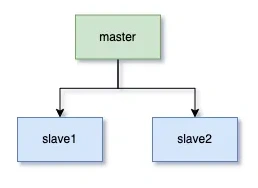
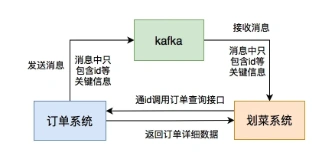
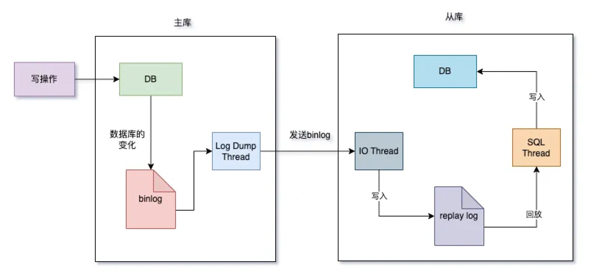

# 数据库主从延迟问题

## **前言**
说到MySQL数据库主从延迟问题，我还是深有体会的，因为我之前经常遇到。

我之前在一家餐饮工作公司中，当时我们的系统属于订单的下游业务系统。

在中午和晚上的用餐高峰期，用户并发量还是不小的。订单系统为了保证性能和高可用，做了主从分离架构。

一个主库，两个从库。

主库主要用来写数据，从库主要是用来读数据，主库的数据会实时同步到从库。

但偶尔会出现主从延迟问题。

## **1 案发现场**
而我们划菜系统跟订单系统之间，是通过MQ进行通信的，流程如下：

用户下单之后，订单系统会发生一条MQ消息，消息体只包含id等关键信息。

划菜系统消费这条MQ消息之后，会通过订单id，调用订单系统的订单查询接口查询出订单的详情数据。

订单查询接口的数据，是从订单的从库查询出来的。

如果一旦出现数据库主从同步延迟的问题，就可能会出现订单查询接口返回的数据不完整。

会导致划菜系统的表写入数据失败。

## **2 MySQL主从同步的原理**
MySQL的主库会将数据库的变化，以二进制的形式，保存到磁盘上的binlog文件中。

主从同步就是将主库上的binlog文件，传输到从库上。

这个过程通常情况下是异步的。

流程图如下：

1. 数据库主库的写操作，会将数据库的变化写入binlog文件中。
2. 主库同时会创建一个Log dump线程，将binlog发送给从库。
3. 从库的IO线程接收到binlog，会将数据库的更新操作写入到replay log文件中。
4. 从库的SQL线程会读取replay log文件，并且做回放，将数据写入到从库中。

如果中间的任何一个环节出现问题，都可能会导致数据库主从延迟的问题。

## **3 如何解决主从延迟问题？**
### **3.1 网络问题**
网络问题，会导致binlog从主库发生到主从时，出现问题。

我们可以增加网络的带宽，由100M升级到300M。

### **3.2 服务器性能问题**
一般情况下，主库的性能要比从库的要好。

如果高并发的写入数据，会导致产生大量的binlog数据，在从库通过replay log回放的过程会比较慢。

从而导致从库写入数据的速度。

这种情况下，可以升级从库的服务器配置，跟主库保持一致。

### **3.3 避免大事务问题**
业务系统中的大事务，不光会导致主库写数据的速度变慢，还会导致主从数据同步时，从库写数据的速度同样变慢。

我们需要避免大事务问题，对业务代码中的大事务做排查，缩小事务的范围。

有些业务代码，可以放到事务之外的，尽可能放到事务之外执行，比如：有些查询方法。

有些可以异步执行的代码，尽可能异步执行。

### **3.4 MySQL版本太低**
MySQL的低版本，只支持单线程同步binlog，同步速度非常慢。

这种情况下，可以升级MySQL版本，支持多线程同步。

### **3.5 从库太多**
在主从同步时，如果从库太多，可能会导致同步速度变慢。

主从同步，要所有从库的数据，都同步成功了，才算真正的成功了。

针对这种情况，建议减少，从库的数量，一般不建议超过5个。

## **4 我们的解决方案**
我们当时找DB升级了网络带宽。

优化了业务代码，减少了代码中的大事务，将非核心业务剥离出来了。

此外，增加了自动重试机制。

如果MQ消费者调用订单查询接口时，出现了数据不完整的情况。

会将异常数据写入数据库，有专门的job自动发起重试。

> 更新: 2024-09-05 11:02:45  
> 原文: <https://www.yuque.com/yuqueyonghue6cvnv/cxhfwd/qkxq14axsu2yfd3a>