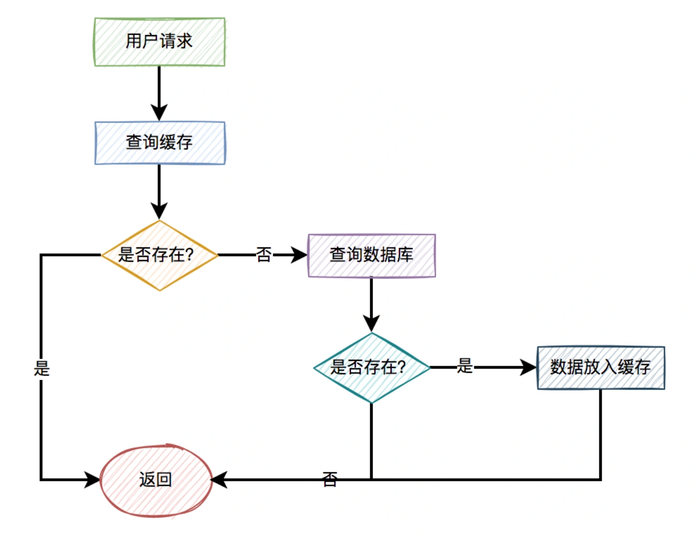
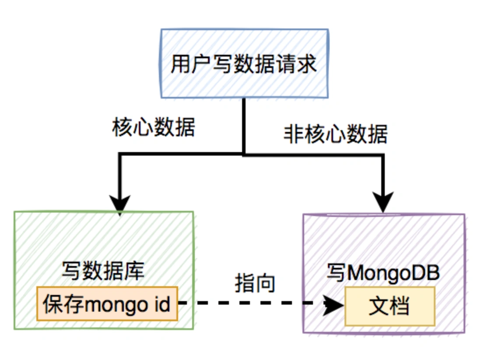
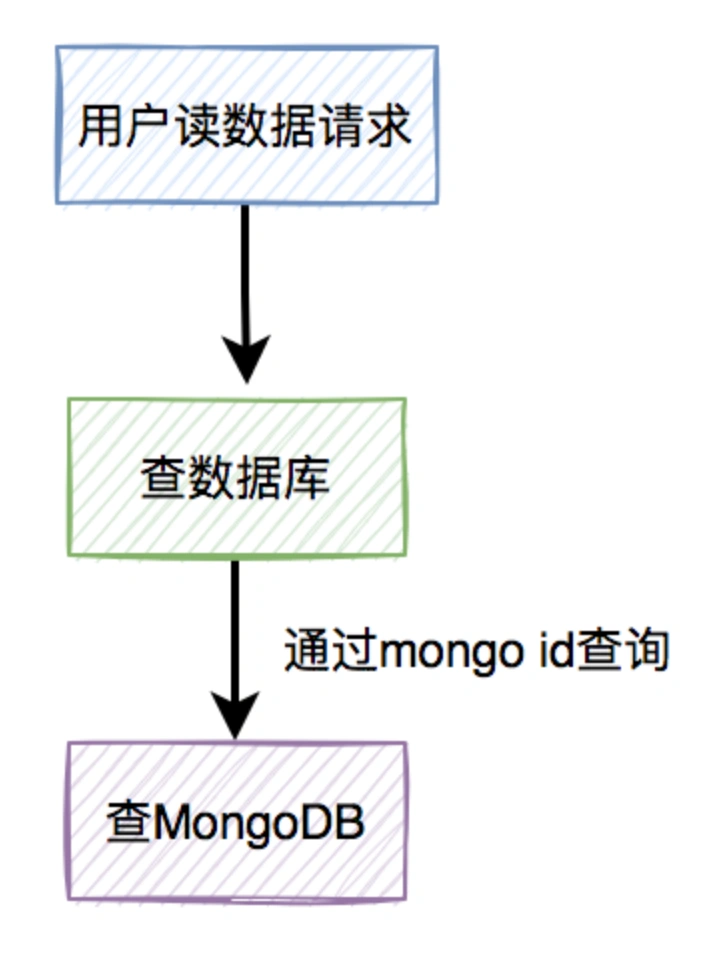
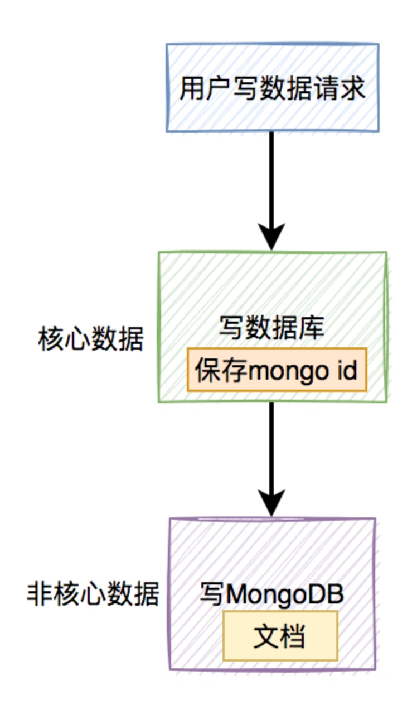
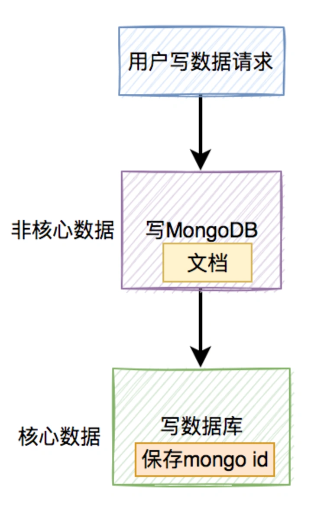
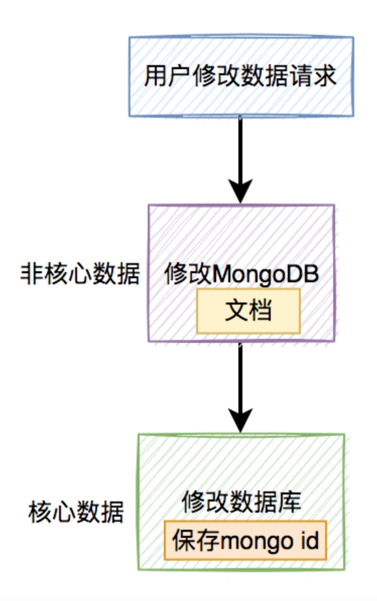
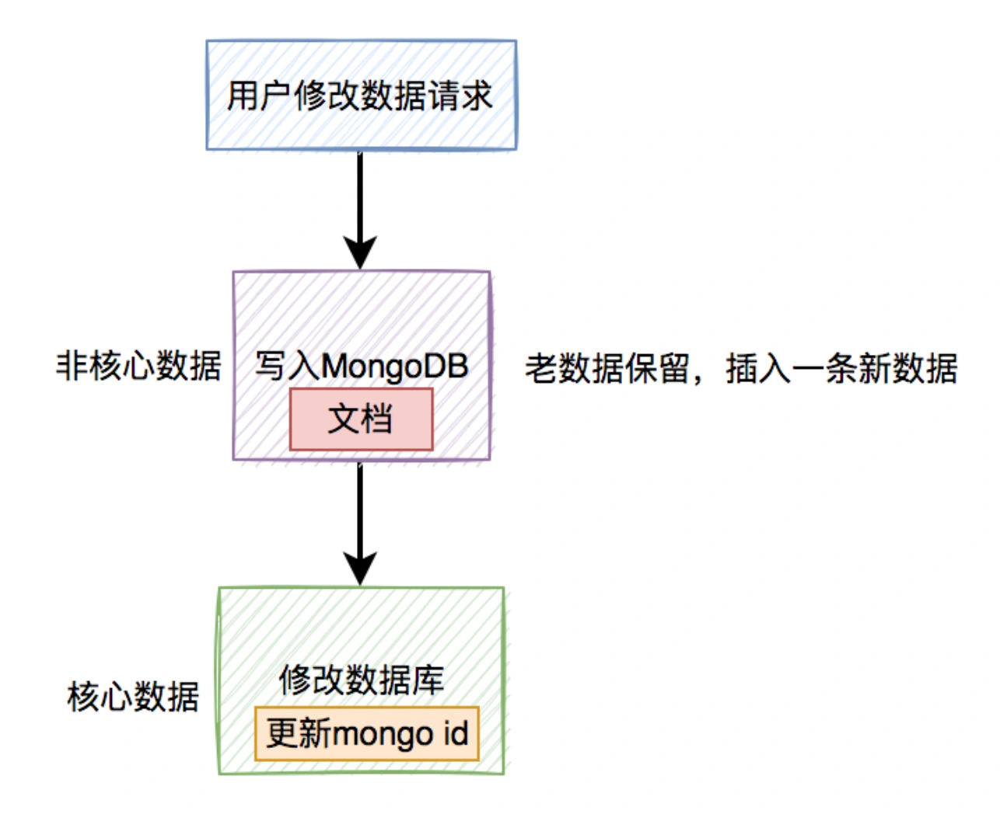
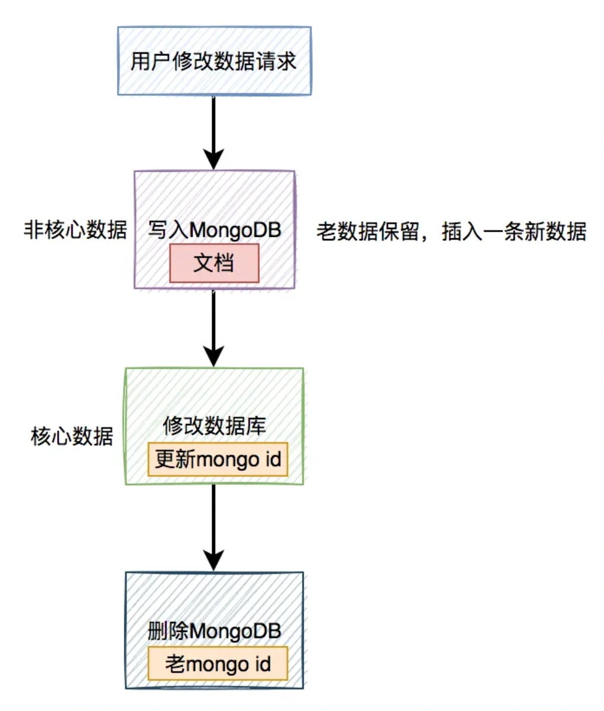
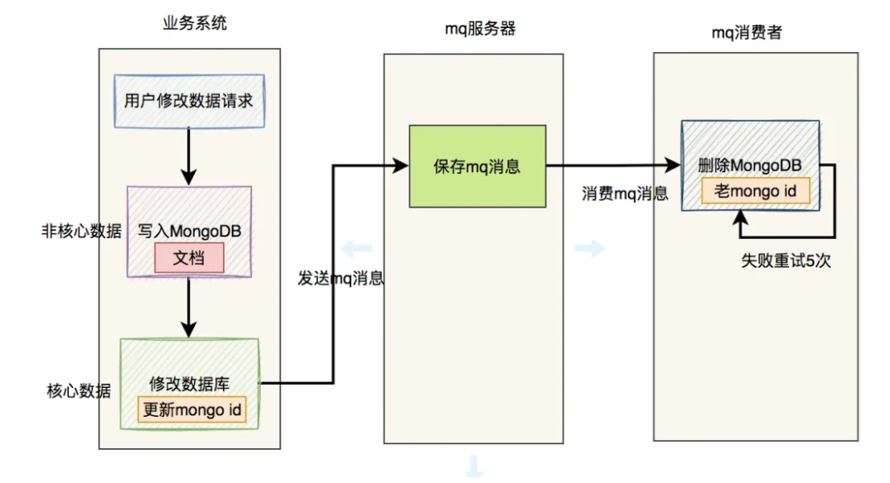

# 数据库和MongoDB双写数据一致性问题

## **<font style="color:rgb(34, 34, 34);background-color:rgb(248, 246, 244);">前言</font>**
<font style="color:rgb(51, 51, 51);background-color:rgb(248, 246, 244);">最近在我的技术群里，有位小伙伴问了大家一个问题：如何保证Mongodb和数据库双写的数据一致性？</font>

<font style="color:rgb(51, 51, 51);background-color:rgb(248, 246, 244);">群友们针对这个技术点讨论的内容，引起了我的兴趣。</font>

<font style="color:rgb(51, 51, 51);background-color:rgb(248, 246, 244);">其实我在实际工作中的有些业务场景，也在使用Mongodb，也遇到过双写的数据一致性问题。</font>

<font style="color:rgb(51, 51, 51);background-color:rgb(248, 246, 244);">今天跟大家一起分享一下，这类问题的解决办法，希望对你会有所帮助。</font>

## **<font style="color:rgb(34, 34, 34);background-color:rgb(248, 246, 244);">1 常见误区</font>**
<font style="color:rgb(51, 51, 51);background-color:rgb(248, 246, 244);">很多小伙伴看到双写数据一致性问题，首先会想到的是Redis和数据库的数据双写一致性问题。</font>

<font style="color:rgb(51, 51, 51);background-color:rgb(248, 246, 244);">有些小伙伴认为，Redis和数据库的数据双写一致性问题，跟Mongodb和数据库的数据双写一致性问题，是同一个问题。</font>

<font style="color:rgb(51, 51, 51);background-color:rgb(248, 246, 244);">但如果你仔细想想它们的使用场景，就会发现有一些差异。</font>

### **<font style="color:rgb(34, 34, 34);background-color:rgb(248, 246, 244);">1.1 我们是如何用缓存的？</font>**
<font style="color:rgb(51, 51, 51);background-color:rgb(248, 246, 244);">Redis缓存能提升我们系统的性能。</font>

<font style="color:rgb(51, 51, 51);background-color:rgb(248, 246, 244);">一般情况下，如果有用户请求过来，先查缓存，如果缓存中存在数据，则直接返回。如果缓存中不存在，则再查数据库，如果数据库中存在，则将数据放入缓存，然后返回。如果数据库中也不存在，则直接返回失败。</font>

<font style="color:rgb(51, 51, 51);background-color:rgb(248, 246, 244);">流程图如下：</font>



<font style="color:rgb(51, 51, 51);background-color:rgb(248, 246, 244);">有了缓存之后，能够减轻数据库的压力，提升系统性能。</font>

<font style="color:rgb(51, 51, 51);background-color:rgb(248, 246, 244);">通常情况下，保证缓存和数据双写数据一致性，最常用的技术方案是：延迟双删。</font>

<font style="color:rgb(51, 51, 51);background-color:rgb(248, 246, 244);">感兴趣的小伙伴，可以看看我的另一篇文章《</font>[如何保证数据库和缓存双写一致性？](https://mp.weixin.qq.com/s?__biz=MzkwNjMwMTgzMQ==&mid=2247493521&idx=1&sn=bff84e7a819d79e4b8eb7e722e96ddfc&chksm=c0e83f79f79fb66f2e7bf03a104580b404ea0a3c977846e428f13c1f12fbad46d4d778b2da14&token=660773166&lang=zh_CN&scene=21#wechat_redirect)<font style="color:rgb(51, 51, 51);background-color:rgb(248, 246, 244);">》，里面有非常详细的介绍。</font>

### **<font style="color:rgb(34, 34, 34);background-color:rgb(248, 246, 244);">1.2 我们是如何用MongoDB的？</font>**
<font style="color:rgb(51, 51, 51);background-color:rgb(248, 246, 244);">MongoDB是一个高可用、分布式的文档数据库，用于大容量数据存储。文档存储一般用类似json的格式存储，存储的内容是文档型的。</font>

<font style="color:rgb(51, 51, 51);background-color:rgb(248, 246, 244);">通常情况下，我们用来存储大数据或者json格式的数据。</font>

<font style="color:rgb(51, 51, 51);background-color:rgb(248, 246, 244);">用户写数据的请求，核心数据会被写入数据库，json格式的非核心数据，可能会写入MongoDB。</font>

<font style="color:rgb(51, 51, 51);background-color:rgb(248, 246, 244);">流程图如下：</font>



<font style="color:rgb(51, 51, 51);background-color:rgb(248, 246, 244);">此外，在数据库的表中，保存了MongoDB相关文档的id。</font>

<font style="color:rgb(51, 51, 51);background-color:rgb(248, 246, 244);">用户读数据的请求，会先读数据库中的数据，然后通过文档的id，读取MongoDB中的数据。</font>

<font style="color:rgb(51, 51, 51);background-color:rgb(248, 246, 244);">流程图如下：</font>



<font style="color:rgb(51, 51, 51);background-color:rgb(248, 246, 244);">这样可以保证核心属性不会丢失，同时存储用户传入的较大的数据，两全其美。</font>

<font style="color:rgb(51, 51, 51);background-color:rgb(248, 246, 244);">Redis和MongoDB在我们实际工作中的用途不一样，导致了它们双写数据一致性问题的解决方案是不一样的。</font>

<font style="color:rgb(51, 51, 51);background-color:rgb(248, 246, 244);">接下来我们一起看看，如何保证MongoDB和数据库的双写的数据一致性？</font>

## **<font style="color:rgb(34, 34, 34);background-color:rgb(248, 246, 244);">2 如何保证双写一致性？</font>**
<font style="color:rgb(51, 51, 51);background-color:rgb(248, 246, 244);">目前双写MongoDB和数据库的数据，用的最多的就是下面这两种方案。</font>

### **<font style="color:rgb(34, 34, 34);background-color:rgb(248, 246, 244);">2.1 先写数据库，再写MongoDB</font>**
<font style="color:rgb(51, 51, 51);background-color:rgb(248, 246, 244);">该方案最简单，先在数据库中写入核心数据，再在MongoDB中写入非核心数据。</font>

<font style="color:rgb(51, 51, 51);background-color:rgb(248, 246, 244);">流程图如下：</font>



<font style="color:rgb(51, 51, 51);background-color:rgb(248, 246, 244);">如果有些业务场景，对数据的完整性要求不高，即非核心数据可有可无，使用该方案也是可以的。</font>

<font style="color:rgb(51, 51, 51);background-color:rgb(248, 246, 244);">但如果有些业务场景，对数据完整性要求比较高，用这套方案可能会有问题。</font>

<font style="color:rgb(51, 51, 51);background-color:rgb(248, 246, 244);">当数据库刚保存了核心数据，此时网络出现异常，程序保存MongoDB的非核心数据时失败了。</font>

<font style="color:rgb(51, 51, 51);background-color:rgb(248, 246, 244);">但MongoDB并没有抛出异常，数据库中已经保存的数据没法回滚，这样会出现数据库中保存了数据，而MongoDB中没保存数据的情况，从而导致MongoDB中的非核心数据丢失的问题。</font>

<font style="color:rgb(51, 51, 51);background-color:rgb(248, 246, 244);">所以这套方案，在实际工作中使用不多。</font>

### **<font style="color:rgb(34, 34, 34);background-color:rgb(248, 246, 244);">2.2 先写MongoDB，再写数据库</font>**
<font style="color:rgb(51, 51, 51);background-color:rgb(248, 246, 244);">在该方案中，先在MongoDB中写入非核心数据，再在数据库中写入核心数据。</font>

<font style="color:rgb(51, 51, 51);background-color:rgb(248, 246, 244);">流程图如下：</font>



<font style="color:rgb(51, 51, 51);background-color:rgb(248, 246, 244);">关键问题来了：如果MongoDB中非核心数据写入成功了，但数据库中的核心数据写入失败了怎么办？</font>

<font style="color:rgb(51, 51, 51);background-color:rgb(248, 246, 244);">这时候MongoDB中非核心数据不会回滚，可能存在MongoDB中保存了数据，而数据库中没保存数据的问题，同样会出现数据不一致的问题。</font>

<font style="color:rgb(51, 51, 51);background-color:rgb(248, 246, 244);">答：我们忘了一个前提，查询MongoDB文档中的数据，必须通过数据库的表中保存的mongo id。但如果这个mongo id在数据库中都没有保存成功，那么，在MongoDB文档中的数据是永远都查询不到的。</font>

<font style="color:rgb(51, 51, 51);background-color:rgb(248, 246, 244);">也就是说，这种情况下MongoDB文档中保存的是垃圾数据，但对实际业务并没有影响。</font>

<font style="color:rgb(51, 51, 51);background-color:rgb(248, 246, 244);">这套方案可以解决双写数据一致性问题，但它同时也带来了两个新问题：</font>

1. <font style="color:rgb(51, 51, 51);background-color:rgb(248, 246, 244);">用户修改操作如何保存数据？</font>
2. <font style="color:rgb(51, 51, 51);background-color:rgb(248, 246, 244);">如何清理垃圾数据？</font>

## **<font style="color:rgb(34, 34, 34);background-color:rgb(248, 246, 244);">3 用户修改操作如何保存数据？</font>**
<font style="color:rgb(51, 51, 51);background-color:rgb(248, 246, 244);">我之前聊的先写MongoDB，再写数据库，这套方案中的流程图，其实主要说的是新增数据的场景。</font>

<font style="color:rgb(51, 51, 51);background-color:rgb(248, 246, 244);">但如果在用户修改数据的操作中，用户先修改MongoDB文档中的数据，再修改数据库表中的数据。</font>

<font style="color:rgb(51, 51, 51);background-color:rgb(248, 246, 244);">流程图如下：</font>



<font style="color:rgb(51, 51, 51);background-color:rgb(248, 246, 244);">如果出现MongoDB文档中的数据修改成功了，但数据库表中的数据修改失败了，不也出现问题了？</font>

<font style="color:rgb(51, 51, 51);background-color:rgb(248, 246, 244);">那么，用户修改操作时如何保存数据呢？</font>

<font style="color:rgb(51, 51, 51);background-color:rgb(248, 246, 244);">这就需要把流程调整一下，在修改MongoDB文档时，还是新增一条数据，不直接修改，生成一个新的mongo id。然后在修改数据库表中的数据时，同时更新mongo id字段为这个新值。</font>

<font style="color:rgb(51, 51, 51);background-color:rgb(248, 246, 244);">流程图如下：</font>



<font style="color:rgb(51, 51, 51);background-color:rgb(248, 246, 244);">这样如果新增MongoDB文档中的数据成功了，但修改数据库表中的数据失败了，也没有关系，因为数据库中老的数据，保存的是老的mongo id。通过该id，依然能从MongoDB文档中查询出数据。</font>

<font style="color:rgb(51, 51, 51);background-color:rgb(248, 246, 244);">使用该方案能够解决修改数据时，数据一致性问题，但同样会存在垃圾数据。</font>

<font style="color:rgb(51, 51, 51);background-color:rgb(248, 246, 244);">其实这个垃圾数据是可以即使删除的，具体流程图如下：</font>



<font style="color:rgb(51, 51, 51);background-color:rgb(248, 246, 244);">在之前的流程中，修改完数据库，更新了mongo id为新值，接下来，就把MongoDB文档中的那条老数据直接删了。</font>

<font style="color:rgb(51, 51, 51);background-color:rgb(248, 246, 244);">该方案可以解决用户修改操作中，99%的的垃圾数据，但还有那1%的情况，即如果最后删除失败该怎么办？</font>

<font style="color:rgb(51, 51, 51);background-color:rgb(248, 246, 244);">答：这就需要加重试机制了。</font>

<font style="color:rgb(51, 51, 51);background-color:rgb(248, 246, 244);">我们可以使用job或者mq进行重试，优先推荐使用mq增加重试功能。特别是想RocketMQ，自带了失败重试机制，有专门的重试队列，我们可以设置重试次数。</font>

<font style="color:rgb(51, 51, 51);background-color:rgb(248, 246, 244);">流程图优化如下：</font>



<font style="color:rgb(51, 51, 51);background-color:rgb(248, 246, 244);">将之前删除MongoDB文档中的数据操作，改成发送mq消息，有个专门的mq消费者，负责删除数据工作，可以做成共用的功能。它包含了失败重试机制，如果删除5次还是失败，则会把该消息保存到死信队列中。</font>

<font style="color:rgb(51, 51, 51);background-color:rgb(248, 246, 244);">然后专门有个程序监控死信队列中的数据，如果发现有数据，则发报警邮件。</font>

<font style="color:rgb(51, 51, 51);background-color:rgb(248, 246, 244);">这样基本可以解决修改删除垃圾数据失败的问题。</font>

## **<font style="color:rgb(34, 34, 34);background-color:rgb(248, 246, 244);">4 如何清理新增的垃圾数据？</font>**
<font style="color:rgb(51, 51, 51);background-color:rgb(248, 246, 244);">还有一种垃圾数据还没处理，即在用户新增数据时，如果写入MongoDB文档成功了，但写入数据库表失败了。由于MongoDB不会回滚数据，这时候MongoDB文档就保存了垃圾数据，那么这种数据该如何清理呢？</font>

### **<font style="color:rgb(34, 34, 34);background-color:rgb(248, 246, 244);">4.1 定时删除</font>**
<font style="color:rgb(51, 51, 51);background-color:rgb(248, 246, 244);">我们可以使用job定时扫描，比如：每天扫描一次MongoDB文档，将mongo id取出来，到数据库查询数据，如果能查出数据，则保留MongoDB文档中的数据。</font>

<font style="color:rgb(51, 51, 51);background-color:rgb(248, 246, 244);">如果在数据库中该mongo id不存在，则删除MongoDB文档中的数据。</font>

<font style="color:rgb(51, 51, 51);background-color:rgb(248, 246, 244);">如果MongoDB文档中的数据量不多，是可以这样处理的。但如果数据量太大，这样处理会有性能问题。</font>

<font style="color:rgb(51, 51, 51);background-color:rgb(248, 246, 244);">这就需要做优化，常见的做法是：缩小扫描数据的范围。</font>

<font style="color:rgb(51, 51, 51);background-color:rgb(248, 246, 244);">比如：扫描MongoDB文档数据时，根据创建时间，只查最近24小时的数据，查出来之后，用mongo id去数据库查询数据。</font>

<font style="color:rgb(51, 51, 51);background-color:rgb(248, 246, 244);">如果直接查最近24小时的数据，会有问题，会把刚写入MongoDB文档，但还没来得及写入数据库的数据也查出来，这种数据可能会被误删。</font>

<font style="color:rgb(51, 51, 51);background-color:rgb(248, 246, 244);">可以把时间再整体提前一小时，例如：</font>

```xml
in_time&nbsp;<&nbsp;当前时间-1&nbsp;and&nbsp;in_time&nbsp;>=&nbsp;当前时间-25
```

<font style="color:rgb(51, 51, 51);background-color:rgb(248, 246, 244);">获取25小时前到1小时前的数据。</font>

<font style="color:rgb(51, 51, 51);background-color:rgb(248, 246, 244);">这样可以解决大部分系统中，因为数据量过多，在一个定时任务的执行周期内，job处理不完的问题。</font>

<font style="color:rgb(51, 51, 51);background-color:rgb(248, 246, 244);">但如果根据时间缩小范围之后，数据量还是太大，job还是处理不完该怎么办？</font>

<font style="color:rgb(51, 51, 51);background-color:rgb(248, 246, 244);">答：我们可以在job用多线程删除数据。</font>

<font style="color:rgb(51, 51, 51);background-color:rgb(248, 246, 244);">当然我们还可以将job的执行时间缩短，根据实际情况而定，比如每隔12小时，查询创建时间是13小时前到1小时前的数据。</font>

<font style="color:rgb(51, 51, 51);background-color:rgb(248, 246, 244);">或者每隔6小时，查询创建时间是7小时前到1小时前的数据。</font>

<font style="color:rgb(51, 51, 51);background-color:rgb(248, 246, 244);">或者每隔1小时，查询创建时间是2小时前到1小时前的数据等等。</font>

### **<font style="color:rgb(34, 34, 34);background-color:rgb(248, 246, 244);">4.2 随机删除</font>**
<font style="color:rgb(51, 51, 51);background-color:rgb(248, 246, 244);">其实删除垃圾数据还有另外一种思路。</font>

<font style="color:rgb(51, 51, 51);background-color:rgb(248, 246, 244);">不知道你了解过Redis删除数据的策略吗？它在处理大批量数据时，为了防止使用过多的CPU资源，用了一种随机删除的策略。</font>

<font style="color:rgb(51, 51, 51);background-color:rgb(248, 246, 244);">我们在这里可以借鉴一下。</font>

<font style="color:rgb(51, 51, 51);background-color:rgb(248, 246, 244);">有另外一个job，每隔500ms随机获取10条数据进行批量处理，当然获取的数据也是根据时间缩小范围的。</font>


> 更新: 2024-05-20 17:16:13  
> 原文: <https://www.yuque.com/yuqueyonghue6cvnv/cxhfwd/bk2gxtaptp5apvm3>