# 数据库和缓存双写数据一致性问题

## **前言**
数据库和缓存（比如：redis）双写数据一致性问题，是一个跟开发语言无关的公共问题。尤其在高并发的场景下，这个问题变得更加严重。

我很负责的告诉大家，该问题无论在面试，还是工作中遇到的概率非常大，所以非常有必要跟大家一起探讨一下。

今天这篇文章我会从浅入深，跟大家一起聊聊，数据库和缓存双写数据一致性问题常见的解决方案，这些方案中可能存在的坑，以及最优方案是什么。

## **1. 常见方案**
通常情况下，我们使用缓存的主要目的是为了提升查询的性能。大多数情况下，我们是这样使用缓存的：

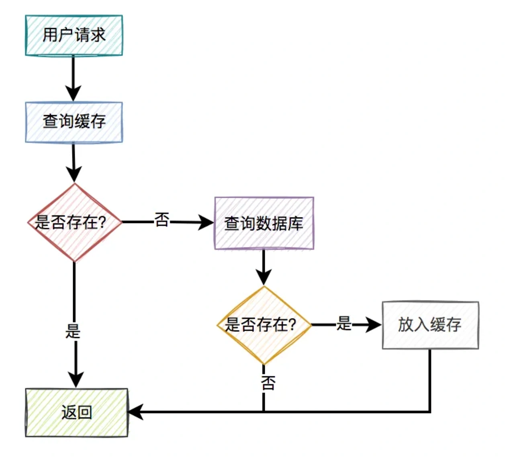

1. 用户请求过来之后，先查缓存有没有数据，如果有则直接返回。
2. 如果缓存没数据，再继续查数据库。
3. 如果数据库有数据，则将查询出来的数据，放入缓存中，然后返回该数据。
4. 如果数据库也没数据，则直接返回空。

这是缓存非常常见的用法。一眼看上去，好像没有啥问题。

但你忽略了一个非常重要的细节：**如果数据库中的某条数据，放入缓存之后，又立马被更新了，那么该如何更新缓存呢？**

不更新缓存行不行？

答：当然不行，如果不更新缓存，在很长的一段时间内（决定于缓存的过期时间），用户请求从缓存中获取到的都可能是旧值，而非数据库的最新值。这不是有数据不一致的问题？

那么，我们该如何更新缓存呢？

目前有以下4种方案：

1. 先写缓存，再写数据库
2. 先写数据库，再写缓存
3. 先删缓存，再写数据库
4. 先写数据库，再删缓存

接下来，我们详细说说这4种方案。

## **2. 先写缓存，再写数据库**
对于更新缓存的方案，很多人第一个想到的可能是在写操作中直接更新缓存（写缓存），更直接明了。

那么，问题来了：在写操作中，到底是先写缓存，还是先写数据库呢？

我们在这里先聊聊先写缓存，再写数据库的情况，因为它的问题最严重。

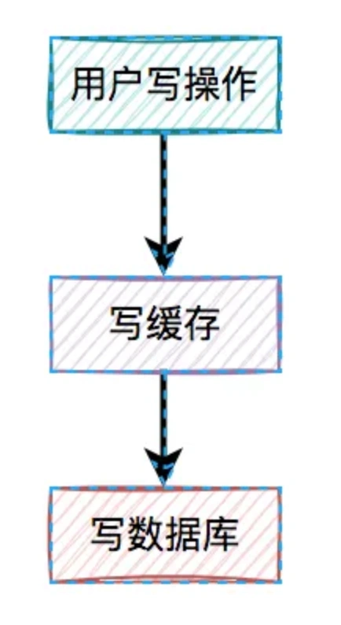

某一个用户的每一次写操作，如果刚写完缓存，突然网络出现了异常，导致写数据库失败了。

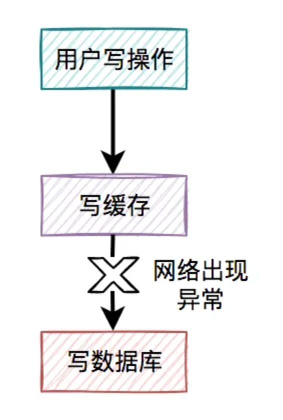

其结果是缓存更新成了最新数据，但数据库没有，这样缓存中的数据不就变成脏数据了？如果此时该用户的查询请求，正好读取到该数据，就会出现问题，因为该数据在数据库中根本不存在，这个问题非常严重。

我们都知道，缓存的主要目的是把数据库的数据临时保存在内存，便于后续的查询，提升查询速度。

但如果某条数据，在数据库中都不存在，你缓存这种“假数据”又有啥意义呢？

因此，先写缓存，再写数据库的方案是不可取的，在实际工作中用得不多。

## **3. 先写数据库，再写缓存**
既然上面的方案行不通，接下来，聊聊先写数据库，再写缓存的方案，该方案在低并发编程中有人在用（我猜的）。

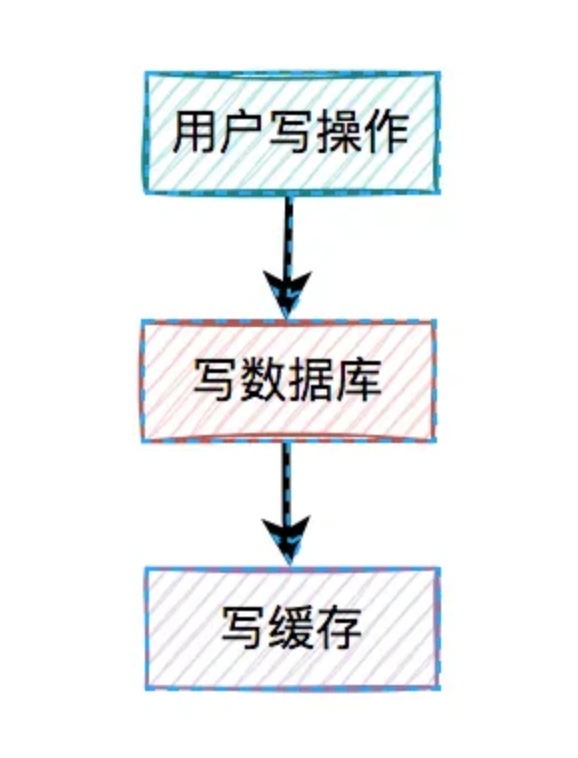

用户的写操作，先写数据库，再写缓存，可以避免之前“假数据”的问题。但它却带来了新的问题。

什么问题呢？

### **3.1 写缓存失败了**
如果把写数据库和写缓存操作，放在同一个事务当中，当写缓存失败了，我们可以把写入数据库的数据进行回滚。

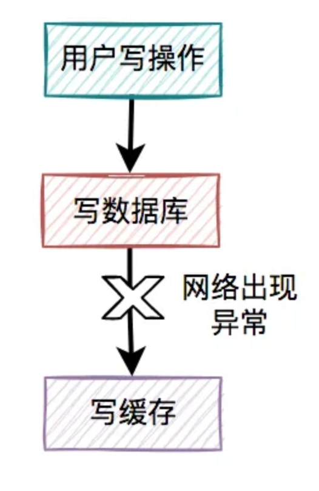

如果是并发量比较小，对接口性能要求不太高的系统，可以这么玩。

但如果在高并发的业务场景中，写数据库和写缓存，都属于远程操作。为了防止出现大事务，造成的死锁问题，通常建议写数据库和写缓存不要放在同一个事务中。

也就是说在该方案中，如果写数据库成功了，但写缓存失败了，数据库中已写入的数据不会回滚。

这就会出现：数据库是新数据，而缓存是旧数据，两边数据不一致的情况。

### **3.1 高并发下的问题**
假设在高并发的场景中，针对同一个用户的同一条数据，有两个写数据请求：a和b，它们同时请求到业务系统。

其中请求a获取的是旧数据，而请求b获取的是新数据，如下图所示：

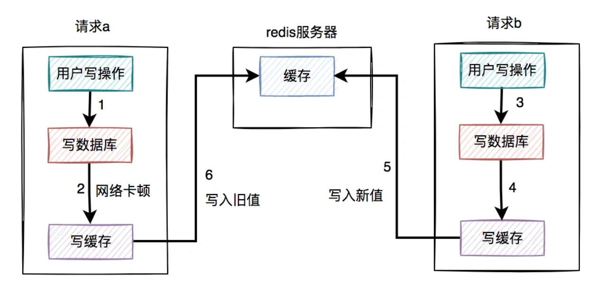

1. 请求a先过来，刚写完了数据库。但由于网络原因，卡顿了一下，还没来得及写缓存。
2. 这时候请求b过来了，先写了数据库。
3. 接下来，请求b顺利写了缓存。
4. 此时，请求a卡顿结束，也写了缓存。

很显然，在这个过程当中，请求b在缓存中的新数据，被请求a的旧数据覆盖了。

也就是说：在高并发场景中，如果多个线程同时执行先写数据库，再写缓存的操作，可能会出现数据库是新值，而缓存中是旧值，两边数据不一致的情况。

### **3.2 浪费系统资源**
该方案还有一个比较大的问题就是：每个写操作，写完数据库，会马上写缓存，比较浪费系统资源。

为什么这么说呢？

你可以试想一下，如果写的缓存，并不是简单的数据内容，而是要经过非常复杂的计算得出的最终结果。这样每写一次缓存，都需要经过一次非常复杂的计算，不是非常浪费系统资源吗？

尤其是cpu和内存资源。

还有些业务场景比较特殊：写多读少。

如果在这类业务场景中，每个用的写操作，都需要写一次缓存，有点得不偿失。

由此可见，在高并发的场景中，先写数据库，再写缓存，这套方案问题挺多的，也不太建议使用。

如果你已经用了，赶紧看看踩坑了没？

## **4. 先删缓存，再写数据库**
通过上面的内容我们得知，如果直接更新缓存的问题很多。

那么，为何我们不能换一种思路：不去直接更新缓存，而改为删除缓存呢？

删除缓存方案，同样有两种：

1. 先删缓存，再写数据库
2. 先写数据库，再删缓存

我们一起先看看：先删缓存，再写数据库的情况。

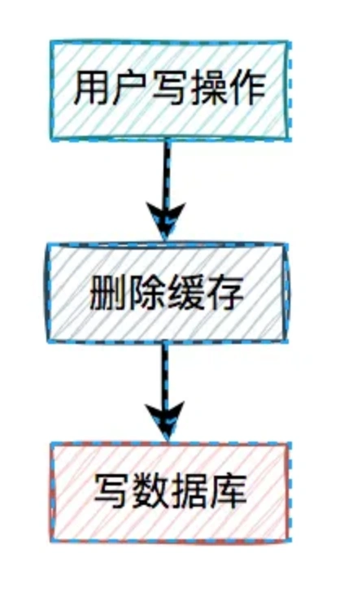

说白了，在用户的写操作中，先执行删除缓存操作，再去写数据库。这套方案，可以是可以，但也会有一样问题。

### **4.1 高并发下的问题**
假设在高并发的场景中，同一个用户的同一条数据，有一个读数据请求c，还有另一个写数据请求d（一个更新操作），同时请求到业务系统。如下图所示：

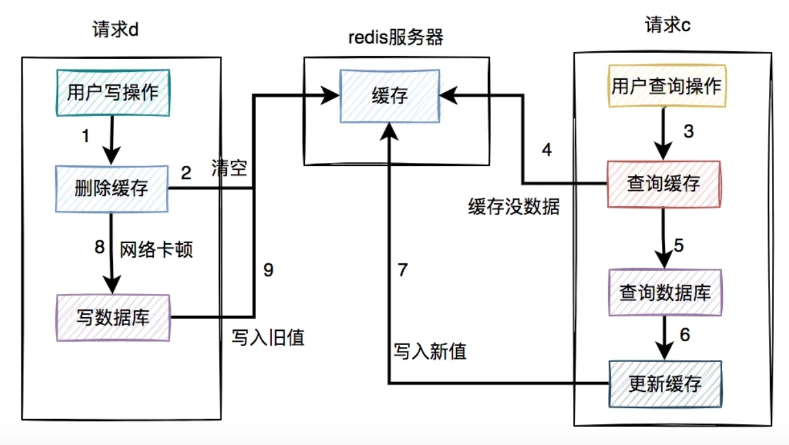

1. 请求d先过来，把缓存删除了。但由于网络原因，卡顿了一下，还没来得及写数据库。
2. 这时请求c过来了，先查缓存发现没数据，再查数据库，有数据，但是旧值。
3. 请求c将数据库中的旧值，更新到缓存中。
4. 此时，请求d卡顿结束，把新值写入数据库。

在这个过程当中，请求d的新值并没有被请求c写入缓存，同样会导致缓存和数据库的数据不一致的情况。更正：图中步骤7写入旧值，步骤9要删掉。

那么，这种场景的数据不一致问题，能否解决呢？

### **4.2 缓存双删**
在上面的业务场景中，一个读数据请求，一个写数据请求。当写数据请求把缓存删了之后，读数据请求，可能把当时从数据库查询出来的旧值，写入缓存当中。

有人说还不好办，请求d在写完数据库之后，把缓存重新删一次不就行了？

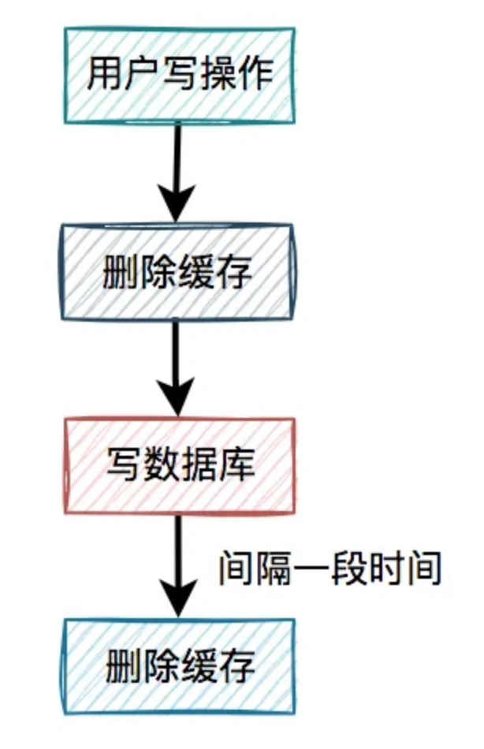

这就是我们所说的缓存双删，即在写数据库之前删除一次，写完数据库后，再删除一次。

该方案有个非常关键的地方是：第二次删除缓存，并非立马就删，而是要在一定的时间间隔之后。

我们再重新回顾一下，高并发下一个读数据请求，一个写数据请求导致数据不一致的产生过程：

1. 请求d先过来，把缓存删除了。但由于网络原因，卡顿了一下，还没来得及写数据库。
2. 这时请求c过来了，先查缓存发现没数据，再查数据库，有数据，但是旧值。
3. 请求c将数据库中的旧值，更新到缓存中。
4. 此时，请求d卡顿结束，把新值写入数据库。
5. 一段时间之后，比如：500ms，请求d将缓存删除。

这样来看确实可以解决缓存不一致问题。

那么，为什么一定要间隔一段时间之后，才能删除缓存呢？

请求d卡顿结束，把新值写入数据库后，请求c将数据库中的旧值，更新到缓存中。

此时，如果请求d删除太快，在请求c将数据库中的旧值更新到缓存之前，就已经把缓存删除了，这次删除就没任何意义。必须要在请求c更新缓存之后，再删除缓存，才能把旧值及时删除了。

所以需要在请求d中加一个时间间隔，确保请求c，或者类似于请求c的其他请求，如果在缓存中设置了旧值，最终都能够被请求d删除掉。

接下来，还有一个问题：如果第二次删除缓存时，删除失败了该怎么办？

这里先留点悬念，后面会详细说。

## **5. 先写数据库，再删缓存**
从前面得知，先删缓存，再写数据库，在并发的情况下，也可能会出现缓存和数据库的数据不一致的情况。

那么，我们只能寄希望于最后的方案了。

接下来，我们重点看看先写数据库，再删缓存的方案。

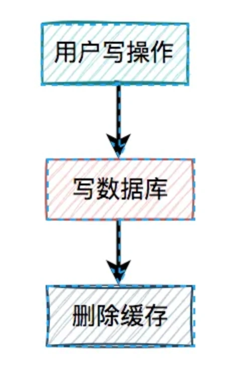

在高并发的场景中，有一个读数据请求，有一个写数据请求，更新过程如下：

1. 请求e先写数据库，由于网络原因卡顿了一下，没有来得及删除缓存。
2. 请求f查询缓存，发现缓存中有数据，直接返回该数据。
3. 请求e删除缓存。

在这个过程中，只有请求f读了一次旧数据，后来旧数据被请求e及时删除了，看起来问题不大。

但如果是读数据请求先过来呢？

1. 请求f查询缓存，发现缓存中有数据，直接返回该数据。
2. 请求e先写数据库。
3. 请求e删除缓存。

这种情况看起来也没问题呀？

答：对的。

但就怕出现下面这种情况，即缓存自己失效了。如下图所示：

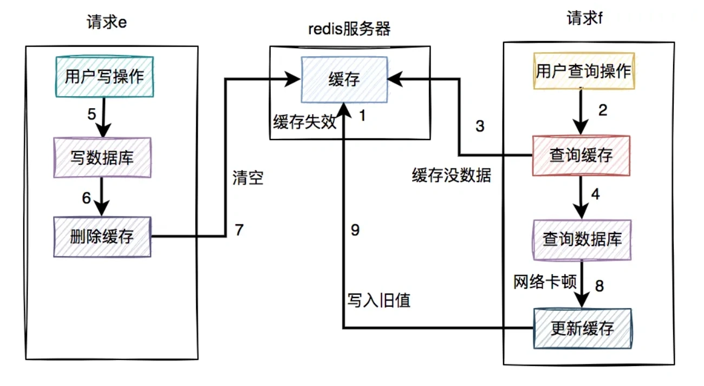

答：需要加重试机制。

在接口中如果更新了数据库成功了，但更新缓存失败了，可以立刻重试3次。如果其中有任何一次成功，则直接返回成功。如果3次都失败了，则写入数据库，准备后续再处理。

当然，如果你在接口中直接同步重试，该接口并发量比较高的时候，可能有点影响接口性能。

这时，就需要改成异步重试了。

异步重试方式有很多种，比如：

1. 每次都单独起一个线程，该线程专门做重试的工作。但如果在高并发的场景下，可能会创建太多的线程，导致系统OOM问题，不太建议使用。
2. 将重试的任务交给线程池处理，但如果服务器重启，部分数据可能会丢失。
3. 将重试数据写表，然后使用elastic-job等定时任务进行重试。
4. 将重试的请求写入mq等消息中间件中，在mq的consumer中处理。
5. 订阅mysql的binlog，在订阅者中，如果发现了更新数据请求，则删除相应的缓存。

## **7. 定时任务**
使用定时任务重试的具体方案如下：

当用户操作写完数据库，但删除缓存失败了，需要将用户数据写入重试表中。

如下图所示：

1. 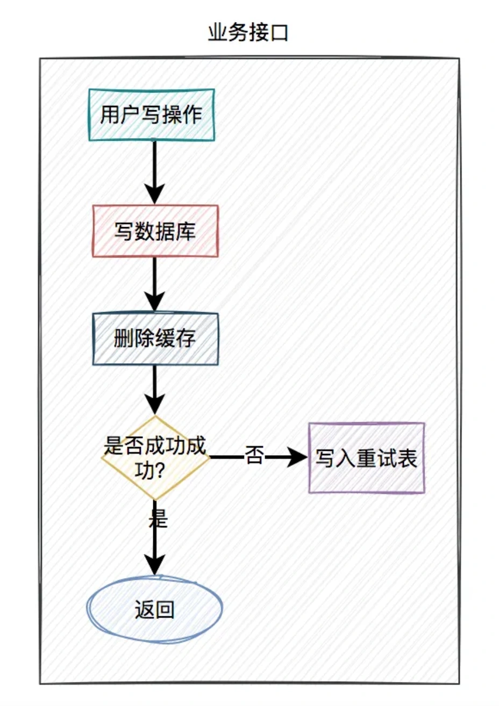

2.在定时任务中，异步读取重试表中的用户数据。重试表需要记录一个重试次数字段，初始值为0。然后重试5次，不断删除缓存，每重试一次该字段值+1。如果其中有任意一次成功了，则返回成功。如果重试了5次，还是失败，则我们需要在重试表中记录一个失败的状态，等待后续进一步处理。

2. 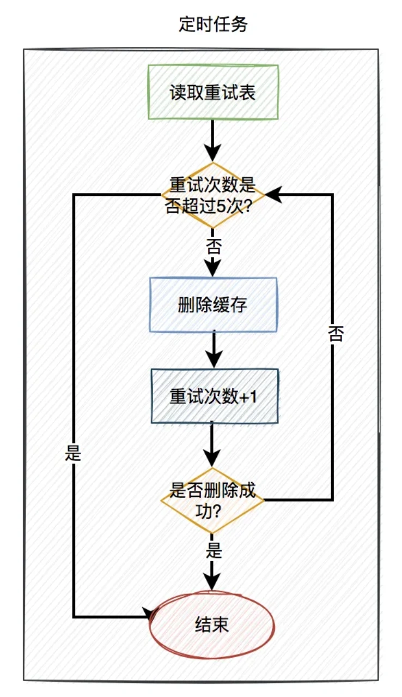

在高并发场景中，定时任务推荐使用elastic-job。相对于xxl-job等定时任务，它可以分片处理，提升处理速度。同时每片的间隔可以设置成：1,2,3,5,7秒等。

使用定时任务重试的话，有个缺点就是实时性没那么高，对于实时性要求特别高的业务场景，该方案不太适用。但是对于一般场景，还是可以用一用的。

但它有一个很大的优点，即数据是落库的，不会丢数据。

## **8. mq**
在高并发的业务场景中，mq（消息队列）是必不可少的技术之一。它不仅可以异步解耦，还能削峰填谷。对保证系统的稳定性是非常有意义的。

mq的生产者，生产了消息之后，通过指定的topic发送到mq服务器。然后mq的消费者，订阅该topic的消息，读取消息数据之后，做业务逻辑处理。

使用mq重试的具体方案如下：

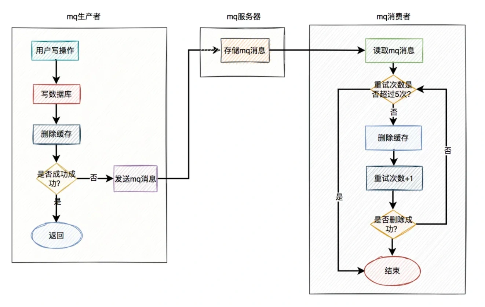

1. 当用户操作写完数据库，但删除缓存失败了，产生一条mq消息，发送给mq服务器。
2. mq消费者读取mq消息，重试5次删除缓存。如果其中有任意一次成功了，则返回成功。如果重试了5次，还是失败，则写入死信队列中。
3. 推荐mq使用rocketmq，重试机制和死信队列默认是支持的。使用起来非常方便，而且还支持顺序消息，延迟消息和事务消息等多种业务场景。

当然在该方案中，删除缓存可以完全走异步。即用户的写操作，在写完数据库之后，不用立刻删除一次缓存。而直接发送mq消息，到mq服务器，然后有mq消费者全权负责删除缓存的任务。

因为mq的实时性还是比较高的，因此改良后的方案也是一种不错的选择。

## **9. binlog**
前面我们聊过的，无论是定时任务，还是mq（消息队列），做重试机制，对业务都有一定的侵入性。

在使用定时任务的方案中，需要在业务代码中增加额外逻辑，如果删除缓存失败，需要将数据写入重试表。

而使用mq的方案中，如果删除缓存失败了，需要在业务代码中发送mq消息到mq服务器。

其实，还有一种更优雅的实现，即监听binlog，比如使用：canal等中间件。

具体方案如下：

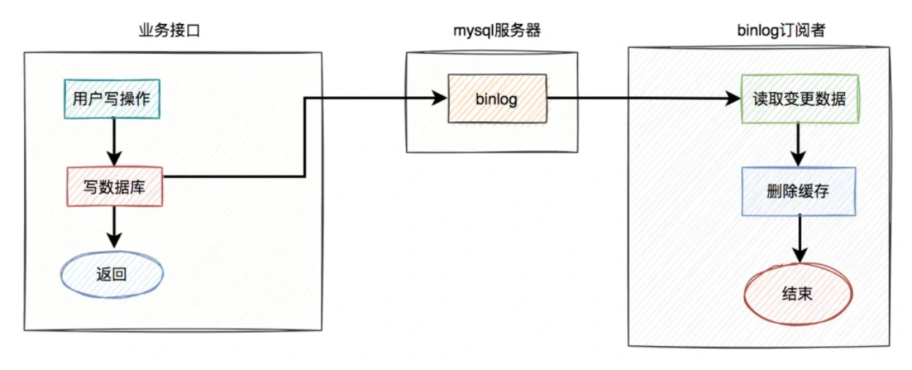

1. 在业务接口中写数据库之后，就不管了，直接返回成功。
2. mysql服务器会自动把变更的数据写入binlog中。
3. binlog订阅者获取变更的数据，然后删除缓存。

这套方案中业务接口确实简化了一些流程，只用关心数据库操作即可，而在binlog订阅者中做缓存删除工作。

但如果只是按照图中的方案进行删除缓存，只删除了一次，也可能会失败。

如何解决这个问题呢？

答：这就需要加上前面聊过的重试机制了。如果删除缓存失败，写入重试表，使用定时任务重试。或者写入mq，让mq自动重试。

在这里推荐使用mq自动重试机制。

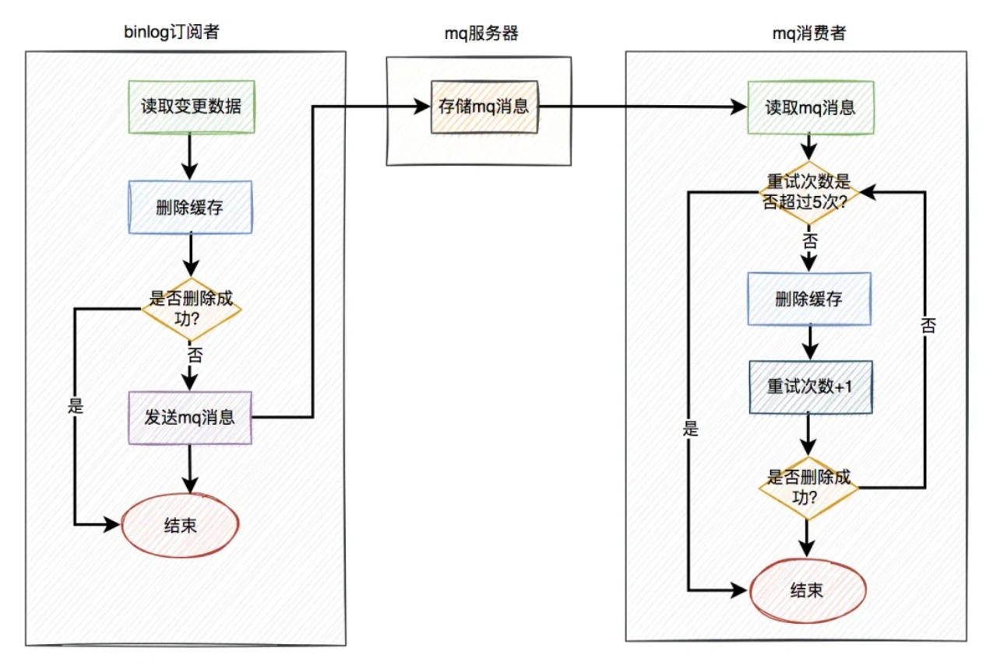

在binlog订阅者中如果删除缓存失败，则发送一条mq消息到mq服务器，在mq消费者中自动重试5次。如果有任意一次成功，则直接返回成功。如果重试5次后还是失败，则该消息自动被放入死信队列，后面可能需要人工介入。

> 更新: 2024-05-20 17:16:34  
> 原文: <https://www.yuque.com/yuqueyonghue6cvnv/cxhfwd/ctkueh52goe5sr7t>