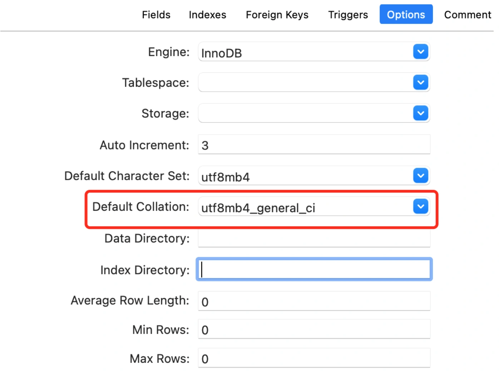

# 数据库版本问题

## **前言**
我们公司最近打算给江西有个公司做私有化部署，需要在阿里云上重新搭建一套环境。

DBA今天上午忙着做数据迁移。

但不久之后，就数据迁移失败找到我了。

## **案发现场**
今天上午DBA在同步数据的过程中，跟我反馈了一个问题，说我的一张品牌表中有一部分数据，在insert的时候报了唯一索引冲突。

没错，品牌表为了保证数据的唯一性，我将品牌名称加了一个唯一索引。

但这张表是不可能产生重复数据的。

我的第一反应是，是不是insert了重复的数据导致的这个问题？

跟DBA沟通之后，发现他们的数据同步方案是：将数据从生产库同步到一个中间库，在中间库把多余的数据删掉，然后将剩余的数据，同步到新库中。

流程图如下：

我刚开始以为是他的同步脚本有问题，insert了重复的数据，仔细看了他写的SQL脚本之后，发现并没有问题。

到底是什么原因呢？

其中生产库和中间库MySQL的版本是5.7，而新库MySQL的版本是5.8。

## **分析原因**
我们拿到一条抛异常的数据，品牌名称是：鑫方盛，利通，到生产库中去查了一下。

发现那条数据生产库是有的，并且只有一条数据。

然后使用like语句查询关键字：鑫方盛，查询出了两条数据：鑫方盛，利通和鑫方盛,利通。

没错，中间这两条数据仅仅是中间的逗号不一样，一个是中文的逗号，一个是英文的逗号。

有没有可能是逗号的原因导致的问题。

于是，再找DBA沟通了一下。

原来生产库和中间库都是用的MySQL5.7的版本，而新库用的5.8的版本。

不同版本的数据库有差异。

## **如何解决问题？**
关于逗号的问题，我第一个想到的是MySQL的排序规则：collation。

其实我们在建表的时候，是可以设置Default Collation参数的：

我们查了一下MySQL5.7默认的Collation是utf8mb4_general_ci，而MySQL5.8默认的Collation是utf8mb4_0900_ai_ci。

其实MySQL5.7中使用比较多的是：utf8mb4_general_ci和utf8mb4_bin。

utf8mb4_general_ci表示数据查询时不区分大小写。

而utf8mb4_bin表示数据查询时区分大小写。

而utf8mb4_0900_ai_ci表示数据查询时，不光不区分大小写，而且还不区分口音。也就是说，排序时 e，è，é，ê 和 ë 之间没有区别。

极有可能是Collation不一样导致的问题。

于是，我建议DBA将新库的默认Collation也改成utf8mb4_general_ci。

因为我查了一下，Collation不一样，不光是上面这个问题，还有空格的问题，比如：

select * from user name = ' 苏三';

查询数据库中叫苏三的用户。

在MySQL5.7中，可以正确查询出数据。它会去掉前后空格，去查询数据。

但在MySQL5.8中却不行。

如果不把Collation改成一样的话，不光有些数据insert不进去，而且有些业务功能可能还会出现问题。

这样调整之后，数据迁移成功了。

建议大家在日常工作中，关注一下MySQL的Collation（排序规则），非常重要。

> 更新: 2024-05-20 17:13:56  
> 原文: <https://www.yuque.com/yuqueyonghue6cvnv/cxhfwd/drzslwrer4fdhw06>