# 数据迁移问题

## **前言**
最近有些小伙伴问我，数据迁移该怎么做？

我的回答是：使用成熟的数据迁移工具。

ETL(是Extract-Transform-Load的缩写，即数据抽取、转换、装载的过程)，对于企业应用来说，我们经常会遇到各种数据的处理、转换、迁移的场景。

今天特地给大家汇总了一些目前市面上比较常用的ETL数据迁移工具，希望对你会有所帮助。

## **1.Kettle**
Kettle是一款国外开源的ETL工具，纯Java编写，绿色无需安装，数据抽取高效稳定 (数据迁移工具)。

Kettle 中有两种脚本文件，transformation 和 job，transformation 完成针对数据的基础转换，job 则完成整个工作流的控制。

Kettle 中文名称叫水壶，该项目的主程序员 MATT 希望把各种数据放到一个壶里，然后以一种指定的格式流出。

Kettle 这个 ETL 工具集，它允许你管理来自不同数据库的数据，通过提供一个图形化的用户环境来描述你想做什么，而不是你想怎么做。

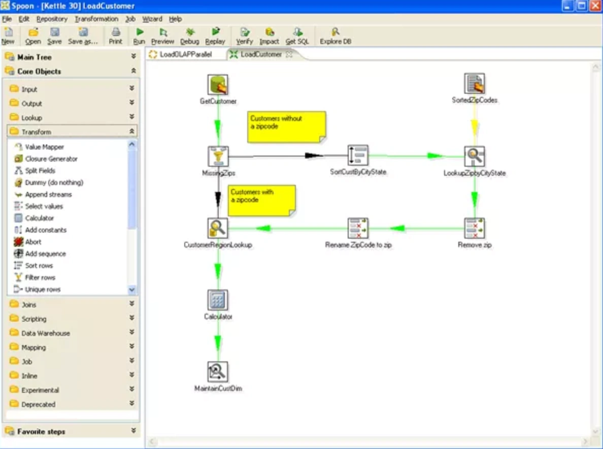

Kettle 家族目前包括 4 个产品：Spoon、Pan、CHEF、Kitchen。

+ SPOON：允许你通过图形界面来设计 ETL 转换过程（Transformation）。
+ PAN：允许你批量运行由 Spoon 设计的 ETL 转换 (例如使用一个时间调度器)。Pan 是一个后台执行的程序，没有图形界面。
+ CHEF：允许你创建任务（Job）。任务通过允许每个转换，任务，脚本等等，更有利于自动化更新数据仓库的复杂工作。任务通过允许每个转换，任务，脚本等等。任务将会被检查，看看是否正确地运行了。
+ KITCHEN：允许你批量使用由 Chef 设计的任务 (例如使用一个时间调度器)。KITCHEN 也是一个后台运行的程序。

## **2.Datax**
DataX是阿里云 DataWorks数据集成的开源版本，在阿里巴巴集团内被广泛使用的离线数据同步工具/平台。

DataX 是一个异构数据源离线同步工具，致力于实现包括关系型数据库(MySQL、Oracle等)、HDFS、Hive、ODPS、HBase、FTP等各种异构数据源之间稳定高效的数据同步功能。

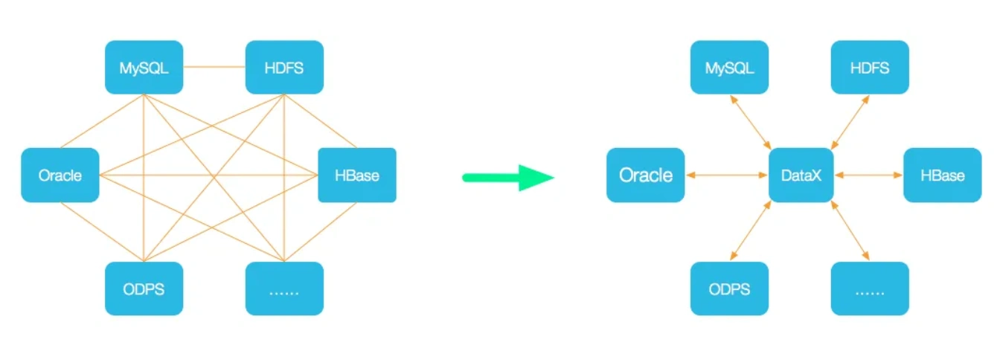

设计理念：为了解决异构数据源同步问题，DataX将复杂的网状的同步链路变成了星型数据链路，DataX作为中间传输载体负责连接各种数据源。当需要接入一个新的数据源的时候，只需要将此数据源对接到DataX，便能跟已有的数据源做到无缝数据同步。

当前使用现状：DataX在阿里巴巴集团内被广泛使用，承担了所有大数据的离线同步业务，并已持续稳定运行了6年之久。目前每天完成同步8w多道作业，每日传输数据量超过300TB。

DataX本身作为离线数据同步框架，采用Framework + plugin架构构建。将数据源读取和写入抽象成为Reader/Writer插件，纳入到整个同步框架中。

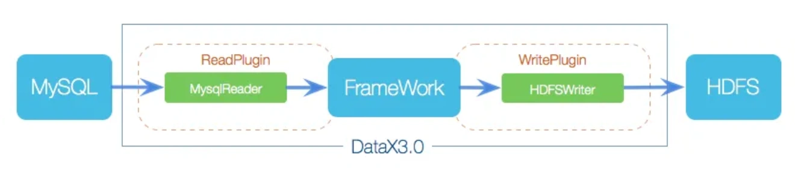

DataX 3.0 开源版本支持单机多线程模式完成同步作业运行，本小节按一个DataX作业生命周期的时序图，从整体架构设计非常简要说明DataX各个模块相互关系。

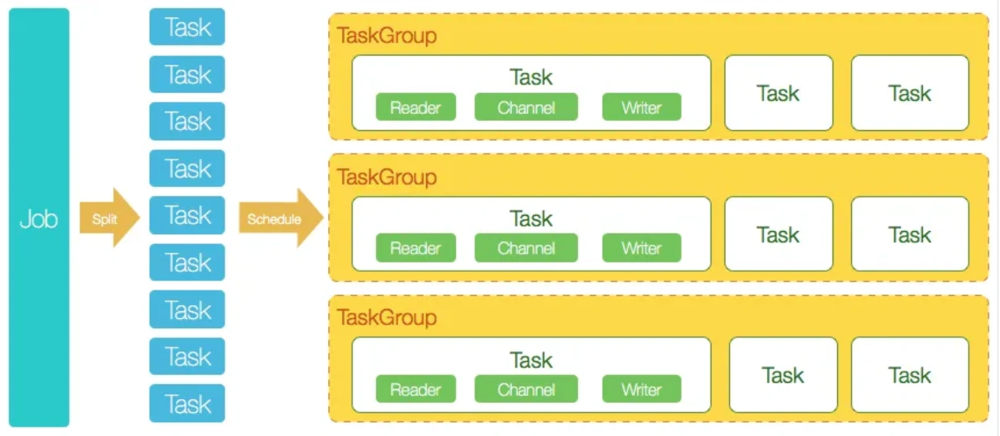

DataX 3.0六大核心优势：

+ 可靠的数据质量监控
+ 丰富的数据转换功能
+ 精准的速度控制
+ 强劲的同步性能
+ 健壮的容错机制
+ 极简的使用体验

## **3.DataPipeline**
DataPipeline采用基于日志的增量数据获取技术（ Log-based Change Data Capture ），支持异构数据之间丰富、自动化、准确的语义映射构建，同时满足实时与批量的数据处理。

可实现 Oracle、IBM DB2、MySQL、MS SQL Server、PostgreSQL、GoldenDB、TDSQL、OceanBase 等数据库准确的增量数据获取。

平台具备“数据全、传输快、强协同、更敏捷、极稳定、易维护”六大特性。

在支持传统关系型数据库的基础上，对大数据平台、国产数据库、云原生数据库、API 及对象存储也提供广泛的支持，并在不断扩展。

DataPipeline 数据融合产品致力于为用户提供企业级数据融合解决方案，为用户提供统一平台同时管理异构数据节点实时同步与批量数据处理任务，在未来还将提供对实时流计算的支持。

采用分布式集群化部署方式，可水平垂直线性扩展的，保证数据流转稳定高效，让客户专注数据价值释放。

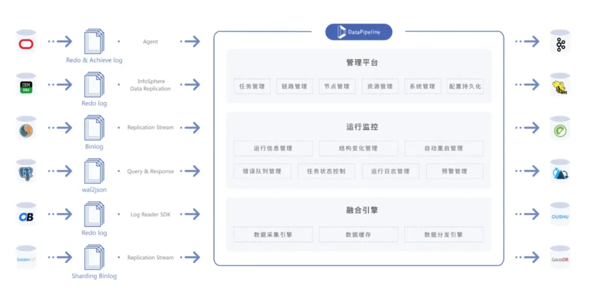

产品特点：

+ 全面的数据节点支持：支持关系型数据库、NoSQL数据库、国产数据库、数据仓库、大数据平台、云存储、API等多种数据节点类型，可自定义数据节点。
+ 高性能实时处理：针对不同数据节点类型提供TB级吞吐量、秒级低延迟的增量数据处理能力，加速企业各类场景的数据流转。
+ 分层管理降本增效：采用“数据节点注册、数据链路配置、数据任务构建、系统资源分配”的分层管理模式，企业级平台的建设周期从三到六个月减少为一周。
+ 无代码敏捷管理：提供限制配置与策略配置两大类十余种高级配置，包括灵活的数据对象映射关系，数据融合任务的研发交付时间从2周减少为5分钟。
+ 极稳定高可靠：采用分布式架构，所有组件均支持高可用，提供丰富容错策略，应对上下游的结构变化、数据错误、网络故障等突发情况，可以保证系统业务连续性要求。
+ 全链路数据可观测：配备容器、应用、线程、业务四级监控体系，全景驾驶舱守护任务稳定运行。自动化运维体系，灵活扩缩容，合理管理和分配系统资源。

## **4.Talend**
Talend (踏蓝) 是第一家针对的数据集成工具市场的 ETL (数据的提取 Extract、传输 Transform、载入 Load) 开源软件供应商。

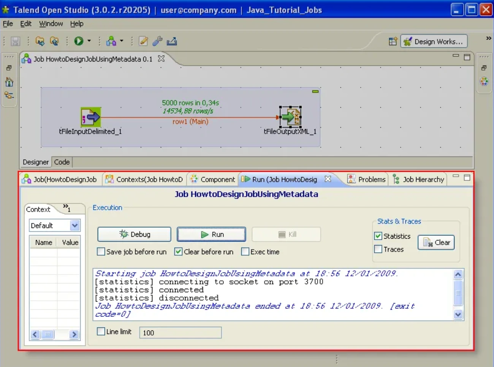

Talend 以它的技术和商业双重模式为 ETL 服务提供了一个全新的远景。它打破了传统的独有封闭服务，提供了一个针对所有规模的公司的公开的，创新的，强大的灵活的软件解决方案。

## **5.DataStage**
DataStage，即IBM WebSphere DataStage，是一套专门对多种操作数据源的数据抽取、转换和维护过程进行简化和自动化，并将其输入数据集市或数据仓库目标数据库的集成工具，可以从多个不同的业务系统中，从多个平台的数据源中抽取数据，完成转换和清洗，装载到各种系统里面。

其中每步都可以在图形化工具里完成，同样可以灵活地被外部系统调度，提供专门的设计工具来设计转换规则和清洗规则等，实现了增量抽取、任务调度等多种复杂而实用的功能。其中简单的数据转换可以通过在界面上拖拉操作和调用一些 DataStage 预定义转换函数来实现，复杂转换可以通过编写脚本或结合其他语言的扩展来实现，并且 DataStage 提供调试环境，可以极大提高开发和调试抽取、转换程序的效率。

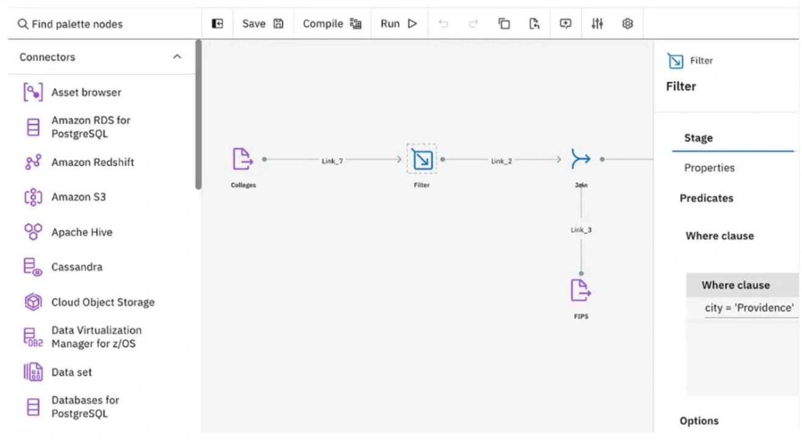

+ 对元数据的支持：Datastage 是自己管理 Metadata，不依赖任何数据库。
+ 参数控制：Datastage 可以对每个 job 设定参数，并且可以 job 内部引用这个参数名。
+ 数据质量：Datastage 有配套用的 ProfileStage 和 QualityStage 保证数据质量。
+ 定制开发：提供抽取、转换插件的定制，Datastage 内嵌一种类 BASIC 语言，可以写一段批处理程序来增加灵活性。
+ 修改维护：提供图形化界面。这样的好处是直观、傻瓜式的；不好的地方就是改动还是比较费事（特别是批量化的修改）。

Datastage 包含四大部件：

+ Administrator：新建或者删除项目，设置项目的公共属性，比如权限。
+ Designer：连接到指定的项目上进行 Job 的设计；
+ Director：负责 Job 的运行，监控等。例如设置设计好的 Job 的调度时间。
+ Manager：进行 Job 的备份等 Job 的管理工作。

## **6.Sqoop**
Sqoop 是 Cloudera 公司创造的一个数据同步工具，现在已经完全开源了。

目前已经是 hadoop 生态环境中数据迁移的首选 Sqoop 是一个用来将 Hadoop 和关系型数据库中的数据相互转移的工具，可以将一个关系型数据库（例如 ：MySQL ,Oracle ,Postgres 等）中的数据导入到 Hadoop 的 HDFS 中，也可以将 HDFS 的数据导入到关系型数据库中。

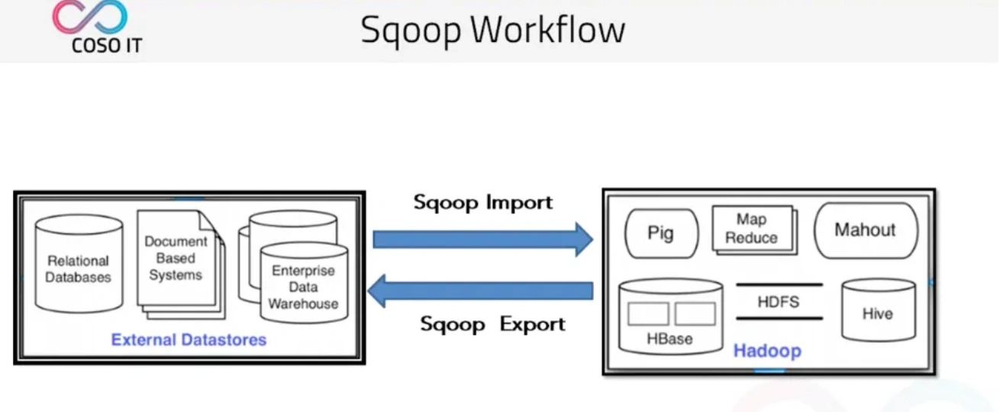

他将我们传统的关系型数据库 | 文件型数据库 | 企业数据仓库 同步到我们的 hadoop 生态集群中。

同时也可以将 hadoop 生态集群中的数据导回到传统的关系型数据库 | 文件型数据库 | 企业数据仓库中。

那么 Sqoop 如何抽取数据呢?

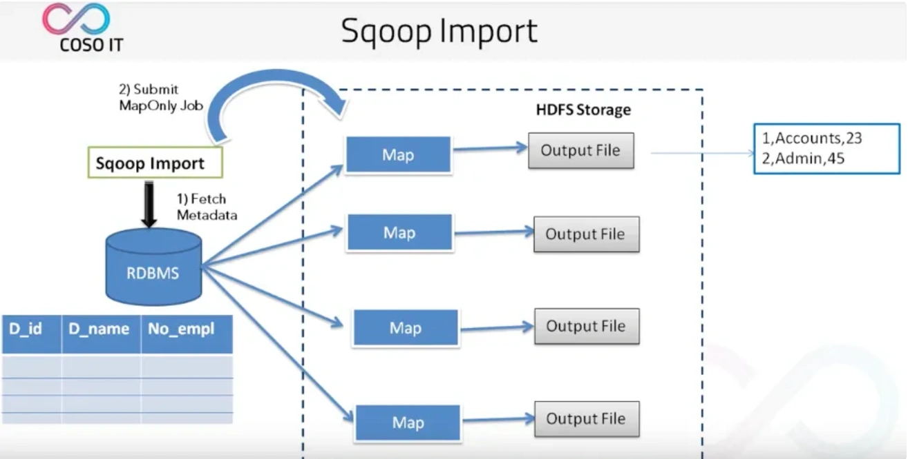

1. 首先 Sqoop 去 rdbms 抽取元数据。
2. 当拿到元数据之后将任务切成多个任务分给多个 map。
3. 然后再由每个 map 将自己的任务完成之后输出到文件。

## **7.FineDataLink**
FineDataLink是国内做的比较好的ETL工具，FineDataLink是一站式的数据处理平台，具备高效的数据同步功能，可以实现实时数据传输、数据调度、数据治理等各类复杂组合场景的能力，提供数据汇聚、研发、治理等功能。

FDL拥有低代码优势，通过简单的拖拽交互就能实现ETL全流程。

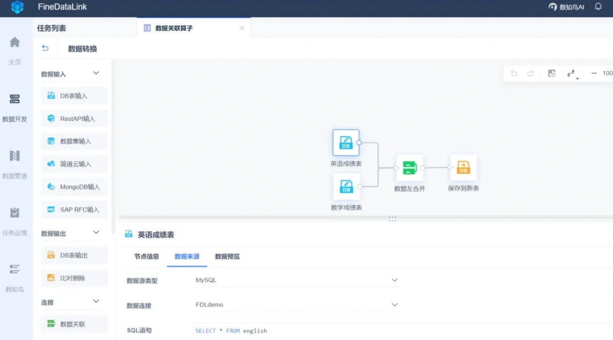

FineDataLink——中国领先的低代码/高时效数据集成产品，能过为企业提供一站式的数据服务，通过快速连接、高时效融合多种数据，提供低代码Data API敏捷发布平台，帮助企业解决数据孤岛难题，有效提升企业数据价值。

## **8.canal**
canal [kə'næl]，译意为水道/管道/沟渠，主要用途是基于 MySQL 数据库增量日志解析，提供增量数据订阅和消费。

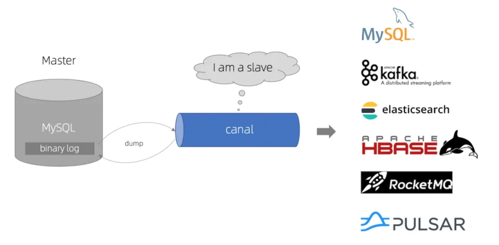

早期阿里巴巴因为杭州和美国双机房部署，存在跨机房同步的业务需求，实现方式主要是基于业务 trigger 获取增量变更。从 2010 年开始，业务逐步尝试数据库日志解析获取增量变更进行同步，由此衍生出了大量的数据库增量订阅和消费业务。

基于日志增量订阅和消费的业务包括：

+ 数据库镜像
+ 数据库实时备份
+ 索引构建和实时维护(拆分异构索引、倒排索引等)
+ 业务 cache 刷新
+ 带业务逻辑的增量数据处理

当前的 canal 支持源端 MySQL 版本包括 5.1.x , 5.5.x , 5.6.x , 5.7.x , 8.0.x。

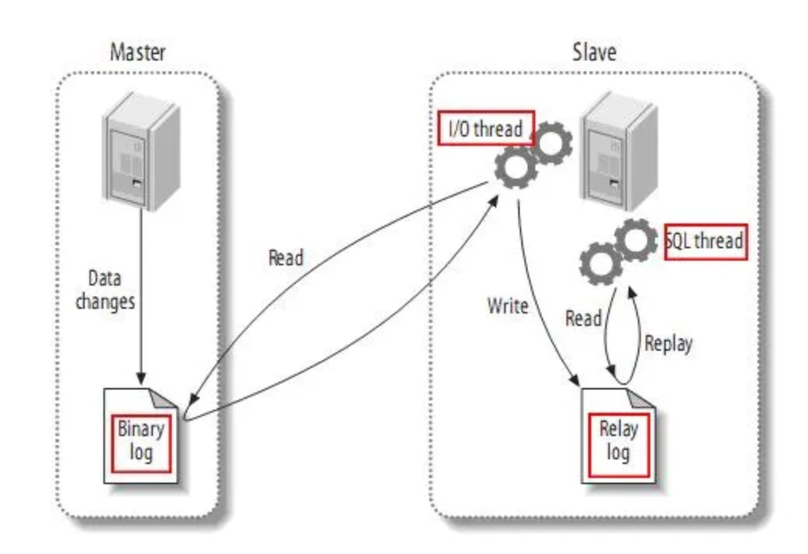

+ MySQL master 将数据变更写入二进制日志( binary log, 其中记录叫做二进制日志事件binary log events，可以通过 show binlog events 进行查看)。
+ MySQL slave 将 master 的 binary log events 拷贝到它的中继日志(relay log)。
+ MySQL slave 重放 relay log 中事件，将数据变更反映它自己的数据。

canal 工作原理：

+ canal 模拟 MySQL slave 的交互协议，伪装自己为 MySQL slave ，向 MySQL master 发送dump 协议
+ MySQL master 收到 dump 请求，开始推送 binary log 给 slave (即 canal )
+ canal 解析 binary log 对象(原始为 byte 流)

> 更新: 2024-09-11 10:49:02  
> 原文: <https://www.yuque.com/yuqueyonghue6cvnv/cxhfwd/nhkm9sqg4d3m60pe>