# 索引失效问题

<font style="color:rgb(51, 51, 51);background-color:rgb(248, 246, 244);">不知道你在实际工作中，有没有遇到过下面的这两种情况：</font>

+ <font style="color:rgb(51, 51, 51);background-color:rgb(248, 246, 244);">明明在某个字段上加了索引，但实际上并没有生效。</font>
+ <font style="color:rgb(51, 51, 51);background-color:rgb(248, 246, 244);">索引有时候生效了，有时候没有生效。</font>

<font style="color:rgb(51, 51, 51);background-color:rgb(248, 246, 244);">今天就跟大家一起聊聊，mysql数据库索引失效的10种场景，给曾经踩过坑，或者即将要踩坑的朋友们一个参考。</font>

## **<font style="color:rgb(34, 34, 34);background-color:rgb(248, 246, 244);">1. 准备工作</font>**
<font style="color:rgb(51, 51, 51);background-color:rgb(248, 246, 244);">所谓空口无凭，如果我直接把索引失效的这些场景丢出来，可能没有任何说服力。</font>

<font style="color:rgb(51, 51, 51);background-color:rgb(248, 246, 244);">所以，我决定建表和造数据，给大家一步步演示效果，尽量做到有理有据。</font>

<font style="color:rgb(51, 51, 51);background-color:rgb(248, 246, 244);">我相信，如果大家耐心的看完这篇文章，一定会有很多收获的。</font>

### **<font style="color:rgb(34, 34, 34);background-color:rgb(248, 246, 244);">1.1 创建user表</font>**
<font style="color:rgb(51, 51, 51);background-color:rgb(248, 246, 244);">创建一张user表，表中包含：id、code、age、name和height字段。</font>

```plain
CREATE TABLE `user` (
  `id` int NOT NULL AUTO_INCREMENT,
  `code` varchar(20) COLLATE utf8mb4_bin DEFAULT NULL,
  `age` int DEFAULT '0',
  `name` varchar(30) COLLATE utf8mb4_bin DEFAULT NULL,
  `height` int DEFAULT '0',
  `address` varchar(30) COLLATE utf8mb4_bin DEFAULT NULL,
  PRIMARY KEY (`id`),
  KEY `idx_code_age_name` (`code`,`age`,`name`),
  KEY `idx_height` (`height`)
) ENGINE=InnoDB AUTO_INCREMENT=4 DEFAULT CHARSET=utf8mb4 COLLATE=utf8mb4_bin
```

<font style="color:rgb(51, 51, 51);background-color:rgb(248, 246, 244);">此外，还创建了三个索引：</font>

+ <font style="color:rgb(51, 51, 51);background-color:rgb(248, 246, 244);">id：数据库的主键</font>
+ <font style="color:rgb(51, 51, 51);background-color:rgb(248, 246, 244);">idx_code_age_name：由code、age和name三个字段组成的联合索引。</font>
+ <font style="color:rgb(51, 51, 51);background-color:rgb(248, 246, 244);">idx_height：普通索引</font>

### **<font style="color:rgb(34, 34, 34);background-color:rgb(248, 246, 244);">1.2 插入数据</font>**
<font style="color:rgb(51, 51, 51);background-color:rgb(248, 246, 244);">为了方便给大家做演示，我特意向user表中插入了3条数据：</font>

```plain
INSERT INTO sue.user (id, code, age, name, height) VALUES (1, '101', 21, '周星驰', 175,'香港');
INSERT INTO sue.user (id, code, age, name, height) VALUES (2, '102', 18, '周杰伦', 173,'台湾');
INSERT INTO sue.user (id, code, age, name, height) VALUES (3, '103', 23, '苏三', 174,'成都');
```

<font style="color:rgb(51, 51, 51);background-color:rgb(248, 246, 244);">周星驰和周杰伦是我偶像，在这里自恋了一次，把他们和我放到一起了。哈哈哈。</font>

### **<font style="color:rgb(34, 34, 34);background-color:rgb(248, 246, 244);">1.3 查看数据库版本</font>**
<font style="color:rgb(51, 51, 51);background-color:rgb(248, 246, 244);">为了防止以后出现不必要的误会，在这里有必要查一下当前数据库的版本。不说版本就直接给结论，是耍流氓，哈哈哈。</font>

```csharp
select version();
```

<font style="color:rgb(51, 51, 51);background-color:rgb(248, 246, 244);">查出当前的mysql版本号为：8.0.21</font>

### **<font style="color:rgb(34, 34, 34);background-color:rgb(248, 246, 244);">1.4 查看执行计划</font>**
<font style="color:rgb(51, 51, 51);background-color:rgb(248, 246, 244);">在mysql中，如果你想查看某条sql语句是否使用了索引，或者已建好的索引是否失效，可以通过explain关键字，查看该sql语句的执行计划，来判断索引使用情况。</font>

<font style="color:rgb(51, 51, 51);background-color:rgb(248, 246, 244);">例如：</font>

```plain
explain select * from user where id=1;
```

<font style="color:rgb(51, 51, 51);background-color:rgb(248, 246, 244);">执行结果：</font>

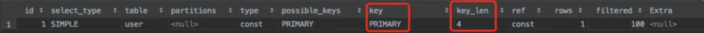

<font style="color:rgb(51, 51, 51);background-color:rgb(248, 246, 244);">从图中可以看出，由于id字段是主键，该sql语句用到了主键索引。</font>

## **<font style="color:rgb(34, 34, 34);background-color:rgb(248, 246, 244);">2. 不满足最左匹配原则</font>**
<font style="color:rgb(51, 51, 51);background-color:rgb(248, 246, 244);">之前我已经给code、age和name这3个字段建好联合索引：idx_code_age_name。</font>

<font style="color:rgb(51, 51, 51);background-color:rgb(248, 246, 244);">该索引字段的顺序是：</font>

+ <font style="color:rgb(51, 51, 51);background-color:rgb(248, 246, 244);">code</font>
+ <font style="color:rgb(51, 51, 51);background-color:rgb(248, 246, 244);">age</font>
+ <font style="color:rgb(51, 51, 51);background-color:rgb(248, 246, 244);">name</font>

<font style="color:rgb(51, 51, 51);background-color:rgb(248, 246, 244);">如果在使用联合索引时，没注意最左前缀原则，很有可能导致索引失效喔，不信我们一起往下看。</font>

### **<font style="color:rgb(34, 34, 34);background-color:rgb(248, 246, 244);">2.1 哪些情况索引有效？</font>**
<font style="color:rgb(51, 51, 51);background-color:rgb(248, 246, 244);">先看看哪些情况下，能走索引。</font>

```plain
explain select * from user
where code='101';
```

```plain
explain select * from user
where code='101' and age=21
```

```plain
explain select * from user
where code='101' and age=21 and name='周星驰';
```

<font style="color:rgb(51, 51, 51);background-color:rgb(248, 246, 244);">执行结果：上面三种情况，sql都能正常走索引。</font>

<font style="color:rgb(51, 51, 51);background-color:rgb(248, 246, 244);">其实还有一种比较特殊的场景：</font>

```plain
explain select * from user
where code = '101'  and name='周星驰';
```

<font style="color:rgb(51, 51, 51);background-color:rgb(248, 246, 244);">执行结果：</font>

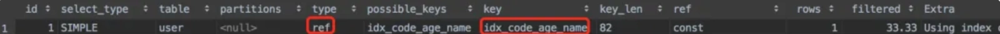

<font style="color:rgb(51, 51, 51);background-color:rgb(248, 246, 244);">查询条件原本的顺序是：code、age、name，但这里只有code和name中间断层了，掉了age字段，这种情况也能走code字段上的索引。</font>

<font style="color:rgb(51, 51, 51);background-color:rgb(248, 246, 244);">看到这里，不知道聪明的你，有没有发现这样一个规律：</font>**<font style="color:rgb(34, 34, 34);background-color:rgb(248, 246, 244);">这4条sql中都有code字段，它是索引字段中的第一个字段，也就是最左边的字段。只要有这个字段在，该sql已经就能走索引。</font>**

<font style="color:rgb(51, 51, 51);background-color:rgb(248, 246, 244);">这就是我们所说的最左匹配原则。</font>

### **<font style="color:rgb(34, 34, 34);background-color:rgb(248, 246, 244);">2.2 哪些情况索引失效？</font>**
<font style="color:rgb(51, 51, 51);background-color:rgb(248, 246, 244);">前面我已经介绍过，建立了联合索引后，在查询条件中有哪些情况索引是有效的。</font>

<font style="color:rgb(51, 51, 51);background-color:rgb(248, 246, 244);">接下来，我们重点看看哪些情况下索引会失效。</font>

```plain
explain select * from user
where age=21;
```

```plain
explain select * from user
where name='周星驰';
```

```plain
explain select * from user
where age=21 and name='周星驰';
```

<font style="color:rgb(51, 51, 51);background-color:rgb(248, 246, 244);">执行结果：</font>

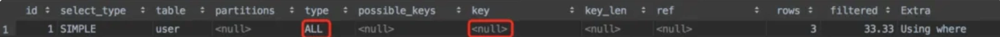

<font style="color:rgb(51, 51, 51);background-color:rgb(248, 246, 244);">从图中看出这3种情况下索引确实失效了。</font>

<font style="color:rgb(51, 51, 51);background-color:rgb(248, 246, 244);">说明以上3种情况不满足最左匹配原则，说白了是因为查询条件中，没有包含给定字段最左边的索引字段，即字段code。</font>

## **<font style="color:rgb(34, 34, 34);background-color:rgb(248, 246, 244);">3. 使用了select *</font>**
<font style="color:rgb(51, 51, 51);background-color:rgb(248, 246, 244);">在《阿里巴巴开发手册》中明确说过，查询sql中禁止使用select * 。</font>

<font style="color:rgb(51, 51, 51);background-color:rgb(248, 246, 244);">那么，你知道为什么吗？</font>

<font style="color:rgb(51, 51, 51);background-color:rgb(248, 246, 244);">废话不多说，按照国际惯例先上一条sql：</font>

```plain
explain 
select * from user where name='苏三';
```

<font style="color:rgb(51, 51, 51);background-color:rgb(248, 246, 244);">执行结果：</font>

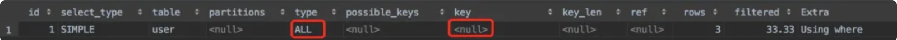

<font style="color:rgb(51, 51, 51);background-color:rgb(248, 246, 244);">在该sql中用了select *，从执行结果看，走了全表扫描，没有用到任何索引，查询效率是非常低的。</font>

<font style="color:rgb(51, 51, 51);background-color:rgb(248, 246, 244);">如果查询的时候，只查我们真正需要的列，而不查所有列，结果会怎么样？</font>

<font style="color:rgb(51, 51, 51);background-color:rgb(248, 246, 244);">非常快速的将上面的sql改成只查了code和name列，太easy了：</font>

```plain
explain 
select code,name from user 
where name='苏三';
```

<font style="color:rgb(51, 51, 51);background-color:rgb(248, 246, 244);">执行结果：</font>

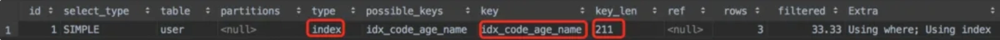

<font style="color:rgb(51, 51, 51);background-color:rgb(248, 246, 244);">从图中执行结果不难看出，该sql语句这次走了全索引扫描，比全表扫描效率更高。</font>

<font style="color:rgb(51, 51, 51);background-color:rgb(248, 246, 244);">其实这里用到了：覆盖索引。</font>

<font style="color:rgb(51, 51, 51);background-color:rgb(248, 246, 244);">如果select语句中的查询列，都是索引列，那么这些列被称为覆盖索引。这种情况下，查询的相关字段都能走索引，索引查询效率相对来说更高一些。</font>

<font style="color:rgb(51, 51, 51);background-color:rgb(248, 246, 244);">而使用select *查询所有列的数据，大概率会查询非索引列的数据，非索引列不会走索引，查询效率非常低。</font>

## **<font style="color:rgb(34, 34, 34);background-color:rgb(248, 246, 244);">4. 索引列上有计算</font>**
<font style="color:rgb(51, 51, 51);background-color:rgb(248, 246, 244);">介绍本章节内容前，先跟大家一起回顾一下，根据id查询数据的sql语句：</font>

```plain
explain select * from user where id=1;
```

<font style="color:rgb(51, 51, 51);background-color:rgb(248, 246, 244);">执行结果：</font>

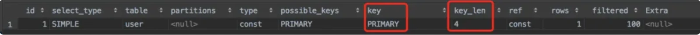

<font style="color:rgb(51, 51, 51);background-color:rgb(248, 246, 244);">从图中可以看出，由于id字段是主键，该sql语句用到了主键索引。</font>

<font style="color:rgb(51, 51, 51);background-color:rgb(248, 246, 244);">但如果id列上面有计算，比如：</font>

```plain
explain select * from user where id+1=2;
```

<font style="color:rgb(51, 51, 51);background-color:rgb(248, 246, 244);">执行结果：</font>


<font style="color:rgb(51, 51, 51);background-color:rgb(248, 246, 244);">从上图中的执行结果，能够非常清楚的看出，该id字段的主键索引，在有计算的情况下失效了。</font>

## **<font style="color:rgb(34, 34, 34);background-color:rgb(248, 246, 244);">5. 索引列用了函数</font>**
<font style="color:rgb(51, 51, 51);background-color:rgb(248, 246, 244);">有时候我们在某条sql语句的查询条件中，需要使用函数，比如：截取某个字段的长度。</font>

<font style="color:rgb(51, 51, 51);background-color:rgb(248, 246, 244);">假如现在有个需求：想查出所有身高是17开头的人，如果sql语句写成这样：</font>

```plain
explain select * from user  where height=17;
```

<font style="color:rgb(51, 51, 51);background-color:rgb(248, 246, 244);">该sql语句确实用到了普通索引：</font>

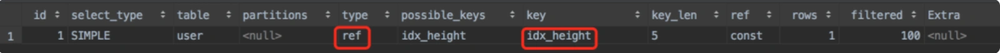

<font style="color:rgb(51, 51, 51);background-color:rgb(248, 246, 244);">但该sql语句肯定是有问题的，因为它只能查出身高正好等于17的，但对于174这种情况，它没办法查出来。</font>

<font style="color:rgb(51, 51, 51);background-color:rgb(248, 246, 244);">为了满足上面的要求，我们需要把sql语句稍稍改造了一下：</font>

```plain
explain select * from user  where SUBSTR(height,1,2)=17;
```

<font style="color:rgb(51, 51, 51);background-color:rgb(248, 246, 244);">这时需要用到SUBSTR函数，用它截取了height字段的前面两位字符，从第一个字符开始。</font>

<font style="color:rgb(51, 51, 51);background-color:rgb(248, 246, 244);">执行结果：</font>


<font style="color:rgb(51, 51, 51);background-color:rgb(248, 246, 244);">你有没有发现，在使用该函数之后，该sql语句竟然走了全表扫描，索引失效了。</font>

## **<font style="color:rgb(34, 34, 34);background-color:rgb(248, 246, 244);">6. 字段类型不同</font>**
<font style="color:rgb(51, 51, 51);background-color:rgb(248, 246, 244);">在sql语句中因为字段类型不同，而导致索引失效的问题，很容易遇到，可能是我们日常工作中最容易忽略的问题。</font>

<font style="color:rgb(51, 51, 51);background-color:rgb(248, 246, 244);">到底怎么回事呢？</font>

<font style="color:rgb(51, 51, 51);background-color:rgb(248, 246, 244);">请大家注意观察一下t_user表中的code字段，它是varchar字符类型的。</font>

<font style="color:rgb(51, 51, 51);background-color:rgb(248, 246, 244);">在sql语句中查询数据时，查询条件我们可以写成这样：</font>

```plain
explain 
select * from user where code="101";
```

<font style="color:rgb(51, 51, 51);background-color:rgb(248, 246, 244);">执行结果：</font>

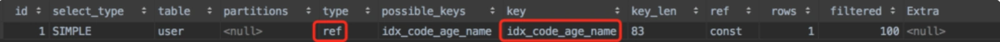

<font style="color:rgb(51, 51, 51);background-color:rgb(248, 246, 244);">从上图中看到，该code字段走了索引。</font>

<font style="color:rgb(100, 100, 100);background-color:rgb(248, 246, 244);">温馨提醒一下，查询字符字段时，用双引号“和单引号'都可以。</font>

<font style="color:rgb(51, 51, 51);background-color:rgb(248, 246, 244);">但如果你在写sql时，不小心把引号弄掉了，把sql语句变成了：</font>

```plain
explain 
select * from user where code=101;
```

<font style="color:rgb(51, 51, 51);background-color:rgb(248, 246, 244);">执行结果：</font>

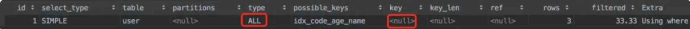

<font style="color:rgb(51, 51, 51);background-color:rgb(248, 246, 244);">你会惊奇的发现，该sql语句竟然变成了全表扫描。因为少写了引号，这种小小的失误，竟然让code字段上的索引失效了。</font>

<font style="color:rgb(51, 51, 51);background-color:rgb(248, 246, 244);">这时你心里可能有一万个为什么，其中有一个肯定是：为什么索引会失效呢？</font>

<font style="color:rgb(51, 51, 51);background-color:rgb(248, 246, 244);">答：因为code字段的类型是varchar，而传参的类型是int，两种类型不同。</font>

<font style="color:rgb(51, 51, 51);background-color:rgb(248, 246, 244);">此外，还有一个有趣的现象，如果int类型的height字段，在查询时加了引号条件，却还可以走索引：</font>

```plain
explain select * from user 
where height='175';
```

<font style="color:rgb(51, 51, 51);background-color:rgb(248, 246, 244);">执行结果：</font>

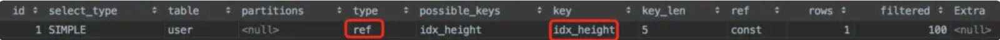

<font style="color:rgb(51, 51, 51);background-color:rgb(248, 246, 244);">从图中看出该sql语句确实走了索引。int类型的参数，不管在查询时加没加引号，都能走索引。</font>

<font style="color:rgb(51, 51, 51);background-color:rgb(248, 246, 244);">这是变魔术吗？这不科学呀。</font>

<font style="color:rgb(51, 51, 51);background-color:rgb(248, 246, 244);">答：mysql发现如果是int类型字段作为查询条件时，它会自动将该字段的传参进行隐式转换，把字符串转换成int类型。</font>

<font style="color:rgb(51, 51, 51);background-color:rgb(248, 246, 244);">mysql会把上面列子中的字符串175，转换成数字175，所以仍然能走索引。</font>

<font style="color:rgb(51, 51, 51);background-color:rgb(248, 246, 244);">接下来，看一个更有趣的sql语句：</font>

```plain
select 1 + '1';
```

<font style="color:rgb(51, 51, 51);background-color:rgb(248, 246, 244);">它的执行结果是2，还是11呢？</font>

<font style="color:rgb(51, 51, 51);background-color:rgb(248, 246, 244);">好吧，不卖关子了，直接公布答案执行结果是2。</font>

<font style="color:rgb(51, 51, 51);background-color:rgb(248, 246, 244);">mysql自动把字符串1，转换成了int类型的1，然后变成了：1+1=2。</font>

<font style="color:rgb(51, 51, 51);background-color:rgb(248, 246, 244);">但如果你确实想拼接字符串该怎么办？</font>

<font style="color:rgb(51, 51, 51);background-color:rgb(248, 246, 244);">答：可以使用concat关键字。</font>

<font style="color:rgb(51, 51, 51);background-color:rgb(248, 246, 244);">具体拼接sql如下：</font>

```csharp
select concat(1,'1');
```

<font style="color:rgb(51, 51, 51);background-color:rgb(248, 246, 244);">接下来，关键问题来了：</font>**<font style="color:rgb(34, 34, 34);background-color:rgb(248, 246, 244);">为什么字符串类型的字段，传入了int类型的参数时索引会失效呢？</font>**

<font style="color:rgb(51, 51, 51);background-color:rgb(248, 246, 244);">答：根据mysql官网上解释，字符串'1'、' 1 '、'1a'都能转换成int类型的1，也就是说可能会出现多个字符串，对应一个int类型参数的情况。那么，mysql怎么知道该把int类型的1转换成哪种字符串，用哪个索引快速查值?</font>

<font style="color:rgb(51, 51, 51);background-color:rgb(248, 246, 244);">感兴趣的小伙伴可以再看看官方文档：</font>[https://dev.mysql.com/doc/refman/8.0/en/type-conversion.html](https://dev.mysql.com/doc/refman/8.0/en/type-conversion.html)

## **<font style="color:rgb(34, 34, 34);background-color:rgb(248, 246, 244);">7. like左边包含%</font>**
<font style="color:rgb(51, 51, 51);background-color:rgb(248, 246, 244);">模糊查询，在我们日常的工作中，使用频率还是比较高的。</font>

<font style="color:rgb(51, 51, 51);background-color:rgb(248, 246, 244);">比如现在有个需求：想查询姓李的同学有哪些?</font>

<font style="color:rgb(51, 51, 51);background-color:rgb(248, 246, 244);">使用like语句可以很快的实现：</font>

```plain
select * from user where name like '李%';
```

<font style="color:rgb(51, 51, 51);background-color:rgb(248, 246, 244);">但如果like用的不好，就可能会出现性能问题，因为有时候它的索引会失效。</font>

<font style="color:rgb(51, 51, 51);background-color:rgb(248, 246, 244);">不信，我们一起往下看。</font>

<font style="color:rgb(51, 51, 51);background-color:rgb(248, 246, 244);">目前like查询主要有三种情况：</font>

+ <font style="color:rgb(51, 51, 51);background-color:rgb(248, 246, 244);">like '%a'</font>
+ <font style="color:rgb(51, 51, 51);background-color:rgb(248, 246, 244);">like 'a%'</font>
+ <font style="color:rgb(51, 51, 51);background-color:rgb(248, 246, 244);">like '%a%'</font>

<font style="color:rgb(51, 51, 51);background-color:rgb(248, 246, 244);">假如现在有个需求：想查出所有code是10开头的用户。</font>

<font style="color:rgb(51, 51, 51);background-color:rgb(248, 246, 244);">这个需求太简单了吧，sql语句如下：</font>

```plain
explain select * from user
where code like '10%';
```

<font style="color:rgb(51, 51, 51);background-color:rgb(248, 246, 244);">执行结果：</font>

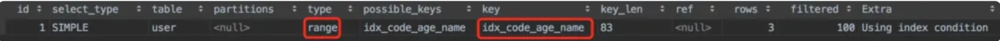

<font style="color:rgb(51, 51, 51);background-color:rgb(248, 246, 244);">图中看出这种%在10右边时走了索引。</font>

<font style="color:rgb(51, 51, 51);background-color:rgb(248, 246, 244);">而如果把需求改了：想出现出所有code是1结尾的用户。</font>

<font style="color:rgb(51, 51, 51);background-color:rgb(248, 246, 244);">查询sql语句改为：</font>

```plain
explain select * from user
where code like '%1';
```

<font style="color:rgb(51, 51, 51);background-color:rgb(248, 246, 244);">执行结果：</font>


<font style="color:rgb(51, 51, 51);background-color:rgb(248, 246, 244);">从图中看出这种%在1左边时，code字段上索引失效了，该sql变成了全表扫描。</font>

<font style="color:rgb(51, 51, 51);background-color:rgb(248, 246, 244);">此外，如果出现以下sql：</font>

```plain
explain select * from user
where code like '%1%';
```

<font style="color:rgb(51, 51, 51);background-color:rgb(248, 246, 244);">该sql语句的索引也会失效。</font>

<font style="color:rgb(51, 51, 51);background-color:rgb(248, 246, 244);">下面用一句话总结一下规律：当like语句中的%，出现在查询条件的左边时，索引会失效。</font>

<font style="color:rgb(51, 51, 51);background-color:rgb(248, 246, 244);">那么，为什么会出现这种现象呢？</font>

<font style="color:rgb(51, 51, 51);background-color:rgb(248, 246, 244);">答：其实很好理解，索引就像字典中的目录。一般目录是按字母或者拼音从小到大，从左到右排序，是有顺序的。</font>

<font style="color:rgb(51, 51, 51);background-color:rgb(248, 246, 244);">我们在查目录时，通常会先从左边第一个字母进行匹对，如果相同，再匹对左边第二个字母，如果再相同匹对其他的字母，以此类推。</font>

<font style="color:rgb(51, 51, 51);background-color:rgb(248, 246, 244);">通过这种方式我们能快速锁定一个具体的目录，或者缩小目录的范围。</font>

<font style="color:rgb(51, 51, 51);background-color:rgb(248, 246, 244);">但如果你硬要跟目录的设计反着来，先从字典目录右边匹配第一个字母，这画面你可以自行脑补一下，你眼中可能只剩下绝望了，哈哈。</font>

## **<font style="color:rgb(34, 34, 34);background-color:rgb(248, 246, 244);">8. 列对比</font>**
<font style="color:rgb(51, 51, 51);background-color:rgb(248, 246, 244);">上面的内容都是常规需求，接下来，来点不一样的。</font>

<font style="color:rgb(51, 51, 51);background-color:rgb(248, 246, 244);">假如我们现在有这样一个需求：过滤出表中某两列值相同的记录。比如user表中id字段和height字段，查询出这两个字段中值相同的记录。</font>

<font style="color:rgb(51, 51, 51);background-color:rgb(248, 246, 244);">这个需求很简单，sql可以这样写：</font>

```plain
explain select * from user 
where id=height
```

<font style="color:rgb(51, 51, 51);background-color:rgb(248, 246, 244);">执行结果：</font>

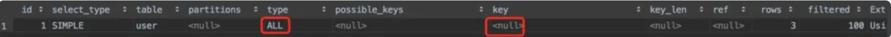

<font style="color:rgb(51, 51, 51);background-color:rgb(248, 246, 244);">意不意外，惊不惊喜？索引失效了。</font>

<font style="color:rgb(51, 51, 51);background-color:rgb(248, 246, 244);">为什么会出现这种结果？</font>

<font style="color:rgb(51, 51, 51);background-color:rgb(248, 246, 244);">id字段本身是有主键索引的，同时height字段也建了普通索引的，并且两个字段都是int类型，类型是一样的。</font>

<font style="color:rgb(51, 51, 51);background-color:rgb(248, 246, 244);">但如果把两个单独建了索引的列，用来做列对比时索引会失效。</font>

<font style="color:rgb(51, 51, 51);background-color:rgb(248, 246, 244);">感兴趣的朋友可以找我私聊。</font>

## **<font style="color:rgb(34, 34, 34);background-color:rgb(248, 246, 244);">9. 使用or关键字</font>**
<font style="color:rgb(51, 51, 51);background-color:rgb(248, 246, 244);">我们平时在写查询sql时，使用or关键字的场景非常多，但如果你稍不注意，就可能让已有的索引失效。</font>

<font style="color:rgb(51, 51, 51);background-color:rgb(248, 246, 244);">不信一起往下面看。</font>

<font style="color:rgb(51, 51, 51);background-color:rgb(248, 246, 244);">某天你遇到这样一个需求：想查一下id=1或者height=175的用户。</font>

<font style="color:rgb(51, 51, 51);background-color:rgb(248, 246, 244);">你三下五除二就把sql写好了：</font>

```plain
explain select * from user 
where id=1 or height='175';
```

<font style="color:rgb(51, 51, 51);background-color:rgb(248, 246, 244);">执行结果：</font>

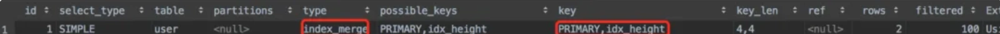

<font style="color:rgb(51, 51, 51);background-color:rgb(248, 246, 244);">没错，这次确实走了索引，恭喜被你蒙对了，因为刚好id和height字段都建了索引。</font>

<font style="color:rgb(51, 51, 51);background-color:rgb(248, 246, 244);">但接下来的一个夜黑风高的晚上，需求改了：除了前面的查询条件之后，还想加一个address='成都'。</font>

<font style="color:rgb(51, 51, 51);background-color:rgb(248, 246, 244);">这还不简单，sql走起：</font>

```plain
explain select * from user 
where id=1 or height='175' or address='成都';
```

<font style="color:rgb(51, 51, 51);background-color:rgb(248, 246, 244);">执行结果：</font>

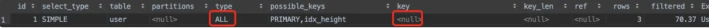

<font style="color:rgb(51, 51, 51);background-color:rgb(248, 246, 244);">结果悲剧了，之前的索引都失效了。</font>

<font style="color:rgb(51, 51, 51);background-color:rgb(248, 246, 244);">你可能一脸懵逼，为什么？我做了什么？</font>

<font style="color:rgb(51, 51, 51);background-color:rgb(248, 246, 244);">答：因为你最后加的address字段没有加索引，从而导致其他字段的索引都失效了。</font>

<font style="color:rgb(100, 100, 100);background-color:rgb(248, 246, 244);">注意：如果使用了or关键字，那么它前面和后面的字段都要加索引，不然所有的索引都会失效，这是一个大坑。</font>

## **<font style="color:rgb(34, 34, 34);background-color:rgb(248, 246, 244);">10. not in和not exists</font>**
<font style="color:rgb(51, 51, 51);background-color:rgb(248, 246, 244);">在我们日常工作中用得也比较多的，还有范围查询，常见的有：</font>

+ <font style="color:rgb(51, 51, 51);background-color:rgb(248, 246, 244);">in</font>
+ <font style="color:rgb(51, 51, 51);background-color:rgb(248, 246, 244);">exists</font>
+ <font style="color:rgb(51, 51, 51);background-color:rgb(248, 246, 244);">not in</font>
+ <font style="color:rgb(51, 51, 51);background-color:rgb(248, 246, 244);">not exists</font>
+ <font style="color:rgb(51, 51, 51);background-color:rgb(248, 246, 244);">between and</font>

<font style="color:rgb(51, 51, 51);background-color:rgb(248, 246, 244);">今天重点聊聊前面四种。</font>

### **<font style="color:rgb(34, 34, 34);background-color:rgb(248, 246, 244);">10.1 in关键字</font>**
<font style="color:rgb(51, 51, 51);background-color:rgb(248, 246, 244);">假如我们想查出height在某些范围之内的用户，这时sql语句可以这样写：</font>

```plain
explain select * from user
where height in (173,174,175,176);
```

<font style="color:rgb(51, 51, 51);background-color:rgb(248, 246, 244);">执行结果：</font>

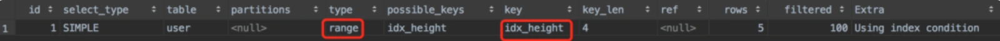

<font style="color:rgb(51, 51, 51);background-color:rgb(248, 246, 244);">从图中可以看出，sql语句中用in关键字是走了索引的。</font>

### **<font style="color:rgb(34, 34, 34);background-color:rgb(248, 246, 244);">10.2 exists关键字</font>**
<font style="color:rgb(51, 51, 51);background-color:rgb(248, 246, 244);">有时候使用in关键字时性能不好，这时就能用exists关键字优化sql了，该关键字能达到in关键字相同的效果：</font>

```plain
explain select * from user  t1
where  exists (select 1 from user t2 where t2.height=173 and t1.id=t2.id)
```

<font style="color:rgb(51, 51, 51);background-color:rgb(248, 246, 244);">执行结果：</font>

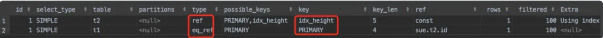

<font style="color:rgb(51, 51, 51);background-color:rgb(248, 246, 244);">从图中可以看出，用exists关键字同样走了索引。</font>

### **<font style="color:rgb(34, 34, 34);background-color:rgb(248, 246, 244);">10.3 not in关键字</font>**
<font style="color:rgb(51, 51, 51);background-color:rgb(248, 246, 244);">上面演示的两个例子是正向的范围，即在某些范围之内。</font>

<font style="color:rgb(51, 51, 51);background-color:rgb(248, 246, 244);">那么反向的范围，即不在某些范围之内，能走索引不？</font>

<font style="color:rgb(51, 51, 51);background-color:rgb(248, 246, 244);">话不多说，先看看使用not in的情况：</font>

```plain
explain select * from user
where height not in (173,174,175,176);
```

<font style="color:rgb(51, 51, 51);background-color:rgb(248, 246, 244);">执行结果：</font>


<font style="color:rgb(51, 51, 51);background-color:rgb(248, 246, 244);">你没看错，索引失效了。</font>

<font style="color:rgb(51, 51, 51);background-color:rgb(248, 246, 244);">看如果现在需求改了：想查一下id不等于1、2、3的用户有哪些，这时sql语句可以改成这样：</font>

```plain
explain select * from user
where id  not in (173,174,175,176);
```

<font style="color:rgb(51, 51, 51);background-color:rgb(248, 246, 244);">执行结果：</font>

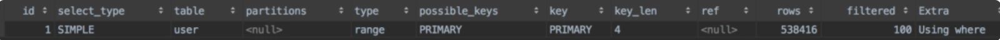

<font style="color:rgb(51, 51, 51);background-color:rgb(248, 246, 244);">你可能会惊奇的发现，主键字段中使用not in关键字查询数据范围，任然可以走索引。而普通索引字段使用了not in关键字查询数据范围，索引会失效。</font>

### **<font style="color:rgb(34, 34, 34);background-color:rgb(248, 246, 244);">10.4 not exists关键字</font>**
<font style="color:rgb(51, 51, 51);background-color:rgb(248, 246, 244);">除此之外，如果sql语句中使用not exists时，索引也会失效。具体sql语句如下：</font>

```plain
explain select * from user  t1
where  not exists (select 1 from user t2 where t2.height=173 and t1.id=t2.id)
```

<font style="color:rgb(51, 51, 51);background-color:rgb(248, 246, 244);">执行结果：</font>

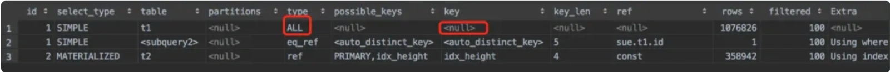

<font style="color:rgb(51, 51, 51);background-color:rgb(248, 246, 244);">从图中看出sql语句中使用not exists关键后，t1表走了全表扫描，并没有走索引。</font>

## **<font style="color:rgb(34, 34, 34);background-color:rgb(248, 246, 244);">11. order by的坑</font>**
<font style="color:rgb(51, 51, 51);background-color:rgb(248, 246, 244);">在sql语句中，对查询结果进行排序是非常常见的需求，一般情况下我们用关键字：order by就能搞定。</font>

<font style="color:rgb(51, 51, 51);background-color:rgb(248, 246, 244);">但我始终觉得order by挺难用的，它跟where或者limit关键字有很多千丝万缕的联系，一不小心就会出问题。</font>

<font style="color:rgb(51, 51, 51);background-color:rgb(248, 246, 244);">Let go</font>

### **<font style="color:rgb(34, 34, 34);background-color:rgb(248, 246, 244);">11.1 哪些情况走索引？</font>**
<font style="color:rgb(51, 51, 51);background-color:rgb(248, 246, 244);">首先当然要温柔一点，一起看看order by的哪些情况可以走索引。</font>

<font style="color:rgb(51, 51, 51);background-color:rgb(248, 246, 244);">我之前说过，在code、age和name这3个字段上，已经建了联合索引：idx_code_age_name。</font>

**<font style="color:rgb(34, 34, 34);background-color:rgb(248, 246, 244);">11.1.1 满足最左匹配原则</font>**

<font style="color:rgb(51, 51, 51);background-color:rgb(248, 246, 244);">order by后面的条件，也要遵循联合索引的最左匹配原则。具体有以下sql：</font>

```plain
explain select * from user
order by code limit 100;

explain select * from user
order by code,age limit 100;

explain select * from user
order by code,age,name limit 100;
```

<font style="color:rgb(51, 51, 51);background-color:rgb(248, 246, 244);">执行结果：</font>

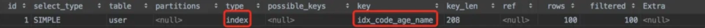

<font style="color:rgb(51, 51, 51);background-color:rgb(248, 246, 244);">从图中看出这3条sql都能够正常走索引。</font>

<font style="color:rgb(51, 51, 51);background-color:rgb(248, 246, 244);">除了遵循最左匹配原则之外，有个非常关键的地方是，后面还是加了limit关键字，如果不加它索引会失效。</font>

**<font style="color:rgb(34, 34, 34);background-color:rgb(248, 246, 244);">11.1.2 配合where一起使用</font>**

<font style="color:rgb(51, 51, 51);background-color:rgb(248, 246, 244);">order by还能配合where一起遵循最左匹配原则。</font>

```plain
explain select * from user
where code='101'
order by age;
```

<font style="color:rgb(51, 51, 51);background-color:rgb(248, 246, 244);">执行结果：</font>


<font style="color:rgb(51, 51, 51);background-color:rgb(248, 246, 244);">code是联合索引的第一个字段，在where中使用了，而age是联合索引的第二个字段，在order by中接着使用。</font>

<font style="color:rgb(51, 51, 51);background-color:rgb(248, 246, 244);">假如中间断层了，sql语句变成这样，执行结果会是什么呢？</font>

```plain
explain select * from user
where code='101'
order by name;
```

<font style="color:rgb(51, 51, 51);background-color:rgb(248, 246, 244);">执行结果：</font>


<font style="color:rgb(51, 51, 51);background-color:rgb(248, 246, 244);">虽说name是联合索引的第三个字段，但根据最左匹配原则，该sql语句依然能走索引，因为最左边的第一个字段code，在where中使用了。只不过order by的时候，排序效率比较低，需要走一次filesort排序罢了。</font>

**<font style="color:rgb(34, 34, 34);background-color:rgb(248, 246, 244);">11.1.3 相同的排序</font>**

<font style="color:rgb(51, 51, 51);background-color:rgb(248, 246, 244);">order by后面如果包含了联合索引的多个排序字段，只要它们的排序规律是相同的（要么同时升序，要么同时降序），也可以走索引。</font>

<font style="color:rgb(51, 51, 51);background-color:rgb(248, 246, 244);">具体sql如下：</font>

```plain
explain select * from user
order by code desc,age desc limit 100;
```

<font style="color:rgb(51, 51, 51);background-color:rgb(248, 246, 244);">执行结果：</font>

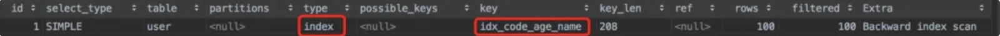

<font style="color:rgb(51, 51, 51);background-color:rgb(248, 246, 244);">该示例中order by后面的code和age字段都用了降序，所以依然走了索引。</font>

**<font style="color:rgb(34, 34, 34);background-color:rgb(248, 246, 244);">11.1.4 两者都有</font>**

<font style="color:rgb(51, 51, 51);background-color:rgb(248, 246, 244);">如果某个联合索引字段，在where和order by中都有，结果会怎么样？</font>

```plain
explain select * from user
where code='101'
order by code, name;
```

<font style="color:rgb(51, 51, 51);background-color:rgb(248, 246, 244);">执行结果：</font>

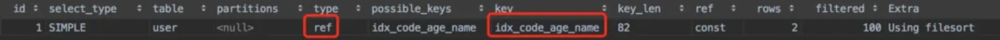

<font style="color:rgb(51, 51, 51);background-color:rgb(248, 246, 244);">code字段在where和order by中都有，对于这种情况，从图中的结果看出，还是能走了索引的。</font>

### **<font style="color:rgb(34, 34, 34);background-color:rgb(248, 246, 244);">11.2 哪些情况不走索引？</font>**
<font style="color:rgb(51, 51, 51);background-color:rgb(248, 246, 244);">前面介绍的都是正面的用法，是为了让大家更容易接受下面反面的用法。</font>

<font style="color:rgb(51, 51, 51);background-color:rgb(248, 246, 244);">好了，接下来，重点聊聊order by的哪些情况下不走索引？</font>

**<font style="color:rgb(34, 34, 34);background-color:rgb(248, 246, 244);">11.2.1 没加where或limit</font>**

<font style="color:rgb(51, 51, 51);background-color:rgb(248, 246, 244);">如果order by语句中没有加where或limit关键字，该sql语句将不会走索引。</font>

```plain
explain select * from user
order by code, name;
```

<font style="color:rgb(51, 51, 51);background-color:rgb(248, 246, 244);">执行结果：</font>

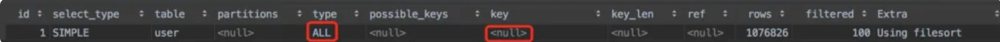

<font style="color:rgb(51, 51, 51);background-color:rgb(248, 246, 244);">从图中看出索引真的失效了。</font>

**<font style="color:rgb(34, 34, 34);background-color:rgb(248, 246, 244);">11.2.2 对不同的索引做order by</font>**

<font style="color:rgb(51, 51, 51);background-color:rgb(248, 246, 244);">前面介绍的基本都是联合索引，这一个索引的情况。但如果对多个索引进行order by，结果会怎么样呢？</font>

```plain
explain select * from user
order by code, height limit 100;
```

<font style="color:rgb(51, 51, 51);background-color:rgb(248, 246, 244);">执行结果：</font>

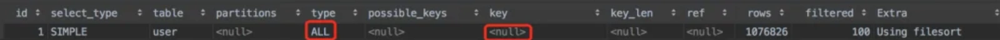

<font style="color:rgb(51, 51, 51);background-color:rgb(248, 246, 244);">从图中看出索引也失效了。</font>

**<font style="color:rgb(34, 34, 34);background-color:rgb(248, 246, 244);">11.2.3 不满足最左匹配原则</font>**

<font style="color:rgb(51, 51, 51);background-color:rgb(248, 246, 244);">前面已经介绍过，order by如果满足最左匹配原则，还是会走索引。下面看看，不满足最左匹配原则的情况：</font>

```plain
explain select * from user
order by name limit 100;
```

<font style="color:rgb(51, 51, 51);background-color:rgb(248, 246, 244);">执行结果：</font>

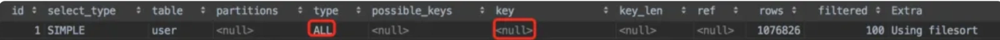

<font style="color:rgb(51, 51, 51);background-color:rgb(248, 246, 244);">name字段是联合索引的第三个字段，从图中看出如果order by不满足最左匹配原则，确实不会走索引。</font>

**<font style="color:rgb(34, 34, 34);background-color:rgb(248, 246, 244);">11.2.4 不同的排序</font>**

<font style="color:rgb(51, 51, 51);background-color:rgb(248, 246, 244);">前面已经介绍过，如果order by后面有一个联合索引的多个字段，它们具有相同排序规则，那么会走索引。</font>

<font style="color:rgb(51, 51, 51);background-color:rgb(248, 246, 244);">但如果它们有不同的排序规则呢？</font>

```plain
explain select * from user
order by code asc,age desc limit 100;
```

<font style="color:rgb(51, 51, 51);background-color:rgb(248, 246, 244);">执行结果：</font>


<font style="color:rgb(51, 51, 51);background-color:rgb(248, 246, 244);">从图中看出，尽管order by后面的code和age字段遵循了最左匹配原则，但由于一个字段是用的升序，另一个字段用的降序，最终会导致索引失效。</font>

  
 


> 更新: 2024-05-20 17:17:04  
> 原文: <https://www.yuque.com/yuqueyonghue6cvnv/cxhfwd/os7nxvgshn0u3mfq>