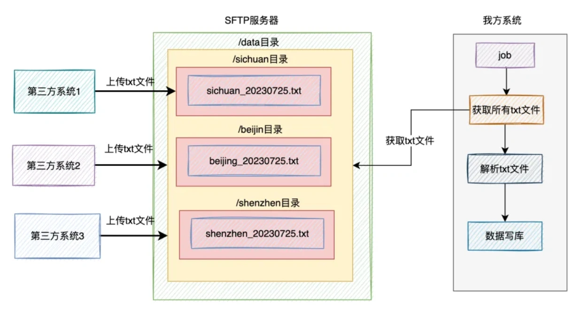
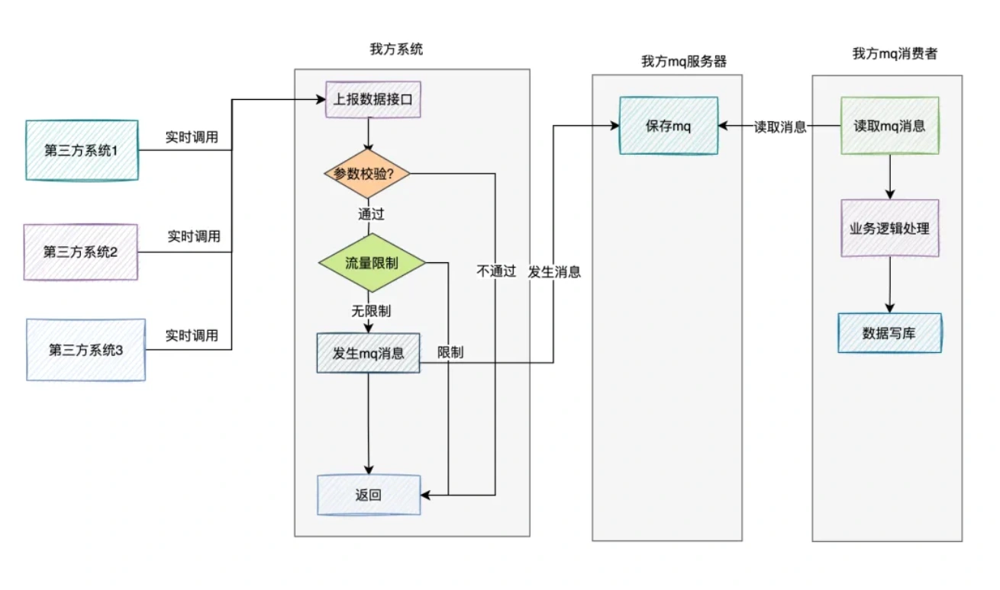
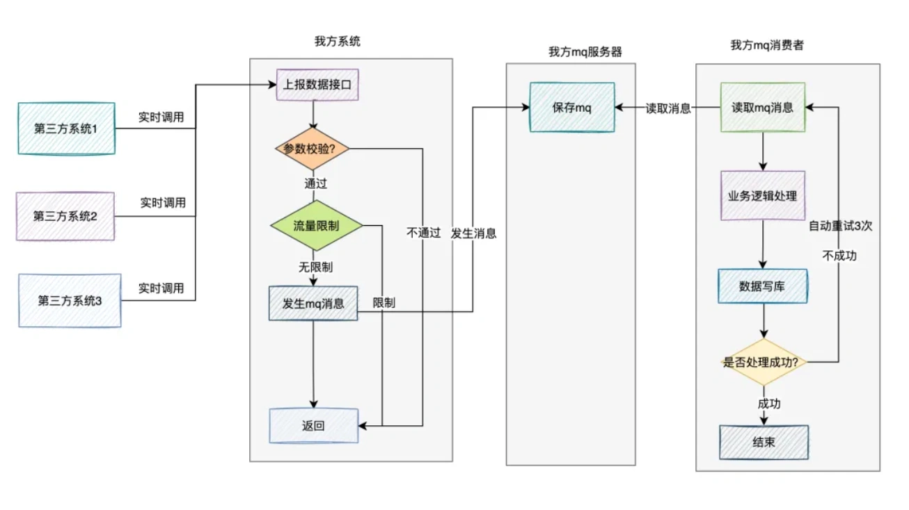
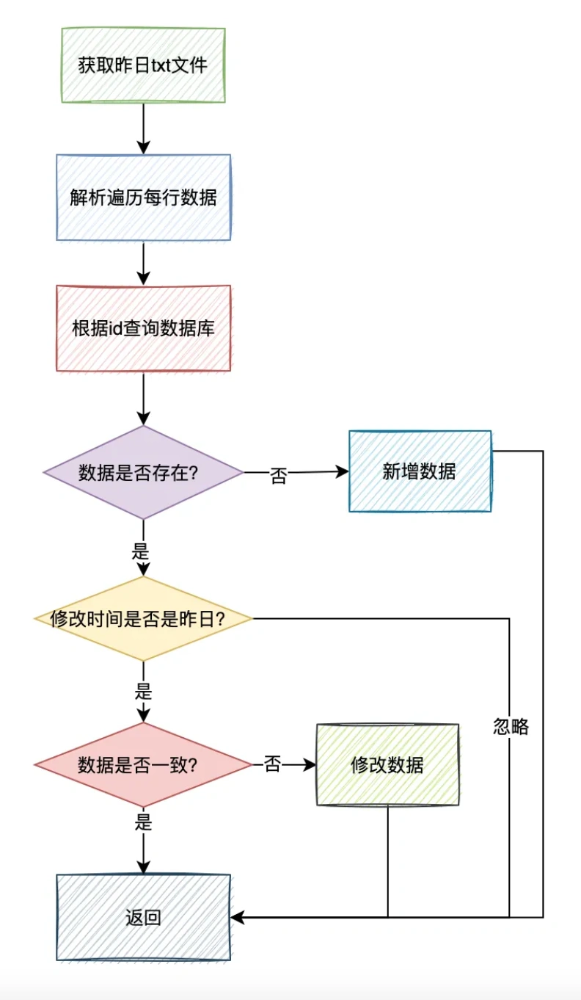

# 数据同步问题

## **前言**
最近知识星球中有位小伙伴问了我一个问题：如何快速同步第三方平台数据？

他们有个业务需求是：需要同步全国34个省市，多个系统的8种业务数据，到他们公司的系统当中。

他们需求同步全量的数据和增量的数据。

全量的数据主要是针对多个系统的历史数据，大概有几千万数据，只需要初始化一次即可。

而增量的数据，是系统后续变更的数据。

这个需求其实不简单，至少有以下难点：

1. 不能直接访问第三方数据库。
2. 不能将历史数据导出到excel中，有泄露数据的风险。
3. 如何快速同步历史数据？
4. 增量数据如何处理？
5. 接口需要做限流吗？
6. 增量数据如何校验数据的一致性？

带着这些问题，开始今天的文章之旅。

## **1. 如何快速同步历史数据？**
想要快速同步历史数据，第一个想到的可能是直接同步数据库中的数据。

但多个第三方系统为了数据安全考虑，不可能直接把他们的数据库访问地址和相关账号密码告诉你。

即使他们告诉你了，但有很多个系统，你一个个去连数据库查数据，也非常麻烦。

有些小伙伴可能会说：这好办，让第三方系统把他们的历史数据导出到excel中，我们写个程序解析去这些excel，就能将数据快速导入到我们的数据库中。

这是个好办法，但忽略了一点：这些数据是敏感数据，不能对外暴露。

因此导出excel的方案行不通。

那么，该如何快速同步历史数据呢？

答：使用SFTP。

不知道你有没有跟银行对接过，SFTP在银行业务中经常会用到。

那么，如何用SFTP同步数据呢？

## **2. 如何使用SFTP？**
说起SFTP，就不得不说一说FTP。

我们都知道，FTP是用来传送文件的协议。使用FTP实现远程文件传输的同时，还可以保证数据传输的可靠性和高效性。

而SFTP是一种可以安全传输文件的协议，它是一种基于SSH（Secure Shell）的文件传输协议，它允许用户将文件以加密的形式传输到远程服务器上，以保护文件的安全性。

FTP和SFTP有哪些区别呢？

1. 链接方式不同：FTP使用TCP的21号端口建立连接。而SFTP是在客户端和服务器之间通过 SSH 协议 (即TCP22号端口) 建立的安全连接来传输文件。
2. 安全性不同：SFTP使用加密传输认证信息和传输的数据，相对于FTP更安全一些。
3. 传输效率不同：SFTP传输文件时使用了加密解密技术，因此传输效率比普通的FTP要低一些。
4. 使用协议不同：FTP使用了TCP/IP协议，而SFTP使用了SSH协议。
5. 安全通道：SFTP协议提供了一个安全通道，用于在网络上的主机之间传输文件。而FTP协议没有安全通道。

因此可见，我们使用SFTP来传输文件还是比较安全的。

那么，如何使用SFTP来实现同步历史数据的需求呢？

答：这就需要我们做好SFTP的账号、目录和文件格式的规划了。

### **2.1 账号权限控制**
首先需要运维同学搭建一个SFTP服务器，提供一个可以对外访问的域名和端口号。

然后需要在根目录下，创建一个存放文件的目录，比如：/data。

然后给每个省市的第三方系统都创建一个子目录，比如：/data/sichuan、/data/shenzhen、/data/beijing等。

接下来，我们需要给每个子目录创建一个账号，以及分配权限。

比如有个账号是：sichuan，密码是：sisuan123。这个账号只拥有/data/sichuan目录读数据和写数据的权限。

另外一个账号是：shenzhen，密码是：shenzhen123。这个账号只拥有/data/目录读数据和写数据的权限。

以此类推。

当然大家如果不放心，可以用在线工具，将密码设置成一个8位的随机字符串，包含字母、数字和特殊字符，这样的密码安全性相对来说要高一些。

这样相关的第三方系统都有往SFTP自己目录下读和写数据的权限。

在这里温馨提醒一下：上面这些账号读数据的权限，主要是为了后面他们好排查问题用的，不是必须分配的，我们需要根据实际情况而定。

此外，还需要给我们自己分配一个账号，开通对/data整个目录的只读权限。

### **2.2 统一数据格式**
接下来，最关键的一步是要制定一个统一的文件格式和数据格式。

文件名称为：sichuan_20230724.txt。

也就是用 省市拼音_日期.txt 的格式。

这样大家就能非常清楚的看出，是哪个省市，哪个日期产生的数据。

然后我们需要规定txt文件的格式。

比如：id占20个字符，name占30个字符，金额占10个字符等等。

如果有些列的数据不满对应的字符长度，前面可以补0。

这样我们的程序，只需要在解析txt文件时，先读取一行数据，是一个比较长的字符串，然后按照固定的长度，去解析字符串中每一列的数据即可。

### **2.3 使用job同步数据**
假如第三方系统都按照我们要求，已将历史数据写入到指定目录下的指定文件中。

这时我们需要提供一个job，去读取/data目录下，所有子目录的txt文件，一个个解析里面包含的历史数据，然后将这些数据，做一些业务逻辑处理，然后写入我们的数据库当中。

如图所示：

当然如果想快一点处理完，我们可以在job中使用多线程解析和读取不同的txt文件，然后写数据。

## **3. 增量数据如何处理？**
对于历史数据，我们通过上面的方案，可以快速的同步数据。

但对于增量的数据如何处理呢？

增量的数据，对实时性要求比较高。

我们没办法跟之前一下，走SFTP同步文件，然后使用job定时解析文件的方案。

为了满足数据实时性的需求，我们不得不走接口实时数据同步的方案。

那么，是第三方系统提供接口，还是我们这边提供接口呢？

很显然，如果让第三方提供接口，第三方有那么多系统，我们需要对接很多很多接口，非常麻烦。

因此，这个接口必须由我们这边提供。

我们这边提供一个统一的数据上报接口，支持传入批量的数据。

为了防止第三方系统，一次性传入过多的参数，导致该接口超时，我们需要对单次上传的数据条数做限制，例如：一次请求，最大允许上传500条数据。

其实，光限制请求参数还不够。

我们的这个数据上报接口，可能会被多个系统调用，并发量可能也不小。

为了防止在高并发下，请求量突增把我们的接口搞挂了，我们需要对接口限流。

我们可以使用redis记录第三方系统请求的url和请求账号，然后在程序中查询redis中的次数，是否超过限额。允许每一个第三方系统，在1秒之内调用10次。第三方系统总的请求次数，1秒不超过500次。

如果超过了限额，则数据上报接口提示：请求太频繁，请稍后再试。

为了增加数据上报接口的性能，在接收到数据之后，不直接写库。

我们可以将接口中接收到的数据作为mq消息，发送到mq服务器。

然后有专门的mq消费者，实时监听mq服务器的消息，异步读取消息写入数据库。

该方案比较适合，写库操作，包含了一些复杂的业务逻辑。

如果消费速度有点慢，我们可以及时调整mq消费者，使用多线程处理，或者增加mq中队列的数量，增加mq消费者来增加消息的处理速度。

如果mq消费者在处理mq消息的过程中，由于网络问题，写库失败了，可以增加自动重试机制。

一旦mq消费者在mq消费过程中出现失败的情况，则自动重试3次，如果还是失败，则将消息写入死信队列，目前RocketMQ自带了失败重试功能。

然后有个job监控死信队列，如果一旦发现异常数据，则发报警邮件给相关开发，后面人工处理。

## **4. 如何校验数据一致性？**
通过上面的方案，我们把历史数据和增量的数据都已经处理了。

但还有一个问题：如何校验数据一致性。

对于历史数据，其实我们好处理，第三方系统已经生成好txt文件上传到SFTP上了，我们可以直接对比那些文件即可。

但对于增量的数据，是第三方系统调用我们的数据上报接口，去上报的数据，这部分数据如何校验数据一致性呢？

答：我们可以要求第三方系统，在某日凌晨，生成一份昨日的增量数据到txt文件，然后上传到SFTP上。

我们有个job，在每天的凌晨1点会读取第三方系统生成昨日增量数据，跟我们数据库中昨日的增量数据做对比，校验数据的差异性。

如果第三方后面产生的增量数据，只有新增，没有删除和修改，使用上面的方案是没有问题的。

但如果增量的数据，包含了删除和修改的数据，可能会有问题。

因为我们做比较的数据源是昨日的增量数据，而我们的job在比较数据的过程中，万一第三方系统上报了我们正在对比的数据，更新成了一个新值，跟昨日的值不一样，这样对比数据就会产生差异。

那么，该如何解决这个问题呢？

答：我们可以只校验昨日的数据（就修改时间是昨天），今日产生的增量数据，会在明日凌晨1点的job中会去校验的。

在比较时，遍历昨日增量txt文件中的每行数据，跟数据库中的数据做对比，如果id相同，但是修改时间是今天，则忽略这条数据。

如果id相同，修改时间是昨天，则判断数据是否一致，如果不一致，则用txt文件中的数据修复我们数据库中的异常数据。

如果txt文件中的id，在我们数据库中不存在，则新增一条数据。

这两种情况产生的数据变动，修改时间要设置成昨天，不然明日的job又会再重新处理一次这条数据。

> 更新: 2024-05-31 23:40:17  
> 原文: <https://www.yuque.com/yuqueyonghue6cvnv/cxhfwd/nrm7zmu9rvzkls86>