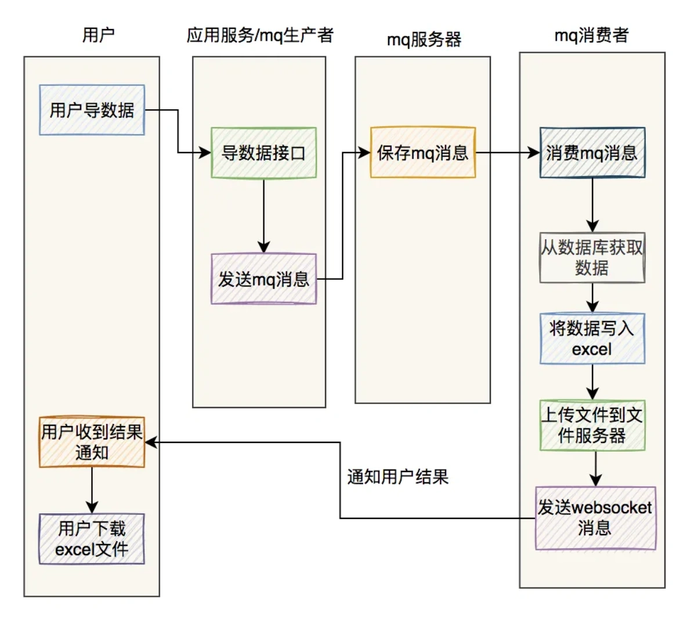
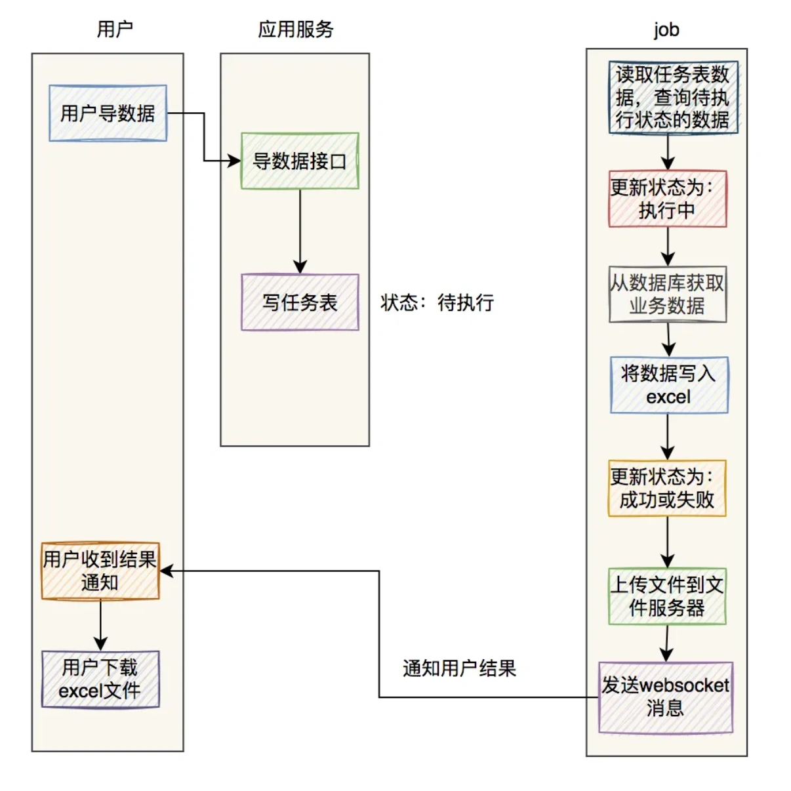

# 百万数据excel导出问题

## **<font style="color:rgb(34, 34, 34);background-color:rgb(248, 246, 244);">前言</font>**
<font style="color:rgb(51, 51, 51);background-color:rgb(248, 246, 244);">最近我做过一个MySQL百万级别数据的excel导出功能，已经正常上线使用了。</font>

<font style="color:rgb(51, 51, 51);background-color:rgb(248, 246, 244);">这个功能挺有意思的，里面需要注意的细节还真不少，现在拿出来跟大家分享一下，希望对你会有所帮助。</font>

<font style="color:rgb(51, 51, 51);background-color:rgb(248, 246, 244);">原始需求：用户在UI界面上点击全部导出按钮，就能导出所有商品数据。</font>

<font style="color:rgb(51, 51, 51);background-color:rgb(248, 246, 244);">咋一看，这个需求挺简单的。</font>

<font style="color:rgb(51, 51, 51);background-color:rgb(248, 246, 244);">但如果我告诉你，导出的记录条数，可能有一百多万，甚至两百万呢？</font>

<font style="color:rgb(51, 51, 51);background-color:rgb(248, 246, 244);">这时你可能会倒吸一口气。</font>

<font style="color:rgb(51, 51, 51);background-color:rgb(248, 246, 244);">因为你可能会面临如下问题：</font>

1. <font style="color:rgb(51, 51, 51);background-color:rgb(248, 246, 244);">如果同步导数据，接口很容易超时。</font>
2. <font style="color:rgb(51, 51, 51);background-color:rgb(248, 246, 244);">如果把所有数据一次性装载到内存，很容易引起OOM。</font>
3. <font style="color:rgb(51, 51, 51);background-color:rgb(248, 246, 244);">数据量太大sql语句必定很慢。</font>
4. <font style="color:rgb(51, 51, 51);background-color:rgb(248, 246, 244);">相同商品编号的数据要放到一起。</font>
5. <font style="color:rgb(51, 51, 51);background-color:rgb(248, 246, 244);">如果走异步，如何通知用户导出结果？</font>
6. <font style="color:rgb(51, 51, 51);background-color:rgb(248, 246, 244);">如果excel文件太大，目标用户打不开怎么办？</font>

<font style="color:rgb(51, 51, 51);background-color:rgb(248, 246, 244);">我们要如何才能解决这些问题，实现一个百万级别的excel数据快速导出功能呢？</font>

## **<font style="color:rgb(34, 34, 34);background-color:rgb(248, 246, 244);">1.异步处理</font>**
<font style="color:rgb(51, 51, 51);background-color:rgb(248, 246, 244);">做一个MySQL百万数据级别的excel导出功能，如果走接口同步导出，该接口肯定会非常容易超时。</font>

<font style="color:rgb(51, 51, 51);background-color:rgb(248, 246, 244);">因此，我们在做系统设计的时候，第一选择应该是接口走异步处理。</font>

<font style="color:rgb(51, 51, 51);background-color:rgb(248, 246, 244);">说起异步处理，其实有很多种，比如：使用开启一个线程，或者使用线程池，或者使用job，或者使用mq等。</font>

<font style="color:rgb(51, 51, 51);background-color:rgb(248, 246, 244);">为了防止服务重启时数据的丢失问题，我们大多数情况下，会使用job或者mq来实现异步功能。</font>

### **<font style="color:rgb(34, 34, 34);background-color:rgb(248, 246, 244);">1.1 使用job</font>**
<font style="color:rgb(51, 51, 51);background-color:rgb(248, 246, 244);">如果使用job的话，需要增加一张执行任务表，记录每次的导出任务。</font>

<font style="color:rgb(51, 51, 51);background-color:rgb(248, 246, 244);">用户点击全部导出按钮，会调用一个后端接口，该接口会向表中写入一条记录，该记录的状态为：待执行。</font>

<font style="color:rgb(51, 51, 51);background-color:rgb(248, 246, 244);">有个job，每隔一段时间（比如：5分钟），扫描一次执行任务表，查出所有状态是待执行的记录。</font>

<font style="color:rgb(51, 51, 51);background-color:rgb(248, 246, 244);">然后遍历这些记录，挨个执行。</font>

<font style="color:rgb(51, 51, 51);background-color:rgb(248, 246, 244);">需要注意的是：如果用job的话，要避免重复执行的情况。比如job每隔5分钟执行一次，但如果数据导出的功能所花费的时间超过了5分钟，在一个job周期内执行不完，就会被下一个job执行周期执行。</font>

<font style="color:rgb(51, 51, 51);background-color:rgb(248, 246, 244);">所以使用job时可能会出现重复执行的情况。</font>

<font style="color:rgb(51, 51, 51);background-color:rgb(248, 246, 244);">为了防止job重复执行的情况，该执行任务需要增加一个执行中的状态。</font>

<font style="color:rgb(51, 51, 51);background-color:rgb(248, 246, 244);">具体的状态变化如下：</font>

1. <font style="color:rgb(51, 51, 51);background-color:rgb(248, 246, 244);">执行任务被刚记录到执行任务表，是待执行状态。</font>
2. <font style="color:rgb(51, 51, 51);background-color:rgb(248, 246, 244);">当job第一次执行该执行任务时，该记录再数据库中的状态改为：执行中。</font>
3. <font style="color:rgb(51, 51, 51);background-color:rgb(248, 246, 244);">当job跑完了，该记录的状态变成：完成或失败。</font>

<font style="color:rgb(51, 51, 51);background-color:rgb(248, 246, 244);">这样导出数据的功能，在第一个job周期内执行不完，在第二次job执行时，查询待处理状态，并不会查询出执行中状态的数据，也就是说不会重复执行。</font>

<font style="color:rgb(51, 51, 51);background-color:rgb(248, 246, 244);">此外，使用job还有一个硬伤即：它不是立马执行的，有一定的延迟。</font>

<font style="color:rgb(51, 51, 51);background-color:rgb(248, 246, 244);">如果对时间不太敏感的业务场景，可以考虑使用该方案。</font>

### **<font style="color:rgb(34, 34, 34);background-color:rgb(248, 246, 244);">1.2 使用mq</font>**
<font style="color:rgb(51, 51, 51);background-color:rgb(248, 246, 244);">用户点击全部导出按钮，会调用一个后端接口，该接口会向mq服务端，发送一条mq消息。</font>

<font style="color:rgb(51, 51, 51);background-color:rgb(248, 246, 244);">有个专门的mq消费者，消费该消息，然后就可以实现excel的数据导出了。</font>

<font style="color:rgb(51, 51, 51);background-color:rgb(248, 246, 244);">相较于job方案，使用mq方案的话，实时性更好一些。</font>

<font style="color:rgb(51, 51, 51);background-color:rgb(248, 246, 244);">对于mq消费者处理失败的情况，可以增加补偿机制，自动发起重试。</font>

<font style="color:rgb(51, 51, 51);background-color:rgb(248, 246, 244);">RocketMQ自带了失败重试功能，如果失败次数超过了一定的阀值，则会将该消息自动放入死信队列。</font>

## **<font style="color:rgb(34, 34, 34);background-color:rgb(248, 246, 244);">2.使用easyexcel</font>**
<font style="color:rgb(51, 51, 51);background-color:rgb(248, 246, 244);">我们知道在Java中解析和生成Excel，比较有名的框架有Apache POI和jxl。</font>

<font style="color:rgb(51, 51, 51);background-color:rgb(248, 246, 244);">但它们都存在一个严重的问题就是：非常耗内存，POI有一套SAX模式的API可以一定程度的解决一些内存溢出的问题，但POI还是有一些缺陷，比如07版Excel解压缩以及解压后存储都是在内存中完成的，内存消耗依然很大。</font>

<font style="color:rgb(51, 51, 51);background-color:rgb(248, 246, 244);">百万级别的excel数据导出功能，如果使用传统的Apache POI框架去处理，可能会消耗很大的内存，容易引发OOM问题。</font>

<font style="color:rgb(51, 51, 51);background-color:rgb(248, 246, 244);">而easyexcel重写了POI对07版Excel的解析，之前一个3M的excel用POI sax解析，需要100M左右内存，如果改用easyexcel可以降低到几M，并且再大的Excel也不会出现内存溢出；03版依赖POI的sax模式，在上层做了模型转换的封装，让使用者更加简单方便。</font>

<font style="color:rgb(51, 51, 51);background-color:rgb(248, 246, 244);">需要在maven的pom.xml文件中引入easyexcel的jar包：</font>

```xml
<dependency>
    <groupId>com.alibaba</groupId>
    <artifactId>easyexcel</artifactId>
    <version>3.0.2</version>
</dependency>
```

<font style="color:rgb(51, 51, 51);background-color:rgb(248, 246, 244);">之后，使用起来非常方便。</font>

<font style="color:rgb(51, 51, 51);background-color:rgb(248, 246, 244);">读excel数据非常方便：</font>

```plain
@Test
public void simpleRead() {
    String fileName = TestFileUtil.getPath() + "demo" + File.separator + "demo.xlsx";
    // 这里 需要指定读用哪个class去读，然后读取第一个sheet 文件流会自动关闭
    EasyExcel.read(fileName, DemoData.class, new DemoDataListener()).sheet().doRead();
}
```

<font style="color:rgb(51, 51, 51);background-color:rgb(248, 246, 244);">写excel数据也非常方便：</font>

```typescript
@Test
public void simpleWrite() {
    String fileName = TestFileUtil.getPath() + "write" + System.currentTimeMillis() + ".xlsx";
    // 这里 需要指定写用哪个class去读，然后写到第一个sheet，名字为模板 然后文件流会自动关闭
    // 如果这里想使用03 则 传入excelType参数即可
    EasyExcel.write(fileName, DemoData.class).sheet("模板").doWrite(data());
}
```

<font style="color:rgb(51, 51, 51);background-color:rgb(248, 246, 244);">easyexcel能大大减少占用内存的主要原因是：在解析Excel时没有将文件数据一次性全部加载到内存中，而是从磁盘上一行行读取数据，逐个解析。</font>

## **<font style="color:rgb(34, 34, 34);background-color:rgb(248, 246, 244);">3.分页查询</font>**
<font style="color:rgb(51, 51, 51);background-color:rgb(248, 246, 244);">百万级别的数据，从数据库一次性查询出来，是一件非常耗时的工作。</font>

<font style="color:rgb(51, 51, 51);background-color:rgb(248, 246, 244);">即使我们可以从数据库中一次性查询出所有数据，没出现连接超时问题，这么多的数据全部加载到应用服务的内存中，也有可能会导致应用服务出现OOM问题。</font>

<font style="color:rgb(51, 51, 51);background-color:rgb(248, 246, 244);">因此，我们从数据库中查询数据时，有必要使用分页查询。比如：每页5000条记录，分为200页查询。</font>

```plain
public Page<User> searchUser(SearchModel searchModel) {
    List<User> userList = userMapper.searchUser(searchModel);
    Page<User> pageResponse = Page.create(userList, searchModel);
    pageResponse.setTotal(userMapper.searchUserCount(searchModel));
    return pageResponse;
}
```

<font style="color:rgb(51, 51, 51);background-color:rgb(248, 246, 244);">每页大小pageSize和页码pageNo，是SearchModel类中的成员变量，在创建searchModel对象时，可以设置设置这两个参数。</font>

<font style="color:rgb(51, 51, 51);background-color:rgb(248, 246, 244);">然后在Mybatis的sql文件中，通过limit语句实现分页功能：</font>

```bash
limit #{pageStart}, #{pageSize}
```

<font style="color:rgb(51, 51, 51);background-color:rgb(248, 246, 244);">其中的pagetStart参数，是通过pageNo和pageSize动态计算出来的，比如：</font>

```plain
pageStart = (pageNo - 1) * pageSize;
```

## **<font style="color:rgb(34, 34, 34);background-color:rgb(248, 246, 244);">4.多个sheet</font>**
<font style="color:rgb(51, 51, 51);background-color:rgb(248, 246, 244);">我们知道，excel对一个sheet存放的最大数据量，是有做限制的，一个sheet最多可以保存1048576行数据。否则在保存数据时会直接报错：</font>

```plain
invalid row number (1048576) outside allowable range (0..1048575)
```

<font style="color:rgb(51, 51, 51);background-color:rgb(248, 246, 244);">如果你想导出一百万以上的数据，excel的一个sheet肯定是存放不下的。</font>

<font style="color:rgb(51, 51, 51);background-color:rgb(248, 246, 244);">因此我们需要把数据保存到多个sheet中。</font>

## **<font style="color:rgb(34, 34, 34);background-color:rgb(248, 246, 244);">5.计算limit的起始位置</font>**
<font style="color:rgb(51, 51, 51);background-color:rgb(248, 246, 244);">我之前说过，我们一般是通过limit语句来实现分页查询功能的：</font>

```bash
limit #{pageStart}, #{pageSize}
```

<font style="color:rgb(51, 51, 51);background-color:rgb(248, 246, 244);">其中的pagetStart参数，是通过pageNo和pageSize动态计算出来的，比如：</font>

```plain
pageStart = (pageNo - 1) * pageSize;
```

<font style="color:rgb(51, 51, 51);background-color:rgb(248, 246, 244);">如果只有一个sheet可以这么玩，但如果有多个sheet就会有问题。因此，我们需要重新计算limit的起始位置。</font>

<font style="color:rgb(51, 51, 51);background-color:rgb(248, 246, 244);">例如：</font>

```plain
ExcelWriter excelWriter = EasyExcelFactory.write(out).build();
int totalPage = searchUserTotalPage(searchModel);

if(totalPage > 0) {
   Page<User> page = Page.create(searchModel);
   int sheet = (totalPage % maxSheetCount == 0) ? totalPage / maxSheetCount: (totalPage / maxSheetCount) + 1;
   for(int i=0;i<sheet;i++) {
      WriterSheet writeSheet = buildSheet(i,"sheet"+i);
      int startPageNo = i*(maxSheetCount/pageSize)+1;
      int endPageNo = (i+1)*(maxSheetCount/pageSize);
      while(page.getPageNo()>=startPageNo && page.getPageNo()<=endPageNo) {
        page = searchUser(searchModel);
        if(CollectionUtils.isEmpty(page.getList())) {
            break;
        }
        
        excelWriter.write(page.getList(),writeSheet);
        page.setPageNo(page.getPageNo()+1);
     }
   }
}
```

<font style="color:rgb(51, 51, 51);background-color:rgb(248, 246, 244);">这样就能实现分页查询，将数据导出到不同的excel的sheet当中。</font>

## **<font style="color:rgb(34, 34, 34);background-color:rgb(248, 246, 244);">6.文件上传到OSS</font>**
<font style="color:rgb(51, 51, 51);background-color:rgb(248, 246, 244);">由于现在我们导出excel数据的方案改成了异步，所以没法直接将excel文件，同步返回给用户。</font>

<font style="color:rgb(51, 51, 51);background-color:rgb(248, 246, 244);">因此我们需要先将excel文件存放到一个地方，当用户有需要时，可以访问到。</font>

<font style="color:rgb(51, 51, 51);background-color:rgb(248, 246, 244);">这时，我们可以直接将文件上传到OSS文件服务器上。</font>

<font style="color:rgb(51, 51, 51);background-color:rgb(248, 246, 244);">通过OSS提供的上传接口，将excel上传成功后，会返回文件名称和访问路径。</font>

<font style="color:rgb(51, 51, 51);background-color:rgb(248, 246, 244);">我们可以将excel名称和访问路径保存到表中，这样的话，后面就可以直接通过浏览器，访问远程excel文件了。</font>

<font style="color:rgb(51, 51, 51);background-color:rgb(248, 246, 244);">而如果将excel文件保存到应用服务器，可能会占用比较多的磁盘空间。</font>

<font style="color:rgb(51, 51, 51);background-color:rgb(248, 246, 244);">一般建议将应用服务器和文件服务器分开，应用服务器需要更多的内存资源或者CPU资源，而文件服务器需要更多的磁盘资源。</font>

## **<font style="color:rgb(34, 34, 34);background-color:rgb(248, 246, 244);">7.通过WebSocket推送通知</font>**
<font style="color:rgb(51, 51, 51);background-color:rgb(248, 246, 244);">通过上面的功能已经导出了excel文件，并且上传到了OSS文件服务器上。</font>

<font style="color:rgb(51, 51, 51);background-color:rgb(248, 246, 244);">接下来的任务是要本次excel导出结果，成功还是失败，通知目标用户。</font>

<font style="color:rgb(51, 51, 51);background-color:rgb(248, 246, 244);">有种做法是在页面上提示：正在导出excel数据，请耐心等待。</font>

<font style="color:rgb(51, 51, 51);background-color:rgb(248, 246, 244);">然后用户可以主动刷新当前页面，获取本地导出excel的结果。</font>

<font style="color:rgb(51, 51, 51);background-color:rgb(248, 246, 244);">但这种用户交互功能，不太友好。</font>

<font style="color:rgb(51, 51, 51);background-color:rgb(248, 246, 244);">还有一种方式是通过webSocket建立长连接，进行实时通知推送。</font>

<font style="color:rgb(51, 51, 51);background-color:rgb(248, 246, 244);">如果你使用了SpringBoot框架，可以直接引入webSocket的相关jar包：</font>

```xml
<dependency>
  <groupId>org.springframework.boot</groupId>
  <artifactId>spring-boot-starter-websocket</artifactId>
</dependency>
```

<font style="color:rgb(51, 51, 51);background-color:rgb(248, 246, 244);">使用起来挺方便的。</font>

<font style="color:rgb(51, 51, 51);background-color:rgb(248, 246, 244);">我们可以加一张专门的通知表，记录通过webSocket推送的通知的标题、用户、附件地址、阅读状态、类型等信息。</font>

<font style="color:rgb(51, 51, 51);background-color:rgb(248, 246, 244);">能更好的追溯通知记录。</font>

<font style="color:rgb(51, 51, 51);background-color:rgb(248, 246, 244);">webSocket给客户端推送一个通知之后，用户的右上角的收件箱上，实时出现了一个小窗口，提示本次导出excel功能是成功还是失败，并且有文件下载链接。</font>

<font style="color:rgb(51, 51, 51);background-color:rgb(248, 246, 244);">当前通知的阅读状态是未读。</font>

<font style="color:rgb(51, 51, 51);background-color:rgb(248, 246, 244);">用户点击该窗口，可以看到通知的详细内容，然后通知状态变成已读。</font>

## **<font style="color:rgb(34, 34, 34);background-color:rgb(248, 246, 244);">8.总条数可配置</font>**
<font style="color:rgb(51, 51, 51);background-color:rgb(248, 246, 244);">我们在做导百万级数据这个需求时，是给用户用的，也有可能是给运营同学用的。</font>

<font style="color:rgb(51, 51, 51);background-color:rgb(248, 246, 244);">其实我们应该站在实际用户的角度出发，去思考一下，这个需求是否合理。</font>

<font style="color:rgb(51, 51, 51);background-color:rgb(248, 246, 244);">用户拿到这个百万级别的excel文件，到底有什么用途，在他们的电脑上能否打开该excel文件，电脑是否会出现太大的卡顿了，导致文件使用不了。</font>

<font style="color:rgb(51, 51, 51);background-color:rgb(248, 246, 244);">如果该功能上线之后，真的发生发生这些情况，那么导出excel也没有啥意义了。</font>

<font style="color:rgb(51, 51, 51);background-color:rgb(248, 246, 244);">因此，非常有必要把记录的总条数，做成可配置的，可以根据用户的实际情况调整这个配置。</font>

<font style="color:rgb(51, 51, 51);background-color:rgb(248, 246, 244);">比如：用户发现excel中有50万的数据，可以正常访问和操作excel，这时候我们可以将总条数调整成500000，把多余的数据截取掉。</font>

<font style="color:rgb(51, 51, 51);background-color:rgb(248, 246, 244);">其实，在用户的操作界面，增加更多的查询条件，用户通过修改查询条件，多次导数据，可以实现将所有数据都导出的功能，这样可能更合理一些。</font>

<font style="color:rgb(51, 51, 51);background-color:rgb(248, 246, 244);">此外，分页查询时，每页的大小，也建议做成可配置的。</font>

<font style="color:rgb(51, 51, 51);background-color:rgb(248, 246, 244);">通过总条数和每页大小，可以动态调整记录数量和分页查询次数，有助于更好满足用户的需求。</font>

## **<font style="color:rgb(34, 34, 34);background-color:rgb(248, 246, 244);">9.order by商品编号</font>**
<font style="color:rgb(51, 51, 51);background-color:rgb(248, 246, 244);">之前的需求是要将相同商品编号的数据放到一起。</font>

<font style="color:rgb(51, 51, 51);background-color:rgb(248, 246, 244);">例如：</font>


<font style="color:rgb(51, 51, 51);background-color:rgb(248, 246, 244);">但我们做了分页查询的功能，没法将数据一次性查询出来，直接在Java内存中分组或者排序。</font>

<font style="color:rgb(51, 51, 51);background-color:rgb(248, 246, 244);">因此，我们需要考虑在sql语句中使用order by 商品编号，先把数据排好顺序，再查询出数据，这样就能将相同商品编号，仓库不同的数据放到一起。</font>

<font style="color:rgb(51, 51, 51);background-color:rgb(248, 246, 244);">此外，还有一种情况需要考虑一下，通过配置的总记录数将全部数据做了截取。</font>

<font style="color:rgb(51, 51, 51);background-color:rgb(248, 246, 244);">但如果最后一个商品编号在最后一页中没有查询完，可能会导致导出的最后一个商品的数据不完整。</font>

<font style="color:rgb(51, 51, 51);background-color:rgb(248, 246, 244);">因此，我们需要在程序中处理一下，将最后一个商品删除。</font>

<font style="color:rgb(51, 51, 51);background-color:rgb(248, 246, 244);">但加了order by关键字进行排序之后，如果查询sql中join了很多张表，可能会导致查询性能变差。</font>

<font style="color:rgb(51, 51, 51);background-color:rgb(248, 246, 244);">那么，该怎么办呢？</font>

## **<font style="color:rgb(34, 34, 34);background-color:rgb(248, 246, 244);">总结</font>**
<font style="color:rgb(51, 51, 51);background-color:rgb(248, 246, 244);">最后用两张图，总结一下excel异步导数据的流程。</font>

<font style="color:rgb(51, 51, 51);background-color:rgb(248, 246, 244);">如果是使用mq导数据：</font>



<font style="color:rgb(51, 51, 51);background-color:rgb(248, 246, 244);">如果是使用job导数据：</font>



<font style="color:rgb(51, 51, 51);background-color:rgb(248, 246, 244);">这两种方式都可以，可以根据实际情况选择使用。</font>

<font style="color:rgb(51, 51, 51);background-color:rgb(248, 246, 244);">我们按照这套方案的开发了代码，发到了pre环境，原本以为会非常顺利，但后面却还是出现了性能问题。</font>

<font style="color:rgb(51, 51, 51);background-color:rgb(248, 246, 244);">后来，我们用了两招轻松解决了性能问题。</font>

  
 


> 更新: 2024-05-20 17:20:49  
> 原文: <https://www.yuque.com/yuqueyonghue6cvnv/cxhfwd/dh9tcnog061gfgt7>