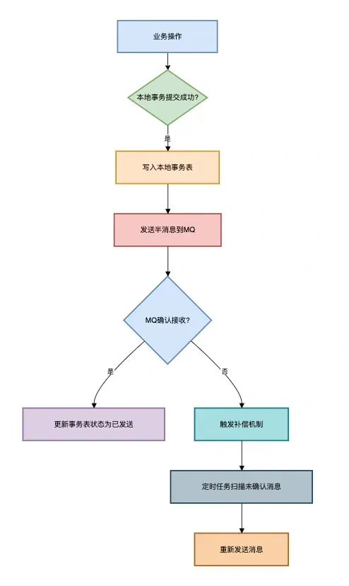
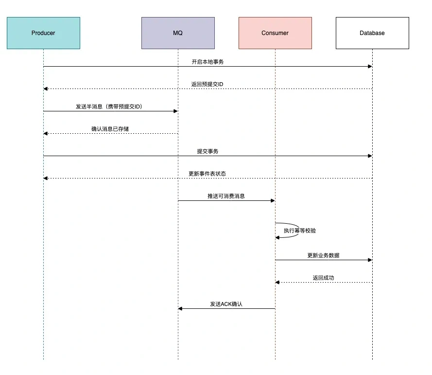

# MQ数据一致性问题

## **<font style="color:rgb(34, 34, 34);background-color:rgb(248, 246, 244);">前言</font>**
<font style="color:rgb(51, 51, 51);background-color:rgb(248, 246, 244);">上个月，我们有个电商系统出了个灵异事件：用户支付成功了，但订单状态死活不改成“已发货”。</font>

<font style="color:rgb(51, 51, 51);background-color:rgb(248, 246, 244);">折腾了半天才定位到问题：订单服务的MQ消息，像人间蒸发一样消失了。</font>

<font style="color:rgb(51, 51, 51);background-color:rgb(248, 246, 244);">这个Bug让我明白：（MQ）消息队列的数据一致性设计，绝对能排进分布式系统三大噩梦之一！</font>

<font style="color:rgb(51, 51, 51);background-color:rgb(248, 246, 244);">今天这篇文章跟大家一起聊聊，MQ如何保证数据一致性？希望对你会有所帮助。</font>

## **<font style="color:rgb(34, 34, 34);background-color:rgb(248, 246, 244);">1 数据一致性问题的原因</font>**
<font style="color:rgb(51, 51, 51);background-color:rgb(248, 246, 244);">这些年在Kafka、RabbitMQ、RocketMQ踩过的坑，总结成四类致命原因：</font>

1. **<font style="color:rgb(34, 34, 34);background-color:rgb(248, 246, 244);">生产者悲剧</font>**<font style="color:rgb(51, 51, 51);background-color:rgb(248, 246, 244);">：消息成功进Broker，却没写入磁盘就断电。</font>
2. **<font style="color:rgb(34, 34, 34);background-color:rgb(248, 246, 244);">消费者悲剧</font>**<font style="color:rgb(51, 51, 51);background-color:rgb(248, 246, 244);">：消息消费成功，但业务执行失败。</font>
3. **<font style="color:rgb(34, 34, 34);background-color:rgb(248, 246, 244);">轮盘赌局</font>**<font style="color:rgb(51, 51, 51);background-color:rgb(248, 246, 244);">：网络抖动导致消息重复投递。</font>
4. **<font style="color:rgb(34, 34, 34);background-color:rgb(248, 246, 244);">数据孤岛</font>**<font style="color:rgb(51, 51, 51);background-color:rgb(248, 246, 244);">：数据库和消息状态割裂（下完单没发券）</font>

<font style="color:rgb(51, 51, 51);background-color:rgb(248, 246, 244);">这些情况，都会导致MQ产生数据不一致的问题。</font>

<font style="color:rgb(51, 51, 51);background-color:rgb(248, 246, 244);">那么，如何解决这些问题呢？</font>

## **<font style="color:rgb(34, 34, 34);background-color:rgb(248, 246, 244);">2 消息不丢的方案</font>**
<font style="color:rgb(51, 51, 51);background-color:rgb(248, 246, 244);">我们首先需要解决消息丢失的问题。</font>

### **<font style="color:rgb(34, 34, 34);background-color:rgb(248, 246, 244);">2.1 事务消息的两阶段提交</font>**
<font style="color:rgb(51, 51, 51);background-color:rgb(248, 246, 244);">以RocketMQ的事务消息为例，工作原理就像双11的预售定金伪代码如下：</font>

```typescript
// 发送事务消息核心代码
TransactionMQProducer producer = new TransactionMQProducer("group");
producer.setTransactionListener(new TransactionListener() {
    // 执行本地事务（比如扣库存）
    public LocalTransactionState executeLocalTransaction(Message msg, Object arg) {
        return doBiz() ? LocalTransactionState.COMMIT : LocalTransactionState.ROLLBACK;
    }

    // Broker回调检查本地事务状态
    public LocalTransactionState checkLocalTransaction(MessageExt msg) {
        return checkDB(msg.getTransactionId()) ? COMMIT : ROLLBACK;
    }
});
```

<font style="color:rgb(51, 51, 51);background-color:rgb(248, 246, 244);">真实场景中，别忘了在checkLocalTransaction里做好妥协查询（查流水表或分布式事务日志）。</font>

<font style="color:rgb(51, 51, 51);background-color:rgb(248, 246, 244);">去年在物流系统救火，就遇到过事务超时的坑——本地事务成功了，但因网络问题没收到Commit，导致Broker不断回查。</font>

### **<font style="color:rgb(34, 34, 34);background-color:rgb(248, 246, 244);">2.2 持久化配置</font>**
<font style="color:rgb(51, 51, 51);background-color:rgb(248, 246, 244);">RabbitMQ的坑都在配置表里：</font>

**<font style="color:rgb(34, 34, 34);background-color:rgb(248, 246, 244);">配置项</font>**

**<font style="color:rgb(34, 34, 34);background-color:rgb(248, 246, 244);">例子</font>**

**<font style="color:rgb(34, 34, 34);background-color:rgb(248, 246, 244);">作用</font>**

<font style="color:rgb(51, 51, 51);background-color:rgb(248, 246, 244);">队列持久化</font>

<font style="color:rgb(51, 51, 51);background-color:rgb(248, 246, 244);">durable=true</font>

<font style="color:rgb(51, 51, 51);background-color:rgb(248, 246, 244);">队列元数据不丢</font>

<font style="color:rgb(51, 51, 51);background-color:rgb(248, 246, 244);">消息持久化</font>

<font style="color:rgb(51, 51, 51);background-color:rgb(248, 246, 244);">deliveryMode=2</font>

<font style="color:rgb(51, 51, 51);background-color:rgb(248, 246, 244);">消息存入磁盘</font>

<font style="color:rgb(51, 51, 51);background-color:rgb(248, 246, 244);">Lazy Queue</font>

<font style="color:rgb(51, 51, 51);background-color:rgb(248, 246, 244);">x-queue-mode=lazy</font>

<font style="color:rgb(51, 51, 51);background-color:rgb(248, 246, 244);">消息直接写盘不读取进内存</font>

<font style="color:rgb(51, 51, 51);background-color:rgb(248, 246, 244);">Confirm机制</font>

<font style="color:rgb(51, 51, 51);background-color:rgb(248, 246, 244);">publisher-confirm-type</font>

<font style="color:rgb(51, 51, 51);background-color:rgb(248, 246, 244);">生产者确认消息投递成功</font>

<font style="color:rgb(51, 51, 51);background-color:rgb(248, 246, 244);">RabbitMQ本地存储+备份交换机双重保护代码如下：</font>

```dart
channel.queueDeclare("order_queue", true, false, false, 
    new HashMap<String, Object>(){{
        put("x-dead-letter-exchange", "dlx_exchange"); // 死信交换机
    }});
```

<font style="color:rgb(51, 51, 51);background-color:rgb(248, 246, 244);">去年双十一订单系统就靠这个组合拳硬刚流量峰值：主队列消息积压触发阈值时，自动转移消息到备份队列给应急服务处理。</font>

### **<font style="color:rgb(34, 34, 34);background-color:rgb(248, 246, 244);">2.3 副本配置</font>**
**<font style="color:rgb(34, 34, 34);background-color:rgb(248, 246, 244);">消息队列</font>**

**<font style="color:rgb(34, 34, 34);background-color:rgb(248, 246, 244);">保命绝招</font>**

<font style="color:rgb(51, 51, 51);background-color:rgb(248, 246, 244);">Kafka</font>

<font style="color:rgb(51, 51, 51);background-color:rgb(248, 246, 244);">acks=all + 副本数≥3</font>

<font style="color:rgb(51, 51, 51);background-color:rgb(248, 246, 244);">RocketMQ</font>

<font style="color:rgb(51, 51, 51);background-color:rgb(248, 246, 244);">同步刷盘 + 主从同步策略</font>

<font style="color:rgb(51, 51, 51);background-color:rgb(248, 246, 244);">Pulsar</font>

<font style="color:rgb(51, 51, 51);background-color:rgb(248, 246, 244);">BookKeeper多副本存储</font>

<font style="color:rgb(51, 51, 51);background-color:rgb(248, 246, 244);">上周帮一个金融系统迁移到Kafka，为了数据安全启用了最高配置。</font>

<font style="color:rgb(51, 51, 51);background-color:rgb(248, 246, 244);">server.properties配置如下：</font>

```plain
acks=all
min.insync.replicas=2
unclean.leader.election.enable=false
```

<font style="color:rgb(51, 51, 51);background-color:rgb(248, 246, 244);">结果发现吞吐量只剩原来的三分之一，但客户说“钱比速度重要”——这一行哪有银弹，全是取舍。</font>

<font style="color:rgb(51, 51, 51);background-color:rgb(248, 246, 244);">不同的业务场景，情况不一样。</font>

## **<font style="color:rgb(34, 34, 34);background-color:rgb(248, 246, 244);">3 应对重复消费的方案</font>**
<font style="color:rgb(51, 51, 51);background-color:rgb(248, 246, 244);">接下来，需要解决消息的重复消费问题。</font>

### **<font style="color:rgb(34, 34, 34);background-color:rgb(248, 246, 244);">3.1 唯一ID</font>**
<font style="color:rgb(51, 51, 51);background-color:rgb(248, 246, 244);">订单系统的架构课代表代码：</font>

```plain
// 雪花算法生成全局唯一ID
Snowflake snowflake = new Snowflake(datacenterId, machineId);
String bizId = "ORDER_" + snowflake.nextId();

// 查重逻辑（Redis原子操作）
String key = "msg:" + bizId;
if(redis.setnx(key, "1")) {
    redis.expire(key, 72 * 3600);
    processMsg();
}
```

<font style="color:rgb(51, 51, 51);background-color:rgb(248, 246, 244);">先使用雪花算法生成全局唯一ID，然后使用Redis的setnx命令加分布式锁，来保证请求的唯一性。</font>

<font style="color:rgb(51, 51, 51);background-color:rgb(248, 246, 244);">某次促销活动因Redis集群抖动，导致重复扣款。</font>

<font style="color:rgb(51, 51, 51);background-color:rgb(248, 246, 244);">后来改用：本地布隆过滤器+分布式Redis 双校验，总算解决这个世纪难题。</font>

### **<font style="color:rgb(34, 34, 34);background-color:rgb(248, 246, 244);">3.2 幂等设计</font>**
<font style="color:rgb(51, 51, 51);background-color:rgb(248, 246, 244);">针对不同业务场景的三种对策：</font>

**<font style="color:rgb(34, 34, 34);background-color:rgb(248, 246, 244);">场景</font>**

**<font style="color:rgb(34, 34, 34);background-color:rgb(248, 246, 244);">代码示例</font>**

**<font style="color:rgb(34, 34, 34);background-color:rgb(248, 246, 244);">关键点</font>**

<font style="color:rgb(51, 51, 51);background-color:rgb(248, 246, 244);">强一致性</font>

<font style="color:rgb(51, 51, 51);background-color:rgb(248, 246, 244);">SELECT FOR UPDATE先查后更新</font>

<font style="color:rgb(51, 51, 51);background-color:rgb(248, 246, 244);">数据库行锁</font>

<font style="color:rgb(51, 51, 51);background-color:rgb(248, 246, 244);">最终一致性</font>

<font style="color:rgb(51, 51, 51);background-color:rgb(248, 246, 244);">版本号控制（类似CAS）</font>

<font style="color:rgb(51, 51, 51);background-color:rgb(248, 246, 244);">乐观锁重试3次</font>

<font style="color:rgb(51, 51, 51);background-color:rgb(248, 246, 244);">补偿型事务</font>

<font style="color:rgb(51, 51, 51);background-color:rgb(248, 246, 244);">设计反向操作（如退款、库存回滚）</font>

<font style="color:rgb(51, 51, 51);background-color:rgb(248, 246, 244);">操作日志必须落库</font>

<font style="color:rgb(51, 51, 51);background-color:rgb(248, 246, 244);">去年重构用户积分系统时，就靠着这个三板斧把错误率从0.1%降到了0.001%：</font>

<font style="color:rgb(51, 51, 51);background-color:rgb(248, 246, 244);">积分变更幂等示例如下：</font>

```plain
public void addPoints(String userId, String orderId, Long points) {
    if (pointLogDao.exists(orderId)) return;
    
    User user = userDao.selectForUpdate(userId); // 悲观锁
    user.setPoints(user.getPoints() + points);
    userDao.update(user);
    pointLogDao.insert(new PointLog(orderId)); // 幂等日志
}
```

<font style="color:rgb(51, 51, 51);background-color:rgb(248, 246, 244);">这里使用了数据库行锁实现的幂等性。</font>

### **<font style="color:rgb(34, 34, 34);background-color:rgb(248, 246, 244);">3.3 死信队列</font>**
<font style="color:rgb(51, 51, 51);background-color:rgb(248, 246, 244);">RabbitMQ的终极保命配置如下：</font>

```plain
// 消费者设置手动ACK
channel.basicConsume(queue, false, deliverCallback, cancelCallback);

// 达到重试上限后进入死信队列
public void process(Message msg) {
    try {
        doBiz();
        channel.basicAck(deliveryTag);
    } catch(Exception e) {
        if(retryCount < 3) {
            channel.basicNack(deliveryTag, false, true);
        } else {
            channel.basicNack(deliveryTag, false, false); // 进入DLX
        }
    }
}
```

<font style="color:rgb(51, 51, 51);background-color:rgb(248, 246, 244);">消费者端手动ACK消息。</font>

<font style="color:rgb(51, 51, 51);background-color:rgb(248, 246, 244);">在消费者端消费消息时，如果消费失败次数，达到重试上限后进入死信队列。</font>

<font style="color:rgb(51, 51, 51);background-color:rgb(248, 246, 244);">这个方案救了社交系统的推送服务——通过DLX收集全部异常消息，凌晨用补偿Job重跑。</font>

## **<font style="color:rgb(34, 34, 34);background-color:rgb(248, 246, 244);">4 系统架构设计</font>**
<font style="color:rgb(51, 51, 51);background-color:rgb(248, 246, 244);">接下来，从系统架构设计的角度，聊聊MQ要如何保证数据一致性？</font>

### **<font style="color:rgb(34, 34, 34);background-color:rgb(248, 246, 244);">4.1 生产者端</font>**
<font style="color:rgb(51, 51, 51);background-color:rgb(248, 246, 244);">对于实效性要求不太高的业务场景，可以使用：本地事务表+定时任务扫描的补偿方案。</font>

<font style="color:rgb(51, 51, 51);background-color:rgb(248, 246, 244);">流程图如下：</font>



### **<font style="color:rgb(34, 34, 34);background-color:rgb(248, 246, 244);">4.2 消费者端</font>**
<font style="color:rgb(51, 51, 51);background-color:rgb(248, 246, 244);">消费者端为了防止消息风暴，要设置合理的并发消费线程数。</font>

<font style="color:rgb(51, 51, 51);background-color:rgb(248, 246, 244);">流程图如下：</font>


### **<font style="color:rgb(34, 34, 34);background-color:rgb(248, 246, 244);">4.3 终极方案</font>**
<font style="color:rgb(51, 51, 51);background-color:rgb(248, 246, 244);">对于实时性要求比较高的业务场景，可以使用 事务消息+本地事件表 的黄金组合.</font>

<font style="color:rgb(51, 51, 51);background-color:rgb(248, 246, 244);">流程图如下：</font>



## **<font style="color:rgb(34, 34, 34);background-color:rgb(248, 246, 244);">5 血泪经验十条</font>**
1. **<font style="color:rgb(34, 34, 34);background-color:rgb(248, 246, 244);">消息必加唯一业务ID</font>**<font style="color:rgb(51, 51, 51);background-color:rgb(248, 246, 244);">（别用MQ自带的ID）</font>
2. **<font style="color:rgb(34, 34, 34);background-color:rgb(248, 246, 244);">消费逻辑一定要幂等</font>**<font style="color:rgb(51, 51, 51);background-color:rgb(248, 246, 244);">（重复消费是必然事件）</font>
3. **<font style="color:rgb(34, 34, 34);background-color:rgb(248, 246, 244);">数据库事务和消息发送必须二选一</font>**<font style="color:rgb(51, 51, 51);background-color:rgb(248, 246, 244);">（或者用事务消息）</font>
4. **<font style="color:rgb(34, 34, 34);background-color:rgb(248, 246, 244);">消费者线程数不要超过分区数*2</font>**<font style="color:rgb(51, 51, 51);background-color:rgb(248, 246, 244);">（Kafka的教训）</font>
5. **<font style="color:rgb(34, 34, 34);background-color:rgb(248, 246, 244);">死信队列必须加监控报警</font>**<font style="color:rgb(51, 51, 51);background-color:rgb(248, 246, 244);">（别等客服找你）</font>
6. **<font style="color:rgb(34, 34, 34);background-color:rgb(248, 246, 244);">测试环境一定要模拟网络抖动</font>**<font style="color:rgb(51, 51, 51);background-color:rgb(248, 246, 244);">（chaos engineering）</font>
7. **<font style="color:rgb(34, 34, 34);background-color:rgb(248, 246, 244);">消息体要兼容版本号</font>**<font style="color:rgb(51, 51, 51);background-color:rgb(248, 246, 244);">（血的教训警告）</font>
8. **<font style="color:rgb(34, 34, 34);background-color:rgb(248, 246, 244);">不要用消息队列做业务主流程</font>**<font style="color:rgb(51, 51, 51);background-color:rgb(248, 246, 244);">（它只配当辅助）</font>
9. **<font style="color:rgb(34, 34, 34);background-color:rgb(248, 246, 244);">消费者offset定时存库</font>**<font style="color:rgb(51, 51, 51);background-color:rgb(248, 246, 244);">（防止重平衡丢消息）</font>
10. **<font style="color:rgb(34, 34, 34);background-color:rgb(248, 246, 244);">业务指标和MQ监控要联动</font>**<font style="color:rgb(51, 51, 51);background-color:rgb(248, 246, 244);">（比如订单量和消息量的波动要同步）</font>

## **<font style="color:rgb(34, 34, 34);background-color:rgb(248, 246, 244);">总结</font>**
<font style="color:rgb(51, 51, 51);background-color:rgb(248, 246, 244);">（MQ）消息队列像金融系统的SWIFT结算网络，看似简单实则处处杀机。</font>

<font style="color:rgb(51, 51, 51);background-color:rgb(248, 246, 244);">真正的高手不仅要会调参，更要设计出能兼容</font>**<font style="color:rgb(34, 34, 34);background-color:rgb(248, 246, 244);">可靠性</font>**<font style="color:rgb(51, 51, 51);background-color:rgb(248, 246, 244);">与</font>**<font style="color:rgb(34, 34, 34);background-color:rgb(248, 246, 244);">性能</font>**<font style="color:rgb(51, 51, 51);background-color:rgb(248, 246, 244);">的架构。</font>

<font style="color:rgb(51, 51, 51);background-color:rgb(248, 246, 244);">记住，分布式系统的数据一致性不是银弹，而是通过层层防御达成的动态平衡。</font>

<font style="color:rgb(51, 51, 51);background-color:rgb(248, 246, 244);">就像当年我在做资金结算系统时，老板说的那句震耳发聩的话：</font>**<font style="color:rgb(34, 34, 34);background-color:rgb(248, 246, 244);">“宁可慢十秒，不可错一分”</font>**<font style="color:rgb(51, 51, 51);background-color:rgb(248, 246, 244);">。</font>


> 更新: 2025-05-15 19:54:03  
> 原文: <https://www.yuque.com/yuqueyonghue6cvnv/cxhfwd/unfp2g0y1ex0t0d6>