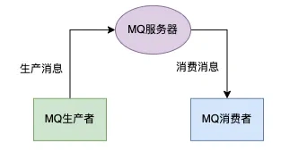
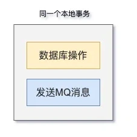
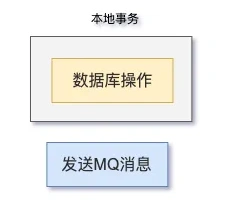
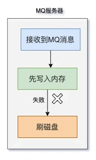
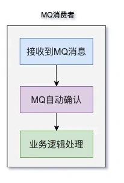
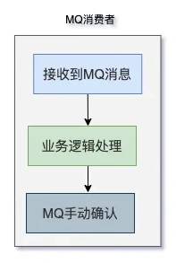
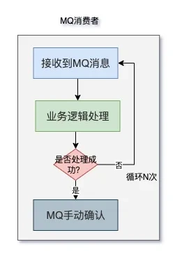
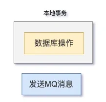
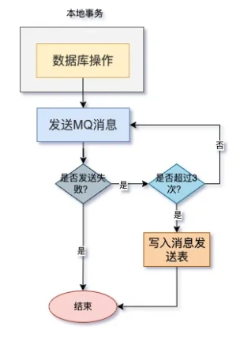
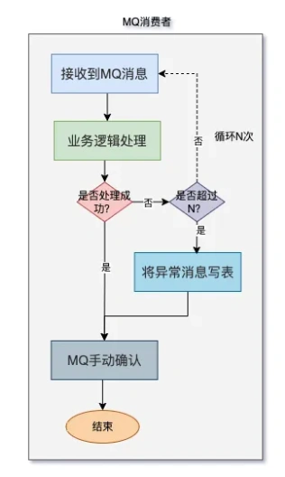

# MQ消息丢失问题-

## **前言**
MQ作为消息中间件，我们无论在面试中，还是在实际工作中，都经常会遇到。

MQ给我们带来了许多好处，比如：异步、解耦、肖峰填谷。

但也带来了一些问题，比如：消息丢失问题、消息重复消费问题、消息顺序问题等。

今天我们先聊聊MQ消息丢失问题，其他的问题，后面会有专题介绍，敬请期待。

## **1 MQ整体架构**
目前市面上常用的MQ有很多，比如：kafka、RocketMQ、RabbitMQ、ActiveMQ、ZeroMQ等等。

但这些MQ的整体架构是差不多的。

下面用一张图概况一下：

MQ的整体架构中，需要3种角色：

1. MQ生产者：负责生成MQ消息。
2. MQ服务器：负责保存MQ消息。
3. MQ消费者：负责消费MQ消息。

在一个完整的MQ业务场景中，这3种角色缺一不可。

## **2 哪些情况会丢MQ消息？**
那么，哪些情况下会丢MQ消息呢？

我们接下来，一起讨论一下这个问题。

其实，MQ的3个角色，任意一个角色出问题，都会导致丢MQ消息的情况。

### **2.1 MQ生产者**
我们MQ生产者的业务方法中，在处理事务和消息的时候，一般有两种方案：

1. 数据库操作和MQ发送功能放在同一个本地事务中。

数据库操作放在同一个本地事务中，MQ发送功能放在事务之外。

2. 

方案1的优点是：如果数据库操作成功了，但MQ消息发送失败，整个事务可以回滚，可以保证业务完整性。

但方案1的缺点是：可能会导致大事务问题，特别是如果发生MQ消息比较耗时的时候，会导致这个本地事务要花很长时间，才能提交，性能系统的性能。

对于一些低并发的系统，可以采用方案1，但对于高并发的系统，很少用方案1的。

方案2的优点是：可以提升系统的性能，本地事务的提交，不依赖于MQ的消息发送。

但方案2的缺点是：如果数据库操作成功，就可以提交事务，但如果此时MQ发生失败了，事务不会回滚。

这种情况下，会丢失MQ消息。

### **2.2 MQ服务器**
我们的MQ服务器是负责保存MQ消息的。

目前保存的方式有3种：

1. 数据库：比如ActiveMQ。
2. 服务器内存。
3. 服务器磁盘文件中。

如果MQ生产者发生MQ消息成功了，但此时MQ服务器在保存MQ消息时失败了，比如磁盘空间满了。

或者MQ服务器down机。

或者异步刷盘机制，把MQ消息从内存中，刷数据到磁盘失败了。 都可能会导致MQ消息的丢失。

### **2.3 MQ消费者**
我们的MQ消费者负责消费MQ消息。

目前有两种ACK（确认机制）方法：

1. 自动确认
2. 手动确认

Kafka的消息消费者，默认是自动确认。

也就是说，如果Kafka的消息消费者收到消息之后，自动向Kafka服务器确认消息已经收到了，offset会加1。

然后Kafka消息消费者，做业务逻辑处理。

此时，如果业务逻辑处理失败了，则这条消息会丢失。

所以对于kafka的消息消费者，很多情况下，我们需要改成消息的手动确认。

可以修改配置实现，比如：spring.kafka.listener.ack-mode = manual 设置为手动。

于是，流程改成这样的：Kafka消息消费者在接受到消息之后，不急着确认消息，先做业务逻辑处理，处理完成之后，再在代码中手动确认消息已经收到。

但这样也带来了一个新的问题：如果业务逻辑一直都处理失败，这条消息就一直都不确认收到？

很显然不是。

很多时候，我们会设置一个失败重试的次数，超过这个次数，则消息这条消息有可能会丢失。

## **3 如何保证消息不丢失？**
竟然有这么多的场景，会导致MQ丢消息，那么，我们该如何保证消息不丢失呢？

我们要对MQ生产者、MQ服务器和MQ消费者，3种角色都做处理才能解决问题。

### **3.1 MQ生产者**
MQ生产者的业务逻辑中，数据库操作和发生MQ消息不在同一个本地事务中。

如果数据库操作成功了，但发生MQ消息失败了，事务不会回滚，这样可能会导致MQ消息的丢失。

为了解决这个问题，我们可以增加发送MQ消息的失败自动重试机制。

如上图所示，发送MQ消息失败之后，在程序中自动重试3次。

如果重试成功，则直接返回。

如果重试3次之后，还是失败。则将MQ写入一张消息发送表，然后返回。

后面有需要可以人工介入，手动发送MQ。

### **3.2 MQ服务器**
MQ服务端丢失消息的情况有很多。

我们以RocketMQ为例，目前刷盘机制有两种，分别是：

1. 同步刷盘
2. 异步刷盘

异步刷盘：只把数据刷到PageCache，再由另外的线程，将数据数据从PageCache刷到磁盘中。

这种异步刷盘的方式，虽说吞吐量和性能⾼，但容易丢失数据。

同步刷盘：把数据刷到磁盘中才算完成，性能低，但安全比较高。

如果怕出现MQ消息丢失的问题，可以使用同步刷盘的机制。

此外，为了防止机器突然down机，导致MQ消息的丢失。

我们的MQ服务器一定不要部署单个节点，要使用多个副本。

如果其中一个机器down机了，副本中还有完整的数据，不会导致数据丢失。

## **3.3 MQ消费者**
MQ消费者如果处理消息不当，也有可能会导致消息丢失。

之前说过，MQ消费者中，自动确认消息，可能会导致消息丢失。

建议改成手动确认。

但手动确认，如果消息一直都消费失败，也有可能会丢失消息。

我们可以这样做：

MQ消费者在处理消息时，如果处理成功，则手动确认之后直接结束。

MQ消费者在处理消息时，如果处理失败，则会自动发起重试功能。

如果重试的次数，没有达到指定次数N，则会重新消费那条消息。

如果超过了次数N，则将异常消息写入一张表，然后手动确认，后续可以人工介入，手动处理那张表中的消息。

需要注意的地方是：MQ消费者中要做好幂等性处理，即使消费了重复的消息，对业务逻辑也不会有影响。

> 更新: 2024-07-19 23:46:02  
> 原文: <https://www.yuque.com/yuqueyonghue6cvnv/cxhfwd/fr6hv63tqf3m5p1g>