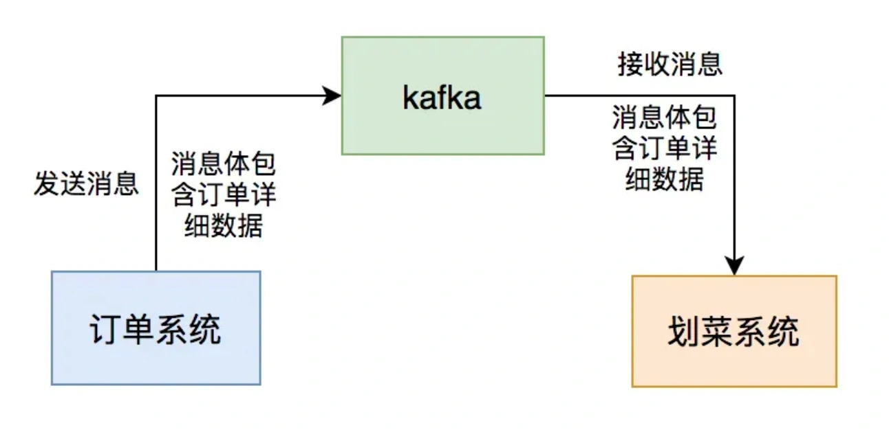

# MQ消息积压问题

## **<font style="color:rgb(34, 34, 34);background-color:rgb(248, 246, 244);">前言</font>**
<font style="color:rgb(51, 51, 51);background-color:rgb(248, 246, 244);">我之前在一家餐饮公司待过两年，每天中午和晚上用餐高峰期，系统的并发量不容小觑。为了保险起见，公司规定各部门都要在吃饭的时间轮流值班，防止出现线上问题时能够及时处理。</font>

<font style="color:rgb(51, 51, 51);background-color:rgb(248, 246, 244);">我当时在后厨显示系统团队，该系统属于订单的下游业务。</font>

<font style="color:rgb(51, 51, 51);background-color:rgb(248, 246, 244);">用户点完菜下单后，订单系统会通过发kafka消息给我们系统，系统读取消息后，做业务逻辑处理，持久化订单和菜品数据，然后展示到划菜客户端。</font>

<font style="color:rgb(51, 51, 51);background-color:rgb(248, 246, 244);">这样厨师就知道哪个订单要做哪些菜，有些菜做好了，就可以通过该系统出菜。系统自动通知服务员上菜，如果服务员上完菜，修改菜品上菜状态，用户就知道哪些菜已经上了，哪些还没有上。这个系统可以大大提高后厨到用户的效率。</font>



<font style="color:rgb(51, 51, 51);background-color:rgb(248, 246, 244);">这一切的关键是消息中间件：kafka，如果它出现问题，将会直接影响到后厨显示系统的用户功能使用。</font>

<font style="color:rgb(51, 51, 51);background-color:rgb(248, 246, 244);">这篇文章跟大家一起聊聊，我们当时出现过的消息积压问题，希望对你会有所帮助。</font>

## **<font style="color:rgb(34, 34, 34);background-color:rgb(248, 246, 244);">1 第一次消息积压</font>**
<font style="color:rgb(51, 51, 51);background-color:rgb(248, 246, 244);">刚开始我们的用户量比较少，上线一段时间，mq的消息通信都没啥问题。</font>

<font style="color:rgb(51, 51, 51);background-color:rgb(248, 246, 244);">随着用户量逐步增多，每个商家每天都会产生大量的订单数据，每个订单都有多个菜品，这样导致我们划菜系统的划菜表的数据越来越多。</font>

<font style="color:rgb(51, 51, 51);background-color:rgb(248, 246, 244);">在某一天中午，收到商家投诉说用户下单之后，在平板上出现的菜品列表有延迟。</font>

<font style="color:rgb(51, 51, 51);background-color:rgb(248, 246, 244);">厨房几分钟之后才能看到菜品。</font>

<font style="color:rgb(51, 51, 51);background-color:rgb(248, 246, 244);">我们马上开始查原因。</font>

<font style="color:rgb(51, 51, 51);background-color:rgb(248, 246, 244);">出现这种菜品延迟的问题，必定跟kafka有关，因此，我们先查看kafka。</font>

<font style="color:rgb(51, 51, 51);background-color:rgb(248, 246, 244);">果然出现了消息积压。</font>

<font style="color:rgb(51, 51, 51);background-color:rgb(248, 246, 244);">通常情况下，出现消息积压的原因有：</font>

1. <font style="color:rgb(51, 51, 51);background-color:rgb(248, 246, 244);">mq消费者挂了。</font>
2. <font style="color:rgb(51, 51, 51);background-color:rgb(248, 246, 244);">mq生产者生产消息的速度，大于mq消费者消费消息的速度。</font>

<font style="color:rgb(51, 51, 51);background-color:rgb(248, 246, 244);">我查了一下监控，发现我们的mq消费者，服务在正常运行，没有异常。</font>

<font style="color:rgb(51, 51, 51);background-color:rgb(248, 246, 244);">剩下的原因可能是：mq消费者消费消息的速度变慢了。</font>

<font style="color:rgb(51, 51, 51);background-color:rgb(248, 246, 244);">接下来，我查了一下划菜表，目前不太多只有几十万的数据。</font>

<font style="color:rgb(51, 51, 51);background-color:rgb(248, 246, 244);">看来需要优化mq消费者的处理逻辑了。</font>

<font style="color:rgb(51, 51, 51);background-color:rgb(248, 246, 244);">我在代码中增加了一些日志，把mq消息者中各个关键节点的耗时都打印出来了。</font>

<font style="color:rgb(51, 51, 51);background-color:rgb(248, 246, 244);">发现有两个地方耗时比较长：</font>

1. <font style="color:rgb(51, 51, 51);background-color:rgb(248, 246, 244);">有个代码是一个for循环中，一个个查询数据库处理数据的。</font>
2. <font style="color:rgb(51, 51, 51);background-color:rgb(248, 246, 244);">有个多条件查询数据的代码。</font>

<font style="color:rgb(51, 51, 51);background-color:rgb(248, 246, 244);">于是，我做了有针对性的优化。</font>

<font style="color:rgb(51, 51, 51);background-color:rgb(248, 246, 244);">将在for循环中一个个查询数据库的代码，改成通过参数集合，批量查询数据。</font>

<font style="color:rgb(51, 51, 51);background-color:rgb(248, 246, 244);">有时候，我们需要从指定的用户集合中，查询出有哪些是在数据库中已经存在的。</font>

<font style="color:rgb(51, 51, 51);background-color:rgb(248, 246, 244);">实现代码可以这样写：</font>

```plain
public List<User> queryUser(List<User> searchList) {
    if (CollectionUtils.isEmpty(searchList)) {
        return Collections.emptyList();
    }

    List<User> result = Lists.newArrayList();
    searchList.forEach(user -> result.add(userMapper.getUserById(user.getId())));
    return result;
}
```

<font style="color:rgb(51, 51, 51);background-color:rgb(248, 246, 244);">这里如果有50个用户，则需要循环50次，去查询数据库。我们都知道，每查询一次数据库，就是一次远程调用。</font>

<font style="color:rgb(51, 51, 51);background-color:rgb(248, 246, 244);">如果查询50次数据库，就有50次远程调用，这是非常耗时的操作。</font>

<font style="color:rgb(51, 51, 51);background-color:rgb(248, 246, 244);">那么，我们如何优化呢？</font>

<font style="color:rgb(51, 51, 51);background-color:rgb(248, 246, 244);">具体代码如下：</font>

```plain
public List<User> queryUser(List<User> searchList) {
    if (CollectionUtils.isEmpty(searchList)) {
        return Collections.emptyList();
    }
    List<Long> ids = searchList.stream().map(User::getId).collect(Collectors.toList());
    return userMapper.getUserByIds(ids);
}
```

<font style="color:rgb(51, 51, 51);background-color:rgb(248, 246, 244);">提供一个根据用户id集合批量查询用户的接口，只远程调用一次，就能查询出所有的数据。</font>

<font style="color:rgb(51, 51, 51);background-color:rgb(248, 246, 244);">多条件查询数据的地方，增加了一个联合索引，解决了问题。</font>

<font style="color:rgb(51, 51, 51);background-color:rgb(248, 246, 244);">这样优化之后， mq消费者处理消息的速度提升了很多，消息积压问题被解决了。</font>

## **<font style="color:rgb(34, 34, 34);background-color:rgb(248, 246, 244);">2 第二次消息积压</font>**
<font style="color:rgb(51, 51, 51);background-color:rgb(248, 246, 244);">没想到，过了几个月之后，又开始出现消息积压的问题了。</font>

<font style="color:rgb(51, 51, 51);background-color:rgb(248, 246, 244);">但这次是偶尔会积压，大部分情况不会。</font>

<font style="color:rgb(51, 51, 51);background-color:rgb(248, 246, 244);">这几天消息的积压时间不长，对用户影响比较小，没有引起商家的投诉。</font>

<font style="color:rgb(51, 51, 51);background-color:rgb(248, 246, 244);">我查了一下划菜表的数据只有几百万。</font>

<font style="color:rgb(51, 51, 51);background-color:rgb(248, 246, 244);">但通过一些监控，和DBA每天发的慢查询邮件，自己发现了异常。</font>

<font style="color:rgb(51, 51, 51);background-color:rgb(248, 246, 244);">我发现有些sql语句，执行的where条件是一模一样的，只有条件后面的参数值不一样，导致该sql语句走的索引不一样。</font>

<font style="color:rgb(51, 51, 51);background-color:rgb(248, 246, 244);">比如：order_id=123走了索引a，而order_id=124走了索引b。</font>

<font style="color:rgb(51, 51, 51);background-color:rgb(248, 246, 244);">有张表查询的场景有很多，当时为了满足不同业务场景，加了多个联合索引。</font>

<font style="color:rgb(51, 51, 51);background-color:rgb(248, 246, 244);">MySQL会根据下面几个因素选择索引：</font>

1. <font style="color:rgb(51, 51, 51);background-color:rgb(248, 246, 244);">通过采样数据来估算需要扫描的行数，如果扫描的行数多那可能io次数会更多，对cpu的消耗也更大。</font>
2. <font style="color:rgb(51, 51, 51);background-color:rgb(248, 246, 244);">是否会使用临时表，如果使用临时表也会影响查询速度；</font>
3. <font style="color:rgb(51, 51, 51);background-color:rgb(248, 246, 244);">是否需要排序，如果需要排序则也会影响查询速度。</font>

<font style="color:rgb(51, 51, 51);background-color:rgb(248, 246, 244);">综合1、2、3以及其它的一些因素，MySql优化器会选出它自己认为最合适的索引。</font>

<font style="color:rgb(51, 51, 51);background-color:rgb(248, 246, 244);">MySQL优化器是通过采样来预估要扫描的行数的，所谓采样就是选择一些数据页来进行统计预估，这个会有一定的误差。</font>

<font style="color:rgb(51, 51, 51);background-color:rgb(248, 246, 244);">由于MVCC会有多个版本的数据页，比如删除一些数据，但是这些数据由于还在其它的事务中可能会被看到，索引不是真正的删除，这种情况也会导致统计不准确，从而影响优化器的判断。</font>

<font style="color:rgb(51, 51, 51);background-color:rgb(248, 246, 244);">上面这两个原因导致MySQL在执行SQL语句时，会选错索引。</font>

<font style="color:rgb(51, 51, 51);background-color:rgb(248, 246, 244);">明明使用索引a的时候，执行效率更高，但实际情况却使用了索引b。</font>

<font style="color:rgb(51, 51, 51);background-color:rgb(248, 246, 244);">为了解决MySQL选错索引的问题，我们使用了关键字force index，来强制查询sql走索引a。</font>

<font style="color:rgb(51, 51, 51);background-color:rgb(248, 246, 244);">这样优化之后，这次小范围的消息积压问题被解决了。</font>

## **<font style="color:rgb(34, 34, 34);background-color:rgb(248, 246, 244);">3 第三次消息积压</font>**
<font style="color:rgb(51, 51, 51);background-color:rgb(248, 246, 244);">过了半年之后，在某个晚上6点多钟。</font>

<font style="color:rgb(51, 51, 51);background-color:rgb(248, 246, 244);">有几个商家投诉过来，说划菜系统有延迟，下单之后，几分钟才能看到菜品。</font>

<font style="color:rgb(51, 51, 51);background-color:rgb(248, 246, 244);">我查看了一下监控，发现kafka消息又出现了积压的情况。</font>

<font style="color:rgb(51, 51, 51);background-color:rgb(248, 246, 244);">查了一下MySQL的索引，该走的索引都走了，但数据查询还是有些慢。</font>

<font style="color:rgb(51, 51, 51);background-color:rgb(248, 246, 244);">此时，我再次查了一下划菜表，惊奇的发现，短短半年表中有3千万的数据了。</font>

<font style="color:rgb(51, 51, 51);background-color:rgb(248, 246, 244);">通常情况下，单表的数据太多，无论是查询，还是写入的性能，都会下降。</font>

<font style="color:rgb(51, 51, 51);background-color:rgb(248, 246, 244);">这次出现查询慢的原因是数据太多了。</font>

<font style="color:rgb(51, 51, 51);background-color:rgb(248, 246, 244);">为了解决这个问题，我们必须：</font>

1. <font style="color:rgb(51, 51, 51);background-color:rgb(248, 246, 244);">做分库分表</font>
2. <font style="color:rgb(51, 51, 51);background-color:rgb(248, 246, 244);">将历史数据备份</font>

<font style="color:rgb(51, 51, 51);background-color:rgb(248, 246, 244);">由于现阶段做分库分表的代价太大了，我们的商户数量还没有走到这一步。</font>

<font style="color:rgb(51, 51, 51);background-color:rgb(248, 246, 244);">因此，我们当时果断选择了将历史数据做备份的方案。</font>

<font style="color:rgb(51, 51, 51);background-color:rgb(248, 246, 244);">当时我跟产品和DBA讨论了一下，划菜表只保留最近30天的数据，超过几天的数据写入到历史表中。</font>

<font style="color:rgb(51, 51, 51);background-color:rgb(248, 246, 244);">这样优化之后，划菜表30天只会产生几百万的数据，对性能影响不大。</font>

<font style="color:rgb(51, 51, 51);background-color:rgb(248, 246, 244);">消息积压的问题被解决了。</font>

## **<font style="color:rgb(34, 34, 34);background-color:rgb(248, 246, 244);">4 第四次消息积压</font>**
<font style="color:rgb(51, 51, 51);background-color:rgb(248, 246, 244);">通过上面这几次优化之后，很长一段时间，系统都没有出现消息积压的问题。</font>

<font style="color:rgb(51, 51, 51);background-color:rgb(248, 246, 244);">但在一年之后的某一天下午，又有一些商家投诉过来了。</font>

<font style="color:rgb(51, 51, 51);background-color:rgb(248, 246, 244);">此时，我查看公司邮箱，发现kafka消息积压的监控报警邮件一大堆。</font>

<font style="color:rgb(51, 51, 51);background-color:rgb(248, 246, 244);">但由于刚刚一直在开会，没有看到。</font>

<font style="color:rgb(51, 51, 51);background-color:rgb(248, 246, 244);">这次的时间点就有些特殊。</font>

<font style="color:rgb(51, 51, 51);background-color:rgb(248, 246, 244);">一般情况下，并发量大的时候，是中午或者晚上的用餐高峰期，而这次出现消息积压问题的时间是下午。</font>

<font style="color:rgb(51, 51, 51);background-color:rgb(248, 246, 244);">这就有点奇怪了。</font>

<font style="color:rgb(51, 51, 51);background-color:rgb(248, 246, 244);">刚开始查询这个问题一点头绪都没有。</font>

<font style="color:rgb(51, 51, 51);background-color:rgb(248, 246, 244);">我问了一下订单组的同事，下午有没有发版，或者执行什么功能？</font>

<font style="color:rgb(51, 51, 51);background-color:rgb(248, 246, 244);">因为我们的划菜系统，是他们的下游系统，跟他们有直接的关系。</font>

<font style="color:rgb(51, 51, 51);background-color:rgb(248, 246, 244);">某位同事说，他们半小时之前，执行了一个批量修改订单状态的job，一次性修改了几万个订单的状态。</font>

<font style="color:rgb(51, 51, 51);background-color:rgb(248, 246, 244);">而修改了订单状态，会自动发送mq消息。</font>

<font style="color:rgb(51, 51, 51);background-color:rgb(248, 246, 244);">这样导致，他们的程序在极短的时间内，产生了大量的mq消息。</font>

<font style="color:rgb(51, 51, 51);background-color:rgb(248, 246, 244);">而我们的mq消费者根本无法处理这些消息，所以才会产生消息积压的问题。</font>

<font style="color:rgb(51, 51, 51);background-color:rgb(248, 246, 244);">我们当时一起查了kafka消息的积压情况，发现当时积压了几十万条消息。</font>

<font style="color:rgb(51, 51, 51);background-color:rgb(248, 246, 244);">要想快速提升mq消费者的处理速度，我们当时想到了两个方案：</font>

1. <font style="color:rgb(51, 51, 51);background-color:rgb(248, 246, 244);">增加partion数量。</font>
2. <font style="color:rgb(51, 51, 51);background-color:rgb(248, 246, 244);">使用线程池处理消息。</font>

<font style="color:rgb(51, 51, 51);background-color:rgb(248, 246, 244);">但考虑到，当时消息已经积压到几个已有的partion中了，再新增partion意义不大。</font>

<font style="color:rgb(51, 51, 51);background-color:rgb(248, 246, 244);">于是，我们只能改造代码，使用线程池处理消息了。</font>

<font style="color:rgb(51, 51, 51);background-color:rgb(248, 246, 244);">为了开始消费积压的消息，我们将线程池的核心线程和最大线程数量调大到了50。</font>

<font style="color:rgb(51, 51, 51);background-color:rgb(248, 246, 244);">这两个参数是可以动态配置的。</font>

<font style="color:rgb(51, 51, 51);background-color:rgb(248, 246, 244);">这样调整之后，积压了几十万的mq消息，在20分钟左右被消费完了。</font>

<font style="color:rgb(51, 51, 51);background-color:rgb(248, 246, 244);">这次突然产生的消息积压问题被解决了。</font>

<font style="color:rgb(51, 51, 51);background-color:rgb(248, 246, 244);">解决完这次的问题之后，我们还是保留的线程池消费消息的逻辑，将核心线程数调到8，最大线程数调到10。</font>

<font style="color:rgb(51, 51, 51);background-color:rgb(248, 246, 244);">当后面出现消息积压问题，可以及时通过调整线程数量，先临时解决问题，而不会对用户造成太大的影响。</font>

<font style="color:rgb(100, 100, 100);background-color:rgb(248, 246, 244);">注意：使用线程池消费mq消息不是万能的。该方案也有一些弊端，它有消息顺序的问题，也可能会导致服务器的CPU使用率飙升。此外，如果在多线程中调用了第三方接口，可能会导致该第三方接口的压力太大，而直接挂掉。</font>

<font style="color:rgb(51, 51, 51);background-color:rgb(248, 246, 244);">总之，MQ的消息积压问题，不是一个简单的问题。</font>

<font style="color:rgb(51, 51, 51);background-color:rgb(248, 246, 244);">虽说产生的根本原因是：MQ生产者生产消息的速度，大于MQ消费者消费消息的速度，但产生的具体原因有多种。</font>

<font style="color:rgb(51, 51, 51);background-color:rgb(248, 246, 244);">我们在实际工作中，需要针对不同的业务场景，做不同的优化。</font>

<font style="color:rgb(51, 51, 51);background-color:rgb(248, 246, 244);">我们需要对MQ队列中的消息积压情况，进行监控和预警，至少能够及时发现问题。</font>

<font style="color:rgb(51, 51, 51);background-color:rgb(248, 246, 244);">没有最好的方案，只有最合适当前业务场景的方案。</font>


> 更新: 2024-05-24 10:27:36  
> 原文: <https://www.yuque.com/yuqueyonghue6cvnv/cxhfwd/rlrgg0ragu9rz5py>