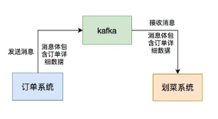
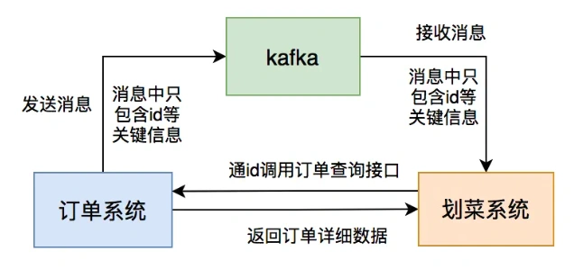

# MQ顺序消费问题-

## **前言**
我之前在一家从事餐饮行业的公司待过两年，当时使用了两年的消息中间件。

最开始使用activeMQ，后面改成了rabbitMQ，再后来改成了kafka。

当时的RocketMQ并不流行，kafka的性能是非常好的。

其实这些消息中间件的思想都差不多。

我们的划菜系统是订单的下游系统。

用户下单或者有订单的状态修改，订单系统都会给我们发生mq消息，我们系统接收到消息之后，做业务逻辑处理。

今天这篇文章，跟大家一起聊聊，我们当时遇到过的消息顺序问题，希望对你会有所帮助。

## **1 最初设计**
刚开始的时候，用户不多，订单系统每天产生的数据非常少。

我们刚开始设计的方案是这样的：

设计的很简单。

只需要将订单的数据，通过mq推送给划菜系统即可。

划菜系统使用单线程消费消息。

为了保险起见，我们的划菜系统，当时部署了两个节点。

如果生产者不做任何处理，会有消息顺序的问题。

因此，我们跟订单系统的人商量了一下，他们在发送消息的时候要保证顺序。

怎么保证呢？

答：订单系统发生产MQ消息时，同一个订单号的消息，发送到同一个partition中，在topic中配置两个partition。

同时，我们的划菜系统在处理MQ消息时，正好两个节点，一个节点消费一个partition中的消息。

这样的话，就能保证顺序了。

按照这个时间，我们的系统顺利上线了。

## **2 第一次出现问题**
当时我们公司的网络不太稳定，偶尔会掉线。

于是产生了下面的问题：

大部分mq消息消费成功，少部分mq消息消费失败了。

我们刚开始，失败的mq消息是没有保存到数据库中的。

这样导致有部分mq消息丢失，出现了消息的顺序问题。

你想想：当时用户A下单的消息没有，直接来了一个支付的消息。

这肯定是有问题的。

那么，如何解决这个问题呢？

## **3 失败自动重试**
为了解决mq消费消息时，出现了失败的情况，导致部分消息丢失，而影响消息顺序的问题。

我们引入了失败自动重试机制。

但是失败了，也不可能一直重试，否则其他的消息，根本没办法消费了。

我们在失败重试时，要指定次数。

一旦指定了次数，如果重试时，没有超过这个次数还好。

如果一旦超过这个次数，这条消息如何处理呢？

是丢掉，还是落库？

丢掉显然是不行的。

如果要落库的话，同一个订单的其他的消息怎么办？也要落库吗？

这就引出了一个更复杂的问题：

同一个订单，如果有多条mq消息，一旦前面的mq消息消费失败了，后面的消息都不能消费，否则就破坏了消息的顺序。

如何解决这个问题呢？

## **4 先落库**
我们改变了思路，决定在mq的消费者中，在获取到消息之后，处理业务逻辑之前，先把所有的mq消息直接落库。

建了一张专门的订单消息表。

然后使用elastic-job，每个几秒获取10条消息做业务处理。

每次只获取10条消息，其实相当于实现了分页查询的功能。

这里又带来了一个新问题：如果上一次job执行的过程中，查询到了订单A的mq消息，花了几秒，还没执行完。

新的一次job执行时，又将订单A后面的mq消息，先执行了。

不又产生了消息的顺序问题？

如何解决这个问题呢？

方案1：将job执行的间隔调大一点，不就OK了？

但该方案带来了一个新的mq消息消费不及时。

一旦job的执行间隔调大，会导致业务系统的处理会有延迟，在业务上不允许。

方案2：在执行业务消息时，给订单号加一个Redis分布式锁。

能够获取到Redis分布式锁，就可以执行，否则，就在下一次job中重试。

这样就能解决job分页查询中，订单A后面的mq消息先执行的问题。

订单A后面的消息，在第二次执行job的过程中，因为第一次job中的分布式锁还没释放，第二次订单A是没有办法执行的。

这样就解决了这个问题。

## **5 又有一个新问题**
上面的方案看似没有问题，但也有一个新问题：同一个订单，前面的mq消息消费失败了，如何保证后面的mq消息不能执行？

方案1：用一个状态字段做标记，如果同一个订单前面的订单消息消费失败了，标记为失败，则要将同一个订单该消息，之后的所有消息的状态，都改成暂停执行。

但在处理过程中，有同一个订单新的消息插入怎么办？

新插入的消息，状态不变成了待执行？

很显然这种情况是不被允许的。

此时，在插入数据之前，加一个分布式锁，就可以解决问题。

但这样会影响插入mq消息的速度。

方案2：每次消费mq消息之后，都判断一下，同一个订单的mq消息，有没有执行失败的，如果有则不执行。

如果消费失败的消息比较多，可能会查询出非常多的无效数据，浪费服务器的资源。

很显然，如果想严格保证mq的顺序，是非常难的。

会带来一个接着一个的问题。

## **6 重新设计**
我们重新思考了一下。

我们的业务场景，一定要保证mq的顺序吗？

中间状态，对我们的划菜系统意义不大。

我们只需要知道最终的结果就可以了。

于是，我们重新设计了一些mq的通信方式。

订单系统发生的MQ消息中，只包含订单id，不包含详细的数据。

划菜系统消费MQ消息之后，通过订单id，调用订单详情查询接口，可以查询出订单的详细数据。

而此时查询到的状态，是订单最新的状态。

在我们的mq消费者中消费消息，做业务逻辑处理时。

判断如果该订单，在划菜表中不存在，则写入数据。

如果该订单的状态，比划菜表中状态新，则更新数据。

如果该订单额状态，比划菜表中状态旧，则忽略这条MQ消息。

比如有：下单、支付、完成、退货，这4个状态。

如果消费MQ消息时，发现是完成状态，而划菜表中此时是支付状态，则可以更新数据。

如果消费MQ消息时，发现是完成状态，而划菜表中此时是退货状态，则可以忽略这条MQ消息。

这样改造之后，我们的系统顺序上线了。

  
 

> 更新: 2024-07-19 23:44:53  
> 原文: <https://www.yuque.com/yuqueyonghue6cvnv/cxhfwd/cdalbw2tn0b8fkpb>