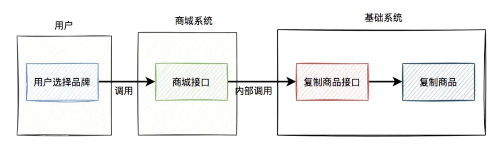
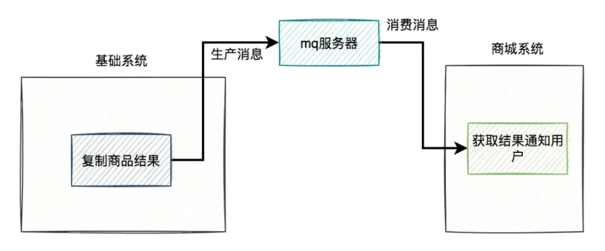
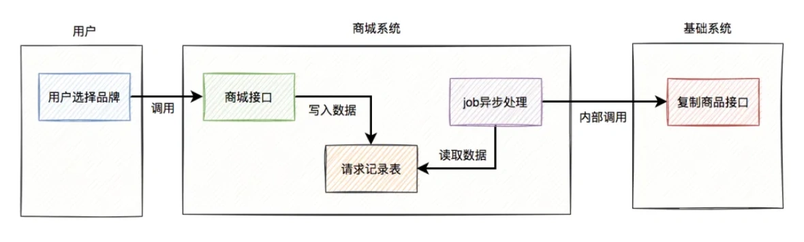
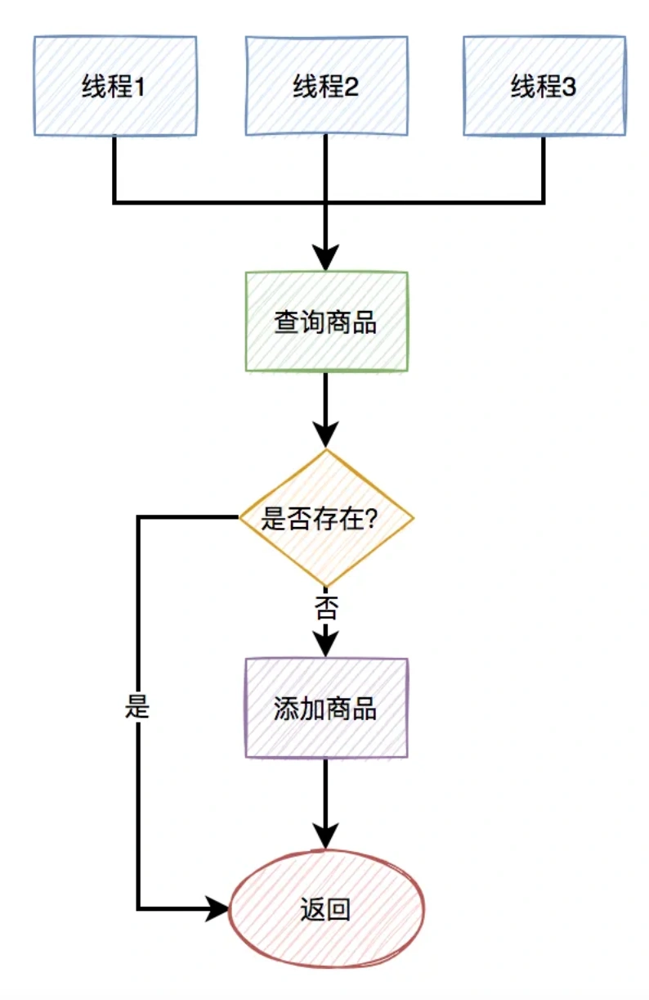
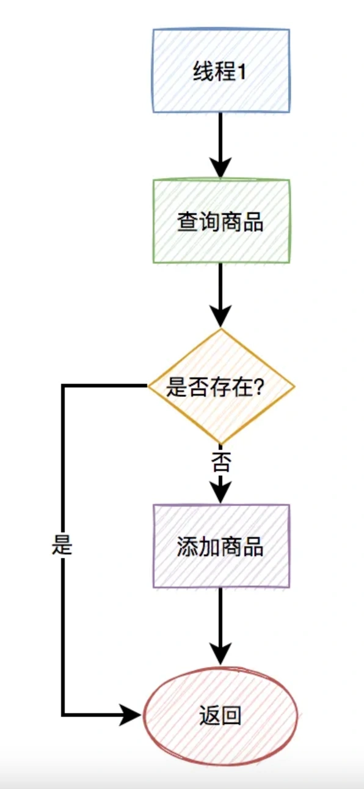
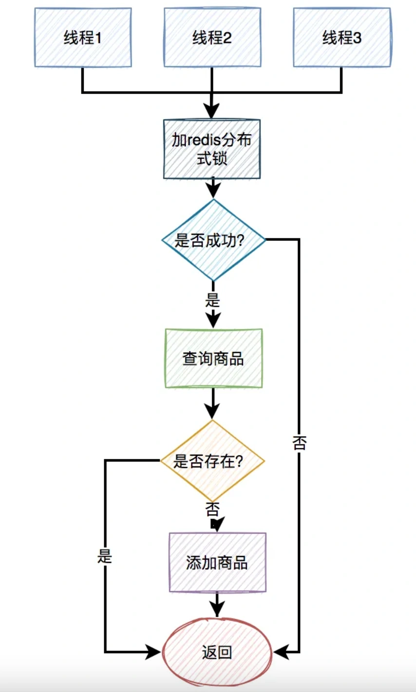
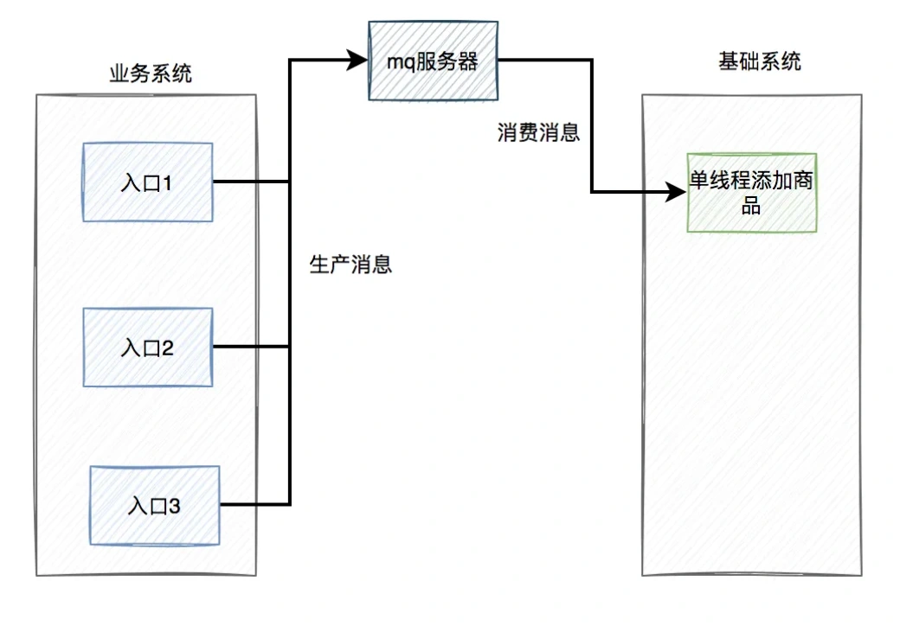

# 产生重复数据问题

## **<font style="color:rgb(34, 34, 34);background-color:rgb(248, 246, 244);">前言</font>**
<font style="color:rgb(51, 51, 51);background-color:rgb(248, 246, 244);">最近测试给我提了一个bug，说我之前提供的一个批量复制商品的接口，产生了重复的商品数据。</font>

<font style="color:rgb(51, 51, 51);background-color:rgb(248, 246, 244);">追查原因之后发现，这个事情没想象中简单，可以说一波多折。</font>

## **<font style="color:rgb(34, 34, 34);background-color:rgb(248, 246, 244);">1. 需求</font>**
<font style="color:rgb(51, 51, 51);background-color:rgb(248, 246, 244);">产品有个需求：用户选择一些品牌，点击确定按钮之后，系统需要基于一份默认品牌的商品数据，复制出一批新的商品。</font>

<font style="color:rgb(51, 51, 51);background-color:rgb(248, 246, 244);">拿到这个需求时觉得太简单了，三下五除二就搞定。</font>

<font style="color:rgb(51, 51, 51);background-color:rgb(248, 246, 244);">我提供了一个复制商品的基础接口，给商城系统调用。</font>

<font style="color:rgb(51, 51, 51);background-color:rgb(248, 246, 244);">当时的流程图如下：</font>



<font style="color:rgb(51, 51, 51);background-color:rgb(248, 246, 244);">如果每次复制的商品数量不多，使用同步接口调用的方案问题也不大。</font>

## **<font style="color:rgb(34, 34, 34);background-color:rgb(248, 246, 244);">2. 性能优化</font>**
<font style="color:rgb(51, 51, 51);background-color:rgb(248, 246, 244);">但由于每次需要复制的商品数量比较多，可能有几千。</font>

<font style="color:rgb(51, 51, 51);background-color:rgb(248, 246, 244);">如果每次都是用同步接口的方式复制商品，可能会有性能问题。</font>

<font style="color:rgb(51, 51, 51);background-color:rgb(248, 246, 244);">因此，后来我把复制商品的逻辑改成使用mq异步处理。</font>

<font style="color:rgb(51, 51, 51);background-color:rgb(248, 246, 244);">改造之后的流程图：</font>


<font style="color:rgb(51, 51, 51);background-color:rgb(248, 246, 244);">复制商品的结果还需要通知商城系统：</font>



<font style="color:rgb(51, 51, 51);background-color:rgb(248, 246, 244);">这个方案看起来，挺不错的。</font>

<font style="color:rgb(51, 51, 51);background-color:rgb(248, 246, 244);">但后来出现问题了。</font>

## **<font style="color:rgb(34, 34, 34);background-color:rgb(248, 246, 244);">3. 出问题了</font>**
<font style="color:rgb(51, 51, 51);background-color:rgb(248, 246, 244);">测试给我们提了一个bug，说我之前提供的一个批量复制商品的接口，产生了重复的商品数据。</font>

<font style="color:rgb(51, 51, 51);background-color:rgb(248, 246, 244);">经过追查之后发现，商城系统为了性能考虑，也改成异步了。</font>

<font style="color:rgb(51, 51, 51);background-color:rgb(248, 246, 244);">他们没有在接口中直接调用基础系统的复制商品接口，而是在job中调用的。</font>

<font style="color:rgb(51, 51, 51);background-color:rgb(248, 246, 244);">站在他们的视角流程图是这样的：</font>



```typescript
Listener(topic = "${com.susan.topic:PRODUCT_TOPIC}",
        consumerGroup = "${com.susan.group:PRODUCT_TOPIC_GROUP}")
@Service
public class MessageReceiver implements RocketMQListener<MessageExt> {

    @Override
    public void onMessage(MessageExt message) {
        String message = new String(message.getBody(), StandardCharsets.UTF_8);
        doSamething(message);
    }
}
```

<font style="color:rgb(51, 51, 51);background-color:rgb(248, 246, 244);">也就是说，如果在极短的时间内，连续发送重复的消息，就会被不同的线程消费。</font>

<font style="color:rgb(51, 51, 51);background-color:rgb(248, 246, 244);">即使在代码中有这样的判断：</font>

```plain
Product oldProduct = query(hashCode);
if(oldProduct == null) {
    productMapper.insert(product);
}
```

<font style="color:rgb(51, 51, 51);background-color:rgb(248, 246, 244);">在插入数据之前，先判断该数据是否已经存在，只有不存在才会插入。</font>

<font style="color:rgb(51, 51, 51);background-color:rgb(248, 246, 244);">但由于在并发情况下，不同的线程都判断商品数据不存在，于是同时进行了插入操作，所以就产生了重复数据。</font>

<font style="color:rgb(51, 51, 51);background-color:rgb(248, 246, 244);">如下图所示：</font>



## **<font style="color:rgb(34, 34, 34);background-color:rgb(248, 246, 244);">5. 顺序消费</font>**
<font style="color:rgb(51, 51, 51);background-color:rgb(248, 246, 244);">为了解决上述并发消费重复消息的问题，我们从两方面着手：</font>

1. **<font style="color:rgb(34, 34, 34);background-color:rgb(248, 246, 244);">商城系统修复产生重复记录的bug。</font>**
2. **<font style="color:rgb(34, 34, 34);background-color:rgb(248, 246, 244);">基础系统将消息改成单线程顺序消费。</font>**

<font style="color:rgb(51, 51, 51);background-color:rgb(248, 246, 244);">我仔细思考了一下，如果只靠商城系统修复bug，以后很难避免不出现类似的重复商品问题，比如：如果用户在极短的时间内点击创建商品按钮多次，或者商城系统主动发起重试。</font>

<font style="color:rgb(51, 51, 51);background-color:rgb(248, 246, 244);">所以，基础系统还需进一步处理。</font>

<font style="color:rgb(51, 51, 51);background-color:rgb(248, 246, 244);">其实RocketMQ本身是支持顺序消费的，需要消息的生产者和消费者一起改。</font>

<font style="color:rgb(51, 51, 51);background-color:rgb(248, 246, 244);">生产者改为：</font>

```typescript
rocketMQTemplate.asyncSendOrderly(topic, message, hashKey, new SendCallback() {
  @Override
  public void onSuccess(SendResult sendResult) {
      log.info("sendMessage success");
  }

  @Override
  public void onException(Throwable e) {
      log.error("sendMessage failed!");
  }
});
```

<font style="color:rgb(51, 51, 51);background-color:rgb(248, 246, 244);">重点是要调用rocketMQTemplate对象的asyncSendOrderly方法，发送顺序消息。</font>

<font style="color:rgb(51, 51, 51);background-color:rgb(248, 246, 244);">消费者改为：</font>

```typescript
@RocketMQMessageListener(topic = "${com.susan.topic:PRODUCT_TOPIC}",
        consumeMode = ConsumeMode.ORDERLY,
        consumerGroup = "${com.susan.group:PRODUCT_TOPIC_GROUP}")
@Service
public class MessageReceiver implements RocketMQListener<MessageExt> {

    @Override
    public void onMessage(MessageExt message) {
        String message = new String(message.getBody(), StandardCharsets.UTF_8);
        doSamething(message);
    }
}
```

<font style="color:rgb(51, 51, 51);background-color:rgb(248, 246, 244);">接收消息的重点是RocketMQMessageListener注解中的consumeMode参数，要设置成ConsumeMode.ORDERLY，这样就能顺序消费消息了。</font>

<font style="color:rgb(51, 51, 51);background-color:rgb(248, 246, 244);">修改后关键流程图如下：</font>



<font style="color:rgb(51, 51, 51);background-color:rgb(248, 246, 244);">两边都修改之后，复制商品这一块就没有再出现重复商品的问题了。</font>

<font style="color:rgb(51, 51, 51);background-color:rgb(248, 246, 244);">But，修完bug之后，我又思考了良久。</font>

<font style="color:rgb(51, 51, 51);background-color:rgb(248, 246, 244);">复制商品只是创建商品的其中一个入口，如果有其他入口，跟复制商品功能同时创建新商品呢？</font>

<font style="color:rgb(51, 51, 51);background-color:rgb(248, 246, 244);">不也会出现重复商品问题？</font>

<font style="color:rgb(51, 51, 51);background-color:rgb(248, 246, 244);">虽说，这种概率非常非常小。</font>

<font style="color:rgb(51, 51, 51);background-color:rgb(248, 246, 244);">但如果一旦出现重复商品问题，后续涉及到要合并商品的数据，非常麻烦。</font>

<font style="color:rgb(51, 51, 51);background-color:rgb(248, 246, 244);">经过这一次的教训，一定要防微杜渐。</font>

<font style="color:rgb(51, 51, 51);background-color:rgb(248, 246, 244);">不管是用户，还是自己的内部系统，从不同的入口创建商品，都需要解决重复商品创建问题。</font>

<font style="color:rgb(51, 51, 51);background-color:rgb(248, 246, 244);">那么，如何解决这个问题呢？</font>

## **<font style="color:rgb(34, 34, 34);background-color:rgb(248, 246, 244);">6. 唯一索引</font>**
<font style="color:rgb(51, 51, 51);background-color:rgb(248, 246, 244);">解决重复商品数据问题，最快成本最低最有效的办法是：给表建唯一索引。</font>

<font style="color:rgb(51, 51, 51);background-color:rgb(248, 246, 244);">想法是好的，但我们这边有个规范就是：业务表必须都是逻辑删除。</font>

<font style="color:rgb(51, 51, 51);background-color:rgb(248, 246, 244);">而我们都知道，要删除表的某条记录的话，如果用delete语句操作的话。</font>

<font style="color:rgb(51, 51, 51);background-color:rgb(248, 246, 244);">例如：</font>

```plain
delete from product where id=123;
```

<font style="color:rgb(51, 51, 51);background-color:rgb(248, 246, 244);">这种delete操作是物理删除，即该记录被删除之后，后续通过sql语句基本查不出来。（不过通过其他技术手段可以找回，那是后话了）</font>

<font style="color:rgb(51, 51, 51);background-color:rgb(248, 246, 244);">还有另外一种是逻辑删除，主要是通过update语句操作的。</font>

<font style="color:rgb(51, 51, 51);background-color:rgb(248, 246, 244);">例如：</font>

```plain
update product set delete_status=1,edit_time=now(3) 
where id=123;
```

<font style="color:rgb(51, 51, 51);background-color:rgb(248, 246, 244);">逻辑删除需要在表中额外增加一个删除状态字段，用于记录数据是否被删除。在所有的业务查询的地方，都需要过滤掉已经删除的数据。</font>

<font style="color:rgb(51, 51, 51);background-color:rgb(248, 246, 244);">通过这种方式删除数据之后，数据任然还在表中，只是从逻辑上过滤了删除状态的数据而已。</font>

<font style="color:rgb(51, 51, 51);background-color:rgb(248, 246, 244);">其实对于这种逻辑删除的表，是没法加唯一索引的。</font>

<font style="color:rgb(51, 51, 51);background-color:rgb(248, 246, 244);">为什么呢？</font>

<font style="color:rgb(51, 51, 51);background-color:rgb(248, 246, 244);">假设之前给商品表中的name和model加了唯一索引，如果用户把某条记录删除了，delete_status设置成1了。后来，该用户发现不对，又重新添加了一模一样的商品。</font>

<font style="color:rgb(51, 51, 51);background-color:rgb(248, 246, 244);">由于唯一索引的存在，该用户第二次添加商品会失败，即使该商品已经被删除了，也没法再添加了。</font>

<font style="color:rgb(51, 51, 51);background-color:rgb(248, 246, 244);">这个问题显然有点严重。</font>

<font style="color:rgb(51, 51, 51);background-color:rgb(248, 246, 244);">有人可能会说：把name、model和delete_status三个字段同时做成唯一索引不就行了？</font>

<font style="color:rgb(51, 51, 51);background-color:rgb(248, 246, 244);">答：这样做确实可以解决用户逻辑删除了某个商品，后来又重新添加相同的商品时，添加不了的问题。但如果第二次添加的商品，又被删除了。该用户第三次添加相同的商品，不也出现问题了？</font>

<font style="color:rgb(51, 51, 51);background-color:rgb(248, 246, 244);">由此可见，如果表中有逻辑删除功能，是不方便创建唯一索引的。</font>

## **<font style="color:rgb(34, 34, 34);background-color:rgb(248, 246, 244);">5. 分布式锁</font>**
<font style="color:rgb(51, 51, 51);background-color:rgb(248, 246, 244);">接下来，你想到的第二种解决数据重复问题的办法可能是：加分布式锁。</font>

<font style="color:rgb(51, 51, 51);background-color:rgb(248, 246, 244);">目前最常用的性能最高的分布式锁，可能是redis分布式锁了。</font>

<font style="color:rgb(51, 51, 51);background-color:rgb(248, 246, 244);">使用redis分布式锁的伪代码如下：</font>

```plain
try{
  String result = jedis.set(lockKey, requestId, "NX", "PX", expireTime);
  if ("OK".equals(result)) {
      doSamething();
      return true;
  }
  return false;
} finally {
    unlock(lockKey,requestId);
}
```

<font style="color:rgb(51, 51, 51);background-color:rgb(248, 246, 244);">不过需要在finally代码块中释放锁。</font>

<font style="color:rgb(51, 51, 51);background-color:rgb(248, 246, 244);">其中lockKey是由商品表中的name和model组合而成的，requestId是每次请求的唯一标识，以便于它每次都能正确得释放锁。还需要设置一个过期时间expireTime，防止释放锁失败，锁一直存在，导致后面的请求没法获取锁。</font>

<font style="color:rgb(51, 51, 51);background-color:rgb(248, 246, 244);">如果只是单个商品，或者少量的商品需要复制添加，则加分布式锁没啥问题。</font>

<font style="color:rgb(51, 51, 51);background-color:rgb(248, 246, 244);">主要流程如下：</font>



<font style="color:rgb(51, 51, 51);background-color:rgb(248, 246, 244);">可以在复制添加商品之前，先尝试加锁。如果加锁成功，则在查询商品是否存在，如果不存在，则添加商品。此外，在该流程中如果加锁失败，或者查询商品时不存在，则直接返回。</font>

<font style="color:rgb(51, 51, 51);background-color:rgb(248, 246, 244);">加分布式锁的目的是：保证查询商品和添加商品的两个操作是原子性的操作。</font>

<font style="color:rgb(51, 51, 51);background-color:rgb(248, 246, 244);">但现在的问题是，我们这次需要复制添加的商品数量很多，如果每添加一个商品都要加分布式锁的话，会非常影响性能。</font>

<font style="color:rgb(51, 51, 51);background-color:rgb(248, 246, 244);">显然对于批量接口，加redis分布式锁，不是一个理想的方案。</font>

## **<font style="color:rgb(34, 34, 34);background-color:rgb(248, 246, 244);">6. 统一mq异步处理</font>**
<font style="color:rgb(51, 51, 51);background-color:rgb(248, 246, 244);">前面我们已经聊过，在批量复制商品的接口，我们是通过RocketMQ的顺序消息，单线程异步复制添加商品的，可以暂时解决商品重复的问题。</font>

<font style="color:rgb(51, 51, 51);background-color:rgb(248, 246, 244);">但那只改了一个添加商品的入口，还有其他添加商品的入口。</font>

<font style="color:rgb(51, 51, 51);background-color:rgb(248, 246, 244);">能不能把添加商品的底层逻辑统一一下，最终都调用同一段代码。然后通过RocketMQ的顺序消息，单线程异步添加商品。</font>

<font style="color:rgb(51, 51, 51);background-color:rgb(248, 246, 244);">主要流程如下图所示：</font>



<font style="color:rgb(51, 51, 51);background-color:rgb(248, 246, 244);">这样确实能够解决重复商品的问题。</font>

<font style="color:rgb(51, 51, 51);background-color:rgb(248, 246, 244);">但同时也带来了另外两个问题：</font>

1. **<font style="color:rgb(34, 34, 34);background-color:rgb(248, 246, 244);">现在所有的添加商品功能都改成异步了，之前同步添加商品的接口如何返回数据呢？这就需要修改前端交互，否则会影响用户体验。</font>**
2. **<font style="color:rgb(34, 34, 34);background-color:rgb(248, 246, 244);">之前不同的添加商品入口，是多线程添加商品的，现在改成只能由一个线程添加商品，这样修改的结果导致添加商品的整体效率降低了。</font>**

<font style="color:rgb(51, 51, 51);background-color:rgb(248, 246, 244);">由此，综合考虑了一下各方面因素，这个方案最终被否定了。</font>

## **<font style="color:rgb(34, 34, 34);background-color:rgb(248, 246, 244);">7. insert on duplicate key update</font>**
<font style="color:rgb(51, 51, 51);background-color:rgb(248, 246, 244);">其实，在mysql中存在这样的语法，即：insert on duplicate key update。</font>

<font style="color:rgb(51, 51, 51);background-color:rgb(248, 246, 244);">在添加数据时，mysql发现数据不存在，则直接insert。如果发现数据已经存在了，则做update操作。</font>

<font style="color:rgb(51, 51, 51);background-color:rgb(248, 246, 244);">不过要求表中存在唯一索引或PRIMARY KEY，这样当这两个值相同时，才会触发更新操作，否则是插入。</font>

<font style="color:rgb(51, 51, 51);background-color:rgb(248, 246, 244);">现在的问题是PRIMARY KEY是商品表的主键，是根据雪花算法提前生成的，不可能产生重复的数据。</font>

<font style="color:rgb(51, 51, 51);background-color:rgb(248, 246, 244);">但由于商品表有逻辑删除功能，导致唯一索引在商品表中创建不了。</font>

<font style="color:rgb(51, 51, 51);background-color:rgb(248, 246, 244);">由此，insert on duplicate key update这套方案，暂时也没法用。</font>

<font style="color:rgb(51, 51, 51);background-color:rgb(248, 246, 244);">此外，insert on duplicate key update在高并发的情况下，可能会产生死锁问题，需要特别注意一下。</font>

<font style="color:rgb(51, 51, 51);background-color:rgb(248, 246, 244);">感兴趣的小伙伴，也可以找我私聊。</font>

<font style="color:rgb(51, 51, 51);background-color:rgb(248, 246, 244);">其实insert on duplicate key update的实战，我在另一篇文章《</font>[我用kafka两年踩过的一些非比寻常的坑](https://mp.weixin.qq.com/s?__biz=MzkwNjMwMTgzMQ==&mid=2247490289&idx=1&sn=bc311da9f4a4d3f48ee5dc207bf31a8b&chksm=c0ebc219f79c4b0fc711116723b9df3a5531cda32f0f5d00f065910aa552af6ff03b3f1528fc&token=751314179&lang=zh_CN&scene=21#wechat_redirect)<font style="color:rgb(51, 51, 51);background-color:rgb(248, 246, 244);">》中介绍过的，感兴趣的小伙伴，可以看看。</font>

## **<font style="color:rgb(34, 34, 34);background-color:rgb(248, 246, 244);">8. insert ignore</font>**
<font style="color:rgb(51, 51, 51);background-color:rgb(248, 246, 244);">在mysql中还存在这样的语法，即：insert ... ignore。</font>

<font style="color:rgb(51, 51, 51);background-color:rgb(248, 246, 244);">在insert语句执行的过程中：mysql发现如果数据重复了，就忽略，否则就会插入。</font>

<font style="color:rgb(51, 51, 51);background-color:rgb(248, 246, 244);">它主要是用来忽略，插入重复数据产生的Duplicate entry 'XXX' for key 'XXXX'异常的。</font>

<font style="color:rgb(51, 51, 51);background-color:rgb(248, 246, 244);">不过也要求表中存在唯一索引或PRIMARY KEY。</font>

<font style="color:rgb(51, 51, 51);background-color:rgb(248, 246, 244);">但由于商品表有逻辑删除功能，导致唯一索引在商品表中创建不了。</font>

<font style="color:rgb(51, 51, 51);background-color:rgb(248, 246, 244);">由此可见，这个方案也不行。</font>

<font style="color:rgb(51, 51, 51);background-color:rgb(248, 246, 244);">温馨的提醒一下，使用insert ... ignore也有可能会导致死锁。</font>

## **<font style="color:rgb(34, 34, 34);background-color:rgb(248, 246, 244);">9. 防重表</font>**
<font style="color:rgb(51, 51, 51);background-color:rgb(248, 246, 244);">之前聊过，因为有逻辑删除功能，给商品表加唯一索引，行不通。</font>

<font style="color:rgb(51, 51, 51);background-color:rgb(248, 246, 244);">后面又说了加分布式锁，或者通过mq单线程异步添加商品，影响创建商品的性能。</font>

<font style="color:rgb(51, 51, 51);background-color:rgb(248, 246, 244);">那么，如何解决问题呢？</font>

<font style="color:rgb(51, 51, 51);background-color:rgb(248, 246, 244);">我们能否换一种思路，加一张防重表，在防重表中增加商品表的name和model字段作为唯一索引。</font>

<font style="color:rgb(51, 51, 51);background-color:rgb(248, 246, 244);">例如：</font>

```plain
CREATE TABLE `product_unique` (
  `id` bigint(20) NOT NULL COMMENT 'id',
  `name` varchar(130) DEFAULT NULL COMMENT '名称',
  `model` varchar(255)  NOT NULL COMMENT '规格',
  `user_id` bigint(20) unsigned NOT NULL COMMENT '创建用户id',
  `user_name` varchar(30)  NOT NULL COMMENT '创建用户名称',
  `create_date` datetime(3) NOT NULL DEFAULT CURRENT_TIMESTAMP(3) COMMENT '创建时间',
  PRIMARY KEY (`id`),
  UNIQUE KEY `ux_name_model` (`name`,`model`)
) ENGINE=InnoDB DEFAULT CHARSET=utf8mb4 COMMENT='商品防重表';
```

<font style="color:rgb(51, 51, 51);background-color:rgb(248, 246, 244);">其中表中的id可以用商品表的id，表中的name和model就是商品表的name和model，不过在这张防重表中增加了这两个字段的唯一索引。</font>

<font style="color:rgb(51, 51, 51);background-color:rgb(248, 246, 244);">视野一下子被打开了。</font>

<font style="color:rgb(51, 51, 51);background-color:rgb(248, 246, 244);">在添加商品数据之前，先添加防重表。如果添加成功，则说明可以正常添加商品，如果添加失败，则说明有重复数据。</font>

<font style="color:rgb(51, 51, 51);background-color:rgb(248, 246, 244);">防重表添加失败，后续的业务处理，要根据实际业务需求而定。</font>

<font style="color:rgb(51, 51, 51);background-color:rgb(248, 246, 244);">如果业务上允许添加一批商品时，发现有重复的，直接抛异常，则可以提示用户：系统检测到重复的商品，请刷新页面重试。</font>

<font style="color:rgb(51, 51, 51);background-color:rgb(248, 246, 244);">例如：</font>

```plain
try {
  transactionTemplate.execute((status) -> {
      productUniqueMapper.batchInsert(productUniqueList);
      productMapper.batchInsert(productList);
  return Boolean.TRUE;
  });
} catch(DuplicateKeyException e) {
   throw new BusinessException("系统检测到重复的商品，请刷新页面重试");
}
```

<font style="color:rgb(51, 51, 51);background-color:rgb(248, 246, 244);">在批量插入数据时，如果出现了重复数据，捕获DuplicateKeyException异常，转换成BusinessException这样运行时的业务异常。</font>

<font style="color:rgb(51, 51, 51);background-color:rgb(248, 246, 244);">还有一种业务场景，要求即使出现了重复的商品，也不抛异常，让业务流程也能够正常走下去。</font>

<font style="color:rgb(51, 51, 51);background-color:rgb(248, 246, 244);">例如：</font>

```plain
try {
  transactionTemplate.execute((status) -> {
      productUniqueMapper.insert(productUnique);
      productMapper.insert(product);
  return Boolean.TRUE;
  });
} catch(DuplicateKeyException e) {
   product = productMapper.query(product);
}
```

<font style="color:rgb(51, 51, 51);background-color:rgb(248, 246, 244);">在插入数据时，如果出现了重复数据，则捕获DuplicateKeyException，在catch代码块中再查询一次商品数据，将数据库已有的商品直接返回。</font>

<font style="color:rgb(51, 51, 51);background-color:rgb(248, 246, 244);">如果调用了同步添加商品的接口，这里非常关键的一点，是要返回已有数据的id，业务系统做后续操作，要拿这个id操作。</font>

<font style="color:rgb(51, 51, 51);background-color:rgb(248, 246, 244);">当然在执行execute之前，还是需要先查一下商品数据是否存在，如果已经存在，则直接返回已有数据，如果不存在，才执行execute方法。这一步千万不能少。</font>

<font style="color:rgb(51, 51, 51);background-color:rgb(248, 246, 244);">例如：</font>

```plain
Product oldProduct = productMapper.query(product);
if(Objects.nonNull(oldProduct)) {
    return oldProduct;
}

try {
  transactionTemplate.execute((status) -> {
      productUniqueMapper.insert(productUnique);
      productMapper.insert(product);
  return Boolean.TRUE;
  });
} catch(DuplicateKeyException e) {
   product = productMapper.query(product);
}
return product;
```

<font style="color:rgb(100, 100, 100);background-color:rgb(248, 246, 244);">千万注意：防重表和添加商品的操作必须要在同一个事务中，否则会出问题。</font>

<font style="color:rgb(51, 51, 51);background-color:rgb(248, 246, 244);">顺便说一下，还需要对商品的删除功能做特殊处理一下，在逻辑删除商品表的同时，要物理删除防重表。用商品表id作为查询条件即可。</font>

<font style="color:rgb(51, 51, 51);background-color:rgb(248, 246, 244);">说实话，解决重复数据问题的方案挺多的，没有最好的方案，只有最适合业务场景的，最优的方案。</font>


> 更新: 2024-05-20 17:11:21  
> 原文: <https://www.yuque.com/yuqueyonghue6cvnv/cxhfwd/vl7xdst03ixgath2>