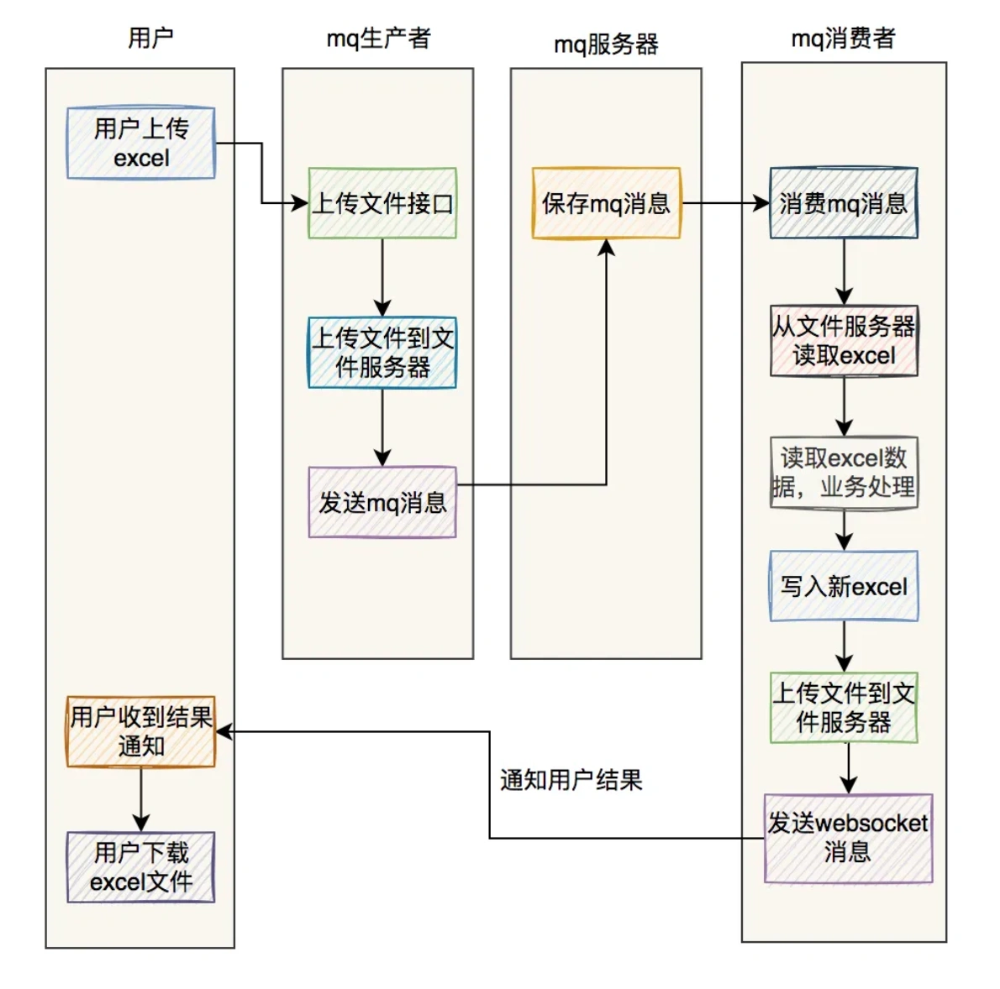
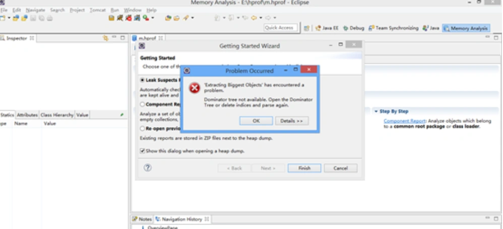
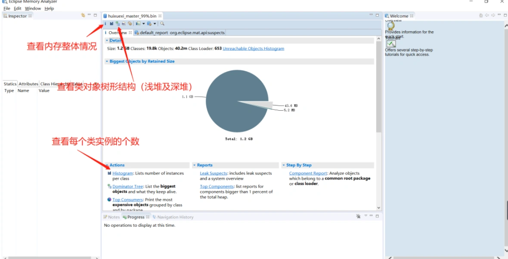
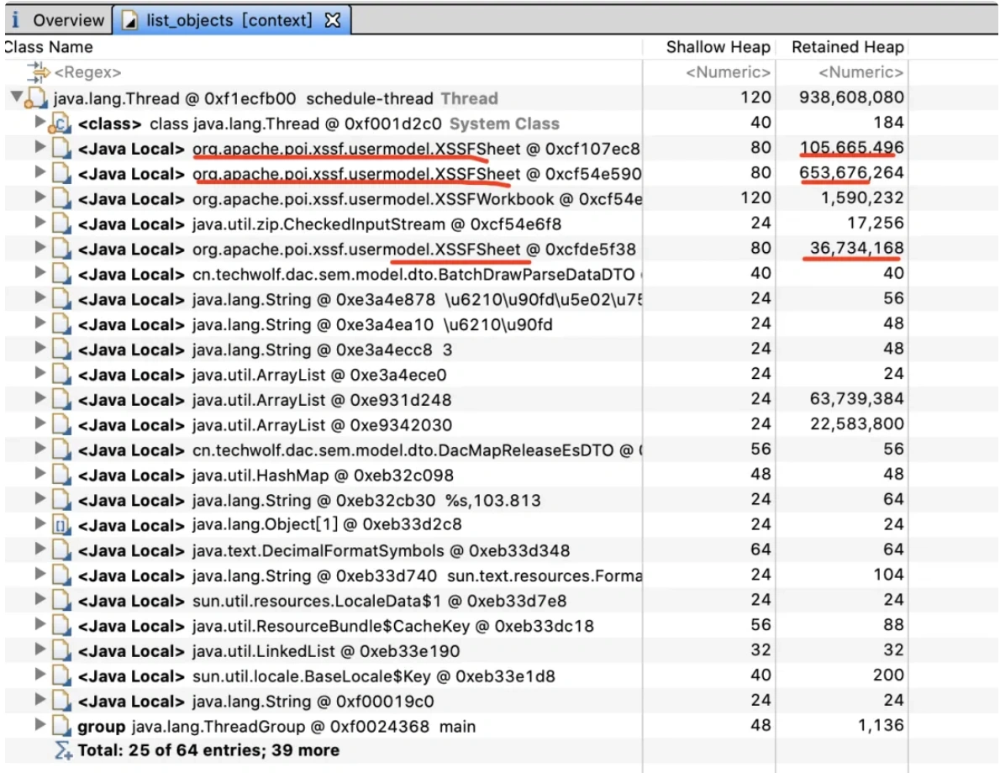

# 线上服务OOM问题

## **<font style="color:rgb(34, 34, 34);background-color:rgb(248, 246, 244);">前言</font>**
<font style="color:rgb(51, 51, 51);background-color:rgb(248, 246, 244);">前一段时间，公司同事的一个线上服务OOM的问题，我觉得挺有意思的，在这里跟大家一起分享一下。</font>

<font style="color:rgb(51, 51, 51);background-color:rgb(248, 246, 244);">我当时其实也参与了一部分问题的定位。</font>

## **<font style="color:rgb(34, 34, 34);background-color:rgb(248, 246, 244);">1 案发现场</font>**
<font style="color:rgb(51, 51, 51);background-color:rgb(248, 246, 244);">他们有个mq消费者服务，在某一天下午，出现OOM了，导致服务直接挂掉。</font>

<font style="color:rgb(51, 51, 51);background-color:rgb(248, 246, 244);">当时我们收到了很多内存的报警邮件。</font>

<font style="color:rgb(51, 51, 51);background-color:rgb(248, 246, 244);">发现问题之后，运维第一时间，帮他们dump了当时的内存快照，以便于开发人员好定位问题。</font>

<font style="color:rgb(51, 51, 51);background-color:rgb(248, 246, 244);">之后，运维重启了该服务，系统暂时恢复了正常。</font>

<font style="color:rgb(51, 51, 51);background-color:rgb(248, 246, 244);">大家都知道，如果出现了线上OOM问题，为了不影响用户的正常使用，最快的解决办法就是重启服务。</font>

<font style="color:rgb(51, 51, 51);background-color:rgb(248, 246, 244);">但重启服务治标不治本，只能临时解决一下问题，如果不找到真正的原因，难免下次在某个不经意的时间点，又会出现OOM问题。</font>

<font style="color:rgb(51, 51, 51);background-color:rgb(248, 246, 244);">所以，有必要定位一下具体原因。</font>

## **<font style="color:rgb(34, 34, 34);background-color:rgb(248, 246, 244);">2 初步定位问题</font>**
<font style="color:rgb(51, 51, 51);background-color:rgb(248, 246, 244);">当时运维dump下来的内存快照文件有3G多，太大了，由于公司内网限制，没办法及时给到开发这边。</font>

<font style="color:rgb(51, 51, 51);background-color:rgb(248, 246, 244);">没办法，只能先从日志文件下手了。</font>

<font style="color:rgb(51, 51, 51);background-color:rgb(248, 246, 244);">在查日志之前，我们先查看了prometheus上的服务监控。查到了当时那个mq消费者服务的内存使用情况，该服务的内存使用率一直都比较平稳，从2022-09-26 14:16:29开始，出现了一个明显的内存飙升情况。</font>

<font style="color:rgb(51, 51, 51);background-color:rgb(248, 246, 244);">根据以往经验总结出来的，在追查日志时，时间点是一个非常重要的过滤条件。</font>

<font style="color:rgb(51, 51, 51);background-color:rgb(248, 246, 244);">所以，我们当时重点排查了2022-09-26 14:16:29前后5秒钟的日志。</font>

<font style="color:rgb(51, 51, 51);background-color:rgb(248, 246, 244);">由于这个服务，并发量不大，在那段时间的日志量并不多。</font>

<font style="color:rgb(51, 51, 51);background-color:rgb(248, 246, 244);">所以，我们很快就锁定了excel文件导入导出功能。</font>

<font style="color:rgb(51, 51, 51);background-color:rgb(248, 246, 244);">该功能的流程图如下：</font>



1. <font style="color:rgb(51, 51, 51);background-color:rgb(248, 246, 244);">用户通过浏览器上传excel，调用文件上传接口。</font>
2. <font style="color:rgb(51, 51, 51);background-color:rgb(248, 246, 244);">该接口会上传excel到文件服务器。然后将文件url，通过mq消息，发送到mq服务器。</font>
3. <font style="color:rgb(51, 51, 51);background-color:rgb(248, 246, 244);">mq消费者消费mq消息，从文件服务器中获取excel数据，做业务处理，然后把结果写入新的excel中。</font>
4. <font style="color:rgb(51, 51, 51);background-color:rgb(248, 246, 244);">mq消费者将新excel文件上传到文件服务器，然后发websocket消息通知用户。</font>
5. <font style="color:rgb(51, 51, 51);background-color:rgb(248, 246, 244);">用户收到通知结果，然后可以下载新的excel。</font>

<font style="color:rgb(51, 51, 51);background-color:rgb(248, 246, 244);">经过日志分析，时间点刚好吻合，从excel文件导入之后，mq消费者服务的内存使用率一下子飙升。</font>

## **<font style="color:rgb(34, 34, 34);background-color:rgb(248, 246, 244);">3. 打不开dump文件</font>**
<font style="color:rgb(51, 51, 51);background-color:rgb(248, 246, 244);">从上面分析我们得出初步的结论，线上mq消费者服务的OOM问题，是由于excel导入导出导致的。</font>

<font style="color:rgb(51, 51, 51);background-color:rgb(248, 246, 244);">于是，我们查看了相关excel文件导入导出代码，并没有发现明显的异常。</font>

<font style="color:rgb(51, 51, 51);background-color:rgb(248, 246, 244);">为了找到根本原因，我们不得不把内存快照解析出来。</font>

<font style="color:rgb(51, 51, 51);background-color:rgb(248, 246, 244);">此时，运维把内存快照已经想办法发给了相关的开发人员（我的同事）。</font>

<font style="color:rgb(51, 51, 51);background-color:rgb(248, 246, 244);">那位同事用电脑上安装的内存分析工具：MAT（Memory Analyzer Tool），准备打开那个内存快照文件。</font>

<font style="color:rgb(51, 51, 51);background-color:rgb(248, 246, 244);">但由于该文件太大，占了3G多的内存，直接打开失败了。</font>



<font style="color:rgb(51, 51, 51);background-color:rgb(248, 246, 244);">MemoryAnalyzer.ini文件默认支持打开的内存文件是1G，后来它将参数-xmx修改为4096m。</font>

<font style="color:rgb(51, 51, 51);background-color:rgb(248, 246, 244);">修改之后，文件可以打开了，但打开的内容却有问题。</font>

<font style="color:rgb(51, 51, 51);background-color:rgb(248, 246, 244);">猛然发现，原来是JDK版本不匹配导致的。</font>

<font style="color:rgb(51, 51, 51);background-color:rgb(248, 246, 244);">他用的MAT工具是基于SunJDK，而我们生成环境用的OpenJDK，二者有些差异。</font>

<font style="color:rgb(100, 100, 100);background-color:rgb(248, 246, 244);">SunJDK采用JRL协议发布，而OpenJDK则采用GPL V2协议发布。两个协议虽然都是开放源代码的，但是在使用上的不同，GPL V2允许在商业上使用，而JRL只允许个人研究使用。</font>

<font style="color:rgb(51, 51, 51);background-color:rgb(248, 246, 244);">所以需要下载一个基于OpenJDK版本的MAT内存分析工具。</font>

## **<font style="color:rgb(34, 34, 34);background-color:rgb(248, 246, 244);">4. 进一步分析</font>**
<font style="color:rgb(51, 51, 51);background-color:rgb(248, 246, 244);">刚好，另一个同事的电脑上下载过OpenJDK版本的MAT内存分析工具。</font>

<font style="color:rgb(51, 51, 51);background-color:rgb(248, 246, 244);">把文件发给他帮忙分析了一下。</font>



<font style="color:rgb(51, 51, 51);background-color:rgb(248, 246, 244);">最后发现org.apache.poi.xssf.usermodel.XSSFSheet类的对象占用的内存是最多的。</font>



<font style="color:rgb(51, 51, 51);background-color:rgb(248, 246, 244);">目前excel的导入导出功能，大部分是基于apache的POI技术，而POI给我们提供了WorkBook接口。</font>

<font style="color:rgb(51, 51, 51);background-color:rgb(248, 246, 244);">常用的WorkBook接口实现有三种：</font>

+ <font style="color:rgb(51, 51, 51);background-color:rgb(248, 246, 244);">HSSFWorkbook：它是早期使用最多的工具，支持Excel2003以前的版本，Excel的扩展名是.xls。只能导出65535条数据，如果超过最大记录条数会报错，但不会出现内存溢出。</font>
+ <font style="color:rgb(51, 51, 51);background-color:rgb(248, 246, 244);">XSSFWorkbook：它可以操作Excel2003-Excel2007之间的版本，Excel的扩展名是.xlsx。最多可以导出104w条数据，会创建大量的对象存放到内存中，可能会导致内存溢出。</font>
+ <font style="color:rgb(51, 51, 51);background-color:rgb(248, 246, 244);">SXSSFWorkbook：它可以操作Excel2007之后的所有版本，Excel的扩展名是.xlsx。SXSSFWorkbook是streaming版本的XSSFWorkbook，它只会保存最新的rows在内存里供查看，以前的rows都会被写入到硬盘里。用磁盘空间换内存空间，不会导致内存溢出。</font>

<font style="color:rgb(51, 51, 51);background-color:rgb(248, 246, 244);">看到了这个类，可以验证之前我们通过日志分析问题，得出excel导入导出功能引起OOM的结论，是正确的。</font>

<font style="color:rgb(51, 51, 51);background-color:rgb(248, 246, 244);">那个引起OOM问题的功能，刚好使用了XSSFWorkbook处理excel，一次性创建了大量的对象。</font>

<font style="color:rgb(51, 51, 51);background-color:rgb(248, 246, 244);">关键代码如下：</font>

```plain
XSSFWorkbook wb = new XSSFWorkbook(new FileInputStream(file));
XSSFSheet sheet = wb.getSheetAt(0);
```

<font style="color:rgb(51, 51, 51);background-color:rgb(248, 246, 244);">我们通过MAT内存分析工具，已经确定OOM问题的原因了。接下来，最关键的一点是：如何解决这个问题呢？</font>

## **<font style="color:rgb(34, 34, 34);background-color:rgb(248, 246, 244);">5. 如何解决问题？</font>**
<font style="color:rgb(51, 51, 51);background-color:rgb(248, 246, 244);">根据我们上面的分析，既然XSSFWorkbook在导入导出大excel文件时，会导致内存溢出。那么，我们改成SXSSFWorkbook不就行了？</font>

<font style="color:rgb(51, 51, 51);background-color:rgb(248, 246, 244);">关键代码改动如下：</font>

```plain
XSSFWorkbook wb = new XSSFWorkbook(new FileInputStream(file));
SXSSFWorkbook swb = new SXSSFWorkbook(wb,100);
SXSSFSheet sheet = (SXSSFSheet) swb.createSheet("sheet1");
```

<font style="color:rgb(51, 51, 51);background-color:rgb(248, 246, 244);">使用SXSSFWorkbook将XSSFWorkbook封装了一层，其中100表示excel一次读入内存的最大记录条数，excel中其余的数据将会生成临时文件保存到磁盘上。这个参数，可以根据实际需要调整。</font>

<font style="color:rgb(51, 51, 51);background-color:rgb(248, 246, 244);">还有一点非常重要：</font>

```plain
sheet.flushRows();
```

<font style="color:rgb(51, 51, 51);background-color:rgb(248, 246, 244);">需要在程序的结尾处加上上面的这段代码，不然生成的临时文件是空的。</font>

<font style="color:rgb(51, 51, 51);background-color:rgb(248, 246, 244);">这样调整之后，问题被暂时解决了。</font>

<font style="color:rgb(100, 100, 100);background-color:rgb(248, 246, 244);">此外，顺便说一句，在使用WorkBook接口的相关实现类时，用完之后，要记得调用close方法及时关闭喔，不然也可能会出现OOM问题。</font>

## **<font style="color:rgb(34, 34, 34);background-color:rgb(248, 246, 244);">6. 后续思考</font>**
<font style="color:rgb(51, 51, 51);background-color:rgb(248, 246, 244);">其实，当时我建议过使用阿里开源的EasyExcel解决OOM的问题。</font>

<font style="color:rgb(51, 51, 51);background-color:rgb(248, 246, 244);">但同事说，excel中有很多样式，在导出的新excel中要保留之前的样式，同时增加一列，返回导入的结果。</font>

<font style="color:rgb(51, 51, 51);background-color:rgb(248, 246, 244);">如果使用EasyExcel不太好处理，使用原始的Workbook更好处理一些。</font>

<font style="color:rgb(51, 51, 51);background-color:rgb(248, 246, 244);">但是使用mq异步导入excel文件这套方案，如果并发量大的话，任然可能会出现OOM问题，有安全隐患。</font>

<font style="color:rgb(51, 51, 51);background-color:rgb(248, 246, 244);">因此，有必要调整一下mq消费者。</font>

<font style="color:rgb(51, 51, 51);background-color:rgb(248, 246, 244);">后来，mq消费者的线程池，设置成4个线程消费，避免消费者同时处理过多的消息，读取大量的excel，导致内存占用过多的问题。当然线程个数参数，可以根据实际情况调整。</font>

<font style="color:rgb(51, 51, 51);background-color:rgb(248, 246, 244);">此外，使用阿里的arthas也可以定位线上OOM问题，后面会有专门的文章介绍，感兴趣的小伙伴可以关注一下。</font>


> 更新: 2024-05-20 17:12:04  
> 原文: <https://www.yuque.com/yuqueyonghue6cvnv/cxhfwd/tkyclliw53e3c8vw>