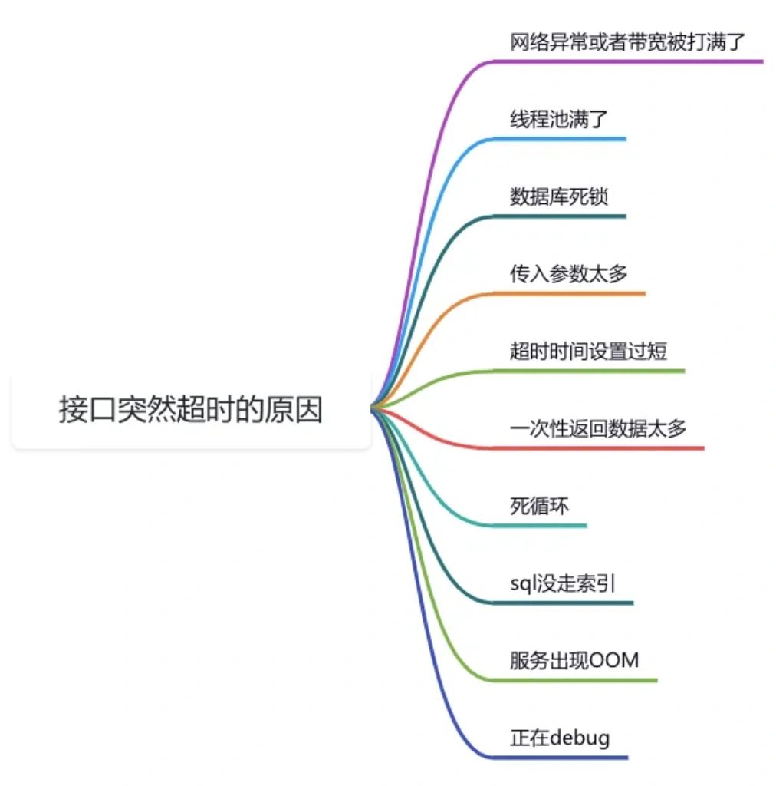
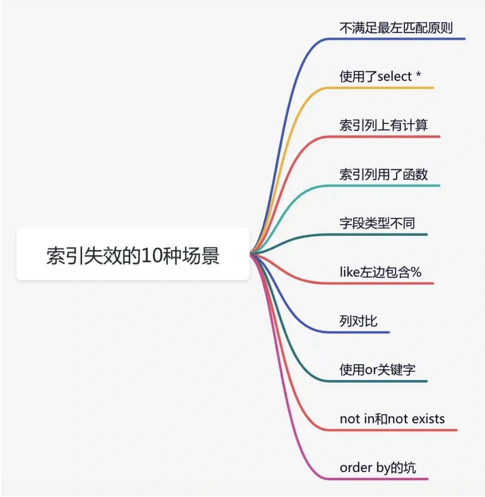

# 线上问题如何排查？

## **<font style="color:rgb(34, 34, 34);background-color:rgb(248, 246, 244);">前言</font>**
<font style="color:rgb(51, 51, 51);background-color:rgb(248, 246, 244);">最近经常有小伙伴问我，遇到了线上问题要如何快速排查。</font>

<font style="color:rgb(51, 51, 51);background-color:rgb(248, 246, 244);">这非常考验工作经验了。</font>

<font style="color:rgb(51, 51, 51);background-color:rgb(248, 246, 244);">有些问题你以前遇到，如果再遇到类似的问题，就能很快排查出导致问题的原因。</font>

<font style="color:rgb(51, 51, 51);background-color:rgb(248, 246, 244);">但如果某个问题你是第一次遇到，心中可能会有点无从下手的感觉。</font>

<font style="color:rgb(51, 51, 51);background-color:rgb(248, 246, 244);">这篇文章总结了，我之前遇到过的一些线上问题排查思路，希望对你会有所帮助。</font>

## **<font style="color:rgb(34, 34, 34);background-color:rgb(248, 246, 244);">1 OOM问题</font>**
<font style="color:rgb(51, 51, 51);background-color:rgb(248, 246, 244);">OOM问题在生产环境中，一旦出现，一般会是非常严重的问题，服务可能会挂掉。</font>

<font style="color:rgb(51, 51, 51);background-color:rgb(248, 246, 244);">但是OOM问题有多种情况，不同的情况，出现问题的原因不一样。</font>

### **<font style="color:rgb(34, 34, 34);background-color:rgb(248, 246, 244);">1.1 堆内存OOM</font>**
<font style="color:rgb(51, 51, 51);background-color:rgb(248, 246, 244);">服务器的日志一般会打印下面的内容：</font>

```plain
java.lang.OutOfMemoryError: Java heap space
```

<font style="color:rgb(51, 51, 51);background-color:rgb(248, 246, 244);">这种是出现最多的OOM问题。</font>

<font style="color:rgb(51, 51, 51);background-color:rgb(248, 246, 244);">在Java服务启动时，可以增加下面的参数：</font>

```ruby
-XX:+HeapDumpOnOutOfMemoryError -XX:HeapDumpPath=heapdump.hprof
```

<font style="color:rgb(51, 51, 51);background-color:rgb(248, 246, 244);">在发生OOM时，程序会自动把当时的内存使用情况，dump保存到指定的文件。</font>

<font style="color:rgb(51, 51, 51);background-color:rgb(248, 246, 244);">然后使用MAT（Memory Analyzer Tool），或者使用JDK自带的 Java visualvm，来分析dump 文件，找出导致OOM 的代码 。</font>

### **<font style="color:rgb(34, 34, 34);background-color:rgb(248, 246, 244);">1.2 栈内存OOM</font>**
<font style="color:rgb(51, 51, 51);background-color:rgb(248, 246, 244);">出现栈内存OOM问题的异常信息如下：</font>

```plain
java.lang.OutOfMemoryError: unable to create new native thread
```

<font style="color:rgb(51, 51, 51);background-color:rgb(248, 246, 244);">如果实际工作中，出现这个问题，一般是由于创建的线程太多，或者设置的单个线程占用内存空间太大导致的。</font>

<font style="color:rgb(51, 51, 51);background-color:rgb(248, 246, 244);">这个时候需要排查服务的线程数量。</font>

<font style="color:rgb(51, 51, 51);background-color:rgb(248, 246, 244);">推荐使用线程池，可以减少线程的创建，有效控制服务中的线程数量。</font>

### **<font style="color:rgb(34, 34, 34);background-color:rgb(248, 246, 244);">1.3 栈内存溢出</font>**
<font style="color:rgb(51, 51, 51);background-color:rgb(248, 246, 244);">出现栈内存溢出问题的异常信息如下：</font>

```plain
java.lang.StackOverflowError
```

<font style="color:rgb(51, 51, 51);background-color:rgb(248, 246, 244);">该问题一般是由于业务代码中写的一些递归调用，递归的深度超过了JVM允许的最大深度，可能会出现栈内存溢出问题。</font>

<font style="color:rgb(51, 51, 51);background-color:rgb(248, 246, 244);">如果生产环境中，出现了这个问题，可以排查一下递归调用是否正常，有可能出现了无限递归的情况。</font>

### **<font style="color:rgb(34, 34, 34);background-color:rgb(248, 246, 244);">1.4 GC OOM</font>**
<font style="color:rgb(51, 51, 51);background-color:rgb(248, 246, 244);">出现GC OOM问题时异常信息如下：</font>

```plain
java.lang.OutOfMemoryError: GC overhead limit exceeded
```

<font style="color:rgb(51, 51, 51);background-color:rgb(248, 246, 244);">GC OOM一般是由于JVM在GC时，对象过多，导致内存溢出，建议调整GC的策略。</font>

<font style="color:rgb(51, 51, 51);background-color:rgb(248, 246, 244);">在老代80%时就是开始GC，并且将-XX:SurvivorRatio（-XX:SurvivorRatio=8）和-XX:NewRatio（-XX:NewRatio=4）设置的更合理。</font>

### **<font style="color:rgb(34, 34, 34);background-color:rgb(248, 246, 244);">1.5 元空间OOM</font>**
<font style="color:rgb(51, 51, 51);background-color:rgb(248, 246, 244);">出现元空间OOM问题时异常信息如下：</font>

```plain
java.lang.OutOfMemoryError: Metaspace
```

<font style="color:rgb(51, 51, 51);background-color:rgb(248, 246, 244);">JDK8之后使用Metaspace来代替永久代，Metaspace是方法区在HotSpot中的实现。</font>

<font style="color:rgb(51, 51, 51);background-color:rgb(248, 246, 244);">这个问题一般是由于加载到内存中的类太多，或者类的体积太大导致的。</font>

<font style="color:rgb(51, 51, 51);background-color:rgb(248, 246, 244);">如果生产环境中出现了这个问题，可以通过下面的命令修改元空间大小：</font>

```plain
-XX:MetaspaceSize=10m -XX:MaxMetaspaceSize=10m
```

<font style="color:rgb(51, 51, 51);background-color:rgb(248, 246, 244);">我在这里列举了OOM问题的最常见的情况，大家如果想了解更多，可以看一下我之前写的一篇文章《</font>[<font style="color:rgb(51, 51, 51);background-color:rgb(248, 246, 244);">工作中最常见的6种OOM问题</font>](https://mp.weixin.qq.com/s?__biz=MzkwNjMwMTgzMQ==&mid=2247515569&idx=1&sn=cdf8b2c468f30753626384612f5e956e&token=1118146915&lang=zh_CN&scene=21#wechat_redirect)<font style="color:rgb(51, 51, 51);background-color:rgb(248, 246, 244);">》，里面有更详细的介绍。</font>

## **<font style="color:rgb(34, 34, 34);background-color:rgb(248, 246, 244);">2 CPU100%问题</font>**
<font style="color:rgb(51, 51, 51);background-color:rgb(248, 246, 244);">线上服务出现CPU100%问题，也很常见。</font>

<font style="color:rgb(51, 51, 51);background-color:rgb(248, 246, 244);">出现这个问题，是由于服务长时间占用CPU资源导致的。</font>

<font style="color:rgb(51, 51, 51);background-color:rgb(248, 246, 244);">主要原因有下面这几种：</font>


<font style="color:rgb(51, 51, 51);background-color:rgb(248, 246, 244);">定位这个问题，可以使用JDK自带的jstack工具，或者用阿里开源的Arthas探测工具。</font>

<font style="color:rgb(51, 51, 51);background-color:rgb(248, 246, 244);">如果对CPU100%问题比较感兴趣，可以看看我的另一篇文章《</font>[<font style="color:rgb(51, 51, 51);background-color:rgb(248, 246, 244);">糟糕，CPU100%了！！！</font>](https://mp.weixin.qq.com/s?__biz=MzkwNjMwMTgzMQ==&mid=2247514743&idx=1&sn=3d3e69056664a325ba74417018d2ba3a&token=1118146915&lang=zh_CN&scene=21#wechat_redirect)<font style="color:rgb(51, 51, 51);background-color:rgb(248, 246, 244);">》，里面有更详细的介绍。</font>

## **<font style="color:rgb(34, 34, 34);background-color:rgb(248, 246, 244);">3 接口超时问题</font>**
<font style="color:rgb(51, 51, 51);background-color:rgb(248, 246, 244);">不知道你有没有遇到过这样的场景：我们提供的某个API接口，响应时间原本一直都很快，但在某个不经意的时间点，突然出现了接口超时。</font>

<font style="color:rgb(51, 51, 51);background-color:rgb(248, 246, 244);">导致接口超时的原因有很多，我们需要挨个逐一排查。</font>

<font style="color:rgb(51, 51, 51);background-color:rgb(248, 246, 244);">下面这张图中给大家列举出现了，生产环境接口突然出现超时问题时的常见原因：</font>



<font style="color:rgb(51, 51, 51);background-color:rgb(248, 246, 244);">如果大家想进一步了解接口超时问题，可以看看我的另一篇文章《</font>[<font style="color:rgb(51, 51, 51);background-color:rgb(248, 246, 244);">接口突然超时10宗罪。。。</font>](https://mp.weixin.qq.com/s?__biz=MzkwNjMwMTgzMQ==&mid=2247499989&idx=1&sn=b9de5a981d4103efbb1b34fa7fe7affb&token=1118146915&lang=zh_CN&poc_token=HMzntWajzbFhhVL37jMCByTBir3IdixwIE5XUWbJ&scene=21#wechat_redirect)<font style="color:rgb(51, 51, 51);background-color:rgb(248, 246, 244);">》</font>

## **<font style="color:rgb(34, 34, 34);background-color:rgb(248, 246, 244);">4 索引失效问题</font>**
<font style="color:rgb(51, 51, 51);background-color:rgb(248, 246, 244);">不知道你有没有遇到过，生成环境明明创建了索引，但数据库在执行SQL的过程中，索引竟然失效了。</font>

<font style="color:rgb(51, 51, 51);background-color:rgb(248, 246, 244);">由于索引失效，让之前原本很快的操作，一下子变得很慢，影响了接口的性能。</font>

<font style="color:rgb(51, 51, 51);background-color:rgb(248, 246, 244);">我们可以通过explain关键字，查看sql的执行计划，可以确认索引是否失效。</font>

<font style="color:rgb(51, 51, 51);background-color:rgb(248, 246, 244);">如果索引失效了，可能是哪些原因导致的问题呢？</font>

<font style="color:rgb(51, 51, 51);background-color:rgb(248, 246, 244);">下面这张图给大家列举了常见原因：</font>



<font style="color:rgb(51, 51, 51);background-color:rgb(248, 246, 244);">想进一步了解索引失效问题的小伙伴，可以看一下我的另一篇文章《</font>[<font style="color:rgb(51, 51, 51);background-color:rgb(248, 246, 244);">聊聊索引失效的10种场景，太坑了</font>](https://mp.weixin.qq.com/s?__biz=MzkwNjMwMTgzMQ==&mid=2247491626&idx=1&sn=18fc949c06f04fe8f4c29b6fc5c66f9c&token=1118146915&lang=zh_CN&scene=21#wechat_redirect)<font style="color:rgb(51, 51, 51);background-color:rgb(248, 246, 244);">》，里面有非常详细的介绍。</font>

## **<font style="color:rgb(34, 34, 34);background-color:rgb(248, 246, 244);">5 死锁问题</font>**
<font style="color:rgb(51, 51, 51);background-color:rgb(248, 246, 244);">如果你使用的是MySQL数据库，在生产环境肯定遇到死锁问题。</font>

<font style="color:rgb(51, 51, 51);background-color:rgb(248, 246, 244);">死锁是指两个或多个事务在执行过程中，因争夺资源而造成的一种互相等待的现象，若无外力作用，这些事务将无法继续向前推进。</font>

<font style="color:rgb(51, 51, 51);background-color:rgb(248, 246, 244);">在Java中，使用MySQL数据库时，如果遇到MySQLTransactionRollbackException: Deadlock found when trying to get lock; try restarting transaction异常，意味着数据库检测到了死锁。</font>

<font style="color:rgb(51, 51, 51);background-color:rgb(248, 246, 244);">MySQL死锁通常由以下原因造成：</font>

+ <font style="color:rgb(51, 51, 51);background-color:rgb(248, 246, 244);">资源竞争：多个事务同时竞争相同的资源，比如都试图获取对方持有的锁。</font>
+ <font style="color:rgb(51, 51, 51);background-color:rgb(248, 246, 244);">循环等待：事务之间形成了一种互相等待对方释放资源的循环关系。</font>
+ <font style="color:rgb(51, 51, 51);background-color:rgb(248, 246, 244);">不当的事务设计：事务执行顺序不合理、执行时间过长等。</font>
+ <font style="color:rgb(51, 51, 51);background-color:rgb(248, 246, 244);">并发操作冲突：在高并发环境下，多个事务对同一组数据进行操作，容易引发锁冲突导致死锁。</font>
+ <font style="color:rgb(51, 51, 51);background-color:rgb(248, 246, 244);">索引使用不当：如果索引设计不合理，可能导致事务在获取锁时出现问题。</font>

<font style="color:rgb(51, 51, 51);background-color:rgb(248, 246, 244);">如何减少死锁问题？</font>

1. <font style="color:rgb(51, 51, 51);background-color:rgb(248, 246, 244);">设置合理的事务隔离级别。</font>
2. <font style="color:rgb(51, 51, 51);background-color:rgb(248, 246, 244);">避免大事务的业务代码。</font>
3. <font style="color:rgb(51, 51, 51);background-color:rgb(248, 246, 244);">优化sql性能。</font>
4. <font style="color:rgb(51, 51, 51);background-color:rgb(248, 246, 244);">增加锁等待超时处理。</font>
5. <font style="color:rgb(51, 51, 51);background-color:rgb(248, 246, 244);">增加监控和分析</font>

## **<font style="color:rgb(34, 34, 34);background-color:rgb(248, 246, 244);">6 磁盘问题</font>**
<font style="color:rgb(51, 51, 51);background-color:rgb(248, 246, 244);">服务器磁盘问题是众多线上问题中，最好排查的了。</font>

<font style="color:rgb(51, 51, 51);background-color:rgb(248, 246, 244);">磁盘问题一般有两种：</font>

1. <font style="color:rgb(51, 51, 51);background-color:rgb(248, 246, 244);">磁盘坏了</font>
2. <font style="color:rgb(51, 51, 51);background-color:rgb(248, 246, 244);">磁盘空间不足</font>

<font style="color:rgb(51, 51, 51);background-color:rgb(248, 246, 244);">如果是磁盘坏了，运维一般在短时间内，很难及时修复好。</font>

<font style="color:rgb(51, 51, 51);background-color:rgb(248, 246, 244);">因此，需要及时更换磁盘。</font>

<font style="color:rgb(51, 51, 51);background-color:rgb(248, 246, 244);">如果是磁盘空间不足。</font>

<font style="color:rgb(51, 51, 51);background-color:rgb(248, 246, 244);">一般需要登录到那台服务器， 使用命令：</font>

```bash
df -Hl
```

<font style="color:rgb(51, 51, 51);background-color:rgb(248, 246, 244);">查看当前服务器的磁盘使用情况。</font>

+ <font style="color:rgb(51, 51, 51);background-color:rgb(248, 246, 244);">总大小</font>
+ <font style="color:rgb(51, 51, 51);background-color:rgb(248, 246, 244);">已使用多少</font>
+ <font style="color:rgb(51, 51, 51);background-color:rgb(248, 246, 244);">可用多少</font>

<font style="color:rgb(51, 51, 51);background-color:rgb(248, 246, 244);">最快的解决办法是，将/tmp文件夹中的文件删除，可以释放一些磁盘空间。</font>

<font style="color:rgb(51, 51, 51);background-color:rgb(248, 246, 244);">然后找到日志文件，删除7天以前的日志。</font>

<font style="color:rgb(51, 51, 51);background-color:rgb(248, 246, 244);">这两种方式，一般会释放不少磁盘空间，暂时解决磁盘空间不足的问题。</font>

<font style="color:rgb(51, 51, 51);background-color:rgb(248, 246, 244);">从常用来看，我们需要对服务器的磁盘使用情况做监控，如果超过阀值有预警。</font>

<font style="color:rgb(51, 51, 51);background-color:rgb(248, 246, 244);">同时需要需要规范业务系统，哪些场景需要打印日志，哪些场景不需要，不应该所有的场景，都打印日志。</font>

<font style="color:rgb(51, 51, 51);background-color:rgb(248, 246, 244);">特别是有些业务查询接口调用非常频繁，一次性返回的数据很多，这种情况下，会导致服务器上的日志迅速膨胀，占用过多的磁盘空间。</font>

## **<font style="color:rgb(34, 34, 34);background-color:rgb(248, 246, 244);">7 MQ消息积压问题</font>**
<font style="color:rgb(51, 51, 51);background-color:rgb(248, 246, 244);">如果你使用过MQ消息中间件，在生产环境肯定遇到过MQ消息积压问题。</font>

<font style="color:rgb(51, 51, 51);background-color:rgb(248, 246, 244);">出现这个问题，一般是MQ消费者消费消息的速度，比MQ生产者生产消息的速度慢。</font>

<font style="color:rgb(51, 51, 51);background-color:rgb(248, 246, 244);">如果之前一直都是好好的，突然有一天出现了MQ消息积压问题。</font>

<font style="color:rgb(51, 51, 51);background-color:rgb(248, 246, 244);">可能是下面的原因导致的：</font>

1. <font style="color:rgb(51, 51, 51);background-color:rgb(248, 246, 244);">MQ生产者批量发送消息。</font>
2. <font style="color:rgb(51, 51, 51);background-color:rgb(248, 246, 244);">随着数据越来越多，MQ消费者的在处理业务逻辑时，mysql索引失效或者选错索引，导致处理消息的速度变慢。</font>

<font style="color:rgb(51, 51, 51);background-color:rgb(248, 246, 244);">如果生产环境出现MQ消息积压问题，先确认MQ生产者有没有批量发送消息。</font>

<font style="color:rgb(51, 51, 51);background-color:rgb(248, 246, 244);">如果有，则可以把MQ消费者中线程池的核心线程数和最大线程数调大一些，让更多的线程去处理业务逻辑，提升消费能力。</font>

<font style="color:rgb(51, 51, 51);background-color:rgb(248, 246, 244);">这套方案的前提是MQ消费者中，已经使用了线程池消费消息。</font>

<font style="color:rgb(51, 51, 51);background-color:rgb(248, 246, 244);">如果没有使用线程池，则只能临时增加服务器节点了。</font>

<font style="color:rgb(51, 51, 51);background-color:rgb(248, 246, 244);">如果MQ生产者没有批量发送消息，则需要排查MQ消费者的业务逻辑中，哪些地方出现了性能问题，需要做代码优化。</font>

<font style="color:rgb(51, 51, 51);background-color:rgb(248, 246, 244);">优化的方向是：</font>

1. <font style="color:rgb(51, 51, 51);background-color:rgb(248, 246, 244);">优化索引</font>
2. <font style="color:rgb(51, 51, 51);background-color:rgb(248, 246, 244);">优化sql语句</font>
3. <font style="color:rgb(51, 51, 51);background-color:rgb(248, 246, 244);">异步处理</font>
4. <font style="color:rgb(51, 51, 51);background-color:rgb(248, 246, 244);">批量处理</font>

<font style="color:rgb(51, 51, 51);background-color:rgb(248, 246, 244);">等等，还有其他的。</font>

<font style="color:rgb(51, 51, 51);background-color:rgb(248, 246, 244);">如果大家对性能优化的技巧比较感兴趣的小伙伴，可以看看我的另一篇文章《</font>[<font style="color:rgb(51, 51, 51);background-color:rgb(248, 246, 244);">我用这11招，让接口性能提升了100倍</font>](https://mp.weixin.qq.com/s?__biz=MzkwNjMwMTgzMQ==&mid=2247518812&idx=1&sn=1acf12dda99fbe47308bc30319ecd5a2&token=1118146915&lang=zh_CN&scene=21#wechat_redirect)<font style="color:rgb(51, 51, 51);background-color:rgb(248, 246, 244);">》，里面有非常详细的介绍。</font>

## **<font style="color:rgb(34, 34, 34);background-color:rgb(248, 246, 244);">8 调用接口报错</font>**
<font style="color:rgb(51, 51, 51);background-color:rgb(248, 246, 244);">我们生产环境的程序，有时候会出现，之前调用某个API一直都是正常的，但突然出现报错的情况，即返回码不是200。</font>

<font style="color:rgb(51, 51, 51);background-color:rgb(248, 246, 244);">那么，这种问题，我们该如何排查呢？</font>

### **<font style="color:rgb(34, 34, 34);background-color:rgb(248, 246, 244);">8.1 返回401</font>**
<font style="color:rgb(51, 51, 51);background-color:rgb(248, 246, 244);">一般生产环境出现这个问题，是由于没有通过接口的登录认证。</font>

<font style="color:rgb(51, 51, 51);background-color:rgb(248, 246, 244);">出现这种情况，一般用户在尝试访问受保护的资源前，需要通过某种形式的身份验证（如登录），但如果未能正确提供必要的认证信息，如Token、用户名和密码等。</font>

<font style="color:rgb(51, 51, 51);background-color:rgb(248, 246, 244);">就会出现返回码是401的情况。</font>

### **<font style="color:rgb(34, 34, 34);background-color:rgb(248, 246, 244);">8.2 返回403</font>**
<font style="color:rgb(51, 51, 51);background-color:rgb(248, 246, 244);">如果生产环境请求某个接口，返回码是403，则说明目前没有访问资源的权限。</font>

<font style="color:rgb(51, 51, 51);background-color:rgb(248, 246, 244);">这种场景跟返回码是401有区别。</font>

<font style="color:rgb(51, 51, 51);background-color:rgb(248, 246, 244);">401着重于认证问题，即用户没有提供正确的身份验证信息。</font>

<font style="color:rgb(51, 51, 51);background-color:rgb(248, 246, 244);">而403则是在认证成功的基础上，用户没有足够的权限去访问请求的资源。</font>

<font style="color:rgb(51, 51, 51);background-color:rgb(248, 246, 244);">要解决这个问题，我们需要给接口的调用方，分配相应的访问权限。</font>

### **<font style="color:rgb(34, 34, 34);background-color:rgb(248, 246, 244);">8.3 返回404</font>**
<font style="color:rgb(51, 51, 51);background-color:rgb(248, 246, 244);">不用怀疑，你请求的接口地址，现在已经不存在了，才会报404。</font>

<font style="color:rgb(51, 51, 51);background-color:rgb(248, 246, 244);">比如有些接口名称改了，或者接口路径中/v1/user/query改成了/v2/user/query，版本号升级了。</font>

<font style="color:rgb(51, 51, 51);background-color:rgb(248, 246, 244);">如果没有通知所有的接口调用方，都可能会出现请求接口返回码为404的情况。</font>

<font style="color:rgb(51, 51, 51);background-color:rgb(248, 246, 244);">还有一种可能也会导致请求接口报404的问题，接口地址之前注册到了API网关中，但API网关的配置出现了问题。</font>

<font style="color:rgb(51, 51, 51);background-color:rgb(248, 246, 244);">优先排查接口url是否修改，然后排查网关或者Nginx配置是否有问题。</font>

### **<font style="color:rgb(34, 34, 34);background-color:rgb(248, 246, 244);">8.4 返回405</font>**
<font style="color:rgb(51, 51, 51);background-color:rgb(248, 246, 244);">如果请求的接口，返回码为405，一般是请求方式错误导致的。</font>

<font style="color:rgb(51, 51, 51);background-color:rgb(248, 246, 244);">最常见的是：接口只支持post方式，但发送的却是get请求。</font>

<font style="color:rgb(51, 51, 51);background-color:rgb(248, 246, 244);">或者接口只支持get方式，但发送的却是post请求。</font>

<font style="color:rgb(51, 51, 51);background-color:rgb(248, 246, 244);">这种问题一般非常好排查和解决。</font>

### **<font style="color:rgb(34, 34, 34);background-color:rgb(248, 246, 244);">8.5 返回500</font>**
<font style="color:rgb(51, 51, 51);background-color:rgb(248, 246, 244);">如果请求的接口，返回码为500，一般是出现了服务的内部错误。</font>

<font style="color:rgb(51, 51, 51);background-color:rgb(248, 246, 244);">一般网关层会对接口的返回值做一次封装，不会返回真正的异常信息。</font>

<font style="color:rgb(51, 51, 51);background-color:rgb(248, 246, 244);">我们只能查看接口的错误日志，来定位和排查问题。</font>

<font style="color:rgb(51, 51, 51);background-color:rgb(248, 246, 244);">建议出现异常时，把接口请求参数打印出来，方便后面复现问题。</font>

<font style="color:rgb(51, 51, 51);background-color:rgb(248, 246, 244);">导致这种问题的原因有很多，我们只能根据服务器上的错误日志，和相关的业务代码逐一排查。</font>

### **<font style="color:rgb(34, 34, 34);background-color:rgb(248, 246, 244);">8.6 返回502</font>**
<font style="color:rgb(51, 51, 51);background-color:rgb(248, 246, 244);">如果请求的接口，返回码为502，一般是出现了服务不可用的情况。</font>

<font style="color:rgb(51, 51, 51);background-color:rgb(248, 246, 244);">有两种情况：</font>

1. <font style="color:rgb(51, 51, 51);background-color:rgb(248, 246, 244);">服务器正在重启中。</font>
2. <font style="color:rgb(51, 51, 51);background-color:rgb(248, 246, 244);">服务挂掉了。</font>

<font style="color:rgb(51, 51, 51);background-color:rgb(248, 246, 244);">这时候可以查看一下服务的监控，也可以登录到服务器上查看的运行状态。</font>

<font style="color:rgb(51, 51, 51);background-color:rgb(248, 246, 244);">大部分情况下，重启一下服务，可以快速解决问题。</font>

<font style="color:rgb(51, 51, 51);background-color:rgb(248, 246, 244);">然后再根据服务器上的日志，可以定位具体的原因，比如：OOM问题导致的。</font>

### **<font style="color:rgb(34, 34, 34);background-color:rgb(248, 246, 244);">8.7 返回504</font>**
<font style="color:rgb(51, 51, 51);background-color:rgb(248, 246, 244);">如果请求的接口，返回码为504，一般由于网关或者接口超时导致的。</font>

<font style="color:rgb(51, 51, 51);background-color:rgb(248, 246, 244);">接口返回数据的耗时，大于网关设置的超时时间，就会出现这个问题。</font>

<font style="color:rgb(51, 51, 51);background-color:rgb(248, 246, 244);">出现这种情况，一般需要优化接口相关的代码。</font>


> 更新: 2024-10-08 11:02:11  
> 原文: <https://www.yuque.com/yuqueyonghue6cvnv/cxhfwd/mdmclw4of5oa14d6>