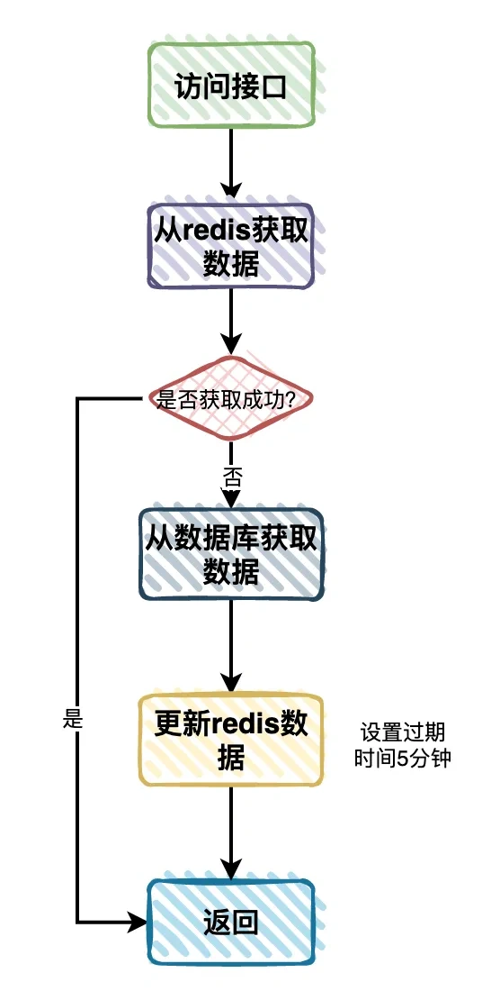
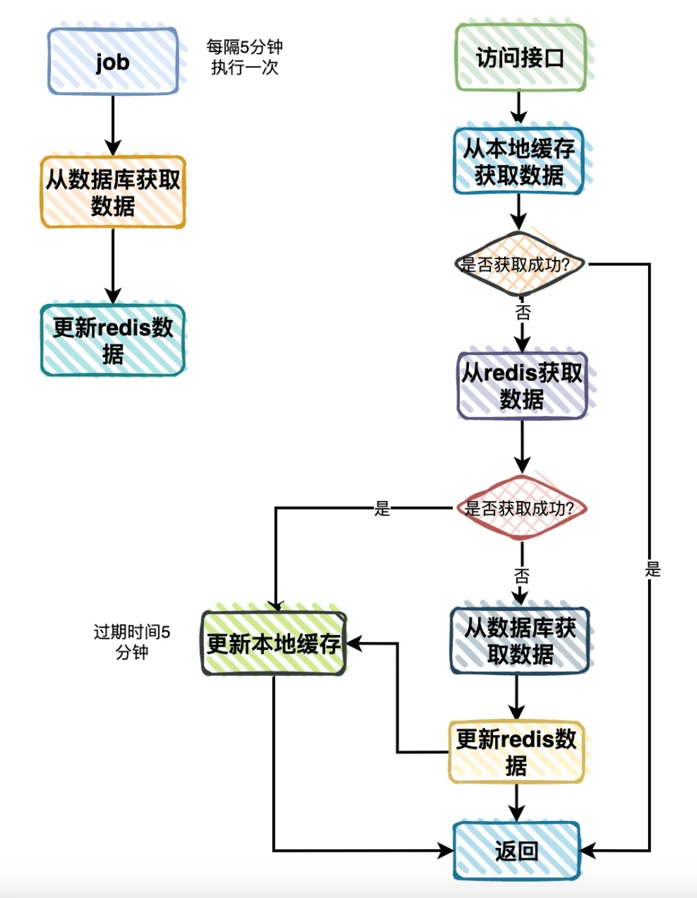

# Redis大key问题

## **<font style="color:rgb(34, 34, 34);background-color:rgb(248, 246, 244);">前言</font>**
<font style="color:rgb(51, 51, 51);background-color:rgb(248, 246, 244);">分类树查询功能，在各个业务系统中可以说随处可见，特别是在电商系统中。</font>

<font style="color:rgb(51, 51, 51);background-color:rgb(248, 246, 244);">但就是这样一个简单的分类树查询功能，我们却优化了5次。</font>

<font style="color:rgb(51, 51, 51);background-color:rgb(248, 246, 244);">到底是怎么回事呢？</font>

## **<font style="color:rgb(34, 34, 34);background-color:rgb(248, 246, 244);">背景</font>**
<font style="color:rgb(51, 51, 51);background-color:rgb(248, 246, 244);">我们的网站使用了SpringBoot推荐的模板引擎：Thymeleaf，进行动态渲染。</font>

<font style="color:rgb(51, 51, 51);background-color:rgb(248, 246, 244);">它是一个XML/XHTML/HTML5模板引擎，可用于Web与非Web环境中的应用开发。</font>

<font style="color:rgb(51, 51, 51);background-color:rgb(248, 246, 244);">它提供了一个用于整合SpringMVC的可选模块，在应用开发中，我们可以使用Thymeleaf来完全代替JSP或其他模板引擎，如Velocity\FreeMarker等。</font>

<font style="color:rgb(51, 51, 51);background-color:rgb(248, 246, 244);">前端开发写好Thymeleaf的模板文件，调用后端接口获取数据，进行动态绑定，就能把想要的内容展示给用户。</font>

<font style="color:rgb(51, 51, 51);background-color:rgb(248, 246, 244);">由于当时这个是从0-1的新项目，为了开快速开发功能，我们第一版接口，直接从数据库中查询分类数据，组装成分类树，然后返回给前端。</font>

<font style="color:rgb(51, 51, 51);background-color:rgb(248, 246, 244);">通过这种方式，简化了数据流程，快速把整个页面功能调通了。</font>

## **<font style="color:rgb(34, 34, 34);background-color:rgb(248, 246, 244);">第1次优化</font>**
<font style="color:rgb(51, 51, 51);background-color:rgb(248, 246, 244);">我们将该接口部署到dev环境，刚开始没啥问题。</font>

<font style="color:rgb(51, 51, 51);background-color:rgb(248, 246, 244);">随着开发人员添加的分类越来越多，很快就暴露出性能瓶颈。</font>

<font style="color:rgb(51, 51, 51);background-color:rgb(248, 246, 244);">我们不得不做优化了。</font>

<font style="color:rgb(51, 51, 51);background-color:rgb(248, 246, 244);">我们第一个想到的是：加Redis缓存。</font>

<font style="color:rgb(51, 51, 51);background-color:rgb(248, 246, 244);">流程图如下：</font>



<font style="color:rgb(51, 51, 51);background-color:rgb(248, 246, 244);">于是暂时这样优化了一下：</font>

1. <font style="color:rgb(51, 51, 51);background-color:rgb(248, 246, 244);">用户访问接口获取分类树时，先从Redis中查询数据。</font>
2. <font style="color:rgb(51, 51, 51);background-color:rgb(248, 246, 244);">如果Redis中有数据，则直接数据。</font>
3. <font style="color:rgb(51, 51, 51);background-color:rgb(248, 246, 244);">如果Redis中没有数据，则再从数据库中查询数据，拼接成分类树返回。</font>
4. <font style="color:rgb(51, 51, 51);background-color:rgb(248, 246, 244);">将从数据库中查到的分类树的数据，保存到Redis中，设置过期时间5分钟。</font>
5. <font style="color:rgb(51, 51, 51);background-color:rgb(248, 246, 244);">将分类树返回给用户。</font>

<font style="color:rgb(51, 51, 51);background-color:rgb(248, 246, 244);">我们在Redis中定义一个了key，value是一个分类树的json格式转换成了字符串，使用简单的key/value形式保存数据。</font>

<font style="color:rgb(51, 51, 51);background-color:rgb(248, 246, 244);">经过这样优化之后，dev环境的联调和自测顺利完成了。</font>

## **<font style="color:rgb(34, 34, 34);background-color:rgb(248, 246, 244);">第2次优化</font>**
<font style="color:rgb(51, 51, 51);background-color:rgb(248, 246, 244);">我们将这个功能部署到st环境了。</font>

<font style="color:rgb(51, 51, 51);background-color:rgb(248, 246, 244);">刚开始测试同学没有发现什么问题，但随着后面不断地深入测试，隔一段时间就出现一次首页访问很慢的情况。</font>

<font style="color:rgb(51, 51, 51);background-color:rgb(248, 246, 244);">于是，我们马上进行了第2次优化。</font>

<font style="color:rgb(51, 51, 51);background-color:rgb(248, 246, 244);">我们决定使用Job定期异步更新分类树到Redis中，在系统上线之前，会先生成一份数据。</font>

<font style="color:rgb(51, 51, 51);background-color:rgb(248, 246, 244);">当然为了保险起见，防止Redis在哪条突然挂了，之前分类树同步写入Redis的逻辑还是保留。</font>

<font style="color:rgb(51, 51, 51);background-color:rgb(248, 246, 244);">于是，流程图改成了这样：</font>


<font style="color:rgb(51, 51, 51);background-color:rgb(248, 246, 244);">增加了一个job每隔5分钟执行一次，从数据库中查询分类数据，封装成分类树，更新到Redis缓存中。</font>

<font style="color:rgb(51, 51, 51);background-color:rgb(248, 246, 244);">其他的流程保持不变。</font>

<font style="color:rgb(51, 51, 51);background-color:rgb(248, 246, 244);">此外，Redis的过期时间之前设置的5分钟，现在要改成永久。</font>

<font style="color:rgb(51, 51, 51);background-color:rgb(248, 246, 244);">通过这次优化之后，st环境就没有再出现过分类树查询的性能问题了。</font>

## **<font style="color:rgb(34, 34, 34);background-color:rgb(248, 246, 244);">第3次优化</font>**
<font style="color:rgb(51, 51, 51);background-color:rgb(248, 246, 244);">测试了一段时间之后，整个网站的功能快要上线了。</font>

<font style="color:rgb(51, 51, 51);background-color:rgb(248, 246, 244);">为了保险起见，我们需要对网站首页做一次压力测试。</font>

<font style="color:rgb(51, 51, 51);background-color:rgb(248, 246, 244);">果然测出问题了，网站首页最大的qps是100多，最后发现是每次都从Redis获取分类树导致的网站首页的性能瓶颈。</font>

<font style="color:rgb(51, 51, 51);background-color:rgb(248, 246, 244);">我们需要做第3次优化。</font>

<font style="color:rgb(51, 51, 51);background-color:rgb(248, 246, 244);">该怎么优化呢？</font>

<font style="color:rgb(51, 51, 51);background-color:rgb(248, 246, 244);">答：加内存缓存。</font>

<font style="color:rgb(51, 51, 51);background-color:rgb(248, 246, 244);">如果加了内存缓存，就需要考虑数据一致性问题。</font>

<font style="color:rgb(51, 51, 51);background-color:rgb(248, 246, 244);">内存缓存是保存在服务器节点上的，不同的服务器节点更新的频率可能有点差异，这样可能会导致数据的不一致性。</font>

<font style="color:rgb(51, 51, 51);background-color:rgb(248, 246, 244);">但分类本身是更新频率比较低的数据，对于用户来说不太敏感，即使在短时间内，用户看到的分类树有些差异，也不会对用户造成太大的影响。</font>

<font style="color:rgb(51, 51, 51);background-color:rgb(248, 246, 244);">因此，分类树这种业务场景，是可以使用内存缓存的。</font>

<font style="color:rgb(51, 51, 51);background-color:rgb(248, 246, 244);">于是，我们使用了Spring推荐的caffine作为内存缓存。</font>

<font style="color:rgb(51, 51, 51);background-color:rgb(248, 246, 244);">改造后的流程图如下：</font>



1. <font style="color:rgb(51, 51, 51);background-color:rgb(248, 246, 244);">用户访问接口时改成先从本地缓存分类数查询数据。</font>
2. <font style="color:rgb(51, 51, 51);background-color:rgb(248, 246, 244);">如果本地缓存有，则直接返回。</font>
3. <font style="color:rgb(51, 51, 51);background-color:rgb(248, 246, 244);">如果本地缓存没有，则从Redis中查询数据。</font>
4. <font style="color:rgb(51, 51, 51);background-color:rgb(248, 246, 244);">如果Redis中有数据，则将数据更新到本地缓存中，然后返回数据。</font>
5. <font style="color:rgb(51, 51, 51);background-color:rgb(248, 246, 244);">如果Redis中也没有数据（说明Redis挂了），则从数据库中查询数据，更新到Redis中（万一Redis恢复了呢），然后更新到本地缓存中，返回返回数据。</font>

<font style="color:rgb(100, 100, 100);background-color:rgb(248, 246, 244);">需要注意的是，需要改本地缓存设置一个过期时间，这里设置的5分钟，不然的话，没办法获取新的数据。</font>

<font style="color:rgb(51, 51, 51);background-color:rgb(248, 246, 244);">这样优化之后，再次做网站首页的压力测试，qps提升到了500多，满足上线要求。</font>

## **<font style="color:rgb(34, 34, 34);background-color:rgb(248, 246, 244);">第4次优化</font>**
<font style="color:rgb(51, 51, 51);background-color:rgb(248, 246, 244);">之后，这个功能顺利上线了。</font>

<font style="color:rgb(51, 51, 51);background-color:rgb(248, 246, 244);">使用了很长一段时间没有出现问题。</font>

<font style="color:rgb(51, 51, 51);background-color:rgb(248, 246, 244);">两年后的某一天，有用户反馈说，网站首页有点慢。</font>

<font style="color:rgb(51, 51, 51);background-color:rgb(248, 246, 244);">我们排查了一下原因发现，分类树的数据太多了，一次性返回了上万个分类。</font>

<font style="color:rgb(51, 51, 51);background-color:rgb(248, 246, 244);">原来在系统上线的这两年多的时间内，运营同学在系统后台增加了很多分类。</font>

<font style="color:rgb(51, 51, 51);background-color:rgb(248, 246, 244);">我们需要做第4次优化。</font>

<font style="color:rgb(51, 51, 51);background-color:rgb(248, 246, 244);">这时要如何优化呢？</font>

<font style="color:rgb(51, 51, 51);background-color:rgb(248, 246, 244);">限制分类树的数量？</font>

<font style="color:rgb(51, 51, 51);background-color:rgb(248, 246, 244);">答：也不太现实，目前这个业务场景就是有这么多分类，不能让用户选择不到他想要的分类吧？</font>

<font style="color:rgb(51, 51, 51);background-color:rgb(248, 246, 244);">这时我们想到最快的办法是开启nginx的GZip功能。</font>

<font style="color:rgb(51, 51, 51);background-color:rgb(248, 246, 244);">让数据在传输之前，先压缩一下，然后进行传输，在用户浏览器中，自动解压，将真实的分类树数据展示给用户。</font>

<font style="color:rgb(51, 51, 51);background-color:rgb(248, 246, 244);">之前调用接口返回的分类树有1MB的大小，优化之后，接口返回的分类树的大小是100Kb，一下子缩小了10倍。</font>

<font style="color:rgb(51, 51, 51);background-color:rgb(248, 246, 244);">这样简单的优化之后，性能提升了一些。</font>

## **<font style="color:rgb(34, 34, 34);background-color:rgb(248, 246, 244);">第5次优化</font>**
<font style="color:rgb(51, 51, 51);background-color:rgb(248, 246, 244);">经过上面优化之后，用户很长一段时间都没有反馈性能问题。</font>

<font style="color:rgb(51, 51, 51);background-color:rgb(248, 246, 244);">但有一天公司同事在排查Redis中大key的时候，揪出了分类树。之前的分类树使用key/value的结构保存数据的。</font>

<font style="color:rgb(51, 51, 51);background-color:rgb(248, 246, 244);">我们不得不做第5次优化。</font>

<font style="color:rgb(51, 51, 51);background-color:rgb(248, 246, 244);">为了优化在Redis中存储数据的大小，我们首先需要对数据进行瘦身。</font>

<font style="color:rgb(51, 51, 51);background-color:rgb(248, 246, 244);">只保存需要用到的字段。</font>

<font style="color:rgb(51, 51, 51);background-color:rgb(248, 246, 244);">例如：</font>

```kotlin
@AllArgsConstructor
@Data
public class Category {

    private Long id;
    private String name;
    private Long parentId;
    private Date inDate;
    private Long inUserId;
    private String inUserName;
    private List<Category> children;
}
```

<font style="color:rgb(51, 51, 51);background-color:rgb(248, 246, 244);">像这个分类对象中inDate、inUserId和inUserName字段是可以不用保存的。</font>

<font style="color:rgb(51, 51, 51);background-color:rgb(248, 246, 244);">修改自动名称。</font>

<font style="color:rgb(51, 51, 51);background-color:rgb(248, 246, 244);">例如：</font>

```less
@AllArgsConstructor
@Data
public class Category {
    /**
     * 分类编号
     */
    @JsonProperty("i")
    private Long id;

    /**
     * 分类层级
     */
    @JsonProperty("l")
    private Integer level;

    /**
     * 分类名称
     */
    @JsonProperty("n")
    private String name;

    /**
     * 父分类编号
     */
    @JsonProperty("p")
    private Long parentId;

    /**
     * 子分类列表
     */
    @JsonProperty("c")
    private List<Category> children;
}
```

<font style="color:rgb(51, 51, 51);background-color:rgb(248, 246, 244);">由于在一万多条数据中，每条数据的字段名称是固定的，他们的重复率太高了。</font>

<font style="color:rgb(51, 51, 51);background-color:rgb(248, 246, 244);">由此，可以在json序列化时，改成一个简短的名称，以便于返回更少的数据大小。</font>

<font style="color:rgb(51, 51, 51);background-color:rgb(248, 246, 244);">这还不够，需要对存储的数据做压缩。</font>

<font style="color:rgb(51, 51, 51);background-color:rgb(248, 246, 244);">之前在Redis中保存的key/value，其中的value是json格式的字符串。</font>

<font style="color:rgb(51, 51, 51);background-color:rgb(248, 246, 244);">其实RedisTemplate支持，value保存byte数组。</font>

<font style="color:rgb(51, 51, 51);background-color:rgb(248, 246, 244);">先将json字符串数据用GZip工具类压缩成byte数组，然后保存到Redis中。</font>

<font style="color:rgb(51, 51, 51);background-color:rgb(248, 246, 244);">再获取数据时，将byte数组转换成json字符串，然后再转换成分类树。</font>

<font style="color:rgb(51, 51, 51);background-color:rgb(248, 246, 244);">这样优化之后，保存到Redis中的分类树的数据大小，一下子减少了10倍，Redis的大key问题被解决了。</font>


> 更新: 2024-05-20 17:17:43  
> 原文: <https://www.yuque.com/yuqueyonghue6cvnv/cxhfwd/tmpeo4sp41pkqtcg>