# Redis高可用问题-

## **<font style="color:rgb(34, 34, 34);background-color:rgb(248, 246, 244);">前言</font>**
<font style="color:rgb(51, 51, 51);background-color:rgb(248, 246, 244);">我亲历过Redis宕机导致千万级损失的惨痛教训。</font>

**<font style="color:rgb(34, 34, 34);background-color:rgb(248, 246, 244);">真正的Redis高可用不是简单的主从复制，而是构建能自动愈合的分布式神经系统</font>**<font style="color:rgb(51, 51, 51);background-color:rgb(248, 246, 244);">。</font>

<font style="color:rgb(51, 51, 51);background-color:rgb(248, 246, 244);">这篇文章跟大家一起聊聊Redis如何保证高可用，希望对你会有所帮助。</font>

## **<font style="color:rgb(34, 34, 34);background-color:rgb(248, 246, 244);">一、主从复制：高可用的基石与陷阱</font>**
### **<font style="color:rgb(34, 34, 34);background-color:rgb(248, 246, 244);">主从复制全流程解析</font>**
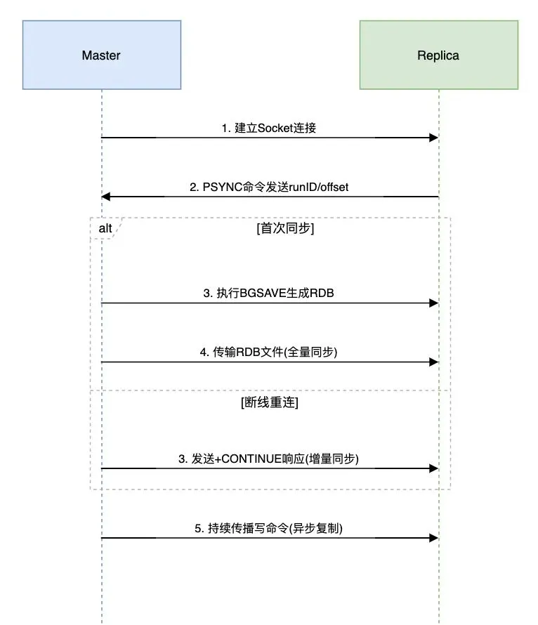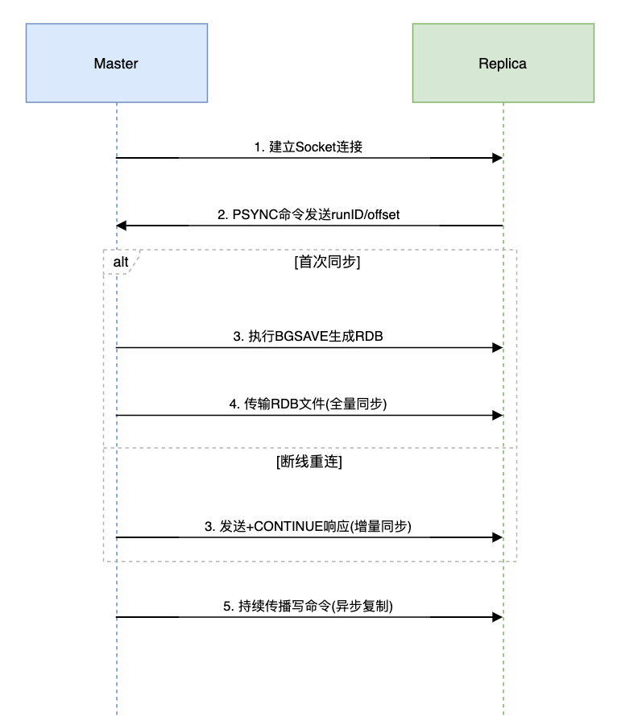

**<font style="color:rgb(34, 34, 34);background-color:rgb(248, 246, 244);">致命陷阱：异步复制导致的数据丢失</font>**

```plain
# 主节点写入后宕机（未同步到从节点）  
SET order:1001 "confirmed"  
# 从节点提升为主节点后，订单状态丢失
```

**<font style="color:rgb(34, 34, 34);background-color:rgb(248, 246, 244);">解决方案：</font>**

```java
// 强制同步写入（谨慎使用）  
Jedis jedis = new Jedis("master", 6379);  
jedis.waitReplicas(1, 1000); // 等待1个从节点同步
```

## **<font style="color:rgb(34, 34, 34);background-color:rgb(248, 246, 244);">二、哨兵模式：自动故障转移的艺术</font>**
### **<font style="color:rgb(34, 34, 34);background-color:rgb(248, 246, 244);">三节点哨兵集群部署</font>**
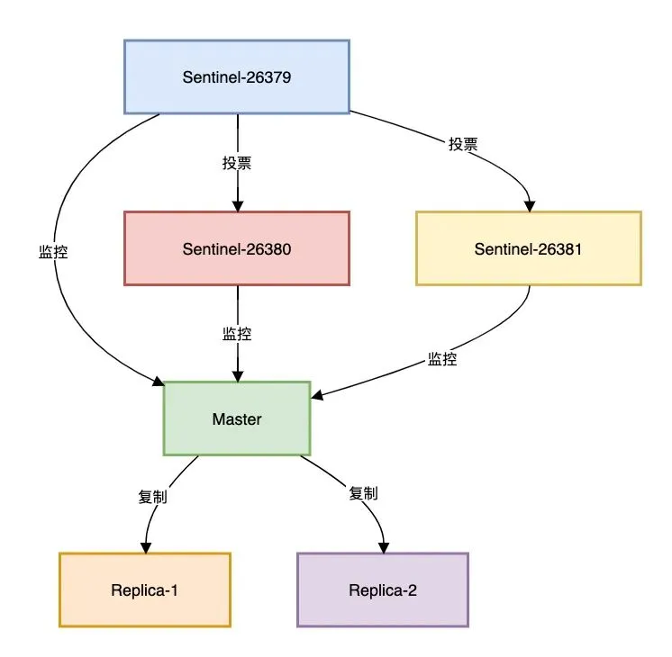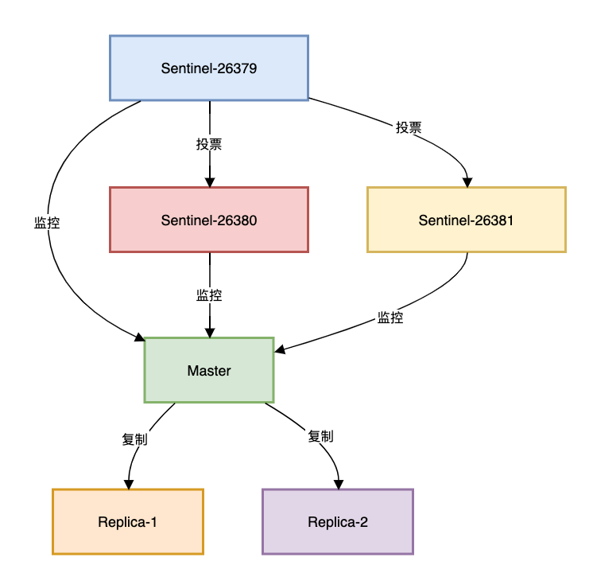

**<font style="color:rgb(34, 34, 34);background-color:rgb(248, 246, 244);">哨兵选举四部曲：</font>**

1. **<font style="color:rgb(34, 34, 34);background-color:rgb(248, 246, 244);">主观下线（SDOWN）</font>**<font style="color:rgb(51, 51, 51);background-color:rgb(248, 246, 244);">：单个哨兵检测到主节点失联</font>
2. **<font style="color:rgb(34, 34, 34);background-color:rgb(248, 246, 244);">客观下线（ODOWN）</font>**<font style="color:rgb(51, 51, 51);background-color:rgb(248, 246, 244);">：超过quorum数量的哨兵确认</font>
3. **<font style="color:rgb(34, 34, 34);background-color:rgb(248, 246, 244);">领导者选举</font>**<font style="color:rgb(51, 51, 51);background-color:rgb(248, 246, 244);">：基于Raft算法选出主哨兵</font>
4. **<font style="color:rgb(34, 34, 34);background-color:rgb(248, 246, 244);">故障转移</font>**<font style="color:rgb(51, 51, 51);background-color:rgb(248, 246, 244);">：提升最优从节点为新主节点</font>

**<font style="color:rgb(34, 34, 34);background-color:rgb(248, 246, 244);">Java客户端连接哨兵示例：</font>**

```csharp
Set<String> sentinels = new HashSet<>();  
sentinels.add("192.168.1.10:26379");  
sentinels.add("192.168.1.11:26379");  

JedisSentinelPool pool = new JedisSentinelPool(  
    "mymaster", sentinels, poolConfig);  

try (Jedis jedis = pool.getResource()) {  
    // 自动路由到当前主节点  
    jedis.set("config:timeout", "500");   
}
```

## **<font style="color:rgb(34, 34, 34);background-color:rgb(248, 246, 244);">三、Redis Cluster：水平扩展的终极方案</font>**
### **<font style="color:rgb(34, 34, 34);background-color:rgb(248, 246, 244);">数据分片原理</font>**
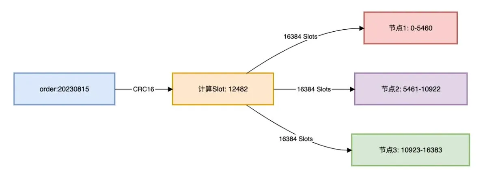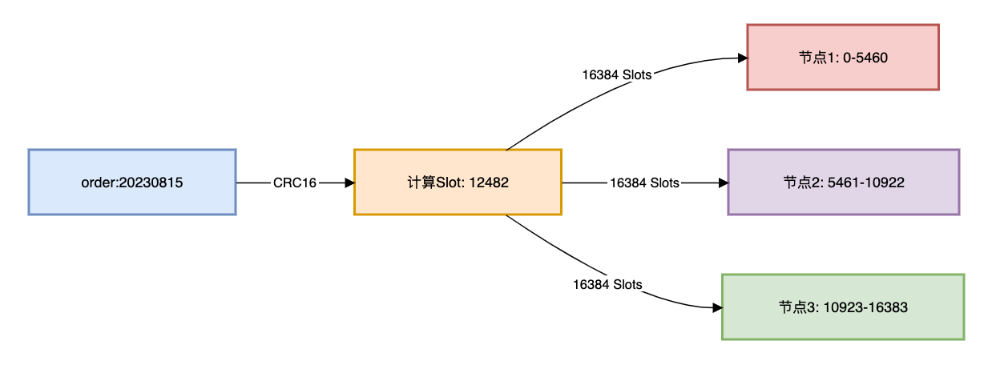

**<font style="color:rgb(34, 34, 34);background-color:rgb(248, 246, 244);">节点通信Gossip协议：</font>**

```plain
// 模拟节点间状态传播  
public void gossip(Node node) {  
    // 随机选择3个节点交换状态  
    List<Node> peers = selectRandomPeers(3);  
    for (Node peer : peers) {  
        sendPing(peer, currentState);  
    }  
}
```

**<font style="color:rgb(34, 34, 34);background-color:rgb(248, 246, 244);">跨槽位操作解决方案：</font>**

```plain
# 错误：多key不在同槽位  
MGET user:1001:name user:1002:age  

# 正确：使用hash tag强制同槽位  
MGET user:{1001}:name user:{1001}:age
```

## **<font style="color:rgb(34, 34, 34);background-color:rgb(248, 246, 244);">四、多级高可用架构设计</font>**
### **<font style="color:rgb(34, 34, 34);background-color:rgb(248, 246, 244);">电商平台真实案例</font>**
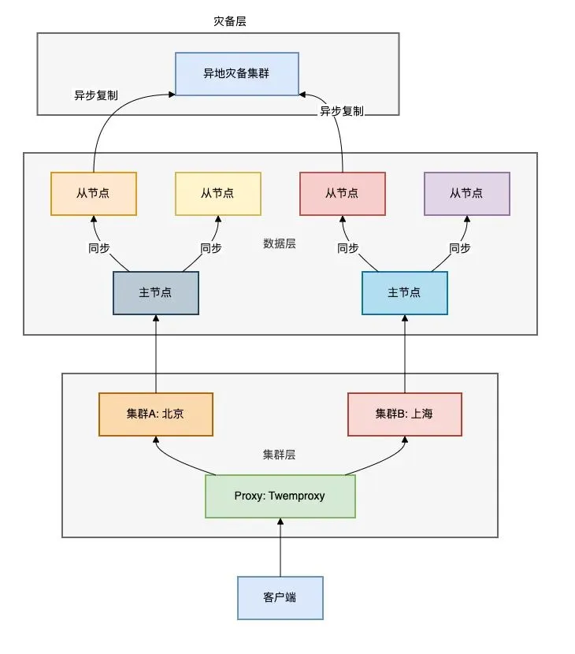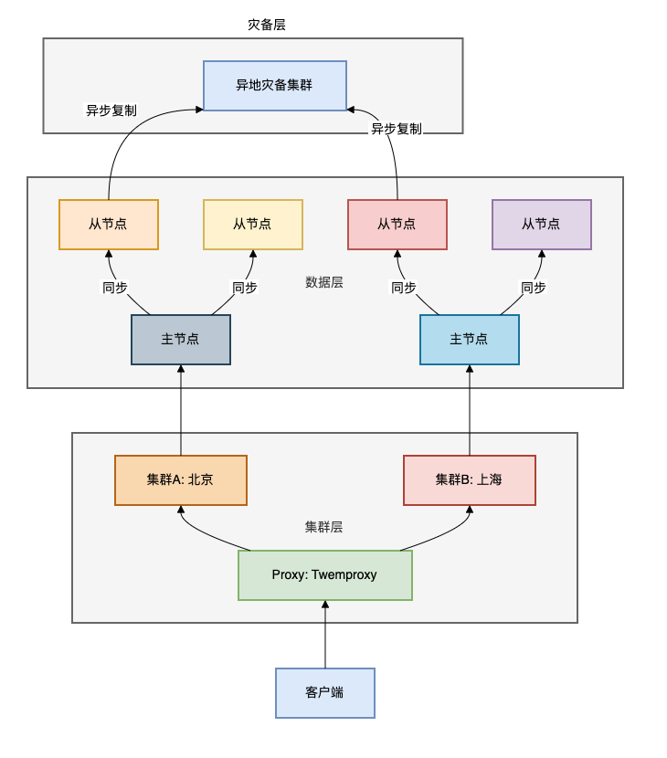

**<font style="color:rgb(34, 34, 34);background-color:rgb(248, 246, 244);">四层防护体系：</font>**

1. **<font style="color:rgb(34, 34, 34);background-color:rgb(248, 246, 244);">代理层</font>**<font style="color:rgb(51, 51, 51);background-color:rgb(248, 246, 244);">：Twemproxy自动路由+负载均衡</font>
2. **<font style="color:rgb(34, 34, 34);background-color:rgb(248, 246, 244);">集群层</font>**<font style="color:rgb(51, 51, 51);background-color:rgb(248, 246, 244);">：双集群互备+就近访问</font>
3. **<font style="color:rgb(34, 34, 34);background-color:rgb(248, 246, 244);">数据层</font>**<font style="color:rgb(51, 51, 51);background-color:rgb(248, 246, 244);">：1主2从+读写分离</font>
4. **<font style="color:rgb(34, 34, 34);background-color:rgb(248, 246, 244);">灾备层</font>**<font style="color:rgb(51, 51, 51);background-color:rgb(248, 246, 244);">：跨地域异步复制</font>

## **<font style="color:rgb(34, 34, 34);background-color:rgb(248, 246, 244);">五、避坑指南</font>**
### **<font style="color:rgb(34, 34, 34);background-color:rgb(248, 246, 244);">脑裂问题：最危险的故障模式</font>**
**<font style="color:rgb(34, 34, 34);background-color:rgb(248, 246, 244);">发生场景：</font>**

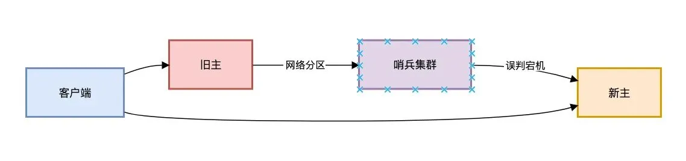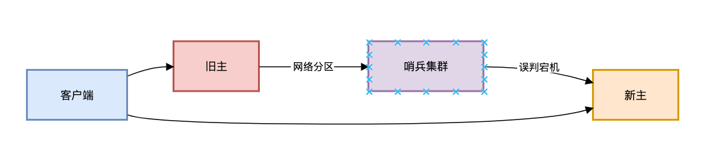

**<font style="color:rgb(34, 34, 34);background-color:rgb(248, 246, 244);">解决方案：</font>**

```plain
# 1. 增加哨兵节点数（至少3个）  
sentinel monitor mymaster 192.168.1.10 6379 2  

# 2. 设置主节点最小从节点数  
min-replicas-to-write 1
```

### **<font style="color:rgb(34, 34, 34);background-color:rgb(248, 246, 244);">缓存雪崩预防</font>**
```plain
// 缓存穿透+雪崩防护代码示例  
public String getProductInfo(String id) {  
    // 1. 查询缓存  
    String cacheKey = "product:" + id;  
    String value = jedis.get(cacheKey);  

    // 2. 缓存穿透：空值缓存  
    if ("NULL_OBJ".equals(value)) return null;  

    // 3. 缓存未命中  
    if (value == null) {  
        // 4. 互斥锁防止雪崩  
        if (jedis.setnx("lock:"+id, "1") == 1) {  
            jedis.expire("lock:"+id, 3); // 避免死锁  
            try {  
                // 5. 数据库查询  
                value = db.query("SELECT...");  
                // 6. 空结果防穿透  
                jedis.setex(cacheKey, 300, value == null ? "NULL_OBJ" : value);  
            } finally {  
                jedis.del("lock:"+id);  
            }  
        } else {  
            // 7. 其他线程等待重试  
            Thread.sleep(100);  
            return getProductInfo(id);  
        }  
    }  
    return value;  
}
```

## **<font style="color:rgb(34, 34, 34);background-color:rgb(248, 246, 244);">六、监控体系：高可用的生命线</font>**
**<font style="color:rgb(34, 34, 34);background-color:rgb(248, 246, 244);">告警规则示例：</font>**

```plain
# 复制延迟 > 5秒  
repl_delay{instance="*"} > 5  

# 内存使用 > 90%  
memory_used_percentage > 0.9  

# 连接数 > 80%上限  
connected_clients / maxclients > 0.8
```

## **<font style="color:rgb(34, 34, 34);background-color:rgb(248, 246, 244);">总结</font>**
**<font style="color:rgb(34, 34, 34);background-color:rgb(248, 246, 244);">三级防御体系：</font>**

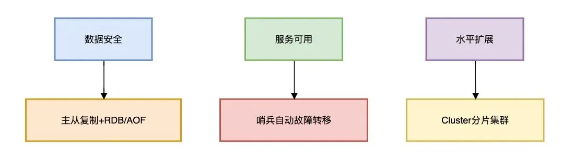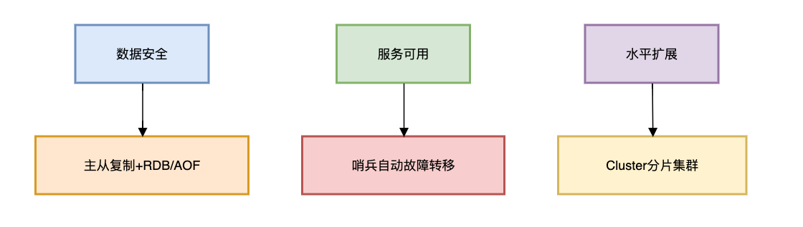

**<font style="color:rgb(34, 34, 34);background-color:rgb(248, 246, 244);">五个核心原则：</font>**

1. **<font style="color:rgb(34, 34, 34);background-color:rgb(248, 246, 244);">冗余设计</font>**<font style="color:rgb(51, 51, 51);background-color:rgb(248, 246, 244);">：最少1主2从，跨机架部署</font>
2. **<font style="color:rgb(34, 34, 34);background-color:rgb(248, 246, 244);">自动故障转移</font>**<font style="color:rgb(51, 51, 51);background-color:rgb(248, 246, 244);">：哨兵quorum数 = 节点数/2 + 1</font>
3. **<font style="color:rgb(34, 34, 34);background-color:rgb(248, 246, 244);">容量规划</font>**<font style="color:rgb(51, 51, 51);background-color:rgb(248, 246, 244);">：内存使用率控制在70%以下</font>
4. **<font style="color:rgb(34, 34, 34);background-color:rgb(248, 246, 244);">性能隔离</font>**<font style="color:rgb(51, 51, 51);background-color:rgb(248, 246, 244);">：业务集群物理隔离</font>
5. **<font style="color:rgb(34, 34, 34);background-color:rgb(248, 246, 244);">混沌工程</font>**<font style="color:rgb(51, 51, 51);background-color:rgb(248, 246, 244);">：定期模拟节点宕机、网络分区</font>

<font style="color:rgb(100, 100, 100);background-color:rgb(248, 246, 244);">高可用的本质不是避免故障，而是在故障发生时系统仍能持续提供服务。</font>

<font style="color:rgb(51, 51, 51);background-color:rgb(248, 246, 244);">通过主从复制、哨兵机制、Cluster集群的三级防御，配合严谨的监控和容量规划，才能构建真正弹性的Redis架构。</font>


> 更新: 2025-09-01 11:51:56  
> 原文: <https://www.yuque.com/yuqueyonghue6cvnv/cxhfwd/vxhwu7gwk4c4h5tq>