# 使用缓存踩过的一些坑

## **<font style="color:rgb(34, 34, 34);background-color:rgb(248, 246, 244);">前言</font>**
<font style="color:rgb(51, 51, 51);background-color:rgb(248, 246, 244);">缓存在我们日常工作中，经常会使用，但如果用不好坑也挺多的。</font>

<font style="color:rgb(51, 51, 51);background-color:rgb(248, 246, 244);">这篇文章总结了我工作中使用缓存遇到过的7个坑，还是非常有参考价值得，希望对你会有所帮助。</font>

## **<font style="color:rgb(34, 34, 34);background-color:rgb(248, 246, 244);">1 缓存穿透</font>**
<font style="color:rgb(51, 51, 51);background-color:rgb(248, 246, 244);">大部分情况下，加缓存的目的是：为了减轻数据库的压力，提升系统的性能。</font>

<font style="color:rgb(51, 51, 51);background-color:rgb(248, 246, 244);">一般情况下，如果有用户请求过来，先查缓存，如果缓存中存在数据，则直接返回。</font>

<font style="color:rgb(51, 51, 51);background-color:rgb(248, 246, 244);">如果缓存中不存在，则再查数据库，如果数据库中存在，则将数据放入缓存，然后返回。如果数据库中也不存在，则直接返回失败。</font>

<font style="color:rgb(51, 51, 51);background-color:rgb(248, 246, 244);">流程图如下：</font>

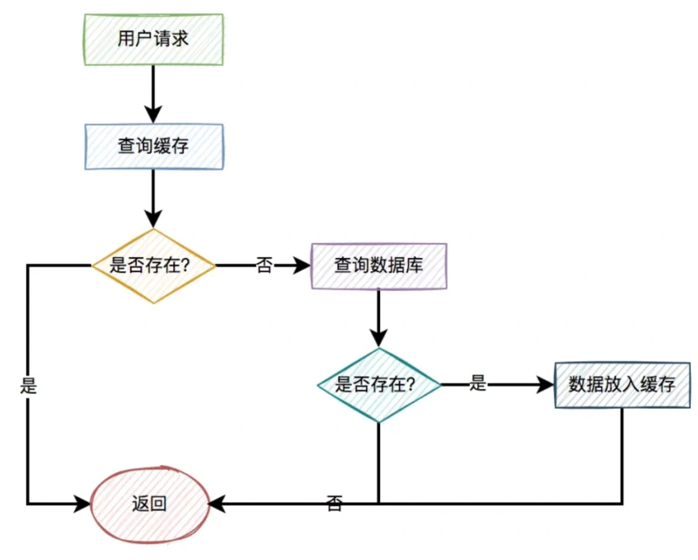

<font style="color:rgb(51, 51, 51);background-color:rgb(248, 246, 244);">但如果出现以下这两种特殊情况，比如：</font>

+ <font style="color:rgb(51, 51, 51);background-color:rgb(248, 246, 244);">用户请求的id在缓存中不存在。</font>
+ <font style="color:rgb(51, 51, 51);background-color:rgb(248, 246, 244);">恶意用户伪造不存在的id发起请求。</font>

<font style="color:rgb(51, 51, 51);background-color:rgb(248, 246, 244);">这样的用户请求导致的结果是：每次从缓存中都查不到数据，而需要查询数据库，同时数据库中也没有查到该数据，也没法放入缓存。</font>

<font style="color:rgb(51, 51, 51);background-color:rgb(248, 246, 244);">也就是说，每次这个用户请求过来的时候，都要查询一次数据库。</font>

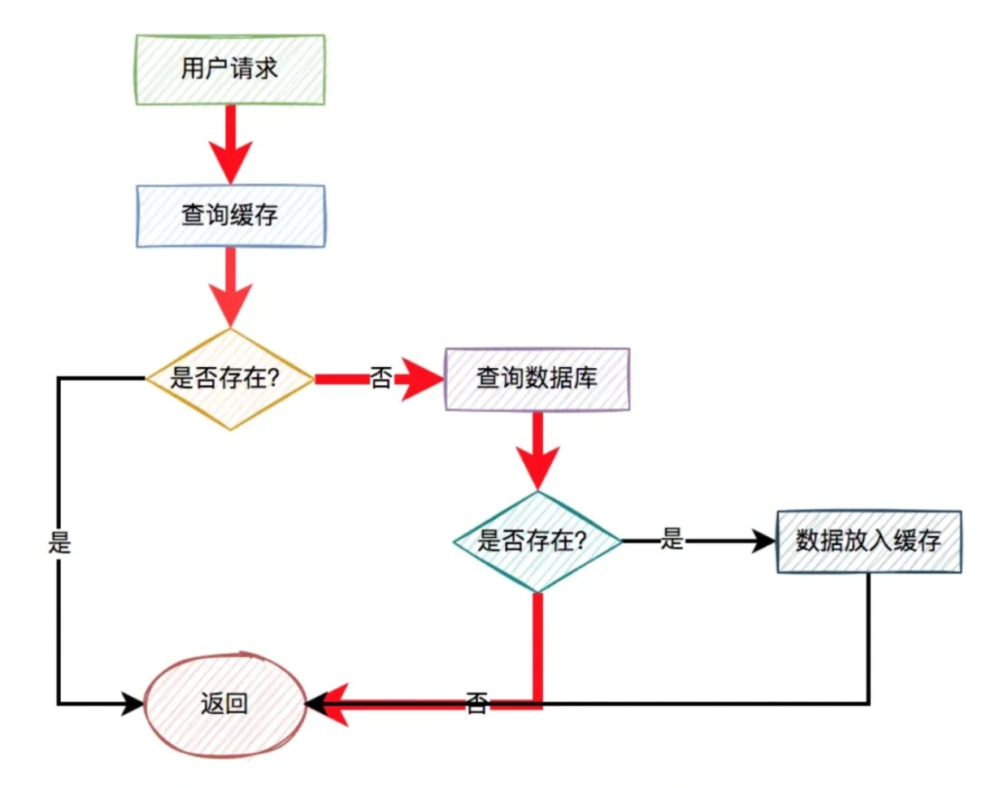

<font style="color:rgb(51, 51, 51);background-color:rgb(248, 246, 244);">图中标红的箭头表示每次走的路线。</font>

<font style="color:rgb(51, 51, 51);background-color:rgb(248, 246, 244);">很显然，缓存根本没起作用，好像被穿透了一样，每次都会去访问数据库。</font>

<font style="color:rgb(51, 51, 51);background-color:rgb(248, 246, 244);">这就是我们所说的：缓存穿透问题。</font>

<font style="color:rgb(51, 51, 51);background-color:rgb(248, 246, 244);">如果此时穿透了缓存，而直接数据库的请求数量非常多，数据库可能因为扛不住压力而挂掉。呜呜呜。</font>

<font style="color:rgb(51, 51, 51);background-color:rgb(248, 246, 244);">那么问题来了，如何解决这个问题呢？</font>

### **<font style="color:rgb(34, 34, 34);background-color:rgb(248, 246, 244);">1.1 校验参数</font>**
<font style="color:rgb(51, 51, 51);background-color:rgb(248, 246, 244);">我们可以对用户id做检验。</font>

<font style="color:rgb(51, 51, 51);background-color:rgb(248, 246, 244);">比如你的合法id是15xxxxxx，以15开头的。如果用户传入了16开头的id，比如：16232323，则参数校验失败，直接把相关请求拦截掉。这样可以过滤掉一部分恶意伪造的用户id。</font>

### **<font style="color:rgb(34, 34, 34);background-color:rgb(248, 246, 244);">1.2 使用布隆过滤器</font>**
<font style="color:rgb(51, 51, 51);background-color:rgb(248, 246, 244);">如果数据比较少，我们可以把数据库中的数据，全部放到内存的一个map中。</font>

<font style="color:rgb(51, 51, 51);background-color:rgb(248, 246, 244);">这样能够非常快速的识别，数据在缓存中是否存在。如果存在，则让其访问缓存。如果不存在，则直接拒绝该请求。</font>

<font style="color:rgb(51, 51, 51);background-color:rgb(248, 246, 244);">但如果数据量太多了，有数千万或者上亿的数据，全都放到内存中，很显然会占用太多的内存空间。</font>

<font style="color:rgb(51, 51, 51);background-color:rgb(248, 246, 244);">那么，有没有办法减少内存空间呢？</font>

<font style="color:rgb(51, 51, 51);background-color:rgb(248, 246, 244);">答：这就需要使用布隆过滤器了。</font>

<font style="color:rgb(51, 51, 51);background-color:rgb(248, 246, 244);">布隆过滤器底层使用bit数组存储数据，该数组中的元素默认值是0。</font>

<font style="color:rgb(51, 51, 51);background-color:rgb(248, 246, 244);">布隆过滤器第一次初始化的时候，会把数据库中所有已存在的key，经过一些列的hash算法（比如：三次hash算法）计算，每个key都会计算出多个位置，然后把这些位置上的元素值设置成1。</font>

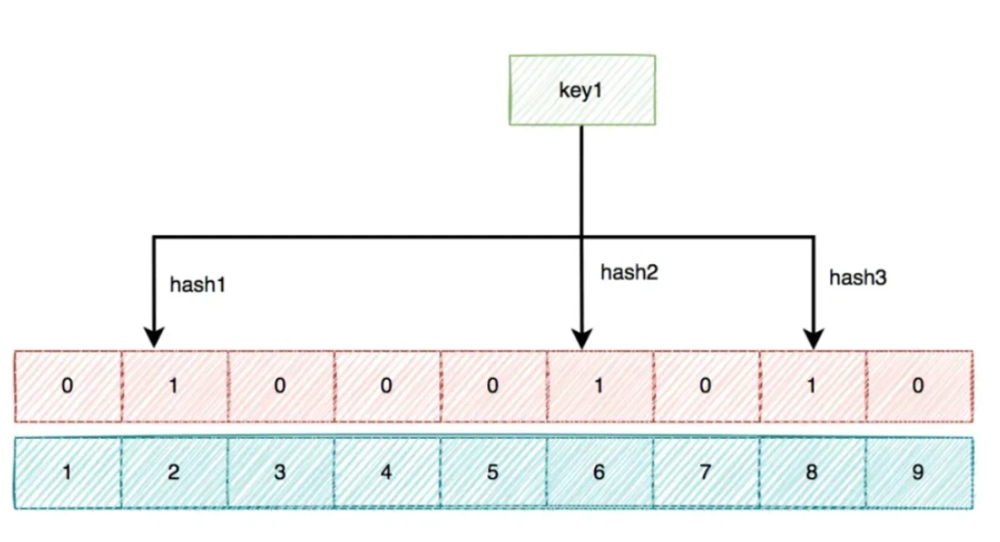

<font style="color:rgb(51, 51, 51);background-color:rgb(248, 246, 244);">之后，有用户key请求过来的时候，再用相同的hash算法计算位置。</font>

+ <font style="color:rgb(51, 51, 51);background-color:rgb(248, 246, 244);">如果多个位置中的元素值都是1，则说明该key在数据库中已存在。这时允许继续往后面操作。</font>
+ <font style="color:rgb(51, 51, 51);background-color:rgb(248, 246, 244);">如果有1个以上的位置上的元素值是0，则说明该key在数据库中不存在。这时可以拒绝该请求，而直接返回。</font>

### **<font style="color:rgb(34, 34, 34);background-color:rgb(248, 246, 244);">1.3 缓存空值</font>**
<font style="color:rgb(51, 51, 51);background-color:rgb(248, 246, 244);">上面使用布隆过滤器，虽说可以过滤掉很多不存在的用户id请求。但它除了增加系统的复杂度之外，会带来两个问题：</font>

+ <font style="color:rgb(51, 51, 51);background-color:rgb(248, 246, 244);">布隆过滤器存在误杀的情况，可能会把少部分正常用户的请求也过滤了。</font>
+ <font style="color:rgb(51, 51, 51);background-color:rgb(248, 246, 244);">如果用户信息有变化，需要实时同步到布隆过滤器，不然会有问题。</font>

<font style="color:rgb(51, 51, 51);background-color:rgb(248, 246, 244);">所以，通常情况下，我们很少用布隆过滤器解决缓存穿透问题。其实，还有另外一种更简单的方案，即：缓存空值。</font>

<font style="color:rgb(51, 51, 51);background-color:rgb(248, 246, 244);">当某个用户id在缓存中查不到，在数据库中也查不到时，也需要将该用户id缓存起来，只不过值是空的。</font>

<font style="color:rgb(51, 51, 51);background-color:rgb(248, 246, 244);">这样后面的请求，再拿相同的用户id发起请求时，就能从缓存中获取空数据，直接返回了，而无需再去查一次数据库。</font>

<font style="color:rgb(51, 51, 51);background-color:rgb(248, 246, 244);">优化之后的流程图如下：</font>

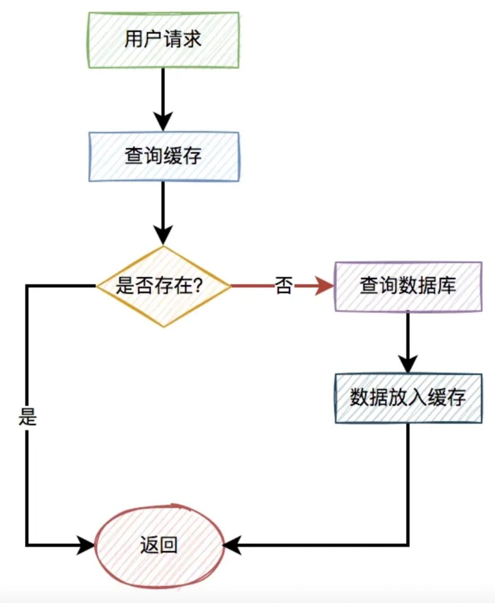

<font style="color:rgb(51, 51, 51);background-color:rgb(248, 246, 244);">关键点是不管从数据库有没有查到数据，都将结果放入缓存中，只是如果没有查到数据，缓存中的值是空的罢了。</font>

## **<font style="color:rgb(34, 34, 34);background-color:rgb(248, 246, 244);">2 缓存击穿</font>**
<font style="color:rgb(51, 51, 51);background-color:rgb(248, 246, 244);">有时候，我们在访问热点数据时。比如：我们在某个商城购买某个热门商品。</font>

<font style="color:rgb(51, 51, 51);background-color:rgb(248, 246, 244);">为了保证访问速度，通常情况下，商城系统会把商品信息放到缓存中。但如果某个时刻，该商品到了过期时间失效了。</font>

<font style="color:rgb(51, 51, 51);background-color:rgb(248, 246, 244);">此时，如果有大量的用户请求同一个商品，但该商品在缓存中失效了，一下子这些用户请求都直接怼到数据库，可能会造成瞬间数据库压力过大，而直接挂掉。</font>

<font style="color:rgb(51, 51, 51);background-color:rgb(248, 246, 244);">流程图如下：</font>

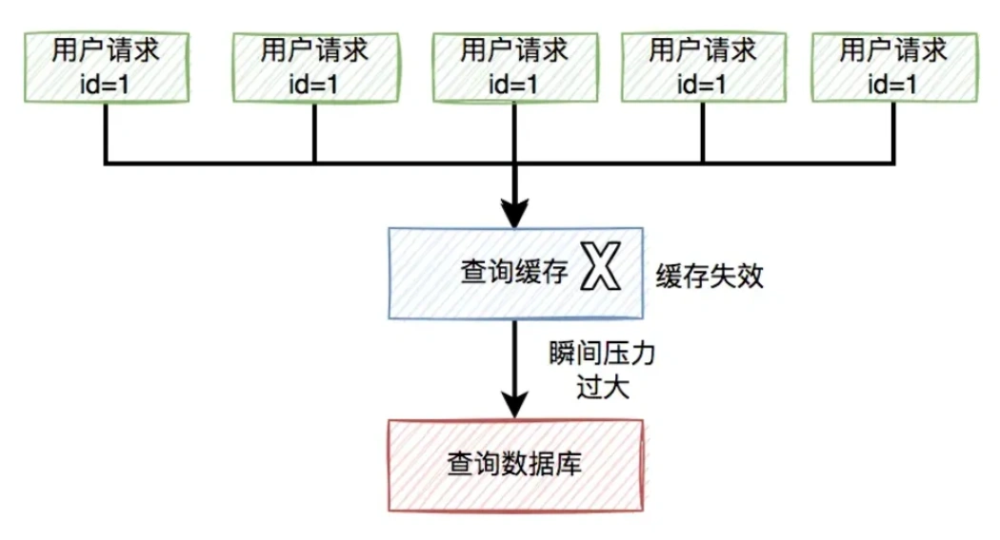

<font style="color:rgb(51, 51, 51);background-color:rgb(248, 246, 244);">那么，如何解决这个问题呢？</font>

### **<font style="color:rgb(34, 34, 34);background-color:rgb(248, 246, 244);">2.1 加锁</font>**
<font style="color:rgb(51, 51, 51);background-color:rgb(248, 246, 244);">数据库压力过大的根源是，因为同一时刻太多的请求访问了数据库。</font>

<font style="color:rgb(51, 51, 51);background-color:rgb(248, 246, 244);">如果我们能够限制，同一时刻只有一个请求才能访问某个productId的数据库商品信息，不就能解决问题了？</font>

<font style="color:rgb(51, 51, 51);background-color:rgb(248, 246, 244);">答：没错，我们可以用加锁的方式，实现上面的功能。</font>

<font style="color:rgb(51, 51, 51);background-color:rgb(248, 246, 244);">伪代码如下：</font>

```kotlin
try {
  String result = jedis.set(productId, requestId, "NX", "PX", expireTime);
  if ("OK".equals(result)) {
    return queryProductFromDbById(productId);
  }
} finally{
    unlock(productId,requestId);
}  
return null;
```

<font style="color:rgb(51, 51, 51);background-color:rgb(248, 246, 244);">在访问数据库时加锁，防止多个相同productId的请求同时访问数据库。</font>

<font style="color:rgb(51, 51, 51);background-color:rgb(248, 246, 244);">然后，还需要一段代码，把从数据库中查询到的结果，又重新放入缓存中。办法挺多的，在这里我就不展开了。</font>

### **<font style="color:rgb(34, 34, 34);background-color:rgb(248, 246, 244);">2.2 自动续期</font>**
<font style="color:rgb(51, 51, 51);background-color:rgb(248, 246, 244);">出现缓存击穿问题是由于key过期了导致的。那么，我们换一种思路，在key快要过期之前，就自动给它续期，不就OK了？</font>

<font style="color:rgb(51, 51, 51);background-color:rgb(248, 246, 244);">答：没错，我们可以用job给指定key自动续期。</font>

<font style="color:rgb(51, 51, 51);background-color:rgb(248, 246, 244);">比如说，我们有个分类功能，设置的缓存过期时间是30分钟。但有个job每隔20分钟执行一次，自动更新缓存，重新设置过期时间为30分钟。</font>

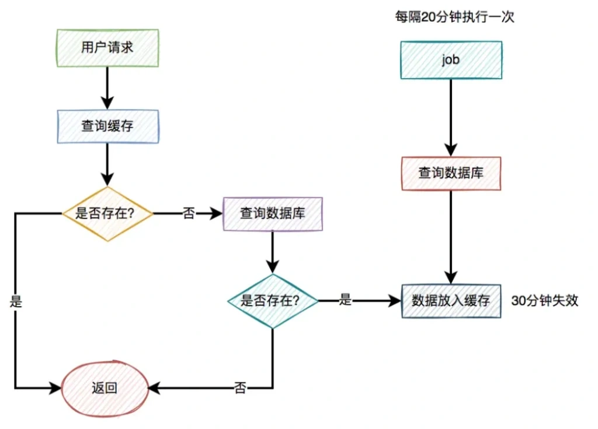

<font style="color:rgb(51, 51, 51);background-color:rgb(248, 246, 244);">这样就能保证，分类缓存不会失效。</font>

### **<font style="color:rgb(34, 34, 34);background-color:rgb(248, 246, 244);">2.3 永久有效</font>**
<font style="color:rgb(51, 51, 51);background-color:rgb(248, 246, 244);">此外，对于很多热门key，其实是可以不用设置过期时间，让其永久有效的。</font>

<font style="color:rgb(51, 51, 51);background-color:rgb(248, 246, 244);">比如参与秒杀活动的热门商品，由于这类商品id并不多，在缓存中我们可以不设置过期时间。</font>

<font style="color:rgb(51, 51, 51);background-color:rgb(248, 246, 244);">在秒杀活动开始前，我们先用一个程序提前从数据库中查询出商品的数据，然后同步到缓存中，提前做预热。</font>

<font style="color:rgb(51, 51, 51);background-color:rgb(248, 246, 244);">等秒杀活动结束一段时间之后，我们再手动删除这些无用的缓存即可。</font>

## **<font style="color:rgb(34, 34, 34);background-color:rgb(248, 246, 244);">3 缓存雪崩</font>**
<font style="color:rgb(51, 51, 51);background-color:rgb(248, 246, 244);">而缓存雪崩是缓存击穿的升级版，缓存击穿说的是某一个热门key失效了，而缓存雪崩说的是有多个热门key同时失效。</font>

<font style="color:rgb(51, 51, 51);background-color:rgb(248, 246, 244);">看起来，如果发生缓存雪崩，问题更严重。</font>

<font style="color:rgb(51, 51, 51);background-color:rgb(248, 246, 244);">缓存雪崩目前有两种：</font>

+ <font style="color:rgb(51, 51, 51);background-color:rgb(248, 246, 244);">有大量的热门缓存，同时失效。会导致大量的请求，访问数据库。而数据库很有可能因为扛不住压力，而直接挂掉。</font>
+ <font style="color:rgb(51, 51, 51);background-color:rgb(248, 246, 244);">缓存服务器down机了，可能是机器硬件问题，或者机房网络问题。总之，造成了整个缓存的不可用。</font>

<font style="color:rgb(51, 51, 51);background-color:rgb(248, 246, 244);">归根结底都是有大量的请求，透过缓存，而直接访问数据库了。</font>

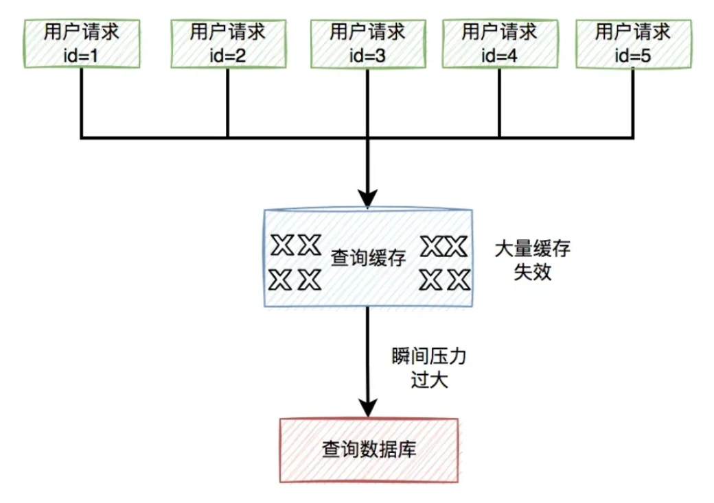

<font style="color:rgb(51, 51, 51);background-color:rgb(248, 246, 244);">那么，要如何解决这个问题呢？</font>

### **<font style="color:rgb(34, 34, 34);background-color:rgb(248, 246, 244);">3.1 过期时间加随机数</font>**
<font style="color:rgb(51, 51, 51);background-color:rgb(248, 246, 244);">为了解决缓存雪崩问题，我们首先要尽量避免缓存同时失效的情况发生。</font>

<font style="color:rgb(51, 51, 51);background-color:rgb(248, 246, 244);">这就要求我们不要设置相同的过期时间。</font>

<font style="color:rgb(51, 51, 51);background-color:rgb(248, 246, 244);">可以在设置的过期时间基础上，再加个1~60秒的随机数。</font>

```plain
实际过期时间 = 过期时间 + 1~60秒的随机数
```

<font style="color:rgb(51, 51, 51);background-color:rgb(248, 246, 244);">这样即使在高并发的情况下，多个请求同时设置过期时间，由于有随机数的存在，也不会出现太多相同的过期key。</font>

### **<font style="color:rgb(34, 34, 34);background-color:rgb(248, 246, 244);">3.2 保证高可用</font>**
<font style="color:rgb(51, 51, 51);background-color:rgb(248, 246, 244);">针对缓存服务器down机的情况，在前期做系统设计时，可以做一些高可用架构。</font>

<font style="color:rgb(51, 51, 51);background-color:rgb(248, 246, 244);">比如：如果使用了redis，可以使用哨兵模式，或者集群模式，避免出现单节点故障导致整个redis服务不可用的情况。</font>

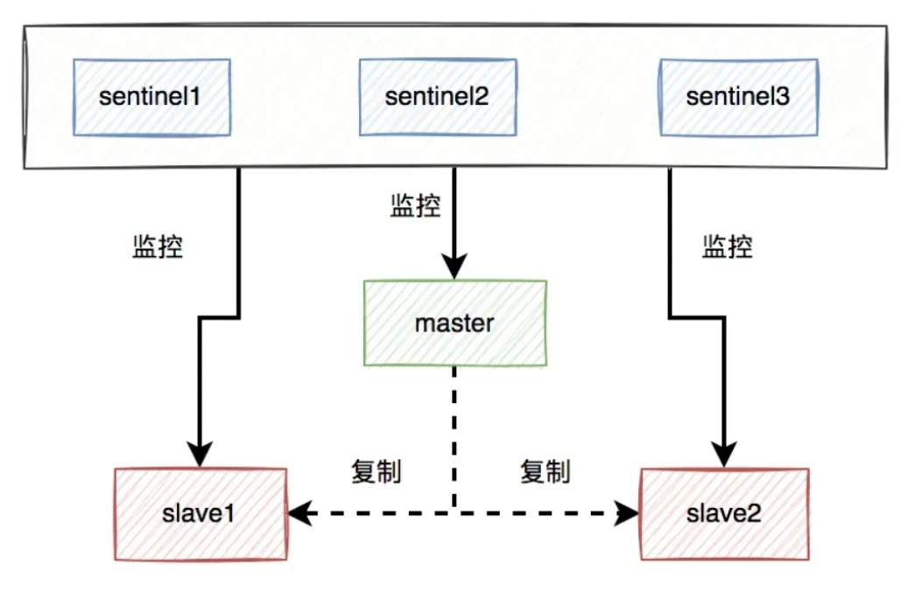

<font style="color:rgb(51, 51, 51);background-color:rgb(248, 246, 244);">使用哨兵模式之后，当某个master服务下线时，自动将该master下的某个slave服务升级为master服务，替代已下线的master服务继续处理请求。</font>

### **<font style="color:rgb(34, 34, 34);background-color:rgb(248, 246, 244);">3.3 服务降级</font>**
<font style="color:rgb(51, 51, 51);background-color:rgb(248, 246, 244);">如果做了高可用架构，redis服务还是挂了，该怎么办呢？</font>

<font style="color:rgb(51, 51, 51);background-color:rgb(248, 246, 244);">这时候，就需要做服务降级了。</font>

<font style="color:rgb(51, 51, 51);background-color:rgb(248, 246, 244);">我们需要配置一些默认的兜底数据。</font>

<font style="color:rgb(51, 51, 51);background-color:rgb(248, 246, 244);">程序中有个全局开关，比如有10个请求在最近一分钟内，从redis中获取数据失败，则全局开关打开。后面的新请求，就直接从配置中心中获取默认的数据。</font>

<font style="color:rgb(51, 51, 51);background-color:rgb(248, 246, 244);">当然，还需要有个job，每隔一定时间去从redis中获取数据，如果在最近一分钟内可以获取到两次数据（这个参数可以自己定），则把全局开关关闭。后面来的请求，又可以正常从redis中获取数据了。</font>

<font style="color:rgb(51, 51, 51);background-color:rgb(248, 246, 244);">需要特别说一句，该方案并非所有的场景都适用，需要根据实际业务场景决定。</font>

## **<font style="color:rgb(34, 34, 34);background-color:rgb(248, 246, 244);">4 数据不一致</font>**
<font style="color:rgb(51, 51, 51);background-color:rgb(248, 246, 244);">数据库和缓存（比如：redis）双写数据一致性问题，是一个跟开发语言无关的公共问题。尤其在高并发的场景下，这个问题变得更加严重。</font>

<font style="color:rgb(51, 51, 51);background-color:rgb(248, 246, 244);">那么，我们该如何更新缓存呢？</font>

<font style="color:rgb(51, 51, 51);background-color:rgb(248, 246, 244);">目前有以下4种方案：</font>

+ <font style="color:rgb(51, 51, 51);background-color:rgb(248, 246, 244);">先写缓存，再写数据库</font>
+ <font style="color:rgb(51, 51, 51);background-color:rgb(248, 246, 244);">先写数据库，再写缓存</font>
+ <font style="color:rgb(51, 51, 51);background-color:rgb(248, 246, 244);">先删缓存，再写数据库</font>
+ <font style="color:rgb(51, 51, 51);background-color:rgb(248, 246, 244);">先写数据库，再删缓存</font>

### **<font style="color:rgb(34, 34, 34);background-color:rgb(248, 246, 244);">4.1 先写缓存，再写数据库</font>**
<font style="color:rgb(51, 51, 51);background-color:rgb(248, 246, 244);">对于更新缓存的方案，很多人第一个想到的可能是在写操作中直接更新缓存（写缓存），更直接明了。</font>

<font style="color:rgb(51, 51, 51);background-color:rgb(248, 246, 244);">那么，问题来了：在写操作中，到底是先写缓存，还是先写数据库呢？</font>

<font style="color:rgb(51, 51, 51);background-color:rgb(248, 246, 244);">我们在这里先聊聊先写缓存，再写数据库的情况，因为它的问题最严重。</font>

<font style="color:rgb(51, 51, 51);background-color:rgb(248, 246, 244);">某一个用户的每一次写操作，如果刚写完缓存，突然网络出现了异常，导致写数据库失败了。</font>

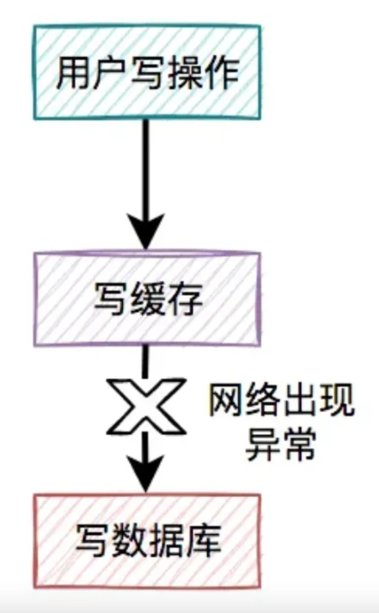

<font style="color:rgb(51, 51, 51);background-color:rgb(248, 246, 244);">其结果是缓存更新成了最新数据，但数据库没有，这样缓存中的数据不就变成脏数据了？如果此时该用户的查询请求，正好读取到该数据，就会出现问题，因为该数据在数据库中根本不存在，这个问题非常严重。</font>

<font style="color:rgb(51, 51, 51);background-color:rgb(248, 246, 244);">我们都知道，缓存的主要目的是把数据库的数据临时保存在内存，便于后续的查询，提升查询速度。</font>

<font style="color:rgb(51, 51, 51);background-color:rgb(248, 246, 244);">但如果某条数据，在数据库中都不存在，你缓存这种“假数据”又有啥意义呢？</font>

<font style="color:rgb(51, 51, 51);background-color:rgb(248, 246, 244);">因此，先写缓存，再写数据库的方案是不可取的，在实际工作中用得不多。</font>

### **<font style="color:rgb(34, 34, 34);background-color:rgb(248, 246, 244);">4.2 先写数据库，再写缓存</font>**
<font style="color:rgb(51, 51, 51);background-color:rgb(248, 246, 244);">既然上面的方案行不通，接下来，聊聊先写数据库，再写缓存的方案，该方案在低并发编程中有人在用（我猜的）。</font>

<font style="color:rgb(51, 51, 51);background-color:rgb(248, 246, 244);">用户的写操作，先写数据库，再写缓存，可以避免之前“假数据”的问题。但它却带来了新的问题。</font>

<font style="color:rgb(51, 51, 51);background-color:rgb(248, 246, 244);">什么问题呢？</font>

**<font style="color:rgb(34, 34, 34);background-color:rgb(248, 246, 244);">4.2.1 写缓存失败了</font>**

<font style="color:rgb(51, 51, 51);background-color:rgb(248, 246, 244);">如果把写数据库和写缓存操作，放在同一个事务当中，当写缓存失败了，我们可以把写入数据库的数据进行回滚。</font>

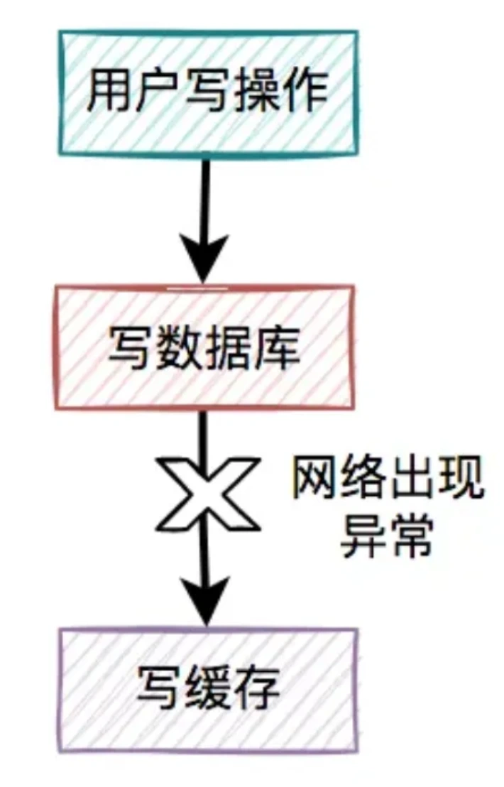

<font style="color:rgb(51, 51, 51);background-color:rgb(248, 246, 244);">如果是并发量比较小，对接口性能要求不太高的系统，可以这么玩。</font>

<font style="color:rgb(51, 51, 51);background-color:rgb(248, 246, 244);">但如果在高并发的业务场景中，写数据库和写缓存，都属于远程操作。为了防止出现大事务，造成的死锁问题，通常建议写数据库和写缓存不要放在同一个事务中。</font>

<font style="color:rgb(51, 51, 51);background-color:rgb(248, 246, 244);">也就是说在该方案中，如果写数据库成功了，但写缓存失败了，数据库中已写入的数据不会回滚。</font>

<font style="color:rgb(51, 51, 51);background-color:rgb(248, 246, 244);">这就会出现：数据库是新数据，而缓存是旧数据，两边数据不一致的情况。</font>

**<font style="color:rgb(34, 34, 34);background-color:rgb(248, 246, 244);">4.2.2 高并发下的问题</font>**

<font style="color:rgb(51, 51, 51);background-color:rgb(248, 246, 244);">假设在高并发的场景中，针对同一个用户的同一条数据，有两个写数据请求：a和b，它们同时请求到业务系统。</font>

<font style="color:rgb(51, 51, 51);background-color:rgb(248, 246, 244);">在这个过程当中，可能会出现请求b在缓存中的新数据，被请求a的旧数据覆盖了。</font>

<font style="color:rgb(51, 51, 51);background-color:rgb(248, 246, 244);">也就是说：在高并发场景中，如果多个线程同时执行先写数据库，再写缓存的操作，可能会出现数据库是新值，而缓存中是旧值，两边数据不一致的情况。</font>

**<font style="color:rgb(34, 34, 34);background-color:rgb(248, 246, 244);">4.2.3 浪费系统资源</font>**

<font style="color:rgb(51, 51, 51);background-color:rgb(248, 246, 244);">该方案还有一个比较大的问题就是：每个写操作，写完数据库，会马上写缓存，比较浪费系统资源。</font>

<font style="color:rgb(51, 51, 51);background-color:rgb(248, 246, 244);">为什么这么说呢？</font>

<font style="color:rgb(51, 51, 51);background-color:rgb(248, 246, 244);">你可以试想一下，如果写的缓存，并不是简单的数据内容，而是要经过非常复杂的计算得出的最终结果。这样每写一次缓存，都需要经过一次非常复杂的计算，不是非常浪费系统资源吗？</font>

<font style="color:rgb(51, 51, 51);background-color:rgb(248, 246, 244);">尤其是cpu和内存资源。</font>

<font style="color:rgb(51, 51, 51);background-color:rgb(248, 246, 244);">还有些业务场景比较特殊：写多读少。</font>

<font style="color:rgb(51, 51, 51);background-color:rgb(248, 246, 244);">如果在这类业务场景中，每个用的写操作，都需要写一次缓存，有点得不偿失。</font>

<font style="color:rgb(51, 51, 51);background-color:rgb(248, 246, 244);">由此可见，在高并发的场景中，先写数据库，再写缓存，这套方案问题挺多的，也不太建议使用。</font>

### **<font style="color:rgb(34, 34, 34);background-color:rgb(248, 246, 244);">4.3 先删缓存，再写数据库</font>**
<font style="color:rgb(51, 51, 51);background-color:rgb(248, 246, 244);">说白了，在用户的写操作中，先执行删除缓存操作，再去写数据库。这套方案，可以是可以，但也会有一样问题。</font>

**<font style="color:rgb(34, 34, 34);background-color:rgb(248, 246, 244);">4.3.1 高并发下的问题</font>**

<font style="color:rgb(51, 51, 51);background-color:rgb(248, 246, 244);">假设在高并发的场景中，同一个用户的同一条数据，有一个读数据请求c，还有另一个写数据请求d（一个更新操作），同时请求到业务系统。</font>

<font style="color:rgb(51, 51, 51);background-color:rgb(248, 246, 244);">在这个过程当中，有可能会出现请求d的新值，并没有被请求c写入缓存，同样会导致缓存和数据库的数据不一致的情况。</font>

### **<font style="color:rgb(34, 34, 34);background-color:rgb(248, 246, 244);">4.4 先写数据库，再删缓存</font>**
<font style="color:rgb(51, 51, 51);background-color:rgb(248, 246, 244);">在高并发的场景中，有一个读数据请求f，有一个写数据请求e。</font>

<font style="color:rgb(51, 51, 51);background-color:rgb(248, 246, 244);">在高并发的场景中，有一个读数据请求，有一个写数据请求，更新过程如下：</font>

<font style="color:rgb(51, 51, 51);background-color:rgb(248, 246, 244);">请求e先写数据库，由于网络原因卡顿了一下，没有来得及删除缓存。请求f查询缓存，发现缓存中有数据，直接返回该数据。请求e删除缓存。在这个过程中，只有请求f读了一次旧数据，后来旧数据被请求e及时删除了，看起来问题不大。</font>

<font style="color:rgb(51, 51, 51);background-color:rgb(248, 246, 244);">但如果是读数据请求先过来呢？</font>

+ <font style="color:rgb(51, 51, 51);background-color:rgb(248, 246, 244);">请求f查询缓存，发现缓存中有数据，直接返回该数据。</font>
+ <font style="color:rgb(51, 51, 51);background-color:rgb(248, 246, 244);">请求e先写数据库。</font>
+ <font style="color:rgb(51, 51, 51);background-color:rgb(248, 246, 244);">请求e删除缓存。</font>

<font style="color:rgb(51, 51, 51);background-color:rgb(248, 246, 244);">这种情况看起来也没问题呀？</font>

<font style="color:rgb(51, 51, 51);background-color:rgb(248, 246, 244);">答：对的。</font>

<font style="color:rgb(51, 51, 51);background-color:rgb(248, 246, 244);">但就怕出现下面这种情况，即缓存自己失效了。如下图所示：</font>

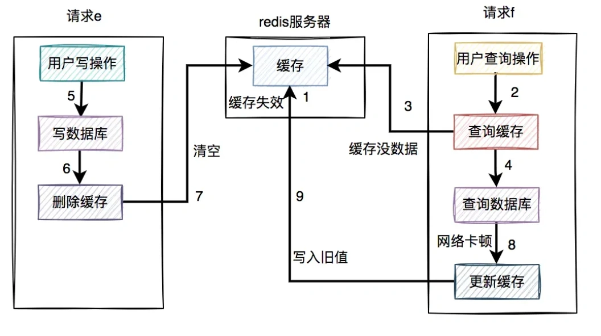

+ <font style="color:rgb(51, 51, 51);background-color:rgb(248, 246, 244);">缓存过期时间到了，自动失效。</font>
+ <font style="color:rgb(51, 51, 51);background-color:rgb(248, 246, 244);">请求f查询缓存，发缓存中没有数据，查询数据库的旧值，但由于网络原因卡顿了，没有来得及更新缓存。</font>
+ <font style="color:rgb(51, 51, 51);background-color:rgb(248, 246, 244);">请求e先写数据库，接着删除了缓存。</font>
+ <font style="color:rgb(51, 51, 51);background-color:rgb(248, 246, 244);">请求f更新旧值到缓存中。</font>

<font style="color:rgb(51, 51, 51);background-color:rgb(248, 246, 244);">这时，缓存和数据库的数据同样出现不一致的情况了。</font>

<font style="color:rgb(51, 51, 51);background-color:rgb(248, 246, 244);">但这种情况还是比较少的，需要同时满足以下条件才可以：</font>

+ <font style="color:rgb(51, 51, 51);background-color:rgb(248, 246, 244);">缓存刚好自动失效。</font>
+ <font style="color:rgb(51, 51, 51);background-color:rgb(248, 246, 244);">请求f从数据库查出旧值，更新缓存的耗时，比请求e写数据库，并且删除缓存的还长。</font>

<font style="color:rgb(51, 51, 51);background-color:rgb(248, 246, 244);">我们都知道查询数据库的速度，一般比写数据库要快，更何况写完数据库，还要删除缓存。所以绝大多数情况下，写数据请求比读数据情况耗时更长。</font>

<font style="color:rgb(51, 51, 51);background-color:rgb(248, 246, 244);">由此可见，系统同时满足上述两个条件的概率非常小。</font>

<font style="color:rgb(51, 51, 51);background-color:rgb(248, 246, 244);">如果大家想更详细的了解数据和缓存双写一致性问题，可以看看我之前写的一篇文章《</font>[如何保证数据库和缓存双写一致性？](https://mp.weixin.qq.com/s?__biz=MzkwNjMwMTgzMQ==&mid=2247493521&idx=1&sn=bff84e7a819d79e4b8eb7e722e96ddfc&chksm=c0e83f79f79fb66f2e7bf03a104580b404ea0a3c977846e428f13c1f12fbad46d4d778b2da14&token=115145471&lang=zh_CN&scene=21#wechat_redirect)<font style="color:rgb(51, 51, 51);background-color:rgb(248, 246, 244);">》，里面有非常详细的介绍。</font>

## **<font style="color:rgb(34, 34, 34);background-color:rgb(248, 246, 244);">5 大key问题</font>**
<font style="color:rgb(51, 51, 51);background-color:rgb(248, 246, 244);">我们在使用缓存的时候，特别是Redis，还有一个经常会遇到的问题是大key问题。</font>

<font style="color:rgb(51, 51, 51);background-color:rgb(248, 246, 244);">可能系统刚上线时，数据量少，在Redis中定义的key比较小，开发人员在做系统设计时，也没考虑这个问题。</font>

<font style="color:rgb(51, 51, 51);background-color:rgb(248, 246, 244);">系统运行了很长一段时间也没有问题。</font>

<font style="color:rgb(51, 51, 51);background-color:rgb(248, 246, 244);">但随着时间的推移，用户的数据越来越多，慢慢形成了大key问题。</font>

<font style="color:rgb(51, 51, 51);background-color:rgb(248, 246, 244);">可能在突然的某一天之后发现，线上某个接口耗时越来越长了。</font>

<font style="color:rgb(51, 51, 51);background-color:rgb(248, 246, 244);">追查原因，发现是大key问题导致的。</font>

<font style="color:rgb(51, 51, 51);background-color:rgb(248, 246, 244);">大key问题是指：缓存中单个key的value值过大。</font>

<font style="color:rgb(51, 51, 51);background-color:rgb(248, 246, 244);">之前我开发过一个分类树查询接口，为了性能考虑，使用job提前将分类树，保存到缓存中。</font>

<font style="color:rgb(51, 51, 51);background-color:rgb(248, 246, 244);">刚开始分类不多，只有几百个，分类树查询接口的响应挺快的。</font>

<font style="color:rgb(51, 51, 51);background-color:rgb(248, 246, 244);">但用了几年之后，分类数据涨到了上万个，该接口出现了性能问题，一查发现是大key引起的。</font>

<font style="color:rgb(51, 51, 51);background-color:rgb(248, 246, 244);">我们需要做优化，那么如何优化呢？</font>

### **<font style="color:rgb(34, 34, 34);background-color:rgb(248, 246, 244);">5.1 缩减字段名</font>**
<font style="color:rgb(51, 51, 51);background-color:rgb(248, 246, 244);">为了优化在Redis中存储数据的大小，我们首先需要对数据进行瘦身。</font>

<font style="color:rgb(51, 51, 51);background-color:rgb(248, 246, 244);">只保存需要用到的字段。</font>

<font style="color:rgb(51, 51, 51);background-color:rgb(248, 246, 244);">例如：</font>

```kotlin
@AllArgsConstructor
@Data
public class Category {

    private Long id;
    private String name;
    private Long parentId;
    private Date inDate;
    private Long inUserId;
    private String inUserName;
    private List<Category> children;
}
```

<font style="color:rgb(51, 51, 51);background-color:rgb(248, 246, 244);">像这个分类对象中inDate、inUserId和inUserName字段是可以不用保存的。</font>

<font style="color:rgb(51, 51, 51);background-color:rgb(248, 246, 244);">修改自动名称。</font>

<font style="color:rgb(51, 51, 51);background-color:rgb(248, 246, 244);">例如：</font>

```less
@AllArgsConstructor
@Data
public class Category {
    /**
     * 分类编号
     */
    @JsonProperty("i")
    private Long id;

    /**
     * 分类层级
     */
    @JsonProperty("l")
    private Integer level;

    /**
     * 分类名称
     */
    @JsonProperty("n")
    private String name;

    /**
     * 父分类编号
     */
    @JsonProperty("p")
    private Long parentId;

    /**
     * 子分类列表
     */
    @JsonProperty("c")
    private List<Category> children;
}
```

<font style="color:rgb(51, 51, 51);background-color:rgb(248, 246, 244);">由于在一万多条数据中，每条数据的字段名称是固定的，他们的重复率太高了。</font>

<font style="color:rgb(51, 51, 51);background-color:rgb(248, 246, 244);">由此，可以在json序列化时，改成一个简短的名称，以便于返回更少的数据大小。</font>

### **<font style="color:rgb(34, 34, 34);background-color:rgb(248, 246, 244);">5.2 数据做压缩</font>**
<font style="color:rgb(51, 51, 51);background-color:rgb(248, 246, 244);">这还不够，需要对存储的数据做压缩。</font>

<font style="color:rgb(51, 51, 51);background-color:rgb(248, 246, 244);">之前在Redis中保存的key/value，其中的value是json格式的字符串。</font>

<font style="color:rgb(51, 51, 51);background-color:rgb(248, 246, 244);">其实RedisTemplate支持，value保存byte数组。</font>

<font style="color:rgb(51, 51, 51);background-color:rgb(248, 246, 244);">先将json字符串数据用GZip工具类压缩成byte数组，然后保存到Redis中。</font>

<font style="color:rgb(51, 51, 51);background-color:rgb(248, 246, 244);">再获取数据时，将byte数组转换成json字符串，然后再转换成分类树。</font>

<font style="color:rgb(51, 51, 51);background-color:rgb(248, 246, 244);">这样优化之后，保存到Redis中的分类树的数据大小，一下子减少了10倍，Redis的大key问题被解决了。</font>

<font style="color:rgb(51, 51, 51);background-color:rgb(248, 246, 244);">如果大家对大key问题如何优化，比较感兴趣，可以看看我的另一篇文章《</font>[分类树，我从2s优化到0.1s](https://mp.weixin.qq.com/s?__biz=MzkwNjMwMTgzMQ==&mid=2247504097&idx=1&sn=1cac86e9b9152a93e4bfca56c3b9bf18&chksm=c0e80809f79f811f703408480a868967a5be3c085ac6fef5b6de7fc5e235efa3965d343965c3&token=115145471&lang=zh_CN&scene=21#wechat_redirect)<font style="color:rgb(51, 51, 51);background-color:rgb(248, 246, 244);">》，里面有真实的案例。</font>

## **<font style="color:rgb(34, 34, 34);background-color:rgb(248, 246, 244);">6 热key问题</font>**
<font style="color:rgb(51, 51, 51);background-color:rgb(248, 246, 244);">不知道大家听说过二八原理没有。</font>

<font style="color:rgb(51, 51, 51);background-color:rgb(248, 246, 244);">80%的用户经常访问20%的热点数据。</font>

<font style="color:rgb(51, 51, 51);background-color:rgb(248, 246, 244);">这样带来的结果是数据的倾斜，不能均匀分布，尤其是高并发系统中问题比较大。</font>

<font style="color:rgb(51, 51, 51);background-color:rgb(248, 246, 244);">比如你现在搞了一个促销活动，有几款商品性价比非常高，这些商品数据在Redis中按分片保存的，不同的数据保存在不同的服务器节点上。</font>

<font style="color:rgb(51, 51, 51);background-color:rgb(248, 246, 244);">如果用户疯狂抢购其中3款商品，而这3款商品正好保存在同一台Redis服务端节点。</font>

<font style="color:rgb(51, 51, 51);background-color:rgb(248, 246, 244);">这样会出现大量的用户请求集中访问同一天Redis服务器节点，该节点很有可能会因为扛不住这么大的压力，而直接down机。</font>

<font style="color:rgb(51, 51, 51);background-color:rgb(248, 246, 244);">这个就是热key问题带来的危害。</font>

<font style="color:rgb(51, 51, 51);background-color:rgb(248, 246, 244);">那么，如何解决这个问题呢？</font>

### **<font style="color:rgb(34, 34, 34);background-color:rgb(248, 246, 244);">6.1 拆分key</font>**
<font style="color:rgb(51, 51, 51);background-color:rgb(248, 246, 244);">在促销活动开始之前，我们要提前做好评估，分析这些商品哪些是热点商品。</font>

<font style="color:rgb(51, 51, 51);background-color:rgb(248, 246, 244);">然后将热点商品分开保存，不要集中保存到同一台Redis服务器节点。</font>

<font style="color:rgb(51, 51, 51);background-color:rgb(248, 246, 244);">这样不同的Redis服务器节点，可以分摊一些用户的请求压力。</font>

### **<font style="color:rgb(34, 34, 34);background-color:rgb(248, 246, 244);">6.2 增加本地缓存</font>**
<font style="color:rgb(51, 51, 51);background-color:rgb(248, 246, 244);">对应热key，我们可以增加一层本地缓存，能够提升性能的同时也能避免Redis访问量过大的问题。</font>

<font style="color:rgb(51, 51, 51);background-color:rgb(248, 246, 244);">但带来的坏处是，可能会出现数据不一致问题，要根据实际的业务场景选择。</font>

## **<font style="color:rgb(34, 34, 34);background-color:rgb(248, 246, 244);">7 命中率问题</font>**
<font style="color:rgb(51, 51, 51);background-color:rgb(248, 246, 244);">缓存的命中率问题，是一个让人非常头疼的问题。</font>

<font style="color:rgb(51, 51, 51);background-color:rgb(248, 246, 244);">前面的章节已经介绍过。</font>

<font style="color:rgb(51, 51, 51);background-color:rgb(248, 246, 244);">一般情况下，如果有用户请求过来，先查缓存，如果缓存中存在数据，则直接返回。</font>

<font style="color:rgb(51, 51, 51);background-color:rgb(248, 246, 244);">如果缓存中不存在，则再查数据库，如果数据库中存在，则将数据放入缓存，然后返回。如果数据库中也不存在，则直接返回失败。</font>

<font style="color:rgb(51, 51, 51);background-color:rgb(248, 246, 244);">流程图如下：</font>

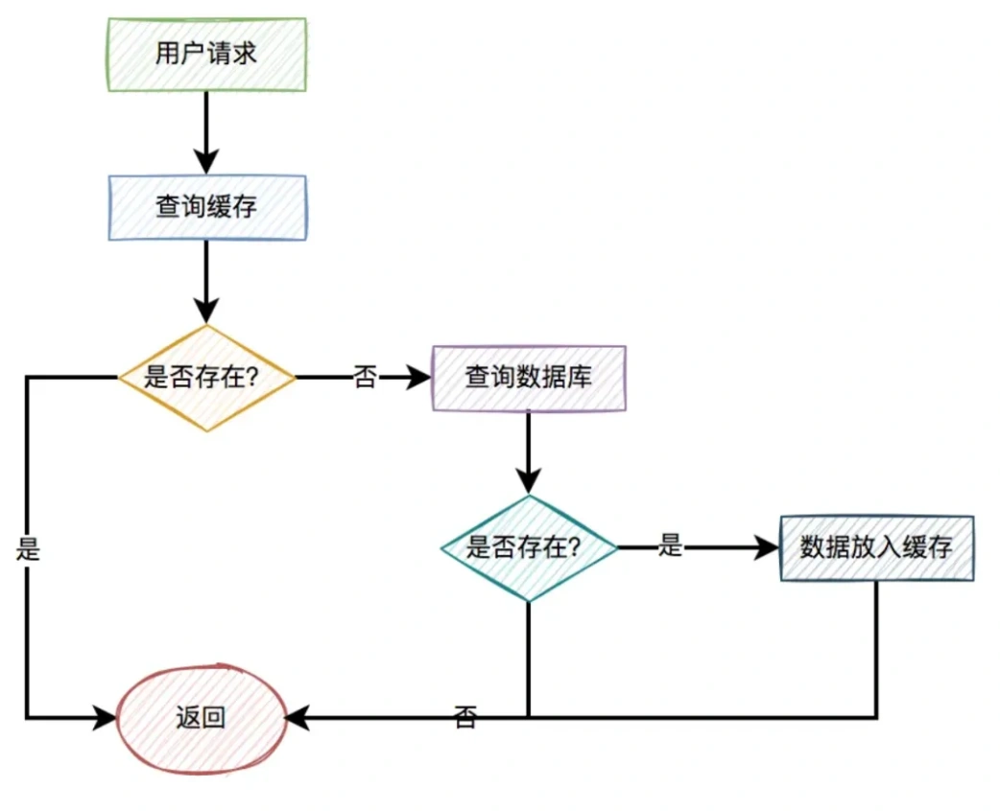

<font style="color:rgb(51, 51, 51);background-color:rgb(248, 246, 244);">缓存命中：直接从缓存中获取数据。</font>

<font style="color:rgb(51, 51, 51);background-color:rgb(248, 246, 244);">缓存不命中：无法从缓存中获取数据，而要从数据库获取其他途径获取数据。</font>

<font style="color:rgb(51, 51, 51);background-color:rgb(248, 246, 244);">我们肯定是希望缓存命中率越高越好，这样接口的性能越好，但实际工作中却经常啪啪打脸。</font>

<font style="color:rgb(51, 51, 51);background-color:rgb(248, 246, 244);">因为可能会出现缓存不存在，或者缓存过期等问题，导致缓存不能命中。</font>

<font style="color:rgb(51, 51, 51);background-color:rgb(248, 246, 244);">那么，如何提升缓存的命中率呢？</font>

### **<font style="color:rgb(34, 34, 34);background-color:rgb(248, 246, 244);">7.1 缓存预热</font>**
<font style="color:rgb(51, 51, 51);background-color:rgb(248, 246, 244);">我们在API服务启动之前，可以先用job，将相关数据先保存到缓存中，做预热。</font>

<font style="color:rgb(51, 51, 51);background-color:rgb(248, 246, 244);">这样后面的用户请求，就能直接从缓存中获取数据，而无需访问数据库了。</font>

### **<font style="color:rgb(34, 34, 34);background-color:rgb(248, 246, 244);">7.2 合理调整过期时间</font>**
<font style="color:rgb(51, 51, 51);background-color:rgb(248, 246, 244);">有时候，我们给缓存设置的过期时间太短，导致后面会产生大量的过期缓存。</font>

<font style="color:rgb(51, 51, 51);background-color:rgb(248, 246, 244);">会导致缓存命中率非常低。</font>

<font style="color:rgb(51, 51, 51);background-color:rgb(248, 246, 244);">这时需要合理调整过期时间，比如：之前设置1秒的，现在改成5秒，10秒，30秒或者1分钟等等。</font>

### **<font style="color:rgb(34, 34, 34);background-color:rgb(248, 246, 244);">7.3 增加缓存内存</font>**
<font style="color:rgb(51, 51, 51);background-color:rgb(248, 246, 244);">如果我们部署的Redis服务器的内存太小，很容易出现内存不足的情况，从而会频繁触发内存淘汰机制。</font>

<font style="color:rgb(51, 51, 51);background-color:rgb(248, 246, 244);">也会影响缓存的命中率。</font>

<font style="color:rgb(51, 51, 51);background-color:rgb(248, 246, 244);">这种情况下，我们需要增加缓存内存。</font>

<font style="color:rgb(51, 51, 51);background-color:rgb(248, 246, 244);">缓存的内存过小问题，也经常会出现。</font>

<font style="color:rgb(51, 51, 51);background-color:rgb(248, 246, 244);">今天的内容先分享到这里，感谢你的阅读，希望对你会有所帮助。</font>


> 更新: 2024-05-20 17:17:32  
> 原文: <https://www.yuque.com/yuqueyonghue6cvnv/cxhfwd/gpa5wph1v0k90tg4>