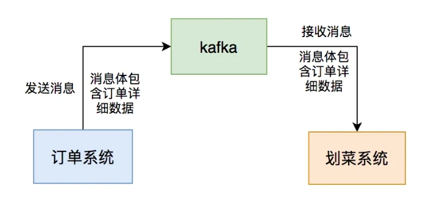
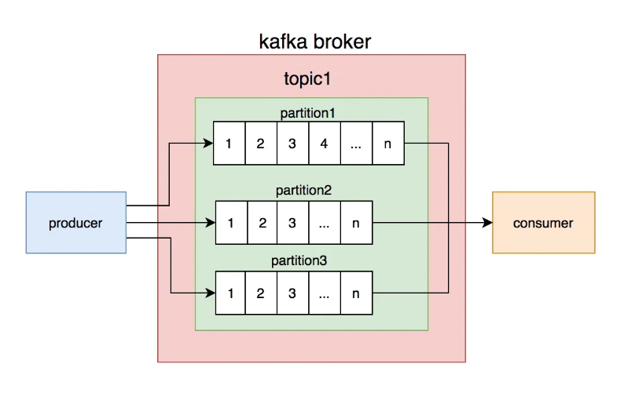
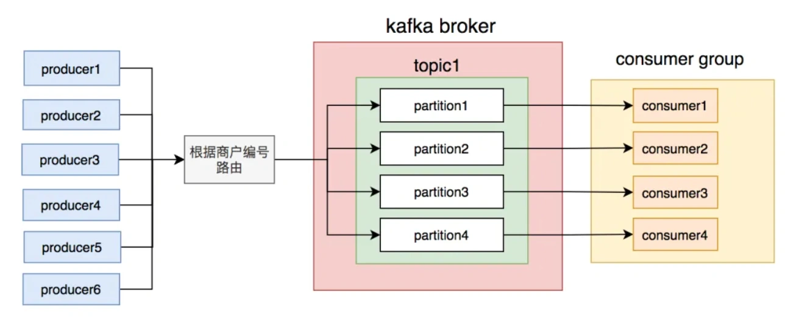
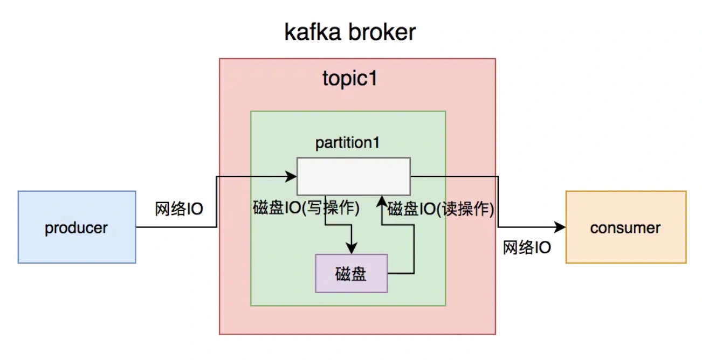
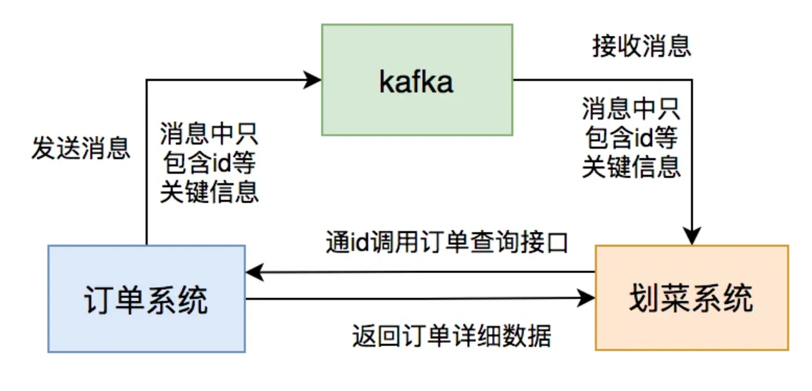
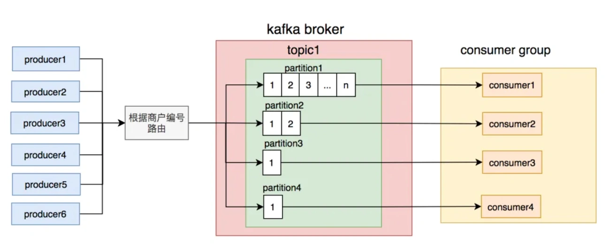
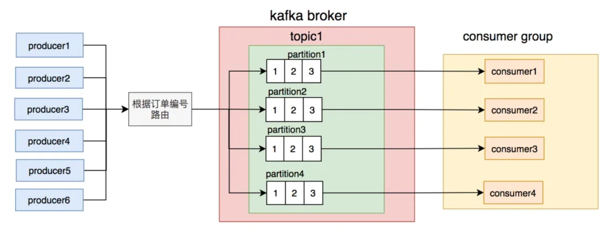
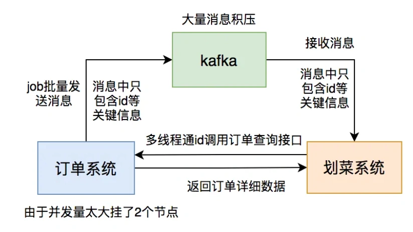

# 使用kafka踩过的一些坑

## **<font style="color:rgb(34, 34, 34);background-color:rgb(248, 246, 244);">前言</font>**
<font style="color:rgb(51, 51, 51);background-color:rgb(248, 246, 244);">我的上家公司是做餐饮系统的，每天中午和晚上用餐高峰期，系统的并发量不容小觑。为了保险起见，公司规定各部门都要在吃饭的时间轮流值班，防止出现线上问题时能够及时处理。</font>

<font style="color:rgb(51, 51, 51);background-color:rgb(248, 246, 244);">我当时在后厨显示系统团队，该系统属于订单的下游业务。用户点完菜下单后，订单系统会通过发kafka消息给我们系统，系统读取消息后，做业务逻辑处理，持久化订单和菜品数据，然后展示到划菜客户端。这样厨师就知道哪个订单要做哪些菜，有些菜做好了，就可以通过该系统出菜。系统自动通知服务员上菜，如果服务员上完菜，修改菜品上菜状态，用户就知道哪些菜已经上了，哪些还没有上。这个系统可以大大提高后厨到用户的效率。</font>



<font style="color:rgb(51, 51, 51);background-color:rgb(248, 246, 244);">事实证明，这一切的关键是消息中间件：kafka，如果它有问题，将会直接影响到后厨显示系统的功能。</font>

<font style="color:rgb(51, 51, 51);background-color:rgb(248, 246, 244);">接下来，我跟大家一起聊聊使用kafka两年时间踩过哪些坑？</font>

## **<font style="color:rgb(34, 34, 34);background-color:rgb(248, 246, 244);">顺序问题</font>**
### **<font style="color:rgb(34, 34, 34);background-color:rgb(248, 246, 244);">1. 为什么要保证消息的顺序？</font>**
<font style="color:rgb(51, 51, 51);background-color:rgb(248, 246, 244);">刚开始我们系统的商户很少，为了快速实现功能，我们没想太多。既然是走消息中间件kafka通信，订单系统发消息时将订单详细数据放在消息体，我们后厨显示系统只要订阅topic，就能获取相关消息数据，然后处理自己的业务即可。</font>

<font style="color:rgb(51, 51, 51);background-color:rgb(248, 246, 244);">不过这套方案有个关键因素：</font>**<font style="color:rgb(34, 34, 34);background-color:rgb(248, 246, 244);">要保证消息的顺序</font>**<font style="color:rgb(51, 51, 51);background-color:rgb(248, 246, 244);">。</font>

<font style="color:rgb(51, 51, 51);background-color:rgb(248, 246, 244);">为什么呢？</font>

<font style="color:rgb(51, 51, 51);background-color:rgb(248, 246, 244);">订单有很多状态，比如：下单、支付、完成、撤销等，不可能下单的消息都没读取到，就先读取支付或撤销的消息吧，如果真的这样，数据不是会产生错乱？</font>

<font style="color:rgb(51, 51, 51);background-color:rgb(248, 246, 244);">好吧，看来保证消息顺序是有必要的。</font>

### **<font style="color:rgb(34, 34, 34);background-color:rgb(248, 246, 244);">2.如何保证消息顺序？</font>**
<font style="color:rgb(51, 51, 51);background-color:rgb(248, 246, 244);">我们都知道kafka的topic是无序的，但是一个topic包含多个partition，每个partition内部是有序的。</font>



<font style="color:rgb(51, 51, 51);background-color:rgb(248, 246, 244);">如此一来，思路就变得清晰了：只要保证生产者写消息时，按照一定的规则写到同一个partition，不同的消费者读不同的partition的消息，就能保证生产和消费者消息的顺序。</font>

<font style="color:rgb(51, 51, 51);background-color:rgb(248, 246, 244);">我们刚开始就是这么做的，同一个商户编号的消息写到同一个partition，topic中创建了4个partition，然后部署了4个消费者节点，构成消费者组，一个partition对应一个消费者节点。从理论上说，这套方案是能够保证消息顺序的。</font>



<font style="color:rgb(51, 51, 51);background-color:rgb(248, 246, 244);">一切规划得看似“天衣无缝”，我们就这样”顺利“上线了。</font>

### **<font style="color:rgb(34, 34, 34);background-color:rgb(248, 246, 244);">3.出现意外</font>**
<font style="color:rgb(51, 51, 51);background-color:rgb(248, 246, 244);">该功能上线了一段时间，刚开始还是比较正常的。</font>

<font style="color:rgb(51, 51, 51);background-color:rgb(248, 246, 244);">但是，好景不长，很快就收到用户投诉，说在划菜客户端有些订单和菜品一直看不到，无法划菜。</font>

<font style="color:rgb(51, 51, 51);background-color:rgb(248, 246, 244);">我定位到了原因，公司在那段时间网络经常不稳定，业务接口时不时报超时，业务请求时不时会连不上数据库。</font>

<font style="color:rgb(51, 51, 51);background-color:rgb(248, 246, 244);">这种情况对顺序消息的打击，可以说是毁灭性的。</font>

<font style="color:rgb(51, 51, 51);background-color:rgb(248, 246, 244);">为什么这么说？</font>

<font style="color:rgb(51, 51, 51);background-color:rgb(248, 246, 244);">假设订单系统发了：”下单“、”支付“、”完成“ 三条消息。</font>


<font style="color:rgb(51, 51, 51);background-color:rgb(248, 246, 244);">而”下单“消息由于网络原因我们系统处理失败了，而后面的两条消息的数据是无法入库的，因为只有”下单“消息的数据才是完整的数据，其他类型的消息只会更新状态。</font>

<font style="color:rgb(51, 51, 51);background-color:rgb(248, 246, 244);">加上，我们当时没有做失败重试机制，使得这个问题被放大了。问题变成：一旦”下单“消息的数据入库失败，用户就永远看不到这个订单和菜品了。</font>

<font style="color:rgb(51, 51, 51);background-color:rgb(248, 246, 244);">那么这个紧急的问题要如何解决呢？</font>

### **<font style="color:rgb(34, 34, 34);background-color:rgb(248, 246, 244);">4.解决过程</font>**
<font style="color:rgb(51, 51, 51);background-color:rgb(248, 246, 244);">最开始我们的想法是：在消费者处理消息时，如果处理失败了，立马重试3-5次。但如果有些请求要第6次才能成功怎么办？不可能一直重试呀，这种同步重试机制，会阻塞其他商户订单消息的读取。</font>

<font style="color:rgb(51, 51, 51);background-color:rgb(248, 246, 244);">显然用上面的这种同步重试机制在出现异常的情况，会严重影响消息消费者的消费速度，降低它的吞吐量。</font>

<font style="color:rgb(51, 51, 51);background-color:rgb(248, 246, 244);">如此看来，我们不得不用异步重试机制了。</font>

<font style="color:rgb(51, 51, 51);background-color:rgb(248, 246, 244);">如果用异步重试机制，处理失败的消息就得保存到重试表下来。</font>

<font style="color:rgb(51, 51, 51);background-color:rgb(248, 246, 244);">但有个新问题立马出现：</font>**<font style="color:rgb(34, 34, 34);background-color:rgb(248, 246, 244);">只存一条消息如何保证顺序？</font>**

<font style="color:rgb(51, 51, 51);background-color:rgb(248, 246, 244);">存一条消息的确无法保证顺序，假如：”下单“消息失败了，还没来得及异步重试。此时，”支付“消息被消费了，它肯定是不能被正常消费的。</font>

<font style="color:rgb(51, 51, 51);background-color:rgb(248, 246, 244);">此时，”支付“消息该一直等着，每隔一段时间判断一次，它前面的消息都有没有被消费?</font>

<font style="color:rgb(51, 51, 51);background-color:rgb(248, 246, 244);">如果真的这么做，会出现两个问题：</font>

1. **<font style="color:rgb(34, 34, 34);background-color:rgb(248, 246, 244);">”支付“消息前面只有”下单“消息，这种情况比较简单。但如果某种类型的消息，前面有N多种消息，需要判断多少次呀，这种判断跟订单系统的耦合性太强了，相当于要把他们系统的逻辑搬一部分到我们系统。</font>**
2. **<font style="color:rgb(34, 34, 34);background-color:rgb(248, 246, 244);">影响消费者的消费速度</font>**

<font style="color:rgb(51, 51, 51);background-color:rgb(248, 246, 244);">这时有种更简单的方案浮出水面：消费者在处理消息时，先判断该订单号在重试表有没有数据，如果有则直接把当前消息保存到重试表。如果没有，则进行业务处理，如果出现异常，把该消息保存到重试表。</font>

<font style="color:rgb(51, 51, 51);background-color:rgb(248, 246, 244);">后来我们用elastic-job建立了失败重试机制，如果重试了7次后还是失败，则将该消息的状态标记为失败，发邮件通知开发人员。</font>

<font style="color:rgb(51, 51, 51);background-color:rgb(248, 246, 244);">终于由于网络不稳定，导致用户在划菜客户端有些订单和菜品一直看不到的问题被解决了。现在商户顶多偶尔延迟看到菜品，比一直看不菜品好太多。</font>

## **<font style="color:rgb(34, 34, 34);background-color:rgb(248, 246, 244);">消息积压</font>**
<font style="color:rgb(51, 51, 51);background-color:rgb(248, 246, 244);">随着销售团队的市场推广，我们系统的商户越来越多。随之而来的是消息的数量越来越大，导致消费者处理不过来，经常出现消息积压的情况。对商户的影响非常直观，划菜客户端上的订单和菜品可能半个小时后才能看到。一两分钟还能忍，半个消息的延迟，对有些暴脾气的商户哪里忍得了，马上投诉过来了。我们那段时间经常接到商户投诉说订单和菜品有延迟。</font>

<font style="color:rgb(51, 51, 51);background-color:rgb(248, 246, 244);">虽说，加服务器节点就能解决问题，但是按照公司为了省钱的惯例，要先做系统优化，所以我们开始了消息积压问题解决之旅。</font>

### **<font style="color:rgb(34, 34, 34);background-color:rgb(248, 246, 244);">1. 消息体过大</font>**
<font style="color:rgb(51, 51, 51);background-color:rgb(248, 246, 244);">虽说kafka号称支持百万级的TPS，但从producer发送消息到broker需要一次网络IO，broker写数据到磁盘需要一次磁盘IO（写操作），consumer从broker获取消息先经过一次磁盘IO（读操作），再经过一次网络IO。</font>



<font style="color:rgb(51, 51, 51);background-color:rgb(248, 246, 244);">一次简单的消息从生产到消费过程，需要经过2次网络IO和2次磁盘IO。如果消息体过大，势必会增加IO的耗时，进而影响kafka生产和消费的速度。消费者速度太慢的结果，就会出现消息积压情况。</font>

<font style="color:rgb(51, 51, 51);background-color:rgb(248, 246, 244);">除了上面的问题之外，消息体过大，还会浪费服务器的磁盘空间，稍不注意，可能会出现磁盘空间不足的情况。</font>

<font style="color:rgb(51, 51, 51);background-color:rgb(248, 246, 244);">此时，我们已经到了需要优化消息体过大问题的时候。</font>

**<font style="color:rgb(34, 34, 34);background-color:rgb(248, 246, 244);">如何优化呢？</font>**

<font style="color:rgb(51, 51, 51);background-color:rgb(248, 246, 244);">我们重新梳理了一下业务，没有必要知道订单的中间状态，只需知道一个最终状态就可以了。</font>

<font style="color:rgb(51, 51, 51);background-color:rgb(248, 246, 244);">如此甚好，我们就可以这样设计了：</font>

1. **<font style="color:rgb(34, 34, 34);background-color:rgb(248, 246, 244);">订单系统发送的消息体只用包含：id和状态等关键信息。</font>**
2. **<font style="color:rgb(34, 34, 34);background-color:rgb(248, 246, 244);">后厨显示系统消费消息后，通过id调用订单系统的订单详情查询接口获取数据。</font>**
3. **<font style="color:rgb(34, 34, 34);background-color:rgb(248, 246, 244);">后厨显示系统判断数据库中是否有该订单的数据，如果没有则入库，有则更新。</font>**



<font style="color:rgb(51, 51, 51);background-color:rgb(248, 246, 244);">果然这样调整之后，消息积压问题很长一段时间都没再出现。</font>

### **<font style="color:rgb(34, 34, 34);background-color:rgb(248, 246, 244);">2. 路由规则不合理</font>**
<font style="color:rgb(51, 51, 51);background-color:rgb(248, 246, 244);">还真别高兴的太早，有天中午又有商户投诉说订单和菜品有延迟。我们一查kafka的topic竟然又出现了消息积压。</font>

<font style="color:rgb(51, 51, 51);background-color:rgb(248, 246, 244);">但这次有点诡异，不是所有partition上的消息都有积压，而是只有一个。</font>



<font style="color:rgb(51, 51, 51);background-color:rgb(248, 246, 244);">刚开始，我以为是消费那个partition消息的节点出了什么问题导致的。但是经过排查，没有发现任何异常。</font>

<font style="color:rgb(51, 51, 51);background-color:rgb(248, 246, 244);">这就奇怪了，到底哪里有问题呢？</font>

<font style="color:rgb(51, 51, 51);background-color:rgb(248, 246, 244);">后来，我查日志和数据库发现，有几个商户的订单量特别大，刚好这几个商户被分到同一个partition，使得该partition的消息量比其他partition要多很多。</font>

<font style="color:rgb(51, 51, 51);background-color:rgb(248, 246, 244);">这时我们才意识到，发消息时按商户编号路由partition的规则不合理，可能会导致有些partition消息太多，消费者处理不过来，而有些partition却因为消息太少，消费者出现空闲的情况。</font>

<font style="color:rgb(51, 51, 51);background-color:rgb(248, 246, 244);">为了避免出现这种分配不均匀的情况，我们需要对发消息的路由规则做一下调整。</font>

<font style="color:rgb(51, 51, 51);background-color:rgb(248, 246, 244);">我们思考了一下，用订单号做路由相对更均匀，不会出现单个订单发消息次数特别多的情况。除非是遇到某个人一直加菜的情况，但是加菜是需要花钱的，所以其实同一个订单的消息数量并不多。</font>

<font style="color:rgb(51, 51, 51);background-color:rgb(248, 246, 244);">调整后按订单号路由到不同的partition，同一个订单号的消息，每次到发到同一个partition。</font>



<font style="color:rgb(51, 51, 51);background-color:rgb(248, 246, 244);">调整后，消息积压的问题又有很长一段时间都没有再出现。我们的商户数量在这段时间，增长的非常快，越来越多了。</font>

### **<font style="color:rgb(34, 34, 34);background-color:rgb(248, 246, 244);">3. 批量操作引起的连锁反应</font>**
<font style="color:rgb(51, 51, 51);background-color:rgb(248, 246, 244);">在高并发的场景中，消息积压问题，可以说如影随形，真的没办法从根本上解决。表面上看，已经解决了，但后面不知道什么时候，就会冒出一次，比如这次：</font>

<font style="color:rgb(51, 51, 51);background-color:rgb(248, 246, 244);">有天下午，产品过来说：有几个商户投诉过来了，他们说菜品有延迟，快查一下原因。</font>

<font style="color:rgb(51, 51, 51);background-color:rgb(248, 246, 244);">这次问题出现得有点奇怪。</font>

<font style="color:rgb(51, 51, 51);background-color:rgb(248, 246, 244);">为什么这么说？</font>

<font style="color:rgb(51, 51, 51);background-color:rgb(248, 246, 244);">首先这个时间点就有点奇怪，平常出问题，不都是中午或者晚上用餐高峰期吗？怎么这次问题出现在下午？</font>

<font style="color:rgb(51, 51, 51);background-color:rgb(248, 246, 244);">根据以往积累的经验，我直接看了kafka的topic的数据，果然上面消息有积压，但这次每个partition都积压了十几万的消息没有消费，比以往加压的消息数量增加了几百倍。这次消息积压得极不寻常。</font>

<font style="color:rgb(51, 51, 51);background-color:rgb(248, 246, 244);">我赶紧查服务监控看看消费者挂了没，还好没挂。又查服务日志没有发现异常。这时我有点迷茫，碰运气问了问订单组下午发生了什么事情没？他们说下午有个促销活动，跑了一个JOB批量更新过有些商户的订单信息。</font>

<font style="color:rgb(51, 51, 51);background-color:rgb(248, 246, 244);">这时，我一下子如梦初醒，是他们在JOB中批量发消息导致的问题。怎么没有通知我们呢？实在太坑了。</font>

<font style="color:rgb(51, 51, 51);background-color:rgb(248, 246, 244);">虽说知道问题的原因了，倒是眼前积压的这十几万的消息该如何处理呢？</font>

<font style="color:rgb(51, 51, 51);background-color:rgb(248, 246, 244);">此时，如果直接调大partition数量是不行的，历史消息已经存储到4个固定的partition，只有新增的消息才会到新的partition。我们重点需要处理的是已有的partition。</font>

<font style="color:rgb(51, 51, 51);background-color:rgb(248, 246, 244);">直接加服务节点也不行，因为kafka允许同组的多个partition被一个consumer消费，但不允许一个partition被同组的多个consumer消费，可能会造成资源浪费。</font>

<font style="color:rgb(51, 51, 51);background-color:rgb(248, 246, 244);">看来只有用多线程处理了。</font>

<font style="color:rgb(51, 51, 51);background-color:rgb(248, 246, 244);">为了紧急解决问题，我改成了用线程池处理消息，核心线程和最大线程数都配置成了50。</font>

<font style="color:rgb(51, 51, 51);background-color:rgb(248, 246, 244);">调整之后，果然，消息积压数量不断减少。</font>

<font style="color:rgb(51, 51, 51);background-color:rgb(248, 246, 244);">但此时有个更严重的问题出现：我收到了报警邮件，有两个订单系统的节点down机了。</font>

<font style="color:rgb(51, 51, 51);background-color:rgb(248, 246, 244);">不久，订单组的同事过来找我说，我们系统调用他们订单查询接口的并发量突增，超过了预计的好几倍，导致有2个服务节点挂了。他们把查询功能单独整成了一个服务，部署了6个节点，挂了2个节点，再不处理，另外4个节点也会挂。订单服务可以说是公司最核心的服务，它挂了公司损失会很大，情况万分紧急。</font>

<font style="color:rgb(51, 51, 51);background-color:rgb(248, 246, 244);">为了解决这个问题，只能先把线程数调小。</font>

<font style="color:rgb(51, 51, 51);background-color:rgb(248, 246, 244);">幸好，线程数是可以通过zookeeper动态调整的，我把核心线程数调成了8个，核心线程数改成了10个。</font>

<font style="color:rgb(51, 51, 51);background-color:rgb(248, 246, 244);">后面，运维把订单服务挂的2个节点重启后恢复正常了，以防万一，再多加了2个节点。为了确保订单服务不会出现问题，就保持目前的消费速度，后厨显示系统的消息积压问题，1小时候后也恢复正常了。</font>



1. **<font style="color:rgb(34, 34, 34);background-color:rgb(248, 246, 244);">订单系统的批量操作一定提前通知下游系统团队。</font>**
2. **<font style="color:rgb(34, 34, 34);background-color:rgb(248, 246, 244);">下游系统团队多线程调用订单查询接口一定要做压测。</font>**
3. **<font style="color:rgb(34, 34, 34);background-color:rgb(248, 246, 244);">这次给订单查询服务敲响了警钟，它作为公司的核心服务，应对高并发场景做的不够好，需要做优化。</font>**
4. **<font style="color:rgb(34, 34, 34);background-color:rgb(248, 246, 244);">对消息积压情况加监控。</font>**

**<font style="color:rgb(34, 34, 34);background-color:rgb(248, 246, 244);">顺便说一下，对于要求严格保证消息顺序的场景，可以将线程池改成多个队列，每个队列用单线程处理。</font>**

### **<font style="color:rgb(34, 34, 34);background-color:rgb(248, 246, 244);">4. 表过大</font>**
<font style="color:rgb(51, 51, 51);background-color:rgb(248, 246, 244);">为了防止后面再次出现消息积压问题，消费者后面就一直用多线程处理消息。</font>

<font style="color:rgb(51, 51, 51);background-color:rgb(248, 246, 244);">但有天中午我们还是收到很多报警邮件，提醒我们kafka的topic消息有积压。我们正在查原因，此时产品跑过来说：又有商户投诉说菜品有延迟，赶紧看看。这次她看起来有些不耐烦，确实优化了很多次，还是出现了同样的问题。</font>

<font style="color:rgb(51, 51, 51);background-color:rgb(248, 246, 244);">在外行看来：</font>**<font style="color:rgb(34, 34, 34);background-color:rgb(248, 246, 244);">为什么同一个问题一直解决不了？</font>**

**<font style="color:rgb(34, 34, 34);background-color:rgb(248, 246, 244);">其实技术心里的苦他们是不知道的。</font>**

<font style="color:rgb(51, 51, 51);background-color:rgb(248, 246, 244);">表面上问题的症状是一样的，都是出现了菜品延迟，他们知道的是因为消息积压导致的。但是他们不知道深层次的原因，导致消息积压的原因其实有很多种。这也许是使用消息中间件的通病吧。</font>

<font style="color:rgb(51, 51, 51);background-color:rgb(248, 246, 244);">我沉默不语，只能硬着头皮定位原因了。</font>

<font style="color:rgb(51, 51, 51);background-color:rgb(248, 246, 244);">后来我查日志发现消费者消费一条消息的耗时长达2秒。以前是500毫秒，现在怎么会变成2秒呢？</font>

<font style="color:rgb(51, 51, 51);background-color:rgb(248, 246, 244);">奇怪了，消费者的代码也没有做大的调整，为什么会出现这种情况呢？</font>

<font style="color:rgb(51, 51, 51);background-color:rgb(248, 246, 244);">查了一下线上菜品表，单表数据量竟然到了几千万，其他的划菜表也是一样，现在单表保存的数据太多了。</font>

<font style="color:rgb(51, 51, 51);background-color:rgb(248, 246, 244);">我们组梳理了一下业务，其实菜品在客户端只展示最近3天的即可。</font>

<font style="color:rgb(51, 51, 51);background-color:rgb(248, 246, 244);">这就好办了，我们服务端存着多余的数据，不如把表中多余的数据归档。于是，DBA帮我们把数据做了归档，只保留最近7天的数据。</font>

<font style="color:rgb(51, 51, 51);background-color:rgb(248, 246, 244);">如此调整后，消息积压问题被解决了，又恢复了往日的平静。</font>

## **<font style="color:rgb(34, 34, 34);background-color:rgb(248, 246, 244);">主键冲突</font>**
<font style="color:rgb(51, 51, 51);background-color:rgb(248, 246, 244);">别高兴得太早了，还有其他的问题，比如：报警邮件经常报出数据库异常： Duplicate entry '6' for key 'PRIMARY'，说主键冲突。</font>

<font style="color:rgb(51, 51, 51);background-color:rgb(248, 246, 244);">出现这种问题一般是由于有两个以上相同主键的sql，同时插入数据，第一个插入成功后，第二个插入的时候会报主键冲突。表的主键是唯一的，不允许重复。</font>

<font style="color:rgb(51, 51, 51);background-color:rgb(248, 246, 244);">我仔细检查了代码，发现代码逻辑会先根据主键从表中查询订单是否存在，如果存在则更新状态，不存在才插入数据，没得问题。</font>

<font style="color:rgb(51, 51, 51);background-color:rgb(248, 246, 244);">这种判断在并发量不大时，是有用的。但是如果在高并发的场景下，两个请求同一时刻都查到订单不存在，一个请求先插入数据，另一个请求再插入数据时就会出现主键冲突的异常。</font>

<font style="color:rgb(51, 51, 51);background-color:rgb(248, 246, 244);">解决这个问题最常规的做法是：加锁。</font>

<font style="color:rgb(51, 51, 51);background-color:rgb(248, 246, 244);">我刚开始也是这样想的，加数据库悲观锁肯定是不行的，太影响性能。加数据库乐观锁，基于版本号判断，一般用于更新操作，像这种插入操作基本上不会用。</font>

<font style="color:rgb(51, 51, 51);background-color:rgb(248, 246, 244);">剩下的只能用分布式锁了，我们系统在用redis，可以加基于redis的分布式锁，锁定订单号。</font>

<font style="color:rgb(51, 51, 51);background-color:rgb(248, 246, 244);">但后面仔细思考了一下：</font>

1. **<font style="color:rgb(34, 34, 34);background-color:rgb(248, 246, 244);">加分布式锁也可能会影响消费者的消息处理速度。</font>**
2. **<font style="color:rgb(34, 34, 34);background-color:rgb(248, 246, 244);">消费者依赖于redis，如果redis出现网络超时，我们的服务就悲剧了。</font>**

<font style="color:rgb(51, 51, 51);background-color:rgb(248, 246, 244);">所以，我也不打算用分布式锁。</font>

<font style="color:rgb(51, 51, 51);background-color:rgb(248, 246, 244);">而是选择使用mysql的INSERT INTO ...ON DUPLICATE KEY UPDATE语法：</font>

```plain
INSERTINTOtable (column_list)
VALUES (value_list)
ONDUPLICATEKEYUPDATE
c1 = v1, 
c2 = v2,
...;
```

<font style="color:rgb(51, 51, 51);background-color:rgb(248, 246, 244);">它会先尝试把数据插入表，如果主键冲突的话那么更新字段。</font>

<font style="color:rgb(51, 51, 51);background-color:rgb(248, 246, 244);">把以前的insert语句改造之后，就没再出现过主键冲突问题。</font>

## **<font style="color:rgb(34, 34, 34);background-color:rgb(248, 246, 244);">数据库主从延迟</font>**
<font style="color:rgb(51, 51, 51);background-color:rgb(248, 246, 244);">不久之后的某天，又收到商户投诉说下单后，在划菜客户端上看得到订单，但是看到的菜品不全，有时甚至订单和菜品数据都看不到。</font>

<font style="color:rgb(51, 51, 51);background-color:rgb(248, 246, 244);">这个问题跟以往的都不一样，根据以往的经验先看kafka的topic中消息有没有积压，但这次并没有积压。</font>

<font style="color:rgb(51, 51, 51);background-color:rgb(248, 246, 244);">再查了服务日志，发现订单系统接口返回的数据有些为空，有些只返回了订单数据，没返回菜品数据。</font>

<font style="color:rgb(51, 51, 51);background-color:rgb(248, 246, 244);">这就非常奇怪了，我直接过去找订单组的同事。他们仔细排查服务，没有发现问题。这时我们不约而同的想到，会不会是数据库出问题了，一起去找DBA。果然，DBA发现数据库的主库同步数据到从库，由于网络原因偶尔有延迟，有时延迟有3秒。</font>

<font style="color:rgb(51, 51, 51);background-color:rgb(248, 246, 244);">如果我们的业务流程从发消息到消费消息耗时小于3秒，调用订单详情查询接口时，可能会查不到数据，或者查到的不是最新的数据。</font>

<font style="color:rgb(51, 51, 51);background-color:rgb(248, 246, 244);">这个问题非常严重，会导致直接我们的数据错误。</font>

<font style="color:rgb(51, 51, 51);background-color:rgb(248, 246, 244);">为了解决这个问题，我们也加了重试机制。调用接口查询数据时，如果返回数据为空，或者只返回了订单没有菜品，则加入重试表。</font>

<font style="color:rgb(51, 51, 51);background-color:rgb(248, 246, 244);">调整后，商户投诉的问题被解决了。</font>

## **<font style="color:rgb(34, 34, 34);background-color:rgb(248, 246, 244);">重复消费</font>**
<font style="color:rgb(51, 51, 51);background-color:rgb(248, 246, 244);">kafka消费消息时支持三种模式：</font>

+ **<font style="color:rgb(34, 34, 34);background-color:rgb(248, 246, 244);">at most once模式 最多一次。保证每一条消息commit成功之后，再进行消费处理。消息可能会丢失，但不会重复。</font>**
+ **<font style="color:rgb(34, 34, 34);background-color:rgb(248, 246, 244);">at least once模式 至少一次。保证每一条消息处理成功之后，再进行commit。消息不会丢失，但可能会重复。</font>**
+ **<font style="color:rgb(34, 34, 34);background-color:rgb(248, 246, 244);">exactly once模式 精确传递一次。将offset作为唯一id与消息同时处理，并且保证处理的原子性。消息只会处理一次，不丢失也不会重复。但这种方式很难做到。</font>**

<font style="color:rgb(51, 51, 51);background-color:rgb(248, 246, 244);">kafka默认的模式是at least once，但这种模式可能会产生重复消费的问题，所以我们的业务逻辑必须做幂等设计。</font>

<font style="color:rgb(51, 51, 51);background-color:rgb(248, 246, 244);">而我们的业务场景保存数据时使用了INSERT INTO ...ON DUPLICATE KEY UPDATE语法，不存在时插入，存在时更新，是天然支持幂等性的。</font>

## **<font style="color:rgb(34, 34, 34);background-color:rgb(248, 246, 244);">多环境消费问题</font>**
<font style="color:rgb(51, 51, 51);background-color:rgb(248, 246, 244);">我们当时线上环境分为：pre(预发布环境) 和 prod(生产环境)，两个环境共用同一个数据库，并且共用同一个kafka集群。</font>

<font style="color:rgb(51, 51, 51);background-color:rgb(248, 246, 244);">需要注意的是，在配置kafka的topic的时候，要加前缀用于区分不同环境。pre环境的以pre_开头，比如：pre_order，生产环境以prod_开头，比如：prod_order，防止消息在不同环境中串了。</font>

<font style="color:rgb(51, 51, 51);background-color:rgb(248, 246, 244);">但有次运维在pre环境切换节点，配置topic的时候，配错了，配成了prod的topic。刚好那天，我们有新功能上pre环境。结果悲剧了，prod的有些消息被pre环境的consumer消费了，而由于消息体做了调整，导致pre环境的consumer处理消息一直失败。</font>

<font style="color:rgb(51, 51, 51);background-color:rgb(248, 246, 244);">其结果是生产环境丢了部分消息。不过还好，最后生产环境消费者通过重置offset，重新读取了那一部分消息解决了问题，没有造成太大损失。</font>

## **<font style="color:rgb(34, 34, 34);background-color:rgb(248, 246, 244);">后记</font>**
<font style="color:rgb(51, 51, 51);background-color:rgb(248, 246, 244);">除了上述问题之外，我还遇到过：</font>

+ **<font style="color:rgb(34, 34, 34);background-color:rgb(248, 246, 244);">kafka的consumer使用自动确认机制，导致cpu使用率100%。</font>**
+ **<font style="color:rgb(34, 34, 34);background-color:rgb(248, 246, 244);">kafka集群中的一个broker节点挂了，重启后又一直挂。</font>**

<font style="color:rgb(51, 51, 51);background-color:rgb(248, 246, 244);">这两个问题说起来有些复杂，我就不一一列举了，有兴趣的朋友可以关注我的公众号，加我的微信找我私聊。</font>

<font style="color:rgb(51, 51, 51);background-color:rgb(248, 246, 244);">非常感谢那两年使用消息中间件kafka的经历，虽说遇到过挺多问题，踩了很多坑，走了很多弯路，但是实打实的让我积累了很多宝贵的经验，快速成长了。</font>

<font style="color:rgb(51, 51, 51);background-color:rgb(248, 246, 244);">其实kafka是一个非常优秀的消息中间件，我所遇到的绝大多数问题，都并非kafka自身的问题（除了cpu使用率100%是它的一个bug导致的之外）。</font>


> 更新: 2024-05-20 17:21:40  
> 原文: <https://www.yuque.com/yuqueyonghue6cvnv/cxhfwd/ytr14gl3vi9b7z4t>