# 商品秒杀问题

## **<font style="color:rgb(34, 34, 34);background-color:rgb(248, 246, 244);">前言</font>**
<font style="color:rgb(51, 51, 51);background-color:rgb(248, 246, 244);">高并发下如何设计秒杀系统？这是一个高频面试题。这个问题看似简单，但是里面的水很深，它考查的是高并发场景下，从前端到后端多方面的知识。</font>

<font style="color:rgb(51, 51, 51);background-color:rgb(248, 246, 244);">秒杀一般出现在商城的促销活动中，指定了一定数量（比如：10个）的商品（比如：手机），以极低的价格（比如：0.1元），让大量用户参与活动，但只有极少数用户能够购买成功。这类活动商家绝大部分是不赚钱的，说白了是找个噱头宣传自己。</font>

<font style="color:rgb(51, 51, 51);background-color:rgb(248, 246, 244);">虽说秒杀只是一个促销活动，但对技术要求不低。下面给大家总结一下设计秒杀系统需要注意的9个细节。</font>

## **<font style="color:rgb(34, 34, 34);background-color:rgb(248, 246, 244);">1 瞬时高并发</font>**
<font style="color:rgb(51, 51, 51);background-color:rgb(248, 246, 244);">一般在秒杀时间点（比如：12点）前几分钟，用户并发量才真正突增，达到秒杀时间点时，并发量会达到顶峰。</font>

<font style="color:rgb(51, 51, 51);background-color:rgb(248, 246, 244);">但由于这类活动是大量用户抢少量商品的场景，必定会出现狼多肉少的情况，所以其实绝大部分用户秒杀会失败，只有极少部分用户能够成功。</font>

<font style="color:rgb(51, 51, 51);background-color:rgb(248, 246, 244);">正常情况下，大部分用户会收到商品已经抢完的提醒，收到该提醒后，他们大概率不会在那个活动页面停留了，如此一来，用户并发量又会急剧下降。所以这个峰值持续的时间其实是非常短的，这样就会出现瞬时高并发的情况，下面用一张图直观的感受一下流量的变化：</font>

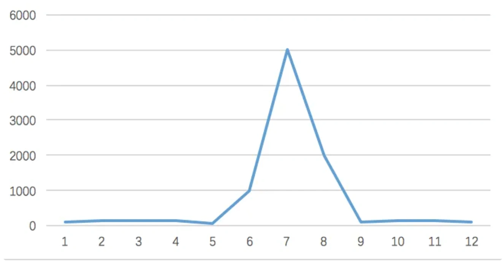

<font style="color:rgb(51, 51, 51);background-color:rgb(248, 246, 244);">像这种瞬时高并发的场景，传统的系统很难应对，我们需要设计一套全新的系统。可以从以下几个方面入手：</font>

1. <font style="color:rgb(51, 51, 51);background-color:rgb(248, 246, 244);">页面静态化</font>
2. <font style="color:rgb(51, 51, 51);background-color:rgb(248, 246, 244);">CDN加速</font>
3. <font style="color:rgb(51, 51, 51);background-color:rgb(248, 246, 244);">缓存</font>
4. <font style="color:rgb(51, 51, 51);background-color:rgb(248, 246, 244);">mq异步处理</font>
5. <font style="color:rgb(51, 51, 51);background-color:rgb(248, 246, 244);">限流</font>
6. <font style="color:rgb(51, 51, 51);background-color:rgb(248, 246, 244);">分布式锁</font>

## **<font style="color:rgb(34, 34, 34);background-color:rgb(248, 246, 244);">2. 页面静态化</font>**
<font style="color:rgb(51, 51, 51);background-color:rgb(248, 246, 244);">活动页面是用户流量的第一入口，所以是并发量最大的地方。</font>

<font style="color:rgb(51, 51, 51);background-color:rgb(248, 246, 244);">如果这些流量都能直接访问服务端，恐怕服务端会因为承受不住这么大的压力，而直接挂掉。</font>

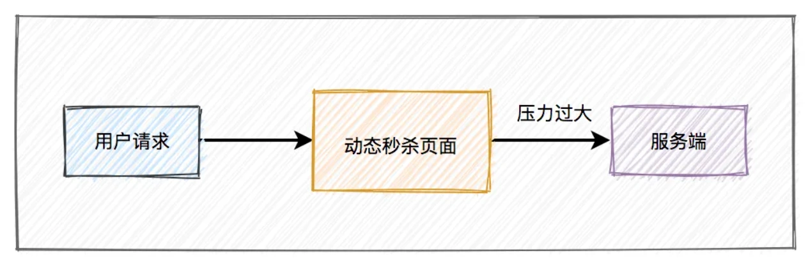

<font style="color:rgb(51, 51, 51);background-color:rgb(248, 246, 244);">活动页面绝大多数内容是固定的，比如：商品名称、商品描述、图片等。为了减少不必要的服务端请求，通常情况下，会对活动页面做静态化处理。用户浏览商品等常规操作，并不会请求到服务端。只有到了秒杀时间点，并且用户主动点了秒杀按钮才允许访问服务端。</font>

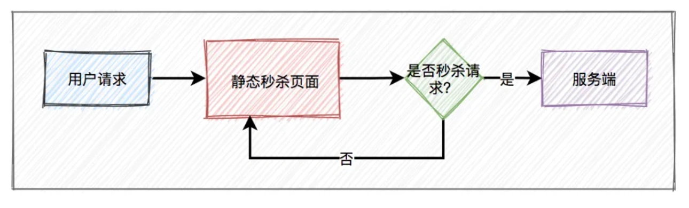

<font style="color:rgb(51, 51, 51);background-color:rgb(248, 246, 244);">这样能过滤大部分无效请求。</font>

<font style="color:rgb(51, 51, 51);background-color:rgb(248, 246, 244);">但只做页面静态化还不够，因为用户分布在全国各地，有些人在北京，有些人在成都，有些人在深圳，地域相差很远，网速各不相同。</font>

<font style="color:rgb(51, 51, 51);background-color:rgb(248, 246, 244);">如何才能让用户最快访问到活动页面呢？</font>

<font style="color:rgb(51, 51, 51);background-color:rgb(248, 246, 244);">这就需要使用CDN，它的全称是Content Delivery Network，即内容分发网络。</font>

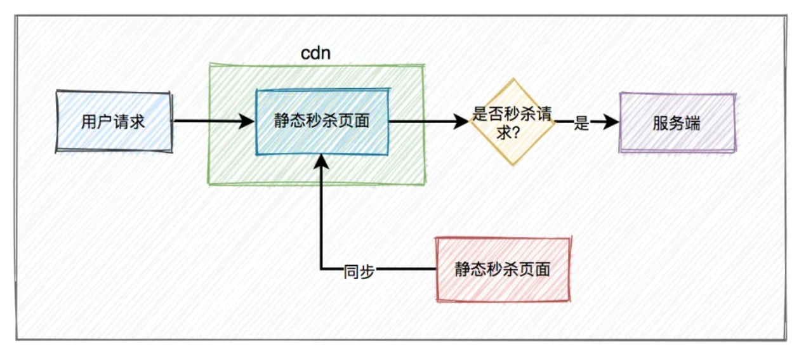

<font style="color:rgb(51, 51, 51);background-color:rgb(248, 246, 244);">使用户就近获取所需内容，降低网络拥塞，提高用户访问响应速度和命中率。</font>

## **<font style="color:rgb(34, 34, 34);background-color:rgb(248, 246, 244);">3 秒杀按钮</font>**
<font style="color:rgb(51, 51, 51);background-color:rgb(248, 246, 244);">大部分用户怕错过秒杀时间点，一般会提前进入活动页面。此时看到的秒杀按钮是置灰，不可点击的。只有到了秒杀时间点那一时刻，秒杀按钮才会自动点亮，变成可点击的。</font>

<font style="color:rgb(51, 51, 51);background-color:rgb(248, 246, 244);">但此时很多用户已经迫不及待了，通过不停刷新页面，争取在第一时间看到秒杀按钮的点亮。</font>

<font style="color:rgb(51, 51, 51);background-color:rgb(248, 246, 244);">从前面得知，该活动页面是静态的。那么我们在静态页面中如何控制秒杀按钮，只在秒杀时间点时才点亮呢？</font>

<font style="color:rgb(51, 51, 51);background-color:rgb(248, 246, 244);">没错，使用js文件控制。</font>

<font style="color:rgb(51, 51, 51);background-color:rgb(248, 246, 244);">为了性能考虑，一般会将css、js和图片等静态资源文件提前缓存到CDN上，让用户能够就近访问秒杀页面。</font>

<font style="color:rgb(51, 51, 51);background-color:rgb(248, 246, 244);">看到这里，有些聪明的小伙伴，可能会问：CDN上的js文件是如何更新的？</font>

<font style="color:rgb(51, 51, 51);background-color:rgb(248, 246, 244);">秒杀开始之前，js标志为false，还有另外一个随机参数。</font>

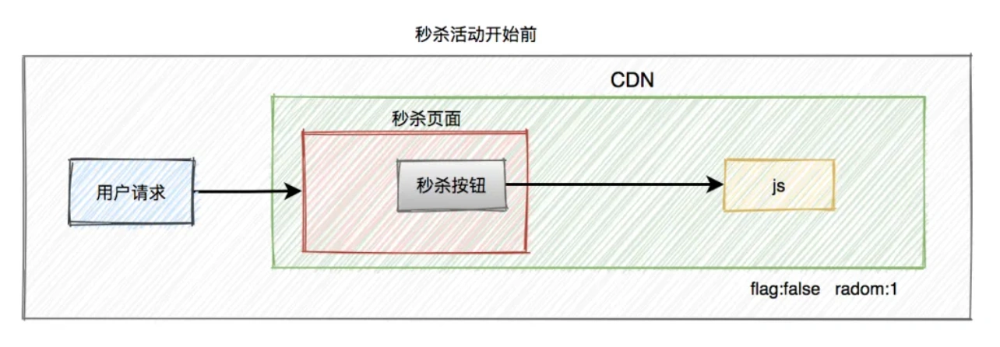

<font style="color:rgb(51, 51, 51);background-color:rgb(248, 246, 244);">当秒杀开始的时候系统会生成一个新的js文件，此时标志为true，并且随机参数生成一个新值，然后同步给CDN。由于有了这个随机参数，CDN不会缓存数据，每次都能从CDN中获取最新的js代码。</font>

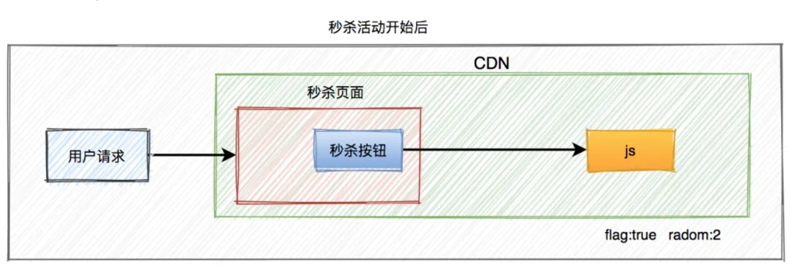

<font style="color:rgb(51, 51, 51);background-color:rgb(248, 246, 244);">此外，前端还可以加一个定时器，控制比如：10秒之内，只允许发起一次请求。如果用户点击了一次秒杀按钮，则在10秒之内置灰，不允许再次点击，等到过了时间限制，又允许重新点击该按钮。</font>

## **<font style="color:rgb(34, 34, 34);background-color:rgb(248, 246, 244);">4 读多写少</font>**
<font style="color:rgb(51, 51, 51);background-color:rgb(248, 246, 244);">在秒杀的过程中，系统一般会先查一下库存是否足够，如果足够才允许下单，写数据库。如果不够，则直接返回该商品已经抢完。</font>

<font style="color:rgb(51, 51, 51);background-color:rgb(248, 246, 244);">由于大量用户抢少量商品，只有极少部分用户能够抢成功，所以绝大部分用户在秒杀时，库存其实是不足的，系统会直接返回该商品已经抢完。</font>

<font style="color:rgb(51, 51, 51);background-color:rgb(248, 246, 244);">这是非常典型的：读多写少 的场景。</font>

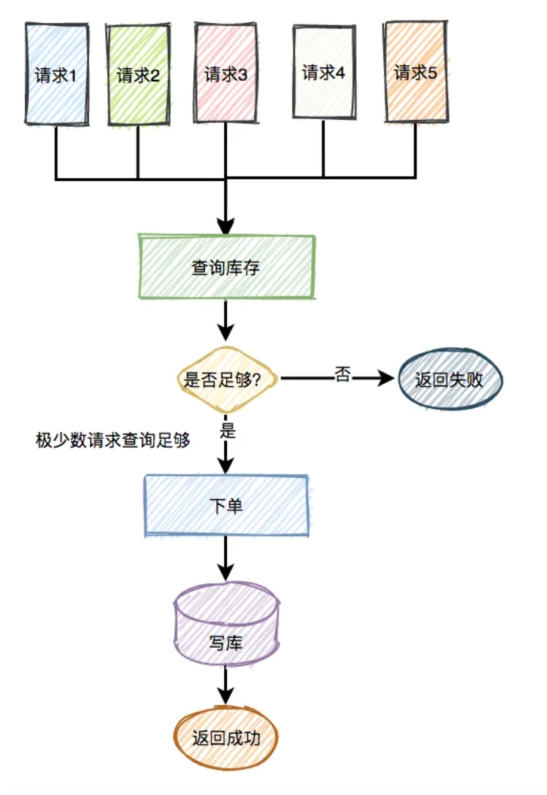

<font style="color:rgb(51, 51, 51);background-color:rgb(248, 246, 244);">如果有数十万的请求过来，同时通过数据库查缓存是否足够，此时数据库可能会挂掉。因为数据库的连接资源非常有限，比如：mysql，无法同时支持这么多的连接。</font>

<font style="color:rgb(51, 51, 51);background-color:rgb(248, 246, 244);">而应该改用缓存，比如：redis。</font>

<font style="color:rgb(51, 51, 51);background-color:rgb(248, 246, 244);">即便用了redis，也需要部署多个节点。</font>

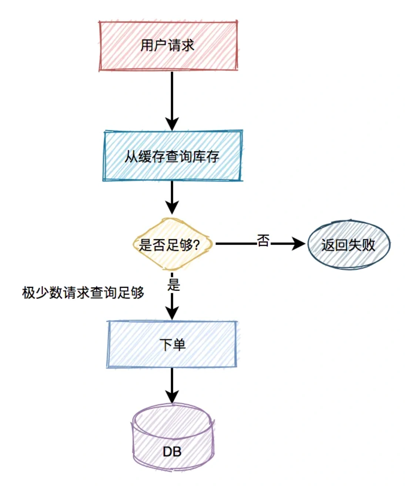

## **<font style="color:rgb(34, 34, 34);background-color:rgb(248, 246, 244);">5 缓存问题</font>**
<font style="color:rgb(51, 51, 51);background-color:rgb(248, 246, 244);">通常情况下，我们需要在redis中保存商品信息，里面包含：商品id、商品名称、规格属性、库存等信息，同时数据库中也要有相关信息，毕竟缓存并不完全可靠。</font>

<font style="color:rgb(51, 51, 51);background-color:rgb(248, 246, 244);">用户在点击秒杀按钮，请求秒杀接口的过程中，需要传入的商品id参数，然后服务端需要校验该商品是否合法。</font>

<font style="color:rgb(51, 51, 51);background-color:rgb(248, 246, 244);">大致流程如下图所示：</font>

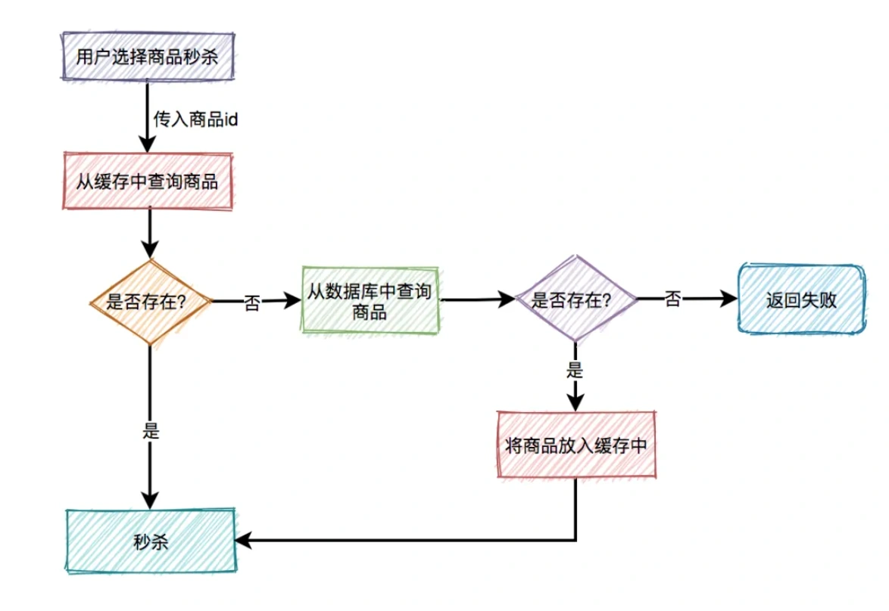

<font style="color:rgb(51, 51, 51);background-color:rgb(248, 246, 244);">根据商品id，先从缓存中查询商品，如果商品存在，则参与秒杀。如果不存在，则需要从数据库中查询商品，如果存在，则将商品信息放入缓存，然后参与秒杀。如果商品不存在，则直接提示失败。</font>

<font style="color:rgb(51, 51, 51);background-color:rgb(248, 246, 244);">这个过程表面上看起来是OK的，但是如果深入分析一下会发现一些问题。</font>

### **<font style="color:rgb(34, 34, 34);background-color:rgb(248, 246, 244);">5.1 缓存击穿</font>**
<font style="color:rgb(51, 51, 51);background-color:rgb(248, 246, 244);">比如商品A第一次秒杀时，缓存中是没有数据的，但数据库中有。虽说上面有如果从数据库中查到数据，则放入缓存的逻辑。</font>

<font style="color:rgb(51, 51, 51);background-color:rgb(248, 246, 244);">然而，在高并发下，同一时刻会有大量的请求，都在秒杀同一件商品，这些请求同时去查缓存中没有数据，然后又同时访问数据库。结果悲剧了，数据库可能扛不住压力，直接挂掉。</font>

<font style="color:rgb(51, 51, 51);background-color:rgb(248, 246, 244);">如何解决这个问题呢？</font>

<font style="color:rgb(51, 51, 51);background-color:rgb(248, 246, 244);">这就需要加锁，最好使用分布式锁。</font>

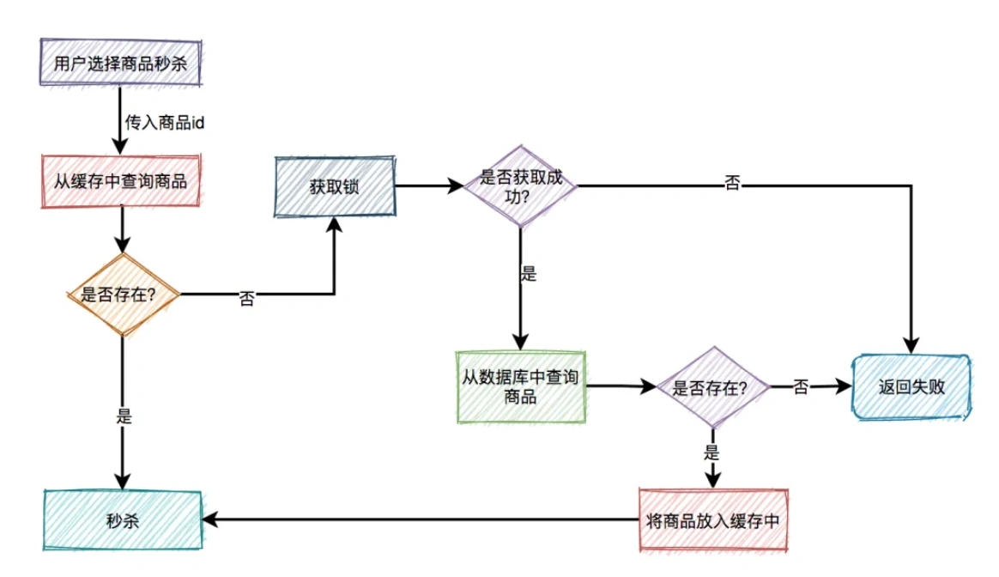

<font style="color:rgb(51, 51, 51);background-color:rgb(248, 246, 244);">当然，针对这种情况，最好在项目启动之前，先把缓存进行预热。即事先把所有的商品，同步到缓存中，这样商品基本都能直接从缓存中获取到，就不会出现缓存击穿的问题了。</font>

<font style="color:rgb(51, 51, 51);background-color:rgb(248, 246, 244);">是不是上面加锁这一步可以不需要了？</font>

<font style="color:rgb(51, 51, 51);background-color:rgb(248, 246, 244);">表面上看起来，确实可以不需要。但如果缓存中设置的过期时间不对，缓存提前过期了，或者缓存被不小心删除了，如果不加速同样可能出现缓存击穿。</font>

<font style="color:rgb(51, 51, 51);background-color:rgb(248, 246, 244);">其实这里加锁，相当于买了一份保险。</font>

### **<font style="color:rgb(34, 34, 34);background-color:rgb(248, 246, 244);">5.2 缓存穿透</font>**
<font style="color:rgb(51, 51, 51);background-color:rgb(248, 246, 244);">如果有大量的请求传入的商品id，在缓存中和数据库中都不存在，这些请求不就每次都会穿透过缓存，而直接访问数据库了。</font>

<font style="color:rgb(51, 51, 51);background-color:rgb(248, 246, 244);">由于前面已经加了锁，所以即使这里的并发量很大，也不会导致数据库直接挂掉。</font>

<font style="color:rgb(51, 51, 51);background-color:rgb(248, 246, 244);">但很显然这些请求的处理性能并不好，有没有更好的解决方案？</font>

<font style="color:rgb(51, 51, 51);background-color:rgb(248, 246, 244);">这时可以想到布隆过滤器。</font>

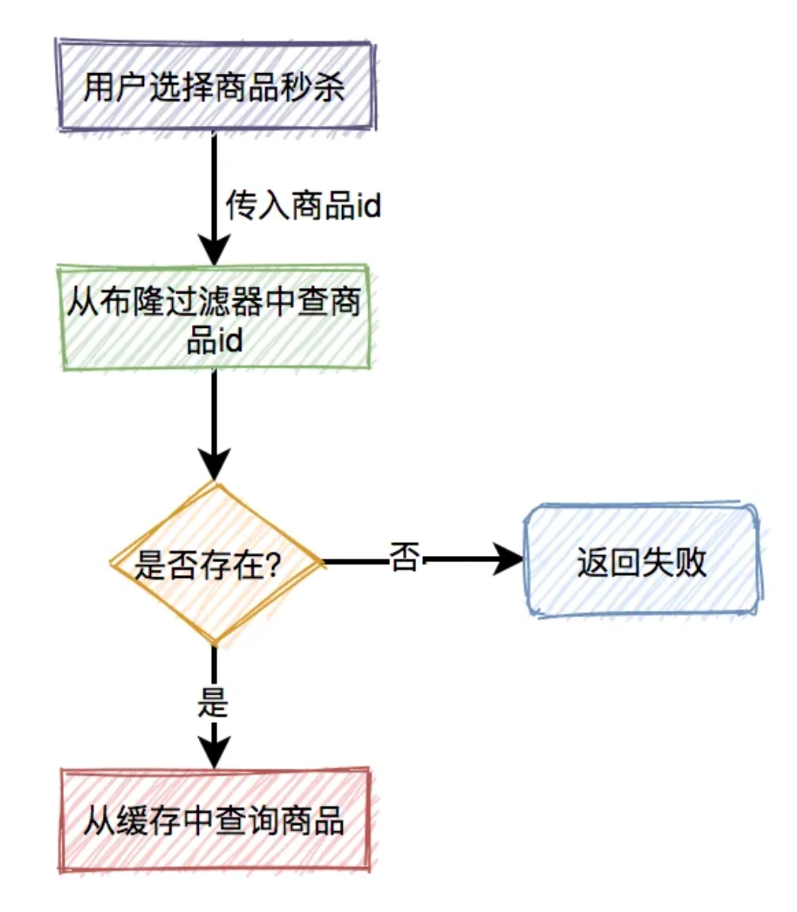

<font style="color:rgb(51, 51, 51);background-color:rgb(248, 246, 244);">系统根据商品id，先从布隆过滤器中查询该id是否存在，如果存在则允许从缓存中查询数据，如果不存在，则直接返回失败。</font>

<font style="color:rgb(51, 51, 51);background-color:rgb(248, 246, 244);">虽说该方案可以解决缓存穿透问题，但是又会引出另外一个问题：布隆过滤器中的数据如何更缓存中的数据保持一致？</font>

<font style="color:rgb(51, 51, 51);background-color:rgb(248, 246, 244);">这就要求，如果缓存中数据有更新，则要及时同步到布隆过滤器中。如果数据同步失败了，还需要增加重试机制，而且跨数据源，能保证数据的实时一致性吗？</font>

<font style="color:rgb(51, 51, 51);background-color:rgb(248, 246, 244);">显然是不行的。</font>

<font style="color:rgb(51, 51, 51);background-color:rgb(248, 246, 244);">所以布隆过滤器绝大部分使用在缓存数据更新很少的场景中。</font>

<font style="color:rgb(51, 51, 51);background-color:rgb(248, 246, 244);">如果缓存数据更新非常频繁，又该如何处理呢？</font>

<font style="color:rgb(51, 51, 51);background-color:rgb(248, 246, 244);">这时，就需要把不存在的商品id也缓存起来。</font>

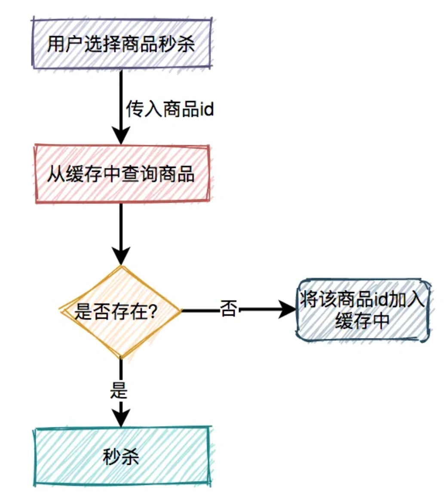

<font style="color:rgb(51, 51, 51);background-color:rgb(248, 246, 244);">下次，再有该商品id的请求过来，则也能从缓存中查到数据，只不过该数据比较特殊，表示商品不存在。需要特别注意的是，这种特殊缓存设置的超时时间应该尽量短一点。</font>

## **<font style="color:rgb(34, 34, 34);background-color:rgb(248, 246, 244);">6 库存问题</font>**
<font style="color:rgb(51, 51, 51);background-color:rgb(248, 246, 244);">对于库存问题看似简单，实则里面还是有些东西。</font>

<font style="color:rgb(51, 51, 51);background-color:rgb(248, 246, 244);">真正的秒杀商品的场景，不是说扣完库存，就完事了，如果用户在一段时间内，还没完成支付，扣减的库存是要加回去的。</font>

<font style="color:rgb(51, 51, 51);background-color:rgb(248, 246, 244);">所以，在这里引出了一个预扣库存的概念，预扣库存的主要流程如下：</font>


<font style="color:rgb(51, 51, 51);background-color:rgb(248, 246, 244);">扣减库存中除了上面说到的预扣库存和回退库存之外，还需要特别注意的是库存不足和库存超卖问题。</font>

### **<font style="color:rgb(34, 34, 34);background-color:rgb(248, 246, 244);">6.1 数据库扣减库存</font>**
<font style="color:rgb(51, 51, 51);background-color:rgb(248, 246, 244);">使用数据库扣减库存，是最简单的实现方案了，假设扣减库存的sql如下：</font>

```plain
update product set stock=stock-1 where id=123;
```

<font style="color:rgb(51, 51, 51);background-color:rgb(248, 246, 244);">这种写法对于扣减库存是没有问题的，但如何控制库存不足的情况下，不让用户操作呢？</font>

<font style="color:rgb(51, 51, 51);background-color:rgb(248, 246, 244);">这就需要在update之前，先查一下库存是否足够了。</font>

<font style="color:rgb(51, 51, 51);background-color:rgb(248, 246, 244);">伪代码如下：</font>

```plain
int stock = mapper.getStockById(123);
if(stock > 0) {
  int count = mapper.updateStock(123);
  if(count > 0) {
    addOrder(123);
  }
}
```

<font style="color:rgb(51, 51, 51);background-color:rgb(248, 246, 244);">大家有没有发现这段代码的问题？</font>

<font style="color:rgb(51, 51, 51);background-color:rgb(248, 246, 244);">没错，查询操作和更新操作不是原子性的，会导致在并发的场景下，出现库存超卖的情况。</font>

<font style="color:rgb(51, 51, 51);background-color:rgb(248, 246, 244);">有人可能会说，这样好办，加把锁，不就搞定了，比如使用synchronized关键字。</font>

<font style="color:rgb(51, 51, 51);background-color:rgb(248, 246, 244);">确实，可以，但是性能不够好。</font>

<font style="color:rgb(51, 51, 51);background-color:rgb(248, 246, 244);">还有更优雅的处理方案，即基于数据库的乐观锁，这样会少一次数据库查询，而且能够天然的保证数据操作的原子性。</font>

```plain
update product set stock=stock-1 where id=product and stock > 0;
```

<font style="color:rgb(51, 51, 51);background-color:rgb(248, 246, 244);">在sql最后加上：stock > 0，就能保证不会出现超卖的情况。</font>

<font style="color:rgb(51, 51, 51);background-color:rgb(248, 246, 244);">但需要频繁访问数据库，我们都知道数据库连接是非常昂贵的资源。在高并发的场景下，可能会造成系统雪崩。而且，容易出现多个请求，同时竞争行锁的情况，造成相互等待，从而出现死锁的问题。</font>

### **<font style="color:rgb(34, 34, 34);background-color:rgb(248, 246, 244);">6.2 redis扣减库存</font>**
<font style="color:rgb(51, 51, 51);background-color:rgb(248, 246, 244);">redis的incr方法是原子性的，可以用该方法扣减库存。伪代码如下：</font>

```fortran
boolean exist = redisClient.query(productId,userId);
  if(exist) {
    return -1;
  }
  int stock = redisClient.queryStock(productId);
  if(stock <=0) {
    return 0;
  }
  redisClient.incrby(productId, -1);
  redisClient.add(productId,userId);
return 1;
```

<font style="color:rgb(51, 51, 51);background-color:rgb(248, 246, 244);">代码流程如下：</font>

1. <font style="color:rgb(51, 51, 51);background-color:rgb(248, 246, 244);">先判断该用户有没有秒杀过该商品，如果已经秒杀过，则直接返回-1。</font>
2. <font style="color:rgb(51, 51, 51);background-color:rgb(248, 246, 244);">查询库存，如果库存小于等于0，则直接返回0，表示库存不足。</font>
3. <font style="color:rgb(51, 51, 51);background-color:rgb(248, 246, 244);">如果库存充足，则扣减库存，然后将本次秒杀记录保存起来。然后返回1，表示成功。</font>

<font style="color:rgb(51, 51, 51);background-color:rgb(248, 246, 244);">估计很多小伙伴，一开始都会按这样的思路写代码。但如果仔细想想会发现，这段代码有问题。</font>

<font style="color:rgb(51, 51, 51);background-color:rgb(248, 246, 244);">有什么问题呢？</font>

<font style="color:rgb(51, 51, 51);background-color:rgb(248, 246, 244);">如果在高并发下，有多个请求同时查询库存，当时都大于0。由于查询库存和更新库存非原则操作，则会出现库存为负数的情况，即库存超卖。</font>

<font style="color:rgb(51, 51, 51);background-color:rgb(248, 246, 244);">当然有人可能会说，加个synchronized不就解决问题？</font>

<font style="color:rgb(51, 51, 51);background-color:rgb(248, 246, 244);">调整后代码如下：</font>

```kotlin
boolean exist = redisClient.query(productId,userId);
   if(exist) {
    return -1;
   }
   synchronized(this) {
       int stock = redisClient.queryStock(productId);
       if(stock <=0) {
         return 0;
       }
       redisClient.incrby(productId, -1);
       redisClient.add(productId,userId);
   }

return 1;
```

<font style="color:rgb(51, 51, 51);background-color:rgb(248, 246, 244);">加synchronized确实能解决库存为负数问题，但是这样会导致接口性能急剧下降，每次查询都需要竞争同一把锁，显然不太合理。</font>

<font style="color:rgb(51, 51, 51);background-color:rgb(248, 246, 244);">为了解决上面的问题，代码优化如下：</font>

```kotlin
boolean exist = redisClient.query(productId,userId);
if(exist) {
  return -1;
}
if(redisClient.incrby(productId, -1)<0) {
  return 0;
}
redisClient.add(productId,userId);
return 1;
```

<font style="color:rgb(51, 51, 51);background-color:rgb(248, 246, 244);">该代码主要流程如下：</font>

1. <font style="color:rgb(51, 51, 51);background-color:rgb(248, 246, 244);">先判断该用户有没有秒杀过该商品，如果已经秒杀过，则直接返回-1。</font>
2. <font style="color:rgb(51, 51, 51);background-color:rgb(248, 246, 244);">扣减库存，判断返回值是否小于0，如果小于0，则直接返回0，表示库存不足。</font>
3. <font style="color:rgb(51, 51, 51);background-color:rgb(248, 246, 244);">如果扣减库存后，返回值大于或等于0，则将本次秒杀记录保存起来。然后返回1，表示成功。</font>

<font style="color:rgb(51, 51, 51);background-color:rgb(248, 246, 244);">该方案咋一看，好像没问题。</font>

<font style="color:rgb(51, 51, 51);background-color:rgb(248, 246, 244);">但如果在高并发场景中，有多个请求同时扣减库存，大多数请求的incrby操作之后，结果都会小于0。</font>

<font style="color:rgb(51, 51, 51);background-color:rgb(248, 246, 244);">虽说，库存出现负数，不会出现超卖的问题。但由于这里是预减库存，如果负数值负的太多的话，后面万一要回退库存时，就会导致库存不准。</font>

<font style="color:rgb(51, 51, 51);background-color:rgb(248, 246, 244);">那么，有没有更好的方案呢？</font>

### **<font style="color:rgb(34, 34, 34);background-color:rgb(248, 246, 244);">6.3 lua脚本扣减库存</font>**
<font style="color:rgb(51, 51, 51);background-color:rgb(248, 246, 244);">我们都知道lua脚本，是能够保证原子性的，它跟redis一起配合使用，能够完美解决上面的问题。</font>

<font style="color:rgb(51, 51, 51);background-color:rgb(248, 246, 244);">lua脚本有段非常经典的代码：</font>

```plain
StringBuilder lua = new StringBuilder();
  lua.append("if (redis.call('exists', KEYS[1]) == 1) then");
  lua.append("    local stock = tonumber(redis.call('get', KEYS[1]));");
  lua.append("    if (stock == -1) then");
  lua.append("        return 1;");
  lua.append("    end;");
  lua.append("    if (stock > 0) then");
  lua.append("        redis.call('incrby', KEYS[1], -1);");
  lua.append("        return stock;");
  lua.append("    end;");
  lua.append("    return 0;");
  lua.append("end;");
  lua.append("return -1;");
```

<font style="color:rgb(51, 51, 51);background-color:rgb(248, 246, 244);">该代码的主要流程如下：</font>

1. <font style="color:rgb(51, 51, 51);background-color:rgb(248, 246, 244);">先判断商品id是否存在，如果不存在则直接返回。</font>
2. <font style="color:rgb(51, 51, 51);background-color:rgb(248, 246, 244);">获取该商品id的库存，判断库存如果是-1，则直接返回，表示不限制库存。</font>
3. <font style="color:rgb(51, 51, 51);background-color:rgb(248, 246, 244);">如果库存大于0，则扣减库存。</font>
4. <font style="color:rgb(51, 51, 51);background-color:rgb(248, 246, 244);">如果库存等于0，是直接返回，表示库存不足。</font>

## **<font style="color:rgb(34, 34, 34);background-color:rgb(248, 246, 244);">7 分布式锁</font>**
<font style="color:rgb(51, 51, 51);background-color:rgb(248, 246, 244);">之前我提到过，在秒杀的时候，需要先从缓存中查商品是否存在，如果不存在，则会从数据库中查商品。如果数据库中，则将该商品放入缓存中，然后返回。如果数据库中没有，则直接返回失败。</font>

<font style="color:rgb(51, 51, 51);background-color:rgb(248, 246, 244);">大家试想一下，如果在高并发下，有大量的请求都去查一个缓存中不存在的商品，这些请求都会直接打到数据库。数据库由于承受不住压力，而直接挂掉。</font>

<font style="color:rgb(51, 51, 51);background-color:rgb(248, 246, 244);">那么如何解决这个问题呢？</font>

<font style="color:rgb(51, 51, 51);background-color:rgb(248, 246, 244);">这就需要用redis分布式锁了。</font>

### **<font style="color:rgb(34, 34, 34);background-color:rgb(248, 246, 244);">7.1 setNx加锁</font>**
<font style="color:rgb(51, 51, 51);background-color:rgb(248, 246, 244);">使用redis的分布式锁，首先想到的是setNx命令。</font>

```plain
if (jedis.setnx(lockKey, val) == 1) {
   jedis.expire(lockKey, timeout);
}
```

<font style="color:rgb(51, 51, 51);background-color:rgb(248, 246, 244);">用该命令其实可以加锁，但和后面的设置超时时间是分开的，并非原子操作。</font>

<font style="color:rgb(51, 51, 51);background-color:rgb(248, 246, 244);">假如加锁成功了，但是设置超时时间失败了，该lockKey就变成永不失效的了。在高并发场景中，该问题会导致非常严重的后果。</font>

<font style="color:rgb(51, 51, 51);background-color:rgb(248, 246, 244);">那么，有没有保证原子性的加锁命令呢？</font>

### **<font style="color:rgb(34, 34, 34);background-color:rgb(248, 246, 244);">7.2 set加锁</font>**
<font style="color:rgb(51, 51, 51);background-color:rgb(248, 246, 244);">使用redis的set命令，它可以指定多个参数。</font>

```plain
String result = jedis.set(lockKey, requestId, "NX", "PX", expireTime);
if ("OK".equals(result)) {
    return true;
}
return false;
```

<font style="color:rgb(51, 51, 51);background-color:rgb(248, 246, 244);">其中：</font>

+ <font style="color:rgb(51, 51, 51);background-color:rgb(248, 246, 244);">lockKey：锁的标识</font>
+ <font style="color:rgb(51, 51, 51);background-color:rgb(248, 246, 244);">requestId：请求id</font>
+ <font style="color:rgb(51, 51, 51);background-color:rgb(248, 246, 244);">NX：只在键不存在时，才对键进行设置操作。</font>
+ <font style="color:rgb(51, 51, 51);background-color:rgb(248, 246, 244);">PX：设置键的过期时间为 millisecond 毫秒。</font>
+ <font style="color:rgb(51, 51, 51);background-color:rgb(248, 246, 244);">expireTime：过期时间</font>

<font style="color:rgb(51, 51, 51);background-color:rgb(248, 246, 244);">由于该命令只有一步，所以它是原子操作。</font>

### **<font style="color:rgb(34, 34, 34);background-color:rgb(248, 246, 244);">7.3 释放锁</font>**
<font style="color:rgb(51, 51, 51);background-color:rgb(248, 246, 244);">接下来，有些朋友可能会问：在加锁时，既然已经有了lockKey锁标识，为什么要需要记录requestId呢？</font>

<font style="color:rgb(51, 51, 51);background-color:rgb(248, 246, 244);">答：requestId是在释放锁的时候用的。</font>

```kotlin
if (jedis.get(lockKey).equals(requestId)) {
    jedis.del(lockKey);
    return true;
}
return false;
```

<font style="color:rgb(51, 51, 51);background-color:rgb(248, 246, 244);">在释放锁的时候，只能释放自己加的锁，不允许释放别人加的锁。</font>

<font style="color:rgb(51, 51, 51);background-color:rgb(248, 246, 244);">这里为什么要用requestId，用userId不行吗？</font>

<font style="color:rgb(51, 51, 51);background-color:rgb(248, 246, 244);">答：如果用userId的话，假设本次请求流程走完了，准备删除锁。此时，巧合锁到了过期时间失效了。而另外一个请求，巧合使用的相同userId加锁，会成功。而本次请求删除锁的时候，删除的其实是别人的锁了。</font>

<font style="color:rgb(51, 51, 51);background-color:rgb(248, 246, 244);">当然使用lua脚本也能避免该问题：</font>

```plain
if redis.call('get', KEYS[1]) == ARGV[1] then 
 return redis.call('del', KEYS[1]) 
else 
  return 0 
end
```

<font style="color:rgb(51, 51, 51);background-color:rgb(248, 246, 244);">它能保证查询锁是否存在和删除锁是原子操作。</font>

### **<font style="color:rgb(34, 34, 34);background-color:rgb(248, 246, 244);">7.4 自旋锁</font>**
<font style="color:rgb(51, 51, 51);background-color:rgb(248, 246, 244);">上面的加锁方法看起来好像没有问题，但如果你仔细想想，如果有1万的请求同时去竞争那把锁，可能只有一个请求是成功的，其余的9999个请求都会失败。</font>

<font style="color:rgb(51, 51, 51);background-color:rgb(248, 246, 244);">在秒杀场景下，会有什么问题？</font>

<font style="color:rgb(51, 51, 51);background-color:rgb(248, 246, 244);">答：每1万个请求，有1个成功。再1万个请求，有1个成功。如此下去，直到库存不足。这就变成均匀分布的秒杀了，跟我们想象中的不一样。</font>

<font style="color:rgb(51, 51, 51);background-color:rgb(248, 246, 244);">如何解决这个问题呢？</font>

<font style="color:rgb(51, 51, 51);background-color:rgb(248, 246, 244);">答：使用自旋锁。</font>

```plain
try {
  Long start = System.currentTimeMillis();
  while(true) {
      String result = jedis.set(lockKey, requestId, "NX", "PX", expireTime);
     if ("OK".equals(result)) {
        return true;
     }
     
     long time = System.currentTimeMillis() - start;
      if (time>=timeout) {
          return false;
      }
      try {
          Thread.sleep(50);
      } catch (InterruptedException e) {
          e.printStackTrace();
      }
  }
 
} finally{
    unlock(lockKey,requestId);
}  
return false;
```

<font style="color:rgb(51, 51, 51);background-color:rgb(248, 246, 244);">在规定的时间，比如500毫秒内，自旋不断尝试加锁，如果成功则直接返回。如果失败，则休眠50毫秒，再发起新一轮的尝试。如果到了超时时间，还未加锁成功，则直接返回失败。</font>

### **<font style="color:rgb(34, 34, 34);background-color:rgb(248, 246, 244);">7.5 redisson</font>**
<font style="color:rgb(51, 51, 51);background-color:rgb(248, 246, 244);">除了上面的问题之外，使用redis分布式锁，还有锁竞争问题、续期问题、锁重入问题、多个redis实例加锁问题等。</font>

<font style="color:rgb(51, 51, 51);background-color:rgb(248, 246, 244);">这些问题使用redisson可以解决，由于篇幅的原因，在这里先保留一点悬念，有疑问的私聊给我。后面会出一个专题介绍分布式锁，敬请期待。</font>

## **<font style="color:rgb(34, 34, 34);background-color:rgb(248, 246, 244);">8 mq异步处理</font>**
<font style="color:rgb(51, 51, 51);background-color:rgb(248, 246, 244);">我们都知道在真实的秒杀场景中，有三个核心流程：</font>


<font style="color:rgb(51, 51, 51);background-color:rgb(248, 246, 244);">而这三个核心流程中，真正并发量大的是秒杀功能，下单和支付功能实际并发量很小。所以，我们在设计秒杀系统时，有必要把下单和支付功能从秒杀的主流程中拆分出来，特别是下单功能要做成mq异步处理的。而支付功能，比如支付宝支付，是业务场景本身保证的异步。</font>

<font style="color:rgb(51, 51, 51);background-color:rgb(248, 246, 244);">于是，秒杀后下单的流程变成如下：</font>

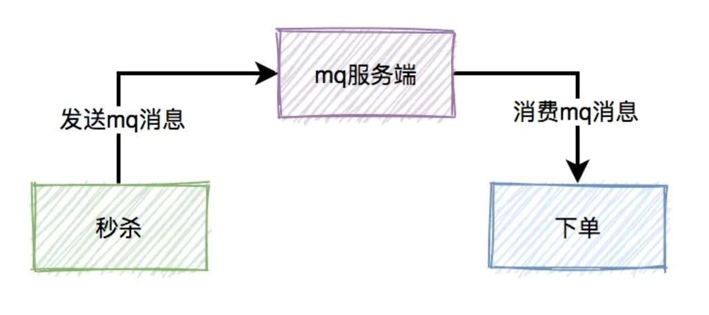

<font style="color:rgb(51, 51, 51);background-color:rgb(248, 246, 244);">如果使用mq，需要关注以下几个问题：</font>

### **<font style="color:rgb(34, 34, 34);background-color:rgb(248, 246, 244);">8.1 消息丢失问题</font>**
<font style="color:rgb(51, 51, 51);background-color:rgb(248, 246, 244);">秒杀成功了，往mq发送下单消息的时候，有可能会失败。原因有很多，比如：网络问题、broker挂了、mq服务端磁盘问题等。这些情况，都可能会造成消息丢失。</font>

<font style="color:rgb(51, 51, 51);background-color:rgb(248, 246, 244);">那么，如何防止消息丢失呢？</font>

<font style="color:rgb(51, 51, 51);background-color:rgb(248, 246, 244);">答：加一张消息发送表。</font>

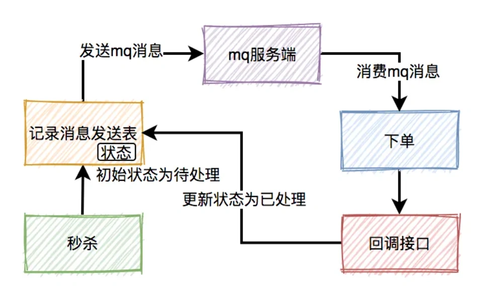

<font style="color:rgb(51, 51, 51);background-color:rgb(248, 246, 244);">在生产者发送mq消息之前，先把该条消息写入消息发送表，初始状态是待处理，然后再发送mq消息。消费者消费消息时，处理完业务逻辑之后，再回调生产者的一个接口，修改消息状态为已处理。</font>

<font style="color:rgb(51, 51, 51);background-color:rgb(248, 246, 244);">如果生产者把消息写入消息发送表之后，再发送mq消息到mq服务端的过程中失败了，造成了消息丢失。</font>

<font style="color:rgb(51, 51, 51);background-color:rgb(248, 246, 244);">这时候，要如何处理呢？</font>

<font style="color:rgb(51, 51, 51);background-color:rgb(248, 246, 244);">答：使用job，增加重试机制。</font>

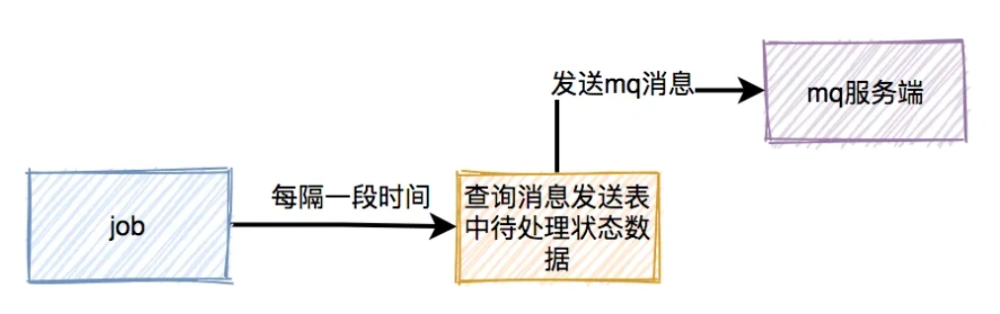

<font style="color:rgb(51, 51, 51);background-color:rgb(248, 246, 244);">用job每隔一段时间去查询消息发送表中状态为待处理的数据，然后重新发送mq消息。</font>

### **<font style="color:rgb(34, 34, 34);background-color:rgb(248, 246, 244);">8.2 重复消费问题</font>**
<font style="color:rgb(51, 51, 51);background-color:rgb(248, 246, 244);">本来消费者消费消息时，在ack应答的时候，如果网络超时，本身就可能会消费重复的消息。但由于消息发送者增加了重试机制，会导致消费者重复消息的概率增大。</font>

<font style="color:rgb(51, 51, 51);background-color:rgb(248, 246, 244);">那么，如何解决重复消息问题呢？</font>

<font style="color:rgb(51, 51, 51);background-color:rgb(248, 246, 244);">答：加一张消息处理表。</font>

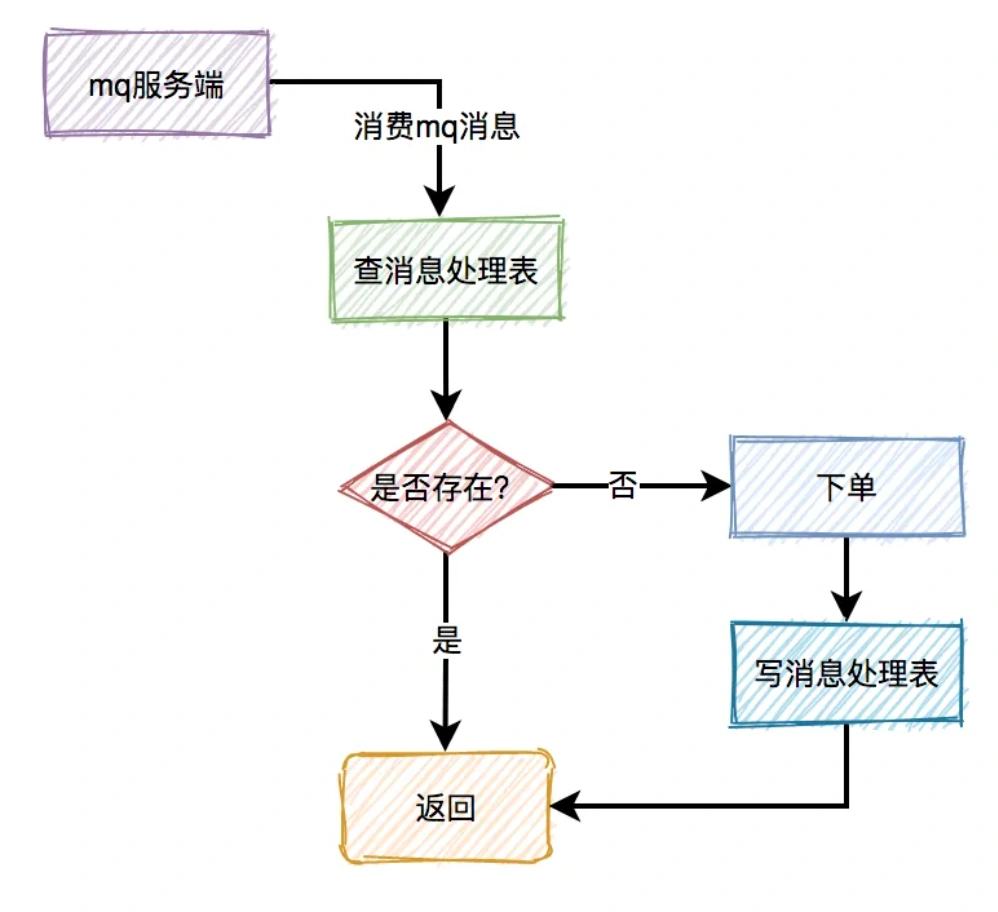

<font style="color:rgb(51, 51, 51);background-color:rgb(248, 246, 244);">消费者读到消息之后，先判断一下消息处理表，是否存在该消息，如果存在，表示是重复消费，则直接返回。如果不存在，则进行下单操作，接着将该消息写入消息处理表中，再返回。</font>

<font style="color:rgb(51, 51, 51);background-color:rgb(248, 246, 244);">有个比较关键的点是：下单和写消息处理表，要放在同一个事务中，保证原子操作。</font>

### **<font style="color:rgb(34, 34, 34);background-color:rgb(248, 246, 244);">8.3 垃圾消息问题</font>**
<font style="color:rgb(51, 51, 51);background-color:rgb(248, 246, 244);">这套方案表面上看起来没有问题，但如果出现了消息消费失败的情况。比如：由于某些原因，消息消费者下单一直失败，一直不能回调状态变更接口，这样job会不停的重试发消息。最后，会产生大量的垃圾消息。</font>

<font style="color:rgb(51, 51, 51);background-color:rgb(248, 246, 244);">那么，如何解决这个问题呢？</font>

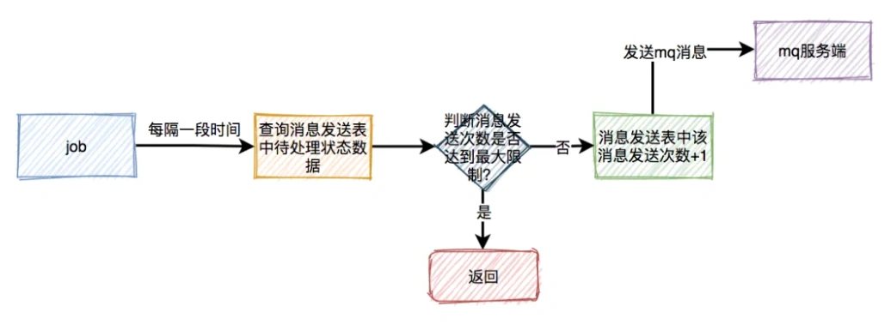

<font style="color:rgb(51, 51, 51);background-color:rgb(248, 246, 244);">每次在job重试时，需要先判断一下消息发送表中该消息的发送次数是否达到最大限制，如果达到了，则直接返回。如果没有达到，则将次数加1，然后发送消息。</font>

<font style="color:rgb(51, 51, 51);background-color:rgb(248, 246, 244);">这样如果出现异常，只会产生少量的垃圾消息，不会影响到正常的业务。</font>

### **<font style="color:rgb(34, 34, 34);background-color:rgb(248, 246, 244);">8.4 延迟消费问题</font>**
<font style="color:rgb(51, 51, 51);background-color:rgb(248, 246, 244);">通常情况下，如果用户秒杀成功了，下单之后，在15分钟之内还未完成支付的话，该订单会被自动取消，回退库存。</font>

<font style="color:rgb(51, 51, 51);background-color:rgb(248, 246, 244);">那么，在15分钟内未完成支付，订单被自动取消的功能，要如何实现呢？</font>

<font style="color:rgb(51, 51, 51);background-color:rgb(248, 246, 244);">我们首先想到的可能是job，因为它比较简单。</font>

<font style="color:rgb(51, 51, 51);background-color:rgb(248, 246, 244);">但job有个问题，需要每隔一段时间处理一次，实时性不太好。</font>

<font style="color:rgb(51, 51, 51);background-color:rgb(248, 246, 244);">还有更好的方案？</font>

<font style="color:rgb(51, 51, 51);background-color:rgb(248, 246, 244);">答：使用延迟队列。</font>

<font style="color:rgb(51, 51, 51);background-color:rgb(248, 246, 244);">我们都知道rocketmq，自带了延迟队列的功能。</font>

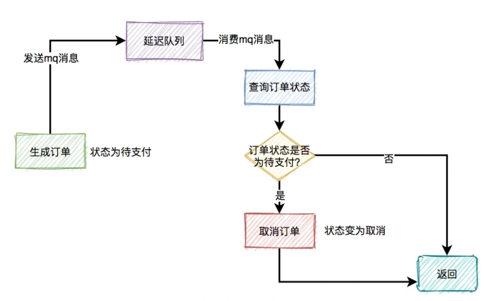

<font style="color:rgb(51, 51, 51);background-color:rgb(248, 246, 244);">下单时消息生产者会先生成订单，此时状态为待支付，然后会向延迟队列中发一条消息。达到了延迟时间，消息消费者读取消息之后，会查询该订单的状态是否为待支付。如果是待支付状态，则会更新订单状态为取消状态。如果不是待支付状态，说明该订单已经支付过了，则直接返回。</font>

<font style="color:rgb(51, 51, 51);background-color:rgb(248, 246, 244);">还有个关键点，用户完成支付之后，会修改订单状态为已支付。</font>

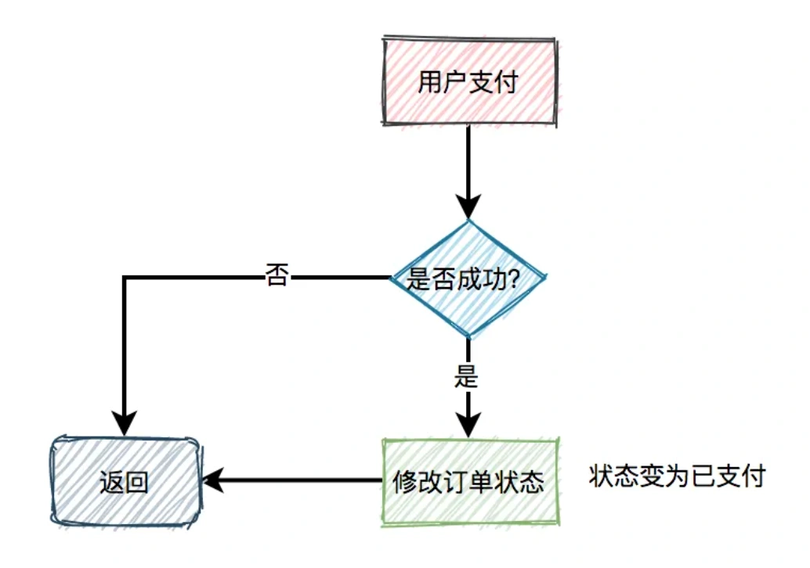

## **<font style="color:rgb(34, 34, 34);background-color:rgb(248, 246, 244);">9 如何限流？</font>**
<font style="color:rgb(51, 51, 51);background-color:rgb(248, 246, 244);">通过秒杀活动，如果我们运气爆棚，可能会用非常低的价格买到不错的商品（这种概率堪比买福利彩票中大奖）。</font>

<font style="color:rgb(51, 51, 51);background-color:rgb(248, 246, 244);">但有些高手，并不会像我们一样老老实实，通过秒杀页面点击秒杀按钮，抢购商品。他们可能在自己的服务器上，模拟正常用户登录系统，跳过秒杀页面，直接调用秒杀接口。</font>

<font style="color:rgb(51, 51, 51);background-color:rgb(248, 246, 244);">如果是我们手动操作，一般情况下，一秒钟只能点击一次秒杀按钮。</font>


<font style="color:rgb(51, 51, 51);background-color:rgb(248, 246, 244);">但是如果是服务器，一秒钟可以请求成上千接口。</font>

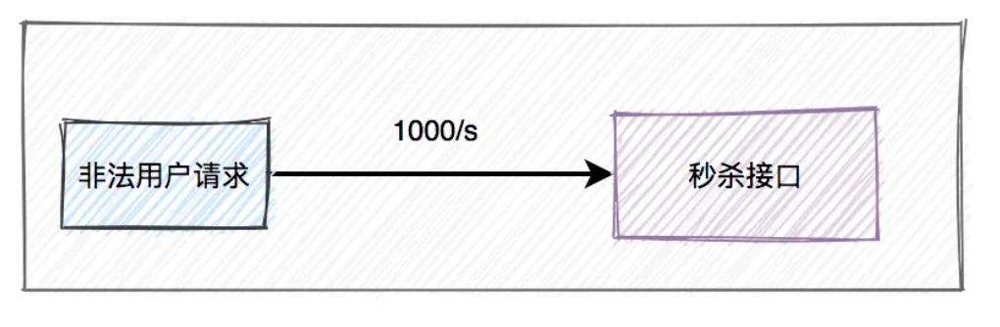

<font style="color:rgb(51, 51, 51);background-color:rgb(248, 246, 244);">这种差距实在太明显了，如果不做任何限制，绝大部分商品可能是被机器抢到，而非正常的用户，有点不太公平。</font>

<font style="color:rgb(51, 51, 51);background-color:rgb(248, 246, 244);">所以，我们有必要识别这些非法请求，做一些限制。那么，我们该如何现在这些非法请求呢？</font>

<font style="color:rgb(51, 51, 51);background-color:rgb(248, 246, 244);">目前有两种常用的限流方式：</font>

1. <font style="color:rgb(51, 51, 51);background-color:rgb(248, 246, 244);">基于nginx限流</font>
2. <font style="color:rgb(51, 51, 51);background-color:rgb(248, 246, 244);">基于redis限流</font>

### **<font style="color:rgb(34, 34, 34);background-color:rgb(248, 246, 244);">9.1 对同一用户限流</font>**
<font style="color:rgb(51, 51, 51);background-color:rgb(248, 246, 244);">为了防止某个用户，请求接口次数过于频繁，可以只针对该用户做限制。</font>

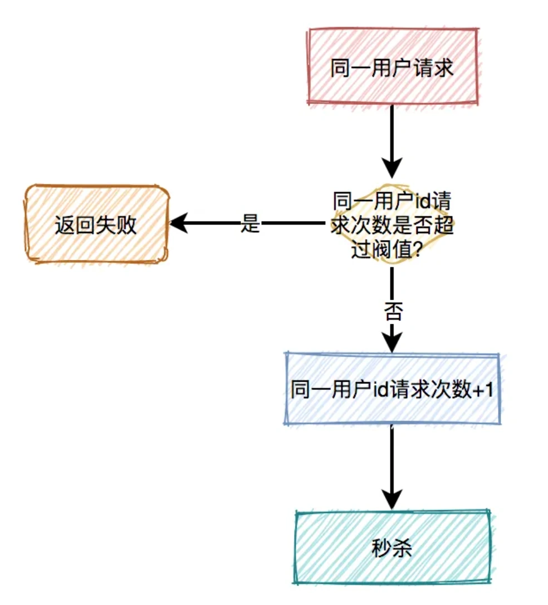

<font style="color:rgb(51, 51, 51);background-color:rgb(248, 246, 244);">限制同一个用户id，比如每分钟只能请求5次接口。</font>

### **<font style="color:rgb(34, 34, 34);background-color:rgb(248, 246, 244);">9.2 对同一ip限流</font>**
<font style="color:rgb(51, 51, 51);background-color:rgb(248, 246, 244);">有时候只对某个用户限流是不够的，有些高手可以模拟多个用户请求，这种nginx就没法识别了。</font>

<font style="color:rgb(51, 51, 51);background-color:rgb(248, 246, 244);">这时需要加同一ip限流功能。</font>

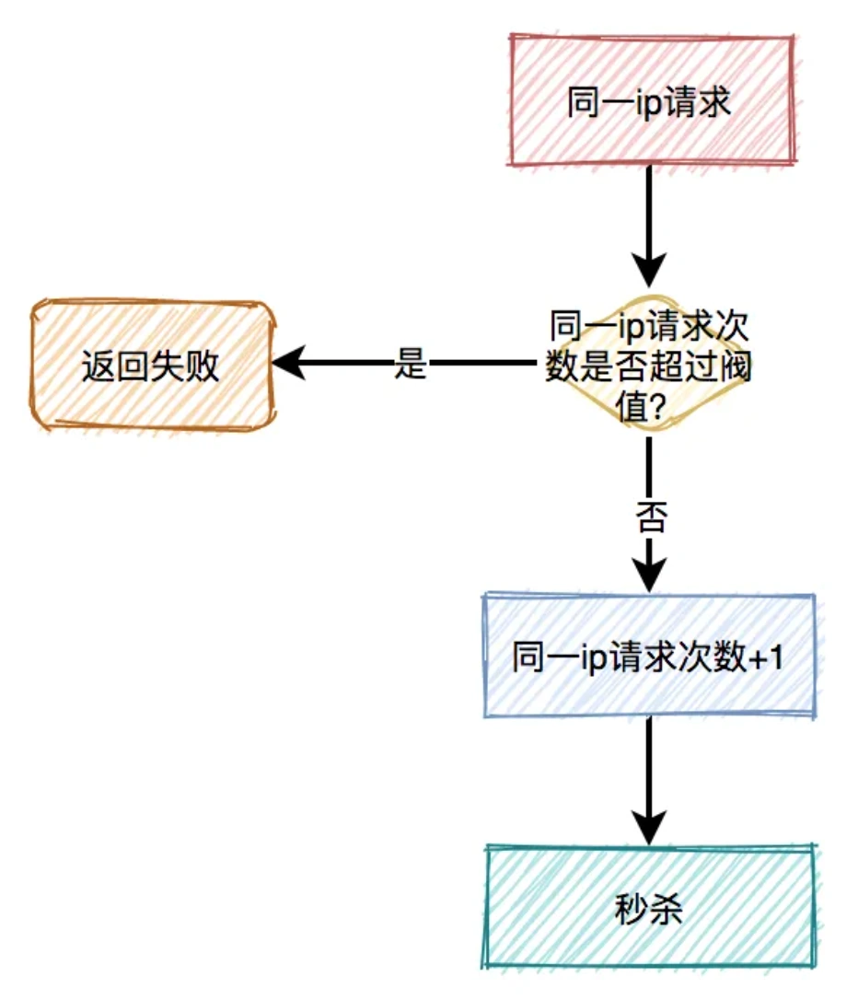

<font style="color:rgb(51, 51, 51);background-color:rgb(248, 246, 244);">限制同一个ip，比如每分钟只能请求5次接口。</font>

<font style="color:rgb(51, 51, 51);background-color:rgb(248, 246, 244);">但这种限流方式可能会有误杀的情况，比如同一个公司或网吧的出口ip是相同的，如果里面有多个正常用户同时发起请求，有些用户可能会被限制住。</font>

### **<font style="color:rgb(34, 34, 34);background-color:rgb(248, 246, 244);">9.3 对接口限流</font>**
<font style="color:rgb(51, 51, 51);background-color:rgb(248, 246, 244);">别以为限制了用户和ip就万事大吉，有些高手甚至可以使用代理，每次都请求都换一个ip。</font>

<font style="color:rgb(51, 51, 51);background-color:rgb(248, 246, 244);">这时可以限制请求的接口总次数。</font>

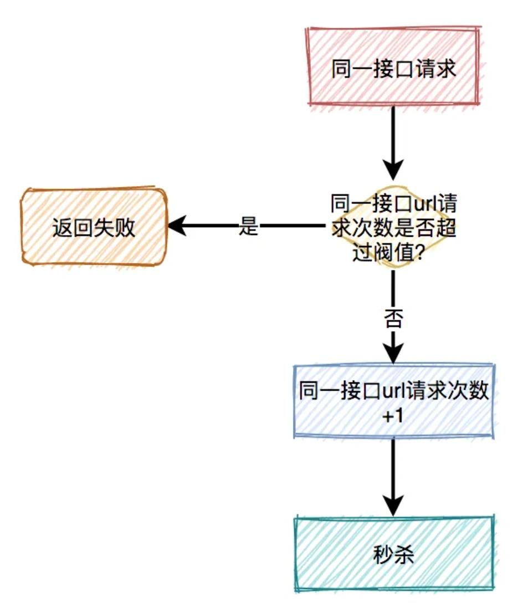

<font style="color:rgb(51, 51, 51);background-color:rgb(248, 246, 244);">在高并发场景下，这种限制对于系统的稳定性是非常有必要的。但可能由于有些非法请求次数太多，达到了该接口的请求上限，而影响其他的正常用户访问该接口。看起来有点得不偿失。</font>

### **<font style="color:rgb(34, 34, 34);background-color:rgb(248, 246, 244);">9.4 加验证码</font>**
<font style="color:rgb(51, 51, 51);background-color:rgb(248, 246, 244);">相对于上面三种方式，加验证码的方式可能更精准一些，同样能限制用户的访问频次，但好处是不会存在误杀的情况。</font>

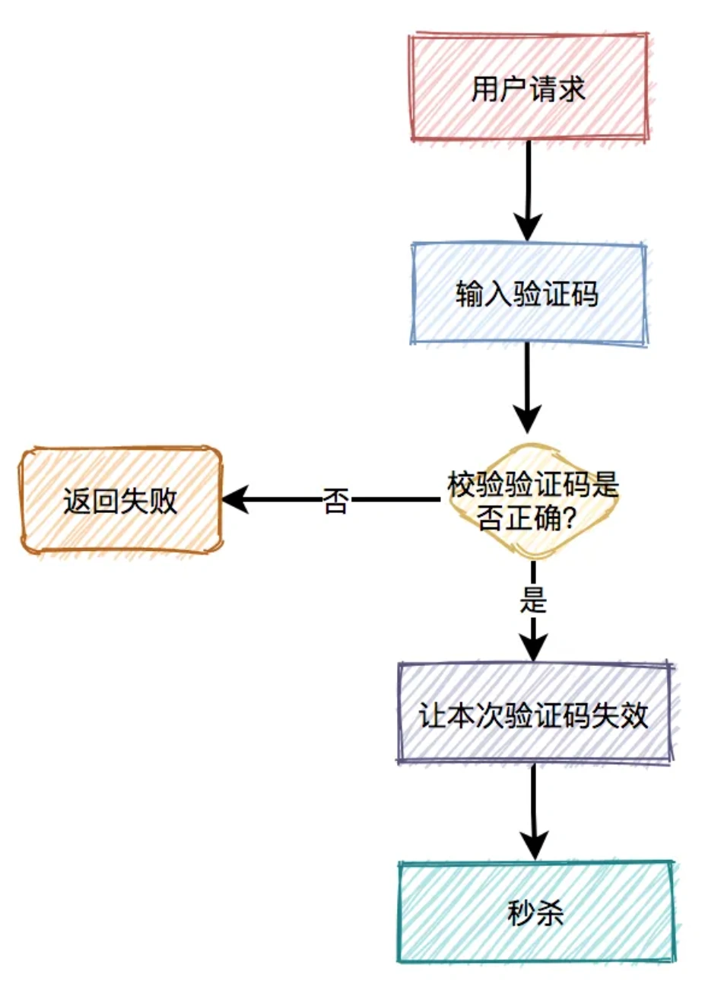

<font style="color:rgb(51, 51, 51);background-color:rgb(248, 246, 244);">通常情况下，用户在请求之前，需要先输入验证码。用户发起请求之后，服务端会去校验该验证码是否正确。只有正确才允许进行下一步操作，否则直接返回，并且提示验证码错误。</font>

<font style="color:rgb(51, 51, 51);background-color:rgb(248, 246, 244);">此外，验证码一般是一次性的，同一个验证码只允许使用一次，不允许重复使用。</font>

<font style="color:rgb(51, 51, 51);background-color:rgb(248, 246, 244);">普通验证码，由于生成的数字或者图案比较简单，可能会被破解。优点是生成速度比较快，缺点是有安全隐患。</font>

<font style="color:rgb(51, 51, 51);background-color:rgb(248, 246, 244);">还有一个验证码叫做：移动滑块，它生成速度比较慢，但比较安全，是目前各大互联网公司的首选。</font>

### **<font style="color:rgb(34, 34, 34);background-color:rgb(248, 246, 244);">9.5 提高业务门槛</font>**
<font style="color:rgb(51, 51, 51);background-color:rgb(248, 246, 244);">上面说的加验证码虽然可以限制非法用户请求，但是有些影响用户体验。用户点击秒杀按钮前，还要先输入验证码，流程显得有点繁琐，秒杀功能的流程不是应该越简单越好吗？</font>

<font style="color:rgb(51, 51, 51);background-color:rgb(248, 246, 244);">其实，有时候达到某个目的，不一定非要通过技术手段，通过业务手段也一样。</font>

<font style="color:rgb(51, 51, 51);background-color:rgb(248, 246, 244);">12306刚开始的时候，全国人民都在同一时刻抢火车票，由于并发量太大，系统经常挂。后来，重构优化之后，将购买周期放长了，可以提前20天购买火车票，并且可以在9点、10、11点、12点等整点购买火车票。调整业务之后（当然技术也有很多调整），将之前集中的请求，分散开了，一下子降低了用户并发量。</font>

<font style="color:rgb(51, 51, 51);background-color:rgb(248, 246, 244);">回到这里，我们通过提高业务门槛，比如只有会员才能参与秒杀活动，普通注册用户没有权限。或者，只有等级到达3级以上的普通用户，才有资格参加该活动。</font>

<font style="color:rgb(51, 51, 51);background-color:rgb(248, 246, 244);">这样简单的提高一点门槛，即使是黄牛党也束手无策，他们总不可能为了参加一次秒杀活动，还另外花钱充值会员吧？</font>


> 更新: 2024-05-20 17:22:04  
> 原文: <https://www.yuque.com/yuqueyonghue6cvnv/cxhfwd/osmuw5ll6xoc8692>